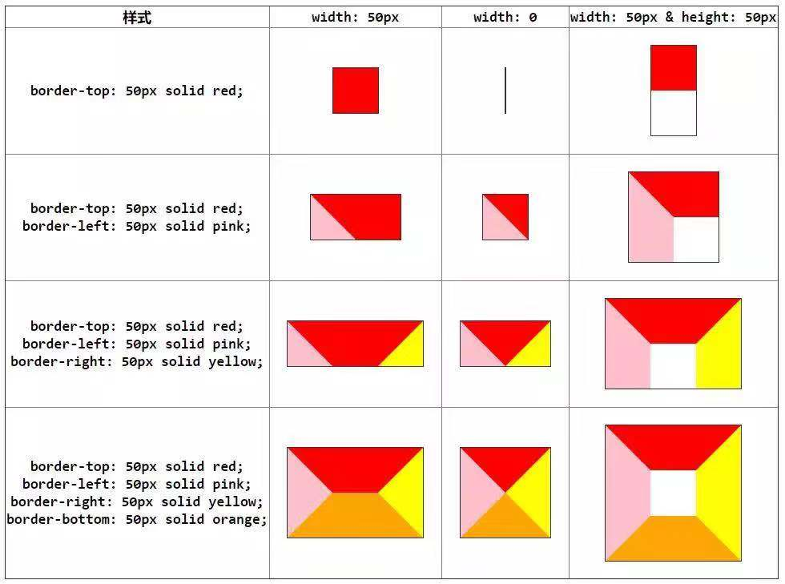
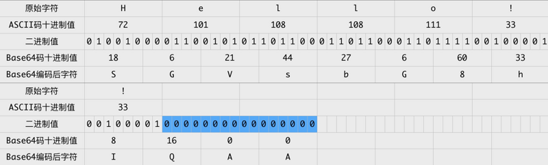
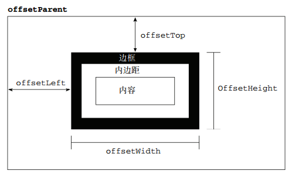
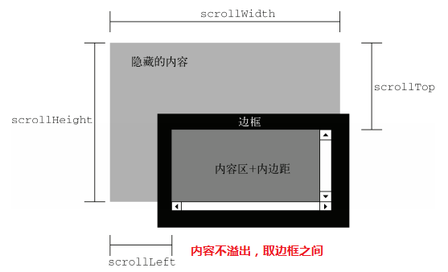
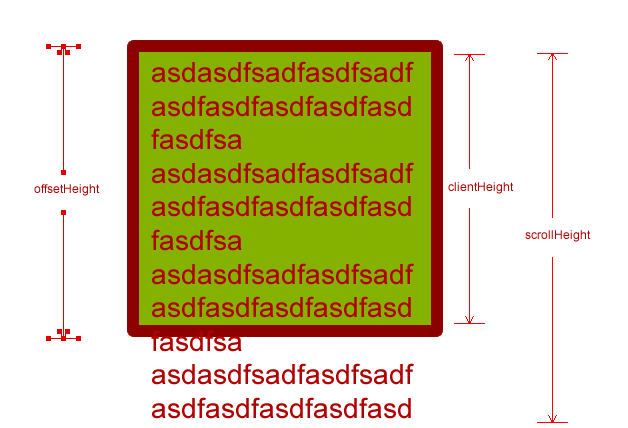
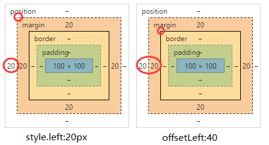
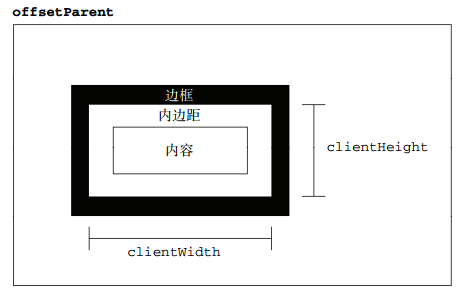
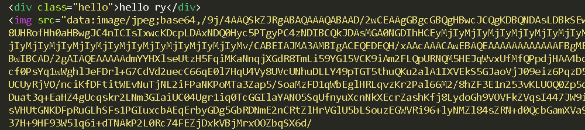

# [返回主页](https://github.com/yisainan/web-interview/blob/master/README.md)

<b><details><summary>1.实现不使用 border 画出 1px 高的线，在不同浏览器的标准模式与怪异模式下都能保持一致的效果。</summary></b>

答案：

```html
<div style="height:1px;overflow:hidden;background:red"></div>
```

[参与互动](https://github.com/yisainan/web-interview/issues/22)

</details>

<b><details><summary>2.介绍一下标准的 CSS 的盒子模型？低版本 IE 的盒子模型有什么不同的？</summary></b>

答案：

（1）有两种， IE 盒子模型、W3C 盒子模型；

（2）盒模型： 内容(content)、填充(padding)、边界(margin)、 边框(border)；

（3）区 别： IE 的 content 部分把 border 和 padding 计算了进去;

[参与互动](https://github.com/yisainan/web-interview/issues/23)

</details>

<b><details><summary>3.CSS 隐藏元素的几种方法（至少说出三种）</summary></b>

答案：

Opacity:元素本身依然占据它自己的位置并对网页的布局起作用。它也将响应用户交互;

Visibility:与 opacity 唯一不同的是它不会响应任何用户交互。此外，元素在读屏软件中也会被隐藏;

Display:display 设为 none 任何对该元素直接打用户交互操作都不可能生效。此外，读屏软件也不会读到元素的内容。这种方式产生的效果就像元素完全不存在;

Position:不会影响布局，能让元素保持可以操作;

Clip-path:clip-path 属性还没有在 IE 或者 Edge 下被完全支持。如果要在你的 clip-path 中使用外部的 SVG 文件，浏览器支持度还要低;

[参与互动](https://github.com/yisainan/web-interview/issues/24)

</details>

<b><details><summary>4.CSS 清除浮动的几种方法（至少两种）</summary></b>

答案：

```
清除浮动： 核心：clear:both;

1.使用额外标签法（不推荐使用）

在浮动的盒子下面再放一个标签，使用 clear:both;来清除浮动

a 内部标签：会将父盒子的高度重新撑开

b 外部标签：只能将浮动盒子的影响清除，但是不会撑开盒子

2.使用 overflow 清除浮动（不推荐使用）

先找到浮动盒子的父元素，给父元素添加一个属性：overflow:hidden;就会清除子元素对页面的影响

3.使用伪元素清除浮动(用的最多)

伪元素：在页面上不存在的元素，但是可以通过 css 添加上去

种类：
      :after(在。。。之后)
      :before(在。。。之前)

注意：每个元素都有自己的伪元素

.clearfix:after {
    content:"";
    height:0;
    line-height:0;
    display:block;
    clear:both;
    visibility:hidden;  /_将元素隐藏起来_/ 
      在页面的 clearfix 元素后面添加了一个空的块级元素
     （这个元素的高为 0 行高也为 0   并且这个元素清除了浮动）
}
.clearfix {
  zoom:1;/_为了兼容 IE6_/
}
```

[参与互动](https://github.com/yisainan/web-interview/issues/25)

</details>

<b><details><summary>5.页面导入样式时，使用 link 和@import 有什么区别？</summary></b>

答案：

1. Link 属于 html 标签，而@import 是 CSS 中提供的

2. 在页面加载的时候，link 会同时被加载，而@import 引用的 CSS 会在页面加载完成后才会加载引用的 CSS

3. @import 只有在 ie5 以上才可以被识别，而 link 是 html 标签，不存在浏览器兼容性问题

4. Link 引入样式的权重大于@import 的引用（@import 是将引用的样式导入到当前的页面中）

[参与互动](https://github.com/yisainan/web-interview/issues/26)

</details>

<b><details><summary>6.伪元素和伪类的区别？</summary></b>

答案：

1、伪元素使用 2 个冒号，常见的有：::before，::after，::first-line，::first-letter，::selection、::placeholder 等；

      伪类使用1个冒号，常见的有：:hover，:link，:active，:target，:not()，:focus等。

2、伪元素添加了一个页面中没有的元素（只是从视觉效果上添加了，不是在文档树中添加）；

      伪类是给页面中已经存在的元素添加一个类。

解析：

CSS 伪元素是添加到选择器的关键字，去选择元素的特定部分。它们可以用于装饰（`:first-line`，`:first-letter`）或将元素添加到标记中（与 content:...组合），而不必修改标记（`:before`，`:after`）。

- `:first-line`和`:first-letter`可以用来修饰文字。
- 上面提到的`.clearfix`方法中，使用`clear: both`来添加不占空间的元素。
- 使用`:before`和`after`展示提示中的三角箭头。鼓励关注点分离，因为三角被视为样式的一部分，而不是真正的 DOM。如果不使用额外的 HTML 元素，只用 CSS 样式绘制三角形是不太可能的。

[参考](https://css-tricks.com/almanac/selectors/a/after-and-before/)

[参与互动](https://github.com/yisainan/web-interview/issues/27)

</details>

<b><details><summary>7. CSS 选择符有哪些？哪些属性可以继承？优先级算法如何计算？ CSS3 新增伪类有那些？</summary></b>

答案：

```
        1.id选择器（ # myid）

        2.类选择器（.myclassname）

        3.标签选择器（div, h1, p）

        4.相邻选择器（h1 + p）

        5.子选择器（ul < li）

        6.后代选择器（li a）

        7.通配符选择器（ * ）

        8.属性选择器（a[rel = "external"]）

        9.伪类选择器（a: hover, li: nth - child）

    *   可继承： font-size font-family color, UL LI DL DD DT;

    *   不可继承 ：border padding margin width height ;

    *   优先级就近原则，样式定义最近者为准;

    *   载入样式以最后载入的定位为准;

优先级为:

       !important >  id > class > tag  

       important 比 内联优先级高

CSS3新增伪类举例：

    p:first-of-type 选择属于其父元素的首个 <p> 元素的每个 <p> 元素。

    p:last-of-type  选择属于其父元素的最后 <p> 元素的每个 <p> 元素。

    p:only-of-type  选择属于其父元素唯一的 <p> 元素的每个 <p> 元素。

    p:only-child    选择属于其父元素的唯一子元素的每个 <p> 元素。

    p:nth-child(2)  选择属于其父元素的第二个子元素的每个 <p> 元素。

    :enabled、:disabled 控制表单控件的禁用状态。

    :checked，单选框或复选框被选中。

```

[参与互动](https://github.com/yisainan/web-interview/issues/28)

</details>

<b><details><summary>8. 行内元素和块级元素的具体区别是什么？行内元素的 padding 和 margin 可设置吗？</summary></b>

答案：

- 块级元素(block)特性：

  - 总是独占一行，表现为另起一行开始，而且其后的元素也必须另起一行显示;
  - 宽度(width)、高度(height)、内边距(padding)和外边距(margin)都可控制;

- 内联元素(inline)特性：
  - 和相邻的内联元素在同一行;
  - 宽度(width)、高度(height)、内边距的 top/bottom(padding-top/padding-bottom)和外边距的 top/bottom(margin-top/margin-bottom)都不可改变（也就是 padding 和 margin 的 left 和 right 是可以设置的），就是里面文字或图片的大小。

那么问题来了，浏览器还有默认的天生 inline-block 元素（拥有内在尺寸，可设置高宽，但不会自动换行），有哪些？

答案：`<input> 、 、<button> 、<texterea> 、<label>。`

[参与互动](https://github.com/yisainan/web-interview/issues/29)

</details>

<b><details><summary>9. 什么是外边距重叠？重叠的结果是什么？</summary></b>

答案：

外边距重叠就是 margin-collapse。

在 CSS 当中，相邻的两个盒子（可能是兄弟关系也可能是祖先关系）的外边距可以结合成一个单独的外边距。这种合并外边距的方式被称为折叠，并且因而所结合成的外边距称为折叠外边距。

折叠结果遵循下列计算规则：

1. 两个相邻的外边距都是正数时，折叠结果是它们两者之间较大的值。

2. 两个相邻的外边距都是负数时，折叠结果是两者绝对值的较大值。

3. 两个外边距一正一负时，折叠结果是两者的相加的和。

[参与互动](https://github.com/yisainan/web-interview/issues/30)

</details>

<b><details><summary>10. rgba()和 opacity 的透明效果有什么不同？</summary></b>

答案：

rgba()和 opacity 都能实现透明效果，但最大的不同是 opacity 作用于元素，以及元素内的所有内容的透明度，

而 rgba()只作用于元素的颜色或其背景色。（设置 rgba 透明的元素的子元素不会继承透明效果！）

[参与互动](https://github.com/yisainan/web-interview/issues/31)

</details>

<b><details><summary>11. css 中可以让文字在垂直和水平方向上重叠的两个属性是什么？</summary></b>

答案：

垂直方向：line-height

水平方向：letter-spacing

那么问题来了，关于 letter-spacing 的妙用知道有哪些么？

答案:可以用于消除 inline-block 元素间的换行符空格间隙问题。

[参与互动](https://github.com/yisainan/web-interview/issues/32)

</details>

<b><details><summary>12. px 和 em 的区别。</summary></b>

答案：px 和 em 都是长度单位，区别是，px 的值是固定的，指定是多少就是多少，计算比较容易。em 得值不是固定的，并且 em 会继承父级元素的字体大小。

浏览器的默认字体高都是 16px。所以未经调整的浏览器都符合: 1em=16px。那么 12px=0.75em, 10px=0.625em。

[参与互动](https://github.com/yisainan/web-interview/issues/33)

</details>

<b><details><summary>13. 如何垂直居中一个元素？</summary></b>

答案：

方法一：绝对定位居中（原始版之已知元素的高宽）

```css
.content {
  width: 200px;
  height: 200px;
  background-color: #6699ff;
  position: absolute; /*父元素需要相对定位*/
  top: 50%;
  left: 50%;
  margin-top: -100px; /*设为高度的1/2*/
  margin-left: -100px; /*设为宽度的1/2*/
}
```

方法二：绝对定位居中（改进版之一未知元素的高宽）

```css
.content {
  width: 200px;
  height: 200px;
  background-color: #6699ff;
  position: absolute; /*父元素需要相对定位*/
  top: 50%;
  left: 50%;
  transform: translate(-50%, -50%); /*在水平和垂直方向上各偏移-50%*/
}
```

方法三：绝对定位居中（改进版之二未知元素的高宽）

```css
.content {
  width: 200px;
  height: 200px;
  background-color: #6699ff;
  margin: auto; /*很关键的一步*/
  position: absolute; /*父元素需要相对定位*/
  left: 0;
  top: 0;
  right: 0;
  bottom: 0; /*让四个定位属性都为0*/
}
```

方法四：flex 布局居中

```css
body {
  display: flex; /*设置外层盒子display为flex*/
  align-items: center; /*设置内层盒子的垂直居中*/
  justify-content: center; /*设置内层盒子的水平居中*/
  .content {
    width: 200px;
    height: 200px;
    background-color: #6699ff;
  }
}
```

那么问题来了，如何垂直居中一个 img（用更简便的方法。）

```css
.content {
  //img的容器设置如下
  display: table-cell;
  text-align: center;
  vertical-align: middle;
}
```

[参与互动](https://github.com/yisainan/web-interview/issues/34)

</details>

<b><details><summary>14.BFC </summary></b>

答案：

- 什么是 BFC

  BFC（Block Formatting Context）格式化上下文，是 Web 页面中盒模型布局的 CSS 渲染模式，指一个独立的渲染区域或者说是一个隔离的独立容器。

- 形成 BFC 的条件

  - 浮动元素，float 除 none 以外的值
  - 定位元素，position（absolute，fixed）
  - display 为以下其中之一的值 inline-block，table-cell，table-caption
  - overflow 除了 visible 以外的值（hidden，auto，scroll）

- BFC 的特性
  - 内部的 Box 会在垂直方向上一个接一个的放置。
  - 垂直方向上的距离由 margin 决定
  - bfc 的区域不会与 float 的元素区域重叠。
  - 计算 bfc 的高度时，浮动元素也参与计算
  - bfc 就是页面上的一个独立容器，容器里面的子元素不会影响外面元素。

[参与互动](https://github.com/yisainan/web-interview/issues/35)

</details>

<b><details><summary>15.用纯 CSS 创建一个三角形的原理是什么？ </summary></b>

答案：

```css
span {
  width: 0;
  height: 0;
  border-top: 40px solid transparent;
  border-left: 40px solid transparent;
  border-right: 40px solid transparent;
  border-bottom: 40px solid #ff0000;
}
```



[参与互动](https://github.com/yisainan/web-interview/issues/36)

</details>

<b><details><summary>16. Sass、LESS 是什么？大家为什么要使用他们？</summary></b>

答案：他们是 CSS 预处理器。他是 CSS 上的一种抽象层。他们是一种特殊的语法/语言编译成 CSS。

例如 Less 是一种动态样式语言. 将 CSS 赋予了动态语言的特性，如变量，继承，运算， 函数. LESS 既可以在客户端上运行 (支持 IE 6+, Webkit, Firefox)，也可一在服务端运行 (借助 Node.js)。

为什么要使用它们？

结构清晰，便于扩展。

可以方便地屏蔽浏览器私有语法差异。这个不用多说，封装对浏览器语法差异的重复处理，减少无意义的机械劳动。

可以轻松实现多重继承。

完全兼容 CSS 代码，可以方便地应用到老项目中。LESS 只是在 CSS 语法上做了扩展，所以老的 CSS 代码也可以与 LESS 代码一同编译。

[参与互动](https://github.com/yisainan/web-interview/issues/37)

</details>

<b><details><summary>17. display:none 与 visibility:hidden 的区别是什么？</summary></b>

答案：

display :  隐藏对应的元素但不挤占该元素原来的空间。

visibility:  隐藏对应的元素并且挤占该元素原来的空间。

即是，使用 CSS display:none 属性后，HTML 元素（对象）的宽度、高度等各种属性值都将“丢失”;而使用 visibility:hidden 属性后，HTML 元素（对象）仅仅是在视觉上看不见（完全透明），而它所占据的空间位置仍然存在。

[参与互动](https://github.com/yisainan/web-interview/issues/38)

</details>

<b><details><summary>18. 移动端 1px 问题的解决办法</summary></b>

答案：推荐解决方法：媒体查询 + transfrom

```
/* 2倍屏 */
@media only screen and (-webkit-min-device-pixel-ratio: 2.0) {
    .border-bottom::after {
        -webkit-transform: scaleY(0.5);
        transform: scaleY(0.5);
    }
}
/* 3倍屏 */
@media only screen and (-webkit-min-device-pixel-ratio: 3.0) {
    .border-bottom::after {
        -webkit-transform: scaleY(0.33);
        transform: scaleY(0.33);
    }
}
```

[其他解决方案参考](https://www.jianshu.com/p/31f8907637a6)

[参与互动](https://github.com/yisainan/web-interview/issues/39)

</details>

<b><details><summary>19. 哪些 css 属性可以继承？</summary></b>

答案：

可继承： font-size font-family color, ul li dl dd dt;

不可继承 ：border padding margin width height ;

[参与互动](https://github.com/yisainan/web-interview/issues/40)

</details>

<b><details><summary>20.几种常见的 CSS 布局</summary></b>

答案：

- 单列布局
- 两列自适应布局
- 圣飞布局和双飞翼布局
- 伪等高布局
- 粘连布局

[参与互动](https://github.com/yisainan/web-interview/issues/41)

</details>

<b><details><summary>21. li 与 li 之间有看不见的空白间隔是什么原因引起的？有什么解决办法？</summary></b>

答案：浏览器的默认行为是把 inline 元素间的空白字符（空格换行 tab）渲染成一个空格，也就是我们上面的代码<li>换行后会产生换行字符，而它会变成一个空格，当然空格就占用一个字符的宽度。

解决方案：

方法一：既然是因为`<li>`换行导致的，那就可以将`<li>`代码全部写在一排，如下

```html
<div class="wrap">
  <h3>li标签空白测试</h3>
  <ul>
    <li class="part1"></li>
    <li class="part2"></li>
    <li class="part3"></li>
    <li class="part4"></li>
  </ul>
</div>
```

方法二：我们为了代码美观以及方便修改，很多时候我们不可能将`<li>`全部写在一排，那怎么办？既然是空格占一个字符的宽度，那我们索性就将`<ul>`内的字符尺寸直接设为 0，将下面样式放入样式表，问题解决。

```css
.wrap ul {
  font-size: 0px;
}
```

但随着而来的就是`<ul>`中的其他文字就不见了，因为其尺寸被设为 0px 了，我们只好将他们重新设定字符尺寸。
方法三：本来以为方法二能够完全解决问题，但经测试，将 li 父级标签字符设置为 0 在 Safari 浏览器依然出现间隔空白；既然设置字符大小为 0 不行，那咱就将间隔消除了，将下面代码替换方法二的代码，目前测试完美解决。同样随来而来的问题是 li 内的字符间隔也被设置了，我们需要将 li 内的字符间隔设为默认。

```css
.wrap ul {
  letter-spacing: -5px;
}
```

之后记得设置 li 内字符间隔

```css
.wrap ul li {
  letter-spacing: normal;
}
```

[参与互动](https://github.com/yisainan/web-interview/issues/90)

</details>

<b><details><summary>22. 设置元素浮动后，该元素的 display 值是多少？</summary></b>

答案：

自动变成 display:block

[参与互动](https://github.com/yisainan/web-interview/issues/91)

</details>

<b><details><summary>23. 怎么让 Chrome 支持小于 12px 的文字？</summary></b>

答案：

css3 的 transform 属性，设置值为 scale(x,y) 定义 2D 缩放转换

示例：

-webkit-transform: scale(0.50);

[参与互动](https://github.com/yisainan/web-interview/issues/92)

</details>

<b><details><summary>24. display:inline-block 什么时候会显示间隙？</summary></b>

答案：间隙产生的原因是因为，换行或空格会占据一定的位置

推荐解决方法：

父元素中设置
font-size:0;letter-spaceing:-4px;

[参与互动](https://github.com/yisainan/web-interview/issues/93)

</details>

<b><details><summary>25. png、jpg、gif 这些图片格式解释一下，分别什么时候用？，webp 呢</summary></b>

答案：

gif 图形交换格式，索引颜色格式，颜色少的情况下，产生的文件极小，支持背景透明，动画，图形渐进，无损压缩（适合线条，图标等），缺点只有 256 种颜色

jpg 支持上百万种颜色，有损压缩，压缩比可达 180：1，而且质量受损不明显，不支持图形渐进与背景透明，不支持动画

png 为替代 gif 产生的，位图文件，支持透明，半透明，不透明。不支持动画，无损图像格式。Png8 简单说是静态 gif，也只有 256 色，png24 不透明，但不止 256 色。

webp 谷歌开发的旨在加快图片加载速度的图片格式，图片压缩体积是 jpeg 的 2/3，有损压缩。高版本的 W3C 浏览器才支持，google39+，safari7+

[参与互动](https://github.com/yisainan/web-interview/issues/94)

</details>

<b><details><summary>26. style 标签写在 body 后与 body 前有什么区别？</summary></b>

答案：

从上向下加载，加载顺序不同

[参与互动](https://github.com/yisainan/web-interview/issues/95)

</details>

<b><details><summary>27. 超链接访问过后 hover 样式就不出现的问题是什么？如何解决？</summary></b>

答案：被点击访问过的超链接样式不在具有 hover 和 active 了,解决方法是改变 CSS 属性的排列顺序: L-V-H-A（link,visited,hover,active）

[参与互动](https://github.com/yisainan/web-interview/issues/96)

</details>

<b><details><summary>28. 什么是 Css Hack？ie6,7,8 的 hack 分别是什么？</summary></b>

答案：针对不同的浏览器写不同的 CSS code 的过程，就是 CSS hack。

示例如下：

```css

#test{
    width:300px;
    height:300px;
    background-color:blue;      /_firefox_/
    background-color:red\9;      /_all ie_/
    background-color:yellow;    /_ie8_/
    +background-color:pink;        /_ie7_/
    \_background-color:orange;       /_ie6_/   
}

 :root #test { background-color:purple\9; }  /*ie9*/

@media all and (min-width:0px)

     { #test {background-color:black;} }  /*opera*/

@media screen and (-webkit-min-device-pixel-ratio:0)

{ #test {background-color:gray;} }       /*chrome and safari*/


```

[参与互动](https://github.com/yisainan/web-interview/issues/97)

</details>

<b><details><summary>29. 重置（resetting）CSS 和 标准化（normalizing）CSS 的区别是什么？你会选择哪种方式，为什么？</summary></b>

答案：

- **重置（Resetting）**： 重置意味着除去所有的浏览器默认样式。对于页面所有的元素，像`margin`、`padding`、`font-size`这些样式全部置成一样。你将必须重新定义各种元素的样式。
- **标准化（Normalizing）**： 标准化没有去掉所有的默认样式，而是保留了有用的一部分，同时还纠正了一些常见错误。

当需要实现非常个性化的网页设计时，我会选择重置的方式，因为我要写很多自定义的样式以满足设计需求，这时候就不再需要标准化的默认样式了。

解析：[参考](https://stackoverflow.com/questions/6887336/what-is-the-difference-between-normalize-css-and-reset-css)

[参与互动](https://github.com/yisainan/web-interview/issues/98)

</details>

<b><details><summary>30.css sprite 是什么,有什么优缺点</summary></b>

答案：概念：将多个小图片拼接到一个图片中。通过 background-position 和元素尺寸调节需要显示的背景图案。

优点：

- 减少 HTTP 请求数，极大地提高页面加载速度。
- 增加图片信息重复度，提高压缩比，减少图片大小。
- 更换风格方便，只需在一张或几张图片上修改颜色或样式即可实现。

缺点：

- 图片合并麻烦。
- 维护麻烦，修改一个图片可能需要从新布局整个图片，样式。

[参与互动](https://github.com/yisainan/web-interview/issues/99)

</details>

<b><details><summary>31.什么是 FOUC?如何避免</summary></b>

答案：

1. 什么是 Fouc(文档样式短暂失效)？

在引用 css 的过程中，如果方法不当或者位置引用不对，会导致某些页面在 windows 下的 ie 出现一些奇怪的现象，以无样式显示页面内容的瞬间闪烁，这种现象称之为文档样式短暂失效，简称 FOCU。

2. 原因大致为：

- 使用 import 方法导入样式表
- 将样式表放在页面底部
- 有几个样式表，放在 html 结构的不同位置。

3. 其实原理很清楚：当样式表晚于结构性 html 加载，当加载到此样式表时，页面将停止之前的渲染。此样式表被下载和解析后，将重新渲染页面，也就出现了短暂的花屏现象。

4. 解决方法：使用 link 标签将样式表放在文档 head 中。

[参与互动](https://github.com/yisainan/web-interview/issues/100)

</details>

<b><details><summary>32.css3 有哪些新特性</summary></b>

答案：

1. 选择器

- E:last-child 匹配父元素的最后一个子元素 E。
- E:nth-child(n)匹配父元素的第 n 个子元素 E。
- E:nth-last-child(n) CSS3 匹配父元素的倒数第 n 个子元素 E。

2. RGBA

回答此问题，面试官很可能继续问：rgba()和 opacity 的透明效果有什么不同？

3. 多栏布局

```html
<div class="mul-col">
  <div>
    <h3>新手上路</h3>
    <p>新手专区 消费警示 交易安全 24小时在线帮助 免费开店</p>
  </div>
  <div>
    <h3>付款方式</h3>
    <p>快捷支付 信用卡 余额宝 蚂蚁花呗 货到付款</p>
  </div>
  <div>
    <h3>淘宝特色</h3>
    <p>手机淘宝 旺信 大众评审 B格指南</p>
  </div>
</div>
```

```css
.mul-col {
  column-count: 3;
  column-gap: 5px;
  column-rule: 1px solid gray;
  border-radius: 5px;
  border: 1px solid gray;
  padding: 10px;
}
```

4. 多背景图

```css
/* backgroundimage:url('1.jpg),url('2.jpg') */
```

5. CSS3 word-wrap 属性

```css
p.test {
  word-wrap: break-word;
}
```

6. 文字阴影

```css
text-shadow: 5px 2px 6px rgba(64, 64, 64, 0.5);
```

7. @font-face 属性

Font-face 可以用来加载字体样式，而且它还能够加载服务器端的字体文件，让客户端显示客户端所没有安装的字体。

```css
@font-face {
  font-family: BorderWeb;
  src: url(BORDERW0.eot);
}
@font-face {
  font-family: Runic;
  src: url(RUNICMT0.eot);
}
.border {
  font-size: 35px;
  color: black;
  font-family: "BorderWeb";
}
.event {
  font-size: 110px;
  color: black;
  font-family: "Runic";
}

/* 淘宝网字体使用 */

@font-face {
  font-family: iconfont;
  src: url(//at.alicdn.com/t/font_1465189805_4518812.eot);
}
```

8. 圆角

```css
border-radius: 15px;
```

9. 边框图片

CSS3 border-image 属性

10. 盒阴影

```css
/* box-shadow: 水平方向的偏移量 垂直方向的偏移量 模糊程度 扩展程度 颜色 是否具有内阴影 */
```

11. 盒子大小

CSS3 box-sizing 属性

12. 媒体查询

CSS3 @media 查询

13. CSS3 动画

@keyframes

```css
@keyframes abc {
  from {
    transform: rotate(0);
  }
  50% {
    transform: rotate(90deg);
  }
  to {
    transform: rotate(360deg);
  }
}
```

animation 属性

```css
/* animation ： name duration timing-function delay interation-count direction play-state */
```

14. 渐变效果

```css
background-image: -webkit-gradient(
  linear,
  0% 0%,
  100% 0%,
  from(#2a8bbe),
  to(#fe280e)
);
```

15. CSS3 弹性盒子模型

- 弹性盒子是 CSS3 的一种新的布局模式。
- CSS3 弹性盒（ Flexible Box 或 flexbox），是一种当页面需要适应不同的屏幕大小以及设备类型时确保元素拥有恰当的行为的布局方式。
- 引入弹性盒布局模型的目的是提供一种更加有效的方式来对一个容器中的子元素进行排列、对齐和分配空白空间。

16. CSS3 过渡

```css
div {
  transition: width 2s;
  -moz-transition: width 2s; /* Firefox 4 */
  -webkit-transition: width 2s; /* Safari 和 Chrome */
  -o-transition: width 2s; /* Opera */
}
```

17. CSS3 变换

- rotate()旋转
- translate()平移
- scale( )缩放
- skew()扭曲/倾斜
- 变换基点
- 3d 转换

[参考](https://www.w3school.com.cn/css3/index.asp)

[参与互动](https://github.com/yisainan/web-interview/issues/101)

</details>

<b><details><summary>33.display 有哪些值？说明他们的作用</summary></b>

答案：

display： none | inline | block | list-item | inline-block | table | inline-table | table-caption | table-cell | table-row | table-row-group | table-column | table-column-group | table-footer-group | table-header-group | run-in | box | inline-box | flexbox | inline-flexbox | flex | inline-flex

解析：

默认值：inline

```
none： 隐藏对象。与visibility属性的hidden值不同，其不为被隐藏的对象保留其物理空间
inline： 指定对象为内联元素。
block： 指定对象为块元素。
list-item： 指定对象为列表项目。
inline-block： 指定对象为内联块元素。（CSS2）
table： 指定对象作为块元素级的表格。类同于html标签<table>（CSS2）
inline-table： 指定对象作为内联元素级的表格。类同于html标签<table>（CSS2）
table-caption： 指定对象作为表格标题。类同于html标签<caption>（CSS2）
table-cell： 指定对象作为表格单元格。类同于html标签<td>（CSS2）
table-row： 指定对象作为表格行。类同于html标签<tr>（CSS2）
table-row-group： 指定对象作为表格行组。类同于html标签<tbody>（CSS2）
table-column： 指定对象作为表格列。类同于html标签<col>（CSS2）
table-column-group： 指定对象作为表格列组显示。类同于html标签<colgroup>（CSS2）
table-header-group： 指定对象作为表格标题组。类同于html标签<thead>（CSS2）
table-footer-group： 指定对象作为表格脚注组。类同于html标签<tfoot>（CSS2）
run-in： 根据上下文决定对象是内联对象还是块级对象。（CSS3）
box： 将对象作为弹性伸缩盒显示。（伸缩盒最老版本）（CSS3）
inline-box： 将对象作为内联块级弹性伸缩盒显示。（伸缩盒最老版本）（CSS3）
flexbox： 将对象作为弹性伸缩盒显示。（伸缩盒过渡版本）（CSS3）
inline-flexbox： 将对象作为内联块级弹性伸缩盒显示。（伸缩盒过渡版本）（CSS3）
flex： 将对象作为弹性伸缩盒显示。（伸缩盒最新版本）（CSS3）
inline-flex： 将对象作为内联块级弹性伸缩盒显示。（伸缩盒最新版本）（CSS3）
```

[参考](https://www.jianshu.com/p/77e1c36c0895)

[参与互动](https://github.com/yisainan/web-interview/issues/102)

</details>

<b><details><summary>34.display:inline-block 什么时候不会显示间隙？(携程)</summary></b>

答案：inline-block 布局的元素在编辑器里写在同一行

[参与互动](https://github.com/yisainan/web-interview/issues/103)

</details>

<b><details><summary>35.PNG,GIF,JPG 的区别及如何选</summary></b>

答案：

GIF：

- 1：256 色
- 2： 无损，编辑 保存时候，不会损失。
- 3：支持简单动画。
- 4：支持 boolean 透明，也就是要么完全透明，要么不透明

JPEG：

- 1：millions of colors
- 2： 有损压缩， 意味着每次编辑都会失去质量。
- 3：不支持透明。
- 4：适合照片，实际上很多相机使用的都是这个格式。

PNG：

- 1：无损，其实 PNG 有好几种格式的，一般分为两类：PNG8 和 truecolor PNGs；

- 与 GIF 相比：

  - 它通常会产生较小的文件大小。
  - 它支持阿尔法（变量）透明度。
  - 无动画支持

- 与 JPEG 相比：

  - 文件更大
  - 无损
  - 因此可以作为 JPEG 图片中间编辑的中转格式。

- 结论：

  - JPEG 适合照片
  - GIF 适合动画
  - PNG 适合其他任何种类——图表，buttons，背景，图表等等。

[参考](https://www.cnblogs.com/yadiblogs/p/9546935.html)

[参与互动](https://github.com/yisainan/web-interview/issues/104)

</details>

<b><details><summary>36.行内元素 float:left 后是否变为块级元素？</summary></b>

答案：

- 行内元素设置成浮动之后变得更加像是 inline-block
- 行内块级元素，设置成这个属性的元素会同时拥有行内和块级的特性，最明显的不同是它的默认宽度不是 100%，行内元素默认 100%宽度占据一行
- 这时候给行内元素设置 padding-top 和 padding-bottom 或者 width、height 都是有效果的

[参与互动](https://github.com/yisainan/web-interview/issues/105)

</details>

<b><details><summary>37.在网页中的应该使用奇数还是偶数的字体？为什么呢？</summary></b>

答案：应该使用偶数字体

1.比例关系

相对来说偶数字号比较容易和页面中其他部分的字号构成一个比例关系。如我使用 14px 的字体作为正文字号，那么其他部分的字体（如标题）就可以使用 14×1.5 =21px 的字体，或者在一些地方使用到了 14×0.5=7px 的 padding 或者 margin，如果你是在用 sass 或者 less 编写 css，这时候用处就凸显出来了。

2.UI 设计师的缘故

大多数设计师用的软件如 ps 提供的字号是偶数，自然到了   前端那边也是用的是偶数。

3.浏览器缘故

其一是低版本的浏览器 ie6 会把奇数字体强制转化为偶数，即 13px 渲染为 14px。

其二是为了平分字体。偶数宽的汉字，如 12px 的汉子，去掉 1 像素的字体间距，填充了的字体像素宽度其实就是 11px，这样的汉字中竖线左右是平分的，如“中”子，左右就是 5px 了。

4.系统差别

Windows 自带的点阵宋体（中易宋体）从 Vista 开始只提供 12、14、16 px 这三个大小的点阵，而 13、15、17 px 时用的是小一号的点阵（即每个字占的空间大了 1 px，但点阵没变），于是略显稀疏。

而在 Linux 和其他手持设备上，奇数偶数的渲染效果其实相差不大。

解析：[参考](https://blog.csdn.net/jian_xi/article/details/79346477)

[参与互动](https://github.com/yisainan/web-interview/issues/106)

</details>

<b><details><summary>38.CSS 合并方法</summary></b>

答案：@import url(css 文件地址)

[参与互动](https://github.com/yisainan/web-interview/issues/107)

</details>

<b><details><summary>39.列出你所知道可以改变页面布局的属性</summary></b>

答案：width、height、float、position、等

[参与互动](https://github.com/yisainan/web-interview/issues/108)

</details>

<b><details><summary>40.CSS 在性能优化方面的实践</summary></b>

答案：

1. 内联首屏关键 CSS（Critical CSS）

内联 CSS 能够使浏览器开始页面渲染的时间提前，只将渲染首屏内容所需的关键 CSS 内联到 HTML 中

2. 异步加载 CSS

3. 文件压缩

4. 去除无用 CSS

解析：[参考](https://www.cnblogs.com/heroljy/p/9412704.html)

[参与互动](https://github.com/yisainan/web-interview/issues/109)

</details>

<b><details><summary>41.CSS3 动画（简单动画的实现，如旋转等）</summary></b>

答案：

让一个 div 元素旋转 360 度示例

1. div 的样式结构:

```css
div {
  margin: 50px auto;
  width: 200px;
  height: 200px;
  background-color: pink;
}
```

2. 设置旋转属性的类名:

```css
div.rotate {
              /* 旋转360度 */
            transform: rotate(360deg);
              /* all表示所有属性,1s表示在一秒的时间完成动画 */
            transition: all 1s;
}
```

```
transition 有四个属性:

property: 规定应用过渡的 CSS 属性的名称。

duration: 定义过渡效果花费的时间。默认是 0,单位是 s。

timing-function: 规定过渡效果的时间曲线。默认是 "ease"。匀速'linear',加速'ease-in',减速'ease-out',先快后慢'ease-in-out'。

delay: 规定过渡效果何时开始。默认是 0。单位 s。

可以连写: transition: property duration timing-function delay;
```

3. 给 div 元素设置鼠标移入时旋转,也就是给它加上.rotate 类名.鼠标移出时移除类名

```js
$(function() {
  $("div")
    .mouseenter(function() {
      $(this).addClass("rotate");
    })
    .mouseleave(function() {
      $(this).removeClass("rotate");
    });
});
```

解析：[参考](https://blog.csdn.net/qq_42209630/article/details/80338578)

[参与互动](https://github.com/yisainan/web-interview/issues/110)

</details>

<b><details><summary>42.base64 的原理及优缺点</summary></b>

答案：

1.什么是 Base64

Base64 是一种基于 64 个可打印字符来表示二进制数据的编码方式，是从二进制数据到字符的过程。
原则上，计算机中所有内容都是二进制形式存储的，所以所有内容（包括文本、影音、图片等）都可以用 base64 来表示。

2.适用场景

```
1.Base64一般用于在HTTP协议下传输二进制数据，由于HTTP协议是文本协议，所以在HTTP写一下传输二进制数据需要将二进制数据转化为字符数据，
网络传输只能传输可打印字符，
在ASCII码中规定，0-31、128这33个字符属于控制字符，
32~127这95个字符属于可打印字符
那么其它字符怎么传输呢，Base64就是其中一种方式，
2.将图片等资源文件以Base64编码形式直接放于代码中，使用的时候反Base64后转换成Image对象使用。
3.偶尔需要用这条纯文本通道传一张图片之类的情况发生的时候，就会用到Base64，比如多功能Internet 邮件扩充服务（MIME）就是用Base64对邮件的附件进行编码的。
```

3.Base64 编码原理

Base64 编码之所以称为 Base64，是因为其使用 64 个字符来对任意数据进行编码，同理有 Base32、Base16 编码。标准 Base64 编码使用的 64 个字符为：


有点特殊的是最后两个字符，因对最后两个字符的选择不同，Base64 编码又有很多变种，比如用于编码 URL 的 Base64 URL 编码。

Base64 编码本质上是一种将二进制数据转成文本数据的方案。对于非二进制数据，是先将其转换成二进制形式，然后每连续 6 比特（2 的 6 次方=64）计算其十进制值，根据该值在上面的索引表中找到对应的字符，最终得到一个文本字符串。

假设我们要对 Hello! 进行 Base64 编码，按照 ASCII 表，其转换过程如下图所示：


可知 Hello! 的 Base64 编码结果为 SGVsbG8h，每 3 个原始字符经 Base64 编码成 4 个字符。那么，当原始字符串长度不能被 3 整除时，怎么办呢？

以 Hello!! 为例，其转换过程为：



Hello!! Base64 编码的结果为 SGVsbG8hIQAA。可见，不能被 3 整除时会采用来来补 0 的方式来完成编码。
需要注意的是：标准 Base64 编码通常用 = 字符来替换最后的 A，即编码结果为 SGVsbG8hIQ==。因为 = 字符并不在 Base64 编码索引表中，其意义在于结束符号，在 Base64 解码时遇到 = 时即可知道一个 Base64 编码字符串结束。

4.优缺点

优点:可以将二进制数据转化为可打印字符，方便传输数据，对数据进行简单的加密，肉眼安全。
缺点：内容编码后体积变大，编码和解码需要额外工作量。

解析：[参考 1](https://segmentfault.com/a/1190000012654771)、[参考 2](https://blog.csdn.net/fightingitpanda/article/details/83305100)

[参与互动](https://github.com/yisainan/web-interview/issues/111)

</details>

<b><details><summary>43.stylus/sass/less 区别</summary></b>

答案：

1. 后缀

默认 Sass 使用 .sass 扩展名，而 Less 使用 .less 扩展名，Stylus 默认使用 .styl 的文件扩展名

2. 语法

3. 变量

- sass 变量必须是以\$开头的，然后变量和值之间使用冒号（：）隔开，和 css 属性是一样的
- Less css 中变量都是用@开头的，其余与 sass 都是一样的
- stylus 对变量是没有任何设定的，可以是以\$开头，或者任何的字符，而且与变量之间可以用冒号，空格隔开，但是在 stylus 中不能用@开头

解析：[参考](https://blog.csdn.net/pedrojuliet/article/details/72887490)

[参与互动](https://github.com/yisainan/web-interview/issues/112)

</details>

<b><details><summary>44.position 的值， relative 和 absolute 分别是相对于谁进行定位的？</summary></b>

答案：

- absolute :生成绝对定位的元素， 相对于最近一级的 定位不是 static 的父元素来进行定位。
- fixed （老 IE 不支持）生成绝对定位的元素，通常相对于浏览器窗口或 frame 进行定位。
- relative 生成相对定位的元素，相对于其在普通流中的位置进行定位。
- static 默认值。没有定位，元素出现在正常的流中
- sticky 生成粘性定位的元素，容器的位置根据正常文档流计算得出

[参与互动](https://github.com/yisainan/web-interview/issues/113)

</details>

<b><details><summary>45.对偏移、卷曲、可视的理解</summary></b>

答案：

```
偏移
offsetWidth	  width  +  padding  +  border
offsetHeight	height +  padding  +  border
offsetLeft
offsetTop
offsetParent
注意：没有offsetRight和offsetBottom
************************************************************************************************

卷曲
scrollWidth    width  +  padding
scrollHeight   当内部的内容溢出盒子的时候， 顶边框的底部，计算到内容的底部；如果内容没有溢出盒子，计算方式为盒子内部的真实高度（边框到边框）
scrollLeft     这个scroll系列属性不是只读的
scrollTop
scroll()

此函数可以获取卷曲的高度和卷曲的宽度
function myScroll() {
   return {
      top: window.pageYOffset  || document.documentElement.scrollTop  || document.body.scrollTop  || 0,
      left: window.pageXOffset || document.documentElement.scrollLeft || document.body.scrollLeft || 0
    };

}

滚动滚动条的时候触发事件
box（window）.onscroll = function () {}
************************************************************************************************

可视
clientWidth   获取的是元素内部的真实宽度 width  +  padding
clientHeight  边框之间的高度
clientLeft    相当于左边框的宽度  如果元素包含了滚动条，并且滚动条显示在元素的左侧。这时，clientLeft属性会包含滚动条的宽度17px
clientTop     相当于顶边框的宽度
client()

此函数可以获取浏览器可视区域的宽高
function myClient() {
    return {
        wid: window.innerWidth  || document.documentElement.clientWidth  || document.body.clientWidth  || 0,
       heit: window.innerHeight || document.documentElement.clientHeight || document.body.clientHeight || 0
    };
}

----------------------------------------------------------------------------------------------
@offsetHeight和style.height的区别

demo.style.height只能获取行内样式，如果样式写到了其他地方，甚至根本就没写，便无法获取
style.height是字符串（而且带单位），offsetHeight是数值
demo.style.height可以设置行内样式，offsetHeight是只读属性
因此，一般用demo.offsetHeight来获取某元素的真实宽度/高度，用style.height来设置宽度/高度

----------------------------------------------------------------------------------------------
@offsetLeft和style.left的区别

一、style.left只能获取行内样式
二、offsetLeft只读，style.left可读可写
三、offsetLeft是数值，style.left是字符串并且有单位px
四、如果没有加定位，style.left获取的数值可能是无效的
五、最大区别在于offsetLeft以border左上角为基准，style.left以margin左上角为基准

----------------------------------------------------------------------------------------------
@scrollHeight和scrollWidth

标签内部实际内容的高度/宽度
不计算边框，如果内容不超出盒子，值为盒子的宽高（不带边框）
如果内容超出了盒子，就是从顶部或左部边框内侧一直到内容a的最外部分

----------------------------------------------------------------------------------------------
@scrollTop和scrollLeft

被卷去部分的 顶部/左侧 到可视区域 顶部/左侧 的距离
```

解析：











[参与互动](https://github.com/yisainan/web-interview/issues/114)

</details>

<b><details><summary>46.精灵图和 base64 如何选择？</summary></b>

答案：

## Css Sprites：

介绍：
Css Sprites（雪碧图或 css 精灵），是网页图片处理的一种方式，它允许你将一个页面涉及到的所有零星图片都包含到一张大图中去，这样一来，当访问该页面时，载入的图片就不会像以前那样一幅一幅地慢慢显示出来了。

原理：
将许多的小图片整合到一张大图片中，利用 css 中的 background-image 属性，background-position 属性定位某个图片位置，来达到在大图片中引用某个部位的小图片的效果。

优点：
减少网页的 http 请求，提升网页加载速度。
合并多张小图片成大图，能减少字节总数（大图大小<=多张小图大小）.

缺点：
前期需要处理图片将小图合并，多些许工程量。
对于需要经常改变的图片维护起来麻烦。

## base64：

介绍：
base64 是网络上最常见的用于传输 8Bit 字节代码的编码方式之一，要求把每三个 8Bit 的字节转换为四个 6Bit 的字节，Base64 是网络上最常见的用于传输 8Bit 字节代码的编码方式之一。

通俗点讲：将资源原本二进制形式转成以 64 个字符基本单位，所组成的一串字符串。
比如一张图片转成 base64 编码后就像这样，图片直接以 base64 形式嵌入文件中（很长没截完）：



生成 base64 编码：
图片生成 base64 可以用一些工具，如在线工具，但在项目中这样一个图片这样生成是挺繁琐。
特别说下，webpack 中的 url-loader 可以完成这个工作，可以对限制大小的图片进行 base64 的转换，非常方便。

优点：
base64 的图片会随着 html 或者 css 一起下载到浏览器,减少了请求.
可避免跨域问题

缺点：
老东西（低版本）的 IE 浏览器不兼容。
体积会比原来的图片大一点。
css 中过多使用 base64 图片会使得 css 过大，不利于 css 的加载。

适用场景：
应用于小的图片几 k 的，太大的图片会转换后的大小太大，得不偿失。
用于一些 css sprites 不利处理的小图片，如一些可以通过 background-repeat 平铺来做成背景的图片

解析：[参考](https://www.cnblogs.com/wangqi2019/p/10498627.html)

[参与互动](https://github.com/yisainan/web-interview/issues/115)

</details>

<b><details><summary>47.如果设计中使用了非标准的字体，你该如何去实现？</summary></b>

答案：使用`@font-face`并为不同的`font-weight`定义`font-family`。

[参与互动](https://github.com/yisainan/web-interview/issues/116)

</details>

<b><details><summary>48.知道 css 有个 content 属性吗？有什么作用？有什么应用？</summary></b>

答案：知道。css 的 content 属性专门应用在 before/after 伪元素上，用来插入生成内容。最常见的应用是利用伪类清除浮动。

```css
//一种常见利用伪类清除浮动的代码
.clearfix:after {
  content: "."; //这里利用到了content属性
  display: block;
  height: 0;
  visibility: hidden;
  clear: both;
}
.clearfix {
  zoom: 1;
}
```

after 伪元素通过 content 在元素的后面生成了内容为一个点的块级素，再利用 clear:both 清除浮动。
那么问题继续还有，知道 css 计数器（序列数字字符自动递增）吗？如何通过 css content 属性实现 css 计数器？

答案：css 计数器是通过设置 counter-reset 、counter-increment 两个属性 、及 counter()/counters()一个方法配合 after / before 伪类实现。

[参与互动](https://github.com/yisainan/web-interview/issues/117)

</details>

<b><details><summary>49.CSS 选择器的优先级是如何计算的？</summary></b>

答案：浏览器通过优先级规则，判断元素展示哪些样式。优先级通过 4 个维度指标确定，我们假定以`a、b、c、d`命名，分别代表以下含义：

1. `a`表示是否使用内联样式（inline style）。如果使用，`a`为 1，否则为 0。
2. `b`表示 ID 选择器的数量。
3. `c`表示类选择器、属性选择器和伪类选择器数量之和。
4. `d`表示标签（类型）选择器和伪元素选择器之和。

优先级的结果并非通过以上四个值生成一个得分，而是每个值分开比较。`a、b、c、d`权重从左到右，依次减小。判断优先级时，从左到右，一一比较，直到比较出最大值，即可停止。所以，如果`b`的值不同，那么`c`和`d`不管多大，都不会对结果产生影响。比如`0，1，0，0`的优先级高于`0，0，10，10`。

当出现优先级相等的情况时，最晚出现的样式规则会被采纳。如果你在样式表里写了相同的规则（无论是在该文件内部还是其它样式文件中），那么最后出现的（在文件底部的）样式优先级更高，因此会被采纳。

在写样式时，我会使用较低的优先级，这样这些样式可以轻易地覆盖掉。尤其对写 UI 组件的时候更为重要，这样使用者就不需要通过非常复杂的优先级规则或使用`!important`的方式，去覆盖组件的样式了。

解析：[参考](https://www.smashingmagazine.com/2007/07/css-specificity-things-you-should-know/)、[参考](https://www.sitepoint.com/web-foundations/specificity/)

[参与互动](https://github.com/yisainan/web-interview/issues/118)

</details>

<b><details><summary>50.请阐述`Float`定位的工作原理。</summary></b>

答案：

浮动（float）是 CSS 定位属性。浮动元素从网页的正常流动中移出，但是保持了部分的流动性，会影响其他元素的定位（比如文字会围绕着浮动元素）。这一点与绝对定位不同，绝对定位的元素完全从文档流中脱离。

CSS 的`clear`属性通过使用`left`、`right`、`both`，让该元素向下移动（清除浮动）到浮动元素下面。

如果父元素只包含浮动元素，那么该父元素的高度将塌缩为 0。我们可以通过清除（clear）从浮动元素后到父元素关闭前之间的浮动来修复这个问题。

有一种 hack 的方法，是自定义一个`.clearfix`类，利用伪元素选择器`::after`清除浮动。[另外还有一些方法](https://css-tricks.com/all-about-floats/#article-header-id-4)，比如添加空的`<div></div>`和设置浮动元素父元素的`overflow`属性。与这些方法不同的是，`clearfix`方法，只需要给父元素添加一个类，定义如下：

```css
.clearfix::after {
  content: "";
  display: block;
  clear: both;
}
```

值得一提的是，把父元素属性设置为`overflow: auto`或`overflow: hidden`，会使其内部的子元素形成块格式化上下文（Block Formatting Context），并且父元素会扩张自己，使其能够包围它的子元素。

解析：[参考](https://css-tricks.com/all-about-floats/)

[参与互动](https://github.com/yisainan/web-interview/issues/119)

</details>

<b><details><summary>51.请阐述`z-index`属性，并说明如何形成层叠上下文（stacking context）</summary></b>

答案：

CSS 中的`z-index`属性控制重叠元素的垂直叠加顺序。`z-index`只能影响`position`值不是`static`的元素。

没有定义`z-index`的值时，元素按照它们出现在 DOM 中的顺序堆叠（层级越低，出现位置越靠上）。非静态定位的元素（及其子元素）将始终覆盖静态定位（static）的元素，而不管 HTML 层次结构如何。

层叠上下文是包含一组图层的元素。 在一组层叠上下文中，其子元素的`z-index`值是相对于该父元素而不是 document root 设置的。每个层叠上下文完全独立于它的兄弟元素。如果元素 B 位于元素 A 之上，则即使元素 A 的子元素 C 具有比元素 B 更高的`z-index`值，元素 C 也永远不会在元素 B 之上.

每个层叠上下文是自包含的：当元素的内容发生层叠后，整个该元素将会在父层叠上下文中按顺序进行层叠。少数 CSS 属性会触发一个新的层叠上下文，例如`opacity`小于 1，`filter`不是`none`，`transform`不是`none`。

解析：[参考 1](https://css-tricks.com/almanac/properties/z/z-index/)、[参考 2](https://philipwalton.com/articles/what-no-one-told-you-about-z-index/)、[参考 3](https://developer.mozilla.org/en-US/docs/Web/CSS/CSS_Positioning/Understanding_z_index/The_stacking_context)

[参与互动](https://github.com/yisainan/web-interview/issues/120)

</details>

<b><details><summary>52.如何解决不同浏览器的样式兼容性问题？</summary></b>

答案：

- 在确定问题原因和有问题的浏览器后，使用单独的样式表，仅供出现问题的浏览器加载。这种方法需要使用服务器端渲染。
- 使用已经处理好此类问题的库，比如 Bootstrap。
- 使用 `autoprefixer` 自动生成 CSS 属性前缀。
- 使用 Reset CSS 或 Normalize.css。

[参与互动](https://github.com/yisainan/web-interview/issues/121)

</details>

<b><details><summary>53.如何为功能受限的浏览器提供页面？ 使用什么样的技术和流程？</summary></b>

答案：

- 优雅的降级：为现代浏览器构建应用，同时确保它在旧版浏览器中正常运行。
- Progressive enhancement - The practice of building an application for a base level of user experience, but adding functional enhancements when a browser supports it.
- 渐进式增强：构建基于用户体验的应用，但在浏览器支持时添加新增功能。
- 利用 [caniuse.com](https://caniuse.com/) 检查特性支持。
- 使用 `autoprefixer` 自动生成 CSS 属性前缀。
- 使用 [Modernizr](https://modernizr.com/)进行特性检测。

[参与互动](https://github.com/yisainan/web-interview/issues/122)

</details>

<b><details><summary>54.有什么不同的方式可以隐藏内容（使其仅适用于屏幕阅读器）？</summary></b>

答案：

这些方法与可访问性（a11y）有关。

- `visibility: hidden`：元素仍然在页面流中，并占用空间。
- `width: 0; height: 0`：使元素不占用屏幕上的任何空间，导致不显示它。
- `position: absolute; left: -99999px`： 将它置于屏幕之外。
- `text-indent: -9999px`：这只适用于`block`元素中的文本。
- Metadata： 例如通过使用 Schema.org，RDF 和 JSON-LD。
- WAI-ARIA：如何增加网页可访问性的 W3C 技术规范。

即使 WAI-ARIA 是理想的解决方案，我也会采用绝对定位方法，因为它具有最少的注意事项，适用于大多数元素，而且使用起来非常简单。

解析：[参考 1](https://www.w3.org/TR/wai-aria-1.1/)、[参考 2](https://developer.mozilla.org/en-US/docs/Web/Accessibility/ARIA)、[参考 3](http://a11yproject.com/)

[参与互动](https://github.com/yisainan/web-interview/issues/123)

</details>

<b><details><summary>55.除了`screen`，你还能说出一个 @media 属性的例子吗？</summary></b>

答案：

- all
  适用于所有设备。
- print
  为了加载合适的文档到当前使用的可视窗口. 需要提前咨询 paged media（媒体屏幕尺寸）, 以满足个别设备网页尺寸不匹配等问题。
- screen
  主要适用于彩色的电脑屏幕
- speech
  speech 这个合成器. 注意: CSS2 已经有一个相似的媒体类型叫 aural.<br>

解析：[参考](https://developer.mozilla.org/zh-CN/docs/Web/CSS/@media)

[参与互动](https://github.com/yisainan/web-interview/issues/124)

</details>

<b><details><summary>56.编写高效的 CSS 应该注意什么？</summary></b>

答案：

首先，浏览器从最右边的选择器，即关键选择器（key selector），向左依次匹配。根据关键选择器，浏览器从 DOM 中筛选出元素，然后向上遍历被选元素的父元素，判断是否匹配。选择器匹配语句链越短，浏览器的匹配速度越快。避免使用标签和通用选择器作为关键选择器，因为它们会匹配大量的元素，浏览器必须要进行大量的工作，去判断这些元素的父元素们是否匹配。

[BEM (Block Element Modifier)](https://bem.info/) methodology recommends that everything has a single class, and, where you need hierarchy, that gets baked into the name of the class as well, this naturally makes the selector efficient and easy to override.
[BEM (Block Element Modifier)](https://bem.info/)原则上建议为独立的 CSS 类命名，并且在需要层级关系时，将关系也体现在命名中，这自然会使选择器高效且易于覆盖。

搞清楚哪些 CSS 属性会触发重新布局（reflow）、重绘（repaint）和合成（compositing）。在写样式时，避免触发重新布局的可能。

解析：[参考 1](https://developers.google.com/web/fundamentals/performance/rendering/)、[参考 2](https://csstriggers.com/)

[参与互动](https://github.com/yisainan/web-interview/issues/125)

</details>

<b><details><summary>57.使用 CSS 预处理的优缺点分别是什么？</summary></b>

答案：

优点：

- 提高 CSS 可维护性。
- 易于编写嵌套选择器。
- 引入变量，增添主题功能。可以在不同的项目中共享主题文件。
- 通过混合（Mixins）生成重复的 CSS。
- Splitting your code into multiple files. CSS files can be split up too but doing so will require a HTTP request to download each CSS file.
- 将代码分割成多个文件。不进行预处理的 CSS，虽然也可以分割成多个文件，但需要建立多个 HTTP 请求加载这些文件。

缺点：

- 需要预处理工具。
- 重新编译的时间可能会很慢。

[参与互动](https://github.com/yisainan/web-interview/issues/126)

</details>

<b><details><summary>58.对于你使用过的 CSS 预处理，说说喜欢和不喜欢的地方？</summary></b>

答案：

喜欢：

- 绝大部分优点上题以及提过。
- Less 用 JavaScript 实现，与 NodeJS 高度结合。

不喜欢：

- 我通过`node-sass`使用 Sass，它用 C ++ 编写的 LibSass 绑定。在 Node 版本切换时，我必须经常重新编译。
- Less 中，变量名称以`@`作为前缀，容易与 CSS 关键字混淆，如`@media`、`@import`和`@font-face`。

[参与互动](https://github.com/yisainan/web-interview/issues/127)

</details>

<b><details><summary>59. 解释浏览器如何确定哪些元素与 CSS 选择器匹配。</summary></b>

答案：

浏览器从最右边的选择器（关键选择器）根据关键选择器，浏览器从 DOM 中筛选出元素，然后向上遍历被选元素的父元素，判断是否匹配。选择器匹配语句链越短，浏览器的匹配速度越快。

例如，对于形如`p span`的选择器，浏览器首先找到所有`<span>`元素，并遍历它的父元素直到根元素以找到`<p>`元素。对于特定的`<span>`，只要找到一个`<p>`，就知道'<span>`已经匹配并停止继续匹配。

解析：[参考](https://stackoverflow.com/questions/5797014/why-do-browsers-match-css-selectors-from-right-to-left)

[参与互动](https://github.com/yisainan/web-interview/issues/128)

</details>

<b><details><summary>60.说说你对盒模型的理解，以及如何告知浏览器使用不同的盒模型渲染布局。</summary></b>

答案：

CSS 盒模型描述了以文档树中的元素而生成的矩形框，并根据排版模式进行布局。每个盒子都有一个内容区域（例如文本，图像等）以及周围可选的`padding`、`border`和`margin`区域。

CSS 盒模型负责计算：

- 块级元素占用多少空间。
- 边框是否重叠，边距是否合并。
- 盒子的尺寸。

盒模型有以下规则：

- 块级元素的大小由`width`、`height`、`padding`、`border`和`margin`决定。
- 如果没有指定`height`，则块级元素的高度等于其包含子元素的内容高度加上`padding`（除非有浮动元素，请参阅下文）。
- 如果没有指定`width`，则非浮动块级元素的宽度等于其父元素的宽度减去父元素的`padding`。
- 元素的`height`是由内容的`height`来计算的。
- 元素的`width`是由内容的`width`来计算的。
- 默认情况下，`padding`和`border`不是元素`width`和`height`的组成部分。

解析：[参考](https://www.smashingmagazine.com/2010/06/the-principles-of-cross-browser-css-coding/#understand-the-css-box-model)

[参与互动](https://github.com/yisainan/web-interview/issues/129)

</details>

<b><details><summary>61.`* { box-sizing: border-box; }`会产生怎样的效果？</summary></b>

答案：

- 元素默认应用了`box-sizing: content-box`，元素的宽高只会决定内容（content）的大小。
- `box-sizing: border-box`改变计算元素`width`和`height`的方式，`border`和`padding`的大小也将计算在内。
- 元素的`height` = 内容（content）的高度 + 垂直方向的`padding` + 垂直方向`border`的宽度
- 元素的`width` = 内容（content）的宽度 + 水平方向的`padding` + 水平方向`border`的宽度

[参与互动](https://github.com/yisainan/web-interview/issues/130)

</details>

<b><details><summary>62.`relative`、`fixed`、`absolute`和`static`四种定位有什么区别？</summary></b>

答案：

经过定位的元素，其`position`属性值必然是`relative`、`absolute`、`fixed`或`static`。

- `static`：默认定位属性值。该关键字指定元素使用正常的布局行为，即元素在文档常规流中当前的布局位置。此时 top, right, bottom, left 和 z-index 属性无效。
- `relative`：该关键字下，元素先放置在未添加定位时的位置，再在不改变页面布局的前提下调整元素位置（因此会在此元素未添加定位时所在位置留下空白）。
- `absolute`：不为元素预留空间，通过指定元素相对于最近的非 static 定位祖先元素的偏移，来确定元素位置。绝对定位的元素可以设置外边距（margins），且不会与其他边距合并。
- `fixed`：不为元素预留空间，而是通过指定元素相对于屏幕视口（viewport）的位置来指定元素位置。元素的位置在屏幕滚动时不会改变。打印时，元素会出现在的每页的固定位置。fixed 属性会创建新的层叠上下文。当元素祖先的 transform 属性非 none 时，容器由视口改为该祖先。
- `static`：盒位置根据正常流计算(这称为正常流动中的位置)，然后相对于该元素在流中的 flow root（BFC）和 containing block（最近的块级祖先元素）定位。在所有情况下（即便被定位元素为 `table` 时），该元素定位均不对后续元素造成影响。当元素 B 被粘性定位时，后续元素的位置仍按照 B 未定位时的位置来确定。`position: static` 对 `table` 元素的效果与 `position: relative` 相同。

解析：[参考](https://developer.mozilla.org/en/docs/Web/CSS/position)

[参与互动](https://github.com/yisainan/web-interview/issues/131)

</details>

<b><details><summary>63.你使用过哪些现有的 CSS 框架？你是如何改进它们的？</summary></b>

答案：

- **Bootstrap**： 更新周期缓慢。Bootstrap 4 已经处于 alpha 版本将近两年了。添加了在页面中广泛使用的微调按钮组件。
- **Semantic UI**：源代码结构使得自定义主题很难理解。非常规主题系统的使用体验很差。外部库的路径需要硬编码（hard code）配置。变量重新赋值没有 Bootstrap 设计得好。
- **Bulma**： 需要很多非语义的类和标记，显得很多余。不向后兼容，以至于升级版本后，会破坏应用的正常运行。

[参与互动](https://github.com/yisainan/web-interview/issues/132)

</details>

<b><details><summary>64.你了解 CSS Flex 和 Grid 吗？</summary></b>

答案：Flex 主要用于一维布局，而 Grid 则用于二维布局。

解析：

### Flex

flex 容器中存在两条轴， 横轴和纵轴， 容器中的每个单元称为 flex item。

在容器上可以设置 6 个属性：

- flex-direction
- flex-wrap
- flex-flow
- justify-content
- align-items
- align-content

注意：当设置 flex 布局之后，子元素的 float、clear、vertical-align 的属性将会失效。

#### Flex 项目属性

有六种属性可运用在 item 项目上:

1. order
2. flex-basis
3. flex-grow
4. flex-shrink
5. flex
6. align-self

### Grid

CSS 网格布局用于将页面分割成数个主要区域，或者用来定义组件内部元素间大小、位置和图层之间的关系。

像表格一样，网格布局让我们能够按行或列来对齐元素。 但是，使用 CSS 网格可能还是比 CSS 表格更容易布局。 例如，网格容器的子元素可以自己定位，以便它们像 CSS 定位的元素一样，真正的有重叠和层次。

[参与互动](https://github.com/yisainan/web-interview/issues/133)

</details>

<b><details><summary>65.响应式设计与自适应设计有何不同？</summary></b>

答案：

响应式设计和自适应设计都以提高不同设备间的用户体验为目标，根据视窗大小、分辨率、使用环境和控制方式等参数进行优化调整。

响应式设计的适应性原则：网站应该凭借一份代码，在各种设备上都有良好的显示和使用效果。响应式网站通过使用媒体查询，自适应栅格和响应式图片，基于多种因素进行变化，创造出优良的用户体验。就像一个球通过膨胀和收缩，来适应不同大小的篮圈。

自适应设计更像是渐进式增强的现代解释。与响应式设计单一地去适配不同，自适应设计通过检测设备和其他特征，从早已定义好的一系列视窗大小和其他特性中，选出最恰当的功能和布局。与使用一个球去穿过各种的篮筐不同，自适应设计允许使用多个球，然后根据不同的篮筐大小，去选择最合适的一个。

解析：[参考 1](https://developer.mozilla.org/en-US/docs/Archive/Apps/Design/UI_layout_basics/Responsive_design_versus_adaptive_design)、[参考 2](http://mediumwell.com/responsive-adaptive-mobile/)、[参考 3](https://css-tricks.com/the-difference-between-responsive-and-adaptive-design/)

[参与互动](https://github.com/yisainan/web-interview/issues/134)

</details>

<b><details><summary>66.你有没有使用过视网膜分辨率的图形？当中使用什么技术？</summary></b>

答案：我倾向于使用更高分辨率的图形（显示尺寸的两倍）来处理视网膜显示。更好的方法是使用媒体查询，像`@media only screen and (min-device-pixel-ratio: 2) { ... }`，然后改变`background-image`。

对于图标类的图形，我会尽可能使用 svg 和图标字体，因为它们在任何分辨率下，都能被渲染得十分清晰。

还有一种方法是，在检查了`window.devicePixelRatio`的值后，利用 JavaScript 将``的`src`属性修改，用更高分辨率的版本进行替换。

解析：[参考](https://www.sitepoint.com/css-techniques-for-retina-displays/)

[参与互动](https://github.com/yisainan/web-interview/issues/135)

</details>

<b><details><summary>67.什么情况下，用`translate()`而不用绝对定位？什么时候，情况相反。</summary></b>

答案：`translate()`是`transform`的一个值。改变`transform`或`opacity`不会触发浏览器重新布局（reflow）或重绘（repaint），只会触发复合（compositions）。而改变绝对定位会触发重新布局，进而触发重绘和复合。`transform`使浏览器为元素创建一个 GPU 图层，但改变绝对定位会使用到 CPU。 因此`translate()`更高效，可以缩短平滑动画的绘制时间。

当使用`translate()`时，元素仍然占据其原始空间（有点像`position：relative`），这与改变绝对定位不同。

解析：[参考 1](https://www.paulirish.com/2012/why-moving-elements-with-translate-is-better-than-posabs-topleft/)、[参考 2](https://neal.codes/blog/front-end-interview-css-questions)、[参考 3](https://quizlet.com/28293152/front-end-interview-questions-css-flash-cards/)、[参考 4](http://peterdoes.it/2015/12/03/a-personal-exercise-front-end-job-interview-questions-and-my-answers-all/)

[参与互动](https://github.com/yisainan/web-interview/issues/136)

</details>

<b><details><summary>68.一边固定宽度一边宽度自适应</summary></b>

答案：可以使用 flex 布局 复制下面的 HTML 和 CSS 代码 用浏览器打开可以看到效果

```html
<div class="wrap">
  <div class="div1"></div>
  <div class="div2"></div>
</div>
```

```css
.wrap {
  display: flex;
  justify-content: space-between;
}
.div1 {
  min-width: 200px;
}
.div2 {
  width: 100%;
  background: #e6e6e6;
}
html,
body,
div {
  height: 100%;
  margin: 0;
}
```

[参与互动](https://github.com/yisainan/web-interview/issues/137)

</details>

<b><details><summary>69.display:none、visibile:hidden、opacity:0 的区别</summary></b>

答案：

|                  | 是否隐藏 | 是否在文档中占用空间 | 是否会触发事件 |
| ---------------- | -------- | -------------------- | -------------- |
| display: none    | 是       | 否                   | 否             |
| visibile: hidden | 是       | 是                   | 否             |
| opacity: 0       | 是       | 是                   | 是             |

[参与互动](https://github.com/yisainan/web-interview/issues/138)

</details>

<b><details><summary>70.文本超出部分显示省略号</summary></b>

答案：

#### 单行

```css
overflow: hidden;
text-overflow: ellipsis;
white-space: nowrap;
```

#### 多行

```css
display: -webkit-box;
-webkit-box-orient: vertical;
-webkit-line-clamp: 3; // 最多显示几行
overflow: hidden;
```

[参与互动](https://github.com/yisainan/web-interview/issues/139)

</details>

<b><details><summary>71.利用伪元素画三角</summary></b>

答案：

```css
.info-tab {
  position: relative;
}
.info-tab::after {
  content: "";
  border: 4px solid transparent;
  border-top-color: #2c8ac2;
  position: absolute;
  top: 0;
}
```

[参与互动](https://github.com/yisainan/web-interview/issues/140)

</details>

<b><details><summary>72.过渡与动画的区别是什么</summary></b>

答案：

- transition
  可以在一定的时间内实现元素的状态过渡为最终状态，用于模拟以一种过渡动画效果，但是功能有限，只能用于制作简单的动画效果而动画属性
- animation
  可以制作类似 Flash 动画，通过关键帧控制动画的每一步，控制更为精确，从而可以制作更为复杂的动画。

[参与互动](https://github.com/yisainan/web-interview/issues/141)

</details>

<b><details><summary>73.去除 inline-block 元素间间距的方法</summary></b>

答案：

- 移除空格
- 使用 margin 负值
- 使用 font-size:0
- letter-spacing
- word-spacing

解析：更详细的介绍请看[去除 inline-block 元素间间距的 N 种方法](https://www.zhangxinxu.com/wordpress/2012/04/inline-block-space-remove-%E5%8E%BB%E9%99%A4%E9%97%B4%E8%B7%9D/)

[参与互动](https://github.com/yisainan/web-interview/issues/142)

</details>

<b><details><summary>74.为什么要初始化 CSS 样式</summary></b>

答案：

- 因为浏览器的兼容问题，不同浏览器对有些标签的默认值是不同的，如果没对 CSS 初始化往往会出现浏览器之间的页面显示差异。
- 去掉标签的默认样式如：margin,padding，其他浏览器默认解析字体大小，字体设置。

[参与互动](https://github.com/yisainan/web-interview/issues/143)

</details>

<b><details><summary>75.行内元素和块级元素有哪些</summary></b>

答案：

### 行内元素

一个行内元素只占据它对应标签的边框所包含的空间<br>
一般情况下，行内元素只能包含数据和其他行内元素

```
b, big, i, small, tt
abbr, acronym, cite, code, dfn, em, kbd, strong, samp, var
a, bdo, br, img, map, object, q, script, span, sub, sup
button, input, label, select, textarea
```

### 块级元素

占据一整行，高度、行高、内边距和外边距都可以改变，可以容纳块级标签和其他行内标签<br>

```
header,form,ul,ol,table,article,div,hr,aside,figure,canvas,video,audio,footer
```

[参与互动](https://github.com/yisainan/web-interview/issues/144)

</details>

<b><details><summary>76. 设备像素比</summary></b>

答案：

[参与互动](https://github.com/yisainan/web-interview/issues/145)

</details>

<b><details><summary>77. ::bofore 和 :after 中双冒号和单冒号有什么区别？</summary></b>

答案：

[参与互动](https://github.com/yisainan/web-interview/issues/146)

</details>

<b><details><summary>78. 说下 CSS3 中一些样式的兼容，分别指兼容哪些浏览器</summary></b>

答案：

[参与互动](https://github.com/yisainan/web-interview/issues/147)

</details>

<b><details><summary>79. 有哪些手段可以优化 CSS, 提高性能</summary></b>

答案：

[参与互动](https://github.com/yisainan/web-interview/issues/148)

</details>

<b><details><summary>80. 怎么样实现边框 0.5 个像素？</summary></b>

答案：

[参与互动](https://github.com/yisainan/web-interview/issues/149)

</details>

<b><details><summary>81. transform translate transition 的区别</summary></b>

答案：

[参与互动](https://github.com/yisainan/web-interview/issues/150)

</details>

<b><details><summary>82. 请解释一下 CSS3 的 Flexbox（弹性盒布局模型）,以及适用场景？</summary></b>

答案：

[参与互动](https://github.com/yisainan/web-interview/issues/151)

</details>

<b><details><summary>83. 用纯 CSS 创建一个三角形的原理是什么？</summary></b>

答案：

[参与互动](https://github.com/yisainan/web-interview/issues/152)

</details>

<b><details><summary>84. 一个满屏 品 字布局 如何设计?</summary></b>

答案：

[参与互动](https://github.com/yisainan/web-interview/issues/153)

</details>

<b><details><summary>85. 全屏滚动的原理是什么？用到了 CSS 的那些属性？</summary></b>

答案：

[参与互动](https://github.com/yisainan/web-interview/issues/154)

</details>

<b><details><summary>86. 什么是响应式设计？响应式设计的基本原理是什么？如何兼容低版本的 IE？</summary></b>

答案：

[参与互动](https://github.com/yisainan/web-interview/issues/155)

</details>

<b><details><summary>87. 如何修改 chrome 记住密码后自动填充表单的黄色背景？</summary></b>

答案：

[参与互动](https://github.com/yisainan/web-interview/issues/156)

</details>

<b><details><summary>88.用 css 分别实现某个 div 元素上下居中和左右居中</summary></b>

答案：

[参与互动](https://github.com/yisainan/web-interview/issues/157)

</details>

<b><details><summary>89. 你对 line-height 是如何理解的？</summary></b>

答案：

[参与互动](https://github.com/yisainan/web-interview/issues/158)

</details>

<b><details><summary>90. 让页面里的字体变清晰，变细用 CSS 怎么做？</summary></b>

答案：

-webkit-font-smoothing: antialiased;

[参与互动](https://github.com/yisainan/web-interview/issues/159)

</details>

<b><details><summary>91. font-style 属性可以让它赋值为“oblique” oblique 是什么意思？</summary></b>

答案：

[参与互动](https://github.com/yisainan/web-interview/issues/160)

</details>

<b><details><summary>92 .position:fixed;在 android 下无效怎么处理？</summary></b>

答案：

[参与互动](https://github.com/yisainan/web-interview/issues/161)

</details>

<b><details><summary>93. 如果需要手动写动画，你认为最小时间间隔是多久，为什么？</summary></b>

答案：

[参与互动](https://github.com/yisainan/web-interview/issues/162)

</details>

<b><details><summary>94. overflow: scroll 时不能平滑滚动的问题怎么处理？</summary></b>

答案：

[参与互动](https://github.com/yisainan/web-interview/issues/163)

</details>

<b><details><summary>95. 有一个高度自适应的 div，里面有两个 div，一个高度 100px，希望另一个填满剩下的高度。</summary></b>

答案：

[参与互动](https://github.com/yisainan/web-interview/issues/164)

</details>

<b><details><summary>96.postcss 的作用</summary></b>

答案：

[参与互动](https://github.com/yisainan/web-interview/issues/165)

</details>

<b><details><summary>97.自定义字体的使用场景</summary></b>

答案：

[参与互动](https://github.com/yisainan/web-interview/issues/166)

</details>

<b><details><summary>98.如何美化 CheckBox</summary></b>

答案：

[参与互动](https://github.com/yisainan/web-interview/issues/167)

</details>

<b><details><summary>99.float 和 display:inline-block 的区别是什么？</summary></b>

答案：

[参与互动](https://github.com/yisainan/web-interview/issues/168)

</details>

<b><details><summary>100.rem 布局字体太大怎么处理?</summary></b>

答案：

[参与互动](https://github.com/yisainan/web-interview/issues/169)

</details>

<b><details><summary>101.标准模式与怪异模式的区别</summary></b>

答案：浏览器解析 CSS 的两种模式：标准模式(strict mode)和怪异模式(quirks mode)

标准模式：浏览器按 W3C 标准解析执行代码；

怪异模式：使用浏览器自己的方式解析执行代码，因为不同浏览器解析执行的方式不一样，所以称之为怪异模式。

浏览器解析时使用标准模式还是怪异模式，与网页中的 DTD 声明直接相关，DTD 声明定义了标准文档的类型（标准模式解析）文档类型，会使浏览器使用相关的方式加载网页并显示，忽略 DTD 声明，将使网页进入怪异模式（quirks mode）。

区别是：

1、盒模型：

在怪异模式下，盒模型为 IE 模型


而在 W3C 标准的盒模型中为：


2、图片元素的垂直对齐方式

对于 inline 元素和 table-cell 元素，标准模式下 vertical-align 属性默认取值是 baseline；在怪异模式下，table 单元格中的图片的 vertical-align 属性默认取值是 bottom。因此在图片底部会有及像素的空间。

3、`<table>`元素中的字体
CSS 中，对于 font 的属性都是可以继承的。怪异模式下，对于 table 元素，字体的某些元素将不会从 body 等其他封装元素继承中的得到，特别是 font-size 属性。

4、内联元素的尺寸

- 标准模式下，non-replaced inline 元素无法自定义大写；
- 怪异模式下，定义这些元素的 width、height 属性可以影响这些元素显示的尺寸。

5、元素的百分比高度

- CSS 中对于元素的百分比高度规定：百分比为元素包含块的高度，不可为负值；如果包含块的高度没有显示给出，该值等同于 auto，所以百分比的高度必须是在元素有高度声明的情况下使用。
- 当一个元素使用百分比高度是，标准模式下，高度取决于内容变化，怪异模式下，百分比高度被准确应用

6、元素溢出的处理

标准模式下，overflow 取值默认为 visible；在怪异模式在，该溢出会被当做扩展 box 来对待，即元素的大小由内容决定，溢出不会裁剪，元素框自动调整，包含溢出内容。

</details>

<b><details><summary>66.css reset 与 css sprites</summary></b>

答案：

css reset ：重置浏览器默认属性

css sprites ：由多个小图片组成的大图，减少服务器对图片的请求数

</details>

<b><details><summary>67.IE6 遇到什么 bug？解决办法是？</summary></b>

答案：

一、IE6 双倍边距 bug

当页面上的元素使用 float 浮动时，不管是向左还是向右浮动;只要该元素带有 margin 像素都会使该值乘以 2，例如“margin-left:10px” 在 IE6 中，该值就会被解析为 20px。想要解决这个 BUG 就需要在该元素中加入 display:inline 或 display:block 明确其元素类型即可解决双倍边距的 BUG

二、IE6 中 3 像素问题及解决办法

当元素使用 float 浮动后，元素与相邻的元素之间会产生 3px 的间隙。诡异的是如果右侧的容器没设置高度时 3px 的间隙在相邻容器的内部，当设定高度后又跑到容器的相反侧了。要解决这类 BUG 的话，需要使布局在同一行的元素都加上 float 浮动。

三、IE6 中奇数宽高的 BUG

IE6 中奇数的高宽显示大小与偶数高宽显示大小存在一定的不同。其中要问题是出在奇数高宽上。要解决此类问题，只需要尽量将外部定位的 div 高宽写成偶数即可。

四、IE6 中图片链接的下方有间隙

IE6 中图片的下方会存在一定的间隙，尤其在图片垂直挨着图片的时候，即可看到这样的间隙。要解决此类问题，需要将 img 标签定义为 display:block 或定义 vertical-align 对应的属性。也可以为 img 对应的样式写入 font-size:0

五、IE6 下空元素的高度 BUG

如果一个元素中没有任何内容，当在样式中为这个元素设置了 0-19px 之间的高度时。此元素的高度始终为 19px。

解决的方法有四种:

1.在元素的 css 中加入：overflow:hidden

2.在元素中插入 html 注释：

3.在元素中插入 html 的空白符：

4.在元素的 css 中加入：font-size:0

六、重复文字的 BUG

在某些比较复杂的排版中，有时候浮动元素的最后一些字符会出现在 clear 清除元素的下面。

解决方法如下：

1.确保元素都带有 display:inline

2.在最后一个元素上使用“margin-right:-3px

3.为浮动元素的最后一个条目加上条件注释，xxx

4.在容器的最后元素使用一个空白的 div，为这个 div 指定不超过容器的宽度。

七、IE6 中 z-index 失效

具体 BUG 为，元素的父级元素设置的 z-index 为 1，那么其子级元素再设置 z-index 时会失效，其层级会继承父级元素的设置，造成某些层级调整上的 BUG。

写在最后：实际上 IE6 中，很多 BUG 的解决方法都可以使用 display:inline、font-size:0、float 解决。因此我们在书写代码时要记住，一旦使用了 float 浮动，就为元素增加一个 display:inline 样式，可以有效的避免浮动造成的样式错乱问题。使用空 DIV 时，为了避免其高度影响布局美观，也可以为其加上 font-size:0 这样就很容易避免一些兼容上的问题。

解析：[参考](https://www.cnblogs.com/rightzhao/p/3474162.html)

</details>
