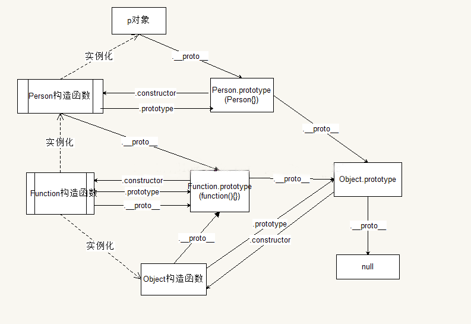
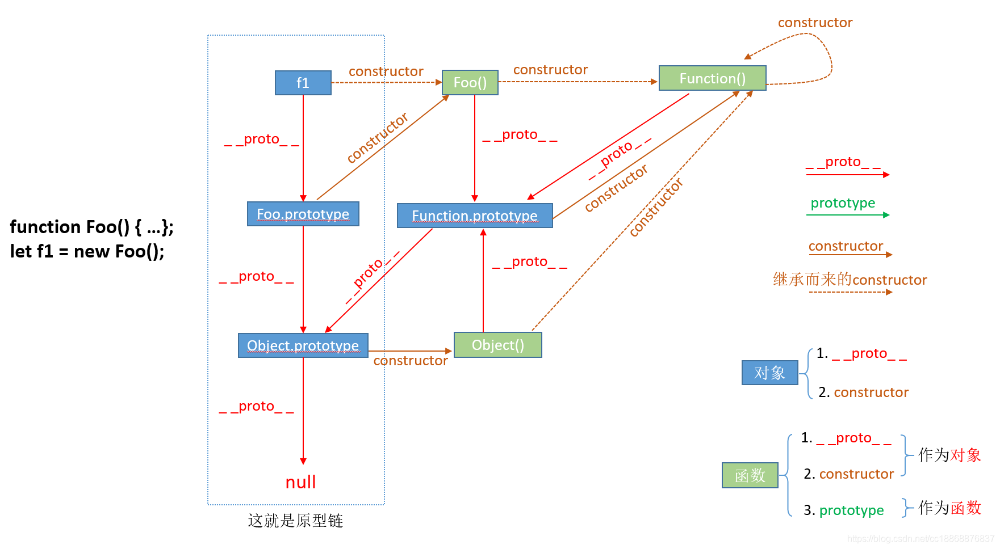
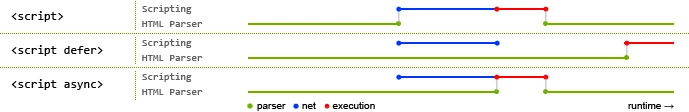
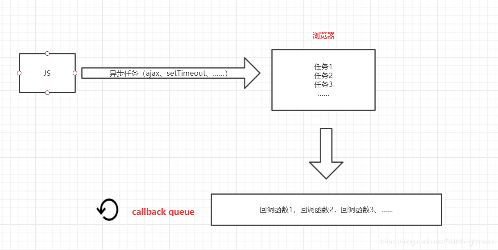
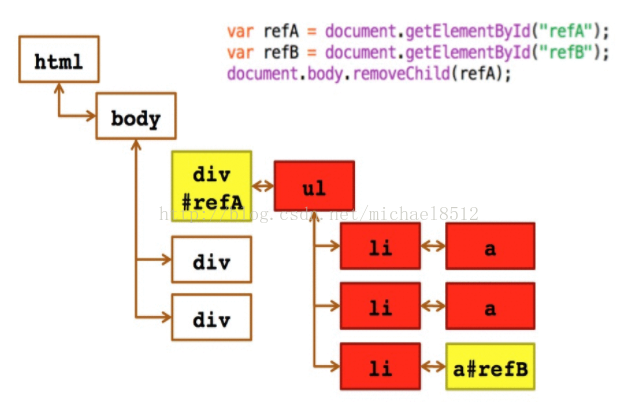
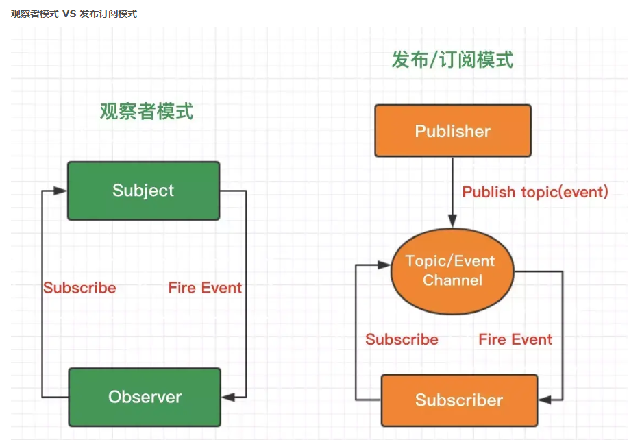

# [返回主页](https://github.com/yisainan/web-interview/blob/master/README.md)

<b><details><summary>1.document load 和 document ready 的区别</summary></b>

参考答案：文档解析过程中，ready在加载图片等外部资源前触发，load在之后触发。如果页面中要是没有图片之类的媒体文件的话ready与load是差不多的，但是页面中有文件就不一样了，所以还是推荐大家在工作中用ready

解析：

DOM文档解析：

1. 解析html结构
2. 加载脚本和样式文件
3. 解析并执行脚本
4. 构造html的DOM模型 // ready
5. 加载图片等外部资源文件
6. 页面加载完毕 // load

页面加载完成有两种事件

1.load是当页面所有资源全部加载完成后（包括DOM文档树，css文件，js文件，图片资源等），执行一个函数

缺点：如果图片资源较多，加载时间较长，onload后等待执行的函数需要等待较长时间，所以一些效果可能受到影响

代码形式：

```js
//document load
$(document).load(function(){
    ...code...
})
```

2.$(document).ready()是当DOM文档树加载完成后执行一个函数 （不包含图片，css等）所以会比load较快执行

在原生的jS中不包括ready()这个方法，Jquery才有，jquery中有 $().ready(function)。

代码形式为：

```js
//document ready
$(document).ready(function(){
    ...code...
})
//document ready 简写
$(function(){
    ...code...
})
```

[参与互动](https://github.com/yisainan/web-interview/issues/170)

</details>

<b><details><summary>2.JavaScript 中如何检测一个变量是一个 String 类型？</summary></b>

参考答案：三种方法（typeof、constructor、Object.prototype.toString.call()）

解析：

```js
①
typeof

typeof('123') === "string" // true

typeof '123' === "string" // true

②
constructor

    '123'.constructor === String // true

③ Object.prototype.toString.call()

Object.prototype.toString.call('123') === '[object String]' // true
```

[参与互动](https://github.com/yisainan/web-interview/issues/171)

</details>

<b><details><summary>3.请用 js 去除字符串空格？</summary></b>

参考答案：replace 正则匹配方法、str.trim()方法、JQ 方法：\$.trim(str)方法

解析：

方法一：replace 正则匹配方法

去除字符串内所有的空格：str = str.replace(/\s\*/g, ""); 

去除字符串内两头的空格：str = str.replace(/^\s*|\s*\$/g, ""); 

去除字符串内左侧的空格：str = str.replace(/^\s\*/, ""); 

去除字符串内右侧的空格：str = str.replace(/(\s\*\$)/g, ""); 

示例：

```js
var str = " 6 6 ";
var str_1 = str.replace(/\s*/g, "");
console.log(str_1); //66

var str = " 6 6 ";
var str_1 = str.replace(/^\s*|\s*$/g, "");
console.log(str_1); //6 6//输出左右侧均无空格

var str = " 6 6 ";
var str_1 = str.replace(/^\s*/, "");
console.log(str_1); //6 6 //输出右侧有空格左侧无空格

var str = " 6 6 ";
var str_1 = str.replace(/(\s*$)/g, "");
console.log(str_1); // 6 6//输出左侧有空格右侧无空格
```

方法二：str.trim()方法

trim()方法是用来删除字符串两端的空白字符并返回，trim 方法并不影响原来的字符串本身，它返回的是一个新的字符串。

缺陷：只能去除字符串两端的空格，不能去除中间的空格

示例：

```js
var str = " 6 6 ";
var str_1 = str.trim();
console.log(str_1); //6 6//输出左右侧均无空格
```

方法三：JQ 方法：\$.trim(str)方法

\$.trim() 函数用于去除字符串两端的空白字符。

注意：\$.trim()函数会移除字符串开始和末尾处的所有换行符，空格(包括连续的空格)和制表符。如果这些空白字符在字符串中间时，它们将被保留，不会被移除。

示例：

```js
var str = " 6 6 ";
var str_1 = $.trim(str);
console.log(str_1); //6 6//输出左右侧均无空格
```

[参与互动](https://github.com/yisainan/web-interview/issues/172)

</details>

<b><details><summary>4.js 是一门怎样的语言，它有什么特点</summary></b>

参考答案：

1\.脚本语言。JavaScript 是一种解释型的脚本语言, C、C\+\+等语言先编译后执行, 而 JavaScript 是在程序的运行过程中逐行进行解释。

2\.基于对象。JavaScript 是一种基于对象的脚本语言, 它不仅可以创建对象, 也能使用现有的对象。

3\.简单。JavaScript 语言中采用的是弱类型的变量类型, 对使用的数据类型未做出严格的要求, 是基于 Java 基本语句和控制的脚本语言, 其设计简单紧凑。

4\.动态性。JavaScript 是一种采用事件驱动的脚本语言, 它不需要经过 Web 服务器就可以对用户的输入做出响应。

5\.跨平台性。JavaScript 脚本语言不依赖于操作系统, 仅需要浏览器的支持。

[参与互动](https://github.com/yisainan/web-interview/issues/173)

</details>

<b><details><summary>5.== 和 === 的不同</summary></b>

参考答案： `==` 是抽象相等运算符，而 `===` 是严格相等运算符。 `==` 运算符是在进行必要的类型转换后，再比较。 `===` 运算符不会进行类型转换，所以如果两个值不是相同的类型，会直接返回 `false` 。使用 `==` 时，可能发生一些特别的事情，例如：

```js
1 == "1"; // true
1 == [1]; // true
1 == true; // true
0 == ""; // true
0 == "0"; // true
0 == false; // true
```

如果你对 `==` 和 `===` 的概念不是特别了解，建议大多数情况下使用 `===`

[参与互动](https://github.com/yisainan/web-interview/issues/174)

</details>

<b><details><summary>6.怎样添加、移除、移动、复制、创建和查找节点？</summary></b>

参考答案：

1）创建新节点

* createDocumentFragment() //创建一个 DOM 片段
* createElement() //创建一个具体的元素
* createTextNode() //创建一个文本节点

2）添加、移除、替换、插入

* appendChild() //添加
* removeChild() //移除
* replaceChild() //替换
* insertBefore() //插入

3）查找

* getElementsByTagName() //通过标签名称
* getElementsByName() //通过元素的 Name 属性的值
* getElementById() //通过元素 Id，唯一性

[参与互动](https://github.com/yisainan/web-interview/issues/175)

</details>

<b><details><summary>7.事件委托是什么</summary></b>

参考答案：利用事件冒泡的原理，让自己的所触发的事件，让他的父元素代替执行！

解析：

1、那什么样的事件可以用事件委托，什么样的事件不可以用呢？

* 适合用事件委托的事件：click，mousedown，mouseup，keydown，keyup，keypress。
* 值得注意的是，mouseover 和 mouseout 虽然也有事件冒泡，但是处理它们的时候需要特别的注意，因为需要经常计算它们的位置，处理起来不太容易。
* 不适合的就有很多了，举个例子，mousemove，每次都要计算它的位置，非常不好把控，在不如说 focus，blur 之类的，本身就没用冒泡的特性，自然就不用事件委托了。

2、为什么要用事件委托

* 1.提高性能

```

<ul>
  <li>苹果</li>
  <li>香蕉</li>
  <li>凤梨</li>
</ul>

// good
document.querySelector('ul').onclick = (event) => {
  let target = event.target
  if (target.nodeName === 'LI') {
    console.log(target.innerHTML)
  }
}

// bad
document.querySelectorAll('li').forEach((e) => {
  e.onclick = function() {
    console.log(this.innerHTML)
  }
})
```

* 2.新添加的元素还会有之前的事件。

3、事件冒泡与事件委托的对比

* 事件冒泡：box 内部无论是什么元素，点击后都会触发 box 的点击事件
* 事件委托：可以对 box 内部的元素进行筛选

4、事件委托怎么取索引？

```html
    <ul id="ul">
        <li> aaaaaaaa </li>
        <li> 事件委托了 点击当前， 如何获取 这个点击的下标 </li>
        <li> cccccccc </li>
    </ul>
```

```js
    window.onload = function() {
        var oUl = document.getElementById("ul");
        var aLi = oUl.getElementsByTagName("li");
        oUl.onclick = function(ev) {
            var ev = ev || window.event;
            var target = ev.target || ev.srcElement;
            if (target.nodeName.toLowerCase() == "li") {
                var that = target;
                var index;
                for (var i = 0; i < aLi.length; i++)
                    if (aLi[i] === target) index = i;
                if (index >= 0) alert('我的下标是第' + index + '个');
                target.style.background = "red";
            }
        }
    }
```

拓展：

* 键盘事件：keydown keypress keyup
* 鼠标事件：mousedown mouseup mousemove mouseout mouseover

[参考](https://github.com/qiilee/js/tree/master/JS/%E4%BA%8B%E4%BB%B6%E5%A7%94%E6%89%98)

[参与互动](https://github.com/yisainan/web-interview/issues/176)

</details>

<b><details><summary>8.require 与 import 的区别</summary></b>

参考答案：两者的加载方式不同、规范不同

第一、两者的加载方式不同，require 是在运行时加载，而 import 是在编译时加载

require('./a')(); // a 模块是一个函数，立即执行 a 模块函数

var data = require('./a').data; // a 模块导出的是一个对象

var a = require('./a')[0]; // a 模块导出的是一个数组 ======> 哪都行

import \$ from 'jquery'; 

import \* as _ from '_'; 

import {a, b, c} from './a'; 

import {default as alias, a as a_a, b, c} from './a'; ======>用在开头

第二、规范不同，require 是 CommonJS/AMD 规范，import 是 ESMAScript6+规范

第三、require 特点：社区方案，提供了服务器/浏览器的模块加载方案。非语言层面的标准。只能在运行时确定模块的依赖关系及输入/输出的变量，无法进行静态优化。

import 特点：语言规格层面支持模块功能。支持编译时静态分析，便于 JS 引入宏和类型检验。动态绑定。

[参与互动](https://github.com/yisainan/web-interview/issues/177)

</details>

<b><details><summary>9.javascript 对象的几种创建方式</summary></b>

参考答案：

第一种：Object 构造函数创建

```js
var Person = new Object();
Person.name = "Nike";
Person.age = 29;
```

这行代码创建了 Object 引用类型的一个新实例，然后把实例保存在变量 Person 中。

第二种：使用对象字面量表示法

```js
var Person = {}; //相当于 var Person = new Object();
var Person = {
    name: 'Nike';
    age: 29;
}
```

对象字面量是对象定义的一种简写形式，目的在于简化创建包含大量属性的对象的过程。也就是说，第一种和第二种方式创建对象的方法其实都是一样的，只是写法上的区别不同

在介绍第三种的创建方法之前，我们应该要明白为什么还要用别的方法来创建对象，也就是第一种，第二种方法的缺点所在：它们都是用了同一个接口创建很多对象，会产生大量的重复代码，就是如果你有 100 个对象，那你要输入 100 次很多相同的代码。那我们有什么方法来避免过多的重复代码呢，就是把创建对象的过程封装在函数体内，通过函数的调用直接生成对象。

第三种：使用工厂模式创建对象

```js
function createPerson(name, age, job) {
    var o = new Object();
    o.name = name;
    o.age = age;
    o.job = job;
    o.sayName = function() {
        alert(this.name);
    };
    return o;
}
var person1 = createPerson("Nike", 29, "teacher");
var person2 = createPerson("Arvin", 20, "student");
```

在使用工厂模式创建对象的时候，我们都可以注意到，在 createPerson 函数中，返回的是一个对象。那么我们就无法判断返回的对象究竟是一个什么样的类型。于是就出现了第四种创建对象的模式。

第四种: 使用构造函数创建对象

```js
function Person(name, age, job) {
    this.name = name;
    this.age = age;
    this.job = job;
    this.sayName = function() {
        alert(this.name);
    };
}
var person1 = new Person("Nike", 29, "teacher");
var person2 = new Person("Arvin", 20, "student");
```

对比工厂模式，我们可以发现以下区别：

1\.没有显示地创建对象

2\.直接将属性和方法赋给了 this 对象

3\.没有 return 语句

4\.终于可以识别的对象的类型。对于检测对象类型，我们应该使用 instanceof 操作符，我们来进行自主检测：

```js
alert(person1 instanceof Object); //ture

alert(person1 instanceof Person); //ture

alert(person2 instanceof Object); //ture

alert(person2 instanceof Object); //ture
```

同时我们也应该明白，按照惯例，构造函数始终要应该以一个大写字母开头，而非构造函数则应该以一个小写字母开头。

那么构造函数确实挺好用的，但是它也有它的缺点：

就是每个方法都要在每个实例上重新创建一遍，方法指的就是我们在对象里面定义的函数。如果方法的数量很多，就会占用很多不必要的内存。于是出现了第五种创建对象的方法

第五种：原型创建对象模式

```js
function Person() {}
Person.prototype.name = "Nike";
Person.prototype.age = 20;
Person.prototype.jbo = "teacher";
Person.prototype.sayName = function() {
    alert(this.name);
};
var person1 = new Person();
person1.sayName();
```

使用原型创建对象的方式，可以让所有对象实例共享它所包含的属性和方法。

如果是使用原型创建对象模式，请看下面代码：

```js
function Person() {}
Person.prototype.name = "Nike";
Person.prototype.age = 20;
Person.prototype.jbo = "teacher";
Person.prototype.sayName = function() {
    alert(this.name);
};
var person1 = new Person();
var person2 = new Person();
person1.name = "Greg";
alert(person1.name); //'Greg' --来自实例
alert(person2.name); //'Nike' --来自原型
```

当为对象实例添加一个属性时，这个属性就会屏蔽原型对象中保存的同名属性。

这时候我们就可以使用构造函数模式与原型模式结合的方式，构造函数模式用于定义实例属性，而原型模式用于定义方法和共享的属性

第六种：组合使用构造函数模式和原型模式

```js
function Person(name, age, job) {
    this.name = name;
    this.age = age;
    this.job = job;
}
Person.prototype = {
    constructor: Person,
    sayName: function() {
        alert(this.name);
    };
}
var person1 = new Person('Nike', 20, 'teacher');
```

解析：
[参考](https://zhidao.baidu.com/question/1180348878138910499.html)

[参与互动](https://github.com/yisainan/web-interview/issues/178)

</details>

<b><details><summary>10.JavaScript 继承的方式和优缺点</summary></b>

参考答案：六种方式

* 一、原型链继承

  + 缺点：
  + 1.引用类型的属性被所有实例共享
  + 2.在创建 Child 的实例时，不能向 Parent 传参

* 二、借用构造函数(经典继承)

  + 优点：
  + 1.避免了引用类型的属性被所有实例共享
  + 2.可以在 Child 中向 Parent 传参

  + 缺点：
  + 1.方法都在构造函数中定义，每次创建实例都会创建一遍方法。

* 三、组合继承

  + 优点：
  + 1.融合原型链继承和构造函数的优点，是 JavaScript 中最常用的继承模式。

* 四、原型式继承

  + 缺点：
  + 1.包含引用类型的属性值始终都会共享相应的值，这点跟原型链继承一样。

* 五、寄生式继承

  + 缺点：
  + 1.跟借用构造函数模式一样，每次创建对象都会创建一遍方法。

* 六、寄生组合式继承
  + 优点：
  + 1.这种方式的高效率体现它只调用了一次 Parent 构造函数，并且因此避免了在 Parent.prototype 上面创建不必要的、多余的属性。
  + 2.与此同时，原型链还能保持不变；
  + 3.因此，还能够正常使用 instanceof 和 isPrototypeOf。
  + 开发人员普遍认为寄生组合式继承是引用类型最理想的继承范式

解析：[参考](https://www.jianshu.com/p/09ad43c7fe8f)

[参与互动](https://github.com/yisainan/web-interview/issues/179)

</details>

<b><details><summary>11.什么是原型链？ </summary></b>

参考答案：通过一个对象的__proto__可以找到它的原型对象，原型对象也是一个对象，就可以通过原型对象的__proto__，最后找到了我们的 Object.prototype, 从实例的原型对象开始一直到 Object.prototype 就是我们的原型链

解析：




[参与互动](https://github.com/yisainan/web-interview/issues/180)

</details>

<b><details><summary>12.复杂数据类型如何转变为字符串 </summary></b>

参考答案：

* 首先，会调用 valueOf 方法，如果方法的返回值是一个基本数据类型，就返回这个值，
* 如果调用 valueOf 方法之后的返回值仍旧是一个复杂数据类型，就会调用该对象的 toString 方法，
* 如果 toString 方法调用之后的返回值是一个基本数据类型，就返回这个值，
* 如果 toString 方法调用之后的返回值是一个复杂数据类型，就报一个错误。

解析：

```js
// 1;
var obj = {
    valueOf: function() {
        return 1;
    }
};
console.log(obj + ""); //'1'
// 2;
var obj = {
    valueOf: function() {
        return [1, 2];
    }
};
console.log(obj + ""); //'[object Object]';
// 3;
var obj = {
    valueOf: function() {
        return [1, 2];
    },
    toString: function() {
        return 1;
    }
};
console.log(obj + ""); //'1';
// 4;
var obj = {
    valueOf: function() {
        return [1, 2];
    },
    toString: function() {
        return [1, 2, 3];
    }
};
console.log(obj + ""); // 报错 Uncaught TypeError: Cannot convert object to primitive value
```

拓展：

```js
var arr = [new Object(), new Date(), new RegExp(), new String(), new Number(), new Boolean(), new Function(), new Array(), Math] console.log(arr.length) // 9
for (var i = 0; i < arr.length; i++) {
    arr[i].valueOf = function() {
        return [1, 2, 3]
    }
    arr[i].toString = function() {
        return 'toString'
    }
    console.log(arr[i] + '')
}
```

1、若 return [1, 2, 3]处为 return "valueof"，得到的返回值是 valueof toString 7valueof
说明：其他八种复杂数据类型是先调用 valueOf 方法，时间对象是先调用 toString 方法

2、改成 return [1, 2, 3]，得到的返回值是 9toString
说明：执行 valueof 后都来执行 toString

[参与互动](https://github.com/yisainan/web-interview/issues/181)

</details>

<b><details><summary>13.javascript 的 typeof 返回哪些数据类型</summary></b>

参考答案：7 种分别为 string、boolean、number、Object、Function、undefined、symbol(ES6)、

示例：

1、number

```js
typeof(10);
typeof(NaN); // NaN在JavaScript中代表的是特殊非数字值,它本身是一个数字类型。
typeof(Infinity)
```

2、boolean

```js
typeof(true);
typeof(false);
```

3、string

```js
typeof("abc");
```

4、undefined

```js
typeof(undefined);
typeof(a); // 不存在的变量
```

5、object

```js
// 对象，数组，null返回object
typeof(null);
typeof(window);
```

6、function

```js
typeof(Array);
typeof(Date);
```

7、symbol

```js
typeof Symbol() // ES6提供的新的类型
```

[参与互动](https://github.com/yisainan/web-interview/issues/182)

</details>

<b><details><summary>14.一次js请求一般情况下有哪些地方会有缓存处理？</summary></b>

参考答案：DNS缓存，CDN缓存，浏览器缓存，服务器缓存。

解析：

#### 1、DNS缓存

DNS缓存指DNS返回了正确的IP之后，系统就会将这个结果临时储存起来。并且它会为缓存设定一个失效时间 (例如N小时)，在这N小时之内，当你再次访问这个网站时，系统就会直接从你电脑本地的DNS缓存中把结果交还给你，而不必再去询问DNS服务器，变相“加速”了网址的解析。当然，在超过N小时之后，系统会自动再次去询问DNS服务器获得新的结果。
所以，当你修改了 DNS 服务器，并且不希望电脑继续使用之前的DNS缓存时，就需要手动去清除本地的缓存了。

本地DNS迟迟不生效或者本地dns异常等问题，都会导致访问某些网站出现无法访问的情况，这个时候我们就需要手动清除本地dns缓存，而不是等待！

#### 2、CDN缓存

和Http类似，客户端请求数据时，先从本地缓存查找，如果被请求数据没有过期，拿过来用，如果过期，就向CDN边缘节点发起请求。CDN便会检测被请求的数据是否过期，如果没有过期，就返回数据给客户端，如果过期，CDN再向源站发送请求获取新数据。和买家买货，卖家没货，卖家再进货一个道理^^。

CDN边缘节点缓存机制，一般都遵守http标准协议，通过http响应头中的Cache-Control和max-age的字段来设置CDN边缘节点的数据缓存时间。

#### 3、浏览器缓存

浏览器缓存（Browser Caching）是为了节约网络的资源加速浏览，浏览器在用户磁盘上对最近请求过的文档进行存储，当访问者再次请求这个页面时，浏览器就可以从本地磁盘显示文档，这样就可以加速页面的阅览。

浏览器缓存主要有两类：缓存协商：Last-modified ，Etag 和彻底缓存：cache-control，Expires。浏览器都有对应清除缓存的方法。

#### 4、服务器缓存

服务器缓存有助于优化性能和节省宽带，它将需要频繁访问的Web页面和对象保存在离用户更近的系统中，当再次访问这些对象的时候加快了速度。

[参与互动](https://github.com/yisainan/web-interview/issues/183)

</details>

<b><details><summary>15.列举 3 种强制类型转换和 2 种隐式类型转换</summary></b>

参考答案：

强制: parseInt(), parseFloat(), Number(), Boolean(), String()

隐式: +, -

解析：

```js
// 1.parseInt() 把值转换成整数
parseInt("1234blue"); // 1234
parseInt("0xA"); // 10
parseInt("22.5"); // 22
parseInt("blue"); // NaN
// parseInt()方法还有基模式，可以把二进制、八进制、十六进制或其他任何进制的字符串转换成整数。基是由parseInt()方法的第二个参数指定的，示例如下：
parseInt("AF", 16); // 175
parseInt("10", 2); // 2
parseInt("10", 8); // 8
parseInt("10", 10); // 10
// 如果十进制数包含前导0，那么最好采用基数10，这样才不会意外地得到八进制的值。例如：
parseInt("010"); // 8
parseInt("010", 8); // 8
parseInt("010", 10); // 10

// 2.parseFloat() 把值转换成浮点数,没有基模式
parseFloat("1234blue"); // 1234.0
parseFloat("0xA"); // NaN
parseFloat("22.5"); // 22.5
parseFloat("22.34.5"); // 22.34
parseFloat("0908"); // 908
parseFloat("blue"); // NaN

// 3.Number() 把给定的值转换成数字（可以是整数或浮点数）,Number()的强制类型转换与parseInt()和parseFloat()方法的处理方式相似，只是它转换的是整个值，而不是部分值。示例如下：
Number(false) // 0
Number(true) // 1
Number(undefined) // NaN
Number(null) // 0
Number("5.5") // 5.5
Number("56") // 56
Number("5.6.7") // NaN
Number(new Object()) // NaN
Number(100) // 100

// 4.Boolean() 把给定的值转换成Boolean型
Boolean(""); // false 
Boolean("hi"); // true
Boolean(100); // true
Boolean(null); // false
Boolean(0); // false
Boolean(new Object()); // true

// 5.String() 把给定的值转换成字符串
String(123) // "123"

// 6.+ -
console.log(0 + '1') // "01"
console.log(2 - '1') // 1
```

[参与互动](https://github.com/yisainan/web-interview/issues/184)

</details>

<b><details><summary>16.你对闭包的理解？优缺点？</summary></b>

参考答案：

概念：闭包就是能够读取其他函数内部变量的函数。

三大特性：

* 函数嵌套函数。
* 函数内部可以引用外部的参数和变量。
* 参数和变量不会被垃圾回收机制回收。

优点：

* 希望一个变量长期存储在内存中。
* 避免全局变量的污染。
* 私有成员的存在。

缺点：

* 常驻内存，增加内存使用量。
* 使用不当会很容易造成内存泄露。

示例：

```js
function outer() {
    var name = "jack";

    function inner() {
        console.log(name);
    }
    return inner;
}
outer()(); // jack
```

```js
function sayHi(name) {
    return () => {
        console.log(`Hi! ${name}`);
    };
}
const test = sayHi("xiaoming");
test(); // Hi! xiaoming
```

虽然 sayHi 函数已经执行完毕，但是其活动对象也不会被销毁，因为 test 函数仍然引用着 sayHi 函数中的变量 name，这就是闭包。<br>
但也因为闭包引用着另一个函数的变量，导致另一个函数已经不使用了也无法销毁，所以闭包使用过多，会占用较多的内存，这也是一个副作用。

解析：

由于在 ECMA2015 中，只有函数才能分割作用域，函数内部可以访问当前作用域的变量，但是外部无法访问函数内部的变量，所以闭包可以理解成“定义在一个函数内部的函数，外部可以通过内部返回的函数访问内部函数的变量“。在本质上，闭包是将函数内部和函数外部连接起来的桥梁。

[参与互动](https://github.com/yisainan/web-interview/issues/185)

</details>

<b><details><summary>17.如何判断 NaN</summary></b>

参考答案：isNaN()方法

解析：isNaN(NaN) // true

[参与互动](https://github.com/yisainan/web-interview/issues/186)

</details>

<b><details><summary>18.new 一个对象的过程中发生了什么</summary></b>

参考答案：

```js
function Person(name) {
    this.name = name;
}
var person = new Person("qilei");
```

new一个对象的四个过程：

```js
// 1.创建空对象；
var obj = {};
// 2.设置原型链: 设置新对象的 constructor 属性为构造函数的名称，设置新对象的__proto__属性指向构造函数的 prototype 对象；
obj.constructor = Person;
obj.__proto__ = Person.prototype;
// 3.改变this指向：使用新对象调用函数，函数中的 this 指向新实例对象obj：
var result = Person.call(obj); //{}.构造函数();
// 4.返回值：如果无返回值或者返回一个非对象值，则将新对象返回；如果返回值是一个新对象的话那么直接返回该对象。
if (typeof(result) == "object") {
    person = result;
} else {
    person = obj;
}
```

[参与互动](https://github.com/yisainan/web-interview/issues/187)

</details>

<b><details><summary>19.for in 和 for of的区别</summary></b>

参考答案：

1、for in

* 1.一般用于遍历对象的可枚举属性。以及对象从构造函数原型中继承的属性。对于每个不同的属性，语句都会被执行。
* 2.不建议使用 for in 遍历数组，因为输出的顺序是不固定的。
* 3.如果迭代的对象的变量值是 null 或者 undefined, for in 不执行循环体，建议在使用 for in 循环之前，先检查该对象的值是不是 null 或者 undefined。

2、for of

* 1.for…of 语句在可迭代对象（包括 Array，Map，Set，String，TypedArray，arguments 对象等等）上创建一个迭代循环，调用自定义迭代钩子，并为每个不同属性的值执行语句。

解析：

```js
var s = {
    a: 1,
    b: 2,
    c: 3
};
var s1 = Object.create(s);
for (var prop in s1) {
    console.log(prop); //a b c
    console.log(s1[prop]); //1 2 3
}
for (let prop of s1) {
    console.log(prop); //报错如下 Uncaught TypeError: s1 is not iterable
}
for (let prop of Object.keys(s1)) {
    console.log(prop); // a b c
    console.log(s1[prop]); //1 2 3
}
```

[参与互动](https://github.com/yisainan/web-interview/issues/188)

</details>

<b><details><summary>20.如何判断 JS 变量的一个类型（至少三种方式）</summary></b>

参考答案：typeof、instanceof、 constructor、 prototype

解析：

1、typeof

typeof 返回一个表示数据类型的字符串，返回结果包括：number、boolean、string、object、undefined、function等6种数据类型。如果是判断一个基本的类型用typeof就是可以的。

```js
typeof ''; // string 有效
typeof 1; // number 有效
typeof true; //boolean 有效
typeof undefined; //undefined 有效
typeof null; //object 无效
typeof []; //object 无效
typeof new Function(); // function 有效
typeof new Date(); //object 无效
typeof new RegExp(); //object 无效
```

2、instanceof

instanceof 是用来判断 A 是否为 B 的实例对，表达式为：A instanceof B，如果A是B的实例，则返回true, 否则返回false。 在这里需要特别注意的是：instanceof检测的是原型，

```js
[] instanceof Array; //true
{}
instanceof Object; //true
new Date() instanceof Date; //true
```

3、constractor

每一个对象实例都可以通过 constrcutor 对象来访问它的构造函数 。JS 中内置了一些构造函数：Object、Array、Function、Date、RegExp、String等。我们可以通过数据的 constrcutor 是否与其构造函数相等来判断数据的类型。

```js
var arr = [];
var obj = {};
var date = new Date();
var num = 110;
var str = 'Hello';
var getName = function() {};
var sym = Symbol();
var set = new Set();
var map = new Map();

arr.constructor === Array; // true
obj.constructor === Object; // true
date.constructor === Date; // true
str.constructor === String; // true
getName.constructor === Function; // true
sym.constructor === Symbol; // true
set.constructor === Set; // true
map.constructor === Map // true
```

4、Object.prototype.toString

toString是Object原型对象上的一个方法，该方法默认返回其调用者的具体类型，更严格的讲，是 toString运行时this指向的对象类型, 返回的类型格式为[object, xxx], xxx是具体的数据类型，其中包括：String, Number, Boolean, Undefined, Null, Function, Date, Array, RegExp, Error, HTMLDocument, ...基本上所有对象的类型都可以通过这个方法获取到。

```js
Object.prototype.toString.call(''); // [object String]
Object.prototype.toString.call(1); // [object Number]
Object.prototype.toString.call(true); // [object Boolean]
Object.prototype.toString.call(undefined); // [object Undefined]
Object.prototype.toString.call(null); // [object Null]
Object.prototype.toString.call(new Function()); // [object Function]
Object.prototype.toString.call(new Date()); // [object Date]
Object.prototype.toString.call([]); // [object Array]
Object.prototype.toString.call(new RegExp()); // [object RegExp]
Object.prototype.toString.call(new Error()); // [object Error]
```

[参与互动](https://github.com/yisainan/web-interview/issues/189)

</details>

<b><details><summary>21.for in、Object.keys 和 Object.getOwnPropertyNames 对属性遍历有什么区别？</summary></b>

参考答案：

* for in 会遍历自身及原型链上的可枚举属性
* Object.keys 会将对象自身的可枚举属性的 key 输出
* Object.getOwnPropertyNames会将自身所有的属性的 key 输出

解析：

ECMAScript 将对象的属性分为两种：数据属性和访问器属性。

```js
var parent = Object.create(Object.prototype, {
    a: {
        value: 123,
        writable: true,
        enumerable: true,
        configurable: true
    }
});
// parent继承自Object.prototype，有一个可枚举的属性a（enumerable:true）。

var child = Object.create(parent, {
    b: {
        value: 2,
        writable: true,
        enumerable: true,
        configurable: true
    },
    c: {
        value: 3,
        writable: true,
        enumerable: false,
        configurable: true
    }
});
//child 继承自 parent ，b可枚举，c不可枚举
```

### for in

```js
for (var key in child) {
    console.log(key);
}
// b
// a
// for in 会遍历自身及原型链上的可枚举属性
```

如果只想输出自身的可枚举属性，可使用 hasOwnProperty 进行判断(数组与对象都可以，此处用数组做例子)

```js
let arr = [1, 2, 3];
Array.prototype.xxx = 1231235;
for (let i in arr) {
    if (arr.hasOwnProperty(i)) {
        console.log(arr[i]);
    }
}
// 1
// 2
// 3
```

### Object.keys

```js
console.log(Object.keys(child));
// ["b"]
// Object.keys 会将对象自身的可枚举属性的key输出
```

### Object.getOwnPropertyNames

```js
console.log(Object.getOwnPropertyNames(child));
// ["b","c"]
// 会将自身所有的属性的key输出
```

[参与互动](https://github.com/yisainan/web-interview/issues/190)

</details>

<b><details><summary>22.iframe 跨域通信和不跨域通信</summary></b>

参考答案：

### 不跨域通信

主页面

```html
<!DOCTYPE html>
<html>

<head>
    <meta charset="utf-8" />
    <title></title>
</head>

<body>
    <iframe name="myIframe" id="iframe" class="" src="flexible.html" width="500px" height="500px">
    </iframe>
</body>
<script type="text/javascript" charset="utf-8">
    function fullscreen() {
        alert(1111);
    }
</script>

</html>
```

子页面 flexible.html

```html
<!DOCTYPE html>
<html>

<head>
    <meta charset="utf-8" />
    <title></title>
</head>

<body>
    我是子页面
</body>
<script type="text/javascript" charset="utf-8">
    // window.parent.fullScreens()
    function showalert() {
        alert(222);
    }
</script>

</html>
```

1、主页面要是想要调取子页面的 showalert 方法

```js
myIframe.window.showalert();
```

2、子页面要掉主页面的 fullscreen 方法

```js
window.parent.fullScreens();
```

3、js 在 iframe 子页面获取父页面元素:

```js
window.parent.document.getElementById("元素id");
```

4、js 在父页面获取 iframe 子页面元素代码如下:

```js
window.frames["iframe_ID"].document.getElementById("元素id");
```

### 跨域通信

使用[postMessage(官方用法）](https://developer.mozilla.org/zh-CN/docs/Web/API/Window/postMessage)

子页面

```js
window.parent.postMessage("hello", "http://127.0.0.1:8089");
```

父页面接收

```js
window.addEventListener("message", function(event) {
    alert(123);
});
```

解析：[参考](https://blog.csdn.net/weixin_41229588/article/details/93719894)

[参与互动](https://github.com/yisainan/web-interview/issues/191)

</details>

<b><details><summary>23.H5 与 Native 如何交互</summary></b>

参考答案：jsBridge

解析：[参考](https://segmentfault.com/a/1190000010356403)

[参与互动](https://github.com/yisainan/web-interview/issues/192)

</details>

<b><details><summary>24.如何判断一个对象是否为数组</summary></b>

参考答案：

第一种方法：使用 instanceof 操作符。

第二种方法：使用 ECMAScript 5 新增的 Array.isArray()方法。

第三种方法：使用使用 Object.prototype 上的原生 toString()方法判断。

[参与互动](https://github.com/yisainan/web-interview/issues/193)

</details>

<b><details><summary>25.`<script>` 标签的 defer 和 asnyc 属性的作用以及二者的区别？</summary></b>

参考答案：

* defer 和 async 的网络加载过程是一致的，都是异步执行；
* 区别在于加载完成之后什么时候执行, defer要等到整个页面在内存中正常渲染结束（DOM 结构完全生成，以及其他脚本执行完成），才会执行。async一旦下载完，渲染引擎就会中断渲染，执行这个脚本以后，再继续渲染；
* 一句话，defer是“渲染完再执行”，async是“下载完就执行”。另外，如果有多个defer脚本，会按照它们在页面出现的顺序加载，而多个async脚本是不能保证加载顺序的；

解析：

无论 `<script>` 标签是嵌入代码还是引用外部文件，只要不包含 defer 属性和 async 属性（这两个属性只对外部文件有效），浏览器会按照 `<script>` 的出现顺序对他们依次进行解析，也就是说，只有在第一个 `<script>` 中的代码执行完成之后，浏览器才会执行第二个 `<script>` 中的代码，并且在解析时，页面的处理会暂时停止。

嵌入代码的解析=执行
外部文件的解析=下载+执行

script 标签存在两个属性，defer 和 async，这两个属性只对外部文件有效

## 只有一个脚本的情况

```

<script src = "a.js" />
```

没有 defer 或 async 属性，浏览器会立即下载并执行相应的脚本，并且在下载和执行时页面的处理会停止。

```

<script defer src = "a.js" />
```

有了 defer 属性，浏览器会立即下载相应的脚本，在下载的过程中页面的处理不会停止，等到文档解析完成脚本才会执行。

```

<script async src = "a.js" />
```

有了 async 属性，浏览器会立即下载相应的脚本，在下载的过程中页面的处理不会停止，下载完成后立即执行，执行过程中页面处理会停止。

```

<script defer async src = "a.js" />
```

如果同时指定了两个属性, 则会遵从 async 属性而忽略 defer 属性。

下图可以直观的看出三者之间的区别:



其中蓝色代表 js 脚本网络下载时间，红色代表 js 脚本执行，绿色代表 html 解析。

## 多个脚本的情况

这里只列举两个脚本的情况：

```

<script src = "a.js"> </script>
<script src = "b.js"> </script>
```

没有 defer 或 async 属性，浏览器会立即下载并执行脚本 a.js，在 a.js 脚本执行完成后才会下载并执行脚本 b.js，在脚本下载和执行时页面的处理会停止。

```

<script defer src = "a.js"> </script>
<script defer src = "b.js"> </script>
```

有了 defer 属性，浏览器会立即下载相应的脚本 a.js 和 b.js，在下载的过程中页面的处理不会停止，等到文档解析完成才会执行这两个脚本。HTML5 规范要求脚本按照它们出现的先后顺序执行，因此第一个延迟脚本会先于第二个延迟脚本执行，而这两个脚本会先于 DOMContentLoaded 事件执行。
在现实当中，延迟脚本并不一定会按照顺序执行，也不一定会在 DOMContentLoaded 事件触发前执行，因此最好只包含一个延迟脚本。

```

<script async src = "a.js"> </script>
<script async src = "b.js"> </script>
```

有了 async 属性，浏览器会立即下载相应的脚本 a.js 和 b.js，在下载的过程中页面的处理不会停止，a.js 和 b.js 哪个先下载完成哪个就立即执行，执行过程中页面处理会停止，但是其他脚本的下载不会停止。标记为 async 的脚本并不保证按照制定它们的先后顺序执行。异步脚本一定会在页面的 load 事件前执行，但可能会在 DOMContentLoaded 事件触发之前或之后执行。

[参考](https://blog.csdn.net/weixin_42561383/article/details/86564715)

[参与互动](https://github.com/yisainan/web-interview/issues/194)

</details>

<b><details><summary>26.Object.prototype.toString.call() 和 instanceOf 和 Array.isArray() 区别好坏</summary></b>

参考答案：

* Object.prototype.toString.call()
  + 优点：这种方法对于所有基本的数据类型都能进行判断，即使是 null 和 undefined 。
  + 缺点：不能精准判断自定义对象，对于自定义对象只会返回[object Object]
* instanceOf
  + 优点：instanceof 可以弥补 Object.prototype.toString.call()不能判断自定义实例化对象的缺点。
  + 缺点： instanceof 只能用来判断对象类型，原始类型不可以。并且所有对象类型 instanceof Object 都是 true，且不同于其他两种方法的是它不能检测出 iframes。
* Array.isArray()
  + 优点：当检测 Array 实例时，Array.isArray 优于 instanceof ，因为 Array.isArray 可以检测出 iframes
  + 缺点：只能判别数组

解析：

### Object.prototype.toString.call()

每一个继承 Object 的对象都有 toString 方法，如果 toString 方法没有重写的话，会返回 [Object type]，其中 type 为对象的类型。但当除了 Object 类型的对象外，其他类型直接使用 toString 方法时，会直接返回都是内容的字符串，所以我们需要使用 call 或者 apply 方法来改变 toString 方法的执行上下文。

```js
const an = ["Hello", "An"];
an.toString(); // "Hello,An"
Object.prototype.toString.call(an); // "[object Array]"
```

这种方法对于所有基本的数据类型都能进行判断，即使是 null 和 undefined 。

```js
Object.prototype.toString.call("An"); // "[object String]"
Object.prototype.toString.call(1); // "[object Number]"
Object.prototype.toString.call(Symbol(1)); // "[object Symbol]"
Object.prototype.toString.call(null); // "[object Null]"
Object.prototype.toString.call(undefined); // "[object Undefined]"
Object.prototype.toString.call(function() {}); // "[object Function]"
Object.prototype.toString.call({
    name: "An"
}); // "[object Object]"
```

缺点：不能精准判断自定义对象，对于自定义对象只会返回[object Object]

```js
function f(name) {
    this.name = name;
}
var f1 = new f("martin");
console.log(Object.prototype.toString.call(f1)); //[object Object]

Object.prototype.toString.call(); // 常用于判断浏览器内置对象。
```

### instanceof

instanceof 的内部机制是通过判断对象的原型链中是不是能找到类型的 prototype。

使用 instanceof 判断一个对象是否为数组，instanceof 会判断这个对象的原型链上是否会找到对应的 Array 的原型，找到返回 true，否则返回 false。

```js
[] instanceof Array; // true
```

但 instanceof 只能用来判断对象类型，原始类型不可以。并且所有对象类型 instanceof Object 都是 true。

```js
[] instanceof Object; // true
```

优点：instanceof 可以弥补 Object.prototype.toString.call()不能判断自定义实例化对象的缺点。

缺点：instanceof 只能用来判断对象类型，原始类型不可以。并且所有对象类型 instanceof Object 都是 true，且不同于其他两种方法的是它不能检测出 iframes。

```js
function f(name) {
    this.name = name;
}
var f1 = new f("martin");
console.log(f1 instanceof f); //true
```

### Array.isArray()

* 功能：用来判断对象是否为数组

* instanceof 与 isArray

当检测 Array 实例时，Array.isArray 优于 instanceof ，因为 Array.isArray 可以检测出 iframes

```js
var iframe = document.createElement("iframe");
document.body.appendChild(iframe);
xArray = window.frames[window.frames.length - 1].Array;
var arr = new xArray(1, 2, 3); // [1,2,3]

// Correctly checking for Array
Array.isArray(arr); // true
Object.prototype.toString.call(arr); // true
// Considered harmful, because doesn't work though iframes
arr instanceof Array; // false
```

缺点：只能判别数组

* Array.isArray() 与 Object.prototype.toString.call()

Array.isArray()是 ES5 新增的方法，当不存在 Array.isArray() ，可以用 Object.prototype.toString.call() 实现。

```js
if (!Array.isArray) {
    Array.isArray = function(arg) {
        return Object.prototype.toString.call(arg) === "[object Array]";
    };
}
```

[参考](https://github.com/Advanced-Frontend/Daily-Interview-Question/issues/23)

[参与互动](https://github.com/yisainan/web-interview/issues/195)

</details>

<b><details><summary>27.什么是面向对象？</summary></b>

参考答案：面向对象是把构成问题事务分解成各个对象，建立对象的目的不是为了完成一个步骤，而是为了描叙某个事物在整个解决问题的步骤中的行为。

解析：

* 面向对象和面向过程的异同
  + 面向过程就是分析出解决问题所需要的步骤，然后用函数把这些步骤一步一步实现，使用的时候一个一个依次调用就可以了。
  + 面向对象是把构成问题事务分解成各个对象，建立对象的目的不是为了完成一个步骤，而是为了描叙某个事物在整个解决问题的步骤中的行为。

[参与互动](https://github.com/yisainan/web-interview/issues/196)

</details>

<b><details><summary>28.你对松散类型的理解</summary></b>

参考答案：

JavaScript 中的变量为松散类型，所谓松散类型就是指当一个变量被申明出来就可以保存任意类型的值，就是不像 SQL 一样申明某个键值为 int 就只能保存整型数值，申明 varchar 只能保存字符串。一个变量所保存值的类型也可以改变，这在 JavaScript 中是完全有效的，只是不推荐。相比较于将变量理解为“盒子“，《JavaScript 编程精解》中提到应该将变量理解为“触手”，它不保存值，而是抓取值。这一点在当变量保存引用类型值时更加明显。

JavaScript 中变量可能包含两种不同的数据类型的值：基本类型和引用类型。基本类型是指简单的数据段，而引用类型指那些可能包含多个值的对象。

[参与互动](https://github.com/yisainan/web-interview/issues/197)

</details>

<b><details><summary>29.JS 严格模式和正常模式的区别</summary></b>

参考答案：严格模式使用"use strict"; 

作用：

* 消除 Javascript 语法的一些不合理、不严谨之处，减少一些怪异行为; 
* 消除代码运行的一些不安全之处，保证代码运行的安全；
* 提高编译器效率，增加运行速度；
* 为未来新版本的 Javascript 做好铺垫。

表现：

* 严格模式下, delete 运算符后跟随非法标识符(即 delete 不存在的标识符)，会抛出语法错误； 非严格模式下，会静默失败并返回 false
* 严格模式中，对象直接量中定义同名属性会抛出语法错误； 非严格模式不会报错
* 严格模式中，函数形参存在同名的，抛出错误； 非严格模式不会
* 严格模式不允许八进制整数直接量（如：023）
* 严格模式中，arguments 对象是传入函数内实参列表的静态副本；非严格模式下，arguments 对象里的元素和对应的实参是指向同一个值的引用
* 严格模式中 eval 和 arguments 当做关键字，它们不能被赋值和用作变量声明
* 严格模式会限制对调用栈的检测能力，访问 arguments.callee.caller 会抛出异常
* 严格模式 变量必须先声明，直接给变量赋值，不会隐式创建全局变量，不能用 with, 
* 严格模式中 call apply 传入 null undefined 保持原样不被转换为 window

解析：

一、概述

除了正常运行模式，ECMAscript 5 添加了第二种运行模式："严格模式"（strict mode）。顾名思义，这种模式使得 Javascript 在更严格的条件下运行。

设立"严格模式"的目的，主要有以下几个：

* 消除 Javascript 语法的一些不合理、不严谨之处，减少一些怪异行为; 

* 消除代码运行的一些不安全之处，保证代码运行的安全；

* 提高编译器效率，增加运行速度；

* 为未来新版本的 Javascript 做好铺垫。

"严格模式"体现了 Javascript 更合理、更安全、更严谨的发展方向，包括 IE 10 在内的主流浏览器，都已经支持它，许多大项目已经开始全面拥抱它。

另一方面，同样的代码，在"严格模式"中，可能会有不一样的运行结果；一些在"正常模式"下可以运行的语句，在"严格模式"下将不能运行。掌握这些内容，有助于更细致深入地理解 Javascript，让你变成一个更好的程序员。

本文将对"严格模式"做详细介绍。

二、进入标志

进入"严格模式"的标志，是下面这行语句：

"use strict"; 

老版本的浏览器会把它当作一行普通字符串，加以忽略。

三、如何调用

"严格模式"有两种调用方法，适用于不同的场合。

3\.1 针对整个脚本文件

将"use strict"放在脚本文件的第一行，则整个脚本都将以"严格模式"运行。如果这行语句不在第一行，则无效，整个脚本以"正常模式"运行。如果不同模式的代码文件合并成一个文件，这一点需要特别注意。

(严格地说，只要前面不是产生实际运行结果的语句，"use strict"可以不在第一行，比如直接跟在一个空的分号后面。)

```

　　<script>
　　　　"use strict";
　　　　console.log("这是严格模式。");
　　</script>

　　<script>
　　　　console.log("这是正常模式。");kly, it's almost 2 years ago now.I can admit it now - I run it on my school's network that has about 50 computers.
　　</script>
```

上面的代码表示，一个网页中依次有两段 Javascript 代码。前一个 script 标签是严格模式，后一个不是。

3\.2 针对单个函数

将"use strict"放在函数体的第一行，则整个函数以"严格模式"运行。

```js
function strict() {
    "use strict";
    return "这是严格模式。";
}

function notStrict() {
    return "这是正常模式。";
}
```

3\.3 脚本文件的变通写法

因为第一种调用方法不利于文件合并，所以更好的做法是，借用第二种方法，将整个脚本文件放在一个立即执行的匿名函数之中。

```js
(function() {
    "use strict"; // some code here

})();
```

四、语法和行为改变

严格模式对 Javascript 的语法和行为，都做了一些改变。

4\.1 全局变量显式声明

在正常模式中，如果一个变量没有声明就赋值，默认是全局变量。严格模式禁止这种用法，全局变量必须显式声明。

```js
"use strict";

v = 1; // 报错，v未声明

for (i = 0; i < 2; i++) {
    // 报错，i未声明
}
```

因此，严格模式下，变量都必须先用 var 命令声明，然后再使用。

4\.2 静态绑定

Javascript 语言的一个特点，就是允许"动态绑定"，即某些属性和方法到底属于哪一个对象，不是在编译时确定的，而是在运行时（runtime）确定的。

严格模式对动态绑定做了一些限制。某些情况下，只允许静态绑定。也就是说，属性和方法到底归属哪个对象，在编译阶段就确定。这样做有利于编译效率的提高，也使得代码更容易阅读，更少出现意外。

具体来说，涉及以下几个方面。

（1）禁止使用 with 语句

因为 with 语句无法在编译时就确定，属性到底归属哪个对象。

```js
"use strict";

var v = 1;

with(o) { // 语法错误
    v = 2;
}
```

（2）创设 eval 作用域

正常模式下，Javascript 语言有两种变量作用域（scope）：全局作用域和函数作用域。严格模式创设了第三种作用域：eval 作用域。

正常模式下，eval 语句的作用域，取决于它处于全局作用域，还是处于函数作用域。严格模式下，eval 语句本身就是一个作用域，不再能够生成全局变量了，它所生成的变量只能用于 eval 内部。

```js
"use strict";

var x = 2;

console.info(eval("var x = 5; x")); // 5

console.info(x); // 2
```

4\.3 增强的安全措施

（1）禁止 this 关键字指向全局对象

```js
function f() {
    return !this;
} // 返回false，因为"this"指向全局对象，"!this"就是false
function f() {
    "use strict";
    return !this;
} // 返回true，因为严格模式下，this的值为undefined，所以"!this"为true。
```

因此，使用构造函数时，如果忘了加 new，this 不再指向全局对象，而是报错。

```js
function f() {
    "use strict";

    this.a = 1;
}

f(); // 报错，this未定义
```

（2）禁止在函数内部遍历调用栈

```js
function f1() {
    "use strict";

    f1.caller; // 报错

    f1.arguments; // 报错
}

f1();
```

4\.4 禁止删除变量

严格模式下无法删除变量。只有 configurable 设置为 true 的对象属性，才能被删除。

```js
"use strict";

var x;

delete x; // 语法错误

var o = Object.create(null, {
    'x': {
        value: 1,
        configurable: true
    }
});

delete o.x; // 删除成功
```

4\.5 显式报错

正常模式下，对一个对象的只读属性进行赋值，不会报错，只会默默地失败。严格模式下，将报错。

```js
"use strict";

var o = {};

Object.defineProperty(o, "v", {
    value: 1,
    writable: false
});

o.v = 2; // 报错
```

严格模式下，对一个使用 getter 方法读取的属性进行赋值，会报错。

```js
"use strict";

var o = {
    get v() {
        return 1;
    }
};

o.v = 2; // 报错
```

严格模式下，对禁止扩展的对象添加新属性，会报错。

```js
"use strict";

var o = {};

Object.preventExtensions(o);

o.v = 1; // 报错
```

严格模式下，删除一个不可删除的属性，会报错。

```js
"use strict";

delete Object.prototype; // 报错
```

4\.6 重名错误

严格模式新增了一些语法错误。

（1）对象不能有重名的属性

正常模式下，如果对象有多个重名属性，最后赋值的那个属性会覆盖前面的值。严格模式下，这属于语法错误。

```js
"use strict";

var o = {
    p: 1,
    p: 2
}; // 语法错误
```

（2）函数不能有重名的参数

正常模式下，如果函数有多个重名的参数，可以用 arguments[i]读取。严格模式下，这属于语法错误。

```js
"use strict";

function f(a, a, b) { // 语法错误

    return;

}
```

4\.7 禁止八进制表示法

正常模式下，整数的第一位如果是 0，表示这是八进制数，比如 0100 等于十进制的 64。严格模式禁止这种表示法，整数第一位为 0，将报错。

```js
"use strict";

var n = 0100; // 语法错误
```

4\.8 arguments 对象的限制

arguments 是函数的参数对象，严格模式对它的使用做了限制。

（1）不允许对 arguments 赋值

```js
"use strict";

arguments++; // 语法错误

var obj = {
    set p(arguments) {}
}; // 语法错误

try {} catch (arguments) {} // 语法错误

function arguments() {} // 语法错误

var f = new Function("arguments", "'use strict'; return 17;"); // 语法错误
```

（2）arguments 不再追踪参数的变化

```js
function f(a) {
    a = 2;

    return [a, arguments[0]];
}

f(1); // 正常模式为[2,2]

function f(a) {
    "use strict";

    a = 2;

    return [a, arguments[0]];
}

f(1); // 严格模式为[2,1]
```

（3）禁止使用 arguments.callee

这意味着，你无法在匿名函数内部调用自身了。

```js
"use strict";

var f = function() {
    return arguments.callee;
};

f(); // 报错
```

4\.9 函数必须声明在顶层

将来 Javascript 的新版本会引入"块级作用域"。为了与新版本接轨，严格模式只允许在全局作用域或函数作用域的顶层声明函数。也就是说，不允许在非函数的代码块内声明函数。

```js
"use strict";

if (true) {
    function f() {} // 语法错误
}

for (var i = 0; i < 5; i++) {
    function f2() {} // 语法错误
}
```

4\.10 保留字

为了向将来 Javascript 的新版本过渡，严格模式新增了一些保留字：implements, interface, let, package, private, protected, public, static, yield。

使用这些词作为变量名将会报错。

```js
function package(protected) { // 语法错误

    "use strict";

    var implements; // 语法错误

}
```

此外，ECMAscript 第五版本身还规定了另一些保留字（class, enum, export, extends, import, super），以及各大浏览器自行增加的 const 保留字，也是不能作为变量名的。

[参考](https://www.ruanyifeng.com/blog/2013/01/javascript_strict_mode.html)

[参与互动](https://github.com/yisainan/web-interview/issues/198)

</details>

<b><details><summary>30.移动端 click 事件、touch 事件、tap 事件的区别</summary></b>

参考答案：

1\.click 事件在移动端会有 200-300ms 的延迟，主要原因是苹果手机在设计时，考虑到用户在浏览网页时需要放大，所以，在用户点击的 200-300ms 之后，才触发 click，如果 200-300ms 之内还有 click，就会进行放大缩小。

2\.touch 事件是针对触屏手机上的触摸事件。现今大多数触屏手机 webkit 内核提供了 touch 事件的监听，让开发者可以获取用户触摸屏幕时的一些信息。其中包括：touchstart, touchmove, touchend, touchcancel 这四个事件，touchstart touchmove touchend 事件可以类比于 mousedown mouseover mouseup 的触发

3\.tap 事件在移动端，代替 click 作为点击事件，tap 事件被很多框架（如 zepto）封装，来减少这延迟问题， tap 事件不是原生的，所以是封装的，那么具体是如何实现的呢？

```js
<script>
  function tap(ele, callback) {
      // 记录开始时间
      var startTime = 0,
          // 控制允许延迟的时间
          delayTime = 200,
          // 记录是否移动，如果移动，则不触发tap事件
          isMove = false;

      // 在touchstart时记录开始的时间
      ele.addEventListener('touchstart', function(e) {
          startTime = Date.now();
      });

      // 如果touchmove事件被触发，则isMove为true
      ele.addEventListener('touchmove', function(e) {
          isMove = true;
      });

      // 如果touchmove事件触发或者中间时间超过了延迟时间，则返回，否则，调用回调函数。
      ele.addEventListener('touchend', function(e) {
          if (isMove || (Date.now() - startTime > delayTime)) {
              return;
          } else {
              callback(e);
          }
      })
  }

  var btn = document.getElementById('btn');
  tap(btn, function() {
      alert('taped');
  }); 
</script>
```

拓展：

点透问题

如果我们在移动端所有的 click 都替换为了 tap 事件，还是会触发点透问题的，因为实质是： 在同一个 z 轴上，z-index 不同的两个元素，上面的元素是一个绑定了 tap 事件的，下面是一个 a 标签，一旦 tap 触发，这个元素就会 display: none，而从上面的 tap 可以看出，有 touchstart、touchend，所以会 300ms 之后触发 click 事件，而 z-index 已经消失了，所以，触发了下面的 a 的 click 事件，注意： 我们认为 a 标签默认是绑定了 click 事件的。而这种现象不是我们所期待的。

解决方案： （1）使用 fastclick。 （2）添加一个延迟。

（1）直接引入 fastclick 库。

```js
window.addEventListener(
    "load",
    function() {
        FastClick.attach(document.body);
    },
    false
);
```

这样，就可以成功解决问题了。

（2）对于上一个 tap 做延迟。

```js
tap(ele, function() {
    setTimeout(function() {
        ele.style.display = "none";
    }, 300);
});
```

这样，过了 300ms，那么 click 事件就不会触发在下面的 a 标签上了。

[参与互动](https://github.com/yisainan/web-interview/issues/199)

</details>

<b><details><summary>31.JS 单线程还是多线程，如何显示异步操作</summary></b>

参考答案：JS 本身是单线程的，他是依靠浏览器完成的异步操作。

解析：

具体步骤，

1、主线程 执行 js 中所有的代码。

2、主线程 在执行过程中发现了需要异步的任务任务后扔给浏览器（浏览器创建多个线程执行），并在  callback queue  中创建对应的回调函数（回调函数是一个对象，包含该函数是否执行完毕等）。

3、主线程 已经执行完毕所有同步代码。开始监听  callback queue 一旦 浏览器 中某个线程任务完成将会改变回调函数的状态。主线程查看到某个函数的状态为已完成，就会执行该函数。



[参与互动](https://github.com/yisainan/web-interview/issues/200)

</details>

<b><details><summary>32.JavaScript 数组的函数 map/forEach/reduce/filter</summary></b>

参考答案：

1\.map

```js
// map
// 作用：对数组进行遍历
// 返回值：新的数组
// 是否改变原有数组：不会
var arr = [2, 5, 3, 4];
var ret = arr.map(function(value) {
    return value + 1;
});
console.log(ret); //[3,6,4,5]
console.log(arr); //[2,5,3,4]
```

2\.forEach

```js
// forEach 方法
// 作用：遍历数组的每一项
// 返回值：undefined
// 是否改变原有数组：不会
var arr = [2, 5, 3, 4];
var ret = arr.forEach(function(value) {
    console.log(value); // 2, 5, 3, 4
});
console.log(ret); //undefined
console.log(arr); //[2,5,3,4]
```

3\.reduce

```js
// reduce 方法
// 作用：对数组进行迭代，然后两两进行操作，最后返回一个值
// 返回值：return出来的结果
// 是否改变原有数组：不会
var arr = [1, 2, 3, 4];
var ret = arr.reduce(function(a, b) {
    return a * b;
});
console.log(ret); // 24
console.log(arr); // [1, 2, 3, 4]
```

4\.filter

```js
// filter 过滤
// 作用： 筛选一部分元素
// 返回值： 一个满足筛选条件的新数组
// 是否改变原有数组：不会

var arr = [2, 5, 3, 4];
var ret = arr.filter(function(value) {
    return value > 3;
});
console.log(ret); //[5,4]
console.log(arr); //[2,5,3,4]
```

[参与互动](https://github.com/yisainan/web-interview/issues/201)

</details>

<b><details><summary>33.JS 块级作用域、变量提升</summary></b>

参考答案：

1\.块级作用域

JS 中作用域有：全局作用域、函数作用域。没有块作用域的概念。ECMAScript 6(简称 ES6)中新增了块级作用域。块作用域由 { } 包括，if 语句和 for 语句里面的{ }也属于块作用域。

2\.变量提升

* 如果变量声明在函数里面，则将变量声明提升到函数的开头
* 如果变量声明是一个全局变量，则将变量声明提升到全局作用域的开头

解析：

```js
<script type = "text/javascript"> 
{
    var a = 1;
    console.log(a); // 1
}
console.log(a); // 1
// 可见，通过var定义的变量可以跨块作用域访问到。

(function A() {
    var b = 2;
    console.log(b); // 2
})();
// console.log(b); // 报错，
// 可见，通过var定义的变量不能跨函数作用域访问到

if (true) {
    var c = 3;
}
console.log(c); // 3
for (var i = 0; i < 4; i++) {
    var d = 5;
};
console.log(i); // 4  (循环结束i已经是4，所以此处i为4)
console.log(d); // 5
// if语句和for语句中用var定义的变量可以在外面访问到，
// 可见，if语句和for语句属于块作用域，不属于函数作用域。

{
    var a = 1;
    let b = 2;
    const c = 3;
    {
        console.log(a); // 1	子作用域可以访问到父作用域的变量
        console.log(b); // 2	子作用域可以访问到父作用域的变量
        console.log(c); // 3	子作用域可以访问到父作用域的变量

        var aa = 11;
        let bb = 22;
        const cc = 33;
    }

    console.log(aa); // 11	// 可以跨块访问到子 块作用域 的变量
    console.log(bb); // 报错	bb is not defined
    console.log(cc); // 报错	cc is not defined
} 
</script>
```

拓展：

var、let、const 的区别

* var 定义的变量，没有块的概念，可以跨块访问, 不能跨函数访问。
* let 定义的变量，只能在块作用域里访问，不能跨块访问，也不能跨函数访问。
* const 用来定义常量，使用时必须初始化(即必须赋值)，只能在块作用域里访问，而且不能修改。
* 同一个变量只能使用一种方式声明，不然会报错

```js
<script type = "text/javascript">
// 块作用域
{
    var a = 1;
    let b = 2;
    const c = 3;
    // c = 4; // 报错
    // let a = 'a';	// 报错  注：是上面 var a = 1; 那行报错
    // var b = 'b';	// 报错：本行报错
    // const a = 'a1';	// 报错  注：是上面 var a = 1; 那行报错
    // let c = 'c';	// 报错：本行报错
    var aa;
    let bb;
    // const cc; // 报错
    console.log(a); // 1
    console.log(b); // 2
    console.log(c); // 3
    console.log(aa); // undefined
    console.log(bb); // undefined
}
console.log(a); // 1
// console.log(b); // 报错
// console.log(c); // 报错

// 函数作用域
(function A() {
    var d = 5;
    let e = 6;
    const f = 7;
    console.log(d); // 5
    console.log(e); // 6  (在同一个{ }中,也属于同一个块，可以正常访问到)
    console.log(f); // 7  (在同一个{ }中,也属于同一个块，可以正常访问到)
})();
// console.log(d); // 报错
// console.log(e); // 报错
// console.log(f); // 报错
</script>
```

[参与互动](https://github.com/yisainan/web-interview/issues/202)

</details>

<b><details><summary>34.null/undefined 的区别</summary></b>

参考答案：

null： Null 类型，代表“空值"，代表一个空对象指针，使用 typeof 运算得到 “object"，所以你可以认为它是一个特殊的对象值。

undefined： Undefined 类型，当一个声明了一个变量未初始化时，得到的就是 undefined。

[参与互动](https://github.com/yisainan/web-interview/issues/203)

</details>

<b><details><summary>35.JS 哪些操作会造成内存泄露</summary></b>

参考答案：

1）意外的全局变量引起的内存泄露

```js
function leak() {
    leak = "xxx"; //leak成为一个全局变量，不会被回收
}
```

2）闭包引起的内存泄露

```js
function bindEvent() {
    var obj = document.createElement("XXX");
    obj.οnclick = function() {
        //Even if it's a empty function
    };
}
```

闭包可以维持函数内局部变量，使其得不到释放。 上例定义事件回调时，由于是函数内定义函数，并且内部函数--事件回调的引用外暴了，形成了闭包。
解决之道，将事件处理函数定义在外部，解除闭包, 或者在定义事件处理函数的外部函数中，删除对 dom 的引用。

```js
//将事件处理函数定义在外部
function onclickHandler() {
    //do something
}

function bindEvent() {
    var obj = document.createElement("XXX");
    obj.οnclick = onclickHandler;
}

//在定义事件处理函数的外部函数中，删除对dom的引用
function bindEvent() {
    var obj = document.createElement("XXX");
    obj.οnclick = function() {
        //Even if it's a empty function
    };
    obj = null;
}
```

3）没有清理的 DOM 元素引用

```js
var elements = {
    button: document.getElementById("button"),
    image: document.getElementById("image"),
    text: document.getElementById("text")
};

function doStuff() {
    image.src = "http://some.url/image";
    button.click():
        console.log(text.innerHTML)
}

function removeButton() {
    document.body.removeChild(document.getElementById('button'))
}
```

4）被遗忘的定时器或者回调

```js
var someResouce = getData();
setInterval(function() {
    var node = document.getElementById("Node");
    if (node) {
        node.innerHTML = JSON.stringify(someResouce);
    }
}, 1000);
```

这样的代码很常见, 如果 id 为 Node 的元素从 DOM 中移除, 该定时器仍会存在, 同时, 因为回调函数中包含对 someResource 的引用, 定时器外面的 someResource 也不会被释放。

5）子元素存在引起的内存泄露



黄色是指直接被 js 变量所引用，在内存里，红色是指间接被 js 变量所引用，如上图，refB 被 refA 间接引用，导致即使 refB 变量被清空，也是不会被回收的子元素 refB 由于 parentNode 的间接引用，只要它不被删除，它所有的父元素（图中红色部分）都不会被删除。

6）IE7/8 引用计数使用循环引用产生的问题

```js
function fn() {
    var a = {};
    var b = {};
    a.pro = b;
    b.pro = a;
}
fn();
```

fn()执行完毕后，两个对象都已经离开环境，在标记清除方式下是没有问题的，但是在引用计数策略下，因为 a 和 b 的引用次数不为 0，所以不会被垃圾回收器回收内存，如果 fn 函数被大量调用，就会造成内存泄漏。在 IE7 与 IE8 上，内存直线上升。
IE 中有一部分对象并不是原生 js 对象。例如，其内存泄漏 DOM 和 BOM 中的对象就是使用 C++以 COM 对象的形式实现的，而 COM 对象的垃圾回收机制采用的就是引用计数策略。因此，即使 IE 的 js 引擎采用标记清除策略来实现，但 js 访问的 COM 对象依然是基于引用计数策略的。换句话说，只要在 IE 中涉及 COM 对象，就会存在循环引用的问题。

```js
var element = document.getElementById("some_element");
var myObject = new Object();
myObject.e = element;
element.o = myObject;
```

上面的例子在一个 DOM 元素（element)与一个原生 js 对象（myObject)之间创建了循环引用。其中，变量 myObject 有一个名为 e 的属性指向 element 对象；而变量 element 也有一个属性名为 o 回指 myObject。由于存在这个循环引用，即使例子中的 DOM 从页面中移除，它也永远不会被回收。

看上面的例子，有人会觉得太弱了，谁会做这样无聊的事情，但是其实我们经常会这样做

```js
window.οnlοad = function outerFunction() {
    var obj = document.getElementById("element"):
        obj.οnclick = function innerFunction() {};
};
```

这段代码看起来没什么问题，但是 obj 引用了 document.getElementById(“element”)，而 document.getElementById(“element”)的 onclick 方法会引用外部环境中的变量，自然也包括 obj，是不是很隐蔽啊。

最简单的解决方式就是自己手工解除循环引用，比如刚才的函数可以这样

```js
myObject.element = null;
element.o = null;
window.οnlοad = function outerFunction() {
    var obj = document.getElementById("element"):
        obj.οnclick = function innerFunction() {};
    obj = null;
};
```

将变量设置为 null 意味着切断变量与它此前引用的值之间的连接。当垃圾回收器下次运行时，就会删除这些值并回收它们占用的内存。 要注意的是，IE9+并不存在循环引用导致 Dom 内存泄漏问题，可能是微软做了优化，或者 Dom 的回收方式已经改变

解析：

1、JS 的回收机制

JavaScript 垃圾回收的机制很简单：找出不再使用的变量，然后释放掉其占用的内存，但是这个过程不是实时的，因为其开销比较大，所以垃圾回收系统（GC）会按照固定的时间间隔, 周期性的执行。

到底哪个变量是没有用的？所以垃圾收集器必须跟踪到底哪个变量没用，对于不再有用的变量打上标记，以备将来收回其内存。用于标记的无用变量的策略可能因实现而有所区别，通常情况下有两种实现方式：标记清除和引用计数。引用计数不太常用，标记清除较为常用。

2、标记清除（mark and sweep）

js 中最常用的垃圾回收方式就是标记清除。当变量进入环境时，例如，在函数中声明一个变量，就将这个变量标记为“进入环境”。从逻辑上讲，永远不能释放进入环境的变量所占用的内存，因为只要执行流进入相应的环境，就可能会用到它们。而当变量离开环境时，则将其标记为“离开环境”。

```js
function test() {
    var a = 10; //被标记，进入环境
    var b = 20; //被标记，进入环境
}
test(); //执行完毕之后a、b又被标记离开环境，被回收
```

3、引用计数(reference counting)

引用计数的含义是跟踪记录每个值被引用的次数。当声明了一个变量并将一个引用类型值（function object array）赋给该变量时，则这个值的引用次数就是 1。如果同一个值又被赋给另一个变量，则该值的引用次数加 1。相反，如果包含对这个值引用的变量又取得了另外一个值，则这个值的引用次数减 1。当这个值的引用次数变成 0 时，则说明没有办法再访问这个值了，因而就可以将其占用的内存空间回收回来。这样，当垃圾回收器下次再运行时，它就会释放那些引用次数为 0 的值所占用的内存。

```js
function test() {
    var a = {}; //a的引用次数为0
    var b = a; //a的引用次数加1，为1
    var c = a; //a的引用次数加1，为2
    var b = {}; //a的引用次数减1，为1
}
```

4、如何分析内存的使用情况

Google Chrome 浏览器提供了非常强大的 JS 调试工具，Memory 视图 profiles 视图让你可以对 JavaScript 代码运行时的内存进行快照，并且可以比较这些内存快照。它还让你可以记录一段时间内的内存分配情况。在每一个结果视图中都可以展示不同类型的列表，但是对我们最有用的是 summary 列表和 comparison 列表。 summary 视图提供了不同类型的分配对象以及它们的合计大小：shallow size （一个特定类型的所有对象的总和）和 retained size （shallow size 加上保留此对象的其它对象的大小）。distance 显示了对象到达 GC 根（校者注：最初引用的那块内存，具体内容可自行搜索该术语）的最短距离。 comparison 视图提供了同样的信息但是允许对比不同的快照。这对于找到泄漏很有帮助。

5、怎样避免内存泄露

1）减少不必要的全局变量，或者生命周期较长的对象，及时对无用的数据进行垃圾回收；

2）注意程序逻辑，避免“死循环”之类的 ；

3）避免创建过多的对象 原则：不用了的东西要及时归还。

[参考](https://blog.csdn.net/michael8512/article/details/77888000)

[参与互动](https://github.com/yisainan/web-interview/issues/204)

</details>

<b><details><summary>36.重排与重绘的区别，什么情况下会触发？</summary></b>

参考答案：

1\.简述重排的概念

   浏览器下载完页面中的所有组件（HTML、JavaScript、CSS、图片）之后会解析生成两个内部数据结构（DOM 树和渲染树），DOM 树表示页面结构，渲染树表示 DOM 节点如何显示。重排是 DOM 元素的几何属性变化，DOM 树的结构变化，渲染树需要重新计算。

2\.简述重绘的概念

   重绘是一个元素外观的改变所触发的浏览器行为，例如改变 visibility、outline、背景色等属性。浏览器会根据元素的新属性重新绘制，使元素呈现新的外观。由于浏览器的流布局，对渲染树的计算通常只需要遍历一次就可以完成。但 table 及其内部元素除外，它可能需要多次计算才能确定好其在渲染树中节点的属性值，比同等元素要多花两倍时间，这就是我们尽量避免使用 table 布局页面的原因之一。

3\.简述重绘和重排的关系

   重绘不会引起重排，但重排一定会引起重绘，一个元素的重排通常会带来一系列的反应，甚至触发整个文档的重排和重绘，性能代价是高昂的。

4\.什么情况下会触发重排？

* 页面渲染初始化时；（这个无法避免）
* 浏览器窗口改变尺寸；
* 元素尺寸改变时；
* 元素位置改变时；
* 元素内容改变时；
* 添加或删除可见的 DOM 元素时。

5\.重排优化有如下五种方法

* 将多次改变样式属性的操作合并成一次操作，减少 DOM 访问。
* 如果要批量添加 DOM，可以先让元素脱离文档流，操作完后再带入文档流，这样只会触发一次重排。（fragment 元素的应用）
* 将需要多次重排的元素，position 属性设为 absolute 或 fixed，这样此元素就脱离了文档流，它的变化不会影响到其他元素。例如有动画效果的元素就最好设置为绝对定位。
* 由于 display 属性为 none 的元素不在渲染树中，对隐藏的元素操作不会引发其他元素的重排。如果要对一个元素进行复杂的操作时，可以先隐藏它，操作完成后再显示。这样只在隐藏和显示时触发两次重排。
* 在内存中多次操作节点，完成后再添加到文档中去。例如要异步获取表格数据，渲染到页面。可以先取得数据后在内存中构建整个表格的 html 片段，再一次性添加到文档中去，而不是循环添加每一行。

[参与互动](https://github.com/yisainan/web-interview/issues/205)

</details>

<b><details><summary>37.观察者模式和发布订阅者模式</summary></b>

参考答案：

观察者模式：观察者（Observer）直接订阅（Subscribe）主题（Subject），而当主题被激活的时候，会触发（Fire Event）观察者里的事件。

发布订阅模式：订阅者（Subscriber）把自己想订阅的事件注册（Subscribe）到调度中心（Topic），当发布者（Publisher）发布该事件（Publish topic）到调度中心，也就是该事件触发时，由调度中心统一调度（Fire Event）订阅者注册到调度中心的处理代码。



[参考](https://www.cnblogs.com/LChenglong/p/13219669.html)
[参与互动](https://github.com/yisainan/web-interview/issues/206)

</details>

<b><details><summary>38.jsonp 优缺点？ </summary></b>

参考答案：

### jsonp 优缺点

* 1.优点
  + 1.1 它不像 XMLHttpRequest 对象实现的 Ajax 请求那样受到同源策略的限制，JSONP 可以跨越同源策略；
  + 1.2 它的兼容性更好，在更加古老的浏览器中都可以运行，不需要 XMLHttpRequest 或 ActiveX 的支持
  + 1.3 在请求完毕后可以通过调用 callback 的方式回传结果。将回调方法的权限给了调用方。这个就相当于将 controller 层和 view 层终于*分 开了。我提供的 jsonp 服务只提供纯服务的数据，至于提供服务以 后的页面渲染和后续 view 操作都由调用者来自己定义就好了。如果*有两个页面需要渲染同一份数据，你们只需要有不同的渲染逻辑就可以了，逻辑都可以使用同 一个 jsonp 服务。
* 2.缺点
  + 2.1 它只支持 GET 请求而不支持 POST 等其它类型的 HTTP 请求
  + 2.2 它只支持跨域 HTTP 请求这种情况，不能解决不同域的两个页面之间如何进行 JavaScript 调用的问题。
  + 2.3 jsonp 在调用失败的时候不会返回各种 HTTP 状态码。
  + 2.4 缺点是安全性。万一假如提供 jsonp 的服务存在页面注入漏洞，即它返回的 javascript 的内容被人控制的。那么结果是什么？所有调用这个 jsonp 的网站都会存在漏洞。于是无法把危险控制在一个域名下…所以在使用 jsonp 的时候必须要保证使用的 jsonp 服务必须是安全可信的

[参与互动](https://github.com/yisainan/web-interview/issues/207)

</details>

<b><details><summary>39.兼容各种浏览器版本的事件绑定</summary></b>

参考答案：

```js
/*
  兼容低版本IE，ele为需要绑定事件的元素，eventName为事件名，fun为事件响应函数
*/

function addEvent(ele, eventName, fun) {
    // 看是否有addEventListener 
    if (ele.addEventListener) {
        // 大部分浏览器
        ele.addEventListener(eventName, fun, false);
    } else {
        // IE8及以下
        ele.attachEvent("on" + eventName, fun);
    }
}
```

[参与互动](https://github.com/yisainan/web-interview/issues/208)

</details>

<b><details><summary>40.typescript 遇到过什么坑</summary></b>

参考答案：

main.ts 报错（ Cannot find module './App.vue'.）

原因： typescript 不能识别.vue 文件

解决办法： 引入 vue 的 typescript declare 库

[参与互动](https://github.com/yisainan/web-interview/issues/209)

</details>

<b><details><summary>41.this 和 apply 的应用</summary></b>

参考答案：比如求数组的最大值 Math.max.apply(this, 数组)

```js
var numbers = [5, 458, 120, -215];
var maxInNumbers = Math.max.apply(this, numbers); //第一个参数也可以填Math或null
console.log(maxInNumbers); // 458
var maxInNumbers = Math.max.call(this, 5, 458, 120, -215);
console.log(maxInNumbers); // 458
```

[参与互动](https://github.com/yisainan/web-interview/issues/210)

</details>

<b><details><summary>42.split() join()的区别</summary></b>

参考答案：

join()：用于把数组中的所有元素通过指定的分隔符进行分隔放入一个字符串

split()：用于把一个字符串通过指定的分隔符进行分隔成数组

[参与互动](https://github.com/yisainan/web-interview/issues/211)

</details>

<b><details><summary>43.JavaScript 的数据类型</summary></b>

参考答案：JS 数据类型共有六种，分别是 String、Number、Boolean、Null、Undefined 和 Object 等， 另外，ES6 新增了 Symbol 类型。其中，Object 是引用类型，其他的都是基本类型(Primitive Type)。

[参与互动](https://github.com/yisainan/web-interview/issues/212)

</details>

<b><details><summary>44.如何判断一个对象是否属于某个类？</summary></b>

参考答案：instanceof

解析：

```js
class Person {}
var p = new Person()
if (p instanceof Person) {
    console.log("yes");
}
```

[参与互动](https://github.com/yisainan/web-interview/issues/213)

</details>

<b><details><summary>45.new 操作符具体干了什么呢?</summary></b>

参考答案：

样本一

new 共经过了 4 几个阶段

* 1、创建一个空对象
* 2、设置原型链
* 3、让 Func 中的 this 指向 obj，并执行 Func 的函数体
* 4、判断 Func 的返回值类型：

样本二

```

function Test(){}
const test = new Test()
```

1\.创建一个新对象：

```

const obj = {}
```

2\.设置新对象的 constructor 属性为构造函数的名称，设置新对象的__proto__属性指向构造函数的 prototype 对象

```

obj.constructor = Test
obj.__proto__ = Test.prototype
```

3\.使用新对象调用函数，函数中的 this 被指向新实例对象

```

Test.call(obj)
```

4\.将初始化完毕的新对象地址，保存到等号左边的变量中

[参与互动](https://github.com/yisainan/web-interview/issues/214)

</details>

<b><details><summary>46.call()与apply()的作用与区别？</summary></b>

参考答案：

1. 概念

每个函数都包含两个非继承而来的方法：apply()和call()。
call与apply都属于Function.prototype的一个方法，所以每个function实例都有call、apply属性；

2. 作用

call()方法和apply()方法的作用相同：改变this指向。

3. 区别

他们的区别在于接收参数的方式不同：
call()：第一个参数是this值没有变化，变化的是其余参数都直接传递给函数。在使用call()方法时，传递给函数的参数必须逐个列举出来。
apply()：传递给函数的是参数数组

4. 应用
```js
  var name = "Evan";
  var age = 20;

  var person = {
    name: "Hillary",
    age: 19,
    sayIntroduce: function () {
      return (
        "Hello, My name is " + this.name +" and I'm " +this.age +" years old."
      );
    },
    sayHobby: function (val1, val2) {
        return "I'm " + this.name + ", I like " + val1 + " and " + val2 + ".";
    }
  };

  
  var person1 = {
    name: "Coy",
  };

  
  console.log(person.sayIntroduce()); 
  // Hello, My name is Hillary and I'm 19 years old.
  
  // 当我们通过 call 和 apply 来this的指向时，不传任何参数，则默认为将this指向修改为 windows
  console.log(person.sayIntroduce.call()); 
  // Hello, My name is Evan and I'm 20 years old.
  console.log(person.sayIntroduce.apply()); 
  // Hello, My name is Evan and I'm 20 years old.
  
  // 有参数时，this 指向第一个参数：将this指向 person1，由于person1中没有age属性，因此为 undefined
  console.log(person.sayIntroduce.call(person1)); 
  // Hello, My name is Coy and I'm undefined years old.
  console.log(person.sayIntroduce.apply(person1)); 
  // Hello, My name is Coy and I'm undefined years old.
  
  // 当需要传递参数时，call可以直接写多个参数，apply需要用数组方式传递：
  console.log(person.sayHobby.call(person1, 'swimming', 'hiking')); 
  // I'm Coy, I like swimming and hiking. 
  console.log(person.sayHobby.apply(person1, ['swimming', 'hiking'])); 
  // I'm Coy, I like swimming and hiking. 

```

[参与互动](https://github.com/yisainan/web-interview/issues/215)

</details>

<b><details><summary>47.sort 排序原理</summary></b>

参考答案：冒泡排序法

解析：

冒泡排序法的原理：

* 比较相邻的元素。如果第一个比第二个大，就交换他们两个。
* 对每一对相邻元素做同样的工作，从开始第一对到结尾的最后一对。在这一点，最后的元素应该会是最大的数。
* 针对所有的元素重复以上的步骤，除了最后一个。
* 持续每次对越来越少的元素重复上面的步骤，直到没有任何一对数字需要比较。

示例：

```js
var arr = [1, 5, 4, 2];
// sort()方法的比较逻辑为：
// 第一轮：1和5比，1和4比，1和2比
// 第二轮：5和4比，5和2比
// 第三轮：4和2比
```

```js
// 一.sort排序规则 return大于0则交换数组相邻2个元素的位置
// 二.arr.sort(function (a,b) {})中
//         a -->代表每一次执行匿名函时候，找到的数组中的当前项；
//         b -->代表当前项的后一项；

// 1.升序
var apple = [45, 42, 10, 147, 7, 65, -74];
// ①默认法,缺点:只根据首位排序
console.log(apple.sort());
// ②指定排序规则法,return可返回任何值
console.log(
    apple.sort(function(a, b) {
        return a - b; //若return返回值大于0(即a＞b),则a,b交换位置
    })
);

//2.降序
var arr = [45, 42, 10, 111, 7, 65, -74];
console.log(
    apple.sort(function(a, b) {
        return b - a; //若return返回值大于零(即b＞a),则a,b交换位置
    })
);
```

[参考 1](https://blog.csdn.net/soraru/article/details/82255616)、[参考 2](https://www.cnblogs.com/huoxiao/p/10239284.html)

[参与互动](https://github.com/yisainan/web-interview/issues/216)

</details>

<b><details><summary>48.Zepto 的点透问题如何解决？</summary></b>

参考答案：

方案一：来得很直接 github 上有个 fastclick 可以完美解决https://github.com/ftlabs/fastclick

引入 fastclick.js，因为 fastclick 源码不依赖其他库所以你可以在原生的 js 前直接加上

```js
window.addEventListener(
    "load",
    function() {
        FastClick.attach(document.body);
    },
    false
);
```

或者有 zepto 或者 jqm 的 js 里面加上

```js
$(function() {
    FastClick.attach(document.body);
});
```

当然 require 的话就这样：

```js
var FastClick = require("fastclick");
FastClick.attach(document.body, options);
```

方案二：用 touchend 代替 tap 事件并阻止掉 touchend 的默认行为 preventDefault()

```js
$("#cbFinish").on("touchend", function(event) {
    //很多处理比如隐藏什么的
    event.preventDefault();
});
```

方案三：延迟一定的时间(300ms+)来处理事件

```js
$("#cbFinish").on("tap", function(event) {
    setTimeout(function() {
        //很多处理比如隐藏什么的
    }, 320);
});
```

这种方法其实很好，可以和 fadeInIn/fadeOut 等动画结合使用，可以做出过渡效果

理论上上面的方法可以完美的解决 tap 的点透问题，如果真的不行，用 click

解析：

1、“点透”是什么？

你可能碰到过在列表页面上创建一个弹出层，弹出层有个关闭的按钮，你点了这个按钮关闭弹出层后后，这个按钮正下方的内容也会执行点击事件（或打开链接）。这个被定义为这是一个“点透”现象。

2、为什么会出现点透呢？

[参考](https://www.cnblogs.com/axl234/p/5554281.html)

[参与互动](https://github.com/yisainan/web-interview/issues/217)

</details>

<b><details><summary>49.如何判断当前脚本运行在浏览器还是 node 环境中？</summary></b>

参考答案：通过判断 Global 对象是否为 window，如果不为 window，当前脚本没有运行在浏览器中

[参与互动](https://github.com/yisainan/web-interview/issues/218)

</details>

<b><details><summary>50.移动端最小触控区域是多大？</summary></b>

参考答案：苹果推荐是 44pt x 44pt

解析：[参考](https://developer.apple.com/ios/human-interface-guidelines/visual-design/layout/)

[参与互动](https://github.com/yisainan/web-interview/issues/219)

</details>

<b><details><summary>51.移动端的点击事件的有延迟，时间是多久，为什么会有？ 怎么解决这个延时？</summary></b>

参考答案：

1\.300 毫秒
2\.因为浏览器捕获第一次单击后，会先等待一段时间，如果在这段时间区间里用户未进行下一次点击，则浏览器会做单击事件的处理。如果这段时间里用户进行了第二次单击操作，则浏览器会做双击事件处理。
3\.推荐 fastclick\.js

[参与互动](https://github.com/yisainan/web-interview/issues/220)

</details>

<b><details><summary>52.解释 JavaScript 中的作用域与变量声明提升？</summary></b>

参考答案：

* 我对作用域的理解是只会对某个范围产生作用，而不会对外产生影响的封闭空间。在这样的一些空间里，外部不能访问内部变量，但内部可以访问外部变量。
* 所有申明都会被提升到作用域的最顶上
* 同一个变量申明只进行一次，并且因此其他申明都会被忽略
* 函数声明的优先级优于变量申明，且函数声明会连带定义一起被提升

[参与互动](https://github.com/yisainan/web-interview/issues/221)

</details>

<b><details><summary>53.Node.js 的适用场景？</summary></b>

参考答案：比如：RESTFUL API、实时聊天、客户端逻辑强大的单页 APP，具体的例子比如说：本地化的在线音乐应用，本地化的在线搜索应用，本地化的在线 APP 等。

解析：[参考](https://www.cnblogs.com/kevin9103/p/5053517.html)

[参与互动](https://github.com/yisainan/web-interview/issues/222)

</details>

<b><details><summary>54.bind、call、apply 的区别</summary></b>

参考答案：

call 和 apply 其实是一样的，区别就在于传参时参数是一个一个传或者是以一个数组的方式来传。<br>
call 和 apply 都是在调用时生效，改变调用者的 this 指向。<br>

```

let name = 'Jack'
const obj = {name: 'Tom'}
function sayHi() {console.log('Hi! ' + this.name)}

sayHi() // Hi! Jack
sayHi.call(obj) // Hi! Tom

```

bind 也是改变 this 指向，不过不是在调用时生效，而是返回一个新函数。

```

const newFunc = sayHi.bind(obj)
newFunc() // Hi! Tom
```

[参与互动](https://github.com/yisainan/web-interview/issues/223)

</details>

<b><details><summary>55.使用构造函数的注意点</summary></b>

参考答案：

1\.一般情况下构造函数的首字母需要大写，因为我们在看到一个函数首字母大写的情况，就认定这是一个构造函数，需要跟new关键字进行搭配使用，创建一个新的实例（对象）
2\.构造函数在被调用的时候需要跟new关键字搭配使用。
3\.在构造函数内部通过this\+属性名的形式为实例添加一些属性和方法。
4\.构造函数一般不需要返回值，如果有返回值

    - 4.1 如果返回值是一个基本数据类型，那么调用构造函数，返回值仍旧是那么创建出来的对象。
    - 4.2 如果返回值是一个复杂数据类型，那么调用构造函数的时候，返回值就是这个return之后的那个复杂数据类型。

[参与互动](https://github.com/yisainan/web-interview/issues/224)

</details>

<b><details><summary>56.如何获取浏览器版本信息</summary></b>

参考答案：window.navigator.userAgent

[参与互动](https://github.com/yisainan/web-interview/issues/225)

</details>

<b><details><summary>57.如何实现文件断点续传</summary></b>

参考答案：断点续传最核心的内容就是把文件“切片”然后再一片一片的传给服务器，但是这看似简单的上传过程却有着无数的坑。

首先是文件的识别，一个文件被分成了若干份之后如何告诉服务器你切了多少块，以及最终服务器应该如何把你上传上去的文件进行合并，这都是要考虑的。

因此在文件开始上传之前，我们和服务器要有一个“握手”的过程，告诉服务器文件信息，然后和服务器约定切片的大小，当和服务器达成共识之后就可以开始后续的文件传输了。

前台要把每一块的文件传给后台，成功之后前端和后端都要标识一下，以便后续的断点。

当文件传输中断之后用户再次选择文件就可以通过标识来判断文件是否已经上传了一部分，如果是的话，那么我们可以接着上次的进度继续传文件，以达到续传的功能。
有了 HTML5 的 File api 之后切割文件比想想的要简单的多的多。

只要用 slice 方法就可以了

```

var packet = file.slice(start, end);
```

参数 start 是开始切片的位置，end 是切片结束的位置 单位都是字节。通过控制 start 和 end 就可以是实现文件的分块

如

```

file.slice(0,1000);
file.slice(1000,2000);
file.slice(2000,3000);
// ......
```

在把文件切成片之后，接下来要做的事情就是把这些碎片传到服务器上。
如果中间掉线了，下次再传的时候就得先从服务器获取上一次上传文件的位置，然后以这个位置开始上传接下来的文件内容。

解析：[参考](https://www.cnblogs.com/zhwl/p/3580776.html)

[参与互动](https://github.com/yisainan/web-interview/issues/226)

</details>

<b><details><summary>58.数组的常用方法</summary></b>

参考答案：

1\.Array\.map\(\)

此方法是将数组中的每个元素调用一个提供的函数，结果作为一个新的数组返回，并没有改变原来的数组

```js
let arr = [1, 2, 3, 4, 5];
let newArr = arr.map(x => x * 2);
//arr= [1, 2, 3, 4, 5]   原数组保持不变
//newArr = [2, 4, 6, 8, 10] 返回新数组
```

2\.Array\.forEach\(\)

此方法是将数组中的每个元素执行传进提供的函数，没有返回值，直接改变原数组，注意和 map 方法区分

```js
let arr = [1, 2, 3, 4, 5];
num.forEach(x => x * 2);
// arr = [2, 4, 6, 8, 10]  数组改变,注意和map区分
```

3\.Array\.filter\(\)

此方法是将所有元素进行判断，将满足条件的元素作为一个新的数组返回

```js
let arr = [1, 2, 3, 4, 5]
const isBigEnough => value => value >= 3
let newArr = arr.filter(isBigEnough)
//newNum = [3, 4, 5] 满足条件的元素返回为一个新的数组
```

4\.Array\.every\(\)

此方法是将所有元素进行判断返回一个布尔值，如果所有元素都满足判断条件，则返回 true，否则为 false：

```js
let arr = [1, 2, 3, 4, 5]
const isLessThan4 => value => value < 4
const isLessThan6 => value => value < 6
arr.every(isLessThan4) //false
arr.every(isLessThan6) //true
```

5\.Array\.some\(\)

此方法是将所有元素进行判断返回一个布尔值，如果存在元素都满足判断条件，则返回 true，若所有元素都不满足判断条件，则返回 false：

```js
let arr = [1, 2, 3, 4, 5]
const isLessThan4 => value => value < 4
const isLessThan6 => value => value > 6
arr.some(isLessThan4) //true
arr.some(isLessThan6) //false
```

6\.Array\.reduce\(\)

此方法是所有元素调用返回函数，返回值为最后结果, 传入的值必须是函数类型：

```js
let arr = [1, 2, 3, 4, 5];
const add = (a, b) => a + b;
let sum = arr.reduce(add);
//sum = 15  相当于累加的效果
```

与之相对应的还有一个 Array.reduceRight() 方法，区别是这个是从右向左操作的

7\.Array\.push\(\)

此方法是在数组的后面添加新加元素，此方法改变了数组的长度：

8\.Array\.pop\(\)

此方法在数组后面删除最后一个元素，并返回数组，此方法改变了数组的长度：

```js
let arr = [1, 2, 3, 4, 5];
arr.pop();
console.log(arr); //[1, 2, 3, 4]
console.log(arr.length); //4
```

9\.Array\.shift\(\)

此方法在数组后面删除第一个元素，并返回数组，此方法改变了数组的长度：

```js
let arr = [1, 2, 3, 4, 5];
arr.shift();
console.log(arr); //[2, 3, 4, 5]
console.log(arr.length); //4
```

10.Array.unshift()

此方法是将一个或多个元素添加到数组的开头，并返回新数组的长度：

```js
let arr = [1, 2, 3, 4, 5];
arr.unshift(6, 7);
console.log(arr); //[6, 7, 2, 3, 4, 5]
console.log(arr.length); //7
```

11.Array.isArray()

判断一个对象是不是数组，返回的是布尔值

12.Array.concat()

此方法是一个可以将多个数组拼接成一个数组：

`

```js
let arr1 = [1, 2, 3]
arr2 = [4, 5]
let arr = arr1.concat(arr2)
console.log(arr) //[1, 2, 3, 4, 5]
``
`　　

13.Array.toString()

 此方法将数组转化为字符串：
`
``
js
let arr = [1, 2, 3, 4, 5];
let str = arr.toString()
console.log(str) // 1,2,3,4,5
``
`　

14.Array.join()

  此方法也是将数组转化为字符串：
`
``
js
let arr = [1, 2, 3, 4, 5];
let str1 = arr.toString()
let str2 = arr.toString(',')
let str3 = arr.toString('##')
console.log(str1) // 12345
console.log(str2) // 1,2,3,4,5
console.log(str3) // 1##2##3##4##5

`
```

通过例子可以看出和 toString 的区别，可以设置元素之间的间隔~

15.Array.splice(开始位置， 删除的个数，元素)

万能方法，可以实现增删改：

```js
let arr = [1, 2, 3, 4, 5];
let arr1 = arr.splice(2, 0 'haha')
let arr2 = arr.splice(2, 3)
let arr1 = arr.splice(2, 1 'haha')
console.log(arr1) //[1, 2, 'haha', 3, 4, 5]新增一个元素
console.log(arr2) //[1, 2] 删除三个元素
console.log(arr3) //[1, 2, 'haha', 4, 5] 替换一个元素
```

[参与互动](https://github.com/yisainan/web-interview/issues/227)

</details>

<b><details><summary>59.字符串常用操作</summary></b>

参考答案：

* charAt(index): 返回指定索引处的字符串
* charCodeAt(index): 返回指定索引处的字符的 Unicode 的值
* concat(str1, str2, ...): 连接多个字符串，返回连接后的字符串的副本
* fromCharCode(): 将 Unicode 值转换成实际的字符串
* indexOf(str): 返回 str 在父串中第一次出现的位置，若没有则返回-1
* lastIndexOf(str): 返回 str 在父串中最后一次出现的位置，若没有则返回-1
* match(regex): 搜索字符串，并返回正则表达式的所有匹配
* replace(str1, str2):str1 也可以为正则表达式，用 str2 替换 str1
* search(regex): 基于正则表达式搜索字符串，并返回第一个匹配的位置
* slice(start, end)：返回字符索引在 start 和 end（不含）之间的子串
* split(sep，limit)：将字符串分割为字符数组，limit 为从头开始执行分割的最大数量
* substr(start，length)：从字符索引 start 的位置开始，返回长度为 length 的子串
* substring(from, to)：返回字符索引在 from 和 to（不含）之间的子串
* toLowerCase()：将字符串转换为小写
* toUpperCase()：将字符串转换为大写
* valueOf()：返回原始字符串值

[参与互动](https://github.com/yisainan/web-interview/issues/228)

</details>

<b><details><summary>60.作用域的概念及作用</summary></b>

参考答案：

* 作用域 ： 起作用的一块区域
* 作用域的概念： 对变量起保护作用的一块区域
* 作用： 作用域外部无法获取到作用域内部声明的变量，作用域内部能够获取到作用域外界声明的变量。

[参与互动](https://github.com/yisainan/web-interview/issues/229)

</details>

<b><details><summary>61.作用域的分类</summary></b>

参考答案：块作用域、词法作用域、动态作用域

解析：

1 块作用域 花括号 {}

2 词法作用域（js 属于词法作用域）
作用域只跟在何处被创建有关系，跟在何处被调用没有关系

3 动态作用域
作用域只跟在何处被调用有关系，跟在何处被创建没有关系

[参与互动](https://github.com/yisainan/web-interview/issues/230)

</details>

<b><details><summary>62.js 属于哪种作用域</summary></b>

参考答案：词法作用域（函数作用域）

解析：

```js
// 块作用域
/*{
        var num =123;
    }
    console.log(num);*/
// 如果js属于块作用域，那么在花括号外部就无法访问到花括号内部的声明的num变量。
// 如果js不属于块级作用域，那么花括号外部就能够访问到花括号内部声明的num变量
// 能够输出num变量，也就说明js不属于块级作用。
// 在ES6 之前的版本js是不存在块级作用域的。

//js属于词法作用域还是动态作用域

// js中函数可以帮我们去形成一个作用域

/* function fn(){
        var num =123;
    }
    fn();
    //在函数外界能否访问到num这样一个变量
    console.log(num)*/ //Uncaught ReferenceError: num is not defined
// 如果函数能够生成一个作用域，那么在函数外界就无法访问到函数内部声明的变量。
// js中的函数能够生成一个作用。  函数作用域 。

// 词法作用域：作用的外界只跟作用域在何处创建有关系，跟作用域在何处被调用没有关系

var num = 123;

function f1() {
    console.log(num); //
}

function f2() {
    var num = 456;
    f1(); //f1在f2被调用的时候会被执行 。
}
f2();

//如果js是词法作用域，那么就会输出f1被创建的时候外部的num变量 123
//如果js是动态作用域，那么f1执行的时候就会输出f1被调用时外部环境中的num  456
```

[参与互动](https://github.com/yisainan/web-interview/issues/231)

</details>

<b><details><summary>63.浮点数精度</summary></b>

参考答案：[参考](https://www.css88.com/archives/7340)

[参与互动](https://github.com/yisainan/web-interview/issues/232)

</details>

<b><details><summary>64.自执行函数? 用于什么场景？好处?</summary></b>

参考答案：

自执行函数:
1、声明一个匿名函数
2、马上调用这个匿名函数。<br>
作用：创建一个独立的作用域。<br>

好处：防止变量弥散到全局，以免各种 js 库冲突。隔离作用域避免污染，或者截断作用域链，避免闭包造成引用变量无法释放。利用立即执行特性，返回需要的业务函数或对象，避免每次通过条件判断来处理<br>

场景：一般用于框架、插件等场景

[参与互动](https://github.com/yisainan/web-interview/issues/233)

</details>

<b><details><summary>65.多个页面之间如何进行通信</summary></b>

参考答案：有如下几个方式：

* cookie
* web worker
* localeStorage 和 sessionStorage

[参与互动](https://github.com/yisainan/web-interview/issues/234)

</details>

<b><details><summary>66.css 动画和 js 动画的差异</summary></b>

参考答案：

1\.代码复杂度，js 动画代码相对复杂一些
2\.动画运行时，对动画的控制程度上，js 能够让动画，暂停，取消，终止，css 动画不能添加事件
3\.动画性能看，js 动画多了一个 js 解析的过程，性能不如 css 动画好

解析：[参考](https://zhuanlan.zhihu.com/p/41479807)

[参与互动](https://github.com/yisainan/web-interview/issues/235)

</details>

<b><details><summary>67.如何做到修改 url 参数页面不刷新</summary></b>

参考答案：

HTML5 引入了 `history.pushState()` 和 `history.replaceState()` 方法，它们分别可以添加和修改历史记录条目。

```js
let stateObj = {
    foo: "bar"
};

history.pushState(stateObj, "page 2", "bar.html");
```

假设当前页面为 `foo.html` ，执行上述代码后会变为 `bar.html` ，点击浏览器后退，会变为 `foo.html` ，但浏览器并不会刷新。
`pushState()` 需要三个参数: 一个状态对象, 一个标题 (目前被忽略), 和 (可选的) 一个 URL.让我们来解释下这三个参数详细内容：

* 状态对象 — 状态对象 `state` 是一个 JavaScript 对象，通过 `pushState ()` 创建新的历史记录条目。无论什么时候用户导航到新的状态， `popstate` 事件就会被触发，且该事件的 `state` 属性包含该历史记录条目状态对象的副本。

  状态对象可以是能被序列化的任何东西。原因在于 Firefox 将状态对象保存在用户的磁盘上，以便在用户重启浏览器时使用，我们规定了状态对象在序列化表示后有 640k 的大小限制。如果你给 `pushState()` 方法传了一个序列化后大于 640k 的状态对象，该方法会抛出异常。如果你需要更大的空间，建议使用 `sessionStorage` 以及 `localStorage` .

* 标题 — Firefox 目前忽略这个参数，但未来可能会用到。传递一个空字符串在这里是安全的，而在将来这是不安全的。二选一的话，你可以为跳转的 `state` 传递一个短标题。

* URL — 该参数定义了新的历史 URL 记录。注意，调用 `pushState()` 后浏览器并不会立即加载这个 URL，但可能会在稍后某些情况下加载这个 URL，比如在用户重新打开浏览器时。新 URL 不必须为绝对路径。如果新 URL 是相对路径，那么它将被作为相对于当前 URL 处理。新 URL 必须与当前 URL 同源，否则 `pushState()` 会抛出一个异常。该参数是可选的，缺省为当前 URL。

[参与互动](https://github.com/yisainan/web-interview/issues/236)

</details>

<b><details><summary>68.数组方法 pop() push() unshift() shift()</summary></b>

参考答案：

* arr.pop() 从后面删除元素，只能是一个，返回值是删除的元素
* arr.push() 从后面添加元素，返回值为添加完后的数组的长度
* arr.unshift() 从前面添加元素, 返回值是添加完后的数组的长度
* arr.shift() 从前面删除元素，只能删除一个 返回值是删除的元素

[参与互动](https://github.com/yisainan/web-interview/issues/237)

</details>

<b><details><summary>69.事件绑定与普通事件有什么区别</summary></b>

参考答案：

* 用普通事件添加相同事件，下面会覆盖上面的，而事件绑定不会
* 普通事件是针对非 dom 元素，事件绑定是针对 dom 元素的事件

[参与互动](https://github.com/yisainan/web-interview/issues/238)

</details>

<b><details><summary>70.IE 和 DOM 事件流的区别</summary></b>

参考答案：

1\.事件流的区别

IE 采用冒泡型事件 Netscape 使用捕获型事件 DOM 使用先捕获后冒泡型事件
示例：

复制代码代码如下:

```html
<body>
    <div>
        <button>点击这里</button>
    </div>
</body>
```

冒泡型事件模型： button->div->body (IE 事件流)

捕获型事件模型： body->div->button (Netscape 事件流)

DOM 事件模型： body->div->button->button->div->body (先捕获后冒泡)

2\.事件侦听函数的区别

IE 使用:

```js
[Object].attachEvent("name_of_event_handler", fnHandler); //绑定函数
[Object].detachEvent("name_of_event_handler", fnHandler); //移除绑定
```

DOM 使用：

```js
[Object].addEventListener("name_of_event", fnHandler, bCapture); //绑定函数
[Object].removeEventListener("name_of_event", fnHandler, bCapture); //移除绑定
```

bCapture 参数用于设置事件绑定的阶段，true 为捕获阶段，false 为冒泡阶段。

[参与互动](https://github.com/yisainan/web-interview/issues/239)

</details>

<b><details><summary>71.IE 和标准下有哪些兼容性的写法</summary></b>

参考答案：

```js
var ev = ev || window.event;
document.documentElement.clientWidth || document.body.clientWidth;
var target = ev.srcElement || ev.target;
```

[参与互动](https://github.com/yisainan/web-interview/issues/240)

</details>

<b><details><summary>72.变量提升</summary></b>

参考答案：

### 变量提升

A、js 代码执行的过程

* 1 变量提升
* 2 代码从上到下依次执行

var 关键字和 function 关键字声明的变量会进行变量提升

B、变量提升发生的环境：发生在代码所处的当前作用域。

* 变量提升
* 1 var 关键字进行的变量提升，会把变量提前声明，但是不会提前赋值 。
* 2 function 关键字对变量进行变量提升，既会把变量提前声明，又会把变量提前赋值，也就是把整个函数体提升到代码的顶部
* 3 有一些代码是不会执行的但是仍旧会发生变量提升, 规则适用于 1, 2
* 3.1 return 之后的代码依旧会发生变量提升，规则适用于 1，2
* 3.2 代码报错之后的代码依旧会发生变量提升，规则适用于 1，2
* 3.3 break 之后的代码依旧会发生变量提升，规则适用于 1, 2
* 4 有一些代码是不会执行但是仍旧会发生变量提升，但是规则要发生变化
* 4.1 if 判断语句 if 判断语句中 var 关键字以及 function 关键字声明的变量只会发生提前声明，不会发生提前赋值, 也就是不会吧函数体整体提升到当前作用域顶部。规则跟 1, 2 不适用
* 4.2 switch case 规则跟 1, 2 不适用
* 4.3 do while 规则跟 1, 2 不适用
* 4.4 try catch catch 中声明的变量只会发生提前声明，不会发生提前赋值。
* Ps: 在条件判断语句和 try catch 中的声明的变量不管是否能够执行，都只会发生提前
* 声明，不会发生提前赋值。

解析：

```js
// 如果一个变量声明了但是未赋值，那么输出这个变量就会输出 undefined
var num;
console.log(num);

// 如果一个变量没有声明也没有赋值，那么就会报一个错：
console.log(num); // 输出一个不存在的变量 Uncaught ReferenceError: num is not defined
```

```js
// var 关键字进行的变量提升
console.log(num);
var num = 123;
console.log(num);
var num = 456;
console.log(num);

// 变量提升之后的代码：
var num;
console.log(num);
num = 123;
console.log(num);
num = 456;
console.log(num);
```

```js
// function 关键字的变量提升
console.log(fn);

function fn() {
    console.log(1);
}

// 变量提升之后的代码：
function fn() {
    console.log(1);
}
console.log(fn); // 输出fn的函数体
```

```js
// 3.1 return 之后的代码依旧会发生变量提升  规则适用于1，2
function fn() {
    console.log(num);
    return;
    var num = 123;
}
fn();

// 变量提升之后的代码：
function fn() {
    var num;
    console.log(num);
    return;
    num = 123;
}
fn(); // undefined

function fn() {
    console.log(fo);
    return;

    function fo() {}
}
fn();

// 变量提升之后的代码：
function fn() {
    function fo() {}
    console.log(fo);
    return;
}
fn(); //输出fo的函数体
```

```js
//3.2 代码报错之后的代码依旧会进行变量提升，规则适用于1,2
console.log(num);
xsasfgdsfqdfsdf; //报一个错
var num = 123;
console.log(num);

// 变量提升之后的代码：
var num;
console.log(num); //输出 undefined
dsagdsqghdwfh; // 报一个错误 ，错误之后的代码不会被执行
num = 123;
console.log(num);
```

```js
//function 关键字
console.log(fn);
sasgfdhwhsdqg;

function fn() {}
console.log(fn);

// 变量提升之后的代码：
function fn() {}
console.log(fn); // 输出 fn 的函数体
asdgsdgdfgfdg; // 报一个错误，报错之后的代码不会被执行
console.log(fn);
```

```js
//4 代码不执行，但是会进行变量提升，不过规则不适用于1,2
//4.1 if判断语句
console.log(num);
if (false) {
    var num = 123;
}
console.log(num)

//  变量提升之后的代码：
var num;
console.log(num); //undefined
if (false) {
    num = 123;
}
console.log(num) //undefined

console.log(fn);
if (false) {
    function fn() {}
}
console.log(fn);

// 变量提升之后的代码：
var fn;

function fn;
console.log(fn) //undefined
if (false) {
    function fn() {}
}
console.log(fn) //undefined
/*function fn//Uncaught SyntaxError: Unexpected end of input*/
```

```js
// try catch
try {
    console.log(num);
} catch (e) {
    var num = 123;
}
console.log(num);

var num;
try {
    console.log(num); // undefined
} catch (e) {
    num = 123;
}
console.log(num); // undefined

try {
    console.log(fn);
} catch (e) {
    function fn() {}
}
console.log(fn);

var fn;
try {
    console.log(fn); // undefined
} catch (e) {
    num = 123;
}
console.log(fn); // undefined
```

[对应面试题](../编程题/变量提升.md)

[参与互动](https://github.com/yisainan/web-interview/issues/241)

</details>

<b><details><summary>73.如何阻止冒泡与默认行为</summary></b>

参考答案：

* 阻止冒泡行为：非 IE 浏览器 stopPropagation()，IE 浏览器 window.event.cancelBubble = true
* 阻止默认行为：非 IE 浏览器 preventDefault()，IE 浏览器 window.event.returnValue = false

解析：

当需要阻止冒泡行为时，可以使用

```js
function stopBubble(e) {
    //如果提供了事件对象，则这是一个非IE浏览器
    if (e && e.stopPropagation)
        //因此它支持W3C的stopPropagation()方法
        e.stopPropagation();
    //否则，我们需要使用IE的方式来取消事件冒泡
    else window.event.cancelBubble = true;
}
```

当需要阻止默认行为时，可以使用

```js
//阻止浏览器的默认行为
function stopDefault(e) {
    //阻止默认浏览器动作(W3C)
    if (e && e.preventDefault) e.preventDefault();
    //IE中阻止函数器默认动作的方式
    else window.event.returnValue = false;
    return false;
}
```

[参与互动](https://github.com/yisainan/web-interview/issues/242)

</details>

<b><details><summary>74.js 中 this 闭包 作用域</summary></b>

参考答案：

this：指向调用上下文

闭包：定义一个函数就开辟了一个局部作用域，整个 js 执行环境有一个全局作用域

作用域：一个函数可以访问其他函数中的变量（闭包是一个受保护的变量空间）

```js
var f = (function fn() {
        var name = 1;
        return function() {
            name++;
            console.log(name)
        }
    })()

    ==
    >
    undefined 有疑问
```

[参与互动](https://github.com/yisainan/web-interview/issues/243)

</details>

<b><details><summary>75.javascript 的本地对象，内置对象和宿主对象</summary></b>

参考答案：

1\.本地对象

ECMA-262 把本地对象（native object）定义为“独立于宿主环境的 ECMAScript 实现提供的对象"。简单来说，本地对象就是 ECMA-262 定义的类（引用类型）。它们包括：Object、Function、Array、String、Boolean、Number、Date、RegExp、Error、EvalError、RangeError、ReferenceError、SyntaxError、TypeError、URIError

2\.内置对象

JS中内置了17个对象，常用的是Array对象、Date对象、正则表达式对象、string对象、Global对象

3\.宿主对象

由ECMAScript实现的宿主环境提供的对象，可以理解为：浏览器提供的对象。所有的BOM和DOM都是宿主对象。

[参与互动](https://github.com/yisainan/web-interview/issues/244)

</details>

<b><details><summary>76.javascript 的同源策略</summary></b>

参考答案：一段脚本只能读取来自于同一来源的窗口和文档的属性

解析：

同源策略：限制从一个源加载的文档或脚本如何与来自另一个源的资源进行交互。这是一个用于隔离潜在恶意文件的关键的安全机制。（来自 MDN 官方的解释）

简单来说就是：一段脚本只能读取来自于同一来源的窗口和文档的属性，这里的同一来源指的是主机名、协议和端口号的组合
具体解释：

（1）源包括三个部分：协议、域名、端口（http 协议的默认端口是 80）。如果有任何一个部分不同，则源不同，那就是跨域了。

（2）限制：这个源的文档没有权利去操作另一个源的文档。这个限制体现在：（要记住）

Cookie、LocalStorage 和 IndexDB 无法获取。

无法获取和操作 DOM。

不能发送 Ajax 请求。我们要注意，Ajax 只适合同源的通信。

同源策略带来的麻烦：ajax 在不同域名下的请求无法实现，需要进行跨域操作

[参与互动](https://github.com/yisainan/web-interview/issues/245)

</details>

<b><details><summary>77.事件冒泡与事件捕获</summary></b>

参考答案：

事件冒泡：由最具体的元素（目标元素）向外传播到最不具体的元素

事件捕获：由最不确定的元素到目标元素

[参与互动](https://github.com/yisainan/web-interview/issues/246)

</details>

<b><details><summary>78.foo = foo||bar ，这行代码是什么意思？为什么要这样写？</summary></b>

参考答案：

这种写法称为短路表达式

解析：

相当于

```js
var foo;
if (foo) {
    foo = foo;
} else {
    foo = bar;
}
```

常用于函数参数的空判断

[参与互动](https://github.com/yisainan/web-interview/issues/247)

</details>

<b><details><summary>79.复杂数据类型如何转变为字符串</summary></b>

参考答案：

* 首先，会调用 valueOf 方法，如果方法的返回值是一个基本数据类型，就返回这个值
* 如果调用 valueOf 方法之后的返回值仍旧是一个复杂数据类型，就会调用该对象的 toString 方法
* 如果 toString 方法调用之后的返回值是一个基本数据类型，就返回这个值，
* 如果 toString 方法调用之后的返回值是一个复杂数据类型，就报一个错误。

[参与互动](https://github.com/yisainan/web-interview/issues/248)

</details>

<b><details><summary>80.javascript 中 this 的指向问题</summary></b>

参考答案：

* 全局环境、普通函数（非严格模式）指向 window
* 普通函数（严格模式）指向 undefined
* 函数作为对象方法及原型链指向的就是上一级的对象
* 构造函数指向构造的对象
* DOM 事件中指向触发事件的元素
* 箭头函数...

解析：

## 1、全局环境

全局环境下，this 始终指向全局对象（window），无论是否严格模式；

```js
// 在浏览器中，全局对象为 window 对象：
console.log(this === window); // true

this.a = 37;
console.log(window.a); // 37
```

## 2、函数上下文调用

2\.1 普通函数

普通函数内部的 this 分两种情况，严格模式和非严格模式。

（1）非严格模式下，没有被上一级的对象所调用, this 默认指向全局对象 window。

```js
function f1() {
    return this;
}
f1() === window; // true
```

（2）严格模式下，this 指向 undefined。

```js
function f2() {
    "use strict"; // 这里是严格模式
    return this;
}
f2() === undefined; // true
```

2\.2 函数作为对象的方法

（1）函数有被上一级的对象所调用，那么 this 指向的就是上一级的对象。

（2）多层嵌套的对象，内部方法的 this 指向离被调用函数最近的对象（window 也是对象，其内部对象调用方法的 this 指向内部对象， 而非 window）。

```js
//方式1
var o = {
    prop: 37,
    f: function() {
        return this.prop;
    }
};
//当 o.f()被调用时，函数内的this将绑定到o对象。
console.log(o.f()); // logs 37

//方式2
var o = {
    prop: 37
};

function independent() {
    return this.prop;
}
//函数f作为o的成员方法调用
o.f = independent;
console.log(o.f()); // logs 37

//方式3
//this 的绑定只受最靠近的成员引用的影响
o.b = {
    g: independent,
    prop: 42
};
console.log(o.b.g()); // 42
```

特殊例子

```js
// 例子1
var o = {
    a: 10,
    b: {
        // a:12,
        fn: function() {
            console.log(this.a); //undefined
            console.log(this); //{fn: ƒ}
        }
    }
};
o.b.fn();
// 例子2
var o = {
    a: 10,
    b: {
        a: 12,
        fn: function() {
            console.log(this.a); //undefined
            console.log(this); //window
        }
    }
};
var j = o.b.fn;
j();
// this永远指向的是最后调用它的对象，也就是看它执行的时候是谁调用的，例子2中虽然函数fn是被对象b所引用，但是在将fn赋值给变量j的时候并没有执行所以最终指向的是window，这和例子1是不一样的，例子1是直接执行了fn
```

2\.3 原型链中的 this

（1）如果该方法存在于一个对象的原型链上，那么 this 指向的是调用这个方法的对象，就像该方法在对象上一样。

```js
var o = {
    f: function() {
        return this.a + this.b;
    }
};
var p = Object.create(o);
p.a = 1;
p.b = 4;

console.log(p.f()); // 5
```

上述例子中，对象 p 没有属于它自己的 f 属性，它的 f 属性继承自它的原型。当执行 p.f()时，会查找 p 的原型链，找到 f 函数并执行。因为 f 是作为 p 的方法调用的，所以函数中的 this 指向 p。

（2）相同的概念也适用于当函数在一个 getter 或者 setter 中被调用。用作 getter 或 setter 的函数都会把 this 绑定到设置或获取属性的对象。

（3）call()和 apply()方法：当函数通过 Function 对象的原型中继承的方法 call() 和 apply() 方法调用时， 其函数内部的 this 值可绑定到 call() & apply() 方法指定的第一个对象上， 如果第一个参数不是对象，JavaScript 内部会尝试将其转换成对象然后指向它。

```js
function add(c, d) {
    return this.a + this.b + c + d;
}
var o = {
    a: 1,
    b: 3
};

add.call(o, 5, 7); // 1 + 3 + 5 + 7 = 16
add.apply(o, [10, 20]); // 1 + 3 + 10 + 20 = 34

function tt() {
    console.log(this);
}
// 第一个参数不是对象，JavaScript内部会尝试将其转换成对象然后指向它。
tt.call(5); // 内部转成 Number {[[PrimitiveValue]]: 5}
tt.call("asd"); // 内部转成 String {0: "a", 1: "s", 2: "d", length: 3, [[PrimitiveValue]]: "asd"}
```

（4）bind()方法：由 ES5 引入， 在 Function 的原型链上， Function.prototype.bind。通过 bind 方法绑定后， 函数将被永远绑定在其第一个参数对象上， 而无论其在什么情况下被调用。

```js
function f() {
    return this.a;
}

var g = f.bind({
    a: "azerty"
});
console.log(g()); // azerty

var o = {
    a: 37,
    f: f,
    g: g
};
console.log(o.f(), o.g()); // 37, azerty
```

2\.4 构造函数中的 this

当一个函数用作构造函数时（使用 new 关键字），它的 this 被绑定到正在构造的新对象。

构造器返回的默认值是 this 所指的那个对象，也可以手动返回其他的对象。

```js
function C() {
    this.a = 37;
}

var o = new C();
console.log(o.a); // 37
// 为什么this会指向o？首先new关键字会创建一个空的对象，然后会自动调用一个函数apply方法，将this指向这个空对象，这样的话函数内部的this就会被这个空的对象替代。

function C2() {
    this.a = 37;
    return {
        a: 38
    }; // 手动设置返回{a:38}对象
}

o = new C2();
console.log(o.a); // 38
```

特殊例子

当 this 碰到 return 时

```js
// 例子1
function fn() {
    this.user = "追梦子";
    return {};
}
var a = new fn();
console.log(a.user); //undefined
// 例子2
function fn() {
    this.user = "追梦子";
    return function() {};
}
var a = new fn();
console.log(a.user); //undefined
// 例子3
function fn() {
    this.user = "追梦子";
    return 1;
}
var a = new fn();
console.log(a.user); //追梦子
// 例子4
function fn() {
    this.user = "追梦子";
    return undefined;
}
var a = new fn();
console.log(a.user); //追梦子
// 例子5
function fn() {
    this.user = "追梦子";
    return undefined;
}
var a = new fn();
console.log(a); //fn {user: "追梦子"}
// 例子6
// 虽然null也是对象，但是在这里this还是指向那个函数的实例，因为null比较特殊
function fn() {
    this.user = "追梦子";
    return null;
}
var a = new fn();
console.log(a.user); //追梦子

// 总结：如果返回值是一个对象，那么this指向的就是那个返回的对象，如果返回值不是一个对象那么this还是指向函数的实例。
```

2\.5 setTimeout & setInterval

（1）对于延时函数内部的回调函数的 this 指向全局对象 window；

（2）可以通过 bind()方法改变内部函数 this 指向。

```js
//默认情况下代码
function Person() {
    this.age = 0;
    setTimeout(function() {
        console.log(this);
    }, 3000);
}

var p = new Person(); //3秒后返回 window 对象
//通过bind绑定
function Person() {
    this.age = 0;
    setTimeout(
        function() {
            console.log(this);
        }.bind(this),
        3000
    );
}

var p = new Person(); //3秒后返回构造函数新生成的对象 Person{...}
```

## 3、在 DOM 事件中

3\.1 作为一个 DOM 事件处理函数

当函数被用作事件处理函数时，它的 this 指向触发事件的元素（针对 addEventListener 事件）。

```js
// 被调用时，将关联的元素变成蓝色
function bluify(e) {
    //this指向所点击元素
    console.log("this === e.currentTarget", this === e.currentTarget); // 总是 true
    // 当 currentTarget 和 target 是同一个对象时为 true
    console.log("this === e.target", this === e.target);
    this.style.backgroundColor = "#A5D9F3";
}

// 获取文档中的所有元素的列表
var elements = document.getElementsByTagName("*");

// 将bluify作为元素的点击监听函数，当元素被点击时，就会变成蓝色
for (var i = 0; i < elements.length; i++) {
    elements[i].addEventListener("click", bluify, false);
}
```

3\.2 作为一个内联事件处理函数

（1）当代码被内联处理函数调用时，它的 this 指向监听器所在的 DOM 元素；

（2）当代码被包括在函数内部执行时，其 this 指向等同于 普通函数直接调用的情况，即在非严格模式指向全局对象 window，在严格模式指向 undefined：

```html
<button onclick="console.log(this)">show me</button>
<button onclick="(function () {console.log(this)})()">show inner this</button>
<button onclick="(function () {'use strict'; console.log(this)})()">
    use strict
</button>
```

```

// 控制台打印
<button onclick="console.log(this)">show me</button>
Window {postMessage: ƒ, blur: ƒ, focus: ƒ, close: ƒ, parent: Window, …}
undefined
```

## 4、箭头函数

4\.1 全局环境中

在全局代码中，箭头函数被设置为全局对象：

```js
var globalObject = this;
var foo = () => this;
console.log(foo() === globalObject); // true
```

4\.2 this 捕获上下文

箭头函数没有自己的 this，而是使用箭头函数所在的作用域的 this，即指向箭头函数定义时（而不是运行时）所在的作用域。

```js
//1、箭头函数在函数内部，以非方法的方法使用
function Person() {
    this.age = 0;
    setInterval(() => {
        this.age++;
    }, 3000);
}
var p = new Person(); //Person{age: 0}

//普通函数作为内部函数
function Person() {
    this.age = 0;
    setInterval(function() {
        console.log(this);
        this.age++;
    }, 3000);
}
var p = new Person(); //Window{...}
```

4\.2 this 捕获上下文

箭头函数没有自己的 this，而是使用箭头函数所在的作用域的 this，即指向箭头函数定义时（而不是运行时）所在的作用域。

```js
//1、箭头函数在函数内部，以非方法的方法使用
function Person() {
    this.age = 0;
    setInterval(() => {
        console.log(this);
        this.age++;
    }, 3000);
}
var p = new Person(); //Person{age: 0}

//普通函数作为内部函数
function Person() {
    this.age = 0;
    setInterval(function() {
        console.log(this);
        this.age++;
    }, 3000);
}
var p = new Person(); //Window{...}
```

在 setTimeout 中的 this 指向了构造函数新生成的对象，而普通函数指向了全局 window 对象。

4\.3 箭头函数作为对象的方法使用

箭头函数作为对象的方法使用，指向全局 window 对象；而普通函数作为对象的方法使用，则指向调用的对象。

```js
var obj = {
    i: 10,
    b: () => console.log(this.i, this),
    c: function() {
        console.log(this.i, this);
    }
};
obj.b(); // undefined window{...}
obj.c(); // 10 Object {...}
```

4\.4 箭头函数中，call\(\)、apply\(\)、bind\(\)方法无效

```js
var adder = {
    base: 1,
    //对象的方法内部定义箭头函数，this是箭头函数所在的作用域的this，
    //而方法add的this指向adder对象，所以箭头函数的this也指向adder对象。
    add: function(a) {
        var f = v => v + this.base;
        return f(a);
    },
    //普通函数f1的this指向window
    add1: function() {
        var f1 = function() {
            console.log(this);
        };
        return f1();
    },
    addThruCall: function inFun(a) {
        var f = v => v + this.base;
        var b = {
            base: 2
        };

        return f.call(b, a);
    }
};

console.log(adder.add(1)); // 输出 2
adder.add1(); //输出全局对象 window{...}
console.log(adder.addThruCall(1)); // 仍然输出 2（而不是3，其内部的this并没有因为call() 而改变，其this值仍然为函数inFun的this值，指向对象adder
```

4\.5 this 指向固定化

箭头函数可以让 this 指向固定化，这种特性很有利于封装回调函数

```js
var handler = {
    id: "123456",

    init: function() {
        document.addEventListener(
            "click",
            event => this.doSomething(event.type),
            false
        );
    },

    doSomething: function(type) {
        console.log("Handling " + type + " for " + this.id);
    }
};
```

上面代码的 init 方法中，使用了箭头函数，这导致这个箭头函数里面的 this，总是指向 handler 对象。如果不使用箭头函数则指向全局 document 对象。

4\.6 箭头函是不适用场景

（1）箭头函数不适合定义对象的方法（方法内有 this），因为此时指向 window；

（2）需要动态 this 的时候，也不应使用箭头函数。

```js
//例1，this指向定义箭头函数所在的作用域，它位于对象cat内，但cat不能构成一个作用域，所以指向全局window，改成普通函数后this指向cat对象。
const cat = {
    lives: 9,
    jumps: () => {
        this.lives--;
    }
};

//例2，此时this也是指向window，不能动态监听button，改成普通函数后this指向按钮对象。
var button = document.getElementById("press");
button.addEventListener("click", () => {
    this.classList.toggle("on");
});
```

[参与互动](https://github.com/yisainan/web-interview/issues/249)

</details>

<b><details><summary>81.call 与 apply 区别</summary></b>

参考答案：第二个参数的类型不同

解析：

call 和 apply 的作用，完全一样，唯一的区别就是在参数上面。

call 接收的参数不固定，第一个参数是函数体内 this 的指向，第二个参数以下是依次传入的参数。

apply 接收两个参数，第一个参数也是函数体内 this 的指向。第二个参数是一个集合对象（数组或者类数组）

[参与互动](https://github.com/yisainan/web-interview/issues/250)

</details>

<b><details><summary>82.正则表达式构造函数 var reg = new RegExp('xxx')与正则表达字面量 var reg = // 有什么不同？</summary></b>

参考答案：使用正则表达字面量的效率更高

解析：下面的示例代码演示了两种可用于创建正则表达式以匹配反斜杠的方法：

```js
//正则表达字面量
var re = /\\/gm;

//正则构造函数
var reg = new RegExp("\\\\", "gm");

var foo = "abc\\123"; // foo的值为"abc\123"
console.log(re.test(foo)); //true
console.log(reg.test(foo)); //true
```

如上面的代码中可以看到，使用正则表达式字面量表示法时式子显得更加简短，而且不用按照类似类（class-like）的构造函数方式思考。

其次，在当使用构造函数的时候，在这里要使用四个反斜杠才能匹配单个反斜杠。这使得正则表达式模式显得更长，更加难以阅读和修改。正确来说，当使用 RegExp()构造函数的时候，不仅需要转义引号（即\"表示"），并且通常还需要双反斜杠（即\\表示一个\）。

使用 new RegExp()的原因之一在于，某些场景中无法事先确定模式，而只能在运行时以字符串方式创建。

[参考](https://www.cnblogs.com/coco1s/p/4008955.html)

[参与互动](https://github.com/yisainan/web-interview/issues/251)

</details>

<b><details><summary>83.js 中 callee 与 caller 的作用</summary></b>

参考答案：

1\.caller 返回一个调用当前函数的引用 如果是由顶层调用的话 则返回 null

（举个栗子哈 caller 给你打电话的人 谁给你打电话了 谁调用了你 很显然是下面 a 函数的执行 只有在打电话的时候你才能知道打电话的人是谁 所以对于函数来说 只有 caller 在函数执行的时候才存在）

```js
var callerTest = function() {
    console.log(callerTest.caller);
};

function a() {
    callerTest();
}
a(); //输出function a() {callerTest();}
callerTest(); //输出null
```

2\.callee 返回一个正在被执行函数的引用 （这里常用来递归匿名函数本身 但是在严格模式下不可行）

   callee 是 arguments 对象的一个成员 表示对函数对象本身的引用 它有个 length 属性（代表形参的长度）

```js
var c = function(x, y) {
    console.log(arguments.length, arguments.callee.length, arguments.callee);
};
c(1, 2, 3); //输出3 2 function(x,y) {console.log(arguments.length,arguments.callee.length,arguments.callee)}
```

[参与互动](https://github.com/yisainan/web-interview/issues/252)

</details>

<b><details><summary>84.异步加载 js 的方法 </summary></b>

参考答案：

方案一： `<script>` 标签的 async="async"属性（详细参见：script 标签的 async 属性）

点评：HTML5 中新增的属性，Chrome、FF、IE9&IE9+均支持（IE6~8 不支持）。此外，这种方法不能保证脚本按顺序执行。

方案二： `<script>` 标签的 defer="defer"属性

点评：兼容所有浏览器。此外，这种方法可以确保所有设置 defer 属性的脚本按顺序执行。

方案三：动态创建 `<script>` 标签

示例：

```html
<!DOCTYPE html>
<html>

<head>
    <script type="text/javascript">
        (function() {
            var s = document.createElement_x("script");
            s.type = "text/javascript";
            s.src = "http://code.jquery.com/jquery-1.7.2.min.js";
            var tmp = document.getElementsByTagName_r("script")[0];
            tmp.parentNode.insertBefore(s, tmp);
        })();
    </script>
</head>

<body>
    
</body>

</html>
```

点评：兼容所有浏览器。

方案四：AJAX eval（使用 AJAX 得到脚本内容，然后通过 eval_r(xmlhttp.responseText)来运行脚本）

点评：兼容所有浏览器。

方案五：iframe 方式（这里可以参照：iframe 异步加载技术及性能 中关于 Meboo 的部分）

点评：兼容所有浏览器。

[参与互动](https://github.com/yisainan/web-interview/issues/253)

</details>

<b><details><summary>85.去除数组重复成员的方法</summary></b>

参考答案：

方法 1 扩展运算符和 Set 结构相结合，就可以去除数组的重复成员

```js
// 去除数组的重复成员
[...new Set([1, 2, 2, 3, 4, 5, 5])];
// [1, 2, 3, 4, 5]
```

方法 2

```js
function dedupe(array) {
    return Array.from(new Set(array));
}
dedupe([1, 1, 2, 3]); // [1, 2, 3]
```

方法 3（ES5）

```js
function unique(arry) {
    const temp = [];
    arry.forEach(e => {
        if (temp.indexOf(e) == -1) {
            temp.push(e);
        }
    });

    return temp;
}
```

[参与互动](https://github.com/yisainan/web-interview/issues/254)

</details>

<b><details><summary>86.去除字符串里面的重复字符</summary></b>

参考答案：

最简单的方式

```js
[...new Set("ababbc")].join(""); // "abc"
```

[参与互动](https://github.com/yisainan/web-interview/issues/255)

</details>

<b><details><summary>87.求数组的最大值</summary></b>

参考答案：Math.max.apply(null, 数组)

```js
var a = [1, 2, 3, 5];
alert(Math.max.apply(null, a)); //最大值
alert(Math.min.apply(null, a)); //最小值
```

[参与互动](https://github.com/yisainan/web-interview/issues/256)

</details>

<b><details><summary>88.JS 中 文档碎片的理解和使用</summary></b>

参考答案：

```js
// 1、什么是文档碎片？

document.createDocumentFragment(); // 一个容器，用于暂时存放创建的dom元素

// 2、文档碎片有什么用？

// 将需要添加的大量元素,先添加到文档碎片中，再将文档碎片添加到需要插入的位置，大大 减少dom操作，提高性能（IE和火狐比较明显）
```

解析：

```js
// 普通方式：（操作了100次dom）
for (var i = 100; i > 0; i--) {
    var elem = document.createElement("div");
    document.body.appendChild(elem); //放到body中
}

//  文档碎片：(操作1次dom)
var df = document.createDocumentFragment();
for (var i = 100; i > 0; i--) {
    var elem = document.createElement("div");
    df.appendChild(elem);
}
//最后放入到页面上
document.body.appendChild(df);
```

[参与互动](https://github.com/yisainan/web-interview/issues/257)

</details>

<b><details><summary>89.原型的作用 以及什么是原型</summary></b>

参考答案：作用：实现资源共享

什么是原型: 实例在被创建的那一刻，构造函数的 prototype 属性的值。

[参与互动](https://github.com/yisainan/web-interview/issues/258)

</details>

<b><details><summary>90.javascript 里面的继承怎么实现，如何避免原型链上面的对象共享</summary></b>

参考答案：用构造函数和原型链的混合模式去实现继承，避免对象共享可以参考经典的 extend()函数，很多前端框架都有封装的，就是用一个空函数当做中间变量

[参与互动](https://github.com/yisainan/web-interview/issues/259)

</details>

<b><details><summary>91.简单介绍下 JS 的原型和原型链</summary></b>

参考答案：

[参与互动](https://github.com/yisainan/web-interview/issues/260)

</details>

<b><details><summary>92.说说你对作用域链的理解</summary></b>

参考答案：作用域链的作用是保证执行环境里有权访问的变量和函数是有序的，作用域链的变量只能向上访问，变量访问到 window 对象即被终止，作用域链向下访问变量是不被允许的。

[参与互动](https://github.com/yisainan/web-interview/issues/261)

</details>

<b><details><summary>93.JavaScript 原型，原型链 ? 有什么特点？</summary></b>

参考答案：

* 原型对象也是普通的对象，是对象一个自带隐式的 `__proto__` 属性，原型也有可能有自己的原型，如果一个原型对象的原型不为 null 的话，我们就称之为原型链。
* 原型链是由一些用来继承和共享属性的对象组成的（有限的）对象链。
* JavaScript 的数据对象有那些属性值？

  　　 writable：这个属性的值是否可以改。
  　　 configurable：这个属性的配置是否可以删除，修改。
  　　 enumerable：这个属性是否能在 for…in 循环中遍历出来或在 Object.keys 中列举出来。
  　　 value：属性值。

* 当我们需要一个属性的时，Javascript 引擎会先看当前对象中是否有这个属性， 如果没有的话，就会查找他的 Prototype 对象是否有这个属性。

```js
function clone(proto) {
    function Dummy() {}
    Dummy.prototype = proto;
    Dummy.prototype.constructor = Dummy;
    return new Dummy(); //等价于Object.create(Person);
}

function object(old) {
    function F() {}
    F.prototype = old;
    return new F();
}
var newObj = object(oldObject);
```

[参与互动](https://github.com/yisainan/web-interview/issues/262)

</details>

<b><details><summary>94.请解释什么是事件代理</summary></b>

参考答案：

[参与互动](https://github.com/yisainan/web-interview/issues/263)

</details>

<b><details><summary>95.offsetWidth/offsetHeight, clientWidth/clientHeight 与 scrollWidth/scrollHeight 的区别</summary></b>

参考答案：

[参与互动](https://github.com/yisainan/web-interview/issues/264)

</details>

<b><details><summary>96.谈谈你对 AMD、CMD 的理解</summary></b>

参考答案：

[参与互动](https://github.com/yisainan/web-interview/issues/265)

</details>

<b><details><summary>97.web 开发中会话跟踪的方法有哪些</summary></b>

参考答案：

[参与互动](https://github.com/yisainan/web-interview/issues/266)

</details>

<b><details><summary>98.说几条写 JavaScript 的基本规范？</summary></b>

参考答案：

[参与互动](https://github.com/yisainan/web-interview/issues/267)

</details>

<b><details><summary>99.JavaScript 有几种类型的值？你能画一下他们的内存图吗？</summary></b>

参考答案：

[参与互动](https://github.com/yisainan/web-interview/issues/268)

</details>

<b><details><summary>100.eval 是做什么的？</summary></b>

参考答案：

1\.它的功能是把对应的字符串解析成 JS 代码并运行
2\.应该避免使用 eval，不安全，非常耗性能（2 次，一次解析成 js 语句，一次执行）

[参与互动](https://github.com/yisainan/web-interview/issues/269)

</details>

<b><details><summary>101.js 延迟加载的方式有哪些？</summary></b>

参考答案：defer 和 async、动态创建 DOM 方式（用得最多）、按需异步载入 js

[参与互动](https://github.com/yisainan/web-interview/issues/270)

</details>

<b><details><summary>102.attribute 和 property 的区别是什么？</summary></b>

参考答案：

[参与互动](https://github.com/yisainan/web-interview/issues/271)

</details>

<b><details><summary>103.什么是面向对象编程及面向过程编程，它们的异同和优缺点</summary></b>

参考答案：

[参与互动](https://github.com/yisainan/web-interview/issues/272)

</details>

<b><details><summary>104.谈一谈你理解的函数式编程？</summary></b>

参考答案：

[参与互动](https://github.com/yisainan/web-interview/issues/273)

</details>

<b><details><summary>105.对原生 Javascript 了解程度</summary></b>

参考答案：

[参与互动](https://github.com/yisainan/web-interview/issues/274)

</details>

<b><details><summary>106.Js 动画与 CSS 动画区别及相应实现</summary></b>

参考答案：

[参与互动](https://github.com/yisainan/web-interview/issues/275)

</details>

<b><details><summary>107.快速的让一个数组乱序</summary></b>

参考答案：

const arr = [1, 2, 3, 4, 5, 6, 7, 8, 9, 10, 11, 12, 13, 14, 15, 16, 17, 18, 19, 20]
console.log(arr.sort(() => 0.5 - Math.random()))

[参与互动](https://github.com/yisainan/web-interview/issues/276)

</details>

<b><details><summary>108.prototype 和__proto__的关系是什么？</summary></b>

参考答案：

[参与互动](https://github.com/yisainan/web-interview/issues/277)

</details>

<b><details><summary>109.UIWebView 和 JavaScript 之间是怎么交互的?</summary></b>

参考答案：

[参与互动](https://github.com/yisainan/web-interview/issues/278)

</details>

<b><details><summary>110.IE 与火狐的事件机制有什么区别？如何阻止冒泡</summary></b>

参考答案：

1\.我们在网页中的某个操作（有的操作对应多个事件）。例如：当我们点击一个按钮就会产生一个事件。是可以被 JavaScript 侦测到的行为。
2\.事件处理机制：IE 是事件冒泡、火狐是 事件捕获；
3\.ev\.stopPropagation\(\); 

[参与互动](https://github.com/yisainan/web-interview/issues/279)

</details>

<b><details><summary>111.在 js 中哪些会被隐式转换为 false</summary></b>

参考答案：Undefined、null、关键字 false、NaN、零、空字符串

[参与互动](https://github.com/yisainan/web-interview/issues/280)

</details>

<b><details><summary>112.列举浏览器对象模型 BOM 里常用的至少 4 个对象，并列举 window 对象的常用方法至少 5 个？</summary></b>

参考答案：

对象：Window，document，location，screen，history，navigator。
方法：Alert()，confirm()，prompt()，open()，close()。

[参与互动](https://github.com/yisainan/web-interview/issues/281)

</details>

<b><details><summary>113.class.forname 的作用? 为什么要用?</summary></b>

参考答案：

```

1、获取Class对象的方式：类名.class、对象.getClass()、Class.forName(“类名”);
2、通过Class对象自审
3、动态调用方法
```

[参与互动](https://github.com/yisainan/web-interview/issues/282)

</details>

<b><details><summary>114.外部 JS 文件出现中文字符，会出现什么问题，怎么解决？</summary></b>

参考答案：会出现乱码，加 charset="GB2312"; 

[参与互动](https://github.com/yisainan/web-interview/issues/283)

</details>

<b><details><summary>115.定时器 setInterval 有一个有名函数 fn1，setInterval（fn1, 500）与 setInterval（fn1(), 500）有什么区别？</summary></b>

参考答案：第一个是重复执行每 500 毫秒执行一次，后面一个只执行一次。

[参与互动](https://github.com/yisainan/web-interview/issues/284)

</details>

<b><details><summary>116.自动分号</summary></b>

参考答案：有时 JavaScript 会自动为代码行补上缺失的分号，即自动分号插入（Automatic SemicolonInsertion，ASI）。<br>
因为如果缺失了必要的 ; ，代码将无法运行，语言的容错性也会降低。ASI 能让我们忽略那些不必要的。<br>
请注意，ASI 只在换行符处起作用，而不会在代码行的中间插入分号。<br>
如果 JavaScript 解析器发现代码行可能因为缺失分号而导致错误，那么它就会自动补上分号。并且，只有在代码行末尾与换行符之间除了空格和注释之外没有别的内容时，它才会这样做。

[参与互动](https://github.com/yisainan/web-interview/issues/285)

</details>

<b><details><summary>117.你用过 require.js吗？它有什么特性？</summary></b>

参考答案：

（1）实现 js 文件的异步加载，避免网页失去响应；
（2）管理模块之间的依赖性，便于代码的编写和维护。

[参与互动](https://github.com/yisainan/web-interview/issues/286)

</details>

<b><details><summary>118.如何阻止事件冒泡和默认事件？</summary></b>

参考答案：

阻止浏览器的默认行为
window.event?window.event.returnValue=false:e.preventDefault(); 

停止事件冒泡
window.event?window.event.cancelBubble=true:e.stopPropagation(); 
原生 JavaScript 中，return false; 只阻止默认行为，不阻止冒泡，jQuery 中的 return false; 既阻止默认行为，又阻止冒泡

[参与互动](https://github.com/yisainan/web-interview/issues/287)

</details>

<b><details><summary>119.分别阐述 split(), slice(), splice(), join()？</summary></b>

参考答案：

* join()用于把数组中的所有元素拼接起来放入一个字符串。所带的参数为分割字符串的分隔符，默认是以逗号分开。归属于 Array
* split()即把字符串分离开，以数组方式存储。归属于 Stringstring
* slice() 方法可从已有的数组中返回选定的元素。该方法并不会修改数组，而是返回一个子数组。如果想删除数组中的一段元素，应该使用方法 Array.splice()
* splice() 方法向/从数组中添加/删除项目，然后返回被删除的项目。返回的是含有被删除的元素的数组。

[参与互动](https://github.com/yisainan/web-interview/issues/288)

</details>

<b><details><summary>120.事件、IE 与火狐的事件机制有什么区别？ 如何阻止冒泡？</summary></b>

参考答案：

1\.我们在网页中的某个操作（有的操作对应多个事件）。例如：当我们点击一个按钮就会产生一个事件。是可以被 JavaScript 侦测到的行为
2\.事件处理机制：IE 是事件冒泡、firefox 同时支持两种事件模型，也就是：捕获型事件和冒泡型事件
3\.ev\.stopPropagation\(\); 

   注意旧 ie 的方法：ev.cancelBubble = true; 

[参与互动](https://github.com/yisainan/web-interview/issues/289)

</details>

<b><details><summary>121.内置函数(原生函数)</summary></b>

参考答案：

* String
* Number
* Boolean
* Object
* Function
* Array
* Date
* RegExp
* Error
* Symbol

[参与互动](https://github.com/yisainan/web-interview/issues/290)

</details>

<b><details><summary>122.对象浅拷贝和深拷贝有什么区别</summary></b>

参考答案：在 `JS` 中，除了基本数据类型，还存在对象、数组这种引用类型。
基本数据类型，拷贝是直接拷贝变量的值，而引用类型拷贝的其实是变量的地址。

```

let o1 = {a: 1}
let o2 = o1
```

在这种情况下，如果改变 `o1` 或 `o2` 其中一个值的话，另一个也会变，因为它们都指向同一个地址。

```

o2.a = 3
console.log(o1.a) // 3
```

而浅拷贝和深拷贝就是在这个基础之上做的区分，如果在拷贝这个对象的时候，只对基本数据类型进行了拷贝，而对引用数据类型只是进行了引用的传递，而没有重新创建一个新的对象，则认为是浅拷贝。反之，在对引用数据类型进行拷贝的时候，创建了一个新的对象，并且复制其内的成员变量，则认为是深拷贝。

[参与互动](https://github.com/yisainan/web-interview/issues/291)

</details>

<b><details><summary>123.JS 怎么实现一个类。怎么实例化这个类</summary></b>

参考答案：严格来讲 js 中并没有类的概念，不过 js 中的函数可以作为构造函数来使用，通过 new 来实例化，其实函数本身也是一个对象。

[参与互动](https://github.com/yisainan/web-interview/issues/292)

</details>

<b><details><summary>124.如何编写高性能的 Javascript？</summary></b>

参考答案：

* 使用 DocumentFragment 优化多次 append
* 通过模板元素 clone ，替代 createElement
* 使用一次 innerHTML 赋值代替构建 dom 元素
* 使用 firstChild 和 nextSibling 代替 childNodes 遍历 dom 元素
* 使用 Array 做为 StringBuffer ，代替字符串拼接的操作
* 将循环控制量保存到局部变量
* 顺序无关的遍历时，用 while 替代 for
* 将条件分支，按可能性顺序从高到低排列
* 在同一条件子的多（ >2 ）条件分支时，使用 switch 优于 if
* 使用三目运算符替代条件分支
* 需要不断执行的时候，优先考虑使用 setInterval

[参与互动](https://github.com/yisainan/web-interview/issues/293)

</details>

<b><details><summary>125.数组和对象有哪些原生方法，列举一下？</summary></b>

参考答案：

* Array.concat( ) 连接数组
* Array.join( ) 将数组元素连接起来以构建一个字符串
* Array.length 数组的大小
* Array.pop( ) 删除并返回数组的最后一个元素
* Array.push( ) 给数组添加元素
* Array.reverse( ) 颠倒数组中元素的顺序
* Array.shift( ) 将元素移出数组
* Array.slice( ) 返回数组的一部分
* Array.sort( ) 对数组元素进行排序
* Array.splice( ) 插入、删除或替换数组的元素
* Array.toLocaleString( ) 把数组转换成局部字符串
* Array.toString( ) 将数组转换成一个字符串
* Array.unshift( ) 在数组头部插入一个元素

* Object.hasOwnProperty( ) 检查属性是否被继承
* Object.isPrototypeOf( ) 一个对象是否是另一个对象的原型
* Object.propertyIsEnumerable( ) 是否可以通过 for/in 循环看到属性
* Object.toLocaleString( ) 返回对象的本地字符串表示
* Object.toString( ) 定义一个对象的字符串表示
* Object.valueOf( ) 指定对象的原始值

[参与互动](https://github.com/yisainan/web-interview/issues/294)

</details>

<b><details><summary>126.documen.write 和 innerHTML 的区别?</summary></b>

参考答案：

1\.document\.write 是重写整个 document, 写入内容是字符串的 html
2\.innerHTML 是 HTMLElement 的属性，是一个元素的内部 html 内容

[参与互动](https://github.com/yisainan/web-interview/issues/295)

</details>

<b><details><summary>127.让你自己设计实现一个 requireJS，你会怎么做？</summary></b>

参考答案：核心是实现 js 的加载模块，维护 js 的依赖关系，控制好文件加载的先后顺序

[参与互动](https://github.com/yisainan/web-interview/issues/296)

</details>

<b><details><summary>128.requireJS 的核心原理是什么？（如何动态加载的？如何避免多次加载的？如何缓存的？）</summary></b>

参考答案：核心是 js 的加载模块，通过正则匹配模块以及模块的依赖关系，保证文件加载的先后顺序，根据文件的路径对加载过的文件做了缓存

[参与互动](https://github.com/yisainan/web-interview/issues/297)

</details>

<b><details><summary>129.Javascript 中，有一个函数，执行时对象查找时，永远不会去查找原型，这个函数是？</summary></b>

参考答案：HasOwnProperty

[参与互动](https://github.com/yisainan/web-interview/issues/298)

</details>

<b><details><summary>130.原型继承</summary></b>

参考答案：所有的 JS 对象都有一个 prototype 属性，指向它的原型对象。当试图访问一个对象的属性时，如果没有在该对象上找到，它还会搜寻该对象的原型，以及该对象的原型的原型，依次层层向上搜索，直到找到一个名字匹配的属性或到达原型链的末尾。

[参与互动](https://github.com/yisainan/web-interview/issues/299)

</details>

<b><details><summary>131.用原生 JavaScript 的实现过什么功能吗？</summary></b>

参考答案：轮播图、手风琴、放大镜、3D动画效果等，切记，所答的一定要知道实现原理！，不知道还不如不说！

[参与互动](https://github.com/yisainan/web-interview/issues/300)

</details>

<b><details><summary>132.javascript 代码中的"use strict"; 是什么意思 ? 使用它区别是什么？</summary></b>

参考答案：意思是使用严格模式，使用严格模式，一些不规范的语法将不再支持

[参与互动](https://github.com/yisainan/web-interview/issues/301)

</details>

<b><details><summary>133.简述创建函数的几种方式</summary></b>

参考答案：

```

第一种（函数声明）：
function sum1(num1,num2){
   return num1+num2;
}
第二种（函数表达式）：
var sum2 = function(num1,num2){
   return num1+num2;
}
第三种（函数对象方式）：
var sum3 = new Function("num1","num2","return num1+num2");
```

[参与互动](https://github.com/yisainan/web-interview/issues/302)

</details>

<b><details><summary>134.window.location.search() 返回的是什么？</summary></b>

参考答案：查询(参数)部分。除了给动态语言赋值以外，我们同样可以给静态页面, 并使用 javascript 来获得相信应的参数值
返回值：?ver=1.0&id=timlq 也就是问号后面的！

[参与互动](https://github.com/yisainan/web-interview/issues/303)

</details>

<b><details><summary>135.window.location.hash  返回的是什么？</summary></b>

参考答案：锚点 ，  返回值：#love ；

[参与互动](https://github.com/yisainan/web-interview/issues/304)

</details>

<b><details><summary>136.window.location.reload() 作用？</summary></b>

参考答案：刷新当前页面

[参与互动](https://github.com/yisainan/web-interview/issues/305)

</details>

<b><details><summary>137.为什么不能定义 1px 左右的 div 容器？</summary></b>

参考答案：
IE6 下这个问题是因为默认的行高造成的，解决的方法也有很多，例如：
overflow:hidden | zoom:0.08 | line-height:1px

[参与互动](https://github.com/yisainan/web-interview/issues/306)

</details>

<b><details><summary>138.BOM 对象有哪些，列举 window 对象？</summary></b>

参考答案：

```

 1、window对象 ，是JS的最顶层对象，其他的BOM对象都是window对象的属性；
 2、document对象，文档对象；
 3、location对象，浏览器当前URL信息；
 4、navigator对象，浏览器本身信息；
 5、screen对象，客户端屏幕信息；
 6、history对象，浏览器访问历史信息；
```

[参与互动](https://github.com/yisainan/web-interview/issues/307)

</details>

<b><details><summary>139.简述 readonly 与 disabled 的区别</summary></b>

参考答案：

[参与互动](https://github.com/yisainan/web-interview/issues/308)

</details>

<b><details><summary>140.为什么扩展 javascript 内置对象不是好的做法？</summary></b>

参考答案：

[参与互动](https://github.com/yisainan/web-interview/issues/309)

</details>

<b><details><summary>141.什么是三元表达式？“三元”表示什么意思？</summary></b>

参考答案：三元如名字表示的三元运算符需要三个操作数。

语法是 条件 ? 结果1 : 结果2; .这里你把条件写在问号(?)的前面后面跟着用冒号(:)分隔的结果1和结果2。满足条件时结果1否则结果2。

[参与互动](https://github.com/yisainan/web-interview/issues/310)

</details>

<b><details><summary>142.我们给一个 dom 同时绑定两个点击事件，一个用捕获，一个用冒泡，你来说下会执行几次事件，然后会先执行冒泡还是捕获</summary></b>

参考答案：所有事件的顺序是：其他元素捕获阶段事件 -> 本元素代码顺序事件 -> 其他元素冒泡阶段事件 。

[参考](https://blog.csdn.net/qiqingjin/article/details/51387217)

[参与互动](https://github.com/yisainan/web-interview/issues/311)

</details>

<b><details><summary>144.简述一下 Handlebars 的基本用法？</summary></b>

参考答案：没有用过的话说出它是干什么的即可

[参与互动](https://github.com/yisainan/web-interview/issues/312)

</details>

<b><details><summary>143.简述一下 Handlerbars 的对模板的基本处理流程， 如何编译的？如何缓存的？</summary></b>

参考答案：

[参与互动](https://github.com/yisainan/web-interview/issues/313)

</details>

<b><details><summary>145.前端 templating(Mustache, underscore, handlebars)是干嘛的, 怎么用?</summary></b>

参考答案：

* Web 模板引擎是为了使用户界面与业务数据（内容）分离而产生的，
* Mustache 是一个 logic-less （轻逻辑）模板解析引擎，它的优势在于可以应用在 Javascript、PHP、Python、Perl 等多种编程语言中。
* Underscore 封装了常用的 JavaScript 对象操作方法，用于提高开发效率。
* Handlebars 是 JavaScript 一个语义模板库，通过对 view 和 data 的分离来快速构建 Web 模板。

[参与互动](https://github.com/yisainan/web-interview/issues/314)

</details>

<b><details><summary>146.知道什么是 webkit 么? 知道怎么用浏览器的各种工具来调试和 debug 代码么?</summary></b>

参考答案：Webkit 是浏览器引擎，包括 html 渲染和 js 解析功能，手机浏览器的主流内核，与之相对应的引擎有 Gecko（Mozilla Firefox 等使用）和 Trident（也称 MSHTML，IE 使用）。
对于浏览器的调试工具要熟练使用，主要是页面结构分析，后台请求信息查看，js 调试工具使用，熟练使用这些工具可以快速提高解决问题的效率

[参与互动](https://github.com/yisainan/web-interview/issues/315)

</details>

<b><details><summary>147.如何测试前端代码? 知道 BDD, TDD, Unit Test 么? 知道怎么测试你的前端工程么(mocha, sinon, jasmin, qUnit..)?</summary></b>

参考答案：了解 BDD 行为驱动开发与 TDD 测试驱动开发已经单元测试相关概念

[参与互动](https://github.com/yisainan/web-interview/issues/316)

</details>

<b><details><summary>148.JavaScript 的循环语句有哪些？</summary></b>

参考答案：while for do while forEach

[参与互动](https://github.com/yisainan/web-interview/issues/317)

</details>

<b><details><summary>149.作用域-编译期执行期以及全局局部作用域问题</summary></b>

参考答案：js 执行主要的两个阶段：预解析和执行期

[参与互动](https://github.com/yisainan/web-interview/issues/318)

</details>

<b><details><summary>150.如何添加 html 元素的事件，有几种方法？请列举</summary></b>

参考答案：直接在标签里添加；在元素上添加、使用事件注册函数添加

[参与互动](https://github.com/yisainan/web-interview/issues/319)

</details>

<b><details><summary>151.列举浏览器对象模型 BOM 里常用的至少 4 个对象，并列举 window 对象的常用方法至少 5 个</summary></b>

参考答案：

对象：Window document location screen history navigator

方法：Alert() confirm() prompt() open() close()

[参与互动](https://github.com/yisainan/web-interview/issues/320)

</details>

<b><details><summary>152.事件绑定的方式</summary></b>

参考答案：

* 嵌入 dom

```html
<button onclick="func()">按钮</button>
```

* 直接绑定

```js
btn.onclick = function() {};
```

* 事件监听

```js
btn.addEventListener("click", function() {});
```

[参与互动](https://github.com/yisainan/web-interview/issues/321)

</details>

<b><details><summary>153.事件循环</summary></b>

参考答案：事件循环是一个单线程循环，用于监视调用堆栈并检查是否有工作即将在任务队列中完成。如果调用堆栈为空并且任务队列中有回调函数，则将回调函数出队并推送到调用堆栈中执行。

[参与互动](https://github.com/yisainan/web-interview/issues/322)

</details>

<b><details><summary>154.事件模型</summary></b>

参考答案：

* DOM0<br>

  直接绑定

```

<input onclick="sayHi()"/>

btn.onclick = function() {}
btn.onclick = null
```

* DOM2<br>

  DOM2 级事件可以冒泡和捕获
  通过 addEventListener 绑定
  通过 removeEventListener 解绑

```

// 绑定
btn.addEventListener('click', sayHi)
// 解绑
btn.removeEventListener('click', sayHi)
```

* DOM3<br>

  DOM3 具有更多事件类型
  DOM3 级事件在 DOM2 级事件的基础上添加了更多的事件类型，全部类型如下：

```

UI事件，当用户与页面上的元素交互时触发，如：load、scroll
焦点事件，当元素获得或失去焦点时触发，如：blur、focus
鼠标事件，当用户通过鼠标在页面执行操作时触发如：dbclick、mouseup
滚轮事件，当使用鼠标滚轮或类似设备时触发，如：mousewheel
文本事件，当在文档中输入文本时触发，如：textInput
键盘事件，当用户通过键盘在页面上执行操作时触发，如：keydown、keypress
合成事件，当为IME（输入法编辑器）输入字符时触发，如：compositionstart
变动事件，当底层DOM结构发生变化时触发，如：DOMsubtreeModified
```

解析：[参考](https://www.jianshu.com/p/3acdf5f71d5b)

[参与互动](https://github.com/yisainan/web-interview/issues/323)

</details>

<b><details><summary>155.如何自定义事件</summary></b>

参考答案：

1\.原生提供了 3 个方法实现自定义事件
2\.createEvent，设置事件类型，是 html 事件还是 鼠标事件
3\.initEvent 初始化事件，事件名称，是否允许冒泡，是否阻止自定义事件
4\.dispatchEvent 触发事件

[MDN](https://developer.mozilla.org/zh-CN/docs/Web/Guide/Events/Creating_and_triggering_events)

[参与互动](https://github.com/yisainan/web-interview/issues/324)

</details>

<b><details><summary>156.target 和 currentTarget 区别</summary></b>

参考答案：

* event.target<br>

  返回触发事件的元素

* event.currentTarget<br>

  返回绑定事件的元素

[参与互动](https://github.com/yisainan/web-interview/issues/325)

</details>

<b><details><summary>157.prototype 和__proto__的关系是什么</summary></b>

参考答案：

所有的对象都拥有__proto__属性，它指向对象构造函数的 prototype 属性

```

let obj = {}
obj.__proto__ === Object.prototype // true

function Test(){}
var test = new Test()
test.__proto__ == Test.prototype // true
```

所有的函数都同时拥有__proto__和 protytpe 属性
函数的__proto__指向自己的函数实现 函数的 protytpe 是一个对象 所以函数的 prototype 也有__proto__属性 指向 Object.prototype

```

function func() {}
func.prototype.__proto__ === Object.prototype // true
```

Object.prototype.__proto__指向 null

```

Object.prototype.__proto__ // null
```

[参与互动](https://github.com/yisainan/web-interview/issues/326)

</details>

<b><details><summary>158.什么是原型属性？</summary></b>

参考答案：从构造函数的prototype属性出发找到原型，这时候就把原型称之为构造函数的原型属性

[参与互动](https://github.com/yisainan/web-interview/issues/880)

</details>

<b><details><summary>159.什么是原型对象？</summary></b>

参考答案：从实例的__proto__出发，找到原型，这时候就把原型称之为实例的原型对象。

[参与互动](https://github.com/yisainan/web-interview/issues/881)

</details>

<b><details><summary>160.使用 let、var 和 const 创建变量有什么区别</summary></b>

参考答案：

用 var 声明的变量的作用域是它当前的执行上下文，它可以是嵌套的函数，也可以是声明在任何函数外的变量。let 和 const 是块级作用域，意味着它们只能在最近的一组花括号（function、if-else 代码块或 for 循环中）中访问。

```js
function foo() {
    // 所有变量在函数中都可访问
    var bar = "bar";
    let baz = "baz";
    const qux = "qux";

    console.log(bar); // bar
    console.log(baz); // baz
    console.log(qux); // qux
}

console.log(bar); // ReferenceError: bar is not defined
console.log(baz); // ReferenceError: baz is not defined
console.log(qux); // ReferenceError: qux is not defined
```

```js
if (true) {
    var bar = "bar";
    let baz = "baz";
    const qux = "qux";
}

// 用 var 声明的变量在函数作用域上都可访问
console.log(bar); // bar
// let 和 const 定义的变量在它们被定义的语句块之外不可访问
console.log(baz); // ReferenceError: baz is not defined
console.log(qux); // ReferenceError: qux is not defined
```

var 会使变量提升，这意味着变量可以在声明之前使用。let 和 const 不会使变量提升，提前使用会报错。

```js
console.log(foo); // undefined

var foo = "foo";

console.log(baz); // ReferenceError: can't access lexical declaration 'baz' before initialization

let baz = "baz";

console.log(bar); // ReferenceError: can't access lexical declaration 'bar' before initialization

const bar = "bar";
```

用 var 重复声明不会报错，但 let 和 const 会。

```js
var foo = "foo";
var foo = "bar";
console.log(foo); // "bar"

let baz = "baz";
let baz = "qux"; // Uncaught SyntaxError: Identifier 'baz' has already been declared
```

let 和 const 的区别在于：let 允许多次赋值，而 const 只允许一次。

```js
// 这样不会报错。
let foo = "foo";
foo = "bar";

// 这样会报错。
const baz = "baz";
baz = "qux";
```

解析：[参考](https://github.com/yangshun/front-end-interview-handbook/blob/master/Translations/Chinese/questions/javascript-questions.md#%E4%BD%BF%E7%94%A8letvar%E5%92%8Cconst%E5%88%9B%E5%BB%BA%E5%8F%98%E9%87%8F%E6%9C%89%E4%BB%80%E4%B9%88%E5%8C%BA%E5%88%AB)

[参与互动](https://github.com/yisainan/web-interview/issues/882)

</details>

<b><details><summary>161.JSON 的了解</summary></b>

参考答案：JSON(JavaScript Object Notation) 是一种轻量级的数据交换格式。它是基于 JavaScript 的一个子集。数据格式简单, 易于读写, 占用带宽小。

[参与互动](https://github.com/yisainan/web-interview/issues/883)

</details>

<b><details><summary>162.事件代理怎么实现？</summary></b>

参考答案：在元素的父节点注册事件，通过事件冒泡，在父节点捕获事件

[参与互动](https://github.com/yisainan/web-interview/issues/884)

</details>

<b><details><summary>163.什么是属性搜索原则？</summary></b>

参考答案：

1\.首先会去查找对象本身上面有没有这个属性，有的话，就返回这个属性
2\.如果对象本身上面没有这个属性，就到它的原型上面去查找，如果有，就返回
3\.就到原型的原型上面去查找有没有这个属性，如果查找到最后一只没有找到，就返回一个undefined

[参与互动](https://github.com/yisainan/web-interview/issues/885)

</details>

<b><details><summary>164.如何避免重绘或者重排？</summary></b>

参考答案：

1\.分离读写操作

```

var curLeft=div.offsetLeft;
var curTop=div.offsetTop;
div.style.left=curLeft+1+'px';
div.style.top=curTop+1+'px';
```

2\.样式集中改变

```

可以添加一个类，样式都在类中改变
```

3\.可以使用absolute脱离文档流。

4\.使用 display:none ，不使用 visibility，也不要改变 它的 z-index

5\.能用css3实现的就用css3实现。

</details>

<b><details><summary>165.说下函数式编程的理解</summary></b>

参考答案：

1\.什么是函数式编程？

函数式编程是种编程方式，它将电脑运算视为函数的计算。函数编程语言最重要的基础是λ演算（lambda calculus），而且λ演算的函数可以接受函数当作输入（参数）和输出（返回值）。

2\.优势特点

代码简洁、开发快速、命令式实现、函数式实现、易于理解，抽象度高、没有副作用，变量无状态

</details>

<b><details><summary>166.forEach，map和filter的区别（哔哩哔哩）</summary></b>

参考答案：

* filter函数，顾名思义，它是一个用来过滤的函数。他可以通过指定的过滤条件，删选出数组中符合条件的元素，并返回。

* map函数，这个函数与filter函数不同之处在于，filter()把传入的函数依次作用于每个元素，然后根据返回值是true还是false决定保留还是丢弃该元素。而map则会返回传入函数return的值。

* forEach函数，可以实现对数组的遍历，和map函数与filter函数不同的是它没有返回值。

</details>

<b><details><summary>167.delete 数组的 item，数组的 length 是否会 -1</summary></b>

参考答案：不会

解析：

### delete Array[index]

```js
const arr = ['a', 'b', 'c', 'd', 'e'];
let result = delete arr[1];
console.log(result); // true;
console.log(arr); // ['a', undefined, 'c', 'd', 'e']
console.log(arr.length); // 5
console.log(arr[1]); // undefined
```

使用delete删除元素，返回true和false, true表示删除成功，false表示删除失败。使用delete删除数组元素并不会改变原数组的长度，只是把被删除元素的值变为undefined。

</details>

<b><details><summary>168.给出 ['1', '3', '10'].map(parseInt) 执行结果</summary></b>

参考答案：[1, NaN, 2]

</details>

<b><details><summary>169.执行上下文</summary></b>

参考答案：

执行上下文可以简单理解为一个对象:

它包含三个部分:

* 变量对象(VO)
* 作用域链(词法作用域)
* this指向

它的类型:

* 全局执行上下文
* 函数执行上下文
* eval执行上下文

代码执行过程:

* 创建 全局上下文 (global EC)
* 全局执行上下文 (caller) 逐行 自上而下 执行。遇到函数时，函数执行上下文 (callee) 被push到执行栈顶层
* 函数执行上下文被激活，成为 active EC, 开始执行函数中的代码，caller 被挂起
* 函数执行完后，callee 被pop移除出执行栈，控制权交还全局上下文 (caller)，继续执行

</details>

<b><details><summary>170.怎样理解setTimeout 执行误差</summary></b>

参考答案：定时器是属于 宏任务(macrotask) 。如果当前 执行栈 所花费的时间大于 定时器 时间，那么定时器的回调在 宏任务(macrotask) 里，来不及去调用，所有这个时间会有误差。

解析：[参考](https://juejin.im/post/5cfc9d266fb9a07edb3939ea?utm_medium=hao.caibaojian.com&utm_source=hao.caibaojian.com)

</details>

<b><details><summary>171.数组降维</summary></b>

参考答案：

1\.数组字符串化

```js
let arr = [
    [222, 333, 444],
    [55, 66, 77], {
        a: 1
    }
]
arr += '';
arr = arr.split(',');

console.log(arr); // ["222", "333", "444", "55", "66", "77", "[object Object]"]
```

这也是比较简单的一种方式，从以上例子中也能看到问题，所有的元素会转换为字符串，且元素为对象类型会被转换为 "[object Object]" ，对于同一种类型数字或字符串还是可以的。

2\.利用apply和concat转换

```js
function reduceDimension(arr) {
    return Array.prototype.concat.apply([], arr);
}

console.log(reduceDimension([
    [123], 4, [7, 8],
    [9, [111]]
])); // [123, 4, 7, 8, 9, Array(1)]
```

3\.递归

```js
function reduceDimension(arr) {
    let ret = [];
    let toArr = function(arr) {
        arr.forEach(function(item) {
            item instanceof Array ? toArr(item) : ret.push(item);
        });
    }
    toArr(arr);
    return ret;
}
```

4\.Array​\.prototype​\.flat\(\)

```js
var arr1 = [1, 2, [3, 4]];
arr1.flat();
// [1, 2, 3, 4]

var arr2 = [1, 2, [3, 4, [5, 6]]];
arr2.flat();
// [1, 2, 3, 4, [5, 6]]

var arr3 = [1, 2, [3, 4, [5, 6]]];
arr3.flat(2);
// [1, 2, 3, 4, 5, 6]

//使用 Infinity 作为深度，展开任意深度的嵌套数组
arr3.flat(Infinity);
// [1, 2, 3, 4, 5, 6]
```

5\.使用 reduce、concat 和递归无限反嵌套多层嵌套的数组

```js
var arr1 = [1, 2, 3, [1, 2, 3, 4, [2, 3, 4]]];

function flattenDeep(arr1) {
    return arr1.reduce((acc, val) => Array.isArray(val) ? acc.concat(flattenDeep(val)) : acc.concat(val), []);
}
flattenDeep(arr1);
// [1, 2, 3, 1, 2, 3, 4, 2, 3, 4]
```

解析：[參考](https://blog.csdn.net/xufeiayang/article/details/90111775)

</details>

<b><details><summary>172.为什么for循环嵌套顺序会影响性能？</summary></b>

参考答案：把循环次数大的放在内层，执行时间会比较短

```js
var t1 = new Date().getTime()
for (let i = 0; i < 100; i++) {
    for (let j = 0; j < 1000; j++) {
        for (let k = 0; k < 10000; k++) {}
    }
}
var t2 = new Date().getTime()
console.log('first time', t2 - t1)
```

| 变量 | 实例化(次数) | 初始化(次数) | 比较(次数)      | 自增(次数)      |
| ---- | ------------ | ------------ | --------------- | --------------- |
| i    | 1            | 1            | 10              | 10              |
| j    | 10           | 10           | 10 * 100        | 10 * 100        |
| k    | 10 * 100     | 10 * 100     | 10 * 100 * 1000 | 10 * 100 * 1000 |

```js
for (let i = 0; i < 10000; i++) {
    for (let j = 0; j < 1000; j++) {
        for (let k = 0; k < 100; k++) {

        }
    }
}
var t3 = new Date().getTime()
console.log('two time', t3 - t2)
```

| 变量 | 实例化(次数) | 初始化(次数) | 比较(次数)      | 自增(次数)      |
| ---- | ------------ | ------------ | --------------- | --------------- |
| i    | 1            | 1            | 1000            | 1000            |
| j    | 1000         | 1000         | 1000 * 100      | 1000 * 100      |
| k    | 1000 * 100   | 1000 * 100   | 1000 * 100 * 10 | 1000 * 100 * 10 |

解析：[參考](https://blog.csdn.net/weixin_42182143/article/details/98682537)

</details>

<b><details><summary>173.轮播图实现原理</summary></b>

参考答案：

```

1.图片移动实现原理：
利用浮动将所有所有照片依次排成一行，给这一长串图片添加一个父级的遮罩，每次只显示一张图，其余的都隐藏起来。对图片添加绝对定位，通过控制left属性，实现照片的移动。

2.图片移动动画原理：
从a位置移动到b位置，需要先计算两点之间的差值，通过差值和时间间隔，计算出每次移动的步长，通过添加定时器，每次移动相同的步长，实现动画效果。

3.图片定位停止原理：
每一张照片都有相同的宽度，每张照片都有一个绝对的定位数值，通过检测定每次移动后，照片当前位置和需要到达位置之间的距离是否小于步长，如果小于，说明已经移动到位，可以将定时器清除，来停止动画。

4图片切换原理：
在全局设置一个变量，记录当前图片的位置，每次切换或跳转时，只需要将数值修改，并调用图片页数转像素位置函数，再调用像素运动函数即可。

5.自动轮播原理：
设置定时器，一定时间间隔后，将照片标记加1，然后开始切换。

6.左右点击切换原理：
修改当前位置标记，开始切换。这里需要注意与自动轮播之间的冲突。当点击事件触发之后，停止自动轮播计时器，开始切换。当动画结束后再次添加自动轮播计时器。

7.无缝衔接原理：
需要无缝衔接，难度在于最后一页向后翻到第一页，和第一页向前翻到最后一页。由于图片的基本移动原理。要想实现无缝衔接，两张图片就必须紧贴在一起。所以在第一张的前面需要添加最后一张，最后一张的后面需要添加第一张。

7.预防鬼畜原理：
始终保证轮播图的运动动画只有一个，从底层杜绝鬼畜。需要在每次动画开始之前，尝试停止动画定时器，然后开始为新的动画添加定时器。

8.预防暴力点击原理：
如果用户快速点击触发事件，会在短时间内多次调用切换函数，虽然动画函数可以保证，不会发生鬼畜，但在照片从最后一张到第一张的切换过程，不会按照正常的轮播，而是实现了跳转。所以需要通过添加口令的方式来，限制用户的点击。当用户点击完成后，口令销毁，动画结束后恢复口令。

9.小圆点的位置显示原理：
每次触发动画时，通过全局变量标记，获取当前页数，操作清除所有小圆点，然后指定一页添加样式。

10.点击触发跳转的原理：
类似于左右点击触发，只是这是将全局页面标记，直接修改，后执行动画。需要避免与自动轮播定时器的冲突。
```

解析：[参考](https://blog.csdn.net/konghouy/article/details/81407492)

</details>

<b><details><summary>174.如何设计一个轮播图组件</summary></b>

参考答案：

1\.轮播图功能实现
2\.抽出需要传入的变量，如：背景图，文案描述等

</details>

<b><details><summary>175.script 引入方式</summary></b>

参考答案：

* html 静态 `<script>` 引入
* js 动态插入 `<script>`

* `<script defer>` : 延迟加载，元素解析完成后执行
* `<script async>` : 异步加载，但执行时会阻塞元素渲染

</details>

<b><details><summary>176.数组中的forEach和map的区别</summary></b>

参考答案：

#### 相同点

* 都是循环遍历数组中的每一项
* forEach和map方法里每次执行匿名函数都支持3个参数，参数分别是item（当前每一项），index（索引值），arr（原数组）
* 匿名函数中的this都是指向window
* 只能遍历数组
* 都不会改变原数组

#### 区别

map方法

```

1.map方法返回一个新的数组，数组中的元素为原始数组调用函数处理后的值。
2.map方法不会对空数组进行检测，map方法不会改变原始数组。
3.浏览器支持：chrome、Safari1.5+、opera都支持，IE9+,
```

```js
array.map(function(item, index, arr) {}, thisValue)

var arr = [0, 2, 4, 6, 8];
var str = arr.map(function(item, index, arr) {
    console.log(this); //window
    console.log("原数组arr:", arr); //注意这里执行5次
    return item / 2;
}, this);
console.log(str); //[0,1,2,3,4]
```

若arr为空数组，则map方法返回的也是一个空数组。

forEach方法

1\.forEach方法用来调用数组的每个元素，将元素传给回调函数
2\.forEach对于空数组是不会调用回调函数的。

```js
Array.forEach(function(item, index, arr) {}, this)
var arr = [0, 2, 4, 6, 8];
var sum = 0;
var str = arr.forEach(function(item, index, arr) {
    sum += item;
    console.log("sum的值为：", sum); //0 2 6 12 20
    console.log(this); //window
}, this)
console.log(sum); //20
console.log(str); //undefined
```

无论arr是不是空数组，forEach返回的都是undefined。这个方法只是将数组中的每一项作为callback的参数执行一次。

</details>

<b><details><summary>177.for in和for of的区别</summary></b>

参考答案：

```

简单总结就是，for in遍历的是数组的索引（即键名），而for of遍历的是数组元素值。

for-in总是得到对象的key或数组、字符串的下标。

for-of总是得到对象的value或数组、字符串的值，另外还可以用于遍历Map和Set。
```

</details>

<b><details><summary>178.typeof 与 instanceof 区别</summary></b>

参考答案：

```

1、typeof返回结果是该类型的字符串形式表示【6】（number、string、undefined、boolean、function、object）
2、instanceof是用来判断 A 是否为 B 的实例，表达式为：A instanceof B，如果 A 是 B 的实例，则返回 true,否则返回 false。 在这里需要特别注意的是：instanceof 检测的是原型。 
```

</details>

<b><details><summary>179.微任务和宏任务</summary></b>

参考答案：

事件循环是一个宏观的表述，其实异步任务之间并不完全相同，其执行时机有所区别。细分来说的话异步任务分为两种：microtask 与 macrotask

宏任务macrotask 主要有：script(整体代码)、setTimeout、setInterval、I/O、UI交互事件、postMessage、MessageChannel、setImmediate(Node.js 环境)

微任务microtask 主要有：process.nextTick,Promises【new Promise().then(回调)】,MutationObserver(html5 新特性)

```js
// 首先执行的是script任务，也就是全局任务，属于宏任务。
// script任务执行完后，开始执行所有的微任务
// 微任务执行完毕，再取任务队列中的一个宏任务执行

console.log('start');
setTimeout(() => {
    console.log('setTimeout');
}, 0)
new Promise((resolve, reject) => {
    for (var i = 0; i < 5; i++) {
        console.log(i);
    }
    resolve(6); // 修改promise实例对象的状态为成功的状态
}).then((res) => {
    console.log(res);
})
console.log('end');

// start 0 1 2 3 4 end 6 setTimeout
// start 0 1 2 3 4 end 都是同步代码。同步任务执行完，开始判断微任务是否为空。显然现在还有一个微任务Promise，那么开始执行Promise，输出6；执行完Promise，微任务清空，微任务队列也为空了，然后重新渲染，再次判断任务队列中是否有任务。此时任务队列中有setTimeout宏任务，开始执行，于是最后输出setTimeout
```

</details>

<b><details><summary>180.JavaScript 中 undefined 和 not defined 的区别</summary></b>

参考答案：undefined是没有初始化，not defined是没有声明

</details>

<b><details><summary>181.在JavaScript中创建一个真正的private方法有什么缺点？</summary></b>

参考答案：每一个对象都会创建一个private方法的方法，这样很耗费内存

观察下面代码

```js
var Employee = function(name, company, salary) {
    this.name = name || "";
    this.company = company || "";
    this.salary = salary || 5000;

    // Private method
    var increaseSalary = function() {
        this.salary = this.salary + 1000;
    };

    // Public method
    this.dispalyIncreasedSalary = function() {
        increaseSlary();
        console.log(this.salary);
    };
};

// Create Employee class object
var emp1 = new Employee("John", "Pluto", 3000);
// Create Employee class object
var emp2 = new Employee("Merry", "Pluto", 2000);
// Create Employee class object
var emp3 = new Employee("Ren", "Pluto", 2500);
```

在这里 emp1, emp2, emp3都有一个increaseSalary私有方法的副本。

所以我们除非必要，非常不推荐使用私有方法。

</details>

<b><details><summary>182.JavaScript怎么清空数组？</summary></b>

参考答案：

方法1

arrayList = []; 

直接改变arrayList所指向的对象，原对象并不改变。

方法2

arrayList.length = 0; 

这种方法通过设置length=0 使原数组清除元素。

方法3

arrayList.splice(0, arrayList.length); 

</details>

<b><details><summary>183.怎么判断一个object是否是数组(array)？</summary></b>

参考答案：

方法1

使用 Object.prototype.toString 来判断是否是数组

function isArray(obj){

    return Object.prototype.toString.call( obj ) === '[object Array]';

}

这里使用call来使 toString 中 this 指向 obj。进而完成判断

方法二

使用 原型链 来完成判断

function isArray(obj){

    return obj.__proto__ === Array.prototype;

}

基本思想是利用 实例如果是某个构造函数构造出来的那么 它的 __proto__是指向构造函数的 prototype属性。

方法3

利用JQuery

function isArray(obj){

    return $.isArray(obj)

}

JQuery isArray 的实现其实就是方法1

</details>

<b><details><summary>184.什么是 undefined x 1 ？</summary></b>

在chrome下执行如下代码，我们就可以看到undefined x 1的身影。

参考答案：

```js
var trees = ["redwood", "bay", "cedar", "oak", "maple"];
delete trees[3];
console.log(trees);
```

当我们使用 delete 操作符删除一个数组中的元素，这个元素的位置就会变成一个占位符。打印出来就是undefined x 1。
注意如果我们使用trees[3] === 'undefined × 1'返回的是 false。因为它仅仅是一种打印表示，并不是值变为undefined x 1。

</details>

<b><details><summary>185.两种函数声明有什么区别？ </summary></b>

```js
var foo = function() {
    // Some code
};

function bar() {
    // Some code
};
```

参考答案：

foo的定义是在运行时。想系统说明这个问题，我们要引入变量提升的这一概念。

我们可以运行下如下代码看看结果。

```js
console.log(foo)
console.log(bar)

var foo = function() {
    // Some code
};

function bar() {
    // Some code
};
```

输出为

```

undefined
function bar(){ 
    // Some code
}; 
```

为什么那？为什么 foo 打印出来是 undefined，而 bar打印出来却是函数？

JavaScript在执行时，会将变量提升。

所以上面代码JavaScript 引擎在实际执行时按这个顺序执行。

```js
// foo bar的定义位置被提升
function bar() {
    // Some code
};
var foo;

console.log(foo)
console.log(bar)

foo = function() {
    // Some code
};
```

</details>

<b><details><summary>186.什么是跨域？跨域请求资源的方法有哪些？</summary></b>

参考答案：

```

(1)、porxy代理
定义和用法：proxy代理用于将请求发送给后台服务器，通过服务器来发送请求，然后将请求的结果传递给前端。
实现方法：通过nginx代理；
注意点：1、如果你代理的是https协议的请求，那么你的proxy首先需要信任该证书（尤其是自定义证书）或者忽略证书检查，否则你的请求无法成功。
(2)、CORS 【Cross-Origin Resource Sharing】
定义和用法：是现代浏览器支持跨域资源请求的一种最常用的方式。
使用方法：一般需要后端人员在处理请求数据的时候，添加允许跨域的相关操作。如下：
res.writeHead(200, {
    "Content-Type": "text/html; charset=UTF-8",
    "Access-Control-Allow-Origin":'http://localhost',
    'Access-Control-Allow-Methods': 'GET, POST, OPTIONS',
    'Access-Control-Allow-Headers': 'X-Requested-With, Content-Type'
});
(3)、jsonp
定义和用法：通过动态插入一个script标签。浏览器对script的资源引用没有同源限制，同时资源加载到页面后会立即执行（没有阻塞的情况下）。
特点：通过情况下，通过动态创建script来读取他域的动态资源，获取的数据一般为json格式。
实例如下：
<script>
    function testjsonp(data) {
       console.log(data.name); // 获取返回的结果
    }
</script>
<script>
    var _script = document.createElement('script');
    _script.type = "text/javascript";
    _script.src = "http://localhost:8888/jsonp?callback=testjsonp";
    document.head.appendChild(_script);
</script>
缺点：
　　1、这种方式无法发送post请求（这里）
　　2、另外要确定jsonp的请求是否失败并不容易，大多数框架的实现都是结合超时时间来判定。
```

</details>

<b><details><summary>187.谈谈垃圾回收机制方式及内存管理 </summary></b>

参考答案：

```

回收机制方式
1、定义和用法：垃圾回收机制(GC:Garbage Collection),执行环境负责管理代码执行过程中使用的内存。
2、原理：垃圾收集器会定期（周期性）找出那些不在继续使用的变量，然后释放其内存。但是这个过程不是实时的，因为其开销比较大，所以垃圾回收器会按照固定的时间间隔周期性的执行。
3、实例如下：
function fn1() {
    var obj = {name: 'hanzichi', age: 10};
}
function fn2() {
    var obj = {name:'hanzichi', age: 10};
   return obj;
}
var a = fn1();
var b = fn2();
fn1中定义的obj为局部变量，而当调用结束后，出了fn1的环境，那么该块内存会被js引擎中的垃圾回收器自动释放；在fn2被调用的过程中，返回的对象被全局变量b所指向，所以该块内存并不会被释放。
 4、垃圾回收策略：标记清除(较为常用)和引用计数。
标记清除：
　　定义和用法：当变量进入环境时，将变量标记"进入环境"，当变量离开环境时，标记为："离开环境"。某一个时刻，垃圾回收器会过滤掉环境中的变量，以及被环境变量引用的变量，剩下的就是被视为准备回收的变量。
　　到目前为止，IE、Firefox、Opera、Chrome、Safari的js实现使用的都是标记清除的垃圾回收策略或类似的策略，只不过垃圾收集的时间间隔互不相同。
引用计数：
　　定义和用法：引用计数是跟踪记录每个值被引用的次数。
　　基本原理：就是变量的引用次数，被引用一次则加1，当这个引用计数为0时，被视为准备回收的对象。
```

</details>

<b><details><summary>188.内存管理</summary></b>

参考答案：

```

1、什么时候触发垃圾回收？
垃圾回收器周期性运行，如果分配的内存非常多，那么回收工作也会很艰巨，确定垃圾回收时间间隔就变成了一个值得思考的问题。
IE6的垃圾回收是根据内存分配量运行的，当环境中的变量，对象，字符串达到一定数量时触发垃圾回收。垃圾回收器一直处于工作状态，严重影响浏览器性能。
IE7中，垃圾回收器会根据内存分配量与程序占用内存的比例进行动态调整，开始回收工作。
2、合理的GC方案：(1)、遍历所有可访问的对象; (2)、回收已不可访问的对象。
3、GC缺陷：(1)、停止响应其他操作；
4、GC优化策略：(1)、分代回收（Generation GC）;(2)、增量GC
```

</details>

<b><details><summary>189.开发过程中遇到的内存泄露情况，如何解决的？</summary></b>

参考答案：

```

1、定义和用法：
内存泄露是指一块被分配的内存既不能使用，又不能回收，直到浏览器进程结束。C#和Java等语言采用了自动垃圾回收方法管理内存，几乎不会发生内存泄露。我们知道，浏览器中也是采用自动垃圾回收方法管理内存，但由于浏览器垃圾回收方法有bug，会产生内存泄露。
2、内存泄露的几种情况:
(1)、当页面中元素被移除或替换时，若元素绑定的事件仍没被移除，在IE中不会作出恰当处理，此时要先手工移除事件，不然会存在内存泄露。
实例如下:
<div id="myDiv">
    <input type="button" value="Click me" id="myBtn">
</div>
<script type="text/javascript">
    var btn = document.getElementById("myBtn");
    btn.onclick = function(){
        document.getElementById("myDiv").innerHTML = "Processing...";
    }
</script>
解决方法如下：
<div id="myDiv">
    <input type="button" value="Click me" id="myBtn">
</div>
<script type="text/javascript">
    var btn = document.getElementById("myBtn");
    btn.onclick = function(){
    btn.onclick = null;
        document.getElementById("myDiv").innerHTML = "Processing...";
    }
</script>
(2)、由于是函数内定义函数，并且内部函数--事件回调的引用外暴了，形成了闭包。闭包可以维持函数内局部变量，使其得不到释放。
实例如下：
function bindEvent(){
    var obj=document.createElement("XXX");
    obj.onclick=function(){
        //Even if it's a empty function
    }
}
解决方法如下：

function bindEvent(){
    var obj=document.createElement("XXX");
    obj.onclick=function(){
         //Even if it's a empty function
    }
    obj=null;
}
```

</details>

<b><details><summary>190.IE与标准浏览器对事件处理的区别？</summary></b>

参考答案：

```

1.监听
标准
element.addEventListener('click',observer, useCapture);
element.removeEventListener('click',observer, useCapture);
IE
element.attachEvent('onclick',observer);
element.detachEvent('onclick',observer);
2.阻止冒泡
标准
event.stopPropagation();
IE
event.cancelBubble = true;
3.阻止默认
标准
event.preventDefault();
IE
event.returnValue = false;
4.event
标准
event
IE8以下
window.event
5.触发当前事件的源对象
event.target  //Firefox,Chrome
event.srcElement   //IE,Chrome
```

</details>

<b><details><summary>191.delete用法</summary></b>

参考答案：

```

用于对象属性的删除
var obj = {
    name: 'Lily'
};
delete obj.name;
obj.name   //undefined
不能删除变量、原型中的变量、函数
```

</details>

<b><details><summary>192.如何删除一个cookie</summary></b>

参考答案：

```

1.将时间设为当前时间往前一点。

var date = newDate();

date.setDate(date.getDate() - 1);//真正的删除

setDate()方法用于设置一个月的某一天。

2.expires的设置

document.cookie= 'user='+ encodeURIComponent('name')  + ';expires = ' + newDate(0)
```

</details>

<b><details><summary>193.用正则把yya yyb yyc变成yya5 yyb6 yyc7？</summary></b>

参考答案：

```js
j = 5;
str.replace(/\w+/g, function(m) {
    return m + j++;
});
// function的第一参数代表匹配正则的字符串，第二个代表第一个子表达式匹配的字符串，第三个代表第二个子表达式匹配的字符串。
```

</details>

<b><details><summary>194.怎么判断两个json对象的内容相等？ </summary></b>

参考答案：

```js
obj = {
    a: 1,
    b: 2
}
obj2 = {
    a: 1,
    b: 2
}
obj3 = {
    a: 1,
    b: 2
}
JSON.stringify(obj) == JSON.stringify(obj2); //true
JSON.stringify(obj) == JSON.stringify(obj3); //false
```

</details>

<b><details><summary>195.获取一个月有多少天</summary></b>

今天遇到一个需求，已知月份，得到这个月的第一天和最后一天作为查询条件查范围内的数据

new Date(year, month, date, hrs, min, sec)，new Date 可以接受这些参数创建一个时间对象 其中当我们把 date 设置为 0 的时候，可以直接通过 getDate() 获取到最后一天的日期然后得到我们要的最后一天

参考答案：

```js
new Date(2019, 12, 0).getDate(); // 31
new Date(2018, 2, 0).getDate(); // 28
// 根据这个我们可以得到一个方法
function getMonthLength(month) {
    const date = new Date(month);
    const year = date.getFullYear();
    // 月份是从 0 开始计算的
    const _month = date.getMonth() + 1;
    return new Date(year, _month, 0).getDate();
}
```

</details>

<b><details><summary>196.关于函数的 length 属性</summary></b>

参考答案：

```js
(() => 1).length === 0; // 输出true
```

解析：

函数是有 length 属性的，函数的 length 属性就是函数参数的个数，函数的参数就是 arguments，而 arguments 也是一个类数组对象所以他是有 length 属性的

</details>

<b><details><summary>197.数组中字符串键值的处理</summary></b>

在 JavaScript 中数组是通过数字进行索引，但是有趣的是他们也是对象，所以也可以包含 字符串 键值和属性，但是这些不会被计算在数组的长度（length）内

如果字符串键值能够被强制类型转换为十进制数字的话，它就会被当做数字索引来处理

参考答案：

```js
const arr = [];
arr[0] = 1;
arr['1'] = '嘿嘿';
arr['cym'] = 'cym';
console.log(arr); // [1, '嘿嘿', cym: 'cym']
console.log(arr.length); // 2
```

</details>

<b><details><summary>198.什么是链表？</summary></b>

答案：链表是一种物理存储单元上非连续、非顺序的存储结构。链表由一系列结点组成，结点可以在运行时动态生成。每个结点包括两个部分：一个是存储数据元素的数据域，另一个是存储下一个结点地址的指针域。

</details>

<b><details><summary>199.链表的基本特征</summary></b>

参考答案：

* 每个元素除了存储数据，需要有额外的内存存储一个引用（地址），来指向下一个元素；
* 每个元素占用的内存空间并不要求是连续的；
* 往往使用链表的第一个节点（根节点）来代表整个链表；
* 长度是可变的，随时可以增加和删除元素；
* 插入和删除元素的效率极高；
* 由于要存储下一个元素的地址，会增加额外的内存开销；
* 通过下标查询链表中的某个节点，效率很低，因此链表的下标遍历效率低。

</details>

<b><details><summary>200.如何查找一篇英文文章中出现频率最高的单词？</summary></b>

参考答案：

```js
function findMostWord(article) {
    // 合法性判断
    if (!article) return;

    // 参数处理
    article = article.trim().toLowerCase();

    let wordList = article.match(/[a-z]+/g),
        visited = [],
        maxNum = 0,
        maxWord = "";

    article = " " + wordList.join("  ") + " ";

    // 遍历判断单词出现次数
    wordList.forEach(function(item) {
        if (visited.indexOf(item) < 0) {

            // 加入 visited 
            visited.push(item);

            let word = new RegExp(" " + item + " ", "g"),
                num = article.match(word).length;

            if (num > maxNum) {
                maxNum = num;
                maxWord = item;
            }
        }
    });

    return maxWord + "  " + maxNum;
}
```

</details>

<b><details><summary>201.介绍 js 的基本数据类型。</summary></b>

参考答案：

```
js 一共有六种基本数据类型，分别是 Undefined、Null、Boolean、Number、String，还有在 ES6 中新增的 Symbol 和 ES10 中新增的 BigInt 类型。
Symbol 代表创建后独一无二且不可变的数据类型，它的出现我认为主要是为了解决可能出现的全局变量冲突的问题。
BigInt 是一种数字类型的数据，它可以表示任意精度格式的整数，使用 BigInt 可以安全地存储和操作大整数，即使这个数已经超出了 Number 能够表示的安全整数范围。
```

</details>

<b><details><summary>202.JavaScript 有几种类型的值？你能画一下他们的内存图吗？</summary></b>

参考答案：

涉及知识点：

* 栈：原始数据类型（Undefined、Null、Boolean、Number、String）
* 堆：引用数据类型（对象、数组和函数）

```
两种类型的区别是：存储位置不同。
原始数据类型直接存储在栈（stack）中的简单数据段，占据空间小、大小固定，属于被频繁使用数据，所以放入栈中存储。

引用数据类型存储在堆（heap）中的对象，占据空间大、大小不固定。如果存储在栈中，将会影响程序运行的性能；引用数据类型在
栈中存储了指针，该指针指向堆中该实体的起始地址。当解释器寻找引用值时，会首先检索其在栈中的地址，取得地址后从堆中获得实
体。
```

回答：

```
js 可以分为两种类型的值，一种是基本数据类型，一种是复杂数据类型。

基本数据类型....（参考1）

复杂数据类型指的是 Object 类型，所有其他的如 Array、Date 等数据类型都可以理解为 Object 类型的子类。

两种类型间的主要区别是它们的存储位置不同，基本数据类型的值直接保存在栈中，而复杂数据类型的值保存在堆中，通过使用在栈中
保存对应的指针来获取堆中的值。
```

详细资料可以参考：
[《JavaScript 有几种类型的值？》](https://blog.csdn.net/lxcao/article/details/52749421)
[《JavaScript 有几种类型的值？能否画一下它们的内存图；》](https://blog.csdn.net/jiangjuanjaun/article/details/80327342)

</details>

<b><details><summary>203.什么是堆？什么是栈？它们之间有什么区别和联系？</summary></b>

参考答案：

```
堆和栈的概念存在于数据结构中和操作系统内存中。

在数据结构中，栈中数据的存取方式为先进后出。而堆是一个优先队列，是按优先级来进行排序的，优先级可以按照大小来规定。完全
二叉树是堆的一种实现方式。

在操作系统中，内存被分为栈区和堆区。

栈区内存由编译器自动分配释放，存放函数的参数值，局部变量的值等。其操作方式类似于数据结构中的栈。

堆区内存一般由程序员分配释放，若程序员不释放，程序结束时可能由垃圾回收机制回收。
```

详细资料可以参考：
[《什么是堆？什么是栈？他们之间有什么区别和联系？》](https://www.zhihu.com/question/19729973)

</details>

<b><details><summary>204.内部属性 [[Class]] 是什么？</summary></b>

参考答案：

```
所有 typeof 返回值为 "object" 的对象（如数组）都包含一个内部属性 [[Class]]（我们可以把它看作一个内部的分类，而非
传统的面向对象意义上的类）。这个属性无法直接访问，一般通过 Object.prototype.toString(..) 来查看。例如：

Object.prototype.toString.call( [1,2,3] );
// "[object Array]"

Object.prototype.toString.call( /regex-literal/i );
// "[object RegExp]"

// 我们自己创建的类就不会有这份特殊待遇，因为 toString() 找不到 toStringTag 属性时只好返回默认的 Object 标签
// 默认情况类的[[Class]]返回[object Object]
class Class1 {}
Object.prototype.toString.call(new Class1()); // "[object Object]"
// 需要定制[[Class]]
class Class2 {
  get [Symbol.toStringTag]() {
    return "Class2";
  }
}
Object.prototype.toString.call(new Class2()); // "[object Class2]"
```

</details>

<b><details><summary>205.介绍 js 有哪些内置对象？</summary></b>

参考答案：

涉及知识点：

```
全局的对象（ global objects ）或称标准内置对象，不要和 "全局对象（global object）" 混淆。这里说的全局的对象是说在
全局作用域里的对象。全局作用域中的其他对象可以由用户的脚本创建或由宿主程序提供。

标准内置对象的分类

（1）值属性，这些全局属性返回一个简单值，这些值没有自己的属性和方法。

例如 Infinity、NaN、undefined、null 字面量

（2）函数属性，全局函数可以直接调用，不需要在调用时指定所属对象，执行结束后会将结果直接返回给调用者。

例如 eval()、parseFloat()、parseInt() 等

（3）基本对象，基本对象是定义或使用其他对象的基础。基本对象包括一般对象、函数对象和错误对象。

例如 Object、Function、Boolean、Symbol、Error 等

（4）数字和日期对象，用来表示数字、日期和执行数学计算的对象。

例如 Number、Math、Date

（5）字符串，用来表示和操作字符串的对象。

例如 String、RegExp

（6）可索引的集合对象，这些对象表示按照索引值来排序的数据集合，包括数组和类型数组，以及类数组结构的对象。例如 Array

（7）使用键的集合对象，这些集合对象在存储数据时会使用到键，支持按照插入顺序来迭代元素。

例如 Map、Set、WeakMap、WeakSet

（8）矢量集合，SIMD 矢量集合中的数据会被组织为一个数据序列。

例如 SIMD 等

（9）结构化数据，这些对象用来表示和操作结构化的缓冲区数据，或使用 JSON 编码的数据。

例如 JSON 等

（10）控制抽象对象

例如 Promise、Generator 等

（11）反射

例如 Reflect、Proxy

（12）国际化，为了支持多语言处理而加入 ECMAScript 的对象。

例如 Intl、Intl.Collator 等

（13）WebAssembly

（14）其他

例如 arguments

```

回答：

```
js 中的内置对象主要指的是在程序执行前存在全局作用域里的由 js 定义的一些全局值属性、函数和用来实例化其他对象的构造函
数对象。一般我们经常用到的如全局变量值 NaN、undefined，全局函数如 parseInt()、parseFloat() 用来实例化对象的构
造函数如 Date、Object 等，还有提供数学计算的单体内置对象如 Math 对象。
```

详细资料可以参考：
[《标准内置对象的分类》](https://developer.mozilla.org/zh-CN/docs/Web/JavaScript/Reference/Global_Objects)
[《JS 所有内置对象属性和方法汇总》](https://segmentfault.com/a/1190000011467723#articleHeader24)

</details>

<b><details><summary>206.undefined 与 undeclared 的区别？</summary></b>

参考答案：

```
已在作用域中声明但还没有赋值的变量，是 undefined 的。相反，还没有在作用域中声明过的变量，是 undeclared 的。

对于 undeclared 变量的引用，浏览器会报引用错误，如 ReferenceError: b is not defined 。但是我们可以使用 typ
eof 的安全防范机制来避免报错，因为对于 undeclared（或者 not defined ）变量，typeof 会返回 "undefined"。
```

</details>

<b><details><summary>207.null 和 undefined 的区别？</summary></b>

参考答案：

```
首先 Undefined 和 Null 都是基本数据类型，这两个基本数据类型分别都只有一个值，就是 undefined 和 null。

undefined 代表的含义是未定义，null 代表的含义是空对象。一般变量声明了但还没有定义的时候会返回 undefined，null
主要用于赋值给一些可能会返回对象的变量，作为初始化。

undefined 在 js 中不是一个保留字，这意味着我们可以使用 undefined 来作为一个变量名，这样的做法是非常危险的，它
会影响我们对 undefined 值的判断。但是我们可以通过一些方法获得安全的 undefined 值，比如说 void 0。

当我们对两种类型使用 typeof 进行判断的时候，Null 类型化会返回 “object”，这是一个历史遗留的问题。当我们使用双等
号对两种类型的值进行比较时会返回 true，使用三个等号时会返回 false。
```

详细资料可以参考：
[《JavaScript 深入理解之 undefined 与 null》](http://cavszhouyou.top/JavaScript%E6%B7%B1%E5%85%A5%E7%90%86%E8%A7%A3%E4%B9%8Bundefined%E4%B8%8Enull.html)

</details>

<b><details><summary>208.如何获取安全的 undefined 值？</summary></b>

参考答案：

```
因为 undefined 是一个标识符，所以可以被当作变量来使用和赋值，但是这样会影响 undefined 的正常判断。

表达式 void ___ 没有返回值，因此返回结果是 undefined。void 并不改变表达式的结果，只是让表达式不返回值。

按惯例我们用 void 0 来获得 undefined。
```

</details>

<b><details><summary>209.说几条写 JavaScript 的基本规范？</summary></b>

参考答案：

```
在平常项目开发中，我们遵守一些这样的基本规范，比如说：

（1）一个函数作用域中所有的变量声明应该尽量提到函数首部，用一个 var 声明，不允许出现两个连续的 var 声明，声明时
    如果变量没有值，应该给该变量赋值对应类型的初始值，便于他人阅读代码时，能够一目了然的知道变量对应的类型值。

（2）代码中出现地址、时间等字符串时需要使用常量代替。

（3）在进行比较的时候吧，尽量使用'===', '!=='代替'==', '!='。

（4）不要在内置对象的原型上添加方法，如 Array, Date。

（5）switch 语句必须带有 default 分支。

（6）for 循环必须使用大括号。

（7）if 语句必须使用大括号。
```

</details>

<b><details><summary>210.JavaScript 原型，原型链？ 有什么特点？</summary></b>

参考答案：

```
在 js 中我们是使用构造函数来新建一个对象的，每一个构造函数的内部都有一个 prototype 属性值，这个属性值是一个对
象，这个对象包含了可以由该构造函数的所有实例共享的属性和方法。当我们使用构造函数新建一个对象后，在这个对象的内部
将包含一个指针，这个指针指向构造函数的 prototype 属性对应的值，在 ES5 中这个指针被称为对象的原型。一般来说我们
是不应该能够获取到这个值的，但是现在浏览器中都实现了 __proto__ 属性来让我们访问这个属性，但是我们最好不要使用这
个属性，因为它不是规范中规定的。ES5 中新增了一个 Object.getPrototypeOf() 方法，我们可以通过这个方法来获取对
象的原型。

当我们访问一个对象的属性时，如果这个对象内部不存在这个属性，那么它就会去它的原型对象里找这个属性，这个原型对象又
会有自己的原型，于是就这样一直找下去，也就是原型链的概念。原型链的尽头一般来说都是 Object.prototype 所以这就
是我们新建的对象为什么能够使用 toString() 等方法的原因。

特点：

JavaScript 对象是通过引用来传递的，我们创建的每个新对象实体中并没有一份属于自己的原型副本。当我们修改原型时，与
之相关的对象也会继承这一改变。
```

详细资料可以参考：
[《JavaScript 深入理解之原型与原型链》](http://cavszhouyou.top/JavaScript%E6%B7%B1%E5%85%A5%E7%90%86%E8%A7%A3%E4%B9%8B%E5%8E%9F%E5%9E%8B%E4%B8%8E%E5%8E%9F%E5%9E%8B%E9%93%BE.html)

</details>

<b><details><summary>211.js 获取原型的方法？</summary></b>

参考答案：

* p.\_\_proto\_\_
* p.constructor.prototype
* Object.getPrototypeOf(p)

</details>

<b><details><summary>212.在 js 中不同进制数字的表示方式</summary></b>

参考答案：

* 以 0X、0x 开头的表示为十六进制。

* 以 0、0O、0o 开头的表示为八进制。

* 以 0B、0b 开头的表示为二进制格式。

</details>

<b><details><summary>213.js 中整数的安全范围是多少？</summary></b>

参考答案：

```
安全整数指的是，在这个范围内的整数转化为二进制存储的时候不会出现精度丢失，能够被“安全”呈现的最大整数是 2^53 - 1，
即9007199254740991，在 ES6 中被定义为 Number.MAX_SAFE_INTEGER。最小整数是-9007199254740991，在 ES6 中
被定义为 Number.MIN_SAFE_INTEGER。

如果某次计算的结果得到了一个超过 JavaScript 数值范围的值，那么这个值会被自动转换为特殊的 Infinity 值。如果某次
计算返回了正或负的 Infinity 值，那么该值将无法参与下一次的计算。判断一个数是不是有穷的，可以使用 isFinite 函数
来判断。
```

</details>

<b><details><summary>214.typeof NaN 的结果是什么？</summary></b>

参考答案：

```
NaN 意指“不是一个数字”（not a number），NaN 是一个“警戒值”（sentinel value，有特殊用途的常规值），用于指出
数字类型中的错误情况，即“执行数学运算没有成功，这是失败后返回的结果”。

typeof NaN; // "number"

NaN 是一个特殊值，它和自身不相等，是唯一一个非自反（自反，reflexive，即 x === x 不成立）的值。而 NaN != NaN
为 true。
```

</details>

<b><details><summary>215.isNaN 和 Number.isNaN 函数的区别？</summary></b>

参考答案：

```
函数 isNaN 接收参数后，会尝试将这个参数转换为数值，任何不能被转换为数值的的值都会返回 true，因此非数字值传入也会
返回 true ，会影响 NaN 的判断。

函数 Number.isNaN 会首先判断传入参数是否为数字，如果是数字再继续判断是否为 NaN ，这种方法对于 NaN 的判断更为
准确。
```

</details>

<b><details><summary>216.Array 构造函数只有一个参数值时的表现？</summary></b>

参考答案：

```
Array 构造函数只带一个数字参数的时候，该参数会被作为数组的预设长度（length），而非只充当数组中的一个元素。这样
创建出来的只是一个空数组，只不过它的 length 属性被设置成了指定的值。

构造函数 Array(..) 不要求必须带 new 关键字。不带时，它会被自动补上。
```

</details>

<b><details><summary>217.其他值到字符串的转换规则？</summary></b>

参考答案：

```
规范的 9.8 节中定义了抽象操作 ToString ，它负责处理非字符串到字符串的强制类型转换。

（1）Null 和 Undefined 类型 ，null 转换为 "null"，undefined 转换为 "undefined"，

（2）Boolean 类型，true 转换为 "true"，false 转换为 "false"。

（3）Number 类型的值直接转换，不过那些极小和极大的数字会使用指数形式。

（4）Symbol 类型的值直接转换，但是只允许显式强制类型转换，使用隐式强制类型转换会产生错误。

（5）对普通对象来说，除非自行定义 toString() 方法，否则会调用 toString()（Object.prototype.toString()）
    来返回内部属性 [[Class]] 的值，如"[object Object]"。如果对象有自己的 toString() 方法，字符串化时就会
    调用该方法并使用其返回值。
```

</details>

<b><details><summary>218.其他值到数字值的转换规则？</summary></b>

参考答案：

```
有时我们需要将非数字值当作数字来使用，比如数学运算。为此 ES5 规范在 9.3 节定义了抽象操作 ToNumber。

（1）Undefined 类型的值转换为 NaN。

（2）Null 类型的值转换为 0。

（3）Boolean 类型的值，true 转换为 1，false 转换为 0。

（4）String 类型的值转换如同使用 Number() 函数进行转换，如果包含非数字值则转换为 NaN，空字符串为 0。

（5）Symbol 类型的值不能转换为数字，会报错。

（6）对象（包括数组）会首先被转换为相应的基本类型值，如果返回的是非数字的基本类型值，则再遵循以上规则将其强制转换为数字。

为了将值转换为相应的基本类型值，抽象操作 ToPrimitive 会首先（通过内部操作 DefaultValue）检查该值是否有valueOf() 方法。如果有并且返回基本类型值，就使用该值进行强制类型转换。如果没有就使用 toString() 的返回值（如果存在）来进行强制类型转换。

如果 valueOf() 和 toString() 均不返回基本类型值，会产生 TypeError 错误。
```

</details>

<b><details><summary>219.其他值到布尔类型的值的转换规则？</summary></b>

参考答案：

```
ES5 规范 9.2 节中定义了抽象操作 ToBoolean，列举了布尔强制类型转换所有可能出现的结果。

以下这些是假值：
• undefined
• null
• false
• +0、-0 和 NaN
• ""

假值的布尔强制类型转换结果为 false。从逻辑上说，假值列表以外的都应该是真值。
```

</details>

<b><details><summary>220.{} 和 [] 的 valueOf 和 toString 的结果是什么？</summary></b>

参考答案：

```
{} 的 valueOf 结果为 {} ，toString 的结果为 "[object Object]"

[] 的 valueOf 结果为 [] ，toString 的结果为 ""
```

</details>

<b><details><summary>221.什么是假值对象？</summary></b>

参考答案：

```
浏览器在某些特定情况下，在常规 JavaScript 语法基础上自己创建了一些外来值，这些就是“假值对象”。假值对象看起来和
普通对象并无二致（都有属性，等等），但将它们强制类型转换为布尔值时结果为 false 最常见的例子是 document.all，它
是一个类数组对象，包含了页面上的所有元素，由 DOM（而不是 JavaScript 引擎）提供给 JavaScript 程序使用。
```

</details>

<b><details><summary>222.~ 操作符的作用？</summary></b>

参考答案：

```
~ 返回 2 的补码，并且 ~ 会将数字转换为 32 位整数，因此我们可以使用 ~ 来进行取整操作。

~x 大致等同于 -(x+1)。
```

</details>

<b><details><summary>223.解析字符串中的数字和将字符串强制类型转换为数字的返回结果都是数字，它们之间的区别是什么？</summary></b>

参考答案：

```
解析允许字符串（如 parseInt() ）中含有非数字字符，解析按从左到右的顺序，如果遇到非数字字符就停止。而转换（如 Nu
mber ()）不允许出现非数字字符，否则会失败并返回 NaN。
```

</details>

<b><details><summary>224.`+` 操作符什么时候用于字符串的拼接？</summary></b>

参考答案：

```
根据 ES5 规范 11.6.1 节，如果某个操作数是字符串或者能够通过以下步骤转换为字符串的话，+ 将进行拼接操作。如果其
中一个操作数是对象（包括数组），则首先对其调用 ToPrimitive 抽象操作，该抽象操作再调用 [[DefaultValue]]，以
数字作为上下文。如果不能转换为字符串，则会将其转换为数字类型来进行计算。

简单来说就是，如果 + 的其中一个操作数是字符串（或者通过以上步骤最终得到字符串），则执行字符串拼接，否则执行数字
加法。

那么对于除了加法的运算符来说，只要其中一方是数字，那么另一方就会被转为数字。
```

</details>

<b><details><summary>225.什么情况下会发生布尔值的隐式强制类型转换？</summary></b>

参考答案：

```
（1） if (..) 语句中的条件判断表达式。
（2） for ( ..; ..; ..) 语句中的条件判断表达式（第二个）。
（3） while (..) 和 do..while(..) 循环中的条件判断表达式。
（4） ? : 中的条件判断表达式。
（5） 逻辑运算符 ||（逻辑或）和 &&（逻辑与）左边的操作数（作为条件判断表达式）。
```

</details>

<b><details><summary>226.|| 和 && 操作符的返回值？</summary></b>

参考答案：

```
|| 和 && 首先会对第一个操作数执行条件判断，如果其不是布尔值就先进行 ToBoolean 强制类型转换，然后再执行条件
判断。

对于 || 来说，如果条件判断结果为 true 就返回第一个操作数的值，如果为 false 就返回第二个操作数的值。

&& 则相反，如果条件判断结果为 true 就返回第二个操作数的值，如果为 false 就返回第一个操作数的值。

|| 和 && 返回它们其中一个操作数的值，而非条件判断的结果
```

</details>

<b><details><summary>227.Symbol 值的强制类型转换？</summary></b>

参考答案：

```
ES6 允许从符号到字符串的显式强制类型转换，然而隐式强制类型转换会产生错误。

Symbol 值不能够被强制类型转换为数字（显式和隐式都会产生错误），但可以被强制类型转换为布尔值（显式和隐式结果
都是 true ）。
```

</details>

<b><details><summary>228.== 操作符的强制类型转换规则？</summary></b>

参考答案：

```
（1）字符串和数字之间的相等比较，将字符串转换为数字之后再进行比较。

（2）其他类型和布尔类型之间的相等比较，先将布尔值转换为数字后，再应用其他规则进行比较。

（3）null 和 undefined 之间的相等比较，结果为真。其他值和它们进行比较都返回假值。

（4）对象和非对象之间的相等比较，对象先调用 ToPrimitive 抽象操作后，再进行比较。

（5）如果一个操作值为 NaN ，则相等比较返回 false（ NaN 本身也不等于 NaN ）。

（6）如果两个操作值都是对象，则比较它们是不是指向同一个对象。如果两个操作数都指向同一个对象，则相等操作符返回 true，否则，返回 false。
```

详细资料可以参考：
[《JavaScript 字符串间的比较》](https://www.jeffjade.com/2015/08/28/2015-09-02-js-string-compare/)

</details>

<b><details><summary>229.如何将字符串转化为数字，例如 '12.3b'?</summary></b>

参考答案：

```
（1）使用 Number() 方法，前提是所包含的字符串不包含不合法字符。

（2）使用 parseInt() 方法，parseInt() 函数可解析一个字符串，并返回一个整数。还可以设置要解析的数字的基数。当基数的值为 0，或没有设置该参数时，parseInt() 会根据 string 来判断数字的基数。

（3）使用 parseFloat() 方法，该函数解析一个字符串参数并返回一个浮点数。

（4）使用 + 操作符的隐式转换，前提是所包含的字符串不包含不合法字符。
```

详细资料可以参考：
[《详解 JS 中 Number()、parseInt() 和 parseFloat() 的区别》](https://blog.csdn.net/m0_38099607/article/details/72638678)

</details>

<b><details><summary>230.如何将浮点数点左边的数每三位添加一个逗号，如 12000000.11 转化为『12, 000, 000.11』?</summary></b>

参考答案：

```js
// 方法一
function format(number) {
    return number && number.replace(/(?!^)(?=(\d{3})+\.)/g, ",");
}
// 方法二
function format1(number) {
    return Intl.NumberFormat().format(number)
}
// 方法三
function format2(number) {
    return number.toLocaleString('en')
}
```

</details>

<b><details><summary>231.常用正则表达式</summary></b>

参考答案：

```js
// （1）匹配 16 进制颜色值
var regex = /#([0-9a-fA-F]{6}|[0-9a-fA-F]{3})/g;

// （2）匹配日期，如 yyyy-mm-dd 格式
var regex = /^[0-9]{4}-(0[1-9]|1[0-2])-(0[1-9]|[12][0-9]|3[01])$/;

// （3）匹配 qq 号
var regex = /^[1-9][0-9]{4,10}$/g;

// （4）手机号码正则
var regex = /^1[34578]\d{9}$/g;

// （5）用户名正则
var regex = /^[a-zA-Z\$][a-zA-Z0-9_\$]{4,16}$/;
```

详细资料可以参考：
[《前端表单验证常用的 15 个 JS 正则表达式》](http://caibaojian.com/form-regexp.html)
[《JS 常用正则汇总》](https://www.jianshu.com/p/1cb5229325a7)

</details>

<b><details><summary>232.生成随机数的各种方法？</summary></b>

参考答案：

[《JS - 生成随机数的方法汇总（不同范围、类型的随机数）》](http://www.hangge.com/blog/cache/detail_1872.html)

</details>

<b><details><summary>233.如何实现数组的随机排序？</summary></b>

参考答案：

```js
// （1）使用数组 sort 方法对数组元素随机排序，让 Math.random() 出来的数与 0.5 比较，如果大于就返回 1 交换位置，如果小于就返回 -1，不交换位置。

function randomSort(a, b) {
    return Math.random() > 0.5 ? -1 : 1;
}

//  缺点：每个元素被派到新数组的位置不是随机的，原因是 sort() 方法是依次比较的。

// （2）随机从原数组抽取一个元素，加入到新数组

function randomSort(arr) {
    var result = [];

    while (arr.length > 0) {
        var randomIndex = Math.floor(Math.random() * arr.length);
        result.push(arr[randomIndex]);
        arr.splice(randomIndex, 1);
    }

    return result;
}

// （3）随机交换数组内的元素（洗牌算法类似）

function randomSort(arr) {
    var index,
        randomIndex,
        temp,
        len = arr.length;

    for (index = 0; index < len; index++) {
        randomIndex = Math.floor(Math.random() * (len - index)) + index;

        temp = arr[index];
        arr[index] = arr[randomIndex];
        arr[randomIndex] = temp;
    }

    return arr;
}

// es6
function randomSort(array) {
    let length = array.length;

    if (!Array.isArray(array) || length <= 1) return;

    for (let index = 0; index < length - 1; index++) {
        let randomIndex = Math.floor(Math.random() * (length - index)) + index;

        [array[index], array[randomIndex]] = [array[randomIndex], array[index]];
    }

    return array;
}
```

详细资料可以参考：
[《Fisher and Yates 的原始版》](https://gaohaoyang.github.io/2016/10/16/shuffle-algorithm/#top)
[《javascript 实现数组随机排序?》](https://www.zhihu.com/question/32303195)
[《JavaScript 学习笔记：数组随机排序》](https://www.w3cplus.com/javascript/how-to-randomize-shuffle-a-javascript-array.html)

</details>

<b><details><summary>234.javascript 创建对象的几种方式？</summary></b>

参考答案：

```
我们一般使用字面量的形式直接创建对象，但是这种创建方式对于创建大量相似对象的时候，会产生大量的重复代码。但 js
和一般的面向对象的语言不同，在 ES6 之前它没有类的概念。但是我们可以使用函数来进行模拟，从而产生出可复用的对象
创建方式，我了解到的方式有这么几种：

（1）第一种是工厂模式，工厂模式的主要工作原理是用函数来封装创建对象的细节，从而通过调用函数来达到复用的目的。但是它有一个很大的问题就是创建出来的对象无法和某个类型联系起来，它只是简单的封装了复用代码，而没有建立起对象和类型间的关系。

（2）第二种是构造函数模式。js 中每一个函数都可以作为构造函数，只要一个函数是通过 new 来调用的，那么我们就可以把它称为构造函数。执行构造函数首先会创建一个对象，然后将对象的原型指向构造函数的 prototype 属性，然后将执行上下文中的 this 指向这个对象，最后再执行整个函数，如果返回值不是对象，则返回新建的对象。因为 this 的值指向了新建的对象，因此我们可以使用 this 给对象赋值。构造函数模式相对于工厂模式的优点是，所创建的对象和构造函数建立起了联系，因此我们可以通过原型来识别对象的类型。但是构造函数存在一个缺点就是，造成了不必要的函数对象的创建，因为在 js 中函数也是一个对象，因此如果对象属性中如果包含函数的话，那么每次我们都会新建一个函数对象，浪费了不必要的内存空间，因为函数是所有的实例都可以通用的。

（3）第三种模式是原型模式，因为每一个函数都有一个 prototype 属性，这个属性是一个对象，它包含了通过构造函数创建的所有实例都能共享的属性和方法。因此我们可以使用原型对象来添加公用属性和方法，从而实现代码的复用。这种方式相对于构造函数模式来说，解决了函数对象的复用问题。但是这种模式也存在一些问题，一个是没有办法通过传入参数来初始化值，另一个是如果存在一个引用类型如 Array 这样的值，那么所有的实例将共享一个对象，一个实例对引用类型值的改变会影响所有的实例。

（4）第四种模式是组合使用构造函数模式和原型模式，这是创建自定义类型的最常见方式。因为构造函数模式和原型模式分开使用都存在一些问题，因此我们可以组合使用这两种模式，通过构造函数来初始化对象的属性，通过原型对象来实现函数方法的复用。这种方法很好的解决了两种模式单独使用时的缺点，但是有一点不足的就是，因为使用了两种不同的模式，所以对于代码的封装性不够好。

（5）第五种模式是动态原型模式，这一种模式将原型方法赋值的创建过程移动到了构造函数的内部，通过对属性是否存在的判断，可以实现仅在第一次调用函数时对原型对象赋值一次的效果。这一种方式很好地对上面的混合模式进行了封装。

（6）第六种模式是寄生构造函数模式，这一种模式和工厂模式的实现基本相同，我对这个模式的理解是，它主要是基于一个已有的类型，在实例化时对实例化的对象进行扩展。这样既不用修改原来的构造函数，也达到了扩展对象的目的。它的一个缺点和工厂模式一样，无法实现对象的识别。

嗯我目前了解到的就是这么几种方式。
```

详细资料可以参考：
[《JavaScript 深入理解之对象创建》](http://cavszhouyou.top/JavaScript%E6%B7%B1%E5%85%A5%E7%90%86%E8%A7%A3%E4%B9%8B%E5%AF%B9%E8%B1%A1%E5%88%9B%E5%BB%BA.html)

</details>

<b><details><summary>235.JavaScript 继承的几种实现方式？</summary></b>

参考答案：

```
我了解的 js 中实现继承的几种方式有：

（1）第一种是以原型链的方式来实现继承，但是这种实现方式存在的缺点是，在包含有引用类型的数据时，会被所有的实例对象所共享，容易造成修改的混乱。还有就是在创建子类型的时候不能向超类型传递参数。

（2）第二种方式是使用借用构造函数的方式，这种方式是通过在子类型的函数中调用超类型的构造函数来实现的，这一种方法解决了不能向超类型传递参数的缺点，但是它存在的一个问题就是无法实现函数方法的复用，并且超类型原型定义的方法子类型也没有办法访问到。

（3）第三种方式是组合继承，组合继承是将原型链和借用构造函数组合起来使用的一种方式。通过借用构造函数的方式来实现类型的属性的继承，通过将子类型的原型设置为超类型的实例来实现方法的继承。这种方式解决了上面的两种模式单独使用时的问题，但是由于我们是以超类型的实例来作为子类型的原型，所以调用了两次超类的构造函数，造成了子类型的原型中多了很多不必要的属性。

（4）第四种方式是原型式继承，原型式继承的主要思路就是基于已有的对象来创建新的对象，实现的原理是，向函数中传入一个对象，然后返回一个以这个对象为原型的对象。这种继承的思路主要不是为了实现创造一种新的类型，只是对某个对象实现一种简单继承，ES5 中定义的 Object.create() 方法就是原型式继承的实现。缺点与原型链方式相同。

（5）第五种方式是寄生式继承，寄生式继承的思路是创建一个用于封装继承过程的函数，通过传入一个对象，然后复制一个对象的副本，然后对象进行扩展，最后返回这个对象。这个扩展的过程就可以理解是一种继承。这种继承的优点就是对一个简单对象实现继承，如果这个对象不是我们的自定义类型时。缺点是没有办法实现函数的复用。

（6）第六种方式是寄生式组合继承，组合继承的缺点就是使用超类型的实例做为子类型的原型，导致添加了不必要的原型属性。寄生式组合继承的方式是使用超类型的原型的副本来作为子类型的原型，这样就避免了创建不必要的属性。
```

详细资料可以参考：
[《JavaScript 深入理解之继承》](http://cavszhouyou.top/JavaScript%E6%B7%B1%E5%85%A5%E7%90%86%E8%A7%A3%E4%B9%8B%E7%BB%A7%E6%89%BF.html)

</details>

<b><details><summary>236.寄生式组合继承的实现？</summary></b>

参考答案：

```js
function Person(name) {
    this.name = name;
}

Person.prototype.sayName = function() {
    console.log("My name is " + this.name + ".");
};

function Student(name, grade) {
    Person.call(this, name);
    this.grade = grade;
}

Student.prototype = Object.create(Person.prototype);
Student.prototype.constructor = Student;

Student.prototype.sayMyGrade = function() {
    console.log("My grade is " + this.grade + ".");
};
```

</details>

<b><details><summary>237.Javascript 的作用域链？</summary></b>

参考答案：

```
作用域链的作用是保证对执行环境有权访问的所有变量和函数的有序访问，通过作用域链，我们可以访问到外层环境的变量和
函数。

作用域链的本质上是一个指向变量对象的指针列表。变量对象是一个包含了执行环境中所有变量和函数的对象。作用域链的前
端始终都是当前执行上下文的变量对象。全局执行上下文的变量对象（也就是全局对象）始终是作用域链的最后一个对象。

当我们查找一个变量时，如果当前执行环境中没有找到，我们可以沿着作用域链向后查找。

作用域链的创建过程跟执行上下文的建立有关....
```

详细资料可以参考：
[《JavaScript 深入理解之作用域链》](http://cavszhouyou.top/JavaScript%E6%B7%B1%E5%85%A5%E7%90%86%E8%A7%A3%E4%B9%8B%E4%BD%9C%E7%94%A8%E5%9F%9F%E9%93%BE.html)

</details>

<b><details><summary>238.谈谈 This 对象的理解。</summary></b>

参考答案：

```
this 是执行上下文中的一个属性，它指向最后一次调用这个方法的对象。在实际开发中，this 的指向可以通过四种调用模
式来判断。
```

* 1.第一种是函数调用模式，当一个函数不是一个对象的属性时，直接作为函数来调用时，this 指向全局对象。

* 2.第二种是方法调用模式，如果一个函数作为一个对象的方法来调用时，this 指向这个对象。

* 3.第三种是构造器调用模式，如果一个函数用 new 调用时，函数执行前会新创建一个对象，this 指向这个新创建的对象。

* 4.第四种是 apply 、 call 和 bind 调用模式，这三个方法都可以显示的指定调用函数的 this 指向。其中 apply 方法接收两个参数：一个是 this 绑定的对象，一个是参数数组。call 方法接收的参数，第一个是 this 绑定的对象，后面的其余参数是传入函数执行的参数。也就是说，在使用 call() 方法时，传递给函数的参数必须逐个列举出来。bind 方法通过传入一个对象，返回一个 this 绑定了传入对象的新函数。这个函数的 this 指向除了使用 new 时会被改变，其他情况下都不会改变。

```
这四种方式，使用构造器调用模式的优先级最高，然后是 apply 、 call 和 bind 调用模式，然后是方法调用模式，然后
是函数调用模式。
```

[《JavaScript 深入理解之 this 详解》](http://cavszhouyou.top/JavaScript%E6%B7%B1%E5%85%A5%E7%90%86%E8%A7%A3%E4%B9%8Bthis%E8%AF%A6%E8%A7%A3.html)

</details>

<b><details><summary>239.eval 是做什么的？</summary></b>

参考答案：

```
它的功能是把对应的字符串解析成 JS 代码并运行。

应该避免使用 eval，不安全，非常耗性能（2次，一次解析成 js 语句，一次执行）。
```

详细资料可以参考：
[《eval()》](https://developer.mozilla.org/zh-CN/docs/Web/JavaScript/Reference/Global_Objects/eval)

</details>

<b><details><summary>240.什么是 DOM 和 BOM？</summary></b>

参考答案：

```
DOM 指的是文档对象模型，它指的是把文档当做一个对象来对待，这个对象主要定义了处理网页内容的方法和接口。

BOM 指的是浏览器对象模型，它指的是把浏览器当做一个对象来对待，这个对象主要定义了与浏览器进行交互的法和接口。BOM
的核心是 window，而 window 对象具有双重角色，它既是通过 js 访问浏览器窗口的一个接口，又是一个 Global（全局）
对象。这意味着在网页中定义的任何对象，变量和函数，都作为全局对象的一个属性或者方法存在。window 对象含有 locati
on 对象、navigator 对象、screen 对象等子对象，并且 DOM 的最根本的对象 document 对象也是 BOM 的 window 对
象的子对象。
```

详细资料可以参考：
[《DOM, DOCUMENT, BOM, WINDOW 有什么区别?》](https://www.zhihu.com/question/33453164)
[《Window 对象》](http://www.w3school.com.cn/jsref/dom_obj_window.asp)
[《DOM 与 BOM 分别是什么，有何关联？》](https://www.zhihu.com/question/20724662)
[《JavaScript 学习总结（三）BOM 和 DOM 详解》](https://segmentfault.com/a/1190000000654274#articleHeader21)

</details>

<b><details><summary>241.写一个通用的事件侦听器函数。</summary></b>

参考答案：

```js
const EventUtils = {
    // 视能力分别使用dom0||dom2||IE方式 来绑定事件
    // 添加事件
    addEvent: function(element, type, handler) {
        if (element.addEventListener) {
            element.addEventListener(type, handler, false);
        } else if (element.attachEvent) {
            element.attachEvent("on" + type, handler);
        } else {
            element["on" + type] = handler;
        }
    },

    // 移除事件
    removeEvent: function(element, type, handler) {
        if (element.removeEventListener) {
            element.removeEventListener(type, handler, false);
        } else if (element.detachEvent) {
            element.detachEvent("on" + type, handler);
        } else {
            element["on" + type] = null;
        }
    },

    // 获取事件目标
    getTarget: function(event) {
        return event.target || event.srcElement;
    },

    // 获取 event 对象的引用，取到事件的所有信息，确保随时能使用 event
    getEvent: function(event) {
        return event || window.event;
    },

    // 阻止事件（主要是事件冒泡，因为 IE 不支持事件捕获）
    stopPropagation: function(event) {
        if (event.stopPropagation) {
            event.stopPropagation();
        } else {
            event.cancelBubble = true;
        }
    },

    // 取消事件的默认行为
    preventDefault: function(event) {
        if (event.preventDefault) {
            event.preventDefault();
        } else {
            event.returnValue = false;
        }
    }
};
```

详细资料可以参考：
[《JS 事件模型》](https://segmentfault.com/a/1190000006934031#articleHeader6)

</details>

<b><details><summary>242.事件是什么？IE 与火狐的事件机制有什么区别？ 如何阻止冒泡？</summary></b>

参考答案：

* 1.事件是用户操作网页时发生的交互动作，比如 click/move， 事件除了用户触发的动作外，还可以是文档加载，窗口滚动和大小调整。事件被封装成一个 event 对象，包含了该事件发生时的所有相关信息（ event 的属性）以及可以对事件进行的操作（ event 的方法）。

* 2.事件处理机制：IE 支持事件冒泡、Firefox 同时支持两种事件模型，也就是：事件冒泡和事件捕获。

* 3.event.stopPropagation() 或者 ie 下的方法 event.cancelBubble = true; 

详细资料可以参考：
[《Javascript 事件模型系列（一）事件及事件的三种模型》](https://www.cnblogs.com/lvdabao/p/3265870.html)
[《Javascript 事件模型：事件捕获和事件冒泡》](https://blog.csdn.net/wuseyukui/article/details/13771493)

</details>

<b><details><summary>243.三种事件模型是什么？</summary></b>

参考答案：

```
事件是用户操作网页时发生的交互动作或者网页本身的一些操作，现代浏览器一共有三种事件模型。

第一种事件模型是最早的 DOM0 级模型，这种模型不会传播，所以没有事件流的概念，但是现在有的浏览器支持以冒泡的方式实
现，它可以在网页中直接定义监听函数，也可以通过 js 属性来指定监听函数。这种方式是所有浏览器都兼容的。

第二种事件模型是 IE 事件模型，在该事件模型中，一次事件共有两个过程，事件处理阶段，和事件冒泡阶段。事件处理阶段会首先执行目标元素绑定的监听事件。然后是事件冒泡阶段，冒泡指的是事件从目标元素冒泡到 document，依次检查经过的节点是否绑定了事件监听函数，如果有则执行。这种模型通过 attachEvent 来添加监听函数，可以添加多个监听函数，会按顺序依次执行。

第三种是 DOM2 级事件模型，在该事件模型中，一次事件共有三个过程，第一个过程是事件捕获阶段。捕获指的是事件从 document 一直向下传播到目标元素，依次检查经过的节点是否绑定了事件监听函数，如果有则执行。后面两个阶段和 IE 事件模型的两个阶段相同。这种事件模型，事件绑定的函数是 addEventListener，其中第三个参数可以指定事件是否在捕获阶段执行。
```

详细资料可以参考：
[《一个 DOM 元素绑定多个事件时，先执行冒泡还是捕获》](https://blog.csdn.net/u013217071/article/details/77613706)

</details>

<b><details><summary>244.事件委托是什么？</summary></b>

参考答案：

```
事件委托本质上是利用了浏览器事件冒泡的机制。因为事件在冒泡过程中会上传到父节点，并且父节点可以通过事件对象获取到
目标节点，因此可以把子节点的监听函数定义在父节点上，由父节点的监听函数统一处理多个子元素的事件，这种方式称为事件代理。

使用事件代理我们可以不必要为每一个子元素都绑定一个监听事件，这样减少了内存上的消耗。并且使用事件代理我们还可以实现事件的动态绑定，比如说新增了一个子节点，我们并不需要单独地为它添加一个监听事件，它所发生的事件会交给父元素中的监听函数来处理。
```

详细资料可以参考：
[《JavaScript 事件委托详解》](https://zhuanlan.zhihu.com/p/26536815)

</details>

<b><details><summary>245.["1", "2", "3"].map(parseInt) 答案是多少？</summary></b>

参考答案：

```
parseInt() 函数能解析一个字符串，并返回一个整数，需要两个参数 (val, radix)，其中 radix 表示要解析的数字的基数。（该值介于 2 ~ 36 之间，并且字符串中的数字不能大于 radix 才能正确返回数字结果值）。

此处 map 传了 3 个参数 (element, index, array)，默认第三个参数被忽略掉，因此三次传入的参数分别为 "1-0", "2-1", "3-2"

因为字符串的值不能大于基数，因此后面两次调用均失败，返回 NaN ，第一次基数为 0 ，按十进制解析返回 1。
```

详细资料可以参考：
[《为什么 ["1", "2", "3"].map(parseInt) 返回 [1, NaN, NaN]？》](https://blog.csdn.net/justjavac/article/details/19473199)

</details>

<b><details><summary>246.什么是闭包，为什么要用它？</summary></b>

参考答案：

```
闭包是指有权访问另一个函数作用域中变量的函数，创建闭包的最常见的方式就是在一个函数内创建另一个函数，创建的函数可以
访问到当前函数的局部变量。

闭包有两个常用的用途。

闭包的第一个用途是使我们在函数外部能够访问到函数内部的变量。通过使用闭包，我们可以通过在外部调用闭包函数，从而在外
部访问到函数内部的变量，可以使用这种方法来创建私有变量。

函数的另一个用途是使已经运行结束的函数上下文中的变量对象继续留在内存中，因为闭包函数保留了这个变量对象的引用，所以
这个变量对象不会被回收。

其实闭包的本质就是作用域链的一个特殊的应用，只要了解了作用域链的创建过程，就能够理解闭包的实现原理。
```

详细资料可以参考：
[《JavaScript 深入理解之闭包》](http://cavszhouyou.top/JavaScript%E6%B7%B1%E5%85%A5%E7%90%86%E8%A7%A3%E4%B9%8B%E9%97%AD%E5%8C%85.html)

</details>

<b><details><summary>247.javascript 代码中的 "use strict"; 是什么意思 ? 使用它区别是什么？</summary></b>

参考答案：

相关知识点：

```
use strict 是一种 ECMAscript5 添加的（严格）运行模式，这种模式使得 Javascript 在更严格的条件下运行。

设立"严格模式"的目的，主要有以下几个：
```

* 消除 Javascript 语法的一些不合理、不严谨之处，减少一些怪异行为; 
* 消除代码运行的一些不安全之处，保证代码运行的安全；
* 提高编译器效率，增加运行速度；
* 为未来新版本的 Javascript 做好铺垫。

区别：

* 1.禁止使用 with 语句。
* 2.禁止 this 关键字指向全局对象。
* 3.对象不能有重名的属性。

回答：

```
use strict 指的是严格运行模式，在这种模式对 js 的使用添加了一些限制。比如说禁止 this 指向全局对象，还有禁止使
用 with 语句等。设立严格模式的目的，主要是为了消除代码使用中的一些不安全的使用方式，也是为了消除 js 语法本身的一
些不合理的地方，以此来减少一些运行时的怪异的行为。同时使用严格运行模式也能够提高编译的效率，从而提高代码的运行速度。
我认为严格模式代表了 js 一种更合理、更安全、更严谨的发展方向。
```

详细资料可以参考：
[《Javascript 严格模式详解》](http://www.ruanyifeng.com/blog/2013/01/javascript_strict_mode.html)

</details>

<b><details><summary>248.如何判断一个对象是否属于某个类？</summary></b>

参考答案：

```
第一种方式是使用 instanceof 运算符来判断构造函数的 prototype 属性是否出现在对象的原型链中的任何位置。

第二种方式可以通过对象的 constructor 属性来判断，对象的 constructor 属性指向该对象的构造函数，但是这种方式不是很安全，因为 constructor 属性可以被改写。

第三种方式，如果需要判断的是某个内置的引用类型的话，可以使用 Object.prototype.toString() 方法来打印对象的
[[Class]] 属性来进行判断。
```

详细资料可以参考：
[《js 判断一个对象是否属于某一类》](https://blog.csdn.net/haitunmin/article/details/78418522)

</details>

<b><details><summary>249.instanceof 的作用？</summary></b>

参考答案：

```js
// instanceof 运算符用于判断构造函数的 prototype 属性是否出现在对象的原型链中的任何位置。
// 实现：

function myInstanceof(left, right) {
    let proto = Object.getPrototypeOf(left), // 获取对象的原型
        prototype = right.prototype; // 获取构造函数的 prototype 对象

    // 判断构造函数的 prototype 对象是否在对象的原型链上
    while (true) {
        if (!proto) return false;
        if (proto === prototype) return true;

        proto = Object.getPrototypeOf(proto);
    }
}
```

详细资料可以参考：
[《instanceof》](https://developer.mozilla.org/zh-CN/docs/Web/JavaScript/Reference/Operators/instanceof)

</details>

<b><details><summary>250.new 操作符具体干了什么呢？如何实现？</summary></b>

参考答案：

```js
// （1）首先创建了一个新的空对象
// （2）设置原型，将对象的原型设置为函数的 prototype 对象。
// （3）让函数的 this 指向这个对象，执行构造函数的代码（为这个新对象添加属性）
// （4）判断函数的返回值类型，如果是值类型，返回创建的对象。如果是引用类型，就返回这个引用类型的对象。

// 实现:

function objectFactory() {
    let newObject = null,
        constructor = Array.prototype.shift.call(arguments),
        result = null;

    // 参数判断
    if (typeof constructor !== "function") {
        console.error("type error");
        return;
    }

    // 新建一个空对象，对象的原型为构造函数的 prototype 对象
    newObject = Object.create(constructor.prototype);

    // 将 this 指向新建对象，并执行函数
    result = constructor.apply(newObject, arguments);

    // 判断返回对象
    let flag =
        result && (typeof result === "object" || typeof result === "function");

    // 判断返回结果
    return flag ? result : newObject;
}

// 使用方法
// objectFactory(构造函数, 初始化参数);
```

详细资料可以参考：
[《new 操作符具体干了什么？》](https://segmentfault.com/a/1190000008576048)
[《JavaScript 深入之 new 的模拟实现》](https://github.com/mqyqingfeng/Blog/issues/13)

</details>

<b><details><summary>251.Javascript 中，有一个函数，执行时对象查找时，永远不会去查找原型，这个函数是？</summary></b>

参考答案：

```
hasOwnProperty

所有继承了 Object 的对象都会继承到 hasOwnProperty 方法。这个方法可以用来检测一个对象是否含有特定的自身属性，和
in 运算符不同，该方法会忽略掉那些从原型链上继承到的属性。
```

详细资料可以参考：
[《Object.prototype.hasOwnProperty()》](https://developer.mozilla.org/zh-CN/docs/Web/JavaScript/Reference/Global_Objects/Object/hasOwnProperty)

</details>

<b><details><summary>252.对于 JSON 的了解？</summary></b>

参考答案：

相关知识点：

```
JSON 是一种数据交换格式，基于文本，优于轻量，用于交换数据。

JSON 可以表示数字、布尔值、字符串、null、数组（值的有序序列），以及由这些值（或数组、对象）所组成的对象（字符串与
值的映射）。

JSON 使用 JavaScript 语法，但是 JSON 格式仅仅是一个文本。文本可以被任何编程语言读取及作为数据格式传递。
```

回答：

```
JSON 是一种基于文本的轻量级的数据交换格式。它可以被任何的编程语言读取和作为数据格式来传递。

在项目开发中，我们使用 JSON 作为前后端数据交换的方式。在前端我们通过将一个符合 JSON 格式的数据结构序列化为 JSON 字符串，然后将它传递到后端，后端通过 JSON 格式的字符串解析后生成对应的数据结构，以此来实现前后端数据的一个传递。

因为 JSON 的语法是基于 js 的，因此很容易将 JSON 和 js 中的对象弄混，但是我们应该注意的是 JSON 和 js 中的对象不是一回事，JSON 中对象格式更加严格，比如说在 JSON 中属性值不能为函数，不能出现 NaN 这样的属性值等，因此大多数的 js 对象是不符合 JSON 对象的格式的。

在 js 中提供了两个函数来实现 js 数据结构和 JSON 格式的转换处理，一个是 JSON.stringify 函数，通过传入一个符合 JSON 格式的数据结构，将其转换为一个 JSON 字符串。如果传入的数据结构不符合 JSON 格式，那么在序列化的时候会对这些值进行对应的特殊处理，使其符合规范。在前端向后端发送数据时，我们可以调用这个函数将数据对象转化为 JSON 格式的字符串。

另一个函数 JSON.parse() 函数，这个函数用来将 JSON 格式的字符串转换为一个 js 数据结构，如果传入的字符串不是标准的 JSON 格式的字符串的话，将会抛出错误。当我们从后端接收到 JSON 格式的字符串时，我们可以通过这个方法来将其解析为一个 js 数据结构，以此来进行数据的访问。
```

详细资料可以参考：
[《深入了解 JavaScript 中的 JSON 》](https://my.oschina.net/u/3284240/blog/874368)

</details>

<b><details><summary>253.`[].forEach.call($$("*"), function(a){a.style.outline="1px solid #"+(~~</summary></b>

参考答案：(Math.random()*(1<<24))).toString(16)})` 能解释一下这段代码的意思吗？

```
（1）选取页面所有 DOM 元素。在浏览器的控制台中可以使用$$()方法来获取页面中相应的元素，这是现代浏览器提供的一个命令行 API 相当于 document.querySelectorAll 方法。

（2）循环遍历 DOM 元素

（3）给元素添加 outline 。由于渲染的 outline 是不在 CSS 盒模型中的，所以为元素添加 outline 并不会影响元素的大小和页面的布局。

（4）生成随机颜色函数。Math.random()*(1<<24) 可以得到 0~2^24 - 1 之间的随机数，因为得到的是一个浮点数，但我们只需要整数部分，使用取反操作符 ~ 连续两次取反获得整数部分，然后再用 toString(16) 的方式，转换为一个十六进制的字符串。
```

详细资料可以参考：
[《通过一行代码学 JavaScript》](https://2008winstar.iteye.com/blog/2128290)

</details>

<b><details><summary>254.js 延迟加载的方式有哪些？</summary></b>

参考答案：

相关知识点：

```
js 延迟加载，也就是等页面加载完成之后再加载 JavaScript 文件。 js 延迟加载有助于提高页面加载速度。
```

一般有以下几种方式：

* defer 属性
* async 属性
* 动态创建 DOM 方式
* 使用 setTimeout 延迟方法
* 让 JS 最后加载

回答：

```
js 的加载、解析和执行会阻塞页面的渲染过程，因此我们希望 js 脚本能够尽可能的延迟加载，提高页面的渲染速度。

我了解到的几种方式是：

第一种方式是我们一般采用的是将 js 脚本放在文档的底部，来使 js 脚本尽可能的在最后来加载执行。

第二种方式是给 js 脚本添加 defer 属性，这个属性会让脚本的加载与文档的解析同步解析，然后在文档解析完成后再执行这个脚本文件，这样的话就能使页面的渲染不被阻塞。多个设置了 defer 属性的脚本按规范来说最后是顺序执行的，但是在一些浏览器中可能不是这样。

第三种方式是给 js 脚本添加 async 属性，这个属性会使脚本异步加载，不会阻塞页面的解析过程，但是当脚本加载完成后立即执行 js 脚本，这个时候如果文档没有解析完成的话同样会阻塞。多个 async 属性的脚本的执行顺序是不可预测的，一般不会按照代码的顺序依次执行。

第四种方式是动态创建 DOM 标签的方式，我们可以对文档的加载事件进行监听，当文档加载完成后再动态的创建 script 标签来引入 js 脚本。
```

详细资料可以参考：
[《JS 延迟加载的几种方式》](https://blog.csdn.net/meijory/article/details/76389762)
[《HTML 5 `<script>`  `async` 属性》](http://www.w3school.com.cn/html5/att_script_async.asp)

</details>

<b><details><summary>255.Ajax 是什么? 如何创建一个 Ajax？</summary></b>

参考答案：

相关知识点：

2005 年 2 月，AJAX 这个词第一次正式提出，它是 Asynchronous JavaScript and XML 的缩写，指的是通过 JavaScript 的
异步通信，从服务器获取 XML 文档从中提取数据，再更新当前网页的对应部分，而不用刷新整个网页。

具体来说，AJAX 包括以下几个步骤。

* 1.创建 XMLHttpRequest 对象，也就是创建一个异步调用对象
* 2.创建一个新的 HTTP 请求，并指定该 HTTP 请求的方法、URL 及验证信息
* 3.设置响应 HTTP 请求状态变化的函数
* 4.发送 HTTP 请求
* 5.获取异步调用返回的数据
* 6.使用 JavaScript 和 DOM 实现局部刷新

一般实现：

```js
const SERVER_URL = "/server";

let xhr = new XMLHttpRequest();

// 创建 Http 请求
xhr.open("GET", SERVER_URL, true);

// 设置状态监听函数
xhr.onreadystatechange = function() {
    if (this.readyState !== 4) return;

    // 当请求成功时
    if (this.status === 200) {
        handle(this.response);
    } else {
        console.error(this.statusText);
    }
};

// 设置请求失败时的监听函数
xhr.onerror = function() {
    console.error(this.statusText);
};

// 设置请求头信息
xhr.responseType = "json";
xhr.setRequestHeader("Accept", "application/json");

// 发送 Http 请求
xhr.send(null);

// promise 封装实现：

function getJSON(url) {
    // 创建一个 promise 对象
    let promise = new Promise(function(resolve, reject) {
        let xhr = new XMLHttpRequest();

        // 新建一个 http 请求
        xhr.open("GET", url, true);

        // 设置状态的监听函数
        xhr.onreadystatechange = function() {
            if (this.readyState !== 4) return;

            // 当请求成功或失败时，改变 promise 的状态
            if (this.status === 200) {
                resolve(this.response);
            } else {
                reject(new Error(this.statusText));
            }
        };

        // 设置错误监听函数
        xhr.onerror = function() {
            reject(new Error(this.statusText));
        };

        // 设置响应的数据类型
        xhr.responseType = "json";

        // 设置请求头信息
        xhr.setRequestHeader("Accept", "application/json");

        // 发送 http 请求
        xhr.send(null);
    });

    return promise;
}
```

回答：

```
我对 ajax 的理解是，它是一种异步通信的方法，通过直接由 js 脚本向服务器发起 http 通信，然后根据服务器返回的数据，更新网页的相应部分，而不用刷新整个页面的一种方法。

创建一个 ajax 有这样几个步骤

首先是创建一个 XMLHttpRequest 对象。

然后在这个对象上使用 open 方法创建一个 http 请求，open 方法所需要的参数是请求的方法、请求的地址、是否异步和用户的认证信息。

在发起请求前，我们可以为这个对象添加一些信息和监听函数。比如说我们可以通过 setRequestHeader 方法来为请求添加头信息。我们还可以为这个对象添加一个状态监听函数。一个 XMLHttpRequest 对象一共有 5 个状态，当它的状态变化时会触发onreadystatechange 事件，我们可以通过设置监听函数，来处理请求成功后的结果。当对象的 readyState 变为 4 的时候，代表服务器返回的数据接收完成，这个时候我们可以通过判断请求的状态，如果状态是 2xx 或者 304 的话则代表返回正常。这个时候我们就可以通过 response 中的数据来对页面进行更新了。

当对象的属性和监听函数设置完成后，最后我们调用 sent 方法来向服务器发起请求，可以传入参数作为发送的数据体。
```

详细资料可以参考：
[《XMLHttpRequest 对象》](https://wangdoc.com/javascript/bom/xmlhttprequest.html)
[《从 ajax 到 fetch、axios》](https://juejin.im/post/5acde23c5188255cb32e7e76)
[《Fetch 入门》](https://juejin.im/post/5c160937f265da61180199b2)
[《传统 Ajax 已死，Fetch 永生》](https://segmentfault.com/a/1190000003810652)

</details>

<b><details><summary>256.谈一谈浏览器的缓存机制？</summary></b>

参考答案：

```
浏览器的缓存机制指的是通过在一段时间内保留已接收到的 web 资源的一个副本，如果在资源的有效时间内，发起了对这个资源的再一次请求，那么浏览器会直接使用缓存的副本，而不是向服务器发起请求。使用 web 缓存可以有效地提高页面的打开速度，减少不必要的网络带宽的消耗。

web 资源的缓存策略一般由服务器来指定，可以分为两种，分别是强缓存策略和协商缓存策略。

使用强缓存策略时，如果缓存资源有效，则直接使用缓存资源，不必再向服务器发起请求。强缓存策略可以通过两种方式来设置，分别是 http 头信息中的 Expires 属性和 Cache-Control 属性。

服务器通过在响应头中添加 Expires 属性，来指定资源的过期时间。在过期时间以内，该资源可以被缓存使用，不必再向服务器发送请求。这个时间是一个绝对时间，它是服务器的时间，因此可能存在这样的问题，就是客户端的时间和服务器端的时间不一致，或者用户可以对客户端时间进行修改的情况，这样就可能会影响缓存命中的结果。

Expires 是 http1.0 中的方式，因为它的一些缺点，在 http 1.1 中提出了一个新的头部属性就是 Cache-Control 属性，
它提供了对资源的缓存的更精确的控制。它有很多不同的值，常用的比如我们可以通过设置 max-age 来指定资源能够被缓存的时间
的大小，这是一个相对的时间，它会根据这个时间的大小和资源第一次请求时的时间来计算出资源过期的时间，因此相对于 Expires
来说，这种方式更加有效一些。常用的还有比如 private ，用来规定资源只能被客户端缓存，不能够代理服务器所缓存。还有如 n
o-store ，用来指定资源不能够被缓存，no-cache 代表该资源能够被缓存，但是立即失效，每次都需要向服务器发起请求。

一般来说只需要设置其中一种方式就可以实现强缓存策略，当两种方式一起使用时，Cache-Control 的优先级要高于 Expires 。

使用协商缓存策略时，会先向服务器发送一个请求，如果资源没有发生修改，则返回一个 304 状态，让浏览器使用本地的缓存副本。
如果资源发生了修改，则返回修改后的资源。协商缓存也可以通过两种方式来设置，分别是 http 头信息中的 Etag 和 Last-Modified 属性。

服务器通过在响应头中添加 Last-Modified 属性来指出资源最后一次修改的时间，当浏览器下一次发起请求时，会在请求头中添加一个 If-Modified-Since 的属性，属性值为上一次资源返回时的 Last-Modified 的值。当请求发送到服务器后服务器会通过这个属性来和资源的最后一次的修改时间来进行比较，以此来判断资源是否做了修改。如果资源没有修改，那么返回 304 状态，让客户端使用本地的缓存。如果资源已经被修改了，则返回修改后的资源。使用这种方法有一个缺点，就是 Last-Modified 标注的最后修改时间只能精确到秒级，如果某些文件在1秒钟以内，被修改多次的话，那么文件已将改变了但是 Last-Modified 却没有改变，
这样会造成缓存命中的不准确。

因为 Last-Modified 的这种可能发生的不准确性，http 中提供了另外一种方式，那就是 Etag 属性。服务器在返回资源的时候，在头信息中添加了 Etag 属性，这个属性是资源生成的唯一标识符，当资源发生改变的时候，这个值也会发生改变。在下一次资源请求时，浏览器会在请求头中添加一个 If-None-Match 属性，这个属性的值就是上次返回的资源的 Etag 的值。服务接收到请求后会根据这个值来和资源当前的 Etag 的值来进行比较，以此来判断资源是否发生改变，是否需要返回资源。通过这种方式，比 Last-Modified 的方式更加精确。

当 Last-Modified 和 Etag 属性同时出现的时候，Etag 的优先级更高。使用协商缓存的时候，服务器需要考虑负载平衡的问题，因此多个服务器上资源的 Last-Modified 应该保持一致，因为每个服务器上 Etag 的值都不一样，因此在考虑负载平衡时，最好不要设置 Etag 属性。

强缓存策略和协商缓存策略在缓存命中时都会直接使用本地的缓存副本，区别只在于协商缓存会向服务器发送一次请求。它们缓存不命中时，都会向服务器发送请求来获取资源。在实际的缓存机制中，强缓存策略和协商缓存策略是一起合作使用的。浏览器首先会根据请求的信息判断，强缓存是否命中，如果命中则直接使用资源。如果不命中则根据头信息向服务器发起请求，使用协商缓存，如果协商缓存命中的话，则服务器不返回资源，浏览器直接使用本地资源的副本，如果协商缓存不命中，则浏览器返回最新的资源给浏览器。
```

详细资料可以参考：
[《浅谈浏览器缓存》](https://segmentfault.com/a/1190000012573337)
[《前端优化：浏览器缓存技术介绍》](https://juejin.im/post/5b9346dcf265da0aac6fbe57#heading-3)
[《请求头中的 Cache-Control》](https://www.web-tinker.com/article/21221.html)
[《Cache-Control 字段值详解》](https://juejin.im/post/5c2d6c9ae51d450cf4195a08)

</details>

<b><details><summary>257.Ajax 解决浏览器缓存问题？</summary></b>

参考答案：

* 1.在 ajax 发送请求前加上 anyAjaxObj.setRequestHeader("If-Modified-Since", "0")。

* 2.在 ajax 发送请求前加上 anyAjaxObj.setRequestHeader("Cache-Control", "no-cache")。

* 3.在 URL 后面加上一个随机数： "fresh=" + Math.random(); 。

* 4.在 URL 后面加上时间戳："nowtime=" + new Date().getTime(); 。

* 5.如果是使用 jQuery，直接这样就可以了\$.ajaxSetup({cache:false})。这样页面的所有 ajax 都会执行这条语句就是不需要保存缓存记录。

详细资料可以参考：
[《Ajax 中浏览器的缓存问题解决方法》](https://www.cnblogs.com/cwzqianduan/p/8632009.html)
[《浅谈浏览器缓存》](https://segmentfault.com/a/1190000012573337)

</details>

<b><details><summary>258.同步和异步的区别？</summary></b>

参考答案：

相关知识点：

```
同步，可以理解为在执行完一个函数或方法之后，一直等待系统返回值或消息，这时程序是处于阻塞的，只有接收到返回的值或消息后才往下执行其他的命令。  

异步，执行完函数或方法后，不必阻塞性地等待返回值或消息，只需要向系统委托一个异步过程，那么当系统接收到返回值或消息时，系统会自动触发委托的异步过程，从而完成一个完整的流程。 
```

回答：

```
同步指的是当一个进程在执行某个请求的时候，如果这个请求需要等待一段时间才能返回，那么这个进程会一直等待下去，直到消息返
回为止再继续向下执行。

异步指的是当一个进程在执行某个请求的时候，如果这个请求需要等待一段时间才能返回，这个时候进程会继续往下执行，不会阻塞等
待消息的返回，当消息返回时系统再通知进程进行处理。
```

详细资料可以参考：
[《同步和异步的区别》](https://blog.csdn.net/tennysonsky/article/details/45111623)

</details>

<b><details><summary>259.什么是浏览器的同源政策？</summary></b>

参考答案：

```
我对浏览器的同源政策的理解是，一个域下的 js 脚本在未经允许的情况下，不能够访问另一个域的内容。这里的同源的指的是两个
域的协议、域名、端口号必须相同，否则则不属于同一个域。

同源政策主要限制了三个方面

第一个是当前域下的 js 脚本不能够访问其他域下的 cookie、localStorage 和 indexDB。

第二个是当前域下的 js 脚本不能够操作访问操作其他域下的 DOM。

第三个是当前域下 ajax 无法发送跨域请求。

同源政策的目的主要是为了保证用户的信息安全，它只是对 js 脚本的一种限制，并不是对浏览器的限制，对于一般的 img、或者
script 脚本请求都不会有跨域的限制，这是因为这些操作都不会通过响应结果来进行可能出现安全问题的操作。
```

</details>

<b><details><summary>260.如何解决跨域问题？</summary></b>

参考答案：

相关知识点：

* 1.通过 jsonp 跨域
* 2.document.domain + iframe 跨域
* 3.location.hash + iframe
* 4.window.name + iframe 跨域
* 5.postMessage 跨域
* 6.跨域资源共享（CORS)
* 7.nginx 代理跨域
* 8.nodejs 中间件代理跨域
* 9.WebSocket 协议跨域

回答：

```
解决跨域的方法我们可以根据我们想要实现的目的来划分。

首先我们如果只是想要实现主域名下的不同子域名的跨域操作，我们可以使用设置 document.domain 来解决。

（1）将 document.domain 设置为主域名，来实现相同子域名的跨域操作，这个时候主域名下的 cookie 就能够被子域名所访问。同时如果文档中含有主域名相同，子域名不同的 iframe 的话，我们也可以对这个 iframe 进行操作。

如果是想要解决不同跨域窗口间的通信问题，比如说一个页面想要和页面的中的不同源的 iframe 进行通信的问题，我们可以使用 location.hash 或者 window.name 或者 postMessage 来解决。

（2）使用 location.hash 的方法，我们可以在主页面动态的修改 iframe 窗口的 hash 值，然后在 iframe 窗口里实现监听函数来实现这样一个单向的通信。因为在 iframe 是没有办法访问到不同源的父级窗口的，所以我们不能直接修改父级窗口的 hash 值来实现通信，我们可以在 iframe 中再加入一个 iframe ，这个 iframe 的内容是和父级页面同源的，所以我们可以 window.parent.parent 来修改最顶级页面的 src，以此来实现双向通信。

（3）使用 window.name 的方法，主要是基于同一个窗口中设置了 window.name 后不同源的页面也可以访问，所以不同源的子页面可以首先在 window.name 中写入数据，然后跳转到一个和父级同源的页面。这个时候级页面就可以访问同源的子页面中 window.name 中的数据了，这种方式的好处是可以传输的数据量大。

（4）使用 postMessage 来解决的方法，这是一个 h5 中新增的一个 api。通过它我们可以实现多窗口间的信息传递，通过获取到指定窗口的引用，然后调用 postMessage 来发送信息，在窗口中我们通过对 message 信息的监听来接收信息，以此来实现不同源间的信息交换。

如果是像解决 ajax 无法提交跨域请求的问题，我们可以使用 jsonp、cors、websocket 协议、服务器代理来解决问题。

（5）使用 jsonp 来实现跨域请求，它的主要原理是通过动态构建 script  标签来实现跨域请求，因为浏览器对 script 标签的引入没有跨域的访问限制 。通过在请求的 url 后指定一个回调函数，然后服务器在返回数据的时候，构建一个 json 数据的包装，这个包装就是回调函数，然后返回给前端，前端接收到数据后，因为请求的是脚本文件，所以会直接执行，这样我们先前定义好的回调函数就可以被调用，从而实现了跨域请求的处理。这种方式只能用于 get 请求。

（6）使用 CORS 的方式，CORS 是一个 W3C 标准，全称是"跨域资源共享"。CORS 需要浏览器和服务器同时支持。目前，所有浏览器都支持该功能，因此我们只需要在服务器端配置就行。浏览器将 CORS 请求分成两类：简单请求和非简单请求。对于简单请求，浏览器直接发出 CORS 请求。具体来说，就是会在头信息之中，增加一个 Origin 字段。Origin 字段用来说明本次请求来自哪个源。服务器根据这个值，决定是否同意这次请求。对于如果 Origin 指定的源，不在许可范围内，服务器会返回一个正常的 HTTP 回应。浏览器发现，这个回应的头信息没有包含 Access-Control-Allow-Origin 字段，就知道出错了，从而抛出一个错误，ajax 不会收到响应信息。如果成功的话会包含一些以 Access-Control- 开头的字段。

非简单请求，浏览器会先发出一次预检请求，来判断该域名是否在服务器的白名单中，如果收到肯定回复后才会发起请求。

（7）使用 websocket 协议，这个协议没有同源限制。

（8）使用服务器来代理跨域的访问请求，就是有跨域的请求操作时发送请求给后端，让后端代为请求，然后最后将获取的结果发返回。
```

详细资料可以参考：
[《前端常见跨域解决方案（全）》](https://segmentfault.com/a/1190000011145364)
[《浏览器同源政策及其规避方法》](http://www.ruanyifeng.com/blog/2016/04/same-origin-policy.html)
[《跨域，你需要知道的全在这里》](https://juejin.im/entry/59feae9df265da43094488f6)
[《为什么 form 表单提交没有跨域问题，但 ajax 提交有跨域问题？》](https://www.zhihu.com/question/31592553)

</details>

<b><details><summary>261.服务器代理转发时，该如何处理 cookie？</summary></b>

参考答案：

详细资料可以参考：
[《深入浅出 Nginx》](https://www.jianshu.com/p/5eab0f83e3b4)

</details>

<b><details><summary>262.简单谈一下 cookie ？</summary></b>

参考答案：

```
我的理解是 cookie 是服务器提供的一种用于维护会话状态信息的数据，通过服务器发送到浏览器，浏览器保存在本地，当下一次有同源的请求时，将保存的 cookie 值添加到请求头部，发送给服务端。这可以用来实现记录用户登录状态等功能。cookie 一般可以存储 4k 大小的数据，并且只能够被同源的网页所共享访问。

服务器端可以使用 Set-Cookie 的响应头部来配置 cookie 信息。一条cookie 包括了9个属性值 name、value、expires、domain、path、secure、HttpOnly、SameSite、Priority。其中 name 和 value 分别是 cookie 的名字和值。expires 指定了 cookie 失效的时间，domain 是域名、path是路径，domain 和 path 一起限制了 cookie 能够被哪些 url 访问。secure 规定了 cookie 只能在确保安全的情况下传输，HttpOnly 规定了这个 cookie 只能被服务器访问，不能使用 js 脚本访问。SameSite 属性用来限制第三方 cookie，可以有效防止 CSRF 攻击，从而减少安全风险。Priority 是 chrome 的提案，定义了三种优先级，当 cookie 数量超出时低优先级的 cookie 会被优先清除。

在发生 xhr 的跨域请求的时候，即使是同源下的 cookie，也不会被自动添加到请求头部，除非显示地规定。
```

详细资料可以参考：
[《HTTP cookies》 ](https://developer.mozilla.org/zh-CN/docs/Web/HTTP/Cookies)
[《聊一聊 cookie》 ](https://segmentfault.com/a/1190000004556040)

</details>

<b><details><summary>263.模块化开发怎么做？</summary></b>

参考答案：

```
我对模块的理解是，一个模块是实现一个特定功能的一组方法。在最开始的时候，js 只实现一些简单的功能，所以并没有模块的概念
，但随着程序越来越复杂，代码的模块化开发变得越来越重要。

由于函数具有独立作用域的特点，最原始的写法是使用函数来作为模块，几个函数作为一个模块，但是这种方式容易造成全局变量的污
染，并且模块间没有联系。

后面提出了对象写法，通过将函数作为一个对象的方法来实现，这样解决了直接使用函数作为模块的一些缺点，但是这种办法会暴露所
有的所有的模块成员，外部代码可以修改内部属性的值。

现在最常用的是立即执行函数的写法，通过利用闭包来实现模块私有作用域的建立，同时不会对全局作用域造成污染。
```

详细资料可以参考：
[《浅谈模块化开发》](https://juejin.im/post/5ab378c46fb9a028ce7b824f)
[《Javascript 模块化编程（一）：模块的写法》](http://www.ruanyifeng.com/blog/2012/10/javascript_module.html)
[《前端模块化：CommonJS，AMD，CMD，ES6》](https://juejin.im/post/5aaa37c8f265da23945f365c)
[《Module 的语法》](http://es6.ruanyifeng.com/#docs/module)

</details>

<b><details><summary>264.js 的几种模块规范？</summary></b>

参考答案：

```
js 中现在比较成熟的有四种模块加载方案。

第一种是 CommonJS 方案，它通过 require 来引入模块，通过 module.exports 定义模块的输出接口。这种模块加载方案是
服务器端的解决方案，它是以同步的方式来引入模块的，因为在服务端文件都存储在本地磁盘，所以读取非常快，所以以同步的方式
加载没有问题。但如果是在浏览器端，由于模块的加载是使用网络请求，因此使用异步加载的方式更加合适。

第二种是 AMD 方案，这种方案采用异步加载的方式来加载模块，模块的加载不影响后面语句的执行，所有依赖这个模块的语句都定
义在一个回调函数里，等到加载完成后再执行回调函数。require.js 实现了 AMD 规范。

第三种是 CMD 方案，这种方案和 AMD 方案都是为了解决异步模块加载的问题，sea.js 实现了 CMD 规范。它和 require.js
的区别在于模块定义时对依赖的处理不同和对依赖模块的执行时机的处理不同。参考60

第四种方案是 ES6 提出的方案，使用 import 和 export 的形式来导入导出模块。这种方案和上面三种方案都不同。参考 61。
```

</details>

<b><details><summary>265.AMD 和 CMD 规范的区别？</summary></b>

参考答案：

它们之间的主要区别有两个方面。

（1）第一个方面是在模块定义时对依赖的处理不同。AMD 推崇依赖前置，在定义模块的时候就要声明其依赖的模块。而 CMD 推崇
就近依赖，只有在用到某个模块的时候再去 require。

（2）第二个方面是对依赖模块的执行时机处理不同。首先 AMD 和 CMD 对于模块的加载方式都是异步加载，不过它们的区别在于
模块的执行时机，AMD 在依赖模块加载完成后就直接执行依赖模块，依赖模块的执行顺序和我们书写的顺序不一定一致。而 CMD
在依赖模块加载完成后并不执行，只是下载而已，等到所有的依赖模块都加载好后，进入回调函数逻辑，遇到 require 语句
的时候才执行对应的模块，这样模块的执行顺序就和我们书写的顺序保持一致了。

```js
// CMD
define(function(require, exports, module) {
    var a = require("./a");
    a.doSomething();
    // 此处略去 100 行
    var b = require("./b"); // 依赖可以就近书写
    b.doSomething();
    // ...
});

// AMD 默认推荐
define(["./a", "./b"], function(a, b) {
    // 依赖必须一开始就写好
    a.doSomething();
    // 此处略去 100 行
    b.doSomething();
    // ...
});
```

详细资料可以参考：
[《前端模块化，AMD 与 CMD 的区别》](https://juejin.im/post/5a422b036fb9a045211ef789)

</details>

<b><details><summary>266.ES6 模块与 CommonJS 模块、AMD、CMD 的差异。</summary></b>

参考答案：

* 1.CommonJS 模块输出的是一个值的拷贝，ES6 模块输出的是值的引用。CommonJS 模块输出的是值的拷贝，也就是说，一旦输出一个值，模块内部的变化就影响不到这个值。ES6 模块的运行机制与 CommonJS 不一样。JS 引擎对脚本静态分析的时候，遇到模块加载命令 import，就会生成一个只读引用。等到脚本真正执行时，再根据这个只读引用，到被加载的那个模块里面去取值。

* 2.CommonJS 模块是运行时加载，ES6 模块是编译时输出接口。CommonJS 模块就是对象，即在输入时是先加载整个模块，生成一个对象，然后再从这个对象上面读取方法，这种加载称为“运行时加载”。而 ES6 模块不是对象，它的对外接口只是一种静态定义，在代码静态解析阶段就会生成。

</details>

<b><details><summary>267.requireJS 的核心原理是什么？（如何动态加载的？如何避免多次加载的？如何 缓存的？）</summary></b>

参考答案：

```
require.js 的核心原理是通过动态创建 script 脚本来异步引入模块，然后对每个脚本的 load 事件进行监听，如果每个脚本都加载完成了，再调用回调函数。
```

详细资料可以参考：
[《requireJS 的用法和原理分析》](https://github.com/HRFE/blog/issues/10)
[《requireJS 的核心原理是什么？》](https://zhuanlan.zhihu.com/p/55039478)
[《从 RequireJs 源码剖析脚本加载原理》](https://www.cnblogs.com/dong-xu/p/7160919.html)
[《requireJS 原理分析》](https://www.jianshu.com/p/5a39535909e4)

</details>

<b><details><summary>268.JS 模块加载器的轮子怎么造，也就是如何实现一个模块加载器？</summary></b>

参考答案：

详细资料可以参考：
[《JS 模块加载器加载原理是怎么样的？》](https://www.zhihu.com/question/21157540)

</details>

<b><details><summary>269.ECMAScript6 怎么写 class，为什么会出现 class 这种东西?</summary></b>

参考答案：

```
在我看来 ES6 新添加的 class 只是为了补充 js 中缺少的一些面向对象语言的特性，但本质上来说它只是一种语法糖，不是一个新的东西，其背后还是原型继承的思想。通过加入 class 可以有利于我们更好的组织代码。

在 class 中添加的方法，其实是添加在类的原型上的。
```

详细资料可以参考：
[《ECMAScript 6 实现了 class，对 JavaScript 前端开发有什么意义？》](https://www.zhihu.com/question/29789315)
[《Class 的基本语法》](http://es6.ruanyifeng.com/#docs/class)

</details>

<b><details><summary>270.documen.write 和 innerHTML 的区别？</summary></b>

参考答案：

```
document.write 的内容会代替整个文档内容，会重写整个页面。

innerHTML 的内容只是替代指定元素的内容，只会重写页面中的部分内容。
```

详细资料可以参考：
[《简述 document.write 和 innerHTML 的区别。》](https://www.nowcoder.com/questionTerminal/2c5d8105b2694d85b06eff85e871cf50)

</details>

<b><details><summary>271.DOM 操作——怎样添加、移除、移动、复制、创建和查找节点？</summary></b>

参考答案：

（1）创建新节点

```js
createDocumentFragment(node);
createElement(node);
createTextNode(text);
```

（2）添加、移除、替换、插入

```js
appendChild(node)
removeChild(node)
replaceChild(new, old)
insertBefore(new, old)
```

（3）查找

```js
getElementById();
getElementsByName();
getElementsByTagName();
getElementsByClassName();
querySelector();
querySelectorAll();
```

（4）属性操作

```js
getAttribute(key);
setAttribute(key, value);
hasAttribute(key);
removeAttribute(key);
```

详细资料可以参考：
[《DOM 概述》](https://developer.mozilla.org/zh-CN/docs/Web/API/Document_Object_Model/Introduction#DOM_interfaces)
[《原生 JavaScript 的 DOM 操作汇总》](https://harttle.land/2015/10/01/javascript-dom-api.html)
[《原生 JS 中 DOM 节点相关 API 合集》](https://microzz.com/2017/04/06/jsdom/)

</details>

<b><details><summary>272.innerHTML 与 outerHTML 的区别？</summary></b>

参考答案：

```
对于这样一个 HTML 元素：<div>content<br/></div>。

innerHTML：内部 HTML，content<br/>；
outerHTML：外部 HTML，<div>content<br/></div>；
innerText：内部文本，content ；
outerText：内部文本，content ；
```

</details>

<b><details><summary>273..call() 和 .apply() 的区别？</summary></b>

参考答案：

```
它们的作用一模一样，区别仅在于传入参数的形式的不同。

apply 接受两个参数，第一个参数指定了函数体内 this 对象的指向，第二个参数为一个带下标的集合，这个集合可以为数组，也可以为类数组，apply 方法把这个集合中的元素作为参数传递给被调用的函数。

call 传入的参数数量不固定，跟 apply 相同的是，第一个参数也是代表函数体内的 this 指向，从第二个参数开始往后，每个参数被依次传入函数。
```

详细资料可以参考：
[《apply、call 的区别和用途》](https://juejin.im/entry/58d0a7b22f301e007e5a15ae)

</details>

<b><details><summary>274.JavaScript 类数组对象的定义？</summary></b>

参考答案：

```
一个拥有 length 属性和若干索引属性的对象就可以被称为类数组对象，类数组对象和数组类似，但是不能调用数组的方法。

常见的类数组对象有 arguments 和 DOM 方法的返回结果，还有一个函数也可以被看作是类数组对象，因为它含有 length
属性值，代表可接收的参数个数。
```

常见的类数组转换为数组的方法有这样几种：

（1）通过 call 调用数组的 slice 方法来实现转换

```js
Array.prototype.slice.call(arrayLike);
```

（2）通过 call 调用数组的 splice 方法来实现转换

```js
Array.prototype.splice.call(arrayLike, 0);
```

（3）通过 apply 调用数组的 concat 方法来实现转换

```js
Array.prototype.concat.apply([], arrayLike);
```

（4）通过 Array.from 方法来实现转换

```js
Array.from(arrayLike);
```

详细的资料可以参考：
[《JavaScript 深入之类数组对象与 arguments》](https://github.com/mqyqingfeng/Blog/issues/14)
[《javascript 类数组》](https://segmentfault.com/a/1190000000415572)
[《深入理解 JavaScript 类数组》](https://blog.lxxyx.cn/2016/05/07/%E6%B7%B1%E5%85%A5%E7%90%86%E8%A7%A3JavaScript%E7%B1%BB%E6%95%B0%E7%BB%84/)

</details>

<b><details><summary>275.数组和对象有哪些原生方法，列举一下？</summary></b>

参考答案：

```
数组和字符串的转换方法：toString()、toLocalString()、join() 其中 join() 方法可以指定转换为字符串时的分隔符。

数组尾部操作的方法 pop() 和 push()，push 方法可以传入多个参数。

数组首部操作的方法 shift() 和 unshift() 重排序的方法 reverse() 和 sort()，sort() 方法可以传入一个函数来进行比较，传入前后两个值，如果返回值为正数，则交换两个参数的位置。

数组连接的方法 concat() ，返回的是拼接好的数组，不影响原数组。

数组截取办法 slice()，用于截取数组中的一部分返回，不影响原数组。

数组插入方法 splice()，影响原数组查找特定项的索引的方法，indexOf() 和 lastIndexOf() 迭代方法 every()、some()、filter()、map() 和 forEach() 方法

数组归并方法 reduce() 和 reduceRight() 方法
```

详细资料可以参考：
[《JavaScript 深入理解之 Array 类型详解》](http://cavszhouyou.top/JavaScript%E6%B7%B1%E5%85%A5%E7%90%86%E8%A7%A3%E4%B9%8BArray%E8%AF%A6%E8%A7%A3.html)

</details>

<b><details><summary>276.数组的 fill 方法？</summary></b>

参考答案：

```
fill() 方法用一个固定值填充一个数组中从起始索引到终止索引内的全部元素。不包括终止索引。
fill 方法接受三个参数 value，start 以及 end，start 和 end 参数是可选的，其默认值分别为 0 和 this 对象的 length 属性值。
```

详细资料可以参考：
[《Array.prototype.fill()》](https://developer.mozilla.org/zh-CN/docs/Web/JavaScript/Reference/Global_Objects/Array/fill)

</details>

<b><details><summary>277.[, , , ] 的长度？</summary></b>

参考答案：

```
尾后逗号 （有时叫做“终止逗号”）在向 JavaScript 代码添加元素、参数、属性时十分有用。如果你想要添加新的属性，并且上一行已经使用了尾后逗号，你可以仅仅添加新的一行，而不需要修改上一行。这使得版本控制更加清晰，以及代码维护麻烦更少。

JavaScript 一开始就支持数组字面值中的尾后逗号，随后向对象字面值（ECMAScript 5）中添加了尾后逗号。最近（ECMAS
cript 2017），又将其添加到函数参数中。但是 JSON 不支持尾后逗号。

如果使用了多于一个尾后逗号，会产生间隙。 带有间隙的数组叫做稀疏数组（密致数组没有间隙）。稀疏数组的长度为逗号的数
量。
```

详细资料可以参考：
[《尾后逗号》](https://developer.mozilla.org/zh-CN/docs/Web/JavaScript/Reference/Trailing_commas)

</details>

<b><details><summary>278.JavaScript 中的作用域与变量声明提升？</summary></b>

参考答案：

```
变量提升的表现是，无论我们在函数中何处位置声明的变量，好像都被提升到了函数的首部，我们可以在变量声明前访问到而不会报错。

造成变量声明提升的本质原因是 js 引擎在代码执行前有一个解析的过程，创建了执行上下文，初始化了一些代码执行时需要用到的对象。当我们访问一个变量时，我们会到当前执行上下文中的作用域链中去查找，而作用域链的首端指向的是当前执行上下文的变量对象，这个变量对象是执行上下文的一个属性，它包含了函数的形参、所有的函数和变量声明，这个对象的是在代码解析的时候创建的。这就是会出现变量声明提升的根本原因。
```

详细资料可以参考：
[《JavaScript 深入理解之变量对象》](http://cavszhouyou.top/JavaScript%E6%B7%B1%E5%85%A5%E7%90%86%E8%A7%A3%E4%B9%8B%E5%8F%98%E9%87%8F%E5%AF%B9%E8%B1%A1.html)

</details>

<b><details><summary>279.如何编写高性能的 Javascript ？</summary></b>

参考答案：

* 1.使用位运算代替一些简单的四则运算。
* 2.避免使用过深的嵌套循环。
* 3.不要使用未定义的变量。
* 4.当需要多次访问数组长度时，可以用变量保存起来，避免每次都会去进行属性查找。

详细资料可以参考：
[《如何编写高性能的 Javascript？》](https://zhuanlan.zhihu.com/p/34780474)

</details>

<b><details><summary>280.简单介绍一下 V8 引擎的垃圾回收机制</summary></b>

参考答案：

```
v8 的垃圾回收机制基于分代回收机制，这个机制又基于世代假说，这个假说有两个特点，一是新生的对象容易早死，另一个是不死的对象会活得更久。基于这个假说，v8 引擎将内存分为了新生代和老生代。

新创建的对象或者只经历过一次的垃圾回收的对象被称为新生代。经历过多次垃圾回收的对象被称为老生代。

新生代被分为 From 和 To 两个空间，To 一般是闲置的。当 From 空间满了的时候会执行 Scavenge 算法进行垃圾回收。当我们执行垃圾回收算法的时候应用逻辑将会停止，等垃圾回收结束后再继续执行。这个算法分为三步：

（1）首先检查 From 空间的存活对象，如果对象存活则判断对象是否满足晋升到老生代的条件，如果满足条件则晋升到老生代。如果不满足条件则移动 To 空间。

（2）如果对象不存活，则释放对象的空间。

（3）最后将 From 空间和 To 空间角色进行交换。

新生代对象晋升到老生代有两个条件：

（1）第一个是判断是对象否已经经过一次 Scavenge 回收。若经历过，则将对象从 From 空间复制到老生代中；若没有经历，则复制到 To 空间。

（2）第二个是 To 空间的内存使用占比是否超过限制。当对象从 From 空间复制到 To 空间时，若 To 空间使用超过 25%，则对象直接晋升到老生代中。设置 25% 的原因主要是因为算法结束后，两个空间结束后会交换位置，如果 To 空间的内存太小，会影响后续的内存分配。

老生代采用了标记清除法和标记压缩法。标记清除法首先会对内存中存活的对象进行标记，标记结束后清除掉那些没有标记的对象。由于标记清除后会造成很多的内存碎片，不便于后面的内存分配。所以了解决内存碎片的问题引入了标记压缩法。

由于在进行垃圾回收的时候会暂停应用的逻辑，对于新生代方法由于内存小，每次停顿的时间不会太长，但对于老生代来说每次垃圾回收的时间长，停顿会造成很大的影响。 为了解决这个问题 V8 引入了增量标记的方法，将一次停顿进行的过程分为了多步，每次执行完一小步就让运行逻辑执行一会，就这样交替运行。
```

详细资料可以参考：
[《深入理解 V8 的垃圾回收原理》](https://www.jianshu.com/p/b8ed21e8a4fb)
[《JavaScript 中的垃圾回收》](https://zhuanlan.zhihu.com/p/23992332)

</details>

<b><details><summary>281.哪些操作会造成内存泄漏？</summary></b>

参考答案：

相关知识点：

* 1.意外的全局变量
* 2.被遗忘的计时器或回调函数
* 3.脱离 DOM 的引用
* 4.闭包

回答：

```
第一种情况是我们由于使用未声明的变量，而意外的创建了一个全局变量，而使这个变量一直留在内存中无法被回收。

第二种情况是我们设置了 setInterval 定时器，而忘记取消它，如果循环函数有对外部变量的引用的话，那么这个变量会被一直留
在内存中，而无法被回收。

第三种情况是我们获取一个 DOM 元素的引用，而后面这个元素被删除，由于我们一直保留了对这个元素的引用，所以它也无法被回
收。

第四种情况是不合理的使用闭包，从而导致某些变量一直被留在内存当中。
```

详细资料可以参考：
[《JavaScript 内存泄漏教程》](http://www.ruanyifeng.com/blog/2017/04/memory-leak.html)
[《4 类 JavaScript 内存泄漏及如何避免》](https://jinlong.github.io/2016/05/01/4-Types-of-Memory-Leaks-in-JavaScript-and-How-to-Get-Rid-Of-Them/)
[《杜绝 js 中四种内存泄漏类型的发生》](https://juejin.im/entry/5a64366c6fb9a01c9332c706)
[《javascript 典型内存泄漏及 chrome 的排查方法》](https://segmentfault.com/a/1190000008901861)

</details>

<b><details><summary>282.需求：实现一个页面操作不会整页刷新的网站，并且能在浏览器前进、后退时正确响应。给出你的技术</summary></b>

参考答案：实现方案？

```
通过使用 pushState + ajax 实现浏览器无刷新前进后退，当一次 ajax 调用成功后我们将一条 state 记录加入到 history
对象中。一条 state 记录包含了 url、title 和 content 属性，在 popstate 事件中可以获取到这个 state 对象，我们可
以使用 content 来传递数据。最后我们通过对 window.onpopstate 事件监听来响应浏览器的前进后退操作。

使用 pushState 来实现有两个问题，一个是打开首页时没有记录，我们可以使用 replaceState 来将首页的记录替换，另一个问
题是当一个页面刷新的时候，仍然会向服务器端请求数据，因此如果请求的 url 需要后端的配合将其重定向到一个页面。
```

详细资料可以参考：
[《pushState + ajax 实现浏览器无刷新前进后退》](http://blog.chenxu.me/post/detail?id=ed4f0732-897f-48e4-9d4f-821e82f17fad)
[《Manipulating the browser history》](https://developer.mozilla.org/zh-CN/docs/Web/API/History_API)

</details>

<b><details><summary>283.如何判断当前脚本运行在浏览器还是 node 环境中？（阿里）</summary></b>

参考答案：

```
typeof window === 'undefined' ? 'node' : 'browser';

通过判断当前环境的 window 对象类型是否为 undefined，如果是undefined，则说明当前脚本运行在node环境，否则说明运行在window环境。
```

</details>

<b><details><summary>284.把 script 标签放在页面的最底部的 body 封闭之前和封闭之后有什么区别？浏览器会如何解析它</summary></b>

参考答案：们？

详细资料可以参考：
[《为什么把 script 标签放在 body 结束标签之后 html 结束标签之前？》](https://www.zhihu.com/question/20027966)
[《从 Chrome 源码看浏览器如何加载资源》](https://zhuanlan.zhihu.com/p/30558018)

</details>

<b><details><summary>285.移动端的点击事件的有延迟，时间是多久，为什么会有？ 怎么解决这个延时？</summary></b>

参考答案：

```
移动端点击有 300ms 的延迟是因为移动端会有双击缩放的这个操作，因此浏览器在 click 之后要等待 300ms，看用户有没有下一次点击，来判断这次操作是不是双击。
```

有三种办法来解决这个问题：

* 1.通过 meta 标签禁用网页的缩放。
* 2.通过 meta 标签将网页的 viewport 设置为 ideal viewport。
* 3.调用一些 js 库，比如 FastClick

```
click 延时问题还可能引起点击穿透的问题，就是如果我们在一个元素上注册了 touchStart 的监听事件，这个事件会将这个元素隐藏掉，我们发现当这个元素隐藏后，触发了这个元素下的一个元素的点击事件，这就是点击穿透。
```

详细资料可以参考：
[《移动端 300ms 点击延迟和点击穿透》](https://juejin.im/post/5b3cc9836fb9a04f9a5cb0e0)

</details>

<b><details><summary>286.什么是“前端路由”？什么时候适合使用“前端路由”？“前端路由”有哪些优点和缺点？</summary></b>

参考答案：

```
（1）什么是前端路由？

前端路由就是把不同路由对应不同的内容或页面的任务交给前端来做，之前是通过服务端根据 url 的不同返回不同的页面实现的。

（2）什么时候使用前端路由？

在单页面应用，大部分页面结构不变，只改变部分内容的使用

（3）前端路由有什么优点和缺点？

优点：用户体验好，不需要每次都从服务器全部获取，快速展现给用户

缺点：单页面无法记住之前滚动的位置，无法在前进，后退的时候记住滚动的位置

前端路由一共有两种实现方式，一种是通过 hash 的方式，一种是通过使用 pushState 的方式。
```

详细资料可以参考：
[《什么是“前端路由”》](https://segmentfault.com/q/1010000005336260)
[《浅谈前端路由》 ](https://github.com/kaola-fed/blog/issues/137)
[《前端路由是什么东西？》](https://www.zhihu.com/question/53064386)

</details>

<b><details><summary>287.如何测试前端代码么？ 知道 BDD, TDD, Unit Test 么？ 知道怎么测试你的前端工程么</summary></b>

参考答案：(mocha, sinon, jasmin, qUnit..)？

详细资料可以参考：
[《浅谈前端单元测试》](https://juejin.im/post/5b2da89cf265da597f1c7cab)

</details>

<b><details><summary>288.检测浏览器版本版本有哪些方式？</summary></b>

参考答案：

```
检测浏览器版本一共有两种方式：

一种是检测 window.navigator.userAgent 的值，但这种方式很不可靠，因为 userAgent 可以被改写，并且早期的浏览器如 ie，会通过伪装自己的 userAgent 的值为 Mozilla 来躲过服务器的检测。

第二种方式是功能检测，根据每个浏览器独有的特性来进行判断，如 ie 下独有的 ActiveXObject。
```

详细资料可以参考：
[《JavaScript 判断浏览器类型》](https://www.jianshu.com/p/d99f4ca385ac)

</details>

<b><details><summary>289.什么是 Polyfill ？</summary></b>

参考答案：

```
Polyfill 指的是用于实现浏览器并不支持的原生 API 的代码。

比如说 querySelectorAll 是很多现代浏览器都支持的原生 Web API，但是有些古老的浏览器并不支持，那么假设有人写了一段代码来实现这个功能使这些浏览器也支持了这个功能，那么这就可以成为一个 Polyfill。

一个 shim 是一个库，有自己的 API，而不是单纯实现原生不支持的 API。
```

详细资料可以参考：
[《Web 开发中的“黑话”》](https://segmentfault.com/a/1190000002593432)
[《Polyfill 为何物》](https://juejin.im/post/5a579bc7f265da3e38496ba1)

</details>

<b><details><summary>290.使用 JS 实现获取文件扩展名？</summary></b>

参考答案：

```js
// String.lastIndexOf() 方法返回指定值（本例中的'.'）在调用该方法的字符串中最后出现的位置，如果没找到则返回 -1。

// 对于 'filename' 和 '.hiddenfile' ，lastIndexOf 的返回值分别为 0 和 -1 无符号右移操作符(>>>) 将 -1 转换为 4294967295 ，将 -2 转换为 4294967294 ，这个方法可以保证边缘情况时文件名不变。

// String.prototype.slice() 从上面计算的索引处提取文件的扩展名。如果索引比文件名的长度大，结果为""。
function getFileExtension(filename) {
    return filename.slice(((filename.lastIndexOf(".") - 1) >>> 0) + 2);
}
```

详细资料可以参考：
[《如何更有效的获取文件扩展名》](https://segmentfault.com/a/1190000004993946)

</details>

<b><details><summary>291.介绍一下 js 的节流与防抖？</summary></b>

参考答案：

相关知识点：

```js
// 函数防抖： 在事件被触发 n 秒后再执行回调，如果在这 n 秒内事件又被触发，则重新计时。

// 函数节流： 规定一个单位时间，在这个单位时间内，只能有一次触发事件的回调函数执行，如果在同一个单位时间内某事件被触发多次，只有一次能生效。

// 函数防抖的实现
function debounce(fn, wait) {
    var timer = null;

    return function() {
        var context = this,
            args = arguments;

        // 如果此时存在定时器的话，则取消之前的定时器重新记时
        if (timer) {
            clearTimeout(timer);
            timer = null;
        }

        // 设置定时器，使事件间隔指定事件后执行
        timer = setTimeout(() => {
            fn.apply(context, args);
        }, wait);
    };
}

// 函数节流的实现;
function throttle(fn, delay) {
    var preTime = Date.now();

    return function() {
        var context = this,
            args = arguments,
            nowTime = Date.now();

        // 如果两次时间间隔超过了指定时间，则执行函数。
        if (nowTime - preTime >= delay) {
            preTime = Date.now();
            return fn.apply(context, args);
        }
    };
}
```

回答：

```
函数防抖是指在事件被触发 n 秒后再执行回调，如果在这 n 秒内事件又被触发，则重新计时。这可以使用在一些点击请求的事件上，避免因为用户的多次点击向后端发送多次请求。

函数节流是指规定一个单位时间，在这个单位时间内，只能有一次触发事件的回调函数执行，如果在同一个单位时间内某事件被触发多次，只有一次能生效。节流可以使用在 scroll 函数的事件监听上，通过事件节流来降低事件调用的频率。
```

详细资料可以参考：
[《轻松理解 JS 函数节流和函数防抖》](https://juejin.im/post/5a35ed25f265da431d3cc1b1)
[《JavaScript 事件节流和事件防抖》](https://juejin.im/post/5aa60b0e518825556b6c6d1a)
[《JS 的防抖与节流》](https://juejin.im/entry/5b1d2d54f265da6e2545bfa4)

</details>

<b><details><summary>292.Object.is() 与原来的比较操作符 “===”、“==” 的区别？</summary></b>

参考答案：

相关知识点：

```
两等号判等，会在比较时进行类型转换。
三等号判等（判断严格），比较时不进行隐式类型转换，（类型不同则会返回false）。

Object.is 在三等号判等的基础上特别处理了 NaN 、-0 和 +0 ，保证 -0 和 +0 不再相同，但 Object.is(NaN, NaN) 会返回 true.

Object.is 应被认为有其特殊的用途，而不能用它认为它比其它的相等对比更宽松或严格。
```

回答：

```
使用双等号进行相等判断时，如果两边的类型不一致，则会进行强制类型转化后再进行比较。

使用三等号进行相等判断时，如果两边的类型不一致时，不会做强制类型准换，直接返回 false。

使用 Object.is 来进行相等判断时，一般情况下和三等号的判断相同，它处理了一些特殊的情况，比如 -0 和 +0 不再相等，两个 NaN 认定为是相等的。
```

</details>

<b><details><summary>293.escape, encodeURI, encodeURIComponent 有什么区别？</summary></b>

参考答案：

相关知识点：

```
escape 和 encodeURI 都属于 Percent-encoding，基本功能都是把 URI 非法字符转化成合法字符，转化后形式类似「%*」。
它们的根本区别在于，escape 在处理 0xff 之外字符的时候，是直接使用字符的 unicode 在前面加上一个「%u」，而 encode URI 则是先进行 UTF-8，再在 UTF-8 的每个字节码前加上一个「%」；在处理 0xff 以内字符时，编码方式是一样的（都是「%XX」，XX 为字符的 16 进制 unicode，同时也是字符的 UTF-8），只是范围（即哪些字符编码哪些字符不编码）不一样。
```

回答：

```
encodeURI 是对整个 URI 进行转义，将 URI 中的非法字符转换为合法字符，所以对于一些在 URI 中有特殊意义的字符不会进行转义。

encodeURIComponent 是对 URI 的组成部分进行转义，所以一些特殊字符也会得到转义。

escape 和 encodeURI 的作用相同，不过它们对于 unicode 编码为 0xff 之外字符的时候会有区别，escape 是直接在字符的 unicode 编码前加上 %u，而 encodeURI 首先会将字符转换为 UTF-8 的格式，再在每个字节前加上 %。
```

详细资料可以参考：
[《escape, encodeURI, encodeURIComponent 有什么区别?》](https://www.zhihu.com/question/21861899)

</details>

<b><details><summary>294.Unicode 和 UTF-8 之间的关系？</summary></b>

参考答案：

```
Unicode 是一种字符集合，现在可容纳 100 多万个字符。每个字符对应一个不同的 Unicode 编码，它只规定了符号的二进制代码，却没有规定这个二进制代码在计算机中如何编码传输。

UTF-8 是一种对 Unicode 的编码方式，它是一种变长的编码方式，可以用 1~4 个字节来表示一个字符。
```

详细资料可以参考：
[《字符编码详解》](https://blog.51cto.com/polaris/377468)
[《字符编码笔记：ASCII，Unicode 和 UTF-8》](http://www.ruanyifeng.com/blog/2007/10/ascii_unicode_and_utf-8.html)

</details>

<b><details><summary>295.js 的事件循环是什么？</summary></b>

参考答案：

相关知识点：

```
事件队列是一个存储着待执行任务的队列，其中的任务严格按照时间先后顺序执行，排在队头的任务将会率先执行，而排在队尾的任务会最后执行。事件队列每次仅执行一个任务，在该任务执行完毕之后，再执行下一个任务。执行栈则是一个类似于函数调用栈的运行容器，当执行栈为空时，JS 引擎便检查事件队列，如果不为空的话，事件队列便将第一个任务压入执行栈中运行。
```

回答：

```
因为 js 是单线程运行的，在代码执行的时候，通过将不同函数的执行上下文压入执行栈中来保证代码的有序执行。在执行同步代码的时候，如果遇到了异步事件，js 引擎并不会一直等待其返回结果，而是会将这个事件挂起，继续执行执行栈中的其他任务。当异步事件执行完毕后，再将异步事件对应的回调加入到与当前执行栈中不同的另一个任务队列中等待执行。任务队列可以分为宏任务对列和微任务对列，当当前执行栈中的事件执行完毕后，js 引擎首先会判断微任务对列中是否有任务可以执行，如果有就将微任务队首的事件压入栈中执行。当微任务对列中的任务都执行完成后再去判断宏任务对列中的任务。

微任务包括了 promise 的回调、node 中的 process.nextTick 、对 Dom 变化监听的 MutationObserver。

宏任务包括了 script 脚本的执行、setTimeout ，setInterval ，setImmediate 一类的定时事件，还有如 I/O 操作、UI 渲
染等。
```

详细资料可以参考：
[《浏览器事件循环机制（event loop）》](https://juejin.im/post/5afbc62151882542af04112d)
[《详解 JavaScript 中的 Event Loop（事件循环）机制》](https://zhuanlan.zhihu.com/p/33058983)
[《什么是 Event Loop？》](http://www.ruanyifeng.com/blog/2013/10/event_loop.html)
[《这一次，彻底弄懂 JavaScript 执行机制》](https://juejin.im/post/59e85eebf265da430d571f89)

</details>

<b><details><summary>296.js 中的深浅拷贝实现？</summary></b>

参考答案：

相关资料：

```js
// 浅拷贝的实现;

function shallowCopy(object) {
    // 只拷贝对象
    if (!object || typeof object !== "object") return;

    // 根据 object 的类型判断是新建一个数组还是对象
    let newObject = Array.isArray(object) ? [] : {};

    // 遍历 object，并且判断是 object 的属性才拷贝
    for (let key in object) {
        if (object.hasOwnProperty(key)) {
            newObject[key] = object[key];
        }
    }

    return newObject;
}

// 深拷贝的实现;

function deepCopy(object) {
    if (!object || typeof object !== "object") return object;

    let newObject = Array.isArray(object) ? [] : {};

    for (let key in object) {
        if (object.hasOwnProperty(key)) {
            newObject[key] = deepCopy(object[key]);
        }
    }

    return newObject;
}
```

回答：

```
浅拷贝指的是将一个对象的属性值复制到另一个对象，如果有的属性的值为引用类型的话，那么会将这个引用的地址复制给对象，因此两个对象会有同一个引用类型的引用。浅拷贝可以使用  Object.assign 和展开运算符来实现。

深拷贝相对浅拷贝而言，如果遇到属性值为引用类型的时候，它新建一个引用类型并将对应的值复制给它，因此对象获得的一个新的引用类型而不是一个原有类型的引用。深拷贝对于一些对象可以使用 JSON 的两个函数来实现，但是由于 JSON 的对象格式比 js 的对象格式更加严格，所以如果属性值里边出现函数或者 Symbol 类型的值时，会转换失败。
```

详细资料可以参考：
[《JavaScript 专题之深浅拷贝》](https://github.com/mqyqingfeng/Blog/issues/32)
[《前端面试之道》](https://juejin.im/book/5bdc715fe51d454e755f75ef/section/5bed40d951882545f73004f6)

</details>

<b><details><summary>297.手写 call、apply 及 bind 函数</summary></b>

参考答案：

相关资料：

```js
// call函数实现
Function.prototype.myCall = function(context) {
    // 判断调用对象
    if (typeof this !== "function") {
        console.error("type error");
    }

    // 获取参数
    let args = [...arguments].slice(1),
        result = null;

    // 判断 context 是否传入，如果未传入则设置为 window
    context = context || window;

    // 将调用函数设为对象的方法
    context.fn = this;

    // 调用函数
    result = context.fn(...args);

    // 将属性删除
    delete context.fn;

    return result;
};

// apply 函数实现

Function.prototype.myApply = function(context) {
    // 判断调用对象是否为函数
    if (typeof this !== "function") {
        throw new TypeError("Error");
    }

    let result = null;

    // 判断 context 是否存在，如果未传入则为 window
    context = context || window;

    // 将函数设为对象的方法
    context.fn = this;

    // 调用方法
    if (arguments[1]) {
        result = context.fn(...arguments[1]);
    } else {
        result = context.fn();
    }

    // 将属性删除
    delete context.fn;

    return result;
};

// bind 函数实现
Function.prototype.myBind = function(context) {
    // 判断调用对象是否为函数
    if (typeof this !== "function") {
        throw new TypeError("Error");
    }

    // 获取参数
    var args = [...arguments].slice(1),
        fn = this;

    return function Fn() {
        // 根据调用方式，传入不同绑定值
        return fn.apply(
            this instanceof Fn ? this : context,
            args.concat(...arguments)
        );
    };
};
```

回答：

call 函数的实现步骤：

* 1.判断调用对象是否为函数，即使我们是定义在函数的原型上的，但是可能出现使用 call 等方式调用的情况。
* 2.判断传入上下文对象是否存在，如果不存在，则设置为 window 。
* 3.处理传入的参数，截取第一个参数后的所有参数。
* 4.将函数作为上下文对象的一个属性。
* 5.使用上下文对象来调用这个方法，并保存返回结果。
* 6.删除刚才新增的属性。
* 7.返回结果。

apply 函数的实现步骤：

* 1.判断调用对象是否为函数，即使我们是定义在函数的原型上的，但是可能出现使用 call 等方式调用的情况。
* 2.判断传入上下文对象是否存在，如果不存在，则设置为 window 。
* 3.将函数作为上下文对象的一个属性。
* 4.判断参数值是否传入
* 4.使用上下文对象来调用这个方法，并保存返回结果。
* 5.删除刚才新增的属性
* 6.返回结果

bind 函数的实现步骤：

* 1.判断调用对象是否为函数，即使我们是定义在函数的原型上的，但是可能出现使用 call 等方式调用的情况。
* 2.保存当前函数的引用，获取其余传入参数值。
* 3.创建一个函数返回
* 4.函数内部使用 apply 来绑定函数调用，需要判断函数作为构造函数的情况，这个时候需要传入当前函数的 this 给 apply 调用，其余情况都传入指定的上下文对象。

详细资料可以参考：
[《手写 call、apply 及 bind 函数》](https://juejin.im/book/5bdc715fe51d454e755f75ef/section/5bdd0d8e6fb9a04a044073fe)
[《JavaScript 深入之 call 和 apply 的模拟实现》](https://github.com/mqyqingfeng/Blog/issues/11)

</details>

<b><details><summary>298.函数柯里化的实现</summary></b>

参考答案：

```js
// 函数柯里化指的是一种将使用多个参数的一个函数转换成一系列使用一个参数的函数的技术。

function curry(fn, args) {
    // 获取函数需要的参数长度
    let length = fn.length;

    args = args || [];

    return function() {
        let subArgs = args.slice(0);

        // 拼接得到现有的所有参数
        for (let i = 0; i < arguments.length; i++) {
            subArgs.push(arguments[i]);
        }

        // 判断参数的长度是否已经满足函数所需参数的长度
        if (subArgs.length >= length) {
            // 如果满足，执行函数
            return fn.apply(this, subArgs);
        } else {
            // 如果不满足，递归返回科里化的函数，等待参数的传入
            return curry.call(this, fn, subArgs);
        }
    };
}

// es6 实现
function curry(fn, ...args) {
    return fn.length <= args.length ? fn(...args) : curry.bind(null, fn, ...args);
}
```

详细资料可以参考：
[《JavaScript 专题之函数柯里化》](https://github.com/mqyqingfeng/Blog/issues/42)

</details>

<b><details><summary>299.为什么 0.1 + 0.2 != 0.3？如何解决这个问题？</summary></b>

参考答案：

```
当计算机计算 0.1+0.2 的时候，实际上计算的是这两个数字在计算机里所存储的二进制，0.1 和 0.2 在转换为二进制表示的时候会出现位数无限循环的情况。js 中是以 64 位双精度格式来存储数字的，只有 53 位的有效数字，超过这个长度的位数会被截取掉这样就造成了精度丢失的问题。这是第一个会造成精度丢失的地方。在对两个以 64 位双精度格式的数据进行计算的时候，首先会进行对阶的处理，对阶指的是将阶码对齐，也就是将小数点的位置对齐后，再进行计算，一般是小阶向大阶对齐，因此小阶的数在对齐的过程中，有效数字会向右移动，移动后超过有效位数的位会被截取掉，这是第二个可能会出现精度丢失的地方。当两个数据阶码对齐后，进行相加运算后，得到的结果可能会超过 53 位有效数字，因此超过的位数也会被截取掉，这是可能发生精度丢失的第三个地方。

对于这样的情况，我们可以将其转换为整数后再进行运算，运算后再转换为对应的小数，以这种方式来解决这个问题。

我们还可以将两个数相加的结果和右边相减，如果相减的结果小于一个极小数，那么我们就可以认定结果是相等的，这个极小数可以
使用 es6 的 Number.EPSILON
```

详细资料可以参考：
[《十进制的 0.1 为什么不能用二进制很好的表示？》](https://blog.csdn.net/Lixuanshengchao/article/details/82049191)
[《十进制浮点数转成二进制》](https://blog.csdn.net/zhengyanan815/article/details/78550073)
[《浮点数的二进制表示》](http://www.ruanyifeng.com/blog/2010/06/ieee_floating-point_representation.html)
[《js 浮点数存储精度丢失原理》](https://juejin.im/post/5b372f106fb9a00e6714aa21)
[《浮点数精度之谜》](https://juejin.im/post/594a31d0a0bb9f006b0b2624)
[《JavaScript 浮点数陷阱及解法》](https://github.com/camsong/blog/issues/9)
[《0.1+0.2 !== 0.3？》](https://juejin.im/post/5bd2f10a51882555e072d0c4)
[《JavaScript 中奇特的~运算符》](https://juejin.im/entry/59cdd7fb6fb9a00a600f8eef)

</details>

<b><details><summary>300.原码、反码和补码的介绍</summary></b>

参考答案：

```
原码是计算机中对数字的二进制的定点表示方法，最高位表示符号位，其余位表示数值位。优点是易于分辨，缺点是不能够直接参与运算。

正数的反码和其原码一样；负数的反码，符号位为1，数值部分按原码取反。
如 [+7]原 = 00000111，[+7]反 = 00000111； [-7]原 = 10000111，[-7]反 = 11111000。

正数的补码和其原码一样；负数的补码为其反码加1。

例如 [+7]原 = 00000111，[+7]反 = 00000111，[+7]补 = 00000111；
[-7]原 = 10000111，[-7]反 = 11111000，[-7]补 = 11111001

之所以在计算机中使用补码来表示负数的原因是，这样可以将加法运算扩展到所有的数值计算上，因此在数字电路中我们只需要考虑加法器的设计就行了，而不用再为减法设置新的数字电路。
```

详细资料可以参考：
[《关于 2 的补码》](http://www.ruanyifeng.com/blog/2009/08/twos_complement.html)

</details>

<b><details><summary>301.toPrecision 和 toFixed 和 Math.round 的区别？</summary></b>

参考答案：

```
toPrecision 用于处理精度，精度是从左至右第一个不为 0 的数开始数起。
toFixed 是对小数点后指定位数取整，从小数点开始数起。
Math.round 是将一个数字四舍五入到一个整数。
```

</details>

<b><details><summary>302.什么是 XSS 攻击？如何防范 XSS 攻击？</summary></b>

参考答案：

```
XSS 攻击指的是跨站脚本攻击，是一种代码注入攻击。攻击者通过在网站注入恶意脚本，使之在用户的浏览器上运行，从而盗取用户的信息如 cookie 等。

XSS 的本质是因为网站没有对恶意代码进行过滤，与正常的代码混合在一起了，浏览器没有办法分辨哪些脚本是可信的，从而导致了恶意代码的执行。

XSS 一般分为存储型、反射型和 DOM 型。

存储型指的是恶意代码提交到了网站的数据库中，当用户请求数据的时候，服务器将其拼接为 HTML 后返回给了用户，从而导致了恶意代码的执行。

反射型指的是攻击者构建了特殊的 URL，当服务器接收到请求后，从 URL 中获取数据，拼接到 HTML 后返回，从而导致了恶意代码的执行。

DOM 型指的是攻击者构建了特殊的 URL，用户打开网站后，js 脚本从 URL 中获取数据，从而导致了恶意代码的执行。

XSS 攻击的预防可以从两个方面入手，一个是恶意代码提交的时候，一个是浏览器执行恶意代码的时候。

对于第一个方面，如果我们对存入数据库的数据都进行的转义处理，但是一个数据可能在多个地方使用，有的地方可能不需要转义，由于我们没有办法判断数据最后的使用场景，所以直接在输入端进行恶意代码的处理，其实是不太可靠的。

因此我们可以从浏览器的执行来进行预防，一种是使用纯前端的方式，不用服务器端拼接后返回。另一种是对需要插入到 HTML 中的代码做好充分的转义。对于 DOM 型的攻击，主要是前端脚本的不可靠而造成的，我们对于数据获取渲染和字符串拼接的时候应该对可能出现的恶意代码情况进行判断。

还有一些方式，比如使用 CSP ，CSP 的本质是建立一个白名单，告诉浏览器哪些外部资源可以加载和执行，从而防止恶意代码的注入攻击。

还可以对一些敏感信息进行保护，比如 cookie 使用 http-only ，使得脚本无法获取。也可以使用验证码，避免脚本伪装成用户执行一些操作。
```

详细资料可以参考：
[《前端安全系列（一）：如何防止 XSS 攻击？》](https://juejin.im/post/5bad9140e51d450e935c6d64)

</details>

<b><details><summary>303.什么是 CSP？</summary></b>

参考答案：

```
CSP 指的是内容安全策略，它的本质是建立一个白名单，告诉浏览器哪些外部资源可以加载和执行。我们只需要配置规则，如何拦截由浏览器自己来实现。

通常有两种方式来开启 CSP，一种是设置 HTTP 首部中的 Content-Security-Policy，一种是设置 meta 标签的方式 <meta
http-equiv="Content-Security-Policy">
```

详细资料可以参考：
[《内容安全策略（CSP）》](https://developer.mozilla.org/zh-CN/docs/Web/HTTP/CSP)
[《前端面试之道》](https://juejin.im/book/5bdc715fe51d454e755f75ef/section/5bdc721851882516c33430a2)

</details>

<b><details><summary>304.什么是 CSRF 攻击？如何防范 CSRF 攻击？</summary></b>

参考答案：

```
CSRF 攻击指的是跨站请求伪造攻击，攻击者诱导用户进入一个第三方网站，然后该网站向被攻击网站发送跨站请求。如果用户在被
攻击网站中保存了登录状态，那么攻击者就可以利用这个登录状态，绕过后台的用户验证，冒充用户向服务器执行一些操作。

CSRF 攻击的本质是利用了 cookie 会在同源请求中携带发送给服务器的特点，以此来实现用户的冒充。

一般的 CSRF 攻击类型有三种：

第一种是 GET 类型的 CSRF 攻击，比如在网站中的一个 img 标签里构建一个请求，当用户打开这个网站的时候就会自动发起提
交。

第二种是 POST 类型的 CSRF 攻击，比如说构建一个表单，然后隐藏它，当用户进入页面时，自动提交这个表单。

第三种是链接类型的 CSRF 攻击，比如说在 a 标签的 href 属性里构建一个请求，然后诱导用户去点击。

CSRF 可以用下面几种方法来防护：

第一种是同源检测的方法，服务器根据 http 请求头中 origin 或者 referer 信息来判断请求是否为允许访问的站点，从而对请求进行过滤。当 origin 或者 referer 信息都不存在的时候，直接阻止。这种方式的缺点是有些情况下 referer 可以被伪造。还有就是我们这种方法同时把搜索引擎的链接也给屏蔽了，所以一般网站会允许搜索引擎的页面请求，但是相应的页面请求这种请求方式也可能被攻击者给利用。

第二种方法是使用 CSRF Token 来进行验证，服务器向用户返回一个随机数 Token ，当网站再次发起请求时，在请求参数中加入服务器端返回的 token ，然后服务器对这个 token 进行验证。这种方法解决了使用 cookie 单一验证方式时，可能会被冒用的问题，但是这种方法存在一个缺点就是，我们需要给网站中的所有请求都添加上这个 token，操作比较繁琐。还有一个问题是一般不会只有一台网站服务器，如果我们的请求经过负载平衡转移到了其他的服务器，但是这个服务器的 session 中没有保留这个 token 的话，就没有办法验证了。这种情况我们可以通过改变 token 的构建方式来解决。

第三种方式使用双重 Cookie 验证的办法，服务器在用户访问网站页面时，向请求域名注入一个Cookie，内容为随机字符串，然后当用户再次向服务器发送请求的时候，从 cookie 中取出这个字符串，添加到 URL 参数中，然后服务器通过对 cookie 中的数据和参数中的数据进行比较，来进行验证。使用这种方式是利用了攻击者只能利用 cookie，但是不能访问获取 cookie 的特点。并且这种方法比 CSRF Token 的方法更加方便，并且不涉及到分布式访问的问题。这种方法的缺点是如果网站存在 XSS 漏洞的，那么这种方式会失效。同时这种方式不能做到子域名的隔离。

第四种方式是使用在设置 cookie 属性的时候设置 Samesite ，限制 cookie 不能作为被第三方使用，从而可以避免被攻击者利用。Samesite 一共有两种模式，一种是严格模式，在严格模式下 cookie 在任何情况下都不可能作为第三方 Cookie 使用，在宽松模式下，cookie 可以被请求是 GET 请求，且会发生页面跳转的请求所使用。
```

详细资料可以参考：
[《前端安全系列之二：如何防止 CSRF 攻击？》](https://juejin.im/post/5bc009996fb9a05d0a055192)
[《[ HTTP 趣谈] origin, referer 和 host 区别》](https://www.jianshu.com/p/1f9c71850299)

</details>

<b><details><summary>305.什么是 Samesite Cookie 属性？</summary></b>

参考答案：

```
Samesite Cookie 表示同站 cookie，避免 cookie 被第三方所利用。

将 Samesite 设为 strict ，这种称为严格模式，表示这个 cookie 在任何情况下都不可能作为第三方 cookie。

将 Samesite 设为 Lax ，这种模式称为宽松模式，如果这个请求是个 GET 请求，并且这个请求改变了当前页面或者打开了新的页面，那么这个 cookie 可以作为第三方 cookie，其余情况下都不能作为第三方 cookie。

使用这种方法的缺点是，因为它不支持子域，所以子域没有办法与主域共享登录信息，每次转入子域的网站，都回重新登录。还有一个问题就是它的兼容性不够好。
```

</details>

<b><details><summary>306.什么是点击劫持？如何防范点击劫持？</summary></b>

参考答案：

```
点击劫持是一种视觉欺骗的攻击手段，攻击者将需要攻击的网站通过 iframe 嵌套的方式嵌入自己的网页中，并将 iframe 设置为透明，在页面中透出一个按钮诱导用户点击。

我们可以在 http 相应头中设置 X-FRAME-OPTIONS 来防御用 iframe 嵌套的点击劫持攻击。通过不同的值，可以规定页面在特
定的一些情况才能作为 iframe 来使用。
```

详细资料可以参考：
[《web 安全之--点击劫持攻击与防御技术简介》](https://www.jianshu.com/p/251704d8ff18)

</details>

<b><details><summary>307.SQL 注入攻击？</summary></b>

参考答案：

```
SQL 注入攻击指的是攻击者在 HTTP 请求中注入恶意的 SQL 代码，服务器使用参数构建数据库 SQL 命令时，恶意 SQL 被一起构
造，破坏原有 SQL 结构，并在数据库中执行，达到编写程序时意料之外结果的攻击行为。
```

详细资料可以参考：
[《Web 安全漏洞之 SQL 注入》](https://juejin.im/post/5bd5b820e51d456f72531fa8)
[《如何防范常见的 Web 攻击》](http://blog.720ui.com/2016/security_web/#SQL%E6%B3%A8%E5%85%A5%E6%94%BB%E5%87%BB)

</details>

<b><details><summary>308.什么是 MVVM？比之 MVC 有什么区别？什么又是 MVP ？</summary></b>

参考答案：

```
MVC、MVP 和 MVVM 是三种常见的软件架构设计模式，主要通过分离关注点的方式来组织代码结构，优化我们的开发效率。

比如说我们实验室在以前项目开发的时候，使用单页应用时，往往一个路由页面对应了一个脚本文件，所有的页面逻辑都在一个脚本文件里。页面的渲染、数据的获取，对用户事件的响应所有的应用逻辑都混合在一起，这样在开发简单项目时，可能看不出什么问题，当时一旦项目变得复杂，那么整个文件就会变得冗长，混乱，这样对我们的项目开发和后期的项目维护是非常不利的。

MVC 通过分离 Model、View 和 Controller 的方式来组织代码结构。其中 View 负责页面的显示逻辑，Model 负责存储页面的业务数据，以及对相应数据的操作。并且 View 和 Model 应用了观察者模式，当 Model 层发生改变的时候它会通知有关 View 层更新页面。Controller 层是 View 层和 Model 层的纽带，它主要负责用户与应用的响应操作，当用户与页面产生交互的时候，Co
ntroller 中的事件触发器就开始工作了，通过调用 Model 层，来完成对 Model 的修改，然后 Model 层再去通知 View 层更新。

MVP 模式与 MVC 唯一不同的在于 Presenter 和 Controller。在 MVC 模式中我们使用观察者模式，来实现当 Model 层数据发生变化的时候，通知 View 层的更新。这样 View 层和 Model 层耦合在一起，当项目逻辑变得复杂的时候，可能会造成代码的混乱，并且可能会对代码的复用性造成一些问题。MVP 的模式通过使用 Presenter 来实现对 View 层和 Model 层的解耦。MVC 中的
Controller 只知道 Model 的接口，因此它没有办法控制 View 层的更新，MVP 模式中，View 层的接口暴露给了 Presenter 因此我们可以在 Presenter 中将 Model 的变化和 View 的变化绑定在一起，以此来实现 View 和 Model 的同步更新。这样就实现了对 View 和 Model 的解耦，Presenter 还包含了其他的响应逻辑。

MVVM 模式中的 VM，指的是 ViewModel，它和 MVP 的思想其实是相同的，不过它通过双向的数据绑定，将 View 和 Model 的同步更新给自动化了。当 Model 发生变化的时候，ViewModel 就会自动更新；ViewModel 变化了，View 也会更新。这样就将 Presenter 中的工作给自动化了。我了解过一点双向数据绑定的原理，比如 vue 是通过使用数据劫持和发布订阅者模式来实现的这一功
能。
```

详细资料可以参考：
[《浅析前端开发中的 MVC/MVP/MVVM 模式》](https://juejin.im/post/593021272f301e0058273468)
[《MVC，MVP 和 MVVM 的图示》](http://www.ruanyifeng.com/blog/2015/02/mvcmvp_mvvm.html)
[《MVVM》](https://juejin.im/book/5bdc715fe51d454e755f75ef/section/5bdc72e6e51d45054f664dbf)
[《一篇文章了解架构模式：MVC/MVP/MVVM》](https://segmentfault.com/a/1190000015310674)

</details>

<b><details><summary>309.什么是 requestAnimationFrame ？</summary></b>

参考答案：

详细资料可以参考：
[《你需要知道的 requestAnimationFrame》](https://juejin.im/post/5a82f0626fb9a06358657c9c)
[《CSS3 动画那么强，requestAnimationFrame 还有毛线用？》](https://www.zhangxinxu.com/wordpress/2013/09/css3-animation-requestanimationframe-tween-%E5%8A%A8%E7%94%BB%E7%AE%97%E6%B3%95/)

</details>

<b><details><summary>310.谈谈你对 webpack 的看法</summary></b>

参考答案：

```
我当时使用 webpack 的一个最主要原因是为了简化页面依赖的管理，并且通过将其打包为一个文件来降低页面加载时请求的资源
数。

我认为 webpack 的主要原理是，它将所有的资源都看成是一个模块，并且把页面逻辑当作一个整体，通过一个给定的入口文件，webpack 从这个文件开始，找到所有的依赖文件，将各个依赖文件模块通过 loader 和 plugins 处理后，然后打包在一起，最后输出一个浏览器可识别的 JS 文件。

Webpack 具有四个核心的概念，分别是 Entry（入口）、Output（输出）、loader 和 Plugins（插件）。

Entry 是 webpack 的入口起点，它指示 webpack 应该从哪个模块开始着手，来作为其构建内部依赖图的开始。

Output 属性告诉 webpack 在哪里输出它所创建的打包文件，也可指定打包文件的名称，默认位置为 ./dist。

loader 可以理解为 webpack 的编译器，它使得 webpack 可以处理一些非 JavaScript 文件。在对 loader 进行配置的时候，test 属性，标志有哪些后缀的文件应该被处理，是一个正则表达式。use 属性，指定 test 类型的文件应该使用哪个 loader 进行预处理。常用的 loader 有 css-loader、style-loader 等。

插件可以用于执行范围更广的任务，包括打包、优化、压缩、搭建服务器等等，要使用一个插件，一般是先使用 npm 包管理器进行安装，然后在配置文件中引入，最后将其实例化后传递给 plugins 数组属性。

使用 webpack 的确能够提供我们对于项目的管理，但是它的缺点就是调试和配置起来太麻烦了。但现在 webpack4.0 的免配置一定程度上解决了这个问题。但是我感觉就是对我来说，就是一个黑盒，很多时候出现了问题，没有办法很好的定位。
```

详细资料可以参考：
[《不聊 webpack 配置，来说说它的原理》](https://juejin.im/post/5b38d27451882574d87aa5d5#heading-0)
[《前端工程化——构建工具选型：grunt、gulp、webpack》](https://juejin.im/entry/5b5724d05188251aa01647fd)
[《浅入浅出 webpack》](https://juejin.im/post/5afa9cd0f265da0b981b9af9#heading-0)
[《前端构建工具发展及其比较》](https://juejin.im/entry/5ae5c8c9f265da0b9f400d8e)

</details>

<b><details><summary>311.offsetWidth/offsetHeight, clientWidth/clientHeight 与 scrollWidth/scrollHeight 的区别？</summary></b>

参考答案：

```
clientWidth/clientHeight 返回的是元素的内部宽度，它的值只包含 content + padding，如果有滚动条，不包含滚动条。
clientTop 返回的是上边框的宽度。
clientLeft 返回的左边框的宽度。

offsetWidth/offsetHeight 返回的是元素的布局宽度，它的值包含 content + padding + border 包含了滚动条。
offsetTop 返回的是当前元素相对于其 offsetParent 元素的顶部的距离。
offsetLeft 返回的是当前元素相对于其 offsetParent 元素的左部的距离。

scrollWidth/scrollHeight 返回值包含 content + padding + 溢出内容的尺寸。
scrollTop 属性返回的是一个元素的内容垂直滚动的像素数。
scrollLeft 属性返回的是元素滚动条到元素左边的距离。
```

详细资料可以参考：
[《最全的获取元素宽高及位置的方法》](https://juejin.im/post/5bc9366d5188255c4834e75a)
[《用 Javascript 获取页面元素的位置》](http://www.ruanyifeng.com/blog/2009/09/find_element_s_position_using_javascript.html)

</details>

<b><details><summary>312.js 语句末尾分号是否可以省略？</summary></b>

参考答案：

```
在 ECMAScript 规范中，语句结尾的分号并不是必需的。但是我们一般最好不要省略分号，因为加上分号一方面有
利于我们代码的可维护性，另一方面也可以避免我们在对代码进行压缩时出现错误。
```

</details>

<b><details><summary>313.Object.assign()</summary></b>

参考答案：

```
Object.assign() 方法用于将所有可枚举属性的值从一个或多个源对象复制到目标对象。它将返回目标对象。
```

</details>

<b><details><summary>314.Math.ceil 和 Math.floor</summary></b>

参考答案：

```
Math.ceil() === 向上取整，函数返回一个大于或等于给定数字的最小整数。

Math.floor() === 向下取整，函数返回一个小于或等于给定数字的最大整数。
```

</details>

<b><details><summary>315.js for 循环注意点</summary></b>

参考答案：

```js
for (var i = 0, j = 0; i < 5, j < 9; i++, j++) {
    console.log(i, j);
}

// 当判断语句含有多个语句时，以最后一个判断语句的值为准，因此上面的代码会执行 10 次。
// 当判断语句为空时，循环会一直进行。
```

</details>

<b><details><summary>316.一个列表，假设有 100000 个数据，这个该怎么办？</summary></b>

参考答案：

```
我们需要思考的问题：该处理是否必须同步完成？数据是否必须按顺序完成？

解决办法：

（1）将数据分页，利用分页的原理，每次服务器端只返回一定数目的数据，浏览器每次只对一部分进行加载。

（2）使用懒加载的方法，每次加载一部分数据，其余数据当需要使用时再去加载。

（3）使用数组分块技术，基本思路是为要处理的项目创建一个队列，然后设置定时器每过一段时间取出一部分数据，然后再使用定时器取出下一个要处理的项目进行处理，接着再设置另一个定时器。
```

</details>

<b><details><summary>317.谈一谈你理解的函数式编程？</summary></b>

参考答案：

```
简单说，"函数式编程"是一种"编程范式"（programming paradigm），也就是如何编写程序的方法论。

它具有以下特性：闭包和高阶函数、惰性计算、递归、函数是"第一等公民"、只用"表达式"。
```

详细资料可以参考：
[《函数式编程初探》](http://www.ruanyifeng.com/blog/2012/04/functional_programming.html)

</details>

<b><details><summary>318.异步编程的实现方式？</summary></b>

参考答案：

相关资料：

```
回调函数
优点：简单、容易理解
缺点：不利于维护，代码耦合高

事件监听（采用时间驱动模式，取决于某个事件是否发生）：
优点：容易理解，可以绑定多个事件，每个事件可以指定多个回调函数
缺点：事件驱动型，流程不够清晰

发布/订阅（观察者模式）
类似于事件监听，但是可以通过‘消息中心’，了解现在有多少发布者，多少订阅者

Promise 对象
优点：可以利用 then 方法，进行链式写法；可以书写错误时的回调函数；
缺点：编写和理解，相对比较难

Generator 函数
优点：函数体内外的数据交换、错误处理机制
缺点：流程管理不方便

async 函数
优点：内置执行器、更好的语义、更广的适用性、返回的是 Promise、结构清晰。
缺点：错误处理机制
```

回答：

```
js 中的异步机制可以分为以下几种：

第一种最常见的是使用回调函数的方式，使用回调函数的方式有一个缺点是，多个回调函数嵌套的时候会造成回调函数地狱，上下两层的回调函数间的代码耦合度太高，不利于代码的可维护。

第二种是 Promise 的方式，使用 Promise 的方式可以将嵌套的回调函数作为链式调用。但是使用这种方法，有时会造成多个 then 的链式调用，可能会造成代码的语义不够明确。

第三种是使用 generator 的方式，它可以在函数的执行过程中，将函数的执行权转移出去，在函数外部我们还可以将执行权转移回来。当我们遇到异步函数执行的时候，将函数执行权转移出去，当异步函数执行完毕的时候我们再将执行权给转移回来。因此我们在 generator 内部对于异步操作的方式，可以以同步的顺序来书写。使用这种方式我们需要考虑的问题是何时将函数的控制权转移回来，因此我们需要有一个自动执行 generator 的机制，比如说 co 模块等方式来实现 generator 的自动执行。

第四种是使用 async 函数的形式，async 函数是 generator 和 promise 实现的一个自动执行的语法糖，它内部自带执行器，当函数内部执行到一个 await 语句的时候，如果语句返回一个 promise 对象，那么函数将会等待 promise 对象的状态变为 resolve 后再继续向下执行。因此我们可以将异步逻辑，转化为同步的顺序来书写，并且这个函数可以自动执行。
```

</details>

<b><details><summary>319.Js 动画与 CSS 动画区别及相应实现</summary></b>

参考答案：

```
CSS3 的动画的优点

在性能上会稍微好一些，浏览器会对 CSS3 的动画做一些优化
代码相对简单

缺点

在动画控制上不够灵活
兼容性不好

JavaScript 的动画正好弥补了这两个缺点，控制能力很强，可以单帧的控制、变换，同时写得好完全可以兼容 IE6，并且功能强大。对于一些复杂控制的动画，使用 javascript 会比较靠谱。而在实现一些小的交互动效的时候，就多考虑考虑 CSS 吧
```

</details>

<b><details><summary>320.get 请求传参长度的误区</summary></b>

参考答案：

```
误区：我们经常说 get 请求参数的大小存在限制，而 post 请求的参数大小是无限制的。

实际上 HTTP 协议从未规定 GET/POST 的请求长度限制是多少。对 get 请求参数的限制是来源与浏览器或web 服务器，浏览器或 web 服务器限制了 url 的长度。为了明确这个概念，我们必须再次强调下面几点:
```

* 1.HTTP 协议未规定 GET 和 POST 的长度限制
* 2.GET 的最大长度显示是因为浏览器和 web 服务器限制了 URI 的长度
* 3.不同的浏览器和 WEB 服务器，限制的最大长度不一样
* 4.要支持 IE，则最大长度为 2083byte，若只支持 Chrome，则最大长度 8182byte

</details>

<b><details><summary>321.URL 和 URI 的区别？</summary></b>

参考答案：

```
URI: Uniform Resource Identifier      指的是统一资源标识符
URL: Uniform Resource Location        指的是统一资源定位符
URN: Universal Resource Name          指的是统一资源名称

URI 指的是统一资源标识符，用唯一的标识来确定一个资源，它是一种抽象的定义，也就是说，不管使用什么方法来定义，只要能唯一的标识一个资源，就可以称为 URI。

URL 指的是统一资源定位符，URN 指的是统一资源名称。URL 和 URN 是 URI 的子集，URL 可以理解为使用地址来标识资源，URN 可以理解为使用名称来标识资源。
```

详细资料可以参考：
[《HTTP 协议中 URI 和 URL 有什么区别？》](https://www.zhihu.com/question/21950864)
[《你知道 URL、URI 和 URN 三者之间的区别吗？》](http://web.jobbole.com/83452/)
[《URI、URL 和 URN 的区别》](https://segmentfault.com/a/1190000006081973)

</details>

<b><details><summary>322.get 和 post 请求在缓存方面的区别</summary></b>

参考答案：

相关知识点：

```
get 请求类似于查找的过程，用户获取数据，可以不用每次都与数据库连接，所以可以使用缓存。

post 不同，post 做的一般是修改和删除的工作，所以必须与数据库交互，所以不能使用缓存。因此 get 请求适合于请求缓存。
```

回答：

```
缓存一般只适用于那些不会更新服务端数据的请求。一般 get 请求都是查找请求，不会对服务器资源数据造成修改，而 post 请求一般都会对服务器数据造成修改，所以，一般会对 get 请求进行缓存，很少会对 post 请求进行缓存。
```

详细资料可以参考：
[《HTML 关于 post 和 get 的区别以及缓存问题的理解》](https://blog.csdn.net/qq_27093465/article/details/50479289)

</details>

<b><details><summary>323.图片的懒加载和预加载</summary></b>

参考答案：

相关知识点：

```
预加载：提前加载图片，当用户需要查看时可直接从本地缓存中渲染。

懒加载：懒加载的主要目的是作为服务器前端的优化，减少请求数或延迟请求数。

两种技术的本质：两者的行为是相反的，一个是提前加载，一个是迟缓甚至不加载。 懒加载对服务器前端有一定的缓解压力作用，预加载则会增加服务器前端压力。
```

回答：

```
懒加载也叫延迟加载，指的是在长网页中延迟加载图片的时机，当用户需要访问时，再去加载，这样可以提高网站的首屏加载速度，提升用户的体验，并且可以减少服务器的压力。它适用于图片很多，页面很长的电商网站的场景。懒加载的实现原理是，将页面上的图片的 src 属性设置为空字符串，将图片的真实路径保存在一个自定义属性中，当页面滚动的时候，进行判断，如果图片进入页面可视区域内，则从自定义属性中取出真实路径赋值给图片的 src 属性，以此来实现图片的延迟加载。

预加载指的是将所需的资源提前请求加载到本地，这样后面在需要用到时就直接从缓存取资源。通过预加载能够减少用户的等待时间，提高用户的体验。我了解的预加载的最常用的方式是使用 js 中的 image 对象，通过为 image 对象来设置 scr 属性，来实现图片的预加载。

这两种方式都是提高网页性能的方式，两者主要区别是一个是提前加载，一个是迟缓甚至不加载。懒加载对服务器前端有一定的缓解压力作用，预加载则会增加服务器前端压力。
```

详细资料可以参考：
[《懒加载和预加载》](https://juejin.im/post/5b0c3b53f265da09253cbed0)
[《网页图片加载优化方案》](https://juejin.im/entry/5a73f38cf265da4e99575be3)
[《基于用户行为的图片等资源预加载》](https://www.zhangxinxu.com/wordpress/2016/06/image-preload-based-on-user-behavior/)

</details>

<b><details><summary>324.mouseover 和 mouseenter 的区别？</summary></b>

参考答案：

```
当鼠标移动到元素上时就会触发 mouseenter 事件，类似 mouseover，它们两者之间的差别是 mouseenter 不会冒泡。

由于 mouseenter 不支持事件冒泡，导致在一个元素的子元素上进入或离开的时候会触发其 mouseover 和 mouseout 事件，但是却不会触发 mouseenter 和 mouseleave 事件。
```

详细资料可以参考：
[《mouseenter 与 mouseover 为何这般纠缠不清？》](https://github.com/qianlongo/zepto-analysis/issues/1)

</details>

<b><details><summary>325.js 拖拽功能的实现</summary></b>

参考答案：

相关知识点：

```
首先是三个事件，分别是 mousedown，mousemove，mouseup
当鼠标点击按下的时候，需要一个 tag 标识此时已经按下，可以执行 mousemove 里面的具体方法。
clientX，clientY 标识的是鼠标的坐标，分别标识横坐标和纵坐标，并且我们用 offsetX 和 offsetY 来表示
元素的元素的初始坐标，移动的举例应该是：
鼠标移动时候的坐标-鼠标按下去时候的坐标。
也就是说定位信息为：
鼠标移动时候的坐标-鼠标按下去时候的坐标+元素初始情况下的 offetLeft.
```

回答：

```
一个元素的拖拽过程，我们可以分为三个步骤，第一步是鼠标按下目标元素，第二步是鼠标保持按下的状态移动鼠标，第三步是鼠
标抬起，拖拽过程结束。

这三步分别对应了三个事件，mousedown 事件，mousemove 事件和 mouseup 事件。只有在鼠标按下的状态移动鼠标我们才会
执行拖拽事件，因此我们需要在 mousedown 事件中设置一个状态来标识鼠标已经按下，然后在 mouseup 事件中再取消这个状
态。在 mousedown 事件中我们首先应该判断，目标元素是否为拖拽元素，如果是拖拽元素，我们就设置状态并且保存这个时候鼠
标的位置。然后在 mousemove 事件中，我们通过判断鼠标现在的位置和以前位置的相对移动，来确定拖拽元素在移动中的坐标。
最后 mouseup 事件触发后，清除状态，结束拖拽事件。
```

详细资料可以参考：
[《原生 js 实现拖拽功能基本思路》](https://blog.csdn.net/LZGS_4/article/details/43523465)

</details>

<b><details><summary>326.为什么使用 setTimeout 实现 setInterval？怎么模拟？</summary></b>

参考答案：

相关知识点：

```js
// 思路是使用递归函数，不断地去执行 setTimeout 从而达到 setInterval 的效果

function mySetInterval(fn, timeout) {
    // 控制器，控制定时器是否继续执行
    var timer = {
        flag: true
    };

    // 设置递归函数，模拟定时器执行。
    function interval() {
        if (timer.flag) {
            fn();
            setTimeout(interval, timeout);
        }
    }

    // 启动定时器
    setTimeout(interval, timeout);

    // 返回控制器
    return timer;
}
```

回答：

```
setInterval 的作用是每隔一段指定时间执行一个函数，但是这个执行不是真的到了时间立即执行，它真正的作用是每隔一段时间将事件加入事件队列中去，只有当当前的执行栈为空的时候，才能去从事件队列中取出事件执行。所以可能会出现这样的情况，就是当前执行栈执行的时间很长，导致事件队列里边积累多个定时器加入的事件，当执行栈结束的时候，这些事件会依次执行，因此就不能到间隔一段时间执行的效果。

针对 setInterval 的这个缺点，我们可以使用 setTimeout 递归调用来模拟 setInterval，这样我们就确保了只有一个事件结束了，我们才会触发下一个定时器事件，这样解决了 setInterval 的问题。
```

详细资料可以参考：
[《用 setTimeout 实现 setInterval》](https://www.jianshu.com/p/32479bdfd851)
[《setInterval 有什么缺点？》](https://zhuanlan.zhihu.com/p/51995737)

</details>

<b><details><summary>327.let 和 const 的注意点？</summary></b>

参考答案：

* 1.声明的变量只在声明时的代码块内有效
* 2.不存在声明提升
* 3.存在暂时性死区，如果在变量声明前使用，会报错
* 4.不允许重复声明，重复声明会报错

</details>

<b><details><summary>328.什么是 rest 参数？</summary></b>

参考答案：

```
rest 参数（形式为...变量名），用于获取函数的多余参数。
```

</details>

<b><details><summary>329.什么是尾调用，使用尾调用有什么好处？</summary></b>

参考答案：

```
尾调用指的是函数的最后一步调用另一个函数。我们代码执行是基于执行栈的，所以当我们在一个函数里调用另一个函数时，我们会保留当前的执行上下文，然后再新建另外一个执行上下文加入栈中。使用尾调用的话，因为已经是函数的最后一步，所以这个时候我们可以不必再保留当前的执行上下文，从而节省了内存，这就是尾调用优化。但是 ES6 的尾调用优化只在严格模式下开启，正常模式是无效的。
```

</details>

<b><details><summary>330.Symbol 类型的注意点？</summary></b>

参考答案：

* 1.Symbol 函数前不能使用 new 命令，否则会报错。
* 2.Symbol 函数可以接受一个字符串作为参数，表示对 Symbol 实例的描述，主要是为了在控制台显示，或者转为字符串时，比较容易区分。
* 3.Symbol 作为属性名，该属性不会出现在 for...in、for...of 循环中，也不会被 Object.keys()、Object.getOwnPropertyNames()、JSON.stringify() 返回。
* 4.Object.getOwnPropertySymbols 方法返回一个数组，成员是当前对象的所有用作属性名的 Symbol 值。
* 5.Symbol.for 接受一个字符串作为参数，然后搜索有没有以该参数作为名称的 Symbol 值。如果有，就返回这个 Symbol 值，否则就新建并返回一个以该字符串为名称的 Symbol 值。
* 6.Symbol.keyFor 方法返回一个已登记的 Symbol 类型值的 key。

</details>

<b><details><summary>331.Set 和 WeakSet 结构？</summary></b>

参考答案：

* 1.ES6 提供了新的数据结构 Set。它类似于数组，但是成员的值都是唯一的，没有重复的值。
* 2.WeakSet 结构与 Set 类似，也是不重复的值的集合。但是 WeakSet 的成员只能是对象，而不能是其他类型的值。WeakSet 中的对象都是弱引用，即垃圾回收机制不考虑 WeakSet 对该对象的引用，

</details>

<b><details><summary>332.Map 和 WeakMap 结构？</summary></b>

参考答案：

* 1.Map 数据结构。它类似于对象，也是键值对的集合，但是“键”的范围不限于字符串，各种类型的值（包括对象）都可以当作键。
* 2.WeakMap 结构与 Map 结构类似，也是用于生成键值对的集合。但是 WeakMap 只接受对象作为键名（ null 除外），不接受其他类型的值作为键名。而且 WeakMap 的键名所指向的对象，不计入垃圾回收机制。

</details>

<b><details><summary>333.什么是 Proxy ？</summary></b>

参考答案：

```
Proxy 用于修改某些操作的默认行为，等同于在语言层面做出修改，所以属于一种“元编程”，即对编程语言进行编程。

Proxy 可以理解成，在目标对象之前架设一层“拦截”，外界对该对象的访问，都必须先通过这层拦截，因此提供了一种机制，可以对外界的访问进行过滤和改写。Proxy 这个词的原意是代理，用在这里表示由它来“代理”某些操作，可以译为“代理器”。
```

</details>

<b><details><summary>334.Reflect 对象创建目的？</summary></b>

参考答案：

* 1.将 Object 对象的一些明显属于语言内部的方法（比如 Object.defineProperty，放到 Reflect 对象上。
* 2.修改某些 Object 方法的返回结果，让其变得更合理。
* 3.让 Object 操作都变成函数行为。
* 4.Reflect 对象的方法与 Proxy 对象的方法一一对应，只要是 Proxy 对象的方法，就能在 Reflect 对象上找到对应的方法。这就让 Proxy 对象可以方便地调用对应的 Reflect 方法，完成默认行为，作为修改行为的基础。也就是说，不管 Proxy 怎么修改默认行为，你总可以在 Reflect 上获取默认行为。

</details>

<b><details><summary>335.require 模块引入的查找方式？</summary></b>

参考答案：

```
当 Node 遇到 require(X) 时，按下面的顺序处理。

（1）如果 X 是内置模块（比如 require('http')）
　　a.返回该模块。
　　b.不再继续执行。

（2）如果 X 以 "./" 或者 "/" 或者 "../" 开头
　　a.根据 X 所在的父模块，确定 X 的绝对路径。
　　b.将 X 当成文件，依次查找下面文件，只要其中有一个存在，就返回该文件，不再继续执行。
    X
    X.js
    X.json
    X.node

　　c.将 X 当成目录，依次查找下面文件，只要其中有一个存在，就返回该文件，不再继续执行。
    X/package.json（main字段）
    X/index.js
    X/index.json
    X/index.node

（3）如果 X 不带路径
　　a.根据 X 所在的父模块，确定 X 可能的安装目录。
　　b.依次在每个目录中，将 X 当成文件名或目录名加载。

（4）抛出 "not found"
```

详细资料可以参考：
[《require() 源码解读》](http://www.ruanyifeng.com/blog/2015/05/require.html)

</details>

<b><details><summary>336.什么是 Promise 对象，什么是 Promises/A+ 规范？</summary></b>

参考答案：

```
Promise 对象是异步编程的一种解决方案，最早由社区提出。Promises/A+ 规范是 JavaScript Promise 的标准，规定了一个 Promise 所必须具有的特性。

Promise 是一个构造函数，接收一个函数作为参数，返回一个 Promise 实例。一个 Promise 实例有三种状态，分别是 pending、resolved 和 rejected，分别代表了进行中、已成功和已失败。实例的状态只能由 pending 转变 resolved 或者 rejected 状态，并且状态一经改变，就凝固了，无法再被改变了。状态的改变是通过 resolve() 和 reject() 函数来实现的，我们
可以在异步操作结束后调用这两个函数改变 Promise 实例的状态，它的原型上定义了一个 then 方法，使用这个 then 方法可以为两个状态的改变注册回调函数。这个回调函数属于微任务，会在本轮事件循环的末尾执行。
```

详细资料可以参考：
[《Promises/A+ 规范》](http://www.ituring.com.cn/article/66566)
[《Promise》](http://es6.ruanyifeng.com/#docs/promise#Promise-resolve)

</details>

<b><details><summary>337.手写一个 Promise</summary></b>

参考答案：

```js
const PENDING = "pending";
const RESOLVED = "resolved";
const REJECTED = "rejected";

function MyPromise(fn) {
    // 保存初始化状态
    var self = this;

    // 初始化状态
    this.state = PENDING;

    // 用于保存 resolve 或者 rejected 传入的值
    this.value = null;

    // 用于保存 resolve 的回调函数
    this.resolvedCallbacks = [];

    // 用于保存 reject 的回调函数
    this.rejectedCallbacks = [];

    // 状态转变为 resolved 方法
    function resolve(value) {
        // 判断传入元素是否为 Promise 值，如果是，则状态改变必须等待前一个状态改变后再进行改变
        if (value instanceof MyPromise) {
            return value.then(resolve, reject);
        }

        // 保证代码的执行顺序为本轮事件循环的末尾
        setTimeout(() => {
            // 只有状态为 pending 时才能转变，
            if (self.state === PENDING) {
                // 修改状态
                self.state = RESOLVED;

                // 设置传入的值
                self.value = value;

                // 执行回调函数
                self.resolvedCallbacks.forEach(callback => {
                    callback(value);
                });
            }
        }, 0);
    }

    // 状态转变为 rejected 方法
    function reject(value) {
        // 保证代码的执行顺序为本轮事件循环的末尾
        setTimeout(() => {
            // 只有状态为 pending 时才能转变
            if (self.state === PENDING) {
                // 修改状态
                self.state = REJECTED;

                // 设置传入的值
                self.value = value;

                // 执行回调函数
                self.rejectedCallbacks.forEach(callback => {
                    callback(value);
                });
            }
        }, 0);
    }

    // 将两个方法传入函数执行
    try {
        fn(resolve, reject);
    } catch (e) {
        // 遇到错误时，捕获错误，执行 reject 函数
        reject(e);
    }
}

MyPromise.prototype.then = function(onResolved, onRejected) {
    // 首先判断两个参数是否为函数类型，因为这两个参数是可选参数
    onResolved =
        typeof onResolved === "function" ?
        onResolved :
        function(value) {
            return value;
        };

    onRejected =
        typeof onRejected === "function" ?
        onRejected :
        function(error) {
            throw error;
        };

    // 如果是等待状态，则将函数加入对应列表中
    if (this.state === PENDING) {
        this.resolvedCallbacks.push(onResolved);
        this.rejectedCallbacks.push(onRejected);
    }

    // 如果状态已经凝固，则直接执行对应状态的函数

    if (this.state === RESOLVED) {
        onResolved(this.value);
    }

    if (this.state === REJECTED) {
        onRejected(this.value);
    }
};
```

</details>

<b><details><summary>338.如何检测浏览器所支持的最小字体大小？</summary></b>

参考答案：

```
用 JS 设置 DOM 的字体为某一个值，然后再取出来，如果值设置成功，就说明支持。
```

</details>

<b><details><summary>339.怎么做 JS 代码 Error 统计？</summary></b>

参考答案：

```
error 统计使用浏览器的 window.error 事件。
```

</details>

<b><details><summary>340.单例模式模式是什么？</summary></b>

参考答案：

```
单例模式保证了全局只有一个实例来被访问。比如说常用的如弹框组件的实现和全局状态的实现。
```

</details>

<b><details><summary>341.策略模式是什么？</summary></b>

参考答案：

```
策略模式主要是用来将方法的实现和方法的调用分离开，外部通过不同的参数可以调用不同的策略。我主要在 MVP 模式解耦的时候
用来将视图层的方法定义和方法调用分离。
```

</details>

<b><details><summary>342.代理模式是什么？</summary></b>

参考答案：

```
 代理模式是为一个对象提供一个代用品或占位符，以便控制对它的访问。比如说常见的事件代理。
```

</details>

<b><details><summary>343.中介者模式是什么？</summary></b>

参考答案：

```
中介者模式指的是，多个对象通过一个中介者进行交流，而不是直接进行交流，这样能够将通信的各个对象解耦。
```

</details>

<b><details><summary>344.适配器模式是什么？</summary></b>

参考答案：

```
适配器用来解决两个接口不兼容的情况，不需要改变已有的接口，通过包装一层的方式实现两个接口的正常协作。假如我们需要一种
新的接口返回方式，但是老的接口由于在太多地方已经使用了，不能随意更改，这个时候就可以使用适配器模式。比如我们需要一种
自定义的时间返回格式，但是我们又不能对 js 时间格式化的接口进行修改，这个时候就可以使用适配器模式。
```

更多关于设计模式的资料可以参考：
[《前端面试之道》](https://juejin.im/book/5bdc715fe51d454e755f75ef/section/5bdc74186fb9a049ab0d0b6b)
[《JavaScript 设计模式》](https://juejin.im/post/59df4f74f265da430f311909#heading-3)
[《JavaScript 中常见设计模式整理》](https://juejin.im/post/5afe6430518825428630bc4d)

</details>

<b><details><summary>345.观察者模式和发布订阅模式有什么不同？</summary></b>

参考答案：

```
发布订阅模式其实属于广义上的观察者模式

在观察者模式中，观察者需要直接订阅目标事件。在目标发出内容改变的事件后，直接接收事件并作出响应。

而在发布订阅模式中，发布者和订阅者之间多了一个调度中心。调度中心一方面从发布者接收事件，另一方面向订阅者发布事件，订阅者需要在调度中心中订阅事件。通过调度中心实现了发布者和订阅者关系的解耦。使用发布订阅者模式更利于我们代码的可维护性。
```

详细资料可以参考：
[《观察者模式和发布订阅模式有什么不同？》](https://www.zhihu.com/question/23486749)

</details>

<b><details><summary>346.开发中常用的几种 Content-Type ？</summary></b>

参考答案：

```
（1）application/x-www-form-urlencoded

浏览器的原生 form 表单，如果不设置 enctype 属性，那么最终就会以 application/x-www-form-urlencoded 方式提交数据。该种方式提交的数据放在 body 里面，数据按照 key1=val1&key2=val2 的方式进行编码，key 和 val 都进行了 URL
转码。

（2）multipart/form-data

该种方式也是一个常见的 POST 提交方式，通常表单上传文件时使用该种方式。

（3）application/json

告诉服务器消息主体是序列化后的 JSON 字符串。

（4）text/xml

该种方式主要用来提交 XML 格式的数据。
```

详细资料可以参考：
[《常用的几种 Content-Type》](https://honglu.me/2015/07/13/%E5%B8%B8%E7%94%A8%E7%9A%84%E5%87%A0%E7%A7%8DContent-Type/)

</details>

<b><details><summary>347.如何封装一个 javascript 的类型判断函数？</summary></b>

参考答案：

```js
function getType(value) {
    // 判断数据是 null 的情况
    if (value === null) {
        return value + "";
    }

    // 判断数据是引用类型的情况
    if (typeof value === "object") {
        let valueClass = Object.prototype.toString.call(value),
            type = valueClass.split(" ")[1].split("");

        type.pop();

        return type.join("").toLowerCase();
    } else {
        // 判断数据是基本数据类型的情况和函数的情况
        return typeof value;
    }
}
```

详细资料可以参考：
[《JavaScript 专题之类型判断(上)》](https://github.com/mqyqingfeng/Blog/issues/28)

</details>

<b><details><summary>348.如何判断一个对象是否为空对象？</summary></b>

参考答案：

```js
function checkNullObj(obj) {
    return Object.keys(obj).length === 0 && Object.getOwnPropertySymbols(obj).length === 0;
}
```

详细资料可以参考：
[《js 判断一个 object 对象是否为空》](https://blog.csdn.net/FungLeo/article/details/78113661)

</details>

<b><details><summary>349.使用闭包实现每隔一秒打印 1, 2, 3, 4</summary></b>

参考答案：

```js
// 使用闭包实现
for (var i = 0; i < 5; i++) {
    (function(i) {
        setTimeout(function() {
            console.log(i);
        }, i * 1000);
    })(i);
}

// 使用 let 块级作用域

for (let i = 0; i < 5; i++) {
    setTimeout(function() {
        console.log(i);
    }, i * 1000);
}
```

</details>

<b><details><summary>350.手写一个 jsonp</summary></b>

参考答案：

```js
function jsonp(url, params, callback) {
    // 判断是否含有参数
    let queryString = url.indexOf("?") === -1 ? "?" : "&";

    // 添加参数
    for (var k in params) {
        if (params.hasOwnProperty(k)) {
            queryString += k + "=" + params[k] + "&";
        }
    }

    // 处理回调函数名
    let random = Math.random()
        .toString()
        .replace(".", ""),
        callbackName = "myJsonp" + random;

    // 添加回调函数
    queryString += "callback=" + callbackName;

    // 构建请求
    let scriptNode = document.createElement("script");
    scriptNode.src = url + queryString;

    window[callbackName] = function() {
        // 调用回调函数
        callback(...arguments);

        // 删除这个引入的脚本
        document.getElementsByTagName("head")[0].removeChild(scriptNode);
    };

    // 发起请求
    document.getElementsByTagName("head")[0].appendChild(scriptNode);
}
```

详细资料可以参考：
[《原生 jsonp 具体实现》](https://www.cnblogs.com/zzc5464/p/jsonp.html)
[《jsonp 的原理与实现》](https://segmentfault.com/a/1190000007665361#articleHeader1)

</details>

<b><details><summary>351.手写一个观察者模式？</summary></b>

参考答案：

```js
var events = (function() {
    var topics = {};

    return {
        // 注册监听函数
        subscribe: function(topic, handler) {
            if (!topics.hasOwnProperty(topic)) {
                topics[topic] = [];
            }
            topics[topic].push(handler);
        },

        // 发布事件，触发观察者回调事件
        publish: function(topic, info) {
            if (topics.hasOwnProperty(topic)) {
                topics[topic].forEach(function(handler) {
                    handler(info);
                });
            }
        },

        // 移除主题的一个观察者的回调事件
        remove: function(topic, handler) {
            if (!topics.hasOwnProperty(topic)) return;

            var handlerIndex = -1;
            topics[topic].forEach(function(item, index) {
                if (item === handler) {
                    handlerIndex = index;
                }
            });

            if (handlerIndex >= 0) {
                topics[topic].splice(handlerIndex, 1);
            }
        },

        // 移除主题的所有观察者的回调事件
        removeAll: function(topic) {
            if (topics.hasOwnProperty(topic)) {
                topics[topic] = [];
            }
        }
    };
})();
```

详细资料可以参考：
[《JS 事件模型》](https://segmentfault.com/a/1190000006934031#articleHeader1)

</details>

<b><details><summary>352.EventEmitter 实现</summary></b>

参考答案：

```js
class EventEmitter {
    constructor() {
        this.events = {};
    }

    on(event, callback) {
        let callbacks = this.events[event] || [];
        callbacks.push(callback);
        this.events[event] = callbacks;

        return this;
    }

    off(event, callback) {
        let callbacks = this.events[event];
        this.events[event] = callbacks && callbacks.filter(fn => fn !== callback);

        return this;
    }

    emit(event, ...args) {
        let callbacks = this.events[event];
        callbacks.forEach(fn => {
            fn(...args);
        });

        return this;
    }

    once(event, callback) {
        let wrapFun = (...args) => {
            callback(...args);

            this.off(event, wrapFun);
        };
        this.on(event, wrapFun);

        return this;
    }
}
```

</details>

<b><details><summary>353.一道常被人轻视的前端 JS 面试题</summary></b>

参考答案：

```js
function Foo() {
    getName = function() {
        alert(1);
    };
    return this;
}
Foo.getName = function() {
    alert(2);
};
Foo.prototype.getName = function() {
    alert(3);
};
var getName = function() {
    alert(4);
};

function getName() {
    alert(5);
}

//请写出以下输出结果：
Foo.getName(); // 2
getName(); // 4
Foo().getName(); // 1
getName(); // 1
new Foo.getName(); // 2
new Foo().getName(); // 3
new new Foo().getName(); // 3
```

详细资料可以参考：
[《前端程序员经常忽视的一个 JavaScript 面试题》](https://github.com/Wscats/Good-text-Share/issues/85)
[《一道考察运算符优先级的 JavaScript 面试题》](https://segmentfault.com/q/1010000008430170)
[《一道常被人轻视的前端 JS 面试题》](https://www.cnblogs.com/xxcanghai/p/5189353.html)

</details>

<b><details><summary>354.如何确定页面的可用性时间，什么是 Performance API？</summary></b>

参考答案：

```
Performance API 用于精确度量、控制、增强浏览器的性能表现。这个 API 为测量网站性能，提供以前没有办法做到的精度。

使用 getTime 来计算脚本耗时的缺点，首先，getTime方法（以及 Date 对象的其他方法）都只能精确到毫秒级别（一秒的千分之一），想要得到更小的时间差别就无能为力了。其次，这种写法只能获取代码运行过程中的时间进度，无法知道一些后台事件的时间进度，比如浏览器用了多少时间从服务器加载网页。

为了解决这两个不足之处，ECMAScript 5引入“高精度时间戳”这个 API，部署在 performance 对象上。它的精度可以达到1毫秒
的千分之一（1秒的百万分之一）。

navigationStart：当前浏览器窗口的前一个网页关闭，发生 unload 事件时的 Unix 毫秒时间戳。如果没有前一个网页，则等于 fetchStart 属性。

loadEventEnd：返回当前网页 load 事件的回调函数运行结束时的 Unix 毫秒时间戳。如果该事件还没有发生，返回 0。
```

根据上面这些属性，可以计算出网页加载各个阶段的耗时。比如，网页加载整个过程的耗时的计算方法如下：

```js
var t = performance.timing;
var pageLoadTime = t.loadEventEnd - t.navigationStart;
```

详细资料可以参考：
[《Performance API》](http://javascript.ruanyifeng.com/bom/performance.html)

</details>

<b><details><summary>355.js 中的命名规则</summary></b>

参考答案：

```
（1）第一个字符必须是字母、下划线（_）或美元符号（$）
（2）余下的字符可以是下划线、美元符号或任何字母或数字字符

一般我们推荐使用驼峰法来对变量名进行命名，因为这样可以与 ECMAScript 内置的函数和对象命名格式保持一致。
```

详细资料可以参考：
[《ECMAScript 变量》](http://www.w3school.com.cn/js/pro_js_variables.asp)

</details>

<b><details><summary>356.js 中倒计时的纠偏实现？</summary></b>

参考答案：

```
在前端实现中我们一般通过 setTimeout 和 setInterval 方法来实现一个倒计时效果。但是使用这些方法会存在时间偏差的问题，这是由于 js 的程序执行机制造成的，setTimeout 和 setInterval 的作用是隔一段时间将回调事件加入到事件队列中，因此事件并不是立即执行的，它会等到当前执行栈为空的时候再取出事件执行，因此事件等待执行的时间就是造成误差的原因。

一般解决倒计时中的误差的有这样两种办法：

（1）第一种是通过前端定时向服务器发送请求获取最新的时间差，以此来校准倒计时时间。

（2）第二种方法是前端根据偏差时间来自动调整间隔时间的方式来实现的。这一种方式首先是以 setTimeout 递归的方式来实现倒计时，然后通过一个变量来记录已经倒计时的秒数。每一次函数调用的时候，首先将变量加一，然后根据这个变量和每次的间隔时间，我们就可以计算出此时无偏差时应该显示的时间。然后将当前的真实时间与这个时间相减，这样我们就可以得到时间的偏差大小，因此我们在设置下一个定时器的间隔大小的时候，我们就从间隔时间中减去这个偏差大小，以此来实现由于程序执行所造成的时间误差的纠正。
```

详细资料可以参考：
[《JavaScript 前端倒计时纠偏实现》](https://juejin.im/post/5badf8305188255c8e728adc)

</details>

<b><details><summary>357.进程间通信的方式？</summary></b>

参考答案：

* 1.管道通信
* 2.消息队列通信
* 3.信号量通信
* 4.信号通信
* 5.共享内存通信
* 6.套接字通信

详细资料可以参考：
[《进程间 8 种通信方式详解》](https://blog.csdn.net/violet_echo_0908/article/details/51201278)
[《进程与线程的一个简单解释》](http://www.ruanyifeng.com/blog/2013/04/processes_and_threads.html)

</details>

<b><details><summary>358.Js中prototype、[[prototype]]和__proto__的区别和用法</summary></b>

参考答案：

一.显式原型&隐式原型
显式原型：prototype
隐式原型：__proto__

1.1 Important
__proto__是每个对象都具有的属性
prototype是Function独有的属性

1.2 Tips
对象的隐式原型的值为其对应构造函数的显式原型的值
fn.__proto__ === Function.prototype
函数的prototype属性是定义时自动添加的。默认为{}
对象的__proto__属性是创建对象时自动添加的，默认值为其构造函数的prototype
Object.prototype.__proto__ === null

1.3 说了这么多和[[prototype]]有什么关系?
其实[[prototype]]和__proto__意义相同，均表示对象的内部属性，其值指向对象原型。前者在一些书籍、规范中表示一个对象的原型属性，后者则是在浏览器实现中指向对象原型。

二.作用

作用方面来讲当然是实现继承了。其中最经典的共享属性方法的原型链继承。其中必不可少的属性就是__proto__和prototype。

我们举个栗子
```js
function Son(){}
function Father(){}
Son.prototype = new Father();
```
如此即实现了继承
我们可以写代码进行验证
```js
Foo.prototype.__proto__ === Bar.prototype  //true
```
符合上述第三条规则，所以可以通过此方法完成函数的继承。
注意，此为原型链继承，其中的方法与属性为此链上的所有实例所共享

</details>

<b><details><summary>359.说下CommonJS、AMD、CMD三种规范</summary></b>

参考答案：

#### 前言
这三个规范都是为Js模块化加载而生的，使模块能够按需加载，使系统同庞杂的代码得到组织和管理。模块化的管理代码使多人开发得到了更好的合作。

#### 一、CommonJS
是一种为JS的表现指定的规范，它希望js可以运行在任何地方，更多的说的是服务端模块规范，Node.js采用了这个规范。

核心思想

一个单独文件就是一个模块，通过require方法来同步加载要依赖的模块，然后通过extports或则module.exports来导出需要暴露的接口。

```js
require("module");
require("../file.js");
exports.doStuff = function() {};
module.exports = someValue;
```

优点：服务器端模块重用，NPM中模块包多，有将近20万个。

缺点：加载模块是同步的，只有加载完成后才能执行后面的操作，也就是当要用到该模块了，现加载现用，不仅加载速度慢，而且还会导致性能、可用性、调试和跨域访问等问题。Node.js主要用于服务器编程，加载的模块文件一般都存在本地硬盘，加载起来比较快，不用考虑异步加载的方式，因此,CommonJS规范比较适用。然而，这并不适合在浏览器环境，同步意味着阻塞加载，浏览器资源是异步加载的，因此有了AMD CMD解决方案。

实现：服务器端的 Node.js；Browserify，浏览器端的 CommonJS 实现，可以使用 NPM 的模块，但是编译打包后的 文件体积可能很大；modules-webmake，类似Browserify，还不如 Browserify 灵活；wreq，Browserify 的前身；

#### 二、AMD

鉴于浏览器的特殊情况，又出现了一个规范，这个规范呢可以实现异步加载依赖模块，并且会提前加载那就是AMD规范。

其核心接口是：define(id?, dependencies?, factory) ，它要在声明模块的时候指定所有的依赖 dependencies ，并且还要当做形参传到factory 中，对于依赖的模块提前执行，依赖前置。

```js
define("module", ["dep1", "dep2"], function(d1, d2) {
  return someExportedValue;
});
require(["module", "../file"], function(module, file) { /* ...*/ });
```

优点：在浏览器环境中异步加载模块；并行加载多个模块；

缺点：开发成本高，代码的阅读和书写比较困难，模块定义方式的语义不顺畅；不符合通用的模块化思维方式，是一种妥协的实现；

实现：RequireJS； curl；

#### 三、CMD

Common Module Definition 规范和 AMD 很相似，尽量保持简单，并与 CommonJS 和 Node.js 的 Modules 规范保持了很大的兼容性。

```js
define(function(require, exports, module) {
  var $ = require('jquery');
  var Spinning = require('./spinning');
  exports.doSomething = ...
  module.exports = ...
})
```

优点：依赖就近，延迟执行 可以很容易在 Node.js 中运行；
缺点：依赖 SPM 打包，模块的加载逻辑偏重；
实现：Sea.js ；coolie

参考地址：https://zhuanlan.zhihu.com/p/26625636

</details>

<b><details><summary>360.微信的JSSDK都有哪些内容？如何接入？</summary></b>

参考答案：

```
微信JS-SDK：是开发者在网页上通过JavaScript代码使用微信原生功能的工具包，开发者可以使用它在网页上录制和播放微信语音、监听微信分享、上传手机本地图片、拍照等许多能力。

JSSDK使用步骤
步骤一：绑定域名
步骤二：引入JS文件
步骤三：通过config接口注入权限验证配置
步骤四：通过ready接口处理成功验证
步骤五：通过error接口处理失败验证
```

</details>

<b><details><summary>361.H5页面在微信中如何禁止分享给好友和朋友圈？</summary></b>

参考答案：

```
利用JSBridge实现调用微信提供的一些原生功能，可以通过调用隐藏操作菜单来实现禁用分享。
代码如下：
document.addEventListener('WeixinJSBridgeReady', function onBridgeReady() {
    WeixinJSBridge.call('hideOptionMenu');
});
```

</details>

<b><details><summary>362.什么是本地存储的有效期？</summary></b>

参考答案：

```
本地存储的四种方式：cookie，localStorage, sessionStorage, indexDB
cookie: 通过 expires/max-age 设置过期时间。如不指定，则为 session cookie, 即一次会话有效。
localStorage: 持久存储，需主动清除
sessionStorage: 会话存储，会话结束（浏览器，标签页关闭）自动清除。
indexDB: 持久存储，需主动删除。
```

</details>

<b><details><summary>363.ECMAScript 和 JavaScript 的关系</summary></b>

参考答案：前者是后者的规格，后者是前者的一种实现

解析：

一个常见的问题是，ECMAScript 和 JavaScript 到底是什么关系？

要讲清楚这个问题，需要回顾历史。1996 年 11 月，JavaScript 的创造者 Netscape 公司，决定将 JavaScript 提交给标准化组织 ECMA，希望这种语言能够成为国际标准。次年，ECMA 发布 262 号标准文件（ECMA-262）的第一版，规定了浏览器脚本语言的标准，并将这种语言称为 ECMAScript，这个版本就是 1.0 版。

该标准从一开始就是针对 JavaScript 语言制定的，但是之所以不叫 JavaScript，有两个原因。一是商标，Java 是 Sun 公司的商标，根据授权协议，只有 Netscape 公司可以合法地使用 JavaScript 这个名字，且 JavaScript 本身也已经被 Netscape 公司注册为商标。二是想体现这门语言的制定者是 ECMA，不是 Netscape，这样有利于保证这门语言的开放性和中立性。

因此，ECMAScript 和 JavaScript 的关系是，前者是后者的规格，后者是前者的一种实现（另外的 ECMAScript 方言还有 JScript 和 ActionScript）。日常场合，这两个词是可以互换的。

</details>

<b><details><summary>364.ES6 与 ECMAScript 2015 的关系</summary></b>

参考答案：ES6 既是一个历史名词，也是一个泛指，含义是 5.1 版以后的 JavaScript 的下一代标准，涵盖了 ES2015、ES2016、ES2017 等等，而 ES2015 则是正式名称，特指该年发布的正式版本的语言标准。

解析：

ECMAScript 2015（简称 ES2015）这个词，也是经常可以看到的。它与 ES6 是什么关系呢？

2011 年，ECMAScript 5.1 版发布后，就开始制定 6.0 版了。因此，ES6 这个词的原意，就是指 JavaScript 语言的下一个版本。

但是，因为这个版本引入的语法功能太多，而且制定过程当中，还有很多组织和个人不断提交新功能。事情很快就变得清楚了，不可能在一个版本里面包括所有将要引入的功能。常规的做法是先发布 6.0 版，过一段时间再发 6.1 版，然后是 6.2 版、6.3 版等等。

但是，标准的制定者不想这样做。他们想让标准的升级成为常规流程：任何人在任何时候，都可以向标准委员会提交新语法的提案，然后标准委员会每个月开一次会，评估这些提案是否可以接受，需要哪些改进。如果经过多次会议以后，一个提案足够成熟了，就可以正式进入标准了。这就是说，标准的版本升级成为了一个不断滚动的流程，每个月都会有变动。

标准委员会最终决定，标准在每年的 6 月份正式发布一次，作为当年的正式版本。接下来的时间，就在这个版本的基础上做改动，直到下一年的 6 月份，草案就自然变成了新一年的版本。这样一来，就不需要以前的版本号了，只要用年份标记就可以了。

ES6 的第一个版本，就这样在 2015 年 6 月发布了，正式名称就是《ECMAScript 2015 标准》（简称 ES2015）。2016 年 6 月，小幅修订的《ECMAScript 2016 标准》（简称 ES2016）如期发布，这个版本可以看作是 ES6.1 版，因为两者的差异非常小（只新增了数组实例的includes方法和指数运算符），基本上是同一个标准。根据计划，2017 年 6 月发布 ES2017 标准。

因此，ES6 既是一个历史名词，也是一个泛指，含义是 5.1 版以后的 JavaScript 的下一代标准，涵盖了 ES2015、ES2016、ES2017 等等，而 ES2015 则是正式名称，特指该年发布的正式版本的语言标准。本书中提到 ES6 的地方，一般是指 ES2015 标准，但有时也是泛指“下一代 JavaScript 语言”。

</details>

<b><details><summary>365.prototype、__proto__与constructor的关系</summary></b>

参考答案：

1. 我们需要牢记两点：①__proto__和constructor属性是对象所独有的；② prototype属性是函数所独有的，因为函数也是一种对象，所以函数也拥有__proto__和constructor属性。
2. __proto__属性的作用就是当访问一个对象的属性时，如果该对象内部不存在这个属性，那么就会去它的__proto__属性所指向的那个对象（父对象）里找，一直找，直到__proto__属性的终点null，再往上找就相当于在null上取值，会报错。通过__proto__属性将对象连接起来的这条链路即我们所谓的原型链。
3. prototype属性的作用就是让该函数所实例化的对象们都可以找到公用的属性和方法，即f1.__proto__ === Foo.prototype。
4. constructor属性的含义就是指向该对象的构造函数，所有函数（此时看成对象了）最终的构造函数都指向Function。

原文链接：https://blog.csdn.net/cc18868876837/article/details/81211729

</details>

<b><details><summary>366. setTimeout和setImmediate以及process.nextTick的区别</summary></b>

参考答案：

　　在javascript中我们了解到了setTimeout和setInterval函数事件队列（任务队列）的相关知识，除了setTimeout和setInterval这两个方法外，Node.js还提供了另外两个与"任务队列"有关的方法：process.nextTick和setImmediate。它们可以帮助我们加深对"任务队列"的理解。

　　setTimeout()

　　首先我们看看setTimeout（setInterval和setTimeout函数区别只是执行次数）函数，需要注意的是，setTimeout()只是将事件插入了"任务队列"，必须等到当前代码（执行栈）执行完，主线程才会去执行它指定的回调函数。要是当前代码耗时很长，有可能要等很久，所以并没有办法保证，回调函数一定会在setTimeout()指定的时间执行。

```js
setTimeout(function(){console.log('0')},0);//意思是回调函数加入事件队列的队尾，主线程和事件队列的函数执行完成之后立即执行定时器的回调函数，如果定时器的定时是相同的，就按定时器回调函数的先后顺序来执行。
console.log(1);
setTimeout(function(){console.log(2);},1000);
setTimeout(function(){console.log(4);},1000);
console.log(3);
//1 3 0 2 4
```

　setImmediate()

　　setImmediate()是将事件插入到事件队列尾部，主线程和事件队列的函数执行完成之后立即执行setImmediate指定的回调函数，和setTimeout(fn,0)的效果差不多，但是当他们同时在同一个事件循环中时，执行顺序是不定的。另外setTimeout和setImmediate也有一定的区别（还在探索...），在实际工作中我们其实她们的区别貌似不明显，请高手指出感激不尽

```js
console.log('1');

setImmediate(function () {
    console.log('2');
});

setTimeout(function () {
   console.log('3');
},0);

process.nextTick(function () {
    console.log('4');
});

//1 4 2 3也可能是1 4 3 2
```

　　process.nextTick()

　　process.nextTick()方法可以在当前"执行栈"的尾部-->下一次Event Loop（主线程读取"任务队列"）之前-->触发process指定的回调函数。也就是说，它指定的任务总是发生在所有异步任务之前，当前主线程的末尾。（nextTick虽然也会异步执行，但是不会给其他io事件执行的任何机会）

```JS
process.nextTick(function A() {
  console.log(1);
  process.nextTick(function B(){console.log(2);});
});

setTimeout(function C() {
  console.log(3);
}, 0)
// 1
// 2
// 3
```

当然这样也是一样的：

```js
setTimeout(function C() {
    console.log(3);
}, 0)
process.nextTick(function A() {
    console.log(1);
    process.nextTick(function B(){console.log(2);});
});
// 1
// 2
// 3
```

当然这样还是一样的：

```js
setTimeout(function C() {
    console.log(3);
}, 0)
process.nextTick(function A() {
    process.nextTick(function B(){console.log(2);});
    console.log(1);
});
// 1
// 2
// 3
```

 最后process.maxTickDepth()的缺省值是1000，如果超过会报exceed callback stack。官方认为在递归中用process.nextTick会造成饥饿event loop，因为nextTick没有给其他异步事件执行的机会，递归中推荐用setImmediate

```js
foo = function(bar) {
    console.log(bar);
    return process.nextTick(function() {
                return f(bar + 1);
    });
};
setImmediate(function () {
      console.log('1001');
});
foo(1);//注意这样不会输出1001，当递归执行到1000次是就会报错exceed callback stack，/*
foo = function(bar) {
    console.log(bar);
    if(bar>1000){ return; }
    return process.nextTick(function() {
        return f(bar + 1);
    });
};
setImmediate(function () {
    console.log('1001');
});
foo(1);*/
```

原文链接：https://www.cnblogs.com/cdwp8/p/4065846.html

</details>

<b><details><summary>367. JS运行机制（Event Loop）</summary></b>

参考答案：JS执行是单线程的，它是基于事件循环的。

1. 所有同步任务都在主线程上执行，形成一个执行栈。
2. 主线程之外，会存在一个任务队列，只要异步任务有了结果，就在任务队列中放置一个事件。
3. 当执行栈中的所有同步任务执行完后，就会读取任务队列。那些对应的异步任务，会结束等待状态，进入执行栈。
4. 主线程不断重复第三步。

</details>

<b><details><summary>368. JS 中的计时器能做到精确计时吗</summary></b>

参考答案：不行，因为

1. 计算机硬件没有原子钟，无法做到精确计时
2. 操作系统的计时函数本身就有少量偏差，由于 JS 的计时器最终调用的是操作系统的函数，也就携带了这些偏差
3. 按照 W3C 的标准，浏览器实现计时器时，如果嵌套层级超过 5 层，则会带有 4 毫秒的最少时间，这样在计时时间少于 4 毫秒时又带来了偏差
4. 受事件循环的影响，计时器的回调函数只能在主线程空闲时运行，因此又带来了偏差

</details>