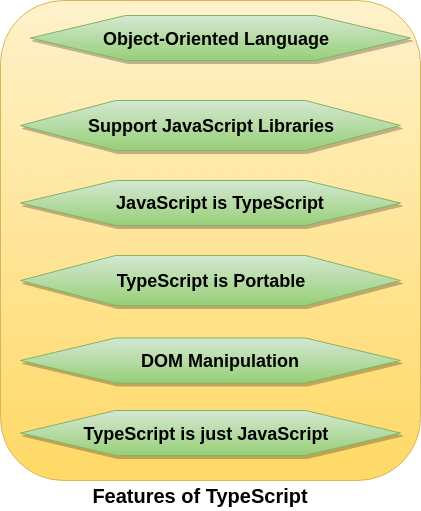
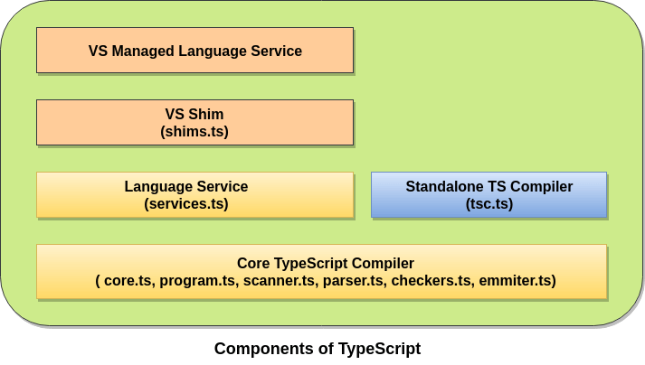
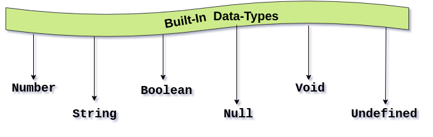

# [返回主页](https://github.com/yisainan/web-interview/blob/master/README.md)

> [转载自 50个最新TypeScript面试题合集](http://www.srcmini.com/3507.html)

<b><details><summary>1. 什么是TypeScript?</summary></b>

参考答案：

TypeScript是一种由微软开发和维护的免费开源编程语言。它是一个强类型的JavaScript超集，可编译为纯JavaScript。它是一种用于应用级JavaScript开发的语言。对于熟悉c#、Java和所有强类型语言的开发人员来说，TypeScript非常容易学习和使用。

TypeScript可以在任何浏览器、主机和操作系统上执行。TypeScript不是直接在浏览器上运行的。它需要一个编译器来编译和生成JavaScript文件。TypeScript是带有一些附加特性的ES6 JavaScript版本。

</details>

<b><details><summary>2. TypeScript和JavaScript有什么不同？</summary></b>

TypeScript与JavaScript的区别如下:

参考答案：

| 编号 | JavaScript | TypeScript |
| ----------------------------------------- | ------------------------------------------- | ------------------------------------------- |
| 1 | 	它是由网景公司在1995年开发的。 | 	它是2012年由安德斯·海尔斯伯格(Anders Hejlsberg)开发的。| 
| 2 | 	JavaScript源文件在”.js”扩展。|  	TypeScript源文件是”.ts”扩展名。| 
| 3 | 	JavaScript不支持ES6。 | 	TypeScript 支持ES6。| 
| 4 | 	它不支持强类型或静态类型。|  	它支持强类型或静态类型特性。| 
| 5 | 	它只是一种脚本语言。 | 	它支持面向对象的编程概念，如类、接口、继承、泛型等。| 
| 6 | 	JavaScript没有可选的参数特性。 | 	TypeScript有可选的参数特性。| 
| 7 | 	它是解释语言，这就是为什么它在运行时突出显示错误。 | 	它编译代码并在开发期间突出显示错误。| 
| 8 | 	JavaScript不支持模块。 	| TypeScript支持模块。| 
| 9 | 	在这里，number和string是对象。|  	在这里，number和string是接口。| 
| 10|  	JavaScript不支持泛型。 | 	TypeScript支持泛型。 | 

</details>

<b><details><summary>3. 我们为什么需要TypeScript？</summary></b>

参考答案：

我们需要TypeScript:

*    TypeScript快速、简单，最重要的是，容易学习。
*    TypeScript支持面向对象的编程特性，比如类、接口、继承、泛型等等。
*    TypeScript在编译时提供了错误检查功能。它将编译代码，如果发现任何错误，它将在运行脚本之前突出显示这些错误。
*    TypeScript支持所有JavaScript库，因为它是JavaScript的超集。
*    TypeScript通过使用继承来支持可重用性。
*    TypeScript使应用程序开发尽可能的快速和简单，并且TypeScript的工具支持为我们提供了自动完成、类型检查和源文档。
*    TypeScript支持最新的JavaScript特性，包括ECMAScript 2015。
*    TypeScript提供了ES6的所有优点和更高的生产力。
*    TypeScript支持静态类型、强类型、模块、可选参数等。

</details>

<b><details><summary>4. 列出Typescript的一些特性</summary></b>

参考答案：



</details>

<b><details><summary>5. 列出使用Typescript的一些优点?</summary></b>

参考答案：

### TypeScript 的优点

* TypeScript 增加了代码的可读性和可维护性

  *  类型系统实际上是最好的文档，大部分的函数看看类型的定义就可以知道如何使用了
  *  可以在编译阶段就发现大部分错误，这总比在运行时候出错好
  *  增强了编辑器和 IDE 的功能，包括代码补全、接口提示、跳转到定义、重构等

* TypeScript 非常包容

  *  TypeScript 是 JavaScript 的超集，.js 文件可以直接重命名为 .ts 即可
  *  即使不显式的定义类型，也能够自动做出类型推论
  *  可以定义从简单到复杂的几乎一切类型
  *  即使 TypeScript 编译报错，也可以生成 JavaScript 文件
  *  兼容第三方库，即使第三方库不是用 TypeScript 写的，也可以编写单独的类型文件供TypeScript 读取

* TypeScript 拥有活跃的社区

  *  大部分第三方库都有提供给 TypeScript 的类型定义文件
  *  Google 开发的 Angular2 就是使用 TypeScript 编写的
  *  TypeScript 拥抱了 ES6 规范，也支持部分 ESNext 草案的规范

</details>

<b><details><summary>6. Typescript的缺点是什么?</summary></b>

参考答案：

### TypeScript 的缺点

任何事物都是有两面性的， TypeScript 的弊端在于：

  *  有一定的学习成本，需要理解接口（Interfaces）、泛型（Generics）、类（Classes）、枚举类型（Enums）等前端工程师可能不是很熟悉的概念
  *  短期可能会增加一些开发成本，毕竟要多写一些类型的定义，不过对于一个需要长期维护的项目，TypeScript 能够减少其维护成本
  *  集成到构建流程需要一些工作量
  *  可能和一些库结合的不是很完美

</details>

<b><details><summary>7. TypeScript的不同组件是什么?</summary></b>

参考答案：

TypeScript主要有三个组件。这些都是- – 



语言language

该语言由新语法、关键字、类型注释等元素组成，允许我们编写TypeScript。
编译器compiler

TypeScript编译器是开源的、跨平台的，是用TypeScript编写的。它将用TypeScript编写的代码转换为JavaScript代码。它执行从TypeScript代码到JavaScript代码的解析和类型检查。它还可以帮助将不同的文件连接到单个输出文件，并生成源映射。
语言服务language service

语言服务提供信息，帮助编辑器和其他工具提供更好的辅助功能，如自动重构和智能感知。

</details>

<b><details><summary>8. Typescript是谁开发的，目前稳定的Typescript版本是什么？</summary></b>

参考答案：

typescript是由Anders Hejlsberg开发的，他也是c#语言开发团队的核心成员之一。typescript于2012年10月1日发布，被标记为0.8版。它是由Microsoft在Apache 2许可下开发和维护的。它是为开发大型应用程序而设计的。

目前稳定的TypeScript版本是3.2，于2018年9月30日发布。Typescript编译成简单的JavaScript代码，可以在任何支持ECMAScript 2015框架的浏览器上运行。它支持最新的和不断发展的JavaScript特性。

</details>

<b><details><summary>9. 说说安装Typescript的最低要求。或者我们如何获得TypeScript并安装它？</summary></b>

参考答案：

TypeScript可以通过npm (node .js包管理器)在node的帮助下进行安装和管理。要安装TypeScript，首先要确保npm安装正确，然后运行以下命令在系统上全局安装TypeScript。

```
$ npm install -g typescript  
```
它安装一个命令行代码“tsc”，它将进一步用于编译我们的Typescript代码。确保检查系统上安装的Typescript版本。

安装TypeScript需要以下步骤:

  *  下载并运行节点的.msi安装程序。
  *  输入命令“node -v”检查安装是否成功。
  *  在终端窗口中输入以下命令安装Typescript: $ npm install -g Typescript

</details>

<b><details><summary>10. 列出在Typescript中的内置类型</summary></b>

参考答案：

在Typescript中，内置的数据类型也称为原始数据类型。这些数据如下所示。



数字类型: 用于表示数字类型值。TypeScript中的所有数字都存储为浮点值。

语法: let标识符:number = value;

字符串类型: 它表示存储为Unicode UTF-16代码的字符序列。我们通过将字符串括在单引号或双引号中来在脚本中包含字符串。

语法: let标识符:字符串= ” “;

布尔类型: 用于表示逻辑值。当我们使用布尔类型时，我们只得到真或假的输出。布尔值是一个真值，它指定条件是否为真。

语法: let标识符:bool =布尔值;

Null类型: Null表示值未定义的变量。不能直接引用空类型值本身。空类型没有用处，因为我们只能为它分配一个空值。

语法: let num: number = null;

未定义类型: 它是未定义字面量的类型。未定义的类型表示所有未初始化的变量。它是没有用的，因为我们只能分配一个未定义的值给它。这种内置类型是所有类型的子类型。

语法: let num: number =未定义;

Void类型: Void是不返回任何类型值的函数的返回类型。如果没有可用的数据类型，则使用它。

语法: let unusable:void =未定义;

</details>

<b><details><summary>11. Typescript中的变量是什么？如何在Typescript中创建变量？</summary></b>

参考答案：

变量是存储位置，用于存储要被程序引用和使用的值/信息。它充当程序中值的容器。可以使用var关键字声明它。它应该在使用前声明。在Typescript中声明变量时，应该遵循某些规则-

  *  变量名必须是字母或数字。
  *  变量名不能以数字开头。
  *  变量名不能包含空格和特殊字符，除了下划线(_)和美元($)符号。

我们可以通过以下四种方式之一声明一个变量:

  *  在一条语句中声明类型和值。语法:var [identifier]: [type-annotation] = value;
  *  声明没有值的类型。语法:var [identifier]: [type-annotation];
  *  在没有类型的情况下声明它的值。语法:var [identifier] = value;
  *  声明没有值和类型。语法:var(标识符);

</details>

<b><details><summary>12. 如何编译Typescript文件？</summary></b>

参考答案：

下面是将Typescript文件编译成JavaScript时所遵循的命令。

```
$ tsc <TypeScript File Name>  
```

例如，编译“hello .ts”。

```
$ tsc helloworld.ts  
```

结果是helloworld.js。

</details>

<b><details><summary>13. 是否可以将多个.ts文件合并成一个.js文件？如果是，那么如何做？</summary></b>

参考答案：

是的，有可能。为此，我们需要添加——outFILE [OutputJSFileName]编译选项。

`$ tsc --outFile comman.js file1.ts file2.ts file3.ts  `

上面的命令将编译所有这三个.ts文件和结果将存储在一个comman.js文件中，在这种情况下，当我们不提供输出文件名像下面的命令。

`$ tsc --outFile file1.ts file2.ts file3.ts  `

然后file2.ts和file3.ts将被编译，并将输出放在file1.ts中，现在是file1.ts包含JavaScript代码。


</details>

<b><details><summary>14. 能否自动编译.ts文件，并实时修改.ts文件？</summary></b>

参考答案：

这是可以的，自动实时根据.ts文件变化自动编译.ts文件是可以的。这可以通过使用——watch compiler选项来实现

`tsc --watch file1.ts  `

上面的命令首先编译file1为file1.js，并注意文件的变化，如果检测到任何更改，它将再次编译文件。这里，我们需要确保在使用——watch选项运行时命令提示符不能关闭。

</details>

<b><details><summary>15. TS的接口是什么意思？参照TS来解释它们。</summary></b>

参考答案：

接口是在我们的应用程序中充当契约的结构。它定义了要遵循的类的语法，这意味着实现接口的类必须实现它的所有成员。它不能被实例化，但是可以被实现它的类对象引用。无论对象是否具有特定的结构，TypeScript编译器都使用接口进行类型检查(也称为“duck typing”鸭子类型或“结构化子类型”)。

语法:

```ts
interface interface_name {    
          // 字段声明
          // 方法声明
}    
```
接口只是声明方法和字段，它不能用来建造任何东西。不需要将接口转换为JavaScript来执行，它们对运行时JavaScript没有任何影响。因此，它们的唯一目的是在开发阶段提供帮助。

</details>

<b><details><summary>16. 你如何理解Typescript中的类？列出类的一些特性。</summary></b>

参考答案：

我们知道，TypeScript是一种面向对象的JavaScript语言，支持OOP编程特性，比如类、接口等。与Java一样，类是用于创建可重用组件的基本实体。它是一组具有公共属性的对象。类是创建对象的模板或蓝图。它是一个逻辑实体。“class”关键字用于在Typescript中声明一个类。

例子:

```ts
class Student {    
    studCode: number;    
    studName: string;    
    constructor(code: number, name: string) {    
            this.studName = name;    
            this.studCode = code;    
    }    
    getGrade() : string {    
        return "A+" ;    
    }    
}    
```

类的特征是-

 * 继承
 * 封装
 * 多态性
 * 抽象

</details>

<b><details><summary>17. 本地Javascript支持模块吗？</summary></b>

参考答案：不。目前，本地JavaScript不支持模块。为了在Javascript中创建和使用模块，我们需要一个像CommonJS这样的外部模块。

</details>

<b><details><summary>18. TypeScript支持哪些面向对象的术语？</summary></b>

参考答案：

TypeScript支持以下面向对象的术语。

  *  模块
  *  类
  *  接口
  *  继承
  *  数据类型
  *  成员函数

</details>

<b><details><summary>19、如何从TypeScript的子类调用基类构造函数？</summary></b>

参考答案：super()函数的作用是: 从子类中调用父类或基类构造函数。

</details>

<b><details><summary>20. 什么是超集？</summary></b>

参考答案：超集是集合论的术语

说到超集，不得不说另一个，子集，怎么理解这两个概念呢，举个例子

如果一个集合A里面的的所有元素集合B里面都存在，那么我们可以理解集合B是集合A的超集，反之集合A为集合B的子集

现在我们就能理解为 Typescript 里包含了 Javascript 的所有特性，这也意味着我们可以将.js后缀直接命名为.ts文件跑到TypeScript的编绎系统中

</details>

<b><details><summary>21. Typescript 解决了什么问题</summary></b>

参考答案：回答这个问题之前，我们有必要先来了解一下 Typescript 的工作理念

本质上是在 JavaScript 上增加一套静态类型系统（编译时进行类型分析），强调静态类型系统是为了和运行时的类型检查机制做区分，TypeScript 的代码最终会被编译为 JavaScript

我们再回到问题本身，缩小一下范围，Typescript 创造的价值大部分是在开发时体现的(编译时)，而非运行时，如

  *  强大的编辑器智能提示 (研发效率，开发体验)
  *  代码可读性增强 (团队协作，开发体验)
  *  编译时类型检查 (业务稳健，前端项目中Top10 的错误类型低级的类型错误占比达到70%)


</details>

<b><details><summary>1. </summary></b>

参考答案：

</details>

<b><details><summary>1. </summary></b>

参考答案：

</details>

<b><details><summary>1. </summary></b>

参考答案：

</details>

<b><details><summary>1. </summary></b>

参考答案：

</details>

<b><details><summary>1. </summary></b>

参考答案：

</details>

<b><details><summary>1. </summary></b>

参考答案：

</details>

<b><details><summary>1. </summary></b>

参考答案：

</details>

<b><details><summary>1. </summary></b>

参考答案：

</details>

<b><details><summary>1. </summary></b>

参考答案：

</details>

<b><details><summary>1. </summary></b>

参考答案：

</details>

<b><details><summary>1. </summary></b>

参考答案：

</details>

<b><details><summary>1. </summary></b>

参考答案：

</details>

<b><details><summary>1. </summary></b>

参考答案：

</details>

<b><details><summary>1. </summary></b>

参考答案：

</details>

<b><details><summary>1. </summary></b>

参考答案：

</details>

<b><details><summary>1. </summary></b>

参考答案：

</details>

<b><details><summary>1. </summary></b>

参考答案：

</details>

<b><details><summary>1. </summary></b>

参考答案：

</details>

<b><details><summary>1. </summary></b>

参考答案：

</details>

<b><details><summary>1. </summary></b>

参考答案：

</details>

<b><details><summary>1. </summary></b>

参考答案：

</details>

<b><details><summary>1. </summary></b>

参考答案：

</details>

<b><details><summary>1. </summary></b>

参考答案：

</details>

<b><details><summary>1. </summary></b>

参考答案：

</details>

<b><details><summary>1. </summary></b>

参考答案：

</details>

<b><details><summary>1. </summary></b>

参考答案：

</details>

<b><details><summary>1. </summary></b>

参考答案：

</details>

<b><details><summary>1. </summary></b>

参考答案：

</details>

<b><details><summary>1. </summary></b>

参考答案：

</details>

<b><details><summary>1. js项目如何升级为ts？有何影响？</summary></b>

参考答案：

[参与互动](https://github.com/yisainan/web-interview/issues/)

</details>

<b><details><summary>2. tslint都能配置哪些功能？对开发流程有何影响？</summary></b>

参考答案：

[参与互动](https://github.com/yisainan/web-interview/issues/)

</details>

<b><details><summary>3. ts 基础类型都哪些，他们跟js的区别</summary></b>

参考答案：

[参与互动](https://github.com/yisainan/web-interview/issues/)

</details>

<b><details><summary>4. ts为什么会流行？与ECMA新规范的关系？</summary></b>

参考答案：

[参与互动](https://github.com/yisainan/web-interview/issues/)

</details>

<b><details><summary>5. 如何理解接口，泛型?</summary></b>

参考答案：

[参与互动](https://github.com/yisainan/web-interview/issues/)

</details>

<b><details><summary>6. ts中type和interface的区别？</summary></b>

参考答案：

[参与互动](https://github.com/yisainan/web-interview/issues/)

</details>
