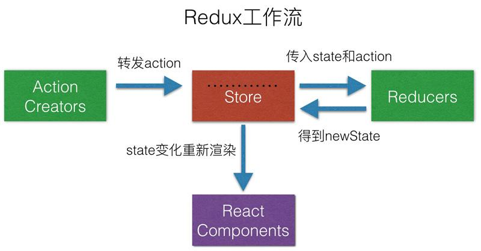
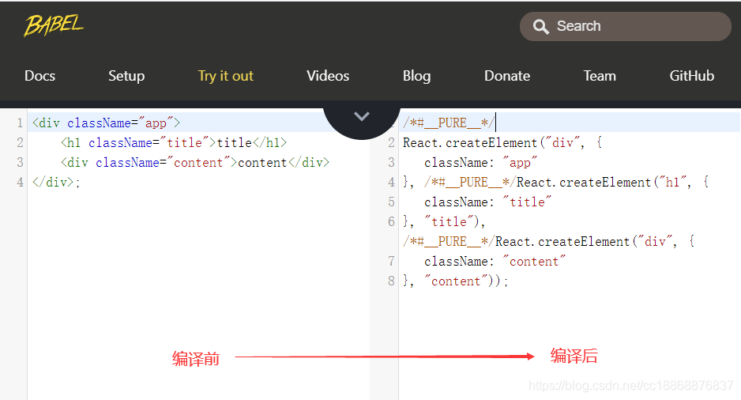

# [返回主页](https://github.com/yisainan/web-interview/blob/master/README.md)

<b><details><summary>1.当你调用 setState 的时候，发生了什么事？</summary></b>

参考答案：将传递给 setState 的对象合并到组件的当前状态，这将启动一个和解的过程，构建一个新的 react 元素树，与上一个元素树进行对比（ diff ），从而进行最小化的重渲染。

[参与互动](https://github.com/yisainan/web-interview/issues/496)

</details>

<b><details><summary>2.React 项目用过什么脚手架（本题是开放性题目）</summary></b>

参考答案：create-react-app 是最常用 的脚手架，一定要说出来！

* Create React App：如果你是在学习 React 或创建一个新的单页应用

Create React App是FaceBook的React团队官方出的一个构建React单页面应用的脚手架工具。它本身集成了Webpack，并配置了一系列内置的loader和默认的npm的脚本，可以很轻松的实现零配置就可以快速开发React的应用。

* Next.js：如果你是在用 Node.js 构建服务端渲染的网站

Next.js 为您提供生产环境所需的所有功能以及最佳的开发体验：包括静态及服务器端融合渲染、 支持 TypeScript、智能化打包、 路由预取等功能 无需任何配置。

* Gatsby：如果你是在构建面向内容的静态网站

Gatsby.js 是基于 React 构建的、速度非常快的、现代化网站生成器。超越静态网站: 用 Gatsby 可以构建博客、电子商务网站、成熟的应用程序等。

* nwb：用于React应用程序、库和其他web npm模块的工具包

* razzle：创建没有配置的服务器呈现的通用JavaScript应用程序

Razzle是类似于next.js的简单服务端框架, 用于在服务端渲染 React 应用程序。

* Neutrino：创建和构建零初始配置的现代JavaScript应用程序

* Yeoman：

Yeoman提供generator系统，一个generator是一个插件，在我们在一个完整的项目上使用‘yo’命令时，会运行该generator。通过这些官方的Generators，推出了Yeoman工作流，工作流是一个健壮、有自己特色的客户端堆栈，包含能快速构建漂亮的网络应用的工具和框架。Yeoman提供了负责开始项目开发的一切，没有任何让人头痛的手动配置。

采用模块化结构，Yeoman利用从几个开源社区网站学习到的成功和教训，以确保栈开发人员越来越智能的进行开发。基于良好的文档基础以及深思熟虑的项目构建过程，Yeoman提供测试和其他更多技术 ，因此开发人员可以更专注于解决方案而不用去担心其他小事。

Yeoman主要提供了三个工具：脚手架（yo），构建工具（grunt），包管理器（bower）。这三个工具是分别独立开发的，但是需要配合使用，来实现我们更高效的工作流模式。

* umi.js：

umi，中文可发音为乌米，是一个可插拔的企业级 react 应用框架。你可以将它简单的理解为一个专注性能的类 next.js 前端框架，并通过约定、自动生成和解析代码等方式来辅助开发，减少我们开发者的代码量。

* react-cli脚手架

* Rekit脚手架

[参与互动](https://github.com/yisainan/web-interview/issues/497)

</details>

<b><details><summary>3.功能组件( Functional Component )与类组件( Class Component )如何选择？</summary></b>

参考答案：如果您的组件具有状态( state ) 或 生命周期方法，请使用 Class 组件。否则，使用功能组件

解析：

React中有两种组件：函数组件（Functional Components) 和类组件（Class Components）。据我观察，大部分同学都习惯于用类组件，而很少会主动写函数组件，包括我自己也是这样。但实际上，在使用场景和功能实现上，这两类组件是有很大区别的。

来看一个函数组件的例子：

``` 
function Welcome = (props) => {
  const sayHi = () => {
    alert( `Hi ${props.name}` );
  }
  return (
    <div>
      <h1>Hello, {props.name}</h1>
      <button onClick ={sayHi}>Say Hi</button>
    </div>
  )
}
```

把上面的函数组件改写成类组件：

``` 
import React from 'react'

class Welcome extends React.Component {
  constructor(props) {
    super(props);
    this.sayHi = this.sayHi.bind(this);
  }
  sayHi() {
    alert( `Hi ${this.props.name}` );
  }
  render() {
    return (
      <div>
        <h1>Hello, {this.props.name}</h1>
        <button onClick ={this.sayHi}>Say Hi</button>
      </div>
    )
  }
}
```

下面让我们来分析一下两种实现的区别：

1.第一眼直观的区别是，函数组件的代码量比类组件要少一些，所以函数组件比类组件更加简洁。千万不要小看这一点，对于我们追求极致的程序员来说，这依然是不可忽视的。

2.函数组件看似只是一个返回值是DOM结构的函数，其实它的背后是无状态组件（Stateless Components）的思想。函数组件中，你无法使用State，也无法使用组件的生命周期方法，这就决定了函数组件都是展示性组件（Presentational Components），接收Props，渲染DOM，而不关注其他逻辑。

3.函数组件中没有this。所以你再也不需要考虑this带来的烦恼。而在类组件中，你依然要记得绑定this这个琐碎的事情。如示例中的sayHi。

4.函数组件更容易理解。当你看到一个函数组件时，你就知道它的功能只是接收属性，渲染页面，它不执行与UI无关的逻辑处理，它只是一个纯函数。而不用在意它返回的DOM结构有多复杂。

5.性能。目前React还是会把函数组件在内部转换成类组件，所以使用函数组件和使用类组件在性能上并无大的差异。但是，React官方已承诺，未来将会优化函数组件的性能，因为函数组件不需要考虑组件状态和组件生命周期方法中的各种比较校验，所以有很大的性能提升空间。

6.函数组件迫使你思考最佳实践。这是最重要的一点。组件的主要职责是UI渲染，理想情况下，所有的组件都是展示性组件，每个页面都是由这些展示性组件组合而成。如果一个组件是函数组件，那么它当然满足这个要求。所以牢记函数组件的概念，可以让你在写组件时，先思考这个组件应不应该是展示性组件。更多的展示性组件意味着更多的组件有更简洁的结构，更多的组件能被更好的复用。

所以，当你下次在动手写组件时，一定不要忽略了函数组件，应该尽可能多地使用函数组件。

[参与互动](https://github.com/yisainan/web-interview/issues/498)

</details>

<b><details><summary>4.React 中 keys 的作用是什么？</summary></b>

参考答案：Keys 是 React 用于追踪哪些列表中元素被修改、被添加或者被移除的辅助标识。

``` 
render () {
  return (
    <ul>
      {this.state.todoItems.map(({item, key}) => {
        return <li key={key}>{item}</li>
      })}
    </ul>
  )
}
```

在开发过程中，我们需要保证某个元素的 key 在其同级元素中具有唯一性。在 React Diff 算法中 React 会借助元素的 Key 值来判断该元素是新近创建的还是被移动而来的元素，从而减少不必要的元素重渲染。此外，React 还需要借助 Key 值来判断元素与本地状态的关联关系，因此我们绝不可忽视转换函数中 Key 的重要性。

[参与互动](https://github.com/yisainan/web-interview/issues/499)

</details>

<b><details><summary>5.React 优势</summary></b>

参考答案：

1、React 速度很快：它并不直接对 DOM 进行操作，引入了一个叫做虚拟 DOM 的概念，安插在 javascript 逻辑和实际的 DOM 之间，性能好。

2、跨浏览器兼容：虚拟 DOM 帮助我们解决了跨浏览器问题，它为我们提供了标准化的 API，甚至在 IE8 中都是没问题的。

3、一切都是 component：代码更加模块化，重用代码更容易，可维护性高。

4、单向数据流：Flux 是一个用于在 JavaScript 应用中创建单向数据层的架构，它随着 React 视图库的开发而被 Facebook 概念化。

5、同构、纯粹的 javascript：因为搜索引擎的爬虫程序依赖的是服务端响应而不是 JavaScript 的执行，预渲染你的应用有助于搜索引擎优化。

6、兼容性好：比如使用 RequireJS 来加载和打包，而 Browserify 和 Webpack 适用于构建大型应用。它们使得那些艰难的任务不再让人望而生畏。

[参与互动](https://github.com/yisainan/web-interview/issues/500)

</details>

<b><details><summary>6.React 很多个 setState 为什么是执行完再 render</summary></b>

参考答案：react为了提高整体的渲染性能，会将一次渲染周期中的state进行合并，在这个渲染周期中对所有setState的所有调用都会被合并起来之后，再一次性的渲染，这样可以避免频繁的调用setState导致频繁的操作dom，提高渲染性能。

具体的实现方面，可以简单的理解为react中存在一个状态变量isBatchingUpdates，当处于渲染周期开始时，这个变量会被设置成true，渲染周期结束时，会被设置成false，react会根据这个状态变量，当出在渲染周期中时，仅仅只是将当前的改变缓存起来，等到渲染周期结束时，再一次性的全部render。

[参与互动](https://github.com/yisainan/web-interview/issues/501)

</details>

<b><details><summary>7.react diff 原理（常考，大厂必考）</summary></b>

参考答案：

1.把树形结构按照层级分解，只比较同级元素。
2.给列表结构的每个单元添加唯一的 key 属性，方便比较。
3.React 只会匹配相同 class 的 component（这里面的 class 指的是组件的名字）
4.合并操作，调用 component 的 setState 方法的时候, React 将其标记为 dirty.到每一个事件循环结束, React 检查所有标记 dirty 的 component 重新绘制.
5.选择性子树渲染。开发人员可以重写 shouldComponentUpdate 提高 diff 的性能。

[参与互动](https://github.com/yisainan/web-interview/issues/502)

</details>

<b><details><summary>8.react 生命周期函数</summary></b>

参考答案：

#### react15生命周期

1.初始化阶段：

getDefaultProps: 获取实例的默认属性
getInitialState: 获取实例的初始化状态
componentWillMount：组件即将被装载、渲染到页面上
render: 组件在这里生成虚拟的 DOM 节点
componentDidMount: 组件真正在被装载之后

2.运行中阶段：

componentWillReceiveProps: 组件将要接收到属性的时候调用
shouldComponentUpdate: 组件接受到新属性或者新状态的时候（可以返回 false，接收数据后不更新，阻止 render 调用，后面的函数不会被继续执行了）
componentWillUpdate: 组件即将更新不能修改属性和状态
render: 组件重新描绘
componentDidUpdate: 组件已经更新

3.销毁阶段：

componentWillUnmount: 组件即将销毁

#### react16生命周期

React 在v16.3版本中将 componentWillMount, componentWillReceiveProps 以及componentWillUpdate 加上了UNSAFE_前缀，这些钩子将在React 17.0废除

新引入的两个生命周期函数 

* getDerivedStateFromProps: 是一个静态方法, 是一个和组件自身"不相关"的角色.在这个静态方法中, 除了两个默认的位置参数 nextProps 和 currentState 以外, 你无法访问任何组件上的数据.
* getSnapshotBeforeUpdate: 获取render之前的dom状态

[参与互动](https://github.com/yisainan/web-interview/issues/503)

</details>

<b><details><summary>9.shouldComponentUpdate 是做什么的？（react 性能优化是哪个周期函数？）</summary></b>

参考答案：

1.shouldComponentUpdate询问组件是否需要更新的一个钩子函数，判断数据是否需要重新渲染，返回一个布尔值。默认的返回值是true，需要重新render()。若如果返回值是false则不触发渲染,利用这个生命周期函数可以强制关闭不需要更新的子组件来提升渲染性能。
2.这个方法用来判断是否需要调用 render 方法重新描绘 dom。
3.因为 dom 的描绘非常消耗性能，如果我们能在 shouldComponentUpdate 方法中能够写出更优化的 dom diff 算法，可以极大的提高性能。

[参与互动](https://github.com/yisainan/web-interview/issues/504)

</details>

<b><details><summary>10.为什么虚拟 dom 会提高性能?(必考)</summary></b>

参考答案：

虚拟dom(virtual dom) 其实就是一个JavaScript对象，通过这个JavaScript对象来描述真实dom。

真实dom：以前没有虚拟dom，如果需要比较两个页面的差异，我们需要通过对真实dom进行比对。真实dom节点是非常复杂的，它里面会绑定的事件，它会有属性，背后会有各种方法，会频繁触发重排与重绘，所以两个真实dom比对，非常耗性能。

总损耗 = 真实DOM完全增删改 + （可能较多的节点）重排与重绘

虚拟dom：相当于在js和真实dom中间加了一个缓存，利用dom diff算法避免了没有必要的dom操作，从而提髙性能。

总损耗 = 虚拟DOM增删改 + （与Diff算法效率有关）真实DOM差异增删改 + （较少的节点）重排与重绘 

具体实现步骤如下： 

1.用JavaScript对象结构表示DOM树的结构；然后用这个树构建一个真正的DOM树，插到文档当中;
2.当状态变更的时候，重新构造一棵新的对象树。然后用新的树和旧的树进行比较，记录两棵树差异;
3.把步骤2所记录的差异应用到步骤1所构建的真正的DOM树上，视图就更新了。

[参与互动](https://github.com/yisainan/web-interview/issues/505)

</details>

<b><details><summary>11.React 中 refs 的作用是什么？</summary></b>

参考答案：

refs 是 React 提供给我们的安全访问 DOM 元素或者某个组件实例的句柄。我们可以为元素添加 ref 属性然后在回调函数中接受该元素在 DOM 树中的句柄，该值会作为回调函数的第一个参数返回：

``` jsx
class CustomForm extends Component {
  handleSubmit = () => {
    console.log("Input Value: ", this.input.value)
  }
  render () {
    return (
      <form onSubmit={this.handleSubmit}>
        <input
          type='text'
          ref={(input) => this.input = input} />
        <button type='submit'>Submit</button>
      </form>
    )
  }
}
```

上述代码中的 input 域包含了一个 ref 属性，该属性声明的回调函数会接收 input 对应的 DOM 元素，我们将其绑定到 this 指针以便在其他的类函数中使用。另外值得一提的是，refs 并不是类组件的专属，函数式组件同样能够利用闭包暂存其值：

``` 
function CustomForm ({handleSubmit}) {
  let inputElement
  return (
    <form onSubmit={() => handleSubmit(inputElement.value)}>
      <input
        type='text'
        ref={(input) => inputElement = input} />
      <button type='submit'>Submit</button>
    </form>
  )
}
```

[参与互动](https://github.com/yisainan/web-interview/issues/506)

</details>

<b><details><summary>12.setState 和 replaceState 的区别</summary></b>

参考答案：

1.setState 是修改其中的部分状态，相当于 Object.assign，只是覆盖，不会减少原来的状态；
2.replaceState 是完全替换原来的状态，相当于赋值，将原来的 state 替换为另一个对象，如果新状态属性减少，那么 state 中就没有这个状态了。

[参与互动](https://github.com/yisainan/web-interview/issues/507)

</details>

<b><details><summary>13.redux 有什么缺点</summary></b>

参考答案：

* 一个组件所需要的数据，必须由父组件传过来，而不能像 flux 中直接从 store 取。
* 当一个组件相关数据更新时，即使父组件不需要用到这个组件，父组件还是会重新 render，可能会有效率影响，或者需要写复杂的 shouldComponentUpdate 进行判断。

[参与互动](https://github.com/yisainan/web-interview/issues/508)

</details>

<b><details><summary>14.简述 flux 思想</summary></b>

参考答案：Flux 的最大特点，就是数据的"单向流动"。

1.用户访问 View
2.View 发出用户的 Action
3.Dispatcher 收到 Action，要求 Store 进行相应的更新
4.Store 更新后，发出一个"change"事件
5.View 收到"change"事件后，更新页面

[参考](http://www.ruanyifeng.com/blog/2016/01/flux.html)

[参与互动](https://github.com/yisainan/web-interview/issues/509)

</details>

<b><details><summary>15.了解 redux 么，说一下 redux 吧</summary></b>

参考答案：

1、为什么要用redux

在React中，数据在组件中是单向流动的，数据从一个方向父组件流向子组件（通过props）, 所以，两个非父子组件之间通信就相对麻烦，redux的出现就是为了解决state里面的数据问题

2、Redux设计理念

Redux是将整个应用状态存储到一个地方上称为store, 里面保存着一个状态树store tree, 组件可以派发(dispatch)行为(action)给store, 而不是直接通知其他组件，组件内部通过订阅store中的状态state来刷新自己的视图。



3、Redux三大原则

1.唯一数据源

整个应用的state都被存储到一个状态树里面，并且这个状态树，只存在于唯一的store中

2.保持只读状态

state是只读的，唯一改变state的方法就是触发action，action是一个用于描述以发生时间的普通对象

3.数据改变只能通过纯函数来执行

使用纯函数来执行修改，为了描述action如何改变state的，你需要编写reducers

4、Redux概念解析

1.Store
* store就是保存数据的地方，你可以把它看成一个数据，整个应用只能有一个store
* Redux提供createStore这个函数，用来生成Store

``` js
import {
    createStore
} from 'redux'
const store = createStore(fn);
```

2.State

state就是store里面存储的数据，store里面可以拥有多个state，Redux规定一个state对应一个View, 只要state相同，view就是一样的，反过来也是一样的，可以通过store.getState( )获取

``` js
import {
    createStore
} from 'redux'
const store = createStore(fn);
const state = store.getState()
```

3.Action

state的改变会导致View的变化，但是在redux中不能直接操作state也就是说不能使用this.setState来操作，用户只能接触到View。在Redux中提供了一个对象来告诉Store需要改变state。Action是一个对象其中type属性是必须的，表示Action的名称，其他的可以根据需求自由设置。

``` js
const action = {
    type: 'ADD_TODO',
    payload: 'redux原理'
}
```

在上面代码中，Action的名称是ADD_TODO，携带的数据是字符串‘redux原理’，Action描述当前发生的事情，这是改变state的唯一的方式

4.store.dispatch( )

store.dispatch( )是view发出Action的唯一办法

``` js
store.dispatch({
    type: 'ADD_TODO',
    payload: 'redux原理'
})
```

store.dispatch接收一个Action作为参数，将它发送给store通知store来改变state。

5.Reducer

Store收到Action以后，必须给出一个新的state，这样view才会发生变化。这种state的计算过程就叫做Reducer。
Reducer是一个纯函数，他接收Action和当前state作为参数，返回一个新的state

> 注意：Reducer必须是一个纯函数，也就是说函数返回的结果必须由参数state和action决定，而且不产生任何副作用也不能修改state和action对象

``` js
const reducer = (state, action) => {
    switch (action.type) {
        case ADD_TODO:
            return newstate;
        default
        return state
    }
}
```

5、Redux源码

``` js
let createStore = (reducer) => {
    let state;
    //获取状态对象
    //存放所有的监听函数
    let listeners = [];
    let getState = () => state;
    //提供一个方法供外部调用派发action
    let dispath = (action) => {
        //调用管理员reducer得到新的state
        state = reducer(state, action);
        //执行所有的监听函数
        listeners.forEach((l) => l())
    }
    //订阅状态变化事件，当状态改变发生之后执行监听函数
    let subscribe = (listener) => {
        listeners.push(listener);
    }
    dispath();
    return {
        getState,
        dispath,
        subscribe
    }
}
let combineReducers = (renducers) => {
    //传入一个renducers管理组，返回的是一个renducer
    return function(state = {}, action = {}) {
        let newState = {};
        for (var attr in renducers) {
            newState[attr] = renducers[attr](state[attr], action)

        }
        return newState;
    }
}
export {
    createStore,
    combineReducers
};
```

6、Redux使用案例

html代码

``` html
<div id="counter"></div>
<button id="addBtn">+</button>
<button id="minusBtn">-</button>
```

js代码

``` js
function createStore(reducer) {
    var state;
    var listeners = [];
    var getState = () => state;
    var dispatch = (action) => {
        state = reducer(state, action);
        listeners.forEach(l => l());
    }
    var subscribe = (listener) => {
        listeners.push(listener);
        return () => {
            listeners = listeners.filter((l) => l != listener)
        }
    }
    dispatch();
    return {
        getState,
        dispatch,
        subscribe
    }
}
var reducer = (state = 0, action) => {
    if (!action) return state;
    console.log(action);
    switch (action.type) {
        case 'INCREMENT':
            return state + 1;
        case 'DECREMENT':
            return state - 1;
        default:
            return state;
    }
}
var store = createStore(reducer);
store.subscribe(function() {
    document.querySelector('#counter').innerHTML = store.getState();
});

document.querySelector('#addBtn').addEventListener('click', function() {
    store.dispatch({
        type: 'INCREMENT'
    });
});
document.querySelector('#minusBtn').addEventListener('click', function() {
    store.dispatch({
        type: 'DECREMENT'
    });
});
```

[参考](https://www.jianshu.com/p/e984206553c2)
[参与互动](https://github.com/yisainan/web-interview/issues/510)

</details>

<b><details><summary>16.React 中有三种构建组件的方式</summary></b>

参考答案：React.createClass()、ES6 class 和无状态函数。

[参与互动](https://github.com/yisainan/web-interview/issues/511)

</details>

<b><details><summary>17.react 组件的划分业务组件技术组件？</summary></b>

参考答案：

* 根据组件的职责通常把组件分为 UI 组件和容器组件。
* UI 组件负责 UI 的呈现，容器组件负责管理数据和逻辑。
* 两者通过 React-Redux 提供 connect 方法联系起来。

[参与互动](https://github.com/yisainan/web-interview/issues/512)

</details>

<b><details><summary>18.描述事件在 React 中的处理方式</summary></b>

参考答案：

为了解决跨浏览器兼容性问题，您的 React 中的事件处理程序将传递 SyntheticEvent 的实例，它是 React 的浏览器本机事件的跨浏览器包装器。

这些 SyntheticEvent 与您习惯的原生事件具有相同的接口，除了它们在所有浏览器中都兼容。有趣的是，React 实际上并没有将事件附加到子节点本身。React 将使用单个事件监听器监听顶层的所有事件。这对于性能是有好处的，这也意味着在更新 DOM 时，React 不需要担心跟踪事件监听器。

[参与互动](https://github.com/yisainan/web-interview/issues/513)

</details>

<b><details><summary>19.应该在 React 组件的何处发起 Ajax 请求</summary></b>

参考答案：

在 React 组件中，应该在 componentDidMount 中发起网络请求。这个方法会在组件第一次“挂载”(被添加到 DOM)时执行，在组件的生命周期中仅会执行一次。更重要的是，你不能保证在组件挂载之前 Ajax 请求已经完成，如果是这样，也就意味着你将尝试在一个未挂载的组件上调用 setState，这将不起作用。在 componentDidMount 中发起网络请求将保证这有一个组件可以更新了。

[参与互动](https://github.com/yisainan/web-interview/issues/514)

</details>

<b><details><summary>20.(在构造函数中)调用 super(props) 的目的是什么</summary></b>

参考答案：

在 super() 被调用之前，子类是不能使用 this 的，在 ES2015 中，子类必须在 constructor 中调用 super()。传递 props 给 super() 的原因则是便于(在子类中)能在 constructor 访问 this.props。

[参与互动](https://github.com/yisainan/web-interview/issues/515)

</details>

<b><details><summary>21.除了在构造函数中绑定 this，还有其它方式吗</summary></b>

参考答案：

你可以使用属性初始值设定项(property initializers)来正确绑定回调，create-react-app 也是默认支持的。在回调中你可以使用箭头函数，但问题是每次组件渲染时都会创建一个新的回调。

[参与互动](https://github.com/yisainan/web-interview/issues/516)

</details>

<b><details><summary>22.为什么建议传递给 setState 的参数是一个 callback 而不是一个对象</summary></b>

参考答案：

因为 this.props 和 this.state 的更新可能是异步的，不能依赖它们的值去计算下一个 state。

[参与互动](https://github.com/yisainan/web-interview/issues/517)

</details>

<b><details><summary>23.何为高阶组件(higher order component)</summary></b>

参考答案：

高阶组件是一个以组件为参数并返回一个新组件的函数。HOC 运行你重用代码、逻辑和引导抽象。最常见的可能是 Redux 的 connect 函数。除了简单分享工具库和简单的组合，HOC 最好的方式是共享 React 组件之间的行为。如果你发现你在不同的地方写了大量代码来做同一件事时，就应该考虑将代码重构为可重用的 HOC。

[参与互动](https://github.com/yisainan/web-interview/issues/518)

</details>

<b><details><summary>24.何为受控组件(controlled component)</summary></b>

参考答案：

在 HTML 中，类似 `<input>` , `<textarea>` 和 `<select>` 这样的表单元素会维护自身的状态，并基于用户的输入来更新。当用户提交表单时，前面提到的元素的值将随表单一起被发送。但在 React 中会有些不同，包含表单元素的组件将会在 state 中追踪输入的值，并且每次调用回调函数时，如 onChange 会更新 state，重新渲染组件。一个输入表单元素，它的值通过 React 的这种方式来控制，这样的元素就被称为"受控元素"。

[参与互动](https://github.com/yisainan/web-interview/issues/519)

</details>

<b><details><summary>25.在 React 当中 Element 和 Component 有何区别？</summary></b>

参考答案：

React Element 是描述屏幕上所见内容的数据结构，是对于 UI 的对象表述。典型的 React Element 就是利用 JSX 构建的声明式代码片然后被转化为 createElement 的调用组合。

React Component 是一个函数或一个类，可以接收参数输入，并且返回某个 React Element

[参与互动](https://github.com/yisainan/web-interview/issues/520)

</details>

<b><details><summary>26.(组件的)状态(state)和属性(props)之间有何区别</summary></b>

参考答案：

* State 是一种数据结构，用于组件挂载时所需数据的默认值。State 可能会随着时间的推移而发生突变，但多数时候是作为用户事件行为的结果。
* Props(properties 的简写)则是组件的配置。props 由父组件传递给子组件，并且就子组件而言，props 是不可变的(immutable)。组件不能改变自身的 props，但是可以把其子组件的 props 放在一起(统一管理)。Props 也不仅仅是数据--回调函数也可以通过 props 传递。

[参与互动](https://github.com/yisainan/web-interview/issues/521)

</details>

<b><details><summary>27.展示组件(Presentational component)和容器组件(Container component)之间有何区别？</summary></b>

参考答案：

* 展示组件关心组件看起来是什么。展示专门通过 props 接受数据和回调，并且几乎不会有自身的状态，但当展示组件拥有自身的状态时，通常也只关心 UI 状态而不是数据的状态。
* 容器组件则更关心组件是如何运作的。容器组件会为展示组件或者其它容器组件提供数据和行为(behavior)，它们会调用 Flux actions，并将其作为回调提供给展示组件。容器组件经常是有状态的，因为它们是(其它组件的)数据源。

[参与互动](https://github.com/yisainan/web-interview/issues/522)

</details>

<b><details><summary>28.类组件(Class component)和 函数式组件(Functional component)之间有何区别？</summary></b>

参考答案：

1.函数式组件比类组件操作简单，只是简单的调取和返回 JSX；而类组件可以使用生命周期函数来操作业务

2.函数式组件可以理解为静态组件（组件中的内容调取的时候已经固定了，很难再修改），而类组件，可以基于组件内部的状态来动态更新渲染的内容

* 类组件不仅允许你使用更多额外的功能，如组件自身的状态和生命周期钩子，也能使组件直接访问 store 并维持状态
* 当组件仅是接收 props，并将组件自身渲染到页面时，该组件就是一个 '无状态组件(stateless component)'，可以使用一个纯函数来创建这样的组件。这种组件也被称为哑组件(dumb components)或展示组件

[参与互动](https://github.com/yisainan/web-interview/issues/523)

</details>

<b><details><summary>29.createElement 和 cloneElement 有什么区别？</summary></b>

参考答案：传入的第一个参数不同

React.createElement(): JSX 语法就是用 React.createElement()来构建 React 元素的。它接受三个参数，第一个参数可以是一个标签名。如 div、span，或者 React 组件。第二个参数为传入的属性。第三个以及之后的参数，皆作为组件的子组件。

``` 
React.createElement(type, [props], [...children]);
```

React.cloneElement()与 React.createElement()相似，不同的是它传入的第一个参数是一个 React 元素，而不是标签名或组件。新添加的属性会并入原有的属性，传入到返回的新元素中，而旧的子元素将被替换。将保留原始元素的键和引用。

``` 
React.cloneElement(element, [props], [...children]);
```

[参与互动](https://github.com/yisainan/web-interview/issues/524)

</details>

<b><details><summary>30.React实现一个防抖的模糊查询输入框</summary></b>

参考答案：[參考](https://blog.csdn.net/cc18868876837/article/details/96303296)

</details>

<b><details><summary>31.React 和 Vue 的 diff 时间复杂度从 O(n^3) 优化到 O(n) ，那么 O(n^3) 和 O(n) 是如何计算出来的？</summary></b>

参考答案：

</details>

<b><details><summary>32.React 中 setState 什么时候是同步的，什么时候是异步的？</summary></b>

参考答案：

</details>

<b><details><summary>33.react-router里的 `<Link>` 标签和 `<a>` 标签有什么区别（滴滴）</summary></b>

参考答案：

</details>

<b><details><summary>34.react-router怎么实现路由切换（滴滴）</summary></b>

参考答案：

</details>

<b><details><summary>35.React组件事件代理的原理（网易）</summary></b>

参考答案：

</details>

<b><details><summary>36.RN的原理，为什么可以同时在安卓和IOS端运行（寺库）</summary></b>

参考答案：

</details>

<b><details><summary>37.比较一下React与Vue</summary></b>

参考答案：

``` 
相同点
1)	都有组件化开发和Virtual DOM
2)	都支持props进行父子组件间数据通信
3)	都支持数据驱动视图, 不直接操作真实DOM, 更新状态数据界面就自动更新
4)	都支持服务器端渲染
5)	都有支持native的方案,React的React Native,Vue的Weex

不同点
1)	数据绑定: vue实现了数据的双向绑定,react数据流动是单向的
2)	组件写法不一样, React推荐的做法是 JSX , 也就是把HTML和CSS全都写进JavaScript了,即'all in js'; Vue推荐的做法是webpack+vue-loader的单文件组件格式,即html,css,js写在同一个文件
3)	state对象在react应用中不可变的,需要使用setState方法更新状态;在vue中,state对象不是必须的,数据由data属性在vue对象中管理
4)	virtual DOM不一样,vue会跟踪每一个组件的依赖关系,不需要重新渲染整个组件树.而对于React而言,每当应用的状态被改变时,全部组件都会重新渲染,所以react中会需要shouldComponentUpdate这个生命周期函数方法来进行控制
5)	React严格上只针对MVC的view层,Vue则是MVVM模式
```

</details>

<b><details><summary>38.受控组件与非受控组件</summary></b>

参考答案：

* 受控: 表单元素状态由使用者维护
* 非受控: 表单元素状态DOM 自身维护

1.受控组件

在HTML中，标签`<input>、<textarea>、<select>`的值的改变通常是根据用户输入进行更新。在React中，可变状态通常保存在组件的状态属性中，并且只能使用 setState() 更新，而呈现表单的React组件也控制着在后续用户输入时该表单中发生的情况，以这种由React控制的输入表单元素而改变其值的方式，称为：“受控组件”。

2.不受控组件

表单数据由DOM本身处理。即不受setState()的控制，与传统的HTML表单输入相似，input输入值即显示最新值（使用 ref 从DOM获取表单值）

</details>

<b><details><summary>39.reactjs主要方法</summary></b>

参考答案：

``` 
render()
getInitialState() //组件挂载之前调用一次
getDefaultProps() //在组件类创建的时候调用一次
propTypes() //对象允许验证传入到组件的props
生命周期方法
componentWillMount() //服务器端和客户端都只调用一次，在初始化渲染执行之前立刻调用
componentDidMount() //在初始化渲染执行之后立刻调用一次，仅客户端有效（服务器端不会调用）
componentWillReceiveProps(object nextProps) //在组件接收到新的 props 的时候调用
shouldComponentUpdate(object nextProps,object nextState) //在接收到新的props或者state，将要渲染之前调用。返回true或者false
componentWillUpdate(object nextProps,object nextState) //在接收到新的props或者state之前立刻调用。
componentDidUpdate(object prevProps,object prevState) //在组件的更新已经同步到DOM中之后立刻被调用
componentWillUnmount() //在组件从DOM中移除的时候立刻被调用
```

</details>

<b><details><summary>40.React.cloneElement()解析</summary></b>

参考答案：

``` js
React.cloneElement(
    element,
    [props],
    [...children]
)
```

说明： 该方法以 element 作为起点，克隆并返回一个新的 React 元素。所产生的元素将具有原始元素的props ，新的 props 为浅层合并。 新的子元素将取代现有的子元素， key 和 ref 将被保留。

该方法接收三个参数，注意参数的数据类型：

* 第一个参数为必选参数：TYPE（ReactElement），用于克隆的母体React元素。
* 第二个参数为可选参数：[PROPS（object）]，为克隆后生成的React元素添加新的props或覆盖从母体中克隆而来的部分或全部props。
* 第三个参数为可选参数：[CHILDREN（ReactElement）]，为新生成的React元素添加新的children，取代从母体中克隆而来的children。

</details>

<b><details><summary>41.JSX 的本质是什么，它和 JS 之间到底是什么关系？</summary></b>

参考答案：JSX 的本质其实是React.createElement这个 JavaScript 调用的语法糖。

这个描述的意思是使用JSX语法可以扩展JavaScript 的功能：在JavaScript 中可以像写HTML一样来构建UI（原生JS是不具备这种能力的），但编译后最终其实还是纯JS代码。JSX 的定位是 JavaScript 的“扩展”，而非 JavaScript 的“某个版本”，所以浏览器并不会像天然支持 JavaScript 一样地支持 JSX。要使JSX在JavaScript中生效，我们需要借助Babel（Babel 是一个工具链，主要用于将 ECMAScript 2015+ 版本的代码转换为向后兼容的 JavaScript 语法，以便能够运行在当前和旧版本的浏览器或其他环境中。类似的，Babel 也具备将 JSX 语法转换为 JavaScript 代码的能力。）进行编译：JSX 会被编译为 React.createElement()， React.createElement() 将返回一个叫作“React Element”的 JS 对象。


如下一个Babel编译的例子：

可以看到，所有的 JSX 标签都被转化成了 React.createElement 调用，这也就意味着，我们写的 JSX 其实写的就是 React.createElement。



这里我们可以得出结论：JSX 的本质其实是React.createElement这个 JavaScript 调用的语法糖。

解析：[参考地址](https://chen-cong.blog.csdn.net/article/details/111920385)

</details>

<b><details><summary>42.为什么要用 JSX？不用会有什么后果？</summary></b>

参考答案：JSX 语法糖允许前端开发者使用我们最为熟悉的类 HTML 标签语法来创建虚拟 DOM，在降低学习成本的同时，也提升了研发效率与研发体验。

</details>

<b><details><summary>43.JSX 背后的功能模块是什么，这个功能模块都做了哪些事情？</summary></b>

参考答案：JSX 背后的功能模块是React.createElement，该函数并没有做很多复杂的事情，基本上是在进行格式化数据的操作，执行到最后会 return 一个针对 ReactElement 的调用。

解析：[参考地址](https://chen-cong.blog.csdn.net/article/details/111920385)

</details>

<b><details><summary></summary></b>

参考答案：

</details>

<b><details><summary></summary></b>

参考答案：

</details>
