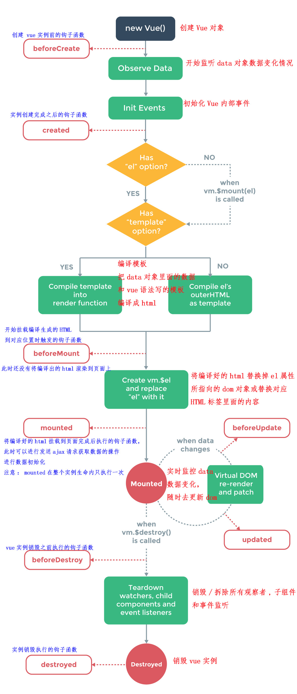
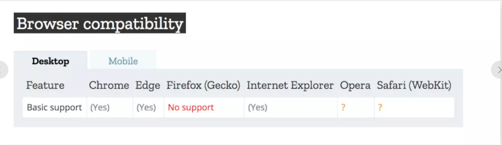
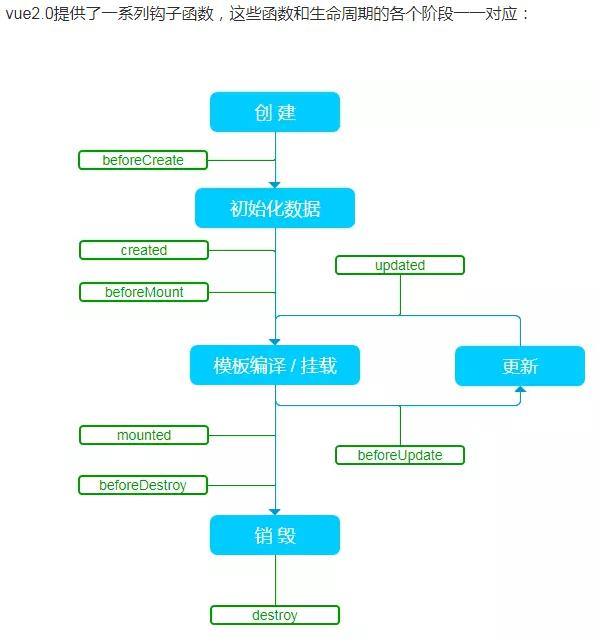
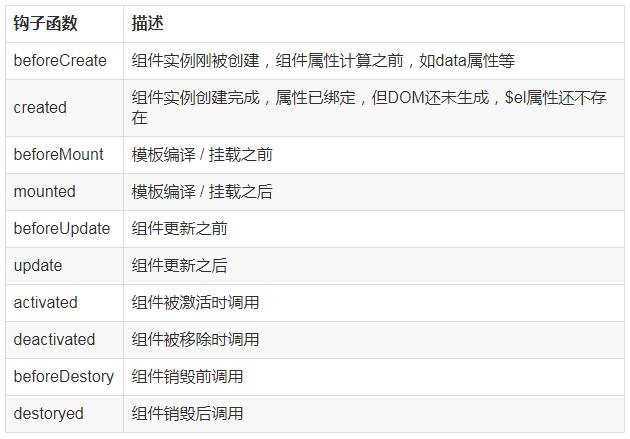
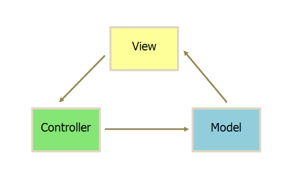
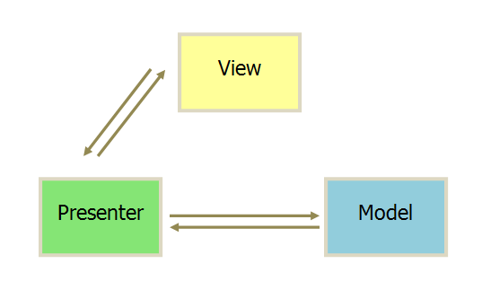
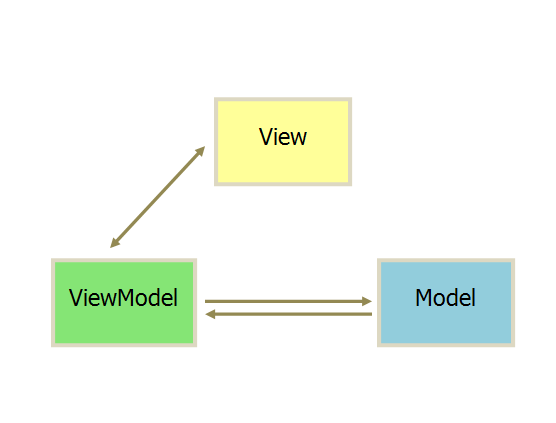
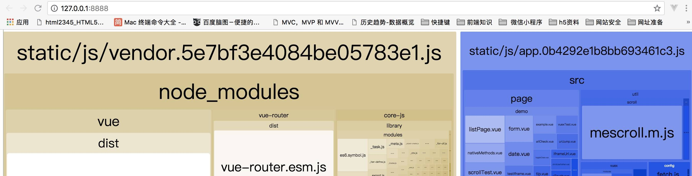
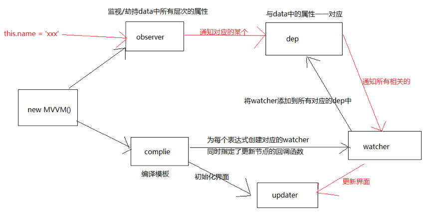
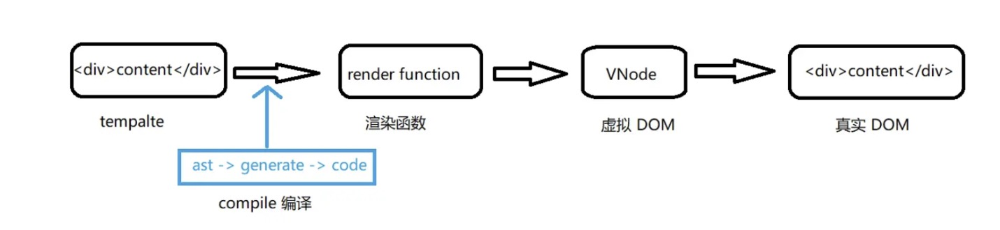

# [返回主页](https://github.com/yisainan/web-interview/blob/master/README.md)

<b><details><summary>1.vue 中的性能优化</summary></b>

参考答案：

1）编码优化

* 尽量减少data中的数据，data中的数据都会增加getter和setter，会收集对应的watcher
* v-if和v-for不能连用
* 如果需要使用v-for给每项元素绑定事件时使用事件代理
* SPA 页面采用keep-alive缓存组件
* 在更多的情况下，使用v-if替代v-show
* key保证唯一
* 使用路由懒加载、异步组件
* 防抖、节流
* 第三方模块按需导入
* 长列表滚动到可视区域动态加载
* 图片懒加载

2）用户体验优化

* 骨架屏
* PWA（渐进式WEB应用）
* 还可以使用缓存(客户端缓存、服务端缓存)优化、服务端开启gzip压缩等。

3）SEO优化

* 预渲染
* 服务端渲染SSR

4）打包优化

* 压缩代码；
* Tree Shaking/Scope Hoisting；
* 使用cdn加载第三方模块；
* 多线程打包happypack；
* splitChunks抽离公共文件；
* sourceMap优化；

说明：优化是个大工程，会涉及很多方面

[参与互动](https://github.com/yisainan/web-interview/issues/392)

</details>

<b><details><summary>2.vue 的实例生命周期</summary></b>

参考答案：



（1） beforeCreate 初始化实例后 数据观测和事件配置之前调用

（2） created 实例创建完成后调用

（3） beforeMount 挂载开始前被用

（4） mounted el 被新建 vm.$el 替换并挂在到实例上之后调用

（5） beforeUpdate 数据更新时调用

（6） updated 数据更改导致的 DOM 重新渲染后调用

（7） beforeDestory 实例被销毁前调用

（8） destroyed 实例销毁后调用

Vue2 与Vue3的生命周期对比

| Vue2                                   | Vue3                               |
| ----------------------------------------- | ------------------------------------------- |
| beforeCreate(组件创建之前)                | setup(组件创建之前)                         |
| created(组件创建完成)                     | setup(组件创建完成)                         |
| beforeMount(组件挂载之前)                 | onBeforeMount(组件挂载之前)                 |
| mounted(组件挂载完成)                     | onMounted(组件挂载完成)                     |
| beforeUpdate(数据更新，虚拟DOM打补丁之前) | onBeforeUpdate(数据更新，虚拟DOM打补丁之前) |
| updated(数据更新，虚拟DOM渲染完成)        | onUpdated(数据更新，虚拟DOM渲染完成)        |
| beforeDestroy(组件销毁之前)               | onBeforeUnmount(组件销毁之前)               |
| destroyed(组件销毁之后)                   | onUnmounted(组件销毁之后)                   |

[参与互动](https://github.com/yisainan/web-interview/issues/393)

</details>

<b><details><summary>3.vue 的双向数据绑定的原理</summary></b>

参考答案：

Vue2.0 实现双向数据绑定的原理就是利用了 Object.defineProperty() 这个方法重新定义了对象获取属性值(get)和设置属性值(set)的操作来实现的。

Vue3.0 用原生 Proxy 替换 Object.defineProperty。

[参与互动](https://github.com/yisainan/web-interview/issues/394)

</details>

<b><details><summary>4. 为什么要替换 Object.defineProperty？（Proxy 相比于 defineProperty 的优势）</summary></b>

参考答案：

1. 在 Vue 中，Object.defineProperty 无法监控到数组下标的变化，导致直接通过数组的下标给数组设置值，不能实时响应。

2. Object.defineProperty只能劫持对象的属性,因此我们需要对每个对象的每个属性进行遍历。Vue 2.x里，是通过 递归 + 遍历 data 对象来实现对数据的监控的，如果属性值也是对象那么需要深度遍历,显然如果能劫持一个完整的对象是才是更好的选择。

而要取代它的Proxy有以下两个优点; 

* 可以劫持整个对象，并返回一个新对象
* 有13种劫持操作

既然Proxy能解决以上两个问题，而且Proxy作为es6的新属性在vue2.x之前就有了，为什么vue2.x不使用Proxy呢？一个很重要的原因就是：

Proxy是es6提供的新特性，兼容性不好，最主要的是这个属性无法用polyfill来兼容

[参与互动](https://github.com/yisainan/web-interview/issues/395)

</details>

<b><details><summary>5. 什么是 Proxy？</summary></b>

参考答案：

1. 含义：

Proxy 是 ES6 中新增的一个特性，翻译过来意思是"代理"，用在这里表示由它来“代理”某些操作。 Proxy 让我们能够以简洁易懂的方式控制外部对对象的访问。其功能非常类似于设计模式中的代理模式。

Proxy 可以理解成，在目标对象之前架设一层“拦截”，外界对该对象的访问，都必须先通过这层拦截，因此提供了一种机制，可以对外界的访问进行过滤和改写。

使用 Proxy 的核心优点是可以交由它来处理一些非核心逻辑（如：读取或设置对象的某些属性前记录日志；设置对象的某些属性值前，需要验证；某些属性的访问控制等）。 从而可以让对象只需关注于核心逻辑，达到关注点分离，降低对象复杂度等目的。

2. 基本用法：

``` js
let p = new Proxy(target, handler);
```

参数：

* target 是用Proxy包装的被代理对象（可以是任何类型的对象，包括原生数组，函数，甚至另一个代理）。
* handler 是一个对象，其声明了代理target 的一些操作，其属性是当执行一个操作时定义代理的行为的函数。
* p 是代理后的对象。当外界每次对 p 进行操作时，就会执行 handler 对象上的一些方法。Proxy共有13种劫持操作，handler代理的一些常用的方法有如下几个：

``` 
get： 读取
set： 修改
has： 判断对象是否有该属性
construct： 构造函数
```

3. 示例：

下面就用Proxy来定义一个对象的get和set，作为一个基础demo

``` js
 let obj = {};
 let handler = {
     get(target, property) {
         console.log( `${property} 被读取` );
         return property in target ? target[property] : 3;
     },
     set(target, property, value) {
         console.log( `${property} 被设置为 ${value}` );
         target[property] = value;
     }
 }

 let p = new Proxy(obj, handler);
 p.name = 'tom' //name 被设置为 tom
 p.age; //age 被读取 3
```

 p 读取属性的值时，实际上执行的是 handler.get() ：在控制台输出信息，并且读取被代理对象 obj 的属性。

p 设置属性值时，实际上执行的是 handler.set() ：在控制台输出信息，并且设置被代理对象 obj 的属性的值。

以上介绍了Proxy基本用法，实际上这个属性还有许多内容，具体可参考[Proxy文档](https://developer.mozilla.org/zh-CN/docs/Web/JavaScript/Reference/Global_Objects/Proxy)

三. [基于Proxy来实现双向绑定](https://www.jianshu.com/p/860418f0785c)

[参与互动](https://github.com/yisainan/web-interview/issues/396)

</details>

<b><details><summary>6. 为什么避免 v-if 和 v-for 用在一起</summary></b>

参考答案：

vue2.x 中v-for优先级高于v-if，vue3.x 相反。所以2.x 版本中在一个元素上同时使用 v-if 和 v-for 时，v-for 会优先作用，造成性能浪费；3.x 版本中 v-if 总是优先于 v-for 生效，导致v-if访问不了v-for中的变量。

解析：

一般我们在两种常见的情况下会倾向于这样做：

* 为了过滤一个列表中的项目 (比如 v-for="user in users" v-if="user.isActive")。在这种情形下，请将 users 替换为一个计算属性 (比如 activeUsers)，让其返回过滤后的列表。

* 为了避免渲染本应该被隐藏的列表 (比如 v-for="user in users" v-if="shouldShowUsers")。这种情形下，请将 v-if 移动至容器元素上 (比如 ul、ol)。

当 Vue 处理指令时，v-for 比 v-if 具有更高的优先级，所以这个模板：

```html
<ul>
  <li
    v-for="user in users"
    v-if="user.isActive"
    :key="user.id"
  >
    {{ user.name }}
  </li>
</ul>
```
将会经过如下运算：
```js
this.users.map(function (user) {
  if (user.isActive) {
    return user.name
  }
})
```
因此哪怕我们只渲染出一小部分用户的元素，也得在每次重渲染的时候遍历整个列表，不论活跃用户是否发生了变化。

通过将其更换为在如下的一个计算属性上遍历：

```js
computed: {
  activeUsers: function () {
    return this.users.filter(function (user) {
      return user.isActive
    })
  }
}
```

```html
<ul>
  <li
    v-for="user in activeUsers"
    :key="user.id"
  >
    {{ user.name }}
  </li>
</ul>
```
我们将会获得如下好处：

* 过滤后的列表只会在 users 数组发生相关变化时才被重新运算，过滤更高效。
* 使用 v-for="user in activeUsers" 之后，我们在渲染的时候只遍历活跃用户，渲染更高效。
* 解耦渲染层的逻辑，可维护性 (对逻辑的更改和扩展) 更强。

为了获得同样的好处，我们也可以把：

```html
<ul>
  <li
    v-for="user in users"
    v-if="shouldShowUsers"
    :key="user.id"
  >
    {{ user.name }}
  </li>
</ul>
```
更新为：
```html
<ul v-if="shouldShowUsers">
  <li
    v-for="user in users"
    :key="user.id"
  >
    {{ user.name }}
  </li>
</ul>
```
通过将 v-if 移动到容器元素，我们不会再对列表中的每个用户检查 shouldShowUsers。取而代之的是，我们只检查它一次，且不会在 shouldShowUsers 为否的时候运算 v-for。

反例：

```html
<ul>
  <li
    v-for="user in users"
    v-if="user.isActive"
    :key="user.id"
  >
    {{ user.name }}
  </li>
</ul>

<ul>
  <li
    v-for="user in users"
    v-if="shouldShowUsers"
    :key="user.id"
  >
    {{ user.name }}
  </li>
</ul>
```

好例子

```html
<ul>
  <li
    v-for="user in activeUsers"
    :key="user.id"
  >
    {{ user.name }}
  </li>
</ul>

<ul v-if="shouldShowUsers">
  <li
    v-for="user in users"
    :key="user.id"
  >
    {{ user.name }}
  </li>
</ul>
```

[参与互动](https://github.com/yisainan/web-interview/issues/397)

</details>

<b><details><summary>7. 组件的设计原则</summary></b>

参考答案：

``` 
(1)页面上每个独立的可视/可交互区域视为一个组件(比如页面的头部，尾部，可复用的区块)
(2)每个组件对应一个工程目录，组件所需要的各种资源在这个目录下就近维护(组件的就近维护思想体现了前端的工程化思想，为前端开发提供了很好的分治策略，在vue.js中，通过.vue文件将组件依赖的模板，js，样式写在一个文件中)
(每个开发者清楚开发维护的功能单元，它的代码必然存在在对应的组件目录中，在该目录下，可以找到功能单元所有的内部逻辑)
(3)页面不过是组件的容器，组件可以嵌套自由组合成完整的页面
```

[参与互动](https://github.com/yisainan/web-interview/issues/398)

</details>

<b><details><summary>8.vue slot是做什么的?</summary></b>

参考答案：主要是让组件的可扩展性更强，简单点说就是，能够在组件内写其他内容

解析：

### 插槽

在 2.6.0 中，我们为具名插槽和作用域插槽引入了一个新的统一的语法 (即 v-slot 指令)。它取代了 slot 和 slot-scope 这两个目前已被废弃但未被移除且仍在文档中的 attribute。

#### 插槽内容

Vue 实现了一套内容分发的 API，这套 API 的设计灵感源自 Web Components 规范草案，将 <slot> 元素作为承载分发内容的出口。

它允许你像这样合成组件：

```html
<navigation-link url="/profile">
  Your Profile
</navigation-link>
```
然后你在 <navigation-link> 的模板中可能会写为：
```js
<a
  v-bind:href="url"
  class="nav-link"
>
  <slot></slot>
</a>
```
#### 编译作用域

[参与互动](https://github.com/yisainan/web-interview/issues/399)

</details>

<b><details><summary>9. 对于 Vue 是一套渐进式框架的理解</summary></b>

参考答案：

渐进式代表的含义是：没有多做职责之外的事。

vue.js只提供了vue-cli生态中最核心的组件系统和双向数据绑定，像vuex、vue-router都属于围绕vue.js开发的库。

解析：

要使用Angular，必须接受以下东西：
1、必须使用它的模块机制。
2、必须使用它的依赖注入。
3、必须使用它的特殊形式定义组件（这一点每个视图框架都有，这是难以避免的）
所以Angular是带有比较强的排它性的，如果你的应用不是从头开始，而是要不断考虑是否跟其他东西集成，这些主张会带来一些困扰。

要使用React，你必须理解：
1、函数式编程的理念。
2、需要知道它的副作用。
3、什么是纯函数。
4、如何隔离、避免副作用。
5、它的侵入性看似没有Angular那么强，主要因为它是属于软性侵入的。

Vue与React、Angular的不同是，它是渐进的：
1、可以在原有的大系统的上面，把一两个组件改用它实现，就是当成jQuery来使用。
2、可以整个用它全家桶开发，当Angular来使用。
3、可以用它的视图，搭配你自己设计的整个下层使用。
4、可以在底层数据逻辑的地方用OO(Object–Oriented)面向对象和设计模式的那套理念。
5、可以函数式，它只是个轻量视图而已，只做了最核心的东西。

场景联想

场景 1：
维护一个老项目管理后台，日常就是提交各种表单了，这时候你可以把 vue 当成一个 js 库来使用，就用来收集 form 表单，和表单验证。

场景 2：
得到 boss 认可，后面整个页面的 dom 用 Vue 来管理，抽组件，列表用 v-for 来循环，用数据驱动 DOM 的变化

场景 3:
越来越受大家信赖，领导又找你了，让你去做一个移动端 webapp，直接上了 vue 全家桶！

场景 1-3 从最初的只因多看你一眼而用了前端 js 库，一直到最后的大型项目解决方案。

[参与互动](https://github.com/yisainan/web-interview/issues/400)

</details>

<b><details><summary>10.vue.js 的两个核心是什么？</summary></b>

参考答案：数据驱动和组件化思想

[参与互动](https://github.com/yisainan/web-interview/issues/401)

</details>

<b><details><summary>11. 请问 v-if 和 v-show 有什么区别</summary></b>

参考答案：

v-show 指令是通过修改元素的 display 的 CSS 属性让其显示或者隐藏

v-if 指令是直接销毁和重建 DOM 达到让元素显示和隐藏的效果

[参与互动](https://github.com/yisainan/web-interview/issues/402)

</details>

<b><details><summary>12.Vue常用的修饰符及使用的场景</summary></b>

参考答案：

vue中修饰符分为：表单修饰符、事件修饰符、鼠标按键修饰符、键值修饰符、v-bind修饰符

1. 表单修饰符包括：lazy trim number
2. 事件修饰符包括：stop prevent self once capture passive native
3. 鼠标按钮修饰符包括：left right middle
4. 键盘修饰符包括：

解析：[参考](https://blog.csdn.net/qq_42238554/article/details/86592295)

[参与互动](https://github.com/yisainan/web-interview/issues/403)

</details>

<b><details><summary>13. v-on 可以监听多个方法吗？</summary></b>

参考答案：肯定可以的。

解析：

``` html
<input type="text" :value="name" @input="onInput" @focus="onFocus" @blur="onBlur" />
```

[参与互动](https://github.com/yisainan/web-interview/issues/404)

</details>

<b><details><summary>14.vue 中 key 值的作用</summary></b>

参考答案：

需要使用 key 来给每个节点做一个唯一标识，Diff 算法就可以正确的识别此节点，找到正确的位置区插入新的节点
所以一句话，key 的作用主要是为了高效的更新虚拟 DOM

[参与互动](https://github.com/yisainan/web-interview/issues/405)

</details>

<b><details><summary>15.vue-cli 工程升级 vue 版本</summary></b>

参考答案：

在项目目录里运行 npm upgrade vue vue-template-compiler，不出意外的话，可以正常运行和 build。如果有任何问题，删除 node_modules 文件夹然后重新运行 npm i 即可。（简单的说就是升级 vue 和 vue-template-compiler 两个插件）

[参与互动](https://github.com/yisainan/web-interview/issues/406)

</details>

<b><details><summary>16.vue 事件中如何使用 event 对象？</summary></b>

参考答案：

v-on 指令（可以简写为 @）

1、使用不带圆括号的形式，event 对象将被自动当做实参传入；

2、使用带圆括号的形式，我们需要使用 \$event 变量显式传入 event 对象。

解析：

一、event 对象

（一）事件的 event 对象

你说你是搞前端的，那么你肯定就知道事件，知道事件，你就肯定知道 event 对象吧？各种的库、框架多少都有针对 event 对象的处理。比如 jquery，通过它内部进行一定的封装，我们开发的时候，就无需关注 event 对象的部分兼容性问题。最典型的，如果我们要阻止默认事件，在 chrome 等浏览器中，我们可能要写一个：

``` js
event.preventDefault();
```

而在 IE 中，我们则需要写：

``` js
event.returnValue = false;
```

多亏了 jquery ，跨浏览器的实现，我们统一只需要写：

``` js
event.preventDefault();
```

兼容？jquery 内部帮我们搞定了。类似的还有比如阻止事件冒泡以以及事件绑定（addEventListener / attachEvent）等，简单到很多的后端都会使用 \$('xxx').bind(... )，这不是我们今天的重点，我们往下看。

（二）vue 中的 event 对象

我们知道，相比于 jquery，vue 的事件绑定可以显得更加直观和便捷，我们只需要在模板上添加一个 v-on 指令（还可以简写为 @），即可完成类似于 \$('xxx').bind 的效果，少了一个利用选择器查询元素的操作。我们知道，jquery 中，event 对象会被默认当做实参传入到处理函数中，如下

``` js
$("body").bind("click", function(event) {
    console.log(typeof event); // object
});
```

这里直接就获取到了 event 对象，那么问题来了，vue 中呢？

``` 
<div id="app">
    <button v-on:click="click">click me</button>
</div>
...
var app = new Vue({
    el: '#app',
    methods: {
        click(event) {
            console.log(typeof event);    // object
        }
    }
});
```

这里的实现方式看起来和 jquery 是一致的啊，但是实际上，vue 比 jquery 要要复杂得多，jquery 官方也明确的说，v-on 不简单是 addEventListener 的语法糖。在 jquery 中，我们传入到 bind 方法中的回调，只能是一个函数表类型的变量或者一个匿名函数，传递的时候，还不能执行它（在后面加上一堆圆括号），否则就变成了取这一个函数的返回值作为事件回调。而我们知道，vue 的 v-on 指令接受的值可以是函数执行的形式，比如 v-on:click="click(233)" 。这里我们可以传递任何需要传递的参数，甚至可以不传递参数：

``` 
<div id="app">
    <button v-on:click="click()">click me</button>
</div>
...
var app = new Vue({
    el: '#app',
    methods: {
        click(event) {
            console.log(typeof event);    // undefined
        }
    }
});
```

咦？我的 event 对象呢？怎么不见了？打印看看 arguments.length 也是 0，说明这时候确实没有实参被传入进来。T_T，那我们如果既需要传递参数，又需要用到 event 对象，这个该怎么办呢？

（三）\$event

翻看 vue 文档，不难发现，其实我们可以通过将一个特殊变量 \$event 传入到回调中解决这个问题：

``` 
<div id="app">
    <button v-on:click="click($event, 233)">click me</button>
</div>
...
var app = new Vue({
    el: '#app',
    methods: {
        click(event, val) {
            console.log(typeof event);    // object
        }
    }
});
```

好吧，这样看起来就正常了。
简单总结来说：

使用不带圆括号的形式，event 对象将被自动当做实参传入；

使用带圆括号的形式，我们需要使用 \$event 变量显式传入 event 对象。

二、乌龙
前面都算是铺垫吧，现在真正的乌龙来了。
翻看小伙伴儿的代码，偶然看到了类似下面的代码：

``` 
<div id="app">
    <button v-on:click="click(233)">click me</button>
</div>
...
var app = new Vue({
    el: '#app',
    methods: {
        click(val) {
            console.log(typeof event);    // object
        }
    }
});
```

看到这一段代码，我的内心是崩溃的，丢进 chrome 里面一跑，尼玛还真可以，打印 arguments.length，也是正常的 1。尼玛！这是什么鬼？毁三观啊？
既没有传入实参，也没有接收的形参，这个 event 对象的来源，要么是上级作用链，要么。。。是全局作用域。。。全局的，不禁想到了 window.event
。再次上 MDN 确认了一下，果然，window.event，ie 和 chrome 都在 window 对象上有这样一个属性：



代码丢进 Firefox 中运行，event 果然就变成了 undefined 了。额，这个我也不知道说什么了。。。

[参与互动](https://github.com/yisainan/web-interview/issues/407)

</details>

<b><details><summary>17.$nextTick 的使用</summary></b>

参考答案：

1、什么是 Vue.nextTick()？

定义：在下次 DOM 更新循环结束之后执行延迟回调。在修改数据之后立即使用这个方法，获取更新后的 DOM。

所以就衍生出了这个获取更新后的 DOM 的 Vue 方法。所以放在 Vue.nextTick()回调函数中的执行的应该是会对 DOM 进行操作的 js 代码；

理解：nextTick()，是将回调函数延迟在下一次 dom 更新数据后调用，简单的理解是：当数据更新了，在 dom 中渲染后，自动执行该函数，

``` 
<template>
  <div class="hello">
    <div>
      <button id="firstBtn" @click="testClick()" ref="aa">{{testMsg}}</button>
    </div>
  </div>
</template>

<script>
export default {
  name: 'HelloWorld',
  data () {
    return {
      testMsg:"原始值",
    }
  },
  methods:{
    testClick:function(){
      let that=this;
      that.testMsg="修改后的值";
      console.log(that.$refs.aa.innerText);   //that.$refs.aa获取指定DOM，输出：原始值
    }
  }
}
</script>
```

使用 this. $nextTick()

``` js
methods: {
    testClick: function() {
        let that = this;
        that.testMsg = "修改后的值";
        that.$nextTick(function() {
            console.log(that.$refs.aa.innerText); //输出：修改后的值
        });
    }
}
```

注意：Vue 实现响应式并不是数据发生变化之后 DOM 立即变化，而是按一定的策略进行 DOM 的更新。$nextTick 是在下次 DOM 更新循环结束之后执行延迟回调，在修改数据之后使用 $nextTick，则可以在回调中获取更新后的 DOM，

2、什么时候需要用的 Vue.nextTick()？？

1、Vue 生命周期的 created()钩子函数进行的 DOM 操作一定要放在 Vue.nextTick()的回调函数中，原因是在 created()钩子函数执行的时候 DOM 其实并未进行任何渲染，而此时进行 DOM 操作无异于徒劳，所以此处一定要将 DOM 操作的 js 代码放进 Vue.nextTick()的回调函数中。与之对应的就是 mounted 钩子函数，因为该钩子函数执行时所有的 DOM 挂载已完成。

``` js
created() {
    let that = this;
    that.$nextTick(function() { //不使用this.$nextTick()方法会报错
        that.$refs.aa.innerHTML = "created中更改了按钮内容"; //写入到DOM元素
    });
}
```

2、当项目中你想在改变 DOM 元素的数据后基于新的 dom 做点什么，对新 DOM 一系列的 js 操作都需要放进 Vue.nextTick()的回调函数中；通俗的理解是：更改数据后当你想立即使用 js 操作新的视图的时候需要使用它

``` 
<template>
  <div class="hello">
    <h3 id="h">{{testMsg}}</h3>
  </div>
</template>

<script>
export default {
  name: 'HelloWorld',
  data () {
    return {
      testMsg:"原始值",
    }
  },
  methods:{
    changeTxt:function(){
      let that=this;
      that.testMsg="修改后的文本值";  //vue数据改变，改变dom结构
      let domTxt=document.getElementById('h').innerText;  //后续js对dom的操作
      console.log(domTxt);  //输出可以看到vue数据修改后DOM并没有立即更新，后续的dom都不是最新的
      if(domTxt==="原始值"){
        console.log("文本data被修改后dom内容没立即更新");
      }else {
        console.log("文本data被修改后dom内容被马上更新了");
      }
    },
  }
}
</script>
```

正确的用法是：vue 改变 dom 元素结构后使用 vue.$nextTick()方法来实现 dom 数据更新后延迟执行后续代码

``` js
    changeTxt: function() {
        let that = this;
        that.testMsg = "修改后的文本值"; //修改dom结构

        that.$nextTick(function() { //使用vue.$nextTick()方法可以dom数据更新后延迟执行
            let domTxt = document.getElementById('h').innerText;
            console.log(domTxt); //输出可以看到vue数据修改后并没有DOM没有立即更新，
            if (domTxt === "原始值") {
                console.log("文本data被修改后dom内容没立即更新");
            } else {
                console.log("文本data被修改后dom内容被马上更新了");
            }
        });
    }
```

3、在使用某个第三方插件时 ，希望在 vue 生成的某些 dom 动态发生变化时重新应用该插件，也会用到该方法，这时候就需要在 \$nextTick 的回调函数中执行重新应用插件的方法。

Vue.nextTick(callback) 使用原理：

原因是，Vue 是异步执行 dom 更新的，一旦观察到数据变化，Vue 就会开启一个队列，然后把在同一个事件循环 (event loop) 当中观察到数据变化的 watcher 推送进这个队列。如果这个 watcher 被触发多次，只会被推送到队列一次。这种缓冲行为可以有效的去掉重复数据造成的不必要的计算和 DOm 操作。而在下一个事件循环时，Vue 会清空队列，并进行必要的 DOM 更新。
当你设置 vm.someData = 'new value'，DOM 并不会马上更新，而是在异步队列被清除，也就是下一个事件循环开始时执行更新时才会进行必要的 DOM 更新。如果此时你想要根据更新的 DOM 状态去做某些事情，就会出现问题。。为了在数据变化之后等待 Vue 完成更新 DOM ，可以在数据变化之后立即使用 Vue.nextTick(callback) 。这样回调函数在 DOM 更新完成后就会调用。

[参与互动](https://github.com/yisainan/web-interview/issues/408)

</details>

<b><details><summary>18.vue 组件中 data 为什么必须是函数</summary></b>

参考答案：

在 new Vue() 中，data 是可以作为一个对象进行操作的，然而在 component 中，data 只能以函数的形式存在，不能直接将对象赋值给它，这并非是 Vue 自身如此设计，而是跟 JavaScript 特性相关，我们来回顾下 JavaScript 的原型链

``` js
var Component = function() {
  this.data = this.data
};
Component.prototype.data = {
    message: "Love"
};
var component1 = new Component(),
    component2 = new Component();
component1.data.message = "Peace";
console.log(component2.data.message); // Peace
```

以上**两个实例都引用同一个原型对象，当其中一个实例属性改变时，另一个实例属性也随之改变，只有当两个实例拥有自己的作用域时，才不会互相干扰** ！！！！！这句是重点！！！！！

``` js
var Component = function() {
    this.data = this.data();
};
Component.prototype.data = function() {
    return {
        message: "Love"
    };
};
var component1 = new Component(),
    component2 = new Component();
component1.data.message = "Peace";
console.log(component2.data.message); // Love
```

[参与互动](https://github.com/yisainan/web-interview/issues/409)

</details>

<b><details><summary>19. v-for 与 v-if 的优先级</summary></b>

参考答案：v-for 比 v-if 优先

1、v-for优先于v-if被解析；
2、如果同时出现，每次渲染都会先执行循环再判断条件，无论如何循环都不可避免，浪费了性能；
3、要避免出现这种情况，则在外层嵌套template，在这一层进行v-if判断，然后在内部进行v-for循环；
4、如果条件出现在循环内部，可通过计算属性提前过滤掉那些不需要显示的项；

[参与互动](https://github.com/yisainan/web-interview/issues/410)

</details>

<b><details><summary>20.vue 中子组件调用父组件的方法</summary></b>

参考答案：

* 第一种方法是直接在子组件中通过 this.$parent.event 来调用父组件的方法
* 第二种方法是在子组件里用\$emit 向父组件触发一个事件，父组件监听这个事件就行了
* 第三种是父组件把方法传入子组件中，在子组件里直接调用这个方法

解析：

第一种方法是直接在子组件中通过 this.$parent.event 来调用父组件的方法

父组件

``` 
<template>
  <div>
    <child></child>
  </div>
</template>
<script>
  import child from '~/components/dam/child';
  export default {
    components: {
      child
    },
    methods: {
      fatherMethod() {
        console.log('测试');
      }
    }
  };
</script>
```

子组件

``` html
<template>
    <div>
        <button @click="childMethod()">点击</button>
    </div>
</template>
<script>
    export default {
        methods: {
            childMethod() {
                this.$parent.fatherMethod();
            }
        }
    };
</script>
```

第二种方法是在子组件里用\$emit 向父组件触发一个事件，父组件监听这个事件就行了

父组件

``` html
<template>
    <div>
        <child @fatherMethod="fatherMethod"></child>
    </div>
</template>
<script>
    import child from "~/components/dam/child";
    export default {
        components: {
            child
        },
        methods: {
            fatherMethod() {
                console.log("测试");
            }
        }
    };
</script>
```

子组件

``` html
<template>
    <div>
        <button @click="childMethod()">点击</button>
    </div>
</template>
<script>
    export default {
        methods: {
            childMethod() {
                this.$emit("fatherMethod");
            }
        }
    };
</script>
```

第三种是父组件把方法传入子组件中，在子组件里直接调用这个方法

父组件

``` html
<template>
    <div>
        <child :fatherMethod="fatherMethod"></child>
    </div>
</template>
<script>
    import child from "~/components/dam/child";
    export default {
        components: {
            child
        },
        methods: {
            fatherMethod() {
                console.log("测试");
            }
        }
    };
</script>
```

子组件

``` html
<template>
    <div>
        <button @click="childMethod()">点击</button>
    </div>
</template>
<script>
    export default {
        props: {
            fatherMethod: {
                type: Function,
                default: null
            }
        },
        methods: {
            childMethod() {
                if (this.fatherMethod) {
                    this.fatherMethod();
                }
            }
        }
    };
</script>
```

[参与互动](https://github.com/yisainan/web-interview/issues/411)

</details>

<b><details><summary>21.vue 中父组件调用子组件的方法</summary></b>

参考答案：使用\$refs

解析：

父组件

``` html
<template>
    <div>
        <button @click="clickParent">点击</button>
        <child ref="mychild"></child>
    </div>
</template>

<script>
    import Child from "./child";
    export default {
        name: "parent",
        components: {
            child: Child
        },
        methods: {
            clickParent() {
                this.$refs.mychild.parentHandleclick("嘿嘿嘿"); // 划重点！！！！
            }
        }
    };
</script>
```

子组件

``` html
<template>
    <div>
        child
    </div>
</template>

<script>
    export default {
        name: "child",
        props: "someprops",
        methods: {
            parentHandleclick(e) {
                console.log(e);
            }
        }
    };
</script>
```

[参与互动](https://github.com/yisainan/web-interview/issues/412)

</details>

<b><details><summary>22.vue 中 keep-alive 组件的作用</summary></b>

参考答案：keep-alive 是 Vue 内置的一个组件，可以使被包含的组件保留状态，或避免重新渲染。

解析：

用法也很简单：

``` html
<keep-alive>
    <component>
        <!-- 该组件将被缓存！ -->
    </component>
</keep-alive>
```

props
_ include - 字符串或正则表达，只有匹配的组件会被缓存
_ exclude - 字符串或正则表达式，任何匹配的组件都不会被缓存

``` js
// 组件 a
export default {
    name: "a",
    data() {
        return {};
    }
};
```

``` html
<keep-alive include="a">
    <component>
        <!-- name 为 a 的组件将被缓存！ -->
    </component>
</keep-alive>可以保留它的状态或避免重新渲染
```

``` html
<keep-alive exclude="a">
    <component>
        <!-- 除了 name 为 a 的组件都将被缓存！ -->
    </component>
</keep-alive>可以保留它的状态或避免重新渲染
```

但实际项目中, 需要配合 vue-router 共同使用. 

router-view 也是一个组件，如果直接被包在 keep-alive 里面，所有路径匹配到的视图组件都会被缓存：

``` html
<keep-alive>
    <router-view>
        <!-- 所有路径匹配到的视图组件都会被缓存！ -->
    </router-view>
</keep-alive>
```

如果只想 router-view 里面某个组件被缓存，怎么办？

增加 router.meta 属性

``` js
// routes 配置
export default [{
        path: "/",
        name: "home",
        component: Home,
        meta: {
            keepAlive: true // 需要被缓存
        }
    },
    {
        path: "/:id",
        name: "edit",
        component: Edit,
        meta: {
            keepAlive: false // 不需要被缓存
        }
    }
];
```

``` 
<keep-alive>
    <router-view v-if="$route.meta.keepAlive">
        <!-- 这里是会被缓存的视图组件，比如 Home！ -->
    </router-view>
</keep-alive>

<router-view v-if="!$route.meta.keepAlive">
    <!-- 这里是不被缓存的视图组件，比如 Edit！ -->
</router-view>
```

[参与互动](https://github.com/yisainan/web-interview/issues/413)

</details>

<b><details><summary>23.vue 中如何编写可复用的组件？</summary></b>

参考答案：总结组件的职能，什么需要外部控制（即 props 传啥），组件需要控制外部吗（\$emit）, 是否需要插槽（slot）

[参与互动](https://github.com/yisainan/web-interview/issues/414)

</details>

<b><details><summary>24. 什么是 vue 生命周期和生命周期钩子函数？</summary></b>

参考答案：

vue 的生命周期就是 vue 实例从创建到销毁的过程

解析：





[参与互动](https://github.com/yisainan/web-interview/issues/415)

</details>

<b><details><summary>25.vue 生命周期钩子函数有哪些？</summary></b>

参考答案：


[参与互动](https://github.com/yisainan/web-interview/issues/416)

</details>

<b><details><summary>26.vue 如何监听键盘事件中的按键？</summary></b>

参考答案：

解析：[参考](https://blog.csdn.net/xiaxiangyun/article/details/80404768)

[参与互动](https://github.com/yisainan/web-interview/issues/417)

</details>

<b><details><summary>27.vue 更新数组时触发视图更新的方法</summary></b>

参考答案：

1.vue.set 可以设置对象或数组的值，通过 key 或数组索引，可以触发视图更新

``` 
数组修改

Vue.set(array, indexOfItem, newValue)
this.array.$set(indexOfItem, newValue)
对象修改

Vue.set(obj, keyOfItem, newValue)
this.obj.$set(keyOfItem, newValue)
```

2.vue.delete 删除对象或数组中元素，通过 key 或数组索引，可以触发视图更新

``` 
数组修改

Vue.delete(array, indexOfItem)
this.array.$delete(indexOfItem)
对象修改

Vue.delete(obj, keyOfItem)
this.obj.$delete(keyOfItem)
```

3. 数组对象直接修改属性，可以触发视图更新

``` 
this.array[0].show = true;
this.array.forEach(function(item){
    item.show = true;
});
```

4. splice 方法修改数组，可以触发视图更新

``` 
this.array.splice(indexOfItem, 1, newElement)
```

5. 数组整体修改，可以触发视图更新

``` 
var tempArray = this.array;
tempArray[0].show = true;
this.array = tempArray;
```

6. 用 Object. assign 或 lodash. assign 可以为对象添加响应式属性，可以触发视图更新

``` 
//Object.assign的单层的覆盖前面的属性，不会递归的合并属性
this.obj = Object.assign({},this.obj,{a:1, b:2})

//assign与Object.assign一样
this.obj = _.assign({},this.obj,{a:1, b:2})

//merge会递归的合并属性
this.obj = _.merge({},this.obj,{a:1, b:2})
```

7.vue 提供了如下的数组的变异方法，可以触发视图更新

``` 
push()
pop()
shift()
unshift()
splice()
sort()
reverse()
```

[参与互动](https://github.com/yisainan/web-interview/issues/418)

</details>

<b><details><summary>28.vue 中对象更改检测的注意事项</summary></b>

参考答案：

[参与互动](https://github.com/yisainan/web-interview/issues/419)

</details>

<b><details><summary>29. 解决非工程化项目初始化页面闪动问题</summary></b>

参考答案：

[参与互动](https://github.com/yisainan/web-interview/issues/420)

</details>

<b><details><summary>30. v-for 产生的列表，实现 active 的切换</summary></b>

参考答案：

[参与互动](https://github.com/yisainan/web-interview/issues/421)

</details>

<b><details><summary>31. v-model 语法糖的组件中的使用</summary></b>

参考答案：

[参与互动](https://github.com/yisainan/web-interview/issues/422)

</details>

<b><details><summary>32. 十个常用的自定义过滤器</summary></b>

参考答案：

[参与互动](https://github.com/yisainan/web-interview/issues/423)

</details>

<b><details><summary>33.vue 等单页面应用及其优缺点</summary></b>

参考答案：

优点：
1、用户体验好、快，内容的改变不需要重新加载整个页面，避免了不必要的跳转和重复渲染。
2、前后端职责业分离（前端负责view，后端负责model），架构清晰
3、减轻服务器的压力

缺点：
1、SEO（搜索引擎优化）难度高
2、初次加载页面更耗时
3、前进、后退、地址栏等，需要程序进行管理，所以会大大提高页面的复杂性和逻辑的难度

[参与互动](https://github.com/yisainan/web-interview/issues/424)

</details>

<b><details><summary>34. 什么是 vue 的计算属性？</summary></b>

参考答案：先来看一下计算属性的定义：
当其依赖的属性的值发生变化的时，计算属性会重新计算。反之则使用缓存中的属性值。
计算属性和vue中的其它数据一样，都是响应式的，只不过它必须依赖某一个数据实现，并且只有它依赖的数据的值改变了，它才会更新。

[参与互动](https://github.com/yisainan/web-interview/issues/425)

</details>

<b><details><summary>35.vue 父组件如何向子组件中传递数据？</summary></b>

参考答案：props传参

[参与互动](https://github.com/yisainan/web-interview/issues/426)

</details>

<b><details><summary>36.vue 弹窗后如何禁止滚动条滚动？</summary></b>

参考答案：

[参与互动](https://github.com/yisainan/web-interview/issues/427)

</details>

<b><details><summary>37.vue怎么实现页面的权限控制</summary></b>

参考答案：利用 vue-router 的 beforeEach 事件，可以在跳转页面前判断用户的权限（利用 cookie 或 token），是否能够进入此页面，如果不能则提示错误或重定向到其他页面，在后台管理系统中这种场景经常能遇到。

[参与互动](https://github.com/yisainan/web-interview/issues/428)

</details>

<b><details><summary>38. $route和$router的区别</summary></b>

参考答案：$route 是路由信息对象，包括path，params，hash，query，fullPath，matched，name 等路由信息参数。

而 $router 是路由实例对象，包括了路由的跳转方法，钩子函数等

[参与互动](https://github.com/yisainan/web-interview/issues/429)

</details>

<b><details><summary>39. watch的作用是什么</summary></b>

参考答案：watch 主要作用是监听某个数据值的变化。和计算属性相比除了没有缓存，作用是一样的。

借助 watch 还可以做一些特别的事情，例如监听页面路由，当页面跳转时，我们可以做相应的权限控制，拒绝没有权限的用户访问页面。

[参与互动](https://github.com/yisainan/web-interview/issues/430)

</details>

<b><details><summary>40. 计算属性的缓存和方法调用的区别</summary></b>

参考答案：

计算属性是基于数据的依赖缓存，数据发生变化，缓存才会发生变化，如果数据没有发生变化，调用计算属性直接调用的是存储的缓存值；

而方法每次调用都会重新计算；所以可以根据实际需要选择使用，如果需要计算大量数据，性能开销比较大，可以选用计算属性，如果不能使用缓存可以使用方法；

其实这两个区别还应加一个watch，watch是用来监测数据的变化，和计算属性相比，是watch没有缓存，但是一般想要在数据变化时响应时，或者执行异步操作时，可以选择watch

[参与互动](https://github.com/yisainan/web-interview/issues/431)

</details>

<b><details><summary>41.vue的双向绑定的原理，和angular的对比</summary></b>

参考答案：

[参与互动](https://github.com/yisainan/web-interview/issues/432)

</details>

<b><details><summary>42.vue 如何优化首屏加载速度？</summary></b>

参考答案：

[参与互动](https://github.com/yisainan/web-interview/issues/433)

</details>

<b><details><summary>43.vue 打包命令是什么？</summary></b>

参考答案：npm run build

[参与互动](https://github.com/yisainan/web-interview/issues/434)

</details>

<b><details><summary>44.vue 打包后会生成哪些文件？</summary></b>

参考答案：

[参与互动](https://github.com/yisainan/web-interview/issues/435)

</details>

<b><details><summary>45. 如何配置 vue 打包生成文件的路径？</summary></b>

参考答案：

[参与互动](https://github.com/yisainan/web-interview/issues/436)

</details>

<b><details><summary>46.vue 的服务器端渲染</summary></b>

参考答案：

[参与互动](https://github.com/yisainan/web-interview/issues/437)

</details>

<b><details><summary>47.vue 开发命令 npm run dev 输入后的执行过程</summary></b>

参考答案：

[参与互动](https://github.com/yisainan/web-interview/issues/438)

</details>

<b><details><summary>48. 什么是 Virtual DOM？</summary></b>

参考答案：可以看作是一个使用 javascript 模拟了 DOM 结构的树形结构

解析：[参考](https://www.cnblogs.com/gaosong-shuhong/p/9253959.html)

[参与互动](https://github.com/yisainan/web-interview/issues/439)

</details>

<b><details><summary>49. 响应式系统的基本原理</summary></b>

参考答案：

vue响应式的原理，首先对象传入vue实例作为data对象时，首先被vue遍历所有属性，调用Object.defineProperty设置为getter和setter，每个组件都有一个watcher对象，在组件渲染的过程中，把相关的数据都注册成依赖，当数据发生setter变化时，会通知watcehr，从而更新相关联的组件

[参与互动](https://github.com/yisainan/web-interview/issues/440)

</details>

<b><details><summary>50.vue.js 全局运行机制</summary></b>

参考答案：

[参与互动](https://github.com/yisainan/web-interview/issues/441)

</details>

<b><details><summary>51. 如何编译 template 模板？</summary></b>

参考答案：[参考](http://www.itcast.cn/news/20190110/15320198690.shtml)

[参与互动](https://github.com/yisainan/web-interview/issues/442)

</details>

<b><details><summary>52. diff 算法</summary></b>

参考答案：

[参与互动](https://github.com/yisainan/web-interview/issues/443)

</details>

<b><details><summary>53. 批量异步更新策略及 nextTick 原理？</summary></b>

参考答案：

[参与互动](https://github.com/yisainan/web-interview/issues/444)

</details>

<b><details><summary>54.vue 中如何实现 proxy 代理？</summary></b>

参考答案：

webpack 自带的 devServer 中集成了 http-proxy-middleware。配置 devServer 的 proxy 选项即可

``` js
proxyTable: {
    '/api': {
        target: 'http://192.168.149.90:8080/', // 设置你调用的接口域名和端口号
        changeOrigin: true, // 跨域
        pathRewrite: {
            '^/api': '/'
        }
    }
}
```

[参与互动](https://github.com/yisainan/web-interview/issues/445)

</details>

<b><details><summary>55.vue 中如何实现 tab 切换功能？</summary></b>

参考答案：

[参与互动](https://github.com/yisainan/web-interview/issues/446)

</details>

<b><details><summary>56.vue 中如何利用 keep-alive 标签实现某个组件缓存功能？</summary></b>

参考答案：

[参与互动](https://github.com/yisainan/web-interview/issues/447)

</details>

<b><details><summary>57.vue 中实现切换页面时为左滑出效果</summary></b>

参考答案：

[参与互动](https://github.com/yisainan/web-interview/issues/448)

</details>

<b><details><summary>58.vue 中央事件总线的使用</summary></b>

参考答案：

[参与互动](https://github.com/yisainan/web-interview/issues/449)

</details>

<b><details><summary>59.vue 的渲染机制</summary></b>

参考答案：

[参与互动](https://github.com/yisainan/web-interview/issues/450)

</details>

<b><details><summary>60.vue 在什么情况下在数据发生改变的时候不会触发视图更新</summary></b>

参考答案：

v-for 遍历的数组，当数组内容使用的是 arr[0].xx =xx 更改数据，vue 无法监测到
vm.arr.length = newLength 也是无法检测的到的

[参与互动](https://github.com/yisainan/web-interview/issues/451)

</details>

<b><details><summary>61.vue 的优点是什么？</summary></b>

参考答案：

低耦合。视图（View）可以独立于 Model 变化和修改，一个 ViewModel 可以绑定到不同的"View"上，当 View 变化的时候 Model 可以不变，当 Model 变化的时候 View 也可以不变。

可重用性。你可以把一些视图逻辑放在一个 ViewModel 里面，让很多 view 重用这段视图逻辑。

独立开发。开发人员可以专注于业务逻辑和数据的开发（ViewModel），设计人员可以专注于页面设计。

可测试。界面素来是比较难于测试的，而现在测试可以针对 ViewModel 来写。

[参与互动](https://github.com/yisainan/web-interview/issues/452)

</details>

<b><details><summary>62.vue 如何实现按需加载配合 webpack 设置</summary></b>

参考答案：

``` 
webpack 中提供了 require.ensure()来实现按需加载。以前引入路由是通过 import 这样的方式引入，改为 const 定义的方式进行引入。
不进行页面按需加载引入方式：import home from '../../common/home.vue'
进行页面按需加载的引入方式：const home = r => require.ensure( [], () => r (require('../../common/home.vue')))
```

在音乐 app 中使用的路由懒加载方式为：

``` 
const Recommend = (resolve) => {
  import('components/recommend/recommend').then((module) => {
    resolve(module)
  })
}

const Singer = (resolve) => {
  import('components/singer/singer').then((module) => {
    resolve(module)
  })
}
```

[参与互动](https://github.com/yisainan/web-interview/issues/453)

</details>

<b><details><summary>63. 如何让 CSS 只在当前组件中起作用</summary></b>

参考答案：将当前组件的 `<style>` 修改为 `<style scoped>` 

[参与互动](https://github.com/yisainan/web-interview/issues/454)

</details>

<b><details><summary>64. 指令 v-el 的作用是什么?</summary></b>

参考答案：提供一个在页面上已存在的 DOM 元素作为 Vue 实例的挂载目标, 可以是 CSS 选择器，也可以是一个 HTMLElement 实例

[参与互动](https://github.com/yisainan/web-interview/issues/455)

</details>

<b><details><summary>65.vue-loader 是什么？使用它的用途有哪些？</summary></b>

参考答案：

vue-loader 是解析 .vue 文件的一个加载器，将 template/js/style 转换成 js 模块。

用途：js 可以写 es6、style 样式可以 scss 或 less；template 可以加 jade 等。

[参与互动](https://github.com/yisainan/web-interview/issues/456)

</details>

<b><details><summary>66.vue和angular的优缺点以及适用场合?</summary></b>

参考答案：

[参与互动](https://github.com/yisainan/web-interview/issues/457)

</details>

<b><details><summary>67. 你们vue项目是打包了一个js文件，一个css文件，还是有多个文件？</summary></b>

参考答案：

[参与互动](https://github.com/yisainan/web-interview/issues/458)

</details>

<b><details><summary>68.vue遇到的坑，如何解决的？</summary></b>

参考答案：

[参与互动](https://github.com/yisainan/web-interview/issues/459)

</details>

<b><details><summary>69.vuex 工作原理详解 </summary></b>

参考答案：

vuex 整体思想诞生于 flux, 可其的实现方式完完全全的使用了 vue 自身的响应式设计，依赖监听、依赖收集都属于 vue 对对象 Property set get 方法的代理劫持。最后一句话结束 vuex 工作原理，vuex 中的 store 本质就是没有 template 的隐藏着的 vue 组件；

解析：vuex的原理其实非常简单，它为什么能实现所有的组件共享同一份数据？
因为vuex生成了一个store实例，并且把这个实例挂在了所有的组件上，所有的组件引用的都是同一个store实例。
store实例上有数据，有方法，方法改变的都是store实例上的数据。由于其他组件引用的是同样的实例，所以一个组件改变了store上的数据， 导致另一个组件上的数据也会改变，就像是一个对象的引用。

[参与互动](https://github.com/yisainan/web-interview/issues/460)

</details>

<b><details><summary>70.vuex 是什么？怎么使用？哪种功能场景使用它？</summary></b>

参考答案：

vue 框架中状态管理。在 main.js 引入 store，注入。新建一个目录 store，…. . export 。场景有：单页应用中，组件之间的状态。音乐播放、登录状态、加入购物车

main.js:

``` 
import store from './store'

new Vue({
el:'#app',
store
})
```

[参与互动](https://github.com/yisainan/web-interview/issues/461)

</details>

<b><details><summary>71.vuex 有哪几种属性？</summary></b>

参考答案：

有五种，分别是 State、 Getter、Mutation 、Action、 Module

``` 
vuex的State特性
A、Vuex就是一个仓库，仓库里面放了很多对象。其中state就是数据源存放地，对应于一般Vue对象里面的data
B、state里面存放的数据是响应式的，Vue组件从store中读取数据，若是store中的数据发生改变，依赖这个数据的组件也会发生更新
C、它通过mapState把全局的 state 和 getters 映射到当前组件的 computed 计算属性中

· vuex的Getter特性
A、getters 可以对State进行计算操作，它就是Store的计算属性
B、 虽然在组件内也可以做计算属性，但是getters 可以在多组件之间复用
C、 如果一个状态只在一个组件内使用，是可以不用getters

·  vuex的Mutation特性
Action 类似于 mutation，不同在于：Action 提交的是 mutation，而不是直接变更状态；Action 可以包含任意异步操作。
```

[参与互动](https://github.com/yisainan/web-interview/issues/462)

</details>

<b><details><summary>72. 不用 Vuex 会带来什么问题？</summary></b>

参考答案：

可维护性会下降，想修改数据要维护三个地方；

可读性会下降，因为一个组件里的数据，根本就看不出来是从哪来的；

增加耦合，大量的上传派发，会让耦合性大大增加，本来 Vue 用 Component 就是为了减少耦合，现在这么用，和组件化的初衷相背。

[参与互动](https://github.com/yisainan/web-interview/issues/463)

</details>

<b><details><summary>73.vue-router 如何响应 路由参数 的变化？</summary></b>

参考答案：

[参与互动](https://github.com/yisainan/web-interview/issues/464)

</details>

<b><details><summary>74. 完整的 vue-router 导航解析流程</summary></b>

参考答案：

[参与互动](https://github.com/yisainan/web-interview/issues/465)

</details>

<b><details><summary>75.vue-router 有哪几种导航钩子（ 导航守卫 ）？</summary></b>

参考答案：三种

第一种是全局导航钩子：router.beforeEach(to, from, next)，作用：跳转前进行判断拦截。
第二种：组件内的钩子；
第三种：单独路由独享组件

[参与互动](https://github.com/yisainan/web-interview/issues/466)

</details>

<b><details><summary>76.vue-router 的几种实例方法以及参数传递</summary></b>

参考答案：

[参与互动](https://github.com/yisainan/web-interview/issues/467)

</details>

<b><details><summary>77. 怎么定义 vue-router 的动态路由？怎么获取传过来的动态参数？ </summary></b>

参考答案：在 router 目录下的 index.js 文件中，对 path 属性加上/:id。 使用 router 对象的 params. id

[参与互动](https://github.com/yisainan/web-interview/issues/468)

</details>

<b><details><summary>78.vue-router 如何定义嵌套路由？</summary></b>

参考答案：

[参与互动](https://github.com/yisainan/web-interview/issues/469)

</details>

<b><details><summary>79. `<router-link></router-link>` 组件及其属性</summary></b>

参考答案：

[参与互动](https://github.com/yisainan/web-interview/issues/470)

</details>

<b><details><summary>80.vue-router 实现路由懒加载（ 动态加载路由 ）</summary></b>

参考答案：[参考](https://segmentfault.com/a/1190000011519350)

[参与互动](https://github.com/yisainan/web-interview/issues/471)

</details>

<b><details><summary>81.vue-router 路由的两种模式</summary></b>

参考答案：hash history

[参与互动](https://github.com/yisainan/web-interview/issues/472)

</details>

<b><details><summary>82. history 路由模式与后台的配合</summary></b>

参考答案：

[参与互动](https://github.com/yisainan/web-interview/issues/473)

</details>

<b><details><summary>83.vue路由实现原理? 或 vue-router原理?</summary></b>

参考答案：

说简单点，vue-router的原理就是通过对URL地址变化的监听，继而对不同的组件进行渲染。
每当URL地址改变时，就对相应的组件进行渲染。原理是很简单，实现方式可能有点复杂，主要有hash模式和history模式。
如果想了解得详细点，建议百度或者阅读源码。

[参与互动](https://github.com/yisainan/web-interview/issues/474)

</details>

<b><details><summary>84. 什么是 MVVM？</summary></b>

参考答案：1. 拆分说明（M，V，VM 都是干啥的） 2. 之间联系（Model 和 ViewModel 的双向数据绑定）

解析：

MVVM 是 Model-View-ViewModel 的缩写。MVVM 是一种设计思想。Model 层代表数据模型，也可以在 Model 中定义数据修改和操作的业务逻辑；View 代表 UI 组件，它负责将数据模型转化成 UI 展现出来，ViewModel 是一个同步 View 和 Model 的对象（桥梁）。

在 MVVM 架构下，View 和 Model 之间并没有直接的联系，而是通过 ViewModel 进行交互，Model 和 ViewModel 之间的交互是双向的， 因此 View 数据的变化会同步到 Model 中，而 Model 数据的变化也会立即反应到 View 上。

ViewModel 通过双向数据绑定把 View 层和 Model 层连接了起来，而 View 和 Model 之间的同步工作完全是自动的，无需人为干涉，因此开发者只需关注业务逻辑，不需要手动操作 DOM, 不需要关注数据状态的同步问题，复杂的数据状态维护完全由 MVVM 来统一管理。

[参与互动](https://github.com/yisainan/web-interview/issues/475)

</details>

<b><details><summary>85. MVC、MVP 与 MVVM 模式</summary></b>

参考答案：

一、MVC

通信方式如下



1. 视图（View）：用户界面。 传送指令到 Controller

2. 控制器（Controller）：业务逻辑 完成业务逻辑后，要求 Model 改变状态

3. 模型（Model）：数据保存 将新的数据发送到 View，用户得到反馈

二、MVP

通信方式如下



1. 各部分之间的通信，都是双向的。

2. View 与 Model 不发生联系，都通过 Presenter 传递。

3. View 非常薄，不部署任何业务逻辑，称为"被动视图"（Passive View），即没有任何主动性，而 Presenter 非常厚，所有逻辑都部署在那里。

五、MVVM

MVVM 模式将 Presenter 改名为 ViewModel，基本上与 MVP 模式完全一致。通信方式如下



唯一的区别是，它采用双向绑定（data-binding）：View 的变动，自动反映在 ViewModel，反之亦然。

[参与互动](https://github.com/yisainan/web-interview/issues/476)

</details>

<b><details><summary>86. 常见的实现 MVVM 几种方式</summary></b>

参考答案：

[参与互动](https://github.com/yisainan/web-interview/issues/477)

</details>

<b><details><summary>87. 解释下 Object.defineProperty()方法</summary></b>

参考答案：这是 js 中一个非常重要的方法，ES6 中某些方法的实现依赖于它，VUE 通过它实现双向绑定，此方法会直接在一个对象上定义一个新属性，或者修改一个已经存在的属性， 并返回这个对象

解析：

## 语法

Object.defineProperty(object, attribute, descriptor)

* 这三个参数都是必输项
* 第一个参数为 目标对象
* 第二个参数为 需要定义的属性或者方法
* 第三个参数为 目标属性所拥有的特性

## descriptor

前两个参数都很明确，重点是第三个参数 descriptor， 它有以下取值

* value: 属性的值
* writable: 属性的值是否可被重写（默认为 false）
* configurable: 总开关，是否可配置，若为 false, 则其他都为 false（默认为 false）
* enumerable: 属性是否可被枚举（默认为 false）
* get: 获取该属性的值时调用
* set: 重写该属性的值时调用

一个例子

``` js
var a = {};
Object.defineProperty(a, "b", {
    value: 123
});
console.log(a.b); //123
a.b = 456;
console.log(a.b); //123
a.c = 110;
for (item in a) {
    console.log(item, a[item]); //c 110
}
```

因为 writable 和 enumerable 默认值为 false, 所以对 a.b 赋值无效，也无法遍历它

## configurable

总开关，是否可配置，设置为 false 后，就不能再设置了，否则报错， 例子

``` js
var a = {};
Object.defineProperty(a, "b", {
    configurable: false
});
Object.defineProperty(a, "b", {
    configurable: true
});
//error: Uncaught TypeError: Cannot redefine property: b
```

## writable

是否可重写

``` js
var a = {};
Object.defineProperty(a, "b", {
    value: 123,
    writable: false
});
console.log(a.b); // 打印 123
a.b = 25; // 没有错误抛出（在严格模式下会抛出，即使之前已经有相同的值）
console.log(a.b); // 打印 123， 赋值不起作用。
```

## enumerable

属性特性 enumerable 定义了对象的属性是否可以在 for... in 循环和 Object.keys() 中被枚举

``` js
var a = {};
Object.defineProperty(a, "b", {
    value: 3445,
    enumerable: true
});
console.log(Object.keys(a)); // 打印["b"]
```

enumerable 改为 false

``` js
var a = {};
Object.defineProperty(a, "b", {
    value: 3445,
    enumerable: false //注意咯这里改了
});
console.log(Object.keys(a)); // 打印[]
```

## set 和 get

如果设置了 set 或 get, 就不能设置 writable 和 value 中的任何一个，否则报错

``` js
var a = {};
Object.defineProperty(a, "abc", {
    value: 123,
    get: function() {
        return value;
    }
});
//Uncaught TypeError: Invalid property descriptor. Cannot both specify accessors and a value or writable attribute, #<Object> at Function.defineProperty
```

对目标对象的目标属性 赋值和取值 时， 分别触发 set 和 get 方法

``` js
var a = {};
var b = 1;
Object.defineProperty(a, "b", {
    set: function(newValue) {
        b = 99;
        console.log("你要赋值给我,我的新值是" + newValue);
    },
    get: function() {
        console.log("你取我的值");
        return 2; //注意这里，我硬编码返回2
    }
});
a.b = 1; //打印 你要赋值给我,我的新值是1
console.log(b); //打印 99
console.log(a.b); //打印 你取我的值
//打印 2    注意这里，和我的硬编码相同的
```

上面的代码中，给 a.b 赋值，b 的值也跟着改变了。原因是给 a.b 赋值，自动调用了 set 方法，在 set 方法中改变了 b 的值。vue 双向绑定的原理就是这个。

扩展：[参考](https://www.cnblogs.com/zhaowj/p/9576450.html)

[参与互动](https://github.com/yisainan/web-interview/issues/478)

</details>

<b><details><summary>88. 实现一个自己的 MVVM（原理剖析）</summary></b>

参考答案：

[参与互动](https://github.com/yisainan/web-interview/issues/479)

</details>

<b><details><summary>89. 递归组件的使用</summary></b>

参考答案：组件是可以在自己的模板中调用自身的，不过他们只能通过name选项来做这件事

解析：

[参与互动](https://github.com/yisainan/web-interview/issues/480)

</details>

<b><details><summary>90. Obj.keys()与 Obj.defineProperty</summary></b>

参考答案：

[参与互动](https://github.com/yisainan/web-interview/issues/481)

</details>

<b><details><summary>91. 发布-订阅模式</summary></b>

参考答案：

[参与互动](https://github.com/yisainan/web-interview/issues/482)

</details>

<b><details><summary>92. 实现 MVVM 的思路分析</summary></b>

参考答案：

[参与互动](https://github.com/yisainan/web-interview/issues/483)

</details>

<b><details><summary>93. mvvm 和 mvc 区别？它和其它框架（jquery）的区别是什么？哪些场景适合？</summary></b>

参考答案：

mvc 和 mvvm 其实区别并不大。都是一种设计思想。主要就是 mvc 中 Controller 演变成 mvvm 中的 viewModel。mvvm 主要解决了 mvc 中大量的 DOM 操作使页面渲染性能降低，加载速度变慢，影响用户体验。

区别：vue 数据驱动，通过数据来显示视图层而不是节点操作。

场景：数据操作比较多的场景，更加便捷

[参与互动](https://github.com/yisainan/web-interview/issues/484)

</details>

<b><details><summary>94. 构建的 vue-cli 工程都到了哪些技术，它们的作用分别是什么？</summary></b>

参考答案：

1、vue.js：vue-cli 工程的核心，主要特点是 双向数据绑定 和 组件系统。

2、vue-router：vue 官方推荐使用的路由框架。

3、vuex：专为 Vue.js 应用项目开发的状态管理器，主要用于维护 vue 组件间共用的一些 变量 和 方法。

4、axios（ 或者 fetch 、ajax ）：用于发起 GET 、或 POST 等 http 请求，基于 Promise 设计。

5、vux 等：一个专为 vue 设计的移动端 UI 组件库。

6、创建一个 emit.js 文件，用于 vue 事件机制的管理。

7、webpack：模块加载和 vue-cli 工程打包器。

[参与互动](https://github.com/yisainan/web-interview/issues/485)

</details>

<b><details><summary>95.vue-cli 工程常用的 npm 命令有哪些？</summary></b>

参考答案：npm install、npm run dev、npm run build --report 等

解析：

下载 node_modules 资源包的命令：npm install

启动 vue-cli 开发环境的 npm 命令：npm run dev

vue-cli 生成 生产环境部署资源 的 npm 命令：npm run build

用于查看 vue-cli 生产环境部署资源文件大小的 npm 命令：npm run build --report，此命令必答

命令效果：



在浏览器上自动弹出一个 展示 vue-cli 工程打包后 app.js、manifest.js、vendor.js 文件里面所包含代码的页面。可以具此优化 vue-cli 生产环境部署的静态资源，提升 页面 的加载速度。

[参与互动](https://github.com/yisainan/web-interview/issues/486)

</details>

<b><details><summary>96. 请说出 vue-cli 工程中每个文件夹和文件的用处</summary></b>

参考答案：

``` 
vue-cli目录解析：

build 文件夹：用于存放 webpack 相关配置和脚本。开发中仅 偶尔使用 到此文件夹下 webpack.base.conf.js 用于配置 less、sass等css预编译库，或者配置一下 UI 库。
config 文件夹：主要存放配置文件，用于区分开发环境、线上环境的不同。 常用到此文件夹下 config.js 配置开发环境的 端口号、是否开启热加载 或者 设置生产环境的静态资源相对路径、是否开启gzip压缩、npm run build 命令打包生成静态资源的名称和路径等。
dist 文件夹：默认 npm run build 命令打包生成的静态资源文件，用于生产部署。
node_modules：存放npm命令下载的开发环境和生产环境的依赖包。
src: 存放项目源码及需要引用的资源文件。
src下assets：存放项目中需要用到的资源文件，css、js、images等。
src下componets：存放vue开发中一些公共组件：header.vue、footer.vue等。
src下emit：自己配置的vue集中式事件管理机制。
src下router：vue-router vue路由的配置文件。
src下service：自己配置的vue请求后台接口方法。
src下page：存在vue页面组件的文件夹。
src下util：存放vue开发过程中一些公共的.js方法。
src下vuex：存放 vuex 为vue专门开发的状态管理器。
src下app.vue：使用标签<route-view></router-view>渲染整个工程的.vue组件。
src下main.js：vue-cli工程的入口文件。
index.html：设置项目的一些meta头信息和提供<div id="app"></div>用于挂载 vue 节点。
package.json：用于 node_modules资源部 和 启动、打包项目的 npm 命令管理。
```

[参与互动](https://github.com/yisainan/web-interview/issues/487)

</details>

<b><details><summary>97. config 文件夹 下 index.js 的对于工程 开发环境 和 生产环境 的配置</summary></b>

参考答案：

``` 
build 对象下 对于 生产环境 的配置：

index：配置打包后入口.html文件的名称以及文件夹名称
assetsRoot：配置打包后生成的文件名称和路径
assetsPublicPath：配置 打包后 .html 引用静态资源的路径，一般要设置成 "./"
productionGzip：是否开发 gzip 压缩，以提升加载速度

dev 对象下 对于 开发环境 的配置：

port：设置端口号
autoOpenBrowser：启动工程时，自动打开浏览器
proxyTable：vue设置的代理，用以解决 跨域 问题
```

[参与互动](https://github.com/yisainan/web-interview/issues/488)

</details>

<b><details><summary>98. 请你详细介绍一些 package.json 里面的配置</summary></b>

参考答案：

``` 
scripts：npm run xxx 命令调用node执行的 .js 文件
dependencies：生产环境依赖包的名称和版本号，即这些 依赖包 都会打包进 生产环境的JS文件里面
devDependencies：开发环境依赖包的名称和版本号，即这些 依赖包 只用于 代码开发 的时候，不会打包进 生产环境js文件 里面。
```

[参与互动](https://github.com/yisainan/web-interview/issues/489)

</details>

<b><details><summary>99.vue-cli 中常用到的加载器</summary></b>

参考答案：

1. 安装 sass:

2. 安装 axios:

3. 安装 mock:

4. 安装 lib-flexible: --实现移动端自适应

5. 安装 sass-resourses-loader

[参与互动](https://github.com/yisainan/web-interview/issues/490)

</details>

<b><details><summary>100.vue.cli 中怎样使用自定义的组件？有遇到过哪些问题吗？</summary></b>

参考答案：

第一步：在 components 目录新建你的组件文件（如：indexPage.vue），script 一定要 export default {}

第二步：在需要用的页面（组件）中导入：import indexPage from '@/components/indexPage.vue'

第三步：注入到 vue 的子组件的 components 属性上面, components:{indexPage}

第四步：在 template 视图 view 中使用

遇到的问题：
例如有 indexPage 命名，使用的时候则 index-page

[参与互动](https://github.com/yisainan/web-interview/issues/491)

</details>

<b><details><summary>101.vue-cli 提供的几种脚手架模板</summary></b>

参考答案：

1.webpack-simple模板
2.webpack模板

[参与互动](https://github.com/yisainan/web-interview/issues/492)

</details>

<b><details><summary>102.vue-cli 开发环境使用全局常量</summary></b>

参考答案：

[参与互动](https://github.com/yisainan/web-interview/issues/493)

</details>

<b><details><summary>103.vue-cli 生产环境使用全局常量</summary></b>

参考答案：

[参与互动](https://github.com/yisainan/web-interview/issues/494)

</details>

<b><details><summary>104.vue-cli 中自定义指令的使用</summary></b>

参考答案：

[参与互动](https://github.com/yisainan/web-interview/issues/495)

</details>

<b><details><summary>105.vue 是如何对数组方法进行变异的？例如 push、pop、splice 等方法</summary></b>

参考答案：

</details>

<b><details><summary>106.vue 组件之间的通信种类</summary></b>

参考答案：

1)	父子组件通信 props / $emit / $parent / ref / $attrs
2)	隔代组件间通信 eventbus / vuex / provide + inject
3)	兄弟组件间通信 $parent / $root / eventbus / vuex

</details>

<b><details><summary>107.vue 是如何对数组方法进行变异的？例如 push、pop、splice 等方法</summary></b>

参考答案：

</details>

<b><details><summary>108. 谈一谈 nextTick 的原理</summary></b>

参考答案：

* 在下次 DOM 更新循环结束之后执行延迟回调。
* nextTick主要使用了宏任务和微任务。
* 根据执行环境分别尝试采用

    Promise
    MutationObserver
    setImmediate

如果以上都不行则采用setTimeout定义了一个异步方法，多次调用nextTick会将方法存入队列中，通过这个异步方法清空当前队列。

</details>

<b><details><summary>109.vue 中的 computed 是如何实现的</summary></b>

参考答案：

</details>

<b><details><summary>110.vue 如何优化首页的加载速度？vue 首页白屏是什么问题引起的？如何解决呢？</summary></b>

参考答案：

### vue 如何优化首页的加载速度？

* 路由懒加载
* ui框架按需加载
* gzip压缩

### vue 首页白屏是什么问题引起的？

* 第一种，打包后文件引用路径不对，导致找不到文件报错白屏

解决办法：修改一下config下面的index.js中bulid模块导出的路径。因为index.html里边的内容都是通过script标签引入的，而你的路径不对，打开肯定是空白的。先看一下默认的路径。

* 第二种，由于把路由模式mode设置影响

解决方法：路由里边router/index.js路由配置里边默认模式是hash，如果你改成了history模式的话，打开也会是一片空白。所以改为hash或者直接把模式配置删除，让它默认的就行 。如果非要使用history模式的话，需要你在服务端加一个覆盖所有的情况的候选资源：如果URL匹配不到任何静态资源，则应该返回一个index.html，这个页面就是你app依赖页面。

所以只要删除mode或者把mode改成hash就OK了。

* 第三种，项目中使用了es6的语法，一些浏览器不支持es6，造成编译错误不能解析而造成白屏

解决方法：

安装 npm install --save-dev babel-preset-es2015

安装 npm install --save-dev babel-preset-stage-3

在项目根目录创建一个.babelrc文件 里面内容 最基本配置是：

``` js
{
    // 此项指明，转码的规则
    "presets": [
        // env项是借助插件babel-preset-env，下面这个配置说的是babel对es6,es7,es8进行转码，并且设置amd,commonjs这样的模块化文件，不进行转码
        ["env", {
            "modules": false
        }],
        // 下面这个是不同阶段出现的es语法，包含不同的转码插件
        "stage-2"
    ],
    // 下面这个选项是引用插件来处理代码的转换，transform-runtime用来处理全局函数和优化babel编译
    "plugins": ["transform-runtime"],
    // 下面指的是在生成的文件中，不产生注释
    "comments": false,
    // 下面这段是在特定的环境中所执行的转码规则，当环境变量是下面的test就会覆盖上面的设置
    "env": {
        // test 是提前设置的环境变量，如果没有设置BABEL_ENV则使用NODE_ENV，如果都没有设置默认就是development
        "test": {
            "presets": ["env", "stage-2"],
            // instanbul是一个用来测试转码后代码的工具
            "plugins": ["istanbul"]
        }
    }
}
```

</details>

<b><details><summary>111.vue 的父组件和子组件生命周期钩子执行顺序是什么</summary></b>

参考答案：

* 加载渲染过程
    - 父beforeCreate->父created->父beforeMount->子beforeCreate->子created->子beforeMount->子mounted->父mounted

* 子组件更新过程

    - 父beforeUpdate->子beforeUpdate->子updated->父updated

* 父组件更新过程
    - 父beforeUpdate->父updated

* 销毁过程
    - 父beforeDestroy->子beforeDestroy->子destroyed->父destroyed

</details>

<b><details><summary>112. 在 Vue 中，子组件为何不可以修改父组件传递的 Prop，如果修改了，Vue 是如何监控到属性的修改并给出警告的。</summary></b>

参考答案：

</details>

<b><details><summary>113. 实现通信方式</summary></b>

参考答案：

``` 
方式1: props
1)	通过一般属性实现父向子通信
2)	通过函数属性实现子向父通信
3)	缺点: 隔代组件和兄弟组件间通信比较麻烦

方式2: vue自定义事件
1)	vue内置实现, 可以代替函数类型的props
  a.	绑定监听: <MyComp @eventName="callback"
  b.	触发(分发)事件: this.$emit("eventName", data)
2)	缺点: 只适合于子向父通信

方式3: 消息订阅与发布
1)	需要引入消息订阅与发布的实现库, 如: pubsub-js
  a.	订阅消息: PubSub.subscribe('msg', (msg, data)=>{})
  b.	发布消息: PubSub.publish(‘msg’, data)
2)	优点: 此方式可用于任意关系组件间通信

方式4: vuex
1)	是什么: vuex是vue官方提供的集中式管理vue多组件共享状态数据的vue插件
2)	优点: 对组件间关系没有限制, 且相比于pubsub库管理更集中, 更方便

方式5: slot
1)	是什么: 专门用来实现父向子传递带数据的标签
  a.	子组件
  b.	父组件
2)	注意: 通信的标签模板是在父组件中解析好后再传递给子组件的
```

</details>

<b><details><summary>114. 说说Vue的MVVM实现原理</summary></b>

参考答案：

#### 理解

``` 
1)	Vue作为MVVM模式的实现库的2种技术
a.	模板解析
b.	数据绑定

2)	模板解析: 实现初始化显示
a.	解析大括号表达式
b.	解析指令

3)	数据绑定: 实现更新显示
a.	通过数据劫持实现
```

#### 原理结构图



</details>

<b><details><summary>115. axios的特点有哪些？</summary></b>

参考答案：

``` 
一、Axios 是一个基于 promise 的 HTTP 库，支持promise所有的API
二、它可以拦截请求和响应
三、它可以转换请求数据和响应数据，并对响应回来的内容自动转换成 JSON类型的数据
四、安全性更高，客户端支持防御 XSRF
```

</details>

<b><details><summary>116. axios有哪些常用方法？</summary></b>

参考答案：

``` 
一、axios.get(url[, config])   //get请求用于列表和信息查询
二、axios.delete(url[, config])  //删除
三、axios.post(url[, data[, config]])  //post请求用于信息的添加
四、axios.put(url[, data[, config]])  //更新操作
```

</details>

<b><details><summary>117. 说下你了解的axios相关配置属性？</summary></b>

``` 
`url` 是用于请求的服务器URL

`method` 是创建请求时使用的方法,默认是get

`baseURL` 将自动加在 `url` 前面，除非 `url` 是一个绝对URL。它可以通过设置一个 `baseURL` 便于为axios实例的方法传递相对URL

`transformRequest` 允许在向服务器发送前，修改请求数据，只能用在'PUT','POST'和'PATCH'这几个请求方法

`headers` 是即将被发送的自定义请求头
headers:{'X-Requested-With':'XMLHttpRequest'},

`params` 是即将与请求一起发送的URL参数，必须是一个无格式对象(plainobject)或URLSearchParams对象
params:{
ID:12345
},

`auth` 表示应该使用HTTP基础验证，并提供凭据
这将设置一个 `Authorization` 头，覆写掉现有的任意使用 `headers` 设置的自定义 `Authorization` 头
auth:{
username:'janedoe',
password:'s00pers3cret'
},

'proxy'定义代理服务器的主机名称和端口
`auth` 表示HTTP基础验证应当用于连接代理，并提供凭据
这将会设置一个 `Proxy-Authorization` 头，覆写掉已有的通过使用 `header` 设置的自定义 `Proxy-Authorization` 头。
proxy:{
host:'127.0.0.1',
port:9000,
auth::{
username:'mikeymike',
password:'rapunz3l'
}
},
```

</details>

<b><details><summary>118.vue.use是干什么的？原理是什么？</summary></b>

参考答案：vue.use 是用来使用插件的，我们可以在插件中扩展全局组件、指令、原型方法等。

1､检查插件是否注册，若已注册，则直接跳出；

2､处理入参，将第一个参数之后的参数归集，并在首部塞入 this 上下文；

3､执行注册方法，调用定义好的 install 方法，传入处理的参数，若没有 install 方法并且插件本身为 function 则直接进行注册；

1. 插件不能重复的加载

install 方法的第一个参数是vue的构造函数，其他参数是Vue.set中除了第一个参数的其他参数； 代码：args. unshift(this)

2. 调用插件的install 方法 代码：typeof plugin.install === 'function'

3. 插件本身是一个函数，直接让函数执行。 代码：plugin.apply(null, args)

4. 缓存插件。  代码：installedPlugins.push(plugin)

</details>

<b><details><summary>119.new Vue() 发生了什么？</summary></b>

参考答案：

1）结论：new Vue()是创建Vue实例，它内部执行了根实例的初始化过程。

2）具体包括以下操作：

选项合并

$children，$refs，$slots，$createElement等实例属性的方法初始化

自定义事件处理

数据响应式处理

生命周期钩子调用 （beforecreate created）

可能的挂载

3）总结：new Vue()创建了根实例并准备好数据和方法，未来执行挂载时，此过程还会递归的应用于它的子组件上，最终形成一个有紧密关系的组件实例树。

</details>

<b><details><summary>120. 请说一下响应式数据的理解？</summary></b>

参考答案：根据数据类型来做不同处理，数组和对象类型当值变化时如何劫持。

1)对象内部通过defineReactive方法，使用Object.defineProperty() 监听数据属性的 get 来进行数据依赖收集，再通过 set 来完成数据更新的派发；

2) 数组则通过重写数组方法来实现的。扩展它的 7 个变更⽅法，通过监听这些方法可以做到依赖收集和派发更新；( push/pop/shift/unshift/splice/reverse/sort )

这里在回答时可以带出一些相关知识点 （比如多层对象是通过递归来实现劫持，顺带提出vue3中是使用 proxy来实现响应式数据）

补充回答：

内部依赖收集是怎么做到的，每个属性都拥有自己的dep属性，存放他所依赖的 watcher，当属性变化后会通知自己对应的 watcher去更新。

响应式流程：

1､defineReactive  把数据定义成响应式的；

2､给属性增加一个 dep，用来收集对应的那些watcher；

3､等数据变化进行更新

dep.depend()  // get 取值：进行依赖收集

dep.notify() // set 设置时：通知视图更新

这里可以引出性能优化相关的内容：

1)对象层级过深，性能就会差。

2)不需要响应数据的内容不要放在data中。

3)object.freeze()  可以冻结数据。

</details>

<b><details><summary>121.vue如何检测数组变化？</summary></b>

参考答案：数组考虑性能原因没有用defineProperty对数组的每一项进行拦截，而是选择重写数组 方法以进行重写。当数组调用到这 7 个方法的时候，执行 ob.dep.notify() 进行派发通知 Watcher 更新；

重写数组方法：push/pop/shift/unshift/splice/reverse/sort

补充回答：

在Vue中修改数组的索引和长度是无法监控到的。需要通过以下7种变异方法修改数组才会触发数组对应的wacther进行更新。数组中如果是对象数据类型也会进行递归劫持。

说明：那如果想要改索引更新数据怎么办？

可以通过Vue.set()来进行处理 =》 核心内部用的是 splice 方法。

// 取出原型方法；

const arrayProto = Array.prototype 

// 拷贝原型方法；

export const arrayMethods = Object.create(arrayProto) 

// 重写数组方法；

def(arrayMethods, method, function mutator (...args) { }

ob.dep.notify()  // 调用方法时更新视图；

</details>

<b><details><summary>122.vue.set 方法是如何实现的？ </summary></b>

参考答案：为什么$set可以触发更新，我们给对象和数组本身都增加了dep属性，当给对象新增不存在的属性则触发对象依赖的watcher去更新，当修改数组索引时我们调用数组本身的splice方法去更新数组。

补充回答：

官方定义Vue.set(object, key, value) 

1) 如果是数组，调用重写的splice方法 （这样可以更新视图 ）

代码：target.splice(key, 1, val)

2) 如果不是响应式的也不需要将其定义成响应式属性。

3) 如果是对象，将属性定义成响应式的  defineReactive(ob.value, key, val)

通知视图更新  ob.dep.notify()

</details>

<b><details><summary>123.vue中模板编译原理？</summary></b>

参考答案：简单说，Vue的编译过程就是将template转化为render函数的过程。会经历以下阶段：

1. 生成AST树
2. 优化
3. codegen

* 首先解析模版，生成AST语法树(一种用JavaScript对象的形式来描述整个模板)。 使用大量的正则表达式对模板进行解析，遇到标签、文本的时候都会执行对应的钩子进行相关处理。

* Vue的数据是响应式的，但其实模板中并不是所有的数据都是响应式的。有一些数据首次渲染后就不会再变化，对应的DOM也不会变化。

* 那么优化过程就是深度遍历AST树，按照相关条件对树节点进行标记。这些被标记的节点(静态节点)我们就可以跳过对它们的比对，对运行时的模板起到很大的优化作用。

* 编译的最后一步是将优化后的AST树转换为可执行的代码。

</details>

<b><details><summary>124.vue3.x响应式数据原理</summary></b>

参考答案：Vue3.x改用Proxy替代Object.defineProperty。因为Proxy可以直接监听对象和数组的变化，并且有多达13种拦截方法。并且作为新标准将受到浏览器厂商重点持续的性能优化。

</details>

<b><details><summary>125.vue3.x中Proxy只会代理对象的第一层，那么Vue3又是怎样处理这个问题的呢？</summary></b>

参考答案：判断当前Reflect.get的返回值是否为Object，如果是则再通过reactive方法做代理， 这样就实现了深度观测。

</details>

<b><details><summary>126.vue3.x中监测数组的时候可能触发多次get/set，那么如何防止触发多次呢？</summary></b>

参考答案：我们可以判断key是否为当前被代理对象target自身属性，也可以判断旧值与新值是否相等，只有满足以上两个条件之一时，才有可能执行trigger。

</details>

<b><details><summary>127.vue2.x中如何监测数组变化</summary></b>

参考答案：

* 使用了函数劫持的方式，重写了数组的方法，Vue将data中的数组进行了原型链重写，指向了自己定义的数组原型方法。
* 这样当调用数组api时，可以通知依赖更新。
* 如果数组中包含着引用类型，会对数组中的引用类型再次递归遍历进行监控。这样就实现了监测数组变化。

</details>

<b><details><summary>128. 说一下Computed和Watch</summary></b>

参考答案：

* Computed本质是一个具备缓存的watcher，依赖的响应式属性变化才会重新计算并且更新视图。 适用于计算比较消耗性能的计算场景。当表达式过于复杂时，在模板中放入过多逻辑会让模板难以维护，可以将复杂的逻辑放入计算属性中处理。

* Watch没有缓存性，更多的是观察的作用，可以监听某些数据执行回调。常用于监听某一个值，当被监听的值发生变化时，执行对应的操作。 打开deep：true选项会深度监听对象中的属性，对对象中的每一项进行监听。 immediate: true 选项表示，初始化时就会先执行一遍该监听对应的操作

</details>

<b><details><summary>129.vue2.x和Vue3.x渲染器的diff算法分别说一下</summary></b>

参考答案：简单来说，diff算法有以下过程

* 同级比较，再比较子节点
* 先判断一方有子节点一方没有子节点的情况(如果新的children没有子节点，将旧的子节点移除)
* 比较都有子节点的情况(核心diff)
* 递归比较子节点
* 正常Diff两个树的时间复杂度是O(n^3) ，但实际情况下我们很少会进行跨层级的移动DOM，所以Vue将Diff进行了优化，从O(n^3) -> O(n)，只有当新旧children都为多个子节点时才需要用核心的Diff算法进行同层级比较。

Vue2的核心Diff算法采用了双端比较的算法，同时从新旧children的两端开始进行比较，借助key值找到可复用的节点，再进行相关操作。相比React的Diff算法，同样情况下可以减少移动节点次数，减少不必要的性能损耗，更加的优雅。

Vue3.x借鉴了 ivi算法和 inferno算法

在创建VNode时就确定其类型，以及在mount/patch的过程中采用位运算来判断一个VNode的类型，在这个基础之上再配合核心的Diff算法，使得性能上较Vue2.x有了提升。(实际的实现可以结合Vue3.x源码看。)

</details>

<b><details><summary>130. SSR了解吗？</summary></b>

参考答案：

* SSR也就是服务端渲染，也就是将Vue在客户端把标签渲染成HTML的工作放在服务端完成，然后再把html直接返回给客户端。

* SSR有着更好的SEO、并且首屏加载速度更快等优点。

* 不过它也有一些缺点，比如我们的开发条件会受到限制，服务器端渲染只支持beforeCreate和created两个钩子，当我们需要一些外部扩展库时需要特殊处理，服务端渲染应用程序也需要处于Node.js的运行环境。

* 还有就是服务器会有更大的负载需求。

</details>

<b><details><summary>131. 组件中写 name选项有哪些好处及作用？</summary></b>

参考答案：

1) 可以通过名字找到对应的组件（ 递归组件 ）

2) 可以通过name属性实现缓存功能 (keep-alive)

3) 可以通过name来识别组件（跨级组件通信时非常重要）

```js
Vue.extend = function () {
    if(name) {
        Sub.options.componentd[name] = Sub
    }
}
```

</details>

<b><details><summary>132.vue 的生命周期是什么？</summary></b>

参考答案：

```
Vue 的生命周期指的是组件从创建到销毁的一系列的过程，被称为 Vue 的生命周期。通过提供的 Vue 在生命周期各个阶段的钩子函数，我们可以很好的在 Vue 的各个生命阶段实现一些操作。
```

</details>

<b><details><summary>133.vue 的各个生命阶段是什么？</summary></b>

参考答案：

```
Vue 一共有8个生命阶段，分别是创建前、创建后、加载前、加载后、更新前、更新后、销毁前和销毁后，每个阶段对应了一个生命周期的钩子函数。

（1）beforeCreate 钩子函数，在实例初始化之后，在数据监听和事件配置之前触发。因此在这个事件中我们是获取不到 data 数据的。

（2）created 钩子函数，在实例创建完成后触发，此时可以访问 data、methods 等属性。但这个时候组件还没有被挂载到页面中去，所以这个时候访问不到 $el 属性。一般我们可以在这个函数中进行一些页面初始化的工作，比如通过 ajax 请求数据来对页面进行初始化。

（3）beforeMount 钩子函数，在组件被挂载到页面之前触发。在 beforeMount 之前，会找到对应的 template，并编译成 render 函数。

（4）mounted 钩子函数，在组件挂载到页面之后触发。此时可以通过 DOM API 获取到页面中的 DOM 元素。

（5）beforeUpdate 钩子函数，在响应式数据更新时触发，发生在虚拟 DOM 重新渲染和打补丁之前，这个时候我们可以对可能会被移除的元素做一些操作，比如移除事件监听器。

（6）updated 钩子函数，虚拟 DOM 重新渲染和打补丁之后调用。

（7）beforeDestroy 钩子函数，在实例销毁之前调用。一般在这一步我们可以销毁定时器、解绑全局事件等。

（8）destroyed 钩子函数，在实例销毁之后调用，调用后，Vue 实例中的所有东西都会解除绑定，所有的事件监听器会被移除，所有的子实例也会被销毁。

当我们使用 keep-alive 的时候，还有两个钩子函数，分别是 activated 和 deactivated 。用 keep-alive 包裹的组件在切换时不会进行销毁，而是缓存到内存中并执行 deactivated 钩子函数，命中缓存渲染后会执行 actived 钩子函数。
```

详细资料可以参考：
[《vue 生命周期深入》](https://juejin.im/entry/5aee8fbb518825671952308c)
[《Vue 实例》](https://cn.vuejs.org/v2/guide/instance.html)

</details>

<b><details><summary>134.vue 组件间的参数传递方式？</summary></b>

参考答案：

```
（1）父子组件间通信

第一种方法是子组件通过 props 属性来接受父组件的数据，然后父组件在子组件上注册监听事件，子组件通过 emit 触发事
件来向父组件发送数据。

第二种是通过 ref 属性给子组件设置一个名字。父组件通过 $refs 组件名来获得子组件，子组件通过 $parent 获得父组
件，这样也可以实现通信。

第三种是使用 provider/inject，在父组件中通过 provider 提供变量，在子组件中通过 inject 来将变量注入到组件
中。不论子组件有多深，只要调用了 inject 那么就可以注入 provider 中的数据。

（2）兄弟组件间通信

第一种是使用 eventBus 的方法，它的本质是通过创建一个空的 Vue 实例来作为消息传递的对象，通信的组件引入这个实
例，通信的组件通过在这个实例上监听和触发事件，来实现消息的传递。

第二种是通过 $parent.$refs 来获取到兄弟组件，也可以进行通信。

（3）任意组件之间

使用 eventBus ，其实就是创建一个事件中心，相当于中转站，可以用它来传递事件和接收事件。


如果业务逻辑复杂，很多组件之间需要同时处理一些公共的数据，这个时候采用上面这一些方法可能不利于项目的维护。这个时候
可以使用 vuex ，vuex 的思想就是将这一些公共的数据抽离出来，将它作为一个全局的变量来管理，然后其他组件就可以对这个
公共数据进行读写操作，这样达到了解耦的目的。
```

详细资料可以参考：
[《VUE 组件之间数据传递全集》](https://juejin.im/entry/5ba215ac5188255c6d0d8345)

</details>

<b><details><summary>135. computed 和 watch 的差异？</summary></b>

参考答案：

```
（1）computed 是计算一个新的属性，并将该属性挂载到 Vue 实例上，而 watch 是监听已经存在且已挂载到 Vue 实例上的数据，所以用 watch 同样可以监听 computed 计算属性的变化。

（2）computed 本质是一个惰性求值的观察者，具有缓存性，只有当依赖变化后，第一次访问 computed 属性，才会计算新的值。而 watch 则是当数据发生变化便会调用执行函数。

（3）从使用场景上说，computed 适用一个数据被多个数据影响，而 watch 适用一个数据影响多个数据。
```

详细资料可以参考：
[《做面试的不倒翁：浅谈 Vue 中 computed 实现原理》](https://juejin.im/post/5b98c4da6fb9a05d353c5fd7)
[《深入理解 Vue 的 watch 实现原理及其实现方式》](https://juejin.im/post/5af908ea5188254265399009)

</details>

<b><details><summary>136.vue-router 中的导航钩子函数</summary></b>

参考答案：

```
（1）全局的钩子函数 beforeEach 和 afterEach

beforeEach 有三个参数，to 代表要进入的路由对象，from 代表离开的路由对象。next 是一个必须要执行的函数，如果不传参数，那就执行下一个钩子函数，如果传入 false，则终止跳转，如果传入一个路径，则导航到对应的路由，如果传入 error ，则导航终止，error 传入错误的监听函数。

（2）单个路由独享的钩子函数 beforeEnter，它是在路由配置上直接进行定义的。

（3）组件内的导航钩子主要有这三种：beforeRouteEnter、beforeRouteUpdate、beforeRouteLeave。它们是直接在路由组
件内部直接进行定义的。
```

详细资料可以参考：
[《导航守卫》](https://router.vuejs.org/zh/guide/advanced/navigation-guards.html#%E5%85%A8%E5%B1%80%E5%89%8D%E7%BD%AE%E5%AE%88%E5%8D%AB)

</details>

<b><details><summary>137. $route 和 $router 的区别？</summary></b>

参考答案：

```
$route 是“路由信息对象”，包括 path，params，hash，query，fullPath，matched，name 等路由信息参数。而 $router 是“路由实例”对象包括了路由的跳转方法，钩子函数等。
```

</details>

<b><details><summary>138.vue 常用的修饰符？</summary></b>

参考答案：

```
.prevent: 提交事件不再重载页面；.stop: 阻止单击事件冒泡；.self: 当事件发生在该元素本身而不是子元素的时候会触发；
```

</details>

<b><details><summary>139.vue 中 key 值的作用？</summary></b>

参考答案：

```
vue 中 key 值的作用可以分为两种情况来考虑。

第一种情况是 v-if 中使用 key。由于 Vue 会尽可能高效地渲染元素，通常会复用已有元素而不是从头开始渲染。因此当我们使用 v-if 来实现元素切换的时候，如果切换前后含有相同类型的元素，那么这个元素就会被复用。如果是相同的 input 元素，那么切换前后用户的输入不会被清除掉，这样是不符合需求的。因此我们可以通过使用 key 来唯一的标识一个元素，这个情况下，使用 key 的元素不会被复用。这个时候 key 的作用是用来标识一个独立的元素。

第二种情况是 v-for 中使用 key。用 v-for 更新已渲染过的元素列表时，它默认使用“就地复用”的策略。如果数据项的顺序发生了改变，Vue 不会移动 DOM 元素来匹配数据项的顺序，而是简单复用此处的每个元素。因此通过为每个列表项提供一个 key 值，来以便 Vue 跟踪元素的身份，从而高效的实现复用。这个时候 key 的作用是为了高效的更新渲染虚拟 DOM。
```

详细资料可以参考：
[《Vue 面试中，经常会被问到的面试题 Vue 知识点整理》](https://segmentfault.com/a/1190000016344599)
[《Vue2.0 v-for 中 :key 到底有什么用？》](https://www.zhihu.com/question/61064119)
[《vue 中 key 的作用》](https://www.cnblogs.com/RainyBear/p/8563101.html)

</details>

<b><details><summary>140. computed 和 watch 区别？</summary></b>

参考答案：

```
computed 是计算属性，依赖其他属性计算值，并且 computed 的值有缓存，只有当计算值变化才会返回内容。

watch 监听到值的变化就会执行回调，在回调中可以进行一些逻辑操作。
```

</details>

<b><details><summary>141. keep-alive 组件有什么作用？</summary></b>

参考答案：

```
如果你需要在组件切换的时候，保存一些组件的状态防止多次渲染，就可以使用 keep-alive 组件包裹需要保存的组件。
```

</details>

<b><details><summary>142.vue 中 mixin 和 mixins 区别？</summary></b>

参考答案：

```
mixin 用于全局混入，会影响到每个组件实例。

mixins 应该是我们最常使用的扩展组件的方式了。如果多个组件中有相同的业务逻辑，就可以将这些逻辑剥离出来，通过 mixins 混入代码，比如上拉下拉加载数据这种逻辑等等。另外需要注意的是 mixins 混入的钩子函数会先于组件内的钩子函数执行，并且在遇到同名选项的时候也会有选择性的进行合并
```

详细资料可以参考：
[《前端面试之道》](https://juejin.im/book/5bdc715fe51d454e755f75ef/section/5bdc731b51882516c56ced6f)
[《混入》](https://cn.vuejs.org/v2/guide/mixins.html)

</details>


<b><details><summary>143.vue 双向数据绑定原理？</summary></b>

参考答案：

```
vue 通过使用双向数据绑定，来实现了 View 和 Model 的同步更新。vue 的双向数据绑定主要是通过使用数据劫持和发布订阅者模式来实现的。

首先我们通过 Object.defineProperty() 方法来对 Model 数据各个属性添加访问器属性，以此来实现数据的劫持，因此当 Model 中的数据发生变化的时候，我们可以通过配置的 setter 和 getter 方法来实现对 View 层数据更新的通知。

数据在 html 模板中一共有两种绑定情况，一种是使用 v-model 来对 value 值进行绑定，一种是作为文本绑定，在对模板引擎进行解析的过程中。

如果遇到元素节点，并且属性值包含 v-model 的话，我们就从 Model 中去获取 v-model 所对应的属性的值，并赋值给元素的 value 值。然后给这个元素设置一个监听事件，当 View 中元素的数据发生变化的时候触发该事件，通知 Model 中的对应的属性的值进行更新。

如果遇到了绑定的文本节点，我们使用 Model 中对应的属性的值来替换这个文本。对于文本节点的更新，我们使用了发布订阅者模式，属性作为一个主题，我们为这个节点设置一个订阅者对象，将这个订阅者对象加入这个属性主题的订阅者列表中。当 Model 层数据发生改变的时候，Model 作为发布者向主题发出通知，主题收到通知再向它的所有订阅者推送，订阅者收到通知后更改自己的数
据。
```

详细资料可以参考：
[《Vue.js 双向绑定的实现原理》](http://www.cnblogs.com/kidney/p/6052935.html?utm_source=gold_browser_extension)

</details>

<b><details><summary>144. Object.defineProperty 介绍？</summary></b>

参考答案：

```
Object.defineProperty 函数一共有三个参数，第一个参数是需要定义属性的对象，第二个参数是需要定义的属性，第三个是该属性描述符。

一个属性的描述符有四个属性，分别是 value 属性的值，writable 属性是否可写，enumerable 属性是否可枚举，configurable 属性是否可配置修改。
```

详细资料可以参考：
[《Object.defineProperty()》](https://developer.mozilla.org/zh-CN/docs/Web/JavaScript/Reference/Global_Objects/Object/defineProperty)

</details>

<b><details><summary>145. 使用 Object.defineProperty() 来进行数据劫持有什么缺点？</summary></b>

参考答案：

```
有一些对属性的操作，使用这种方法无法拦截，比如说通过下标方式修改数组数据或者给对象新增属性，vue 内部通过重写函数解决了这个问题。在 Vue3.0 中已经不使用这种方式了，而是通过使用 Proxy 对对象进行代理，从而实现数据劫持。使用 Proxy 的好处是它可以完美的监听到任何方式的数据改变，唯一的缺点是兼容性的问题，因为这是 ES6 的语法。
```

</details>

<b><details><summary>146. 什么是 Virtual DOM？为什么 Virtual DOM 比原生 DOM 快？</summary></b>

参考答案：

```
我对 Virtual DOM 的理解是，

首先对我们将要插入到文档中的 DOM 树结构进行分析，使用 js 对象将其表示出来，比如一个元素对象，包含 TagName、props 和 Children 这些属性。然后我们将这个 js 对象树给保存下来，最后再将 DOM 片段插入到文档中。

当页面的状态发生改变，我们需要对页面的 DOM 的结构进行调整的时候，我们首先根据变更的状态，重新构建起一棵对象树，然后将这棵新的对象树和旧的对象树进行比较，记录下两棵树的的差异。

最后将记录的有差异的地方应用到真正的 DOM 树中去，这样视图就更新了。

我认为 Virtual DOM 这种方法对于我们需要有大量的 DOM 操作的时候，能够很好的提高我们的操作效率，通过在操作前确定需要做的最小修改，尽可能的减少 DOM 操作带来的重流和重绘的影响。其实 Virtual DOM 并不一定比我们真实的操作 DOM 要快，这种方法的目的是为了提高我们开发时的可维护性，在任意的情况下，都能保证一个尽量小的性能消耗去进行操作。
```

详细资料可以参考：
[《Virtual DOM》](https://juejin.im/book/5bdc715fe51d454e755f75ef/section/5bdc72e6e51d45054f664dbf)
[《理解 Virtual DOM》](https://github.com/y8n/blog/issues/5)
[《深度剖析：如何实现一个 Virtual DOM 算法》](https://github.com/livoras/blog/issues/13)
[《网上都说操作真实 DOM 慢，但测试结果却比 React 更快，为什么？》](https://www.zhihu.com/question/31809713/answer/53544875)

</details>

<b><details><summary>147. 如何比较两个 DOM 树的差异？</summary></b>

参考答案：

```
两个树的完全 diff 算法的时间复杂度为 O(n^3) ，但是在前端中，我们很少会跨层级的移动元素，所以我们只需要比较同一层级的元素进行比较，这样就可以将算法的时间复杂度降低为 O(n)。

算法首先会对新旧两棵树进行一个深度优先的遍历，这样每个节点都会有一个序号。在深度遍历的时候，每遍历到一个节点，我们就将这个节点和新的树中的节点进行比较，如果有差异，则将这个差异记录到一个对象中。

在对列表元素进行对比的时候，由于 TagName 是重复的，所以我们不能使用这个来对比。我们需要给每一个子节点加上一个 key，列表对比的时候使用 key 来进行比较，这样我们才能够复用老的 DOM 树上的节点。
```

</details>

<b><details><summary>148. v-model的实现原理</summary></b>

参考答案：

v-model用于表单数据的双向绑定，其实它就是一个语法糖，这个背后就做了两个操作：
v-bind绑定一个value属性；
v-on指令给当前元素绑定input事件。

解析：

```
<template>
  <div id="app">
    {{username}} <br/>
    <input type="text" v-model="username">
  </div>
</template>

<script>
export default {
  name: 'App',
  data(){
    return {
      username:''
    }
  }
}
</script>
```
v-model其实是个语法糖，它实际上是做了两步动作：
1、绑定数据value（v-bind）
2、触发输入事件input（v-on）
也就是说，v-model等同于：
```
<template>
  <div id="app">
    {{username}} <br/>
    <input type="text" :value="username" @input="username=$event.target.value">
  </div>
</template>

<script>
export default {
  name: 'App',
  data(){
    return {
      username:''
    }
  }
}
</script>
```
</details>

<b><details><summary>149. 说下vue 中的h函数</summary></b>

参考答案：h函数就是vue中的createElement方法，这个函数作用就是创建虚拟dom，追踪dom变化的

解析：

在讲h函数之前，我们先来了解下虚拟dom：

虚拟dom简单来说就是一个普通的JavaScript对象，包含tag，props，children三个属性。。。

```js
<div id="app">
  <p className="text">lxc</p>
</div>
```
上边的HTML代码转为虚拟DOM如下：
```js
{
    tag:"div",
    props:{
        id:"app"
    },
    children:[
        {
            tag:"p",
            props:{
                className:"text"
            },
            children:[
                "lxc"
            ]
        }
    ]
}
```

该对象就是所谓的虚拟dom，因为dom对象是属性结构，所以使用JavaScript对象就可以简单表示。而原生dom有许多属性、事件，即使创建一个空div也要付出昂贵的代价。而虚拟dom提升性能的点在于DOM发生变化的时候，通过diff算法对比，计算出需要更改的DOM，只对变化的DOM进行操作，而不是更新整个视图。。。

在vue脚手架中，我们经常会看到这样一段代码：
```js
  const app = new Vue({
    ··· ···
    render: h => h(App)
  })
```
这个render方法也可以写成这样：
```js
  const app = new Vue({
    ··· ···
    render:function(createElement){
        return createElement(App)
    }
  })
```
所以h函数就是vue中的createElement方法，这个函数作用就是创建虚拟dom，追踪dom变化的

参考地址：https://blog.csdn.net/qq_42778001/article/details/95959531

</details>

<b><details><summary>150. Vue.prototype、Vue.component和Vue.use的区别</summary></b>

参考答案：

1、Vue.prototype

  * 在很多组件里用到数据/实用工具，但是不想污染全局作用域。这种情况下，你可以通过在原型上定义它们使其在每个 Vue 的实例中可用
  * $ 是在 Vue 所有实例中都可用的 property 的一个简单约定。这样做会避免和已被定义的数据、方法、计算属性产生冲突
  * 常用于方法与变量

```js
import pinyin from 'js-pinyin';
Vue.prototype.$pinyin = pinyin;
```

2、vue.component

  * 注册全局组件
  * 第一个参数是调用组件时写的组件名
  * 第二个参数是引入组件时写的标签名称
  * 常用于注册自定义组件

```js
import JsTree from '@/components/JsTree';
Vue.component('JsTree', JsTree);
```

3、Vue.use

  * 注册全局插件
  * 会自动阻止多次注册相同插件，届时即使多次调用也只会注册一次该插件
  * 插件应该暴露一个 install 方法。这个方法的第一个参数是 Vue 构造器，第二个参数是一个可选的选项对象
  * 常用于注册第三方插件

```js
import VueContextMenu from 'vue-contextmenu';
Vue.use(VueContextMenu);
```


</details>

<b><details><summary>151.如何将axios异步请求同步化处理？</summary></b>

参考答案：async await

```js
// 统一处理axios请求
    async getHistoryData (data) {
      try {
        let res = await axios.get('/api/survey/list/', {
          params: data
        })
        this.tableData = res.data.result
        this.totalData = res.data.count
      } catch (err) {
        console.log(err)
        alert('请求出错！')
      }
    }
  }
```

</details>

<b><details><summary>152.vue组件里的定时器要怎么销毁？</summary></b>

参考答案：

```js
const timer = setInterval(() =>{
// 某些定时器操作
}, 500);
// 通过$once来监听定时器，在beforeDestroy钩子可以被清除。
this.$once('hook:beforeDestroy', () => {
clearInterval(timer);
})
```

</details>

<b><details><summary>153.`＜template＞＜/template＞`有什么用？</summary></b>

参考答案：

```
包裹嵌套其它元素，使元素具有区域性，自身具有三个特点：
*隐藏性：不会显示在页面中
*任意性：可以写在页面的任意地方
*无效性： 没有一个根元素包裹，任何HTML内容都是无效的
```

</details>

<b><details><summary>154.vue组件会在什么时候下被销毁？</summary></b>

参考答案：页面关闭、路由跳转、v-if和改变key值

</details>

<b><details><summary>155.vue组件里写的原生addEventListeners监听事件，要手动去销毁吗？为什么？</summary></b>

参考答案：需要，原生DOM事件必须要手动销毁，否则会造成内存泄漏

</details>

<b><details><summary>156.说说你对Object.defineProperty的理解</summary></b>

参考答案：Object.defineProperty定义新属性或修改原有的属性；
vue的数据双向绑定的原理就是用的Object.defineProperty这个方法，里面定义了setter和getter方法，通过观察者模式（发布订阅模式）来监听数据的变化，从而做相应的逻辑处理。


</details>

<b><details><summary>157.在组件中怎么访问到根实例？</summary></b>

参考答案：this.$root

</details>

<b><details><summary>158.vue中什么是递归组件？举个例子说明下？</summary></b>

参考答案：组件自己调用自己，场景有用于生成树形结构菜单

</details>

<b><details><summary>159.使用vue写一个tab切换</summary></b>

参考答案：

v-for循环，利用下标和v-show显示

`<div id="app">
    <ul class="tabs">
        <li class="li-tab" v-for="(item,index) in tabsParam" 
        @click="toggleTabs(index)" 
        :class="index===nowIndex?'active':''">{{item}}</li>
    </ul>
    <div class="divTab" v-show="nowIndex===0">我是tab1</div>
    <div class="divTab" v-show="nowIndex===1">我是tab2</div>
    <div class="divTab" v-show="nowIndex===2">我是tab3</div>
    <div class="divTab" v-show="nowIndex===3">我是tab4</div>
</div>`


</details>

<b><details><summary>160.vue3带来的新特性/亮点</summary></b>

参考答案：

1. performance: 性能比vue2.x块1.2~2倍;
2. Tree shaking support: 按需编译，体积比vue2.x更小;
3. Composition API: 组合API（类似React Hooks）;
4. Fragment, Teleport, Suspense: 更先进的组件;
5. Better TypeScript support: 更好的 ts 支持;
6. Custom Render API: 暴露了自定义渲染的API;


回答范例
1. api层面Vue3新特性主要包括：Composition API、SFC Composition API语法糖、Teleport传送⻔、
Fragments 片段、Emits选项、自定义渲染器、SFC CSS变量、Suspense
2. 另外，Vue3.0在框架层面也有很多亮眼的改进：
更快
虚拟DOM重写
编译器优化：静态提升、patchFlags、block等
基于Proxy的响应式系统
更小：更好的摇树优化
更容易维护：TypeScript + 模块化
更容易扩展
独立的响应化模块
自定义渲染器

</details>

<b><details><summary>161.在compositionAPI中如何使用生命周期函数？</summary></b>

参考答案：

需要用到哪个生命周期函数，就将对应函数的import进来，接着在setup中调用即可

</details>

<b><details><summary>162.vue3如何通过ref属性获取界面上的元素?</summary></b>

参考答案：

在vue2.x中，可以通过给元素添加ref='xxx'属性，然后在代码中通过this.$refs.xxx获取到对应的元素;


在vue3中，
1. 在template中的写法跟vue2一样，给元素添加个ref='xxx'
2. 在setup中，先创建一个响应式数据，并且要把响应式数据暴露出去
3. 当元素被创建出来的时候，就会给对应的响应数据赋值
4. 当响应式数据被赋值之后，就可以利用生命周期方法onMounted中获取对应的响应式数据，即DOM元素
5. 这样做原因很简单，在setup执行时，template中的元素还没挂载到页面上，所以必须在mounted之后才能获取到元素。

```
<template>
  <div ref='box'>I am DIV</div>
</template>
<script>
import { onMounted, ref } from 'vue';
export default{
  setup(){
    let box = ref(null);
    onMounted(()=>{
      console.log(box.value)
    });
    return {box}
  }
}
</script>
```

[参考地址](https://mp.weixin.qq.com/s?__biz=MzIwODg5MjExNQ==&mid=2247484984&idx=1&sn=da3c13cadce525003756894e6283fe62&chksm=977d7f84a00af69240b36c27790d8afb2765204cc2caf1d7b156f5b6eeaba260b23d7997336f&token=342321736&lang=zh_CN#rd)

</details>

<b><details><summary>163.说说你对keep-alive的理解是什么？</summary></b>

</details>

<b><details><summary>164.怎么缓存当前的组件？</summary></b>

</details>

<b><details><summary>165.缓存后如何获取数据？（缓存后怎么更新？）</summary></b>

参考答案：

解决方案可以有以下两种：

* beforeRouteEnter
* actived

#### beforeRouteEnter

每次组件渲染的时候，都会执行beforeRouteEnter

```js
beforeRouteEnter(to, from, next){
    next(vm=>{
        console.log(vm)
        // 每次进入路由执行
        vm.getData()  // 获取数据
    })
},
```

#### activated

在keep-alive缓存的组件被激活的时候，都会执行activated钩子

```js
activated(){
   this.getData() // 获取数据
},
```
注意：服务器端渲染期间activated不被调用

</details>

<b><details><summary>166. v3（Vue2）到 v4（Vue3）Vue Router 的变化？</summary></b>

参考答案：
```
new Router 变成 createRouter
废除了mode选项配置
取消（*）通配符路由
<keep-alive>写法变更
新增useRoute、useRouter
```

</details>

<b><details><summary>167. 对象新增属性为什么不更新？</summary></b>

```
data  () {
  return  {
    obj: {
      a: 1
    }
  }
}

methods: {
  update () {
    this.obj.b = 2
  }
}

```

参考答案：

上面的伪代码，当我们执行 update 更新 obj 时，我们预期视图是要随之更新的，实际是并不会

这个其实很好理解，我们先要明白 vue 中 data init 的时机，data init 是在生命周期 created 之前的操作，会对 data 绑定一个观察者 Observer，之后 data 中的字段更新都会通知依赖收集器Dep触发视图更新

然后我们回到 defineProperty 本身，是对对象上的属性做操作，而非对象本身

一句话来说就是，在 Observer data 时，新增属性并不存在，自然就不会有 getter, setter，也就解释了为什么新增视图不更新，解决有很多种，Vue 提供的全局$set 本质也是给新增的属性手动 observer


解析：[参考](https://vue3js.cn/es6/#%E4%B8%BA%E4%BB%80%E4%B9%88%E8%A6%81%E7%94%A8proxy%E9%87%8D%E6%9E%84)

</details>

<b><details><summary>168. Vue的数据为什么频繁变化但只会更新一次</summary></b>

或者这样问：Vue在一个tick中多次更新数据页面只会更新一次（主线程的执行过程就是一个tick）

参考答案：

* 检测到数据变化
* 开启一个队列
* 在同一事件循环中缓冲所有数据改变
* 如果同一个 watcher (watcherId相同)被多次触发，只会被推入到队列中一次

</details>

<b><details><summary>169. vue computed和watch的区别【网易,京东,拼多多】</summary></b>

知识点 computed和watch的区别

题目

讲一下vue组件的computed和watch的区别。

答案

应用场景不同

computed用在根据data属性或者其他computed计算得到一个新值的情况，computed的值一般被用在渲染中。 watch用在监听数据变化，然后做一些有副作用的操作的场景。

执行过程不同

在依赖的data属性变化后，computed并不会重新计算新的值，而是等到访问的时候再判断，如果依赖的data有改动则重新计算并返回结果，如果依赖的data没有改动，就不计算，直接返回当前结果。 依赖的数据变化后就会执行watch的回调。
</details>

<b><details><summary>170. v-if和v-show的区别【百度,网易,腾讯,字节,美团,快手,拼多多】</summary></b>

知识点 v-if VS v-show

题目

vue中的v-if指令和v-show指令区别是什么？

答案

行为不同：v-if指令在满足条件时候才会渲染DOM，v-show一开始就渲染DOM，满足条件时候才设置CSS的display属性让元素显示出来。

应用场景不同：一般来说，v-if 有更高的切换开销，而 v-show 有更高的初始渲染开销。因此，如果需要非常频繁地切换，则使用 v-show 较好；如果在运行时条件很少改变，则使用 v-if 较好。
</details>

<b><details><summary>171. vue常用指令【京东】</summary></b>

知识点 Vue指令

题目

vue常用指令有哪些？

答案

v-show // 控制元素是否展示

v-if、v-else-if、v-else // if表达式控制元素展示

v-for // 循环渲染

v-bind // 绑定数据

v-model // 双向绑定

v-on // 绑定事件
</details>

<b><details><summary>172. vue父子组件挂载顺序？【百度】</summary></b>

知识点 父子组件挂载顺序

题目

vue父子组件挂载顺序是什么？

答案

加载渲染过程

父 beforeCreate -> 父 created -> 父 beforeMount -> 子 beforeCreate -> 子 created ->子 beforeMount -> 子 mounted -> 父 mounted

更新过程

父 beforeUpdate -> 子 beforeUpdate -> 子 updated -> 父 updated

销毁过程

父 beforeDestroy -> 子 beforeDestroy -> 子 destroyed -> 父 destroyed
</details>

<b><details><summary>173. v-model的作用【滴滴】</summary></b>

知识点 v-model

题目

v-model的作用是什么？

答案

这个指令用于给Vue组件实现双向绑定，状态的改变会同步到组件上，组件的值的变化也会同步到状态上。
</details>

<b><details><summary>174. v-for和v-if放在一起用好吗【网易】</summary></b>

知识点 避免 v-if 和 v-for 用在一起

题目

v-for和v-if放在一起用好吗

答案

v-if和v-for不要同时使用，因为会在每次渲染时候都要遍历列表并判断是否需要渲染，这个遍历操作其实是有一部分冗余或者完全不必要的。 应该用以下方式替换v-if和v-for同时使用的方案： 1. 如果是为了过滤一个列表中的项目（v-for循环，v-if过滤条件），可以将列表作为计算属性，在computed中过滤出需要渲染的列表，再进行渲染。这样避免了每次渲染都计算（只在computed依赖的属性变化时候才计算），同时渲染列表是过滤了的，那么循环的次数也可能减少。 2. 如果是为了控制整个列表的展示和隐藏（v-for循环，v-if判断整个列表是否需要展示），可以将判断条件放到父元素（ul、ol）上。这样展示和隐藏的判断只需要执行一次（在列表最开始）。

Vue3修改了v-if和v-for的优先级，v-if没有权限访问v-for的变量，这个需要注意。
</details>

<b><details><summary>175. vue组件样式污染【腾讯】</summary></b>

知识点 style标签中的scoped属性

题目

如何避免vue组件的样式污染？

答案

在style标签中添加“scoped”属性，可以避免当前组件的CSS污染全局。

添加了这个属性后，vue-loader会给组件的每个元素添加一个data属性，并且将CSS代码编译，添加这个data属性的选择器。
</details>

<b><details><summary>176. Vue如何给一个对象添加新的属性【腾讯,美团,快手】</summary></b>

知识点 深入响应式原理.检测变化的注意事项.对于对象

题目

Vue如何给一个对象添加新的属性？

答案

使用Vue.set(object, propertyName, value)或者vm.$set((object, propertyName, value)。这两个方法相同。
</details>

<b><details><summary>177. vue的keep-alive组件【字节,京东,拼多多】</summary></b>

知识点 keep-alive组件

题目

讲一下vue的keep-alive组件，什么时候会用到？

答案

keep-alive是一个内置组件，它所包裹的组件会在不同的渲染中缓存状态。用在需要让自定义组件在不同的渲染中保持状态不变的场景。例如一些表单组件，如果已经填写好一些内容，然后切到其他组件，再切换回表单时候，应该保持已经填写好的内容，这时候可以选择使用keep-alive。
</details>

<b><details><summary>178. process.nextTick和Vue.nextTick【字节】</summary></b>

知识点 nextTick

题目

process.nextTick和Vue.nextTick的区别？

答案

Vue.nextTick是将任务加入到宏任务队列或者微任务队列。

process.nextTick并未将任务加入到宏任务队列或者微任务队列，它是将任务加到下次事件循环之前。
</details>

<b><details><summary>179. vue组件watch中deep和immediate的作用【美团】</summary></b>

知识点 watch

题目

vue组件watch中deep和immediate的作用

答案

watch有两个选项：deep和immediate，deep决定是否深度监听，即是否监听多层对象数据，immediate决定是否立即执行，如果为true，会在绑定时候（初始时候）立即执行，如果为false，只在监听的值变更时候执行。默认为false。

</details>

<b><details><summary>180. slot【滴滴,京东,快手】</summary></b>

知识点 slot

题目

讲讲slot？有什么作用？

答案

插槽是Vue 实现的一套内容分发的 API，它支持在渲染一个自定义组件时候，向它“插入”一些内容。这个自定义组件会将起始标签和结束标签之间的内容渲染到自己模板中“slot”组件所在的位置上。

Vue的插槽和React的render props的作用相同，React也会将自定义组件开始和闭合标签之间的内容作为children属性挂载到props上，从而在自定义组件中渲染处理。

插槽（和render props）提供了更灵活的组件组合和复用方式，在布局等应用场景让代码更直观和易于维护。

</details>

<b><details><summary>181. vue如何实现自定义指令【京东】</summary></b>

知识点 自定义指令

题目

vue如何实现自定义指令？

答案

使用Vue.diractive全局注册或者在组件的directive属性中，通过钩子来实现自定义指令。 详细说明请参考知识点和官网。

</details>

<b><details><summary>182. Vue.use方法的使用【京东】</summary></b>

知识点 Vue插件

题目

Vue.use方法的使用？

答案

通过调用Vue.use()方法来安装插件，插件是一个构造函数，它必须实现一个install方法，Vue会调用install方法，并传入Vue变量，让插件可以使用Vue来向Vue添加全局功能。

</details>

<b><details><summary>183. vue和react的区别【阿里,美团,京东,拼多多】</summary></b>

知识点 对比其他框架 Vue和React的对比

题目

vue和react的区别是什么？

答案

React和Vue在框架设计上有很多相同点 1. 使用 Virtual DOM 2. 提供了响应式 (Reactive) 和组件化 (Composable) 的视图组件。 3. 将注意力集中保持在核心库，而将其他功能如路由和全局状态管理交给相关的库。 性能、包体积大小也都不是决定因素。 它们在编码风格和使用细节上存在差别： 1. React的API简洁，Vue的API更多，因此使用Vue编写代码可能更少。 2. Vue更容易上手（因为帮开发者做了很多事情，computed、双向绑定等），React要实现相同功能需要用户手操作，例如需要通过受控组件来实现表单的数据同步，不如Vue的v-model语法糖更便捷。而且Vue的模板语法更贴近原生，因而更容易接受和理解。 3. React虽然API简单，但也因此在某些场景需要一些实践来优化，如shouldComponentUpdate，Vue使用数据劫持，能够做到改变了才触发渲染，更精准。 4. 模板语法 VS JSX语法，其实Vue也可以支持JSX，JSX表达能力更强，模板语法更直观。 5. React有一些主张，例如纯函数等，对编写项目有一定的限制，有的观点认为React规范能尽可能保证项目少出bug，所以更适合大型项目。 6. react社区较大，Vue及周边都主要是官方在维护，更稳定一些。 7. 超大规模的首屏渲染上React有一些优势，因为Vue需要做一些初始化工作。 8. React组件是继承React.Component，Vue是对象，因此React可以实现基于继承的组件复用（虽然并不推荐），而Vue不行。 在响应式原理上也存在差别： React和Vue在响应式的原理上有所不同，Vue是通过数据劫持，实现当数据变化时候响应式更新，React是在setState时候diff组件树。

</details>

<b><details><summary>184. vue父子组件通信，兄弟组件通信【百度,字节,美团,滴滴,京东,网易,拼多多】</summary></b>

知识点 vue组件通信

题目

vue父子组件如何通信？兄弟组件如何通信？如何使用eventBus通信？

答案

父子组件通信有3种方式： 1. props 2. 事件 3. ref 兄弟组件通信有2种常用方式： 1. eventBus 2. vuex

eventBus就是一个vue实例，使用它提供的$on和$emit就能够很容易地实现发布订阅模式，从而实现兄弟组件间的通信。

</details>

<b><details><summary>185. vue的eventbus的实现【字节,滴滴,京东,拼多多】</summary></b>

知识点 eventBus

题目

eventBus原理是什么？为什么可以实现组件间的状态共享？ 它是什么模式？发布者订阅者分别是做什么的？ vue的eventbus如何实现？

答案

eventBus是一个典型的发布-订阅模式，当状态改变时候，改变方通过eventBus发布状态改变事件，关心这个状态的组件可以通过订阅该事件来获知最新的状态，这样就实现组件通信，即组件间的状态共享。 Vue项目中可以通过简单地实例化一个Vue对象来实现一个eventBus：

const eventBus = new Vue();

然后使用实例提供的$on()方法订阅，使用$emit()方法实现发布。 另外可以通过$off()解绑事件。

</details>

<b><details><summary>186. React、Vue和JQuery的选型【阿里,拼多多】</summary></b>

知识点 Vue和React的对比

题目

React、Vue和JQuery在不同场景下怎么选型？

答案

首先，Vue和React在很多地方都是相似的，对于大部分场景，并没有React能做到而Vue不能做到，或者Vue能做到，而React不能做到的事情。所以决定Vue和React之间的选型的因素更多是团队成员的熟练程度、老项目的情况、整个公司的环境、团队的沉淀、甚至领导的个人偏好。 至于JQuery，一般已经不使用了。

</details>

<b><details><summary>187. vue和jquery的区别【字节,美团,京东,网易】</summary></b>

知识点 Vue和JQuery对比

题目

vue和jquery的区别是什么？为什么jquery被淘汰了？

答案

    目标不同，JQuery关注简化js的DOM操作和浏览器兼容性处理，帮助开发者更简单地操作DOM，Vue关注用户如何组织代码，让开发者不需要操作DOM，可以更好地组织代码，提升项目的可读性和可维护性。对于大型项目JQuery未规定代码组织形式，未提供组件化的标准，因此多人开发时候不同风格代码混杂，很容易造成代码混乱，相对而言，Vue就更适合大型的项目。如果需要在项目中引入组件库的话，Vue项目的组件库更标准化，JQuery的组件库则形式多样，很难和自己的项目风格保持一致。跨平台，Vue使用声明式渲染，通过虚拟DOM映射到真实DOM，可以实现跨平台，而JQuery没有这种能力。由于Vue支持声明式渲染，因此可以做到服务端渲染和客户端代码同构，降低项目复杂度和学习成本（不需要再学习一门模板语言）。JQuery项目实现服务端渲染还要依赖一个后端的模板语言。发展趋势不同，随着浏览器标准化和前端项目的复杂度逐步提升，JQuery的应用场景在一点点减少，Vue作为新一代前端框架正在蒸蒸日上。

</details>

<b><details><summary>188. computed和watch的区别【快手,京东,阿里,腾讯,滴滴】</summary></b>
knowledge

computed和watch的区别

题目

computed和watch的区别？

答案

    场景不同，computed是计算属性，用在渲染或者其他获取计算属性值的地方，watch是定义的订阅者，订阅数据改变，执行回调。使用方式不同，computed是直接取值，watch是监听改变，执行回调。computed方法不应该有副作用，watch方法则无此要求。computed是惰性求值，只有依赖的数据发生改变，并且其他地方使用到了这个值，才会调用方法进行计算；watch则是每次依赖的数据改变，都会触发执行。

</details>

<b><details><summary>189. computed和method的区别【快手】</summary></b>

题目

computed和method的区别？

答案

虽然它们都是定义了方法，但是computed和method有很大区别 1. 场景不同，computed是计算属性，用在渲染或者其他获取计算属性值的地方，method是定义的方法，用在声明周期、交互回调等地方。 2. 使用方式不同，computed是直接取值，method是调用方法。 3. computed方法不应该有副作用，method则无此要求。 4. computed是惰性求值，只有依赖的数据发生改变，并且其他地方使用到了这个值，才会调用方法进行计算；method是每次调用会立刻执行。

</details>

<b><details><summary>190. vue组件的生命周期【阿里,腾讯,京东,网易,拼多多】</summary></b>

知识点 组件生命周期钩子

题目

一、讲一下vue的生命周期钩子？什么是生命周期钩子？

二、有哪些常用的生命周期钩子？

三、在这些常用的生命周期钩子中一般会做哪些操作？

四、3.0新加了哪些？

五、父子组件生命周期先后顺序？

答案

一、生命周期钩子说明：

在组件被加载后，在应用运行过程中，组件可能会经历挂载、数据更新、销毁等各个阶段，称为组件的生命周期。每个阶段会执行相应的生命周期钩子，用户可以在生命周期钩子中处理业务逻辑。

二、Vue的生命周期钩子 1、创建：beforeCreate、created

2、挂载：beforeMount、mounted

3、更新：beforeUpdate、updated

4、销毁：beforeDestroy、destroyed（Vue3中被更改为 beforeUnmount、mounted）

三、在这些常用的生命周期钩子中一般会做哪些操作？

通常我们会在初始化（created/mounted）中绑定事件、启动定时器，相应地，在beforeDestroyed中解绑事件、停止定时器。

在updated中执行一些依赖新状态，或者依赖新的DOM的操作，例如一个聊天面板组件中，收到消息后更新数据，在update中需要判断，如果当前面板的列表是向上滚动的状态，即用户正在会看之前的消息，就给一个提示“有新消息”，如果列表处在底部，就自动向上滚动，展示出最新消息。

四、Vue3.0增加了beforeUnmount、mounted，用来代替beforeDestroy、destroyed。

五、父子组件生命周期顺序：

加载渲染过程

父beforeCreate->父created->父beforeMount->子beforeCreate->子created->子beforeMount->子mounted->父mounted。

更新过程

父beforeUpdate->子beforeUpdate->子updated->父updated。

销毁过程

父beforeDestroy->子beforeDestroy->子destroyed->父destroyed。

</details>

<b><details><summary>191. vue组件data为什么是函数【网易,美团,滴滴】</summary></b>

题目

vue组件data为什么是函数?

答案

如果data不是一个函数，或者函数中不是返回一个对象字面量，那么实例化多个组件的话，不同组件间会共享同一个data，data的改变会影响到每个实例，这是不符合预期的。
</details>

<b><details><summary>192. vue组件data用箭头函数行不行？【快手】</summary></b>

知识点 data

题目

vue组件data用箭头函数行不行？

答案

可以使用箭头函数，但是需要注意this指向。

如果使用箭头函数，data函数中的this不会指向vue实例，如果需要访问vue实例，可以通过data函数的参数来实现。

data: vm => ({ a: vm.myProp })

</details>

<b><details><summary>193. vue响应式原理【阿里,美团,滴滴】</summary></b>

知识点 Vue响应式原理

题目

讲一下vue响应式原理？

答案

Vue通过数据代理改变组件的数据访问和设置的行为，在访问时候收集依赖，在设置时候通知订阅者。 更详细的说明请参考知识点。

</details>

<b><details><summary>194. vue的compile过程【阿里】</summary></b>

知识点 模板编译原理

题目

说一下vue的compile的过程。

答案

Vue在实例化组件时候会生成虚拟DOM，Vue先判断是否有render函数，如果有的话调用render生成虚拟DOM；如果没有render函数，则获取template选项，template选项可以是选择器、模版字符串、dom元素，Vue根据template选项进行模板编译；如果没有template，则获取el以及其子内容作为模版。

模板编译有三个步骤 1. 将模板解析为AST。（Abstract Syntax Tree，抽象语法树）。 2. 遍历AST标记静态节点。 3. 使用AST生成渲染函数。

</details>

<b><details><summary>195. vue的computed和watch的实现原理【阿里,美团】</summary></b>

知识点 computed watch

题目

讲一下vue的computed和watch的实现原理？computed是怎么收集依赖的？

答案

computed：

computed是data属性的一个订阅者，它在初始化时候被data属性收集依赖，当computed依赖的data属性改变后，标记该computed为dirty，即数据更改过，当渲染使用到computed时候，再计算出computed的值从而得到最新的正确的值。

watch：

在组件初始化时候，遍历所有的watch，对每个watch创建订阅者，绑定依赖的data属性，当data属性改变后发布给订阅者，然后会执行相应地回调。

更详细的说明请参考知识点。

</details>

<b><details><summary>196. vue的模板渲染【百度】</summary></b>

知识点 模板渲染原理

题目

介绍一下vue中模板渲染原理？

答案

Vue会根据将模板编译成render函数，调用render函数生成虚拟dom，然后将虚拟dom映射成真实dom。 当数据变化时候，Vue会触发更新视图，调用render函数返回新的虚拟dom，对比新旧虚拟dom，修改真实dom，从而更新界面

</details>

<b><details><summary>197. vue数据双向绑定原理【网易,百度,阿里,腾讯,美团,滴滴,快手,拼多多】</summary></b>

知识点 双向绑定 把data设置为响应式 数据代理

题目

讲一下vue数据双向绑定原理，依赖收集的过程，vue2数据绑定缺点是什么？vue3是怎么解决的？

答案

双向绑定原理 请参考知识点《双向绑定》

依赖收集过程 请参考知识点《把data设置为响应式》

Vue2数据绑定缺点和Vue3解决方法 请参考知识点《数据代理》

</details>

<b><details><summary>198. vue怎么检测到数组的变化【腾讯,拼多多】</summary></b>

知识点 数据代理

题目

给数组添加元素时候，vue是怎么检测到数据的变化的？

答案

Vue2通过重写数组方法实现，Vue3通过Proxy数据代理实现。

</details>

<b><details><summary>199. Vue的diff算法【百度,腾讯,滴滴】</summary></b>

知识点 diff算法

题目

vue的虚拟dom是如何做diff的？

答案

diff算法的大体过程是，从组件根节点开始对比两棵虚拟DOM树。

判断新旧节点是否值得比较，值得比较的话，就进行对比操作，否则用新的节点替换旧的节点。新旧节点比较完后，如果有子节点，还要比较子节点（child），在旧的child中找到和新的child匹配的节点，如果找到（说明这两个child“值得比较”）并且顺序不同则调整顺序，然后再对两个child执行对比操作。 “值得比较”是个很重要的概念，值得比较意味着Vue认为旧节点经过更新就可以得到新的节点，而不需要完全用新的节点代替旧的节点： // 是否值得比较

function sameVnode(oldVnode, vnode){
    return vnode.key === oldVnode.key && vnode.sel === oldVnode.sel
}

新旧节点比较的过程： 1. 如果新旧节点的引用一致，可以认为没有变化。 2. 比较新旧节点文本，需要修改的话，则更新文本。 3. 如果新节点没有子节点，老节点有子节点，直接删除老的子节点。 4. 如果新节点有子节点，老节点没有子节点，则创建新的子节点。 5. 新旧节点都有子节点，而且新旧节点的子节点引用不一样，会调用updateChildren函数比较子节点。


思路
1. diff算法是干什么的
2. 它的必要性
3. 它何时执行
4. 具体执行方式
5. 拔高：说一下vue3中的优化
回答范例
1. Vue中的diff算法称为patching算法，它由Snabbdom修改而来，虚拟DOM要想转化为真实DOM就需要通过
patch方法转换。
2. 最初Vue1.x视图中每个依赖均有更新函数对应，可以做到精准更新，因此并不需要虚拟DOM和patching算法支
持，但是这样粒度过细导致Vue1.x无法承载较大应用；Vue 2.x中为了降低Watcher粒度，每个组件只有一个
Watcher与之对应，此时就需要引入patching算法才能精确找到发生变化的地方并高效更新。
3. vue中diff执行的时刻是组件内响应式数据变更触发实例执行其更新函数时，更新函数会再次执行render函数获
得最新的虚拟DOM，然后执行patch函数，并传入新旧两次虚拟DOM，通过比对两者找到变化的地方，最后将其
转化为对应的DOM操作。
4. patch过程是一个递归过程，遵循深度优先、同层比较的策略；以vue3的patch为例：
首先判断两个节点是否为相同同类节点，不同则删除重新创建
如果双方都是文本则更新文本内容
如果双方都是元素节点则递归更新子元素，同时更新元素属性
更新子节点时又分了几种情况：
新的子节点是文本，老的子节点是数组则清空，并设置文本；
新的子节点是文本，老的子节点是文本则直接更新文本；
新的子节点是数组，老的子节点是文本则清空文本，并创建新子节点数组中的子元素；
新的子节点是数组，老的子节点也是数组，那么比较两组子节点，更新细节blabla
5. vue3中引入的更新策略：编译期优化patchFlags、block等


</details>

<b><details><summary>200. vue nextTick【腾讯,快手】</summary></b>

知识点 nextTick

题目

vue的nextTick方法的原理及使用场景？

答案

Vue使用MutationObserver/Promise/setTimeout实现nextTick。Vue判断浏览器兼容性，按照MutationObserver -> Promise -> setTimeout的优先级实现nextTick。

场景是在修改数据之后，想要访问修改后的DOM时候，可以用Vue.nextTick，在下个循环中访问，这样才能访问到修改后的结果。

</details>

<b><details><summary>201. Vue的数据为什么频繁变化但只会更新一次【阿里】</summary></b>

知识点 异步渲染

题目

Vue的数据为什么频繁变化但只会更新一次？

答案

Vue可以响应数据变化，数据变化后会自动更新视图，如果每次修改都触发视图更新，会导致多次重复和不必要的渲染操作，例如一个组件使用了两个data的属性，更新两个属性如果触发两次渲染的话，会影响性能。因此Vue采取异步更新。

每次更新响应的属性之后，会将渲染的watcher放到一个队列中，在下个事件循环中再执行。

</details>

<b><details><summary>202. vue异步渲染、nextTick【京东】</summary></b>

知识点 异步渲染和nextTick

题目

Vue组件为什么采用异步渲染？异步渲染原理是什么？nextTick的原理？

答案

Vue可以响应数据变化，数据变化后会自动更新视图，如果每次修改都触发视图更新，会导致多次重复和不必要的渲染操作，例如一个组件使用了两个data的属性，更新两个属性如果触发两次渲染的话，会影响性能。因此Vue采取异步更新。

每次更新响应的属性之后，会将渲染的watcher放到一个队列中，在下个事件循环中再执行。

整个更新渲染的过程是： 1. data的属性更新 2. 通知依赖的render 3. render的watcher加入队列（队列去重） 4. nextTick清空watcher队列，执行各watcher中的回调

Vue使用MutationObserver/Promise/setTimeout实现nextTick。Vue判断浏览器兼容性，按照MutationObserver -> Promise -> setTimeout的优先级实现nextTick。

</details>

<b><details><summary>203. 为什么Vue是渐进式框架【京东】</summary></b>

知识点 Vue渐进式

题目

为什么Vue是渐进式框架？

答案

渐进式的概念：分层设计，每层可选，不同层可以灵活接入其他方案。 那么Vue的设计分这样几层 1. declarative rendering（声明式渲染） 2. component system（组件系统） 3. client-side routing（前端路由） 4. state management（状态管理） 5. build system（构建系统） 使用Vue时候可以只用它核心的视图层，也可以使用其路由、状态管理、脚手架等，如果用户有个人偏好也可以接入其他解决方案，因此Vue是渐进式的框架。

</details>

<b><details><summary>204. vue框架原理【阿里,字节,网易】</summary></b>

知识点 Vue框架原理

题目

讲一下vue框架的原理？

答案

我们使用Vue开发应用，实际上是编写若干Vue组件，实现模板、data、生命周期钩子等，然后执行new Vue()，将根组件挂载到指定的DOM节点上面，当我们编写的组件中生命周期钩子里面的或者在模板的元素事件中改变数据时候，视图会响应地更新。这样就实现了应用。

那么Vue是如何实现上面的效果的呢？

new Vue()之后，Vue会从根组件开始，遍历整个组件树，对每个组件进行处理。

对于一个Vue组件，Vue首先会进行模板编译，将模板编译为render函数，render函数返回虚拟DOM，如果遇到子组件，也对子组件做同样操作，最终形成一个虚拟DOM树。

Vue会把虚拟DOM映射到真实DOM并渲染到指定节点上，这样就实现了视图的渲染。

Vue在组件初始化时候还会设置数据为响应式，并将依赖于数据的渲染方法、computed、watch收集起来。

当数据改变后，Vue会根据初始化时候收集的依赖，更新视图，这时候我们就看到最新的界面了。

</details>

<b><details><summary>205. vue-router中的路由守卫有哪些【京东】</summary></b>

知识点 vue-router导航守卫 官网

题目

vue-router中的路由守卫有哪些

答案

全局守卫，路由独享守卫和组件内守卫

</details>

<b><details><summary>206. vue-router原理以及两种模式区别【网易,百度,字节,美团,快手,拼多多】</summary></b>

知识点 两种历史记录模式

题目

路由有哪两种模式？默认是哪种模式？ 两种模式区别是什么？ 讲一下vue-router原理？

答案

前端路由有两种模式，history和hash。默认是hash模式。

这两种模式有几个主要区别 1. history模式的路由没有"#"字符，而是在域名后直接写路径，更加优雅 2. 由于#后面的字符不会发给服务器，因此hash路由SEO比较差 3. history需要服务器在访问不同的路径时候都能fallback到index.html，因此相对麻烦

前端路由的原理关键有2点 1. 可以修改url，但不会引起刷新，从而在不刷新的页面的情况下跳转路由。 2. 监听url改变，根据url渲染对应组件。

hash模式和history模式的原理都是基于这两点。hash是通过浏览器提供的location API修改url，通过onhashchange方法监听hash改变；history通过浏览器提供的history.pushState或者history.replacestate修改url，通过popState事件监听url改变。

</details>

<b><details><summary>207. vue-router用法【快手,拼多多】</summary></b>

知识点 vue-router

题目

说说vue-router的用法，如何动态传参？

答案

通过createRouter方法，传入配置创建路由，并通过Vue的use方法注册到Vue组件中。

// main.js
import { createApp } from 'vue';
import {createRouter, createWebHistory} from 'vue-router';
import routerConfig from './route.config';
import App from './App';

const router = createRouter({
    history: createWebHistory(),
    routes: routerConfig
});

createApp(App).use(router).mount('#app');

// route.config.js
import Home from './pages/home';
import User from './pages/user';

export default [
    {
        path: '/home',
        component: Home
    },
    {
        path: '/user',
        component: User
    }
];

通过配置可以指定路由对应的渲染组件。 动态路由配置的语法是

{
    // http://localhost:8080/user/123
    path: '/user/:id',
    component: User
}

组件中通过

$route.params.id

访问动态路由


<template>
    <div>user: {{$route.params.id}}</div>
</template>

<script>
    export default {};
</script>

更详细用法参考知识点。

</details>

<b><details><summary>208. Vue3和Vue2的区别【腾讯,网易,拼多多】</summary></b>

知识点 迁移构建版本

题目

vue3.0有哪些变化？Vue3.0和Vue2.0的区别？

答案

新增组合式API，更好地聚合功能代码。

全局Vue API更改为使用应用程序实例，createApp创建一个应用实例。例如Vue.use()改为createApp().use()。

同一元素上的v-if和v-for的优先级发生改变，v-if无法访问v-for的变量。

等等

更多变化请见知识点中官网的说明。

</details>

<b><details><summary>209. vuex的使用【字节,网易,快手,拼多多】</summary></b>

知识点 vuex

题目

讲讲vuex的作用和使用。

mutation和action的区别？

getters的作用？

答案

Vuex 是一个专为 Vue.js 应用程序开发的状态管理模式 + 库。它采用集中式存储管理应用的所有组件的状态。 它主要有以下API 1. state 2. getters 3. mutations 4. actions 5. module 6. 辅助函数：mapState、mapGetters、mapMutations、mapActions 7. createStore

其中state和getters用来保存状态；mutations和actions用来改变状态；监听状态用的是Vue组件中的computed属性；module是用来组织整个应用的状态管理代码，使状态划分模块，更易于管理；辅助函数用来在监听状态时候简化代码，createStore则用来创建状态管理对象。

mutations和actions有区别，mutations不应该用于异步修改状态，因为这样做的话，Vuex是无法知道修改state.count的时机的，因为它是在异步回调里面指定的，因此Vuex无法在调试工具中打印出我们实际改变state的操作。 而actions中可以异步更新状态。

getters和state的关系类似于Vue组件data属性和computed属性的关系，getters根据state或者其他getters计算出另一个变量的值，当其依赖的数据变化时候，它也会实时更新。

</details>

<b><details><summary>210. Vuex工作机制【阿里,京东】</summary></b>

知识点 vuex 官网介绍

题目

vuex的数据流向？vuex整个触发过程（actions，state，view）？

vuex的工作原理？

答案

Vuex的数据流是组件中触发action，action提交mutations，mutations修改states。 组件根据 states或getters来渲染页面。

Vuex是个状态管理器。

它Vuex通过createStore创建了一个数据中心，然后通过发布-订阅模式来让订阅者监听到数据改变。 Vuex的store注入 vue的实例组件的方式，是通过vue的 mixin机制，借助vue组件的生命周期钩子beforeCreate 完成的。这样Vue组件就能通过this.$store获取到store了。

Vuex使用vue中的reactive方法将state设置为响应式，这样组件就可以通过computed来监听状态的改变了。
</details>

<b><details><summary>211. 说说你对虚拟 DOM 的理解？</summary></b>

**思路**
1. vdom是什么
2. 引入vdom的好处
3. vdom如何生成，又如何成为dom
4. 在后续的diff中的作用

**回答范例**

1. 概念：虚拟dom顾名思义就是虚拟的dom对象，它本身就是一个JavaScript对象，只不过它是通过不同的属性去描述一个视图结构，相比于真实dom只保留了核心属性，进而使后续操作更加快速；

2. 通过引入vdom我们可以获得如下好处：
 - 将真实元素节点抽象成VNode，有效减少直接操作dom次数，从而提高程序性能；
 - 直接操作 dom是有限制的，比如：diff、clone等操作，一个真实元素上有许多的内容，如果直接对其进行diff操作，会去额外diff一些没有必要的内容；同样的，如果需要进行clone，那么需要将其全部内容进行复制，这也是没必要的。但是，如果将这些操作转移到JavaScript 对象上，那么就会变得简单了；
 - 操作 dom 是比较昂贵的，频繁的dom操作容易引起页面的重绘和回流，但是通过抽象VNode进行中间处理，可以有效减少直接操作dom的次数，从而减少页面重绘和回流；
 - 方便实现跨平台
 	- 同一VNode节点可以渲染成不同平台上的对应的内容，比如：渲染在浏览器是dom元素节点，渲染在Native（iOS、Android）变为对应的控件、可以实现SSR（服务端渲染）、渲染到WebGL中等等；
 	- Vue3中允许开发者基于VNode实现自定义渲染器（renderer），以便于针对不同平台进行渲染；

3. dom如何生成，又如何成为真实dom？以及在diff中的作用

 - 在vue中我们常常会为组件编写模板template，这个模板会被编译器compiler编译为渲染函数（render function），在接下来的挂载（mount）过程中会调用render函数，返回的对象就是虚拟dom。但它们还不是真正的dom，会在后续的patch过程中进一步转化为真实dom：


4. 挂载过程结束后，vue程序进入更新流程。如果某些响应式数据发生变化，将会引起组件重新render，此时就
会生成新的vdom，和上一次的渲染结果diff就能得到变化的地方，从而转换为最小量的dom操作，高效更新
视图。


</details>

<b><details><summary>212. Vue 中如何扩展⼀个组件 </summary></b>

答题思路： 

1. 按照逻辑扩展和内容扩展来列举， 逻辑扩展有： mixins 、 extends 、 composition api ； 内容扩展有 slots ；
2. 分别说出他们使⽤⽅法、场景差异和问题。 
3. 作为扩展， 还可以说说 vue3 中新引⼊的 composition api 带来的变化

回答范例： 

1. 常⻅的组件扩展⽅法有： mixins ， slots ， extends 等
2. 混⼊ mixins 是分发 Vue 组件中可复⽤功能的⾮常灵活的⽅式。混⼊对象可以包含任意组件选项。 当组件使⽤ 混⼊对象时， 所有混⼊对象的选项将被混⼊该组件本身的选项。
```js
// 复⽤代码： 它是⼀个配置对象， 选项和组件⾥⾯⼀样 
const mymixin = { methods: { dosomething( ) { } } } 
// 全局混⼊： 将混⼊对象传⼊ 
Vue.mixin(mymixin) 
// 局部混⼊： 做数组项设置到 mixins 选项， 仅作⽤于当前组件 
const Comp = { mixins: [mymixin] }
```
3. 插槽主要⽤于 vue 组件中的内容分发， 也可以⽤于组件扩展。
4. 组件选项中还有⼀个不太常⽤的选项 extends ， 也可以起到扩展组件的⽬的
```js
// 扩展对象 
const myextends = { methods: { dosomething( ) { } } } 
// 组件扩展： 做数组项设置到 extends 选项， 仅作⽤于当前组件 
// 跟混⼊的不同是它只能扩展单个对象 
// 另外如果和混⼊发⽣冲突， 该选项优先级较⾼， 优先起作⽤ 
const Comp = { extends: myextends }
```

5. 混⼊的数据和⽅法 不能明确判断来源 且可能和当前组件内变量 产⽣命名冲突 ， vue3 中引⼊的 composition api ， 可以很好解决这些问题， 利⽤独⽴出来的响应式模块可以很⽅便的编写独⽴逻辑并提供响应式的数据， 然后在 setup 选项中组合使⽤， 增强代码的可读性和维护性。 例如： 
```js
// 复⽤逻辑 1 
function useXX( ) {}
// 复⽤逻辑 2 
function useYY( ) {}
// 逻辑组合 
const Comp = { setup( ) { const {xx} = useXX( ) const {yy} = useYY( ) return {xx, yy} } }
```
</details>

<b><details><summary>213. ⼦组件可以直接改变⽗组件的数据么， 说明原因 </summary></b>

思路 1 . 讲讲单项数据流原则， 表明为何不能这么做 2. 举⼏个常⻅场景的例⼦说说解决⽅案 3. 结合实践讲讲如果需要修改⽗组件状态应该如何做

回答范例 1. 所有的 prop 都使得其⽗⼦之间形成了⼀个 单向下⾏绑定 ： ⽗级 prop 的更新会向下流动到⼦组件中， 但是反 过来则不⾏。 这样会防⽌从⼦组件意外变更⽗级组件的状态， 从⽽导致你的应⽤的数据流向难以理解。另外， 每次⽗级组件发⽣变更时， ⼦组件中所有的 prop 都将会刷新为最新的值。这意味着你 不 应该在⼀个⼦组件内 部改变 prop 。 如果你这样做了， Vue 会在浏览器控制台中发出警告。

2.实践中如果确实想要改变⽗组件属性应该 emit ⼀个事件让⽗组件去做这个变更。注意虽然我们不能直接修改 ⼀个传⼊的对象或者数组类型的 prop ， 但是我们还是能够直接改内嵌的对象或属性。

</details>

<b><details><summary>214. Vue 要做权限管理该怎么做？控制到按钮级别的权限怎么做？ </summary></b>

思路 1 . 权限管理需求分析： ⻚⾯和按钮权限 2. 权限管理的实现⽅案： 分后端⽅案和前端⽅案阐述 3. 说说各⾃的优缺点

回答范例 

1. 权限管理⼀般需求是 ⻚⾯权限 和 按钮权限 的管理 
2. 具体实现的时候分后端和前端两种⽅案：

前端⽅案会把所有路由信息在前端配置，通过路由守卫要求⽤户登录， ⽤户登录后根据⻆⾊过滤出路由表。⽐ 如我会配置⼀个 asyncRoutes 数组， 需要认证的⻚⾯在其路由的 meta 中添加⼀个 roles 字段， 等获取⽤户⻆⾊之后取两者的交集， 若结果不为空则说明可以访问。此过滤过程结束， 剩下的路由就是该⽤户能访问的⻚⾯， 最后通过 router.addRoutes(accessRoutes) ⽅式动态添加路由 即可。 

后端⽅案会 把所有⻚⾯路由信息存在数据库 中， ⽤户登录的时候根据其⻆⾊ 查询得到其能访问的所有⻚⾯路由 信息 返回给前端， 前端 再通过 addRoutes 动态添加路由 信息 按钮权限的控制通常会 实现⼀个指令 ， 例如 v-permission ， 将按钮要求⻆⾊通过值传给 v-permission 指 令 ， 在指令的 moutned 钩⼦中可以 判断当前⽤户⻆⾊和按钮是否存在交集 ， 有则保留按钮， ⽆则移除按钮。 

3. 纯前端⽅案的优点是实现简单， 不需要额外权限管理⻚⾯， 但是维护起来问题⽐较⼤， 有新的⻚⾯和⻆⾊需求 就要修改前端代码重新打包部署； 服务端⽅案就不存在这个问题， 通过专⻔的⻆⾊和权限管理⻚⾯， 配置⻚⾯ 和按钮权限信息到数据库， 应⽤每次登陆时获取的都是最新的路由信息， 可谓⼀劳永逸！

</details>

<b><details><summary>215. 如果让你从零开始写⼀个 vue 路由， 说说你的思路 </summary></b>

回答范例： ⼀个 SPA 应⽤的路由需要解决的问题是 ⻚⾯跳转内容改变同时不刷新 ， 同时路由还需要以插件形式存在， 所以： 
1. ⾸先我会定义⼀个 createRouter 函数， 返回路由器实例， 实例内部做⼏件事： 保存⽤户传⼊的配置项 监听 hash 或者 popstate 事件 回调⾥根据 path 匹配对应路由 
2. 将 router 定义成⼀个 Vue 插件， 即实现 install ⽅法， 内部做两件事： 实现两个全局组件： router-link 和 router-view ， 分别实现⻚⾯跳转和内容显示 定义两个全局变量： $route 和 $router ， 组件内可以访问当前路由和路由器实例

</details>

<b><details><summary>215. 说说从 template 到 render 处理过程 </summary></b>

回答范例 

1. Vue 中有个独特的编译器模块， 称为 “compiler” ， 它的主要作⽤是将⽤户编写的 template 编译为 js 中可执⾏的 render 函数。
2. 之所以需要这个编译过程是为了便于前端程序员能⾼效的编写视图模板。相⽐⽽⾔， 我们还是更愿意⽤ HTML 来编写视图， 直观且⾼效。 ⼿写 render 函数不仅效率底下， ⽽且失去了编译期的优化能⼒。 
3. 在 Vue 中编译器会先对 template 进⾏解析， 这⼀步称为 parse ，结束之后会得到⼀个 JS 对象， 我们成为抽象语 法树 AST ， 然后是对 AST 进⾏深加⼯的转换过程， 这⼀步成为 transform ， 最后将前⾯得到的 AST ⽣成为 JS 代 码， 也就是 render 函数

</details>