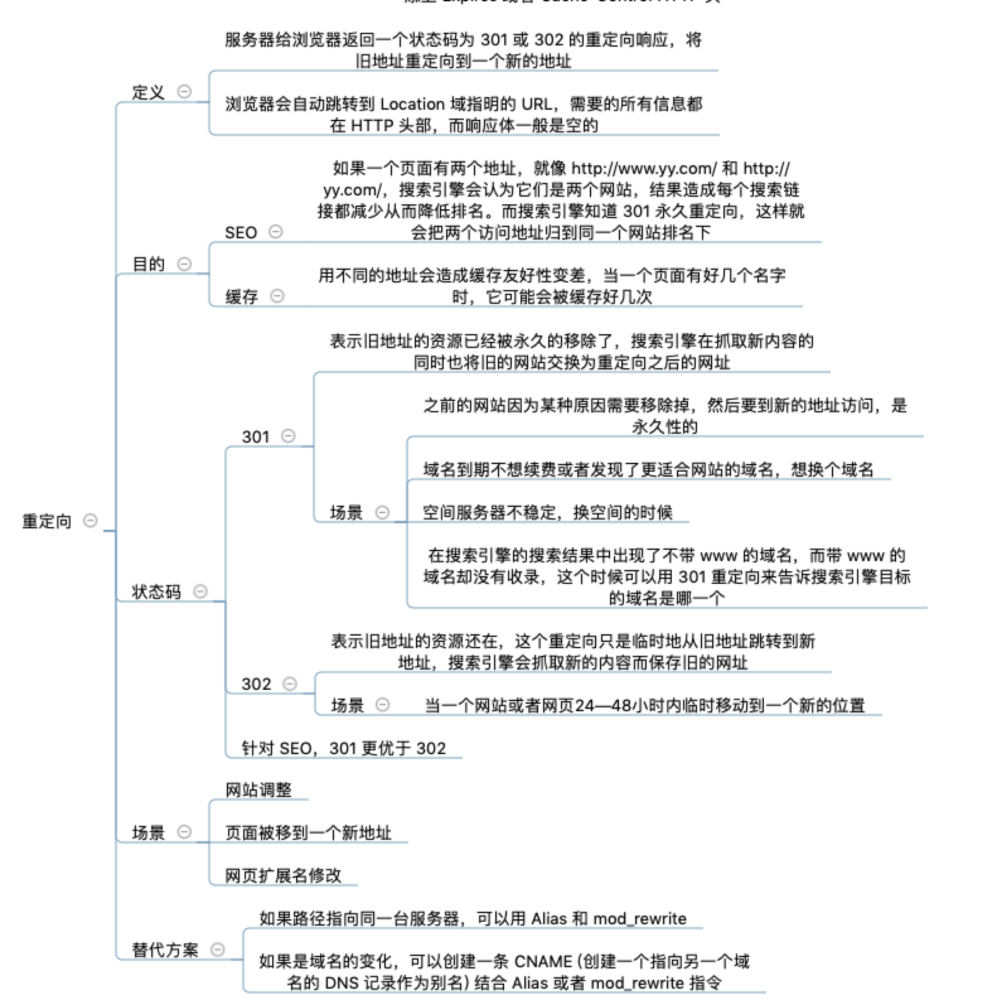

# [返回主页](https://github.com/yisainan/web-interview/blob/master/README.md)

[转载自 Advanced-Frontend/Daily-Interview-Question](https://github.com/Advanced-Frontend/Daily-Interview-Question)

<b><details><summary>第 1 题：写 React / Vue 项目时为什么要在列表组件中写 key，其作用是什么？</summary></b>

答案：key 是给每一个 vnode（虚拟节点）的唯一 id, 可以依靠 key, 更准确, 更快的拿到 oldVnode 中对应的 vnode 节点。

1. 更准确
   因为带 key 就不是就地复用了，在 sameNode 函数 a.key === b.key 对比中可以避免就地复用的情况。所以会更加准确。

2. 更快
   利用 key 的唯一性生成 map 对象来获取对应节点，比遍历方式更快。

公司：滴滴、饿了么

解析：[第 1 题](https://github.com/Advanced-Frontend/Daily-Interview-Question/issues/1)

</details>

<b><details><summary>第 2 题： `['1', '2', '3'].map(parseInt)` what & why ?</summary></b>

答案：[1, NaN, NaN]

* parseInt('1', 0) //radix 为 0 时，且 string 参数不以“0x”和“0”开头时，按照 10 为基数处理。这个时候返回 1
* parseInt('2', 1) //基数为 1（1 进制）表示的数中，最大值小于 2，所以无法解析，返回 NaN
* parseInt('3', 2) //基数为 2（2 进制）表示的数中，最大值小于 3，所以无法解析，返回 NaN

解析：[第 2 题](https://github.com/Advanced-Frontend/Daily-Interview-Question/issues/4)

</details>

<b><details><summary>第 3 题：什么是防抖和节流？有什么区别？如何实现？</summary></b>

答案：

1、防抖(debounce)：触发高频事件后 n 秒内函数只会执行一次，如果 n 秒内高频事件再次被触发，则重新计算时间

举例：就好像在百度搜索时，每次输入之后都有联想词弹出，这个控制联想词的方法就不可能是输入框内容一改变就触发的，他一定是当你结束输入一段时间之后才会触发。

节流(thorttle)：高频事件触发，但在 n 秒内只会执行一次，所以节流会稀释函数的执行频率

举例：预定一个函数只有在大于等于执行周期时才执行，周期内调用不执行。就好像你在淘宝抢购某一件限量热卖商品时，你不断点刷新点购买，可是总有一段时间你点上是没有效果，这里就用到了节流，就是怕点的太快导致系统出现 bug。

2、区别：防抖动是将多次执行变为最后一次执行，节流是将多次执行变成每隔一段时间执行。

公司：挖财

解析：[第 3 题](https://github.com/Advanced-Frontend/Daily-Interview-Question/issues/5)

</details>

<b><details><summary>第 4 题：介绍下 Set、Map、WeakSet 和 WeakMap 的区别？</summary></b>

答案：

1、Set

* 成员唯一、无序且不重复；
* [value, value]，键值与键名是一致的（或者说只有键值，没有键名）；
* 可以遍历，方法有：add、delete、has、clear、entries、forEach、keys、values
* Set 也能用来保存 NaN 和 undefined， 如果有重复的 NaN， Set 会认为就一个 NaN(实际上 NaN!=NaN); 

2、Map

* 本质上是键值对的集合，类似集合；
* 可以遍历，方法很多，可以跟各种数据格式转换。

3、WeakSet

* 成员都是对象；
* 成员都是弱引用，可以被垃圾回收机制回收，可以用来保存 DOM 节点，不容易造成内存泄漏；
* 不能遍历，方法有 add、delete、has。

4、WeakMap

* 只接受对象作为键名（null 除外），不接受其他类型的值作为键名；
* 键名是弱引用，键值可以是任意的，键名所指向的对象可以被垃圾回收，此时键名是无效的；
* 不能遍历，方法有 get、set、has、delete。

解析：[第 4 题](https://github.com/Advanced-Frontend/Daily-Interview-Question/issues/6)

</details>

<b><details><summary>第 5 题：介绍下深度优先遍历和广度优先遍历，如何实现？</summary></b>

答案：

1. 深度优先遍历就是一种不撞南墙不会头的算法，他会把一条路走完之后再回溯到有分叉的节点继续遍历
2. 广度优先搜索时，会从起点开始“一层一层”扩展的方法来遍历，扩展时每发现一个点就将这个点加入到队列，直到整张图都被遍历过位置

解析：[第 5 题](https://github.com/Advanced-Frontend/Daily-Interview-Question/issues/9)

</details>

<b><details><summary>第 6 题：请分别用深度优先思想和广度优先思想实现一个拷贝函数？</summary></b>

答案：

解析：[第 6 题](https://github.com/Advanced-Frontend/Daily-Interview-Question/issues/10)

</details>

<b><details><summary>第 7 题：ES5/ES6 的继承除了写法以外还有什么区别？</summary></b>

答案：

1. class 声明会提升，但不会初始化赋值。Foo 进入暂时性死区，类似于 let、const 声明变量。

```js
const bar = new Bar(); // it's ok
function Bar() {
    this.bar = 42;
}

const foo = new Foo(); // ReferenceError: Foo is not defined
class Foo {
    constructor() {
        this.foo = 42;
    }
}
```

2. class 声明内部会启用严格模式。

```js
// 引用一个未声明的变量
function Bar() {
    baz = 42; // it's ok
}
const bar = new Bar();

class Foo {
    constructor() {
        fol = 42; // ReferenceError: fol is not defined
    }
}
const foo = new Foo();
```

3. class 的所有方法（包括静态方法和实例方法）都是不可枚举的。

```js
// 引用一个未声明的变量
function Bar() {
    this.bar = 42;
}
Bar.answer = function() {
    return 42;
};
Bar.prototype.print = function() {
    console.log(this.bar);
};
const barKeys = Object.keys(Bar); // ['answer']
const barProtoKeys = Object.keys(Bar.prototype); // ['print']

class Foo {
    constructor() {
        this.foo = 42;
    }
    static answer() {
        return 42;
    }
    print() {
        console.log(this.foo);
    }
}
const fooKeys = Object.keys(Foo); // []
const fooProtoKeys = Object.keys(Foo.prototype); // []
```

4. class 的所有方法（包括静态方法和实例方法）都没有原型对象 prototype，所以也没有[[construct]]，不能使用 new 来调用。

```js
function Bar() {
    this.bar = 42;
}
Bar.prototype.print = function() {
    console.log(this.bar);
};

const bar = new Bar();
const barPrint = new bar.print(); // it's ok

class Foo {
    constructor() {
        this.foo = 42;
    }
    print() {
        console.log(this.foo);
    }
}
const foo = new Foo();
const fooPrint = new foo.print(); // TypeError: foo.print is not a constructor
```

5. 必须使用 new 调用 class。

```js
function Bar() {
    this.bar = 42;
}
const bar = Bar(); // it's ok

class Foo {
    constructor() {
        this.foo = 42;
    }
}
const foo = Foo(); // TypeError: Class constructor Foo cannot be invoked without 'new'
```

6. class 内部无法重写类名。

```js
function Bar() {
    Bar = "Baz"; // it's ok
    this.bar = 42;
}
const bar = new Bar();
// Bar: 'Baz'
// bar: Bar {bar: 42}

class Foo {
    constructor() {
        this.foo = 42;
        Foo = "Fol"; // TypeError: Assignment to constant variable
    }
}
const foo = new Foo();
Foo = "Fol"; // it's ok
```

解析：[第 7 题](https://github.com/Advanced-Frontend/Daily-Interview-Question/issues/20)

</details>

<b><details><summary>第 8 题：setTimeout、Promise、Async/Await 的区别</summary></b>

答案：

1. setTimeout

```js
console.log("script start"); //1. 打印 script start
setTimeout(function() {
    console.log("settimeout"); // 4. 打印 settimeout
}); // 2. 调用 setTimeout 函数，并定义其完成后执行的回调函数
console.log("script end"); //3. 打印 script start
// 输出顺序：script start->script end->settimeout
```

2. Promise

Promise 本身是同步的立即执行函数， 当在 executor 中执行 resolve 或者 reject 的时候, 此时是异步操作， 会先执行 then/catch 等，当主栈完成后，才会去调用 resolve/reject 中存放的方法执行，打印 p 的时候，是打印的返回结果，一个 Promise 实例。

```js
console.log("script start");
let promise1 = new Promise(function(resolve) {
    console.log("promise1");
    resolve();
    console.log("promise1 end");
}).then(function() {
    console.log("promise2");
});
setTimeout(function() {
    console.log("settimeout");
});
console.log("script end");
// 输出顺序: script start->promise1->promise1 end->script end->promise2->settimeout
```

当 JS 主线程执行到 Promise 对象时，

* promise1.then() 的回调就是一个 task

* promise1 是 resolved 或 rejected: 那这个 task 就会放入当前事件循环回合的 microtask queue

* promise1 是 pending: 这个 task 就会放入 事件循环的未来的某个(可能下一个)回合的 microtask queue 中

* setTimeout 的回调也是个 task ，它会被放入 macrotask queue 即使是 0ms 的情况

3. async/await

```js
async function async1() {
    console.log("async1 start");
    await async2();
    console.log("async1 end");
}
async function async2() {
    console.log("async2");
}

console.log("script start");
async1();
console.log("script end");

// 输出顺序：script start->async1 start->async2->script end->async1 end
```

async 函数返回一个 Promise 对象，当函数执行的时候，一旦遇到 await 就会先返回，等到触发的异步操作完成，再执行函数体内后面的语句。可以理解为，是让出了线程，跳出了 async 函数体。

举个例子：

```js
async function func1() {
    return 1;
}

console.log(func1());
```

很显然，func1 的运行结果其实就是一个 Promise 对象。因此我们也可以使用 then 来处理后续逻辑。

```js
func1().then(res => {
    console.log(res); // 30
});
```

await 的含义为等待，也就是 async 函数需要等待 await 后的函数执行完成并且有了返回结果（Promise 对象）之后，才能继续执行下面的代码。await 通过返回一个 Promise 对象来实现同步的效果。

更多可见[setTimeout、Promise、Async/Await](https://github.com/sisterAn/blog/issues/21)

解析：[第 8 题](https://github.com/Advanced-Frontend/Daily-Interview-Question/issues/33)

</details>

<b><details><summary>第 9 题：Async/Await 如何通过同步的方式实现异步</summary></b>

答案：

公司：头条、微医

解析：[第 9 题](https://github.com/Advanced-Frontend/Daily-Interview-Question/issues/156)

</details>

<b><details><summary>第 10 题：异步笔试题</summary></b>

> 请写出下面代码的运行结果

```js
async function async1() {
    console.log("async1 start");
    await async2();
    console.log("async1 end");
}
async function async2() {
    console.log("async2");
}
console.log("script start");
setTimeout(function() {
    console.log("setTimeout");
}, 0);
async1();
new Promise(function(resolve) {
    console.log("promise1");
    resolve();
}).then(function() {
    console.log("promise2");
});
console.log("script end");
```

公司：头条

答案：

```js
// script start
// async1 start
// async2
// promise1
// script end
// async1 end
// promise2
// undefined
// setTimeout
```

解析：[第 10 题](https://github.com/Advanced-Frontend/Daily-Interview-Question/issues/7)

</details>

<b><details><summary>第 11 题：算法手写题</summary></b>

> 已知如下数组：
>
> var arr = [ [1, 2, 2], [3, 4, 5, 5], [6, 7, 8, 9, [11, 12, [12, 13, [14] ] ] ], 10]; 
>
> 编写一个程序将数组扁平化去并除其中重复部分数据，最终得到一个升序且不重复的数组

公司：携程

答案：

```js
Array.from(new Set(arr.flat(Infinity))).sort((a, b) => {
    return a - b;
});
```

拆解：

```js
arr.flat(Infinity); // 1.所有元素放到同一数组
//  [1, 2, 2, 3, 4, 5, 5, 6, 7, 8, 9, 11, 12, 12, 13, 14, 10]
Array.from(new Set(arr.flat(Infinity))).sort((a, b) => {
    return a - b;
}); // 2.去重及排序
// [1, 2, 3, 4, 5, 6, 7, 8, 9, 10, 11, 12, 13, 14]
```

解析：[第 11 题](https://github.com/Advanced-Frontend/Daily-Interview-Question/issues/8)

</details>

<b><details><summary>第 12 题：JS 异步解决方案的发展历程以及优缺点。</summary></b>

答案：

公司：滴滴、挖财、微医、海康

解析：[第 12 题](https://github.com/Advanced-Frontend/Daily-Interview-Question/issues/11)

</details>

<b><details><summary>第 13 题：Promise 构造函数是同步执行还是异步执行，那么 then 方法呢？</summary></b>

```js
const promise = new Promise((resolve, reject) => {
    console.log(1);
    resolve();
    console.log(2);
});

promise.then(() => {
    console.log(3);
});

console.log(4);
```

执行结果是：1243
promise 构造函数是同步执行的，then 方法是异步执行的

答案：

公司：微医

解析：[第 13 题](https://github.com/Advanced-Frontend/Daily-Interview-Question/issues/19)

</details>

<b><details><summary>第 14 题：情人节福利题，如何实现一个 new</summary></b>

答案：

```js
// 实现一个new
var Dog = function(name) {
    this.name = name;
};
Dog.prototype.bark = function() {
    console.log("wangwang");
};
Dog.prototype.sayName = function() {
    console.log("my name is " + this.name);
};
let sanmao = new Dog("三毛");
sanmao.sayName();
sanmao.bark();
// new 的作用
// 创建一个新对象obj
// 把obj的__proto__指向Dog.prototype 实现继承
// 执行构造函数，传递参数，改变this指向 Dog.call(obj, ...args)
// 最后把obj赋值给sanmao
var _new = function() {
    let constructor = Array.prototype.shift.call(arguments);
    let args = arguments;
    const obj = new Object();
    obj.__proto__ = constructor.prototype;
    constructor.call(obj, ...args);
    return obj;
};
var simao = _new(Dog, "simao");
simao.bark();
simao.sayName();
console.log(simao instanceof Dog); // true
```

公司：兑吧

解析：[第 14 题](https://github.com/Advanced-Frontend/Daily-Interview-Question/issues/12)

</details>

<b><details><summary>第 15 题：简单讲解一下 http2 的多路复用</summary></b>

答案：

HTTP2 采用二进制格式传输，取代了 HTTP1.x 的文本格式，二进制格式解析更高效。

多路复用代替了 HTTP1.x 的序列和阻塞机制，所有的相同域名请求都通过同一个 TCP 连接并发完成。在 HTTP1.x 中，并发多个请求需要多个 TCP 连接，浏览器为了控制资源会有 6-8 个 TCP 连接都限制。
HTTP2 中

* 同域名下所有通信都在单个连接上完成，消除了因多个 TCP 连接而带来的延时和内存消耗。
* 单个连接上可以并行交错的请求和响应，之间互不干扰

公司：网易

解析：[第 15 题](https://github.com/Advanced-Frontend/Daily-Interview-Question/issues/14)

</details>

<b><details><summary>第 16 题：谈谈你对 TCP 三次握手和四次挥手的理解</summary></b>

答案：

解析：[第 16 题](https://github.com/Advanced-Frontend/Daily-Interview-Question/issues/15)

</details>

<b><details><summary>第 17 题：A、B 机器正常连接后，B 机器突然重启，问 A 此时处于 TCP 什么状态</summary></b>

答案：

> 如果 A 与 B 建立了正常连接后，从未相互发过数据，这个时候 B 突然机器重启，问 A 此时处于 TCP 什么状态？如何消除服务器程序中的这个状态？（超纲题，了解即可）

解析：[第 17 题](https://github.com/Advanced-Frontend/Daily-Interview-Question/issues/21)

</details>

<b><details><summary>第 18 题：React 中 setState 什么时候是同步的，什么时候是异步的？</summary></b>

答案：
公司：微医

解析：[第 18 题](https://github.com/Advanced-Frontend/Daily-Interview-Question/issues/17)

</details>

<b><details><summary>第 19 题：React setState 笔试题，下面的代码输出什么？</summary></b>

答案：

```js
class Example extends React.Component {
    constructor() {
        super();
        this.state = {
            val: 0
        };
    }

    componentDidMount() {
        this.setState({
            val: this.state.val + 1
        });
        console.log(this.state.val); // 第 1 次 log

        this.setState({
            val: this.state.val + 1
        });
        console.log(this.state.val); // 第 2 次 log

        setTimeout(() => {
            this.setState({
                val: this.state.val + 1
            });
            console.log(this.state.val); // 第 3 次 log

            this.setState({
                val: this.state.val + 1
            });
            console.log(this.state.val); // 第 4 次 log
        }, 0);
    }

    render() {
        return null;
    }
}
```

解析：[第 19 题](https://github.com/Advanced-Frontend/Daily-Interview-Question/issues/18)

</details>

<b><details><summary>第 20 题：介绍下 npm 模块安装机制，为什么输入 npm install 就可以自动安装对应的模块？</summary></b>

答案：
解析：[第 20 题](https://github.com/Advanced-Frontend/Daily-Interview-Question/issues/22)

</details>

<b><details><summary>第 21 题：有以下 3 个判断数组的方法，请分别介绍它们之间的区别和优劣</summary></b>

答案：

> Object.prototype.toString.call() 、 instanceof 以及 Array.isArray()

解析：[第 21 题](https://github.com/Advanced-Frontend/Daily-Interview-Question/issues/23)

</details>

<b><details><summary>第 22 题：介绍下重绘和回流（Repaint & Reflow），以及如何进行优化</summary></b>

答案：
解析：[第 22 题](https://github.com/Advanced-Frontend/Daily-Interview-Question/issues/24)

</details>

<b><details><summary>第 23 题：介绍下观察者模式和订阅-发布模式的区别，各自适用于什么场景</summary></b>

答案：
解析：[第 23 题](https://github.com/Advanced-Frontend/Daily-Interview-Question/issues/25)

</details>

<b><details><summary>第 24 题：聊聊 Redux 和 Vuex 的设计思想</summary></b>

答案：
解析：[第 24 题](https://github.com/Advanced-Frontend/Daily-Interview-Question/issues/45)

</details>

<b><details><summary>第 25 题：说说浏览器和 Node 事件循环的区别</summary></b>

答案：
解析：[第 25 题](https://github.com/Advanced-Frontend/Daily-Interview-Question/issues/26)

</details>

<b><details><summary>第 26 题：介绍模块化发展历程</summary></b>

答案：

可从 IIFE、AMD、CMD、CommonJS、UMD、webpack(require.ensure)、ES Module、 `<script type="module">` 这几个角度考虑。

解析：[第 26 题](https://github.com/Advanced-Frontend/Daily-Interview-Question/issues/28)

</details>

<b><details><summary>第 27 题：全局作用域中，用 const 和 let 声明的变量不在 window 上，那到底在哪里？如何去获取？</summary></b>

答案：

解析：[第 27 题](https://github.com/Advanced-Frontend/Daily-Interview-Question/issues/30)

</details>

<b><details><summary>第 28 题：cookie 和 token 都存放在 header 中，为什么不会劫持 token？</summary></b>

答案：
解析：[第 28 题](https://github.com/Advanced-Frontend/Daily-Interview-Question/issues/31)

</details>

<b><details><summary>第 29 题：聊聊 Vue 的双向数据绑定，Model 如何改变 View，View 又是如何改变 Model 的</summary></b>

答案：
解析：[第 29 题](https://github.com/Advanced-Frontend/Daily-Interview-Question/issues/34)

</details>

<b><details><summary>第 30 题：两个数组合并成一个数组</summary></b>

答案：
请把两个数组 ['A1', 'A2', 'B1', 'B2', 'C1', 'C2', 'D1', 'D2'] 和 ['A', 'B', 'C', 'D']，合并为 ['A1', 'A2', 'A', 'B1', 'B2', 'B', 'C1', 'C2', 'C', 'D1', 'D2', 'D']。

解析： [第 30 题](https://github.com/Advanced-Frontend/Daily-Interview-Question/issues/39)

</details>

<b><details><summary>第 31 题：改造下面的代码，使之输出 0 - 9，写出你能想到的所有解法。</summary></b>

```js
for (var i = 0; i < 10; i++) {
    setTimeout(() => {
        console.log(i);
    }, 1000);
}
```

答案：

```js
// 解法一：
for (let i = 0; i < 10; i++) {
    setTimeout(() => {
        console.log(i);
    }, 1000);
}
// 解法二：
for (var i = 0; i < 10; i++) {
    (i => {
        setTimeout(() => {
            console.log(i);
        }, 1000);
    })(i);
}
```

解析：[第 31 题](https://github.com/Advanced-Frontend/Daily-Interview-Question/issues/43)

</details>

<b><details><summary>第 32 题：Virtual DOM 真的比操作原生 DOM 快吗？谈谈你的想法。</summary></b>

答案：
解析：[第 32 题](https://github.com/Advanced-Frontend/Daily-Interview-Question/issues/47)

</details>

<b><details><summary>第 33 题：下面的代码打印什么内容，为什么？</summary></b>

答案：

```js
var b = 10;
(function b() {
    b = 20;
    console.log(b);
})();
```

解析：[第 33 题](https://github.com/Advanced-Frontend/Daily-Interview-Question/issues/48)

</details>

<b><details><summary>第 34 题：简单改造下面的代码，使之分别打印 10 和 20。</summary></b>

答案：

```js
var b = 10;
(function b() {
    b = 20;
    console.log(b);
})();
```

解析：[第 34 题](https://github.com/Advanced-Frontend/Daily-Interview-Question/issues/51)

</details>

<b><details><summary>第 35 题：浏览器缓存读取规则</summary></b>

答案：

可以分成 Service Worker、Memory Cache、Disk Cache 和 Push Cache，那请求的时候 from memory cache 和 from disk cache 的依据是什么，哪些数据什么时候存放在 Memory Cache 和 Disk Cache 中？

解析：[第 35 题](https://github.com/Advanced-Frontend/Daily-Interview-Question/issues/53)

</details>

<b><details><summary>第 36 题：使用迭代的方式实现 flatten 函数。</summary></b>

答案：
解析：[第 36 题](https://github.com/Advanced-Frontend/Daily-Interview-Question/issues/54)

</details>

<b><details><summary>第 37 题：为什么 Vuex 的 mutation 和 Redux 的 reducer 中不能做异步操作？</summary></b>

答案：
解析：[第 37 题](https://github.com/Advanced-Frontend/Daily-Interview-Question/issues/65)

</details>

<b><details><summary>第 38 题：下面代码中 a 在什么情况下会打印 1？</summary></b>

```js
var a = ? ;
if (a == 1 && a == 2 && a == 3) {
    console.log(1);
}
```

答案：

解析：[第 38 题](https://github.com/Advanced-Frontend/Daily-Interview-Question/issues/57)

公司：京东

</details>

<b><details><summary>第 39 题：介绍下 BFC 及其应用。</summary></b>

答案：
解析：[第 39 题](https://github.com/Advanced-Frontend/Daily-Interview-Question/issues/59)

</details>

<b><details><summary>第 40 题：在 Vue 中，子组件为何不可以修改父组件传递的 Prop</summary></b>

如果修改了，Vue 是如何监控到属性的修改并给出警告的。

答案：

解析：[第 40 题](https://github.com/Advanced-Frontend/Daily-Interview-Question/issues/60)

</details>

<b><details><summary>第 41 题：下面代码输出什么</summary></b>

```js
var a = 10;
(function() {
    console.log(a);
    a = 5;
    console.log(window.a);
    var a = 20;
    console.log(a);
})();
```

答案：

解析：[第 41 题](https://github.com/Advanced-Frontend/Daily-Interview-Question/issues/61)

</details>

<b><details><summary>第 42 题：实现一个 sleep 函数</summary></b>

比如 sleep(1000) 意味着等待 1000 毫秒，可从 Promise、Generator、Async/Await 等角度实现

答案：

解析：[第 42 题](https://github.com/Advanced-Frontend/Daily-Interview-Question/issues/63)

</details>

<b><details><summary>第 43 题：使用 sort() 对数组 [3, 15, 8, 29, 102, 22] 进行排序，输出结果</summary></b>

答案：
解析：[第 43 题](https://github.com/Advanced-Frontend/Daily-Interview-Question/issues/66)

</details>

<b><details><summary>第 44 题：介绍 HTTPS 握手过程</summary></b>

答案：
解析：[第 44 题](https://github.com/Advanced-Frontend/Daily-Interview-Question/issues/70)

</details>

<b><details><summary>第 45 题：HTTPS 握手过程中，客户端如何验证证书的合法性</summary></b>

答案：
解析：[第 45 题](https://github.com/Advanced-Frontend/Daily-Interview-Question/issues/74)

</details>

<b><details><summary>第 46 题：输出以下代码执行的结果并解释为什么</summary></b>

```js
var obj = {
    "2": 3,
    "3": 4,
    length: 2,
    splice: Array.prototype.splice,
    push: Array.prototype.push
};
obj.push(1);
obj.push(2);
console.log(obj);
```

答案：

解析：[第 46 题](https://github.com/Advanced-Frontend/Daily-Interview-Question/issues/76)

</details>

<b><details><summary>第 47 题：双向绑定和 vuex 是否冲突</summary></b>

答案：
解析：[第 47 题](https://github.com/Advanced-Frontend/Daily-Interview-Question/issues/81)

</details>

<b><details><summary>第 48 题：call 和 apply 的区别是什么，哪个性能更好一些</summary></b>

答案：

解析：[第 48 题](https://github.com/Advanced-Frontend/Daily-Interview-Question/issues/84)

</details>

<b><details><summary>第 49 题：为什么通常在发送数据埋点请求的时候使用的是 1x1 像素的透明 gif 图片？</summary></b>

答案：

解析：[第 49 题](https://github.com/Advanced-Frontend/Daily-Interview-Question/issues/87)

</details>

<b><details><summary>第 50 题：实现 (5).add(3).minus(2) 功能。</summary></b>

> 例： 5 + 3 - 2，结果为 6

公司：百度

答案：

解析：[第 50 题](https://github.com/Advanced-Frontend/Daily-Interview-Question/issues/88)

</details>

<b><details><summary>第 51 题：Vue 的响应式原理中 Object.defineProperty 有什么缺陷？</summary></b>

为什么在 Vue3.0 采用了 Proxy，抛弃了 Object.defineProperty？

答案：

解析：[第 51 题](https://github.com/Advanced-Frontend/Daily-Interview-Question/issues/90)

</details>

<b><details><summary>第 52 题：怎么让一个 div 水平垂直居中</summary></b>

答案：

解析：[第 52 题](https://github.com/Advanced-Frontend/Daily-Interview-Question/issues/92)

</details>

<b><details><summary>第 53 题：输出以下代码的执行结果并解释为什么</summary></b>

```js
var a = {
    n: 1
};
var b = a;
a.x = a = {
    n: 2
};

console.log(a.x);
console.log(b.x);
```

答案：

解析：[第 53 题](https://github.com/Advanced-Frontend/Daily-Interview-Question/issues/93)

</details>

<b><details><summary>第 54 题：冒泡排序如何实现，时间复杂度是多少， 还可以如何改进？</summary></b>

答案：

解析：[第 54 题](https://github.com/Advanced-Frontend/Daily-Interview-Question/issues/94)

</details>

<b><details><summary>第 55 题：某公司 1 到 12 月份的销售额存在一个对象里面</summary></b>

如下：{1:222, 2:123, 5:888}，请把数据处理为如下结构：[222, 123, null, null, 888, null, null, null, null, null, null, null]。

答案：

解析：[第 55 题](https://github.com/Advanced-Frontend/Daily-Interview-Question/issues/96)

</details>

<b><details><summary>第 56 题：要求设计 LazyMan 类，实现以下功能。</summary></b>

```js
LazyMan("Tony");
// Hi I am Tony

LazyMan("Tony")
    .sleep(10)
    .eat("lunch");
// Hi I am Tony
// 等待了10秒...
// I am eating lunch

LazyMan("Tony")
    .eat("lunch")
    .sleep(10)
    .eat("dinner");
// Hi I am Tony
// I am eating lunch
// 等待了10秒...
// I am eating diner

LazyMan("Tony")
    .eat("lunch")
    .eat("dinner")
    .sleepFirst(5)
    .sleep(10)
    .eat("junk food");
// Hi I am Tony
// 等待了5秒...
// I am eating lunch
// I am eating dinner
// 等待了10秒...
// I am eating junk food
```

答案：

解析：[第 56 题](https://github.com/Advanced-Frontend/Daily-Interview-Question/issues/98)

</details>

<b><details><summary>第 57 题：分析比较 opacity: 0、visibility: hidden、display: none 优劣和适用场景。</summary></b>

答案：

解析：[第 57 题](https://github.com/Advanced-Frontend/Daily-Interview-Question/issues/100)

</details>

<b><details><summary>第 58 题：箭头函数与普通函数（function）的区别是什么？构造函数（function）可以使用 new 生成实例，那么箭头函数可以吗？为什么？</summary></b>

答案：

解析：[第 58 题](https://github.com/Advanced-Frontend/Daily-Interview-Question/issues/101)

</details>

<b><details><summary>第 59 题：给定两个数组，写一个方法来计算它们的交集。</summary></b>

> 例如：给定 nums1 = [1, 2, 2, 1]，nums2 = [2, 2]，返回 [2, 2]。

答案：

解析：[第 59 题](https://github.com/Advanced-Frontend/Daily-Interview-Question/issues/102)

</details>

<b><details><summary>第 60 题：已知如下代码，如何修改才能让图片宽度为 300px ？注意下面代码不可修改。</summary></b>

> ``

答案：

解析：[第 60 题](https://github.com/Advanced-Frontend/Daily-Interview-Question/issues/105)

</details>

<b><details><summary>第 61 题：介绍下如何实现 token 加密</summary></b>

答案：

解析：[第 61 题](https://github.com/Advanced-Frontend/Daily-Interview-Question/issues/106)

</details>

<b><details><summary>第 62 题：redux 为什么要把 reducer 设计成纯函数</summary></b>

答案：

解析：[第 62 题](https://github.com/Advanced-Frontend/Daily-Interview-Question/issues/107)

</details>

<b><details><summary>第 63 题：如何设计实现无缝轮播</summary></b>

答案：

解析：[第 63 题](https://github.com/Advanced-Frontend/Daily-Interview-Question/issues/108)

</details>

<b><details><summary>第 64 题：模拟实现一个 Promise.finally</summary></b>

答案：

解析：[第 64 题](https://github.com/Advanced-Frontend/Daily-Interview-Question/issues/109)

</details>

<b><details><summary>第 65 题： `a.b.c.d` 和 `a['b']['c']['d']` ，哪个性能更高？</summary></b>

答案：

解析：[第 65 题](https://github.com/Advanced-Frontend/Daily-Interview-Question/issues/111)

</details>

<b><details><summary>第 66 题：ES6 代码转成 ES5 代码的实现思路是什么</summary></b>

答案：

解析：[第 66 题](https://github.com/Advanced-Frontend/Daily-Interview-Question/issues/112)

</details>

<b><details><summary>第 67 题：数组编程题</summary></b>

随机生成一个长度为 10 的整数类型的数组，例如 `[2, 10, 3, 4, 5, 11, 10, 11, 20]` ，将其排列成一个新数组，要求新数组形式如下，例如 `[[2, 3, 4, 5], [10, 11], [20]]` 。

答案：

解析：[第 67 题](https://github.com/Advanced-Frontend/Daily-Interview-Question/issues/113)

</details>

<b><details><summary>第 68 题： 如何解决移动端 Retina 屏 1px 像素问题</summary></b>

答案：

解析：[第 68 题](https://github.com/Advanced-Frontend/Daily-Interview-Question/issues/115)

</details>

<b><details><summary>第 69 题： 如何把一个字符串的大小写取反（大写变小写小写变大写），例如 ’AbC' 变成 'aBc' 。</summary></b>

答案：

解析：[第 69 题](https://github.com/Advanced-Frontend/Daily-Interview-Question/issues/116)

</details>

<b><details><summary>第 70 题： 介绍下 webpack 热更新原理，是如何做到在不刷新浏览器的前提下更新页面的</summary></b>

答案：

解析：[第 70 题](https://github.com/Advanced-Frontend/Daily-Interview-Question/issues/118)

</details>

<b><details><summary>第 71 题： 实现一个字符串匹配算法，从长度为 n 的字符串 S 中，查找是否存在字符串 T，T 的长度是 m，若存在返回所在位置。</summary></b>

答案：

解析：[第 71 题](https://github.com/Advanced-Frontend/Daily-Interview-Question/issues/119)

</details>

<b><details><summary>第 72 题： 为什么普通 `for` 循环的性能远远高于 `forEach` 的性能，请解释其中的原因。</summary></b>


答案：

解析：[第 72 题](https://github.com/Advanced-Frontend/Daily-Interview-Question/issues/121)

</details>

<b><details><summary>第 73 题： 介绍下 BFC、IFC、GFC 和 FFC</summary></b>

答案：

解析：[第 73 题](https://github.com/Advanced-Frontend/Daily-Interview-Question/issues/122)

</details>

<b><details><summary>第 74 题： 使用 JavaScript Proxy 实现简单的数据绑定</summary></b>

答案：

解析：[第 74 题](https://github.com/Advanced-Frontend/Daily-Interview-Question/issues/123)

</details>

<b><details><summary>第 75 题：数组里面有 10 万个数据，取第一个元素和第 10 万个元素的时间相差多少</summary></b>

答案：

解析：[第 75 题](https://github.com/Advanced-Frontend/Daily-Interview-Question/issues/124)

</details>

<b><details><summary>第 76 题：输出以下代码运行结果</summary></b>

```js
// example 1
var a = {},
    b = '123',
    c = 123;
a[b] = 'b';
a[c] = 'c';
console.log(a[b]);

-- -- -- -- -- -- -- -- -- -- -
// example 2
var a = {},
    b = Symbol('123'),
    c = Symbol('123');
a[b] = 'b';
a[c] = 'c';
console.log(a[b]);

-- -- -- -- -- -- -- -- -- -- -
// example 3
var a = {},
    b = {
        key: '123'
    },
    c = {
        key: '456'
    };
a[b] = 'b';
a[c] = 'c';
console.log(a[b]);
```

答案：

这题考察的是对象的键名的转换。

* 对象的键名只能是字符串和 Symbol 类型。
* 其他类型的键名会被转换成字符串类型。
* 对象转字符串默认会调用 toString 方法。

```js
// example 1
var a = {},
    b = "123",
    c = 123;
a[b] = "b";

// c 的键名会被转换成字符串'123'，这里会把 b 覆盖掉。
a[c] = "c";

// 输出 c
console.log(a[b]);

// example 2
var a = {},
    b = Symbol("123"),
    c = Symbol("123");

// b 是 Symbol 类型，不需要转换。
a[b] = "b";

// c 是 Symbol 类型，不需要转换。任何一个 Symbol 类型的值都是不相等的，所以不会覆盖掉 b。
a[c] = "c";

// 输出 b
console.log(a[b]);

// example 3
var a = {},
    b = {
        key: "123"
    },
    c = {
        key: "456"
    };

// b 不是字符串也不是 Symbol 类型，需要转换成字符串。
// 对象类型会调用 toString 方法转换成字符串 [object Object]。
a[b] = "b";

// c 不是字符串也不是 Symbol 类型，需要转换成字符串。
// 对象类型会调用 toString 方法转换成字符串 [object Object]。这里会把 b 覆盖掉。
a[c] = "c";

// 输出 c
console.log(a[b]);
```

解析：[第 76 题](https://github.com/Advanced-Frontend/Daily-Interview-Question/issues/125)

</details>

<b><details><summary>第 77 题：算法题「旋转数组」</summary></b>

> 给定一个数组，将数组中的元素向右移动 k 个位置，其中 k 是非负数。

示例 1：

```js
输入: [1, 2, 3, 4, 5, 6, 7] 和 k = 3
输出: [5, 6, 7, 1, 2, 3, 4]
解释:
    向右旋转 1 步: [7, 1, 2, 3, 4, 5, 6]
向右旋转 2 步: [6, 7, 1, 2, 3, 4, 5]
向右旋转 3 步: [5, 6, 7, 1, 2, 3, 4]
```

示例 2：

```js
输入: [-1, -100, 3, 99] 和 k = 2
输出: [3, 99, -1, -100]
解释:
    向右旋转 1 步: [99, -1, -100, 3]
向右旋转 2 步: [3, 99, -1, -100]
```

答案：

解析：[第 77 题](https://github.com/Advanced-Frontend/Daily-Interview-Question/issues/126)

</details>

<b><details><summary>第 78 题：Vue 的父组件和子组件生命周期钩子执行顺序是什么</summary></b>

答案：

解析：[第 78 题](https://github.com/Advanced-Frontend/Daily-Interview-Question/issues/128)

</details>

<b><details><summary>第 79 题：input 搜索如何防抖，如何处理中文输入</summary></b>

答案：

解析：[第 79 题](https://github.com/Advanced-Frontend/Daily-Interview-Question/issues/129)

</details>

<b><details><summary>第 80 题：介绍下 Promise.all 使用、原理实现及错误处理</summary></b>

答案：

解析：[第 80 题](https://github.com/Advanced-Frontend/Daily-Interview-Question/issues/130)

</details>

<b><details><summary>第 81 题：打印出 1 - 10000 之间的所有对称数</summary></b>

> 例如：121、1331 等

答案：

解析：[第 81 题](https://github.com/Advanced-Frontend/Daily-Interview-Question/issues/131)

</details>

<b><details><summary>第 82 题：周一算法题之「移动零」</summary></b>

> 给定一个数组 nums，编写一个函数将所有 0 移动到数组的末尾，同时保持非零元素的相对顺序。
>
> 示例:
>
>  

```
> 输入: [0,1,0,3,12]
> 输出: [1,3,12,0,0]
> ```

>
> 说明:
>
> 1. 必须在原数组上操作，不能拷贝额外的数组。
>
> 1. 尽量减少操作次数。

答案：

解析：[第 82 题](https://github.com/Advanced-Frontend/Daily-Interview-Question/issues/132)

</details>

<b><details><summary>第 83 题：var、let 和 const 区别的实现原理是什么</summary></b>

答案：

解析：[第 83 题](https://github.com/Advanced-Frontend/Daily-Interview-Question/issues/133)

</details>

<b><details><summary>第 84 题：请实现一个 add 函数，满足以下功能。</summary></b>

答案：

>  

```js
> add(1); // 1
>
add(1)(2); // 3
>
add(1)(2)(3)； // 6
    >
    add(1)(2, 3); // 6
>
add(1, 2)(3); // 6
>
add(1, 2, 3); // 6
>
```

解析：[第 84 题](https://github.com/Advanced-Frontend/Daily-Interview-Question/issues/134)

</details>

<b><details><summary>第 85 题：react-router 里的 `<Link>` 标签和 `<a>` 标签有什么区别</summary></b>

> 如何禁掉 `<a>` 标签默认事件，禁掉之后如何实现跳转。

答案：

解析：[第 85 题](https://github.com/Advanced-Frontend/Daily-Interview-Question/issues/135)

</details>

<b><details><summary>第 86 题：周一算法题之「两数之和」</summary></b>

答案：
给定一个整数数组和一个目标值，找出数组中和为目标值的两个数。

你可以假设每个输入只对应一种答案，且同样的元素不能被重复利用。

示例：

```js
给定 nums = [2, 7, 11, 15], target = 9

因为 nums[0] + nums[1] = 2 + 7 = 9
所以返回[0, 1]
```

解析：[第 86 题](https://github.com/Advanced-Frontend/Daily-Interview-Question/issues/136)

公司：京东、快手

</details>

<b><details><summary>第 87 题：在输入框中如何判断输入的是一个正确的网址。</summary></b>

答案：
解析：[第 87 题](https://github.com/Advanced-Frontend/Daily-Interview-Question/issues/138)

</details>

<b><details><summary>第 88 题：实现 convert 方法，把原始 list 转换成树形结构，要求尽可能降低时间复杂度</summary></b>

答案：
以下数据结构中，id 代表部门编号，name 是部门名称，parentId 是父部门编号，为 0 代表一级部门，现在要求实现一个 convert 方法，把原始 list 转换成树形结构，parentId 为多少就挂载在该 id 的属性 children 数组下，结构如下：

```js
// 原始 list 如下
let list = [{
        id: 1,
        name: '部门A',
        parentId: 0
    },
    {
        id: 2,
        name: '部门B',
        parentId: 0
    },
    {
        id: 3,
        name: '部门C',
        parentId: 1
    },
    {
        id: 4,
        name: '部门D',
        parentId: 1
    },
    {
        id: 5,
        name: '部门E',
        parentId: 2
    },
    {
        id: 6,
        name: '部门F',
        parentId: 3
    },
    {
        id: 7,
        name: '部门G',
        parentId: 2
    },
    {
        id: 8,
        name: '部门H',
        parentId: 4
    }
];
const result = convert(list, ...);

// 转换后的结果如下
let result = [{
    id: 1,
    name: '部门A',
    parentId: 0,
    children: [{
            id: 3,
            name: '部门C',
            parentId: 1,
            children: [{
                id: 6,
                name: '部门F',
                parentId: 3
            }, {
                id: 16,
                name: '部门L',
                parentId: 3
            }]
        },
        {
            id: 4,
            name: '部门D',
            parentId: 1,
            children: [{
                id: 8,
                name: '部门H',
                parentId: 4
            }]
        }
    ]
}, ···];
```

解析：[第 88 题](https://github.com/Advanced-Frontend/Daily-Interview-Question/issues/139)

</details>

<b><details><summary>第 89 题：设计并实现 Promise.race()</summary></b>

答案：

```js
Promise._race = promises =>
    new Promise((resolve, reject) => {
        promises.forEach(promise => {
            promise.then(resolve, reject);
        });
    });
```

解析：[第 89 题](https://github.com/Advanced-Frontend/Daily-Interview-Question/issues/140)

</details>

<b><details><summary>第 90 题：实现模糊搜索结果的关键词高亮显示</summary></b>

答案：

考虑节流、缓存。其实还可以上列表 diff+定时清理缓存

```
<!DOCTYPE html>
<html lang="en">
<head>
  <meta charset="UTF-8">
  <meta name="viewport" content="width=device-width, initial-scale=1.0">
  <meta http-equiv="X-UA-Compatible" content="ie=edge">
  <title>auto complete</title>
  <style>
    bdi {
      color: rgb(0, 136, 255);
    }

    li {
      list-style: none;
    }
  </style>
</head>
<body>
  <input class="inp" type="text">
  <section>
    <ul class="container"></ul>
  </section>
</body>
<script>

  function debounce(fn, timeout = 300) {
    let t;
    return (...args) => {
      if (t) {
        clearTimeout(t);
      }
      t = setTimeout(() => {
        fn.apply(fn, args);
      }, timeout);
    }
  }

  function memorize(fn) {
    const cache = new Map();
    return (name) => {
      if (!name) {
        container.innerHTML = '';
        return;
      }
      if (cache.get(name)) {
        container.innerHTML = cache.get(name);
        return;
      }
      const res = fn.call(fn, name).join('');
      cache.set(name, res);
      container.innerHTML = res;
    }
  }

  function handleInput(value) {
    const reg = new RegExp(`\(${value}\)`);
    const search = data.reduce((res, cur) => {
      if (reg.test(cur)) {
        const match = RegExp.$1;
        res.push(`<li>${cur.replace(match, '<bdi>$&</bdi>')}</li>`);
      }
      return res;
    }, []);
    return search;
  }

  const data = ["上海野生动物园", "上饶野生动物园", "北京巷子", "上海中心", "上海黄埔江", "迪士尼上海", "陆家嘴上海中心"]
  const container = document.querySelector('.container');
  const memorizeInput = memorize(handleInput);
  document.querySelector('.inp').addEventListener('input', debounce(e => {
    memorizeInput(e.target.value);
  }))
</script>
</html>
```

解析：[第 90 题](https://github.com/Advanced-Frontend/Daily-Interview-Question/issues/141)

</details>

<b><details><summary>第 91 题：介绍下 HTTPS 中间人攻击</summary></b>

答案：
解析：[第 91 题](https://github.com/Advanced-Frontend/Daily-Interview-Question/issues/142)

</details>

<b><details><summary>第 92 题：已知数据格式，实现一个函数 fn 找出链条中所有的父级 id</summary></b>

答案：

>  

```js
>
const value = '112' >
    const fn = (value) => {
            >
            ...
            >
        } >
        fn(value) // 输出 [1， 11， 112]
        >
```


解析：[第 92 题](https://github.com/Advanced-Frontend/Daily-Interview-Question/issues/143)

</details>

<b><details><summary>第 93 题：给定两个大小为 m 和 n 的有序数组 nums1 和 nums2。请找出这两个有序数组的中位数。要求算法的时间复杂度为 O(log(m+n))。</summary></b>

答案：
示例 1：

```js
nums1 = [1, 3];
nums2 = [2];
```

中位数是 2.0

示例 2：

```js
nums1 = [1, 2];
nums2 = [3, 4];
```

中位数是(2 + 3) / 2 = 2.5

解析：[第 93 题](https://github.com/Advanced-Frontend/Daily-Interview-Question/issues/144)

</details>

<b><details><summary>第 94 题：vue 在 v-for 时给每项元素绑定事件需要用事件代理吗？为什么？</summary></b>

答案：
解析：[第 94 题](https://github.com/Advanced-Frontend/Daily-Interview-Question/issues/145)

</details>

<b><details><summary>第 95 题：模拟实现一个深拷贝，并考虑对象相互引用以及 Symbol 拷贝的情况</summary></b>

答案：
解析：[第 95 题](https://github.com/Advanced-Frontend/Daily-Interview-Question/issues/148)

</details>

<b><details><summary>第 96 题：介绍下前端加密的常见场景和方法</summary></b>

答案：

首先，加密的目的，简而言之就是将明文转换为密文、甚至转换为其他的东西，用来隐藏明文内容本身，防止其他人直接获取到敏感明文信息、或者提高其他人获取到明文信息的难度。
通常我们提到加密会想到密码加密、HTTPS 等关键词，这里从场景和方法分别提一些我的个人见解。

## 场景-密码传输

前端密码传输过程中如果不加密，在日志中就可以拿到用户的明文密码，对用户安全不太负责。
这种加密其实相对比较简单，可以使用 PlanA-前端加密、后端解密后计算密码字符串的 MD5/MD6 存入数据库；也可以 PlanB-直接前端使用一种稳定算法加密成唯一值、后端直接将加密结果进行 MD5/MD6，全程密码明文不出现在程序中。

#### PlanA

使用 Base64 / Unicode+1 等方式加密成非明文，后端解开之后再存它的 MD5/MD6 。

#### PlanB

直接使用 MD5/MD6 之类的方式取 Hash ，让后端存 Hash 的 Hash 。

## 场景-数据包加密

应该大家有遇到过：打开一个正经网站，网站底下蹦出个不正经广告——比如 X 通的流量浮层，X 信的插入式广告……（我没有针对谁）
但是这几年，我们会发现这种广告逐渐变少了，其原因就是大家都开始采用 HTTPS 了。
被人插入这种广告的方法其实很好理解：你的网页数据包被抓取->在数据包到达你手机之前被篡改->你得到了带网页广告的数据包->渲染到你手机屏幕。
而 HTTPS 进行了包加密，就解决了这个问题。严格来说我认为从手段上来看，它不算是一种前端加密场景；但是从解决问题的角度来看，这确实是前端需要知道的事情。

#### Plan

全面采用 HTTPS

## 场景-展示成果加密

经常有人开发网页爬虫爬取大家辛辛苦苦一点一点发布的数据成果，有些会影响你的竞争力，有些会降低你的知名度，甚至有些出于恶意爬取你的公开数据后进行全量公开……比如有些食谱网站被爬掉所有食谱，站点被克隆；有些求职网站被爬掉所有职位，被拿去卖信息；甚至有些小说漫画网站赖以生存的内容也很容易被爬取。

#### Plan

将文本内容进行展示层加密，利用字体的引用特点，把拿给爬虫的数据变成“乱码”。
举个栗子：正常来讲，当我们拥有一串数字“12345”并将其放在网站页面上的时候，其实网站页面上显示的并不是简单的数字，而是数字对应的字体的“12345”。这时我们打乱一下字体中图形和字码的对应关系，比如我们搞成这样：

> 图形：1 2 3 4 5
> 字码：2 3 1 5 4

这时，如果你想让用户看到“12345”，你在页面中渲染的数字就应该是“23154”。这种手段也可以算作一种加密。
具体的实现方法可以看一下《Web 端反爬虫技术方案》。

解析：[第 96 题](https://github.com/Advanced-Frontend/Daily-Interview-Question/issues/150)

</details>

<b><details><summary>第 97 题：React 和 Vue 的 diff 时间复杂度从 O(n^3) 优化到 O(n) ，那么 O(n^3) 和 O(n) 是如何计算出来的？</summary></b>

答案：

解析：[第 97 题](https://github.com/Advanced-Frontend/Daily-Interview-Question/issues/151)

</details>

<b><details><summary>第 98 题：写出如下代码的打印结果</summary></b>

```js
function changeObjProperty(o) {
    o.siteUrl = "http://www.baidu.com";
    o = new Object();
    o.siteUrl = "http://www.google.com";
}
let webSite = new Object();
changeObjProperty(webSite);
console.log(webSite.siteUrl);
```

公司：京东

答案：http://www.baidu.com

解析：[第 98 题](https://github.com/Advanced-Frontend/Daily-Interview-Question/issues/152)

</details>

<b><details><summary>第 99 题：编程算法题</summary></b>

> 用 JavaScript 写一个函数，输入 int 型，返回整数逆序后的字符串。如：输入整型 1234，返回字符串“4321”。要求必须使用递归函数调用，不能用全局变量，输入函数必须只有一个参数传入，必须返回字符串。

公司：bilibili

答案：

```js
function fun(num) {
    let num1 = num / 10;
    let num2 = num % 10;
    if (num1 < 1) {
        return num;
    } else {
        num1 = Math.floor(num1);
        return `${num2}${fun(num1)}`;
    }
}
var a = fun(12345);
console.log(a);
console.log(typeof a);
```

解析：[第 99 题](https://github.com/Advanced-Frontend/Daily-Interview-Question/issues/153)

</details>

<b><details><summary>第 101 题：修改以下 print 函数，使之输出 0 到 99，或者 99 到 0</summary></b>

> 要求：
>
> 1、只能修改 `setTimeout` 到 `Math.floor(Math.random() * 1000` 的代码
>
> 2、不能修改 `Math.floor(Math.random() * 1000`

>
> 3、不能使用全局变量
>
>  

```js
> function print(n) {
    >
    setTimeout(() => {
        >
        console.log(n); >
    }, Math.floor(Math.random() * 1000)); >
} >
for (var i = 0; i < 100; i++) {
    >
    print(i); >
} >
```

公司：头条

解析：[第 101 题](https://github.com/Advanced-Frontend/Daily-Interview-Question/issues/158)

</details>

<b><details><summary>第 102 题：不用加减乘除运算符，求整数的 7 倍</summary></b>

解析：[第 102 题](https://github.com/Advanced-Frontend/Daily-Interview-Question/issues/161)

</details>

<b><details><summary>第 103 题：模拟实现一个 localStorage</summary></b>

公司：阿里

解析：[第 103 题](https://github.com/Advanced-Frontend/Daily-Interview-Question/issues/166)

</details>

<b><details><summary>第 104 题：模拟 localStorage 时如何实现过期时间功能</summary></b>

公司：阿里

解析：[第 104 题](https://github.com/Advanced-Frontend/Daily-Interview-Question/issues/171)

</details>

<b><details><summary>第 105 题：编程题</summary></b>

url 有三种情况

```js
https: //www.xx.cn/api?keyword=&level1=&local_batch_id=&elective=&local_province_id=33
    https: //www.xx.cn/api?keyword=&level1=&local_batch_id=&elective=800&local_province_id=33
    https: //www.xx.cn/api?keyword=&level1=&local_batch_id=&elective=800,700&local_province_id=33
```

匹配 elective 后的数字输出（写出你认为的最优解法）:

```js
[] || ["800"] || ["800", "700"];
```

答案：

```js
function getUrlValue(url) {
    if (!url) return;
    let res = url.match(/(?<=elective=)(\d+(,\d+)*)/);
    return res ? res[0].split(',') : [];
}
```

解析：[第 105 题](https://github.com/Advanced-Frontend/Daily-Interview-Question/issues/177)

</details>

<b><details><summary>第 106 题：分别写出如下代码的返回值</summary></b>

```js
String("11") == new String("11"); // true
String("11") === new String("11"); // false
```

公司：京东

解析：[第 106 题](https://github.com/Advanced-Frontend/Daily-Interview-Question/issues/180)

</details>

<b><details><summary>第 107 题：考虑到性能问题，如何快速从一个巨大的数组中随机获取部分元素。</summary></b>

> 比如有个数组有 100K 个元素，从中不重复随机选取 10K 个元素。

解析：[第 107 题](https://github.com/Advanced-Frontend/Daily-Interview-Question/issues/187)

</details>

<b><details><summary>第 108 题：请写出如下代码的打印结果</summary></b>

```js
var name = "Tom";
(function() {
    if (typeof name == "undefined") {
        var name = "Jack";
        console.log("Goodbye " + name);
    } else {
        console.log("Hello " + name);
    }
})();

// Goodbye Jack
```

公司：京东

解析：[第 108 题](https://github.com/Advanced-Frontend/Daily-Interview-Question/issues/190)

</details>

<b><details><summary>第 109 题：扩展题，请写出如下代码的打印结果</summary></b>

```js
var name = "Tom";
(function() {
    if (typeof name == "undefined") {
        name = "Jack";
        console.log("Goodbye " + name);
    } else {
        console.log("Hello " + name);
    }
})();

// Hello Tom
```

公司：京东

解析：[第 109 题](https://github.com/Advanced-Frontend/Daily-Interview-Question/issues/198)

</details>

<b><details><summary>第 110 题：编程题，请写一个函数，完成以下功能</summary></b>

> 输入
> `'1, 2, 3, 5, 7, 8, 10'`

> 输出
> `'1~3, 5, 7~8, 10'`

答案：

```js
const nums1 = [1, 2, 3, 5, 7, 8, 10];

function simplifyStr(num) {
    var result = [];
    var temp = num[0]
    num.forEach((value, index) => {
        if (value + 1 !== num[index + 1]) {
            if (temp !== value) {
                result.push(`${temp}~${value}`)
            } else {
                result.push(`${value}`)
            }
            temp = num[index + 1]
        }
    })
    return result;
}
console.log(simplifyStr(nums1).join(','))
// 1~3,5,7~8,10
```

解析：[第 110 题](https://github.com/Advanced-Frontend/Daily-Interview-Question/issues/201)

</details>

<b><details><summary>第 111 题：编程题，写个程序把 entry 转换成如下对象</summary></b>

>  

```js
>
var entry = {
    >
    a: {
        >
        b: {
            >
            c: {
                >
                dd: "abcdd" >
            } >
        },
        >
        d: {
            >
            xx: "adxx" >
        },
        >
        e: "ae" >
    } >
}; >
> // 要求转换成如下对象
>
var output = {
    >
    "a.b.c.dd": "abcdd",
    >
    "a.d.xx": "adxx",
    >
    "a.e": "ae" >
}; >
```

解析：[第 111 题](https://github.com/Advanced-Frontend/Daily-Interview-Question/issues/206)

</details>

<b><details><summary>第 112 题：编程题，写个程序把 entry 转换成如下对象（跟昨日题目相反）</summary></b>

>  

```js
>
var entry = {
    >
    "a.b.c.dd": "abcdd",
    >
    "a.d.xx": "adxx",
    >
    "a.e": "ae" >
}; >
> // 要求转换成如下对象
>
var output = {
    >
    a: {
        >
        b: {
            >
            c: {
                >
                dd: "abcdd" >
            } >
        },
        >
        d: {
            >
            xx: "adxx" >
        },
        >
        e: "ae" >
    } >
}; >
```

解析：[第 112 题](https://github.com/Advanced-Frontend/Daily-Interview-Question/issues/212)

</details>

<b><details><summary>第 113 题：编程题，根据以下要求，写一个数组去重函数（蘑菇街）</summary></b>

> 1. 如传入的数组元素为 `[123, "meili", "123", "mogu", 123]` ，则输出： `[123, "meili", "123", "mogu"]`

> 2. 如传入的数组元素为 `[123, [1, 2, 3], [1, "2", 3], [1, 2, 3], "meili"]` ，则输出： `[123, [1, 2, 3], [1, "2", 3], "meili"]`

> 3. 如传入的数组元素为 `[123, {a: 1}, {a: {b: 1}}, {a: "1"}, {a: {b: 1}}, "meili"]` ，则输出： `[123, {a: 1}, {a: {b: 1}}, {a: "1"}, "meili"]`

解析：[第 113 题](https://github.com/Advanced-Frontend/Daily-Interview-Question/issues/215)

</details>

<b><details><summary>第 114 题：编程题，找出字符串中连续出现最多的字符和个数（蘑菇街）</summary></b>

>  

```js
> 'abcaakjbb' => {
    'a': 2,
    'b': 2
} >
'abbkejsbcccwqaa' => {
    'c': 3
} >
```

解析：[第 114 题](https://github.com/Advanced-Frontend/Daily-Interview-Question/issues/220)

</details>

<b><details><summary>第 115 题：写一个单向链数据结构的 js 实现并标注复杂度（水滴筹）</summary></b>

解析：[第 115 题](https://github.com/Advanced-Frontend/Daily-Interview-Question/issues/226)

</details>

<b><details><summary>第 116 题：输出以下代码运行结果</summary></b>

```js
1 + "1"

2 * "2"

[1, 2] + [2, 1]

"a" + +"b"
```

答案：

* '11'
*  4
* '1, 22, 1'
* 'aNaN'

//"a" + + "b"其实可以理解为
//   + "b" -> NaN
//"a"+NaN

解析：[第 116 题](https://github.com/Advanced-Frontend/Daily-Interview-Question/issues/229)

</details>

<b><details><summary>第 117 题：介绍下 http1.0、1.1、2.0 协议的区别？</summary></b>

答案：

#### HTTP/0.9

已过时。只接受GET一种请求方法，没有在通讯中指定版本号，且不支持请求头。由于该版本不支持POST方法，因此客户端无法向服务器传递太多信息。

#### HTTP/1.0

这是第一个在通讯中指定版本号的HTTP协议版本，至今仍被广泛采用，特别是在代理服务器中。

#### HTTP/1.1

持久连接被默认采用，并能很好地配合代理服务器工作。还支持以管道方式在同时发送多个请求，以便降低线路负载，提高传输速度。

> HTTP/1.1相较于HTTP/1.0协议的区别主要体现在：
> 缓存处理
> 带宽优化及网络连接的使用
> 错误通知的管理
> 消息在网络中的发送
> 互联网地址的维护
> 安全性及完整性

#### HTTP/2

> 在 HTTP/2 的第一版草案（对 SPDY 协议的复刻）中，新增的性能改进不仅包括HTTP/1.1中已有的多路复用，修复队头阻塞问题，允许设置设定请求优先级，还包含了一个头部压缩算法(HPACK)。此外， HTTP/2 采用了二进制而非明文来打包、传输客户端—服务器间的数据。
>  
> 帧、消息、流和TCP连接
>  
> 有别于HTTP/1.1在连接中的明文请求，HTTP/2与SPDY一样，将一个TCP连接分为若干个流（Stream），每个流中可以传输若干消息（Message），每个消息由若干最小的二进制帧（Frame）组成。[12]这也是HTTP/1.1与HTTP/2最大的区别所在。 HTTP/2中，每个用户的操作行为被分配了一个流编号(stream ID)，这意味着用户与服务端之间创建了一个TCP通道；协议将每个请求分割为二进制的控制帧与数据帧部分，以便解析。这个举措在SPDY中的实践表明，相比HTTP/1.1，新页面加载可以加快11.81% 到 47.7%[17]
>  
> HPACK 算法
>  
> HPACK算法是新引入HTTP/2的一个算法，用于对HTTP头部做压缩。其原理在于：
>  
> 客户端与服务端根据 RFC 7541 的附录A，维护一份共同的静态字典（Static Table），其中包含了常见头部名及常见头部名称与值的组合的代码；
> 客户端和服务端根据先入先出的原则，维护一份可动态添加内容的共同动态字典（Dynamic Table）；
> 客户端和服务端根据 RFC 7541 的附录B，支持基于该静态哈夫曼码表的哈夫曼编码（Huffman Coding）。
>  
> 服务器推送
>  
> 网站为了使请求数减少，通常采用对页面上的图片、脚本进行极简化处理。但是，这一举措十分不方便，也不高效，依然需要诸多HTTP链接来加载页面和页面资源。
>  
> HTTP/2引入了服务器推送，即服务端向客户端发送比客户端请求更多的数据。这允许服务器直接提供浏览器渲染页面所需资源，而无须浏览器在收到、解析页面后再提起一轮请求，节约了加载时间。

解析：[第 117 题](https://github.com/Advanced-Frontend/Daily-Interview-Question/issues/232)

</details>

<b><details><summary>第 118 题：vue 渲染大量数据时应该怎么优化？</summary></b>

答案：

#### 如果一次性传入大量数据

建议

1. 先打死提供数据的人 ^ v ^~ （推荐）
2. 如果打不过自己架设中间层
3. SPA + SSR处理 bigpipe （服务器渲染组件总比浏览器强，毕竟那么多核的CPU也不是花瓶）
4. 可以考虑stream（我还没看用过...）
4. 增加加载动画提升用户体验
5. 同时避免浏览器处理大量的dom（具体看下面）
6. 尽量不要再用vue的双向数据绑定了 或者只用部分页面中处理的数据

#### 如果并非一次性传入大量数据 而只是分段加载 但次数特别多

建议

1. 异步渲染组件
2. 使用vue的v-if 最多显示上中（可视区域）下三屏 避免出现大量的dom节点
3. 或者使用分页（体验可能不如上面那么好“无限加载的也要考虑dom过多的情况”）
个人建议，如有误，还劳烦指正

解析：[第 118 题](https://github.com/Advanced-Frontend/Daily-Interview-Question/issues/233)

</details>

<b><details><summary>第 119 题：vue 如何优化首页的加载速度？vue 首页白屏是什么问题引起的？如何解决呢？</summary></b>

解析：[第 119 题](https://github.com/Advanced-Frontend/Daily-Interview-Question/issues/234)

</details>

<b><details><summary>第 120 题：为什么 for 循环嵌套顺序会影响性能？</summary></b>

```js
var t1 = new Date().getTime();
for (let i = 0; i < 100; i++) {
    for (let j = 0; j < 1000; j++) {
        for (let k = 0; k < 10000; k++) {}
    }
}
var t2 = new Date().getTime();
console.log("first time", t2 - t1);

for (let i = 0; i < 10000; i++) {
    for (let j = 0; j < 1000; j++) {
        for (let k = 0; k < 100; k++) {}
    }
}
var t3 = new Date().getTime();
console.log("two time", t3 - t2);
```

答案：

两个循环的次数的是一样的，但是 j 与 k 的初始化次数是不一样的

* 第一个循环的 j 的初始化次数是 100 次，k 的初始化次数是 10w 次
* 第二个循环的 j 的初始化次数是 1w 次， k 的初始化次数是 1000w 次

所以相同循环次数，外层越大，越影响性能 

解析：[第 120 题](https://github.com/Advanced-Frontend/Daily-Interview-Question/issues/235)

</details>

<b><details><summary>第 121 题：统计 1 ~ n 整数中出现 1 的次数。</summary></b>

例如统计 1 ~ 400W 出现 1 的次数。

答案：

```js
function findOne(n) {
    let count = 0;
    for (let i = 0; i <= n; i++) {
        count += String(i).split('').filter(item => item === '1').length
    }
    return count;
}
```

解析：[第 121 题](https://github.com/Advanced-Frontend/Daily-Interview-Question/issues/237)

</details>

<b><details><summary>第 122 题：webpack 打包 vue 速度太慢怎么办？</summary></b>

答案：

1. 使用webpack-bundle-analyzer对项目进行模块分析生成report，查看report后看看哪些模块体积过大，然后针对性优化，比如我项目中引用了常用的UI库element-ui和v-charts等

2. 配置webpack的externals ，官方文档的解释：防止将某些import的包(package)打包到 bundle 中，而是在运行时(runtime)再去从外部获取这些扩展依赖。
所以，可以将体积大的库分离出来：

```
// ...
externals: {
    'element-ui': 'Element',
    'v-charts': 'VCharts'
}
```

3. 然后在main.js中移除相关库的import

4. 在index.html模板文件中，添加相关库的cdn引用，如：

```js
< script src = "https://unpkg.com/element-ui@2.10.0/lib/index.js" > < /script> <
    script src = "https://cdn.jsdelivr.net/npm/echarts/dist/echarts.min.js" > < /script> <
    script src = "https://cdn.jsdelivr.net/npm/v-charts/lib/index.min.js" > < /script>
```

 

解析：[第 122 题](https://github.com/Advanced-Frontend/Daily-Interview-Question/issues/238)

</details>

<b><details><summary>第 123 题：vue 是如何对数组方法进行变异的？例如 push、pop、splice 等方法</summary></b>

答案：

1. 为什么要对数组进行单独处理
在Vue现有阶段中，对响应式处理利用的是Object.defineProperty对数据进行拦截，而这个方法并不能监听到数组内部变化，数组长度变化，数组的截取变化等，所以我们需要对这些操作进行hack，让vue能监听到其中的变化。

2. 怎么对数组进行处理

```js
methodsToPatch.forEach(function(method) {
    // cache original method
    // 获取原方法
    var original = arrayProto[method];
    // def方法重新定义arrayMethods的method方法，然后将新的取值方法赋值
    def(arrayMethods, method, function mutator() {
        var args = [],
            len = arguments.length;
        while (len--) args[len] = arguments[len];

        var result = original.apply(this, args);
        var ob = this.__ob__;
        var inserted;
        switch (method) {
            case 'push':
            case 'unshift':
                // [].push(1),[].unshift(1)
                // arg = [1]
                inserted = args;
                break
            case 'splice':
                // [1,2,3].splice(0,1,1)
                // 第三个参数为插入的值
                inserted = args.slice(2);
                break
        }
        if (inserted) {
            ob.observeArray(inserted);
        }
        // 监听变化，如果不是插入操作直接循环响应
        // 如果是去除数组参数方法，触发一次notify将会重新计算
        // 如果仅仅是数字数据，任何操作只需要再次执行一次notify则可以
        // 但是如果新增的是一个对象类型，就需要重新监听
        // 为什么用角标和length属性不能监听的原因是因为无法触发obj的get方法，所以没法动态监听
        // notify change
        ob.dep.notify();
        return result
    });
});
```

正如该题所问，vue对push, pop, splice等方法进行了hack，hack方式很简单，如果加入新对象，对新对象进行响应式化，至于如何响应式化请参考vue源码。
举例来说对于push和unshift会推入一个新的对象到数组里(不管从前还是从后), 记录这个加入的对象，并调用Observe方法将加入的对象转换成响应式对象, 对于splice方法，如果加入了新对象也是将该对象响应式化。
最后一步是向外抛出数组变化，提醒观察者进行更新。

3. 存在问题
对于Object.defineProperty的缺陷导致如果直接改变数组下标是无法hack的，由于此点，vue提供了$set方法，最新的解决方案当然是利用Proxy对象进行监听，但是Proxy的缺陷在于兼容性，可能会为了性能以及便利而放弃兼容性吧，一切都要看尤大的决定了。

4. ps
不知道啥时候3.0才能出来，都等到迫不及待了。

解析：[第 123 题](https://github.com/Advanced-Frontend/Daily-Interview-Question/issues/239)

</details>

<b><details><summary>第 124 题：永久性重定向（301）和临时性重定向（302）对 SEO 有什么影响</summary></b>

答案：



解析：[第 124 题](https://github.com/Advanced-Frontend/Daily-Interview-Question/issues/241)

</details>

<b><details><summary>第 125 题：算法题</summary></b>

如何将 `[{id: 1}, {id: 2, pId: 1}, ...]` 的重复数组（有重复数据）转成树形结构的数组 `[{id: 1, child: [{id: 2, pId: 1}]}, ...]` （需要去重）

答案：

哈希表，时间复杂度O(n)

```js
const fn = arr => {
    const res = []
    const map = arr.reduce((res, item) => ((res[item.id] = item), res), {})
    for (const item of Object.values(map)) {
        if (!item.pId) {
            res.push(item)
        } else {
            const parent = map[item.pId]
            parent.child = parent.child || []
            parent.child.push(item)
        }
    }
    return res
}

// const arr = [{id: 1}, {id:2, pId: 1}, {id: 3, pId: 2}, {id: 4}, {id:3, pId: 2}, {id: 5, pId: 4}]
// fn(arr) => [{id: 1, child: [{id: 2, pId: 1, child: [{ id: 3, pId: 2}]}]}, {id: 4, child: [{id: 5, pId: 4}]}]
```

解析：[第 125 题](https://github.com/Advanced-Frontend/Daily-Interview-Question/issues/243)

</details>

<b><details><summary>第 126 题：扑克牌问题</summary></b>

> 有一堆扑克牌，将牌堆第一张放到桌子上，再将接下来的牌堆的第一张放到牌底，如此往复；
>
> 最后桌子上的牌顺序为： (牌底) 1, 2, 3, 4, 5, 6, 7, 8, 9, 10, 11, 12, 13 (牌顶)；
>
> 问：原来那堆牌的顺序，用函数实现。

答案：

```js
function poke(arr) {
    let i = 1;
    let out = [];
    while (arr.length) {
        if (i % 2) {
            out.push(arr.shift());
        } else {
            arr.push(arr.shift());
        }
        i++;
    }
    return out;
}

function reverse(arr) {
    let i = 1;
    let out = [];
    while (arr.length) {
        if (i % 2) {
            out.unshift(arr.pop());
        } else {
            out.unshift(out.pop());
        }
        i++;
    }
    return out;
}

reverse([1, 2, 3, 4, 5, 6, 7, 8, 9, 10, 11, 12, 13]);
// [1, 12, 2, 8, 3, 11, 4, 9, 5, 13, 6, 10, 7]
```

解析：[第 126 题](https://github.com/Advanced-Frontend/Daily-Interview-Question/issues/245)

</details>

<b><details><summary>第 127 题：如何用 css 或 js 实现多行文本溢出省略效果，考虑兼容性</summary></b>

答案：

```css
/* 单行： */
overflow: hidden;
text-overflow: ellipsis;
white-space: nowrap;
/* 多行： */
display: -webkit-box;
-webkit-box-orient: vertical;
-webkit-line-clamp: 3; //行数
overflow: hidden;

/* 兼容： */
p {
    position: relative;
    line-height: 20px;
    max-height: 40px;
    overflow: hidden;
}

p::after {
    content: "...";
    position: absolute;
    bottom: 0;
    right: 0;
    padding-left: 40px;
    background: -webkit-linear-gradient(left, transparent, #fff 55%);
    background: -o-linear-gradient(right, transparent, #fff 55%);
    background: -moz-linear-gradient(right, transparent, #fff 55%);
    background: linear-gradient(to right, transparent, #fff 55%);
}
```

解析：[第 127 题](https://github.com/Advanced-Frontend/Daily-Interview-Question/issues/246)

</details>

<b><details><summary>第 128 题：Http 状态码 301 和 302 的应用场景分别是什么</summary></b>

答案：

* 301：永久重定向；
* 302：临时重定向；

解析：[第 128 题](https://github.com/Advanced-Frontend/Daily-Interview-Question/issues/249)

</details>

<b><details><summary>第 129 题：输出以下代码执行结果</summary></b>

```js
function wait() {
    return new Promise(resolve => setTimeout(resolve, 10 * 1000));
}

async function main() {
    console.time();
    const x = wait();
    const y = wait();
    const z = wait();
    await x;
    await y;
    await z;
    console.timeEnd();
}
main();
```

答案：10s 多一点

解析：[第 129 题](https://github.com/Advanced-Frontend/Daily-Interview-Question/issues/251)

</details>

<b><details><summary>第 130 题：输出以下代码执行结果，大致时间就好（不同于上题）</summary></b>

```js
function wait() {
    return new Promise(resolve => setTimeout(resolve, 10 * 1000));
}

async function main() {
    console.time();
    await wait();
    await wait();
    await wait();
    console.timeEnd();
}
main();
```

答案：30s 多一点

解析：[第 130 题](https://github.com/Advanced-Frontend/Daily-Interview-Question/issues/253)

</details>

<b><details><summary>第 131 题：接口如何防刷</summary></b>

答案：

* 1：网关控制流量洪峰，对在一个时间段内出现流量异常，可以拒绝请求（参考个人博客文章 https://mp.csdn.net/postedit/81672222）
* 2：源 ip 请求个数限制。对请求来源的 ip 请求个数做限制
* 3：http 请求头信息校验；（例如 host，User-Agent，Referer）
* 4：对用户唯一身份 uid 进行限制和校验。例如基本的长度，组合方式，甚至有效性进行判断。或者 uid 具有一定的时效性
* 5：前后端协议采用二进制方式进行交互或者协议采用签名机制
* 6：人机验证，验证码，短信验证码，滑动图片形式，12306 形式
  ————————————————
  版权声明：本文为 CSDN 博主「timy07」的原创文章，遵循 CC 4.0 by-sa 版权协议，转载请附上原文出处链接及本声明。
  原文链接：https://blog.csdn.net/timy07/article/details/86467994

解析：[第 131 题](https://github.com/Advanced-Frontend/Daily-Interview-Question/issues/254)

</details>

<b><details><summary>第 132 题：实现一个 Dialog 类，Dialog 可以创建 dialog 对话框，对话框支持可拖拽（腾讯）</summary></b>

解析：[第 132 题](https://github.com/Advanced-Frontend/Daily-Interview-Question/issues/257)

</details>

<b><details><summary>第 133 题：用 setTimeout 实现 setInterval，阐述实现的效果与 setInterval 的差异</summary></b>

解析：[第 133 题](https://github.com/Advanced-Frontend/Daily-Interview-Question/issues/259)

</details>

<b><details><summary>第 134 题：求两个日期中间的有效日期</summary></b>

> 如 2015-2-8 到 2015-3-3，返回【2015-2-8 2015-2-9...】

解析：[第 134 题](https://github.com/Advanced-Frontend/Daily-Interview-Question/issues/264)

</details>

<b><details><summary>第 135 题：算法题（盛大）</summary></b>

> 在一个字符串数组中有红、黄、蓝三种颜色的球，且个数不相等、顺序不一致，请为该数组排序。使得排序后数组中球的顺序为: 黄、红、蓝。
>
> 例如：红蓝蓝黄红黄蓝红红黄红，排序后为：黄黄黄红红红红红蓝蓝蓝。

解析：[第 135 题](https://github.com/Advanced-Frontend/Daily-Interview-Question/issues/266)

</details>

<b><details><summary>第 136 题：如何实现骨架屏，说说你的思路</summary></b>

解析：[第 136 题](https://github.com/Advanced-Frontend/Daily-Interview-Question/issues/270)

</details>
