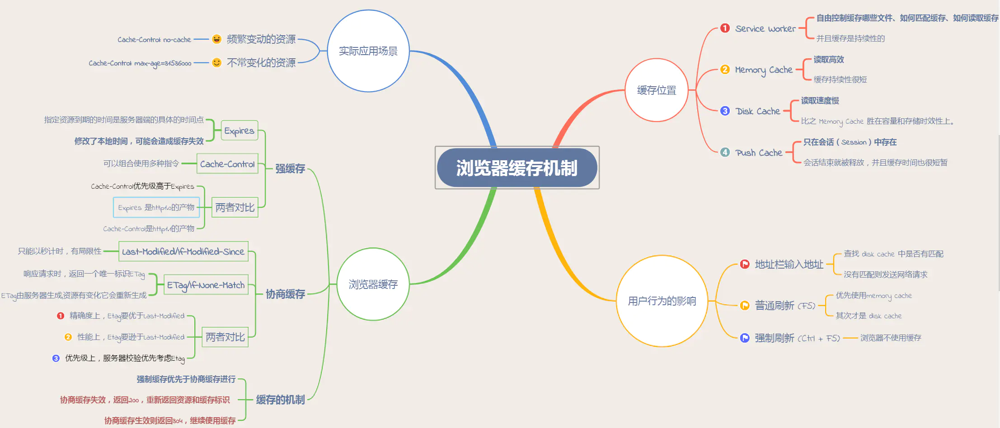
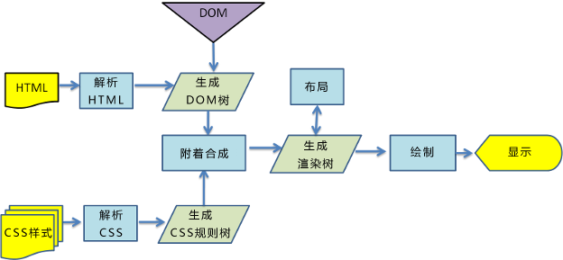

# [返回主页](https://github.com/yisainan/web-interview/blob/master/README.md)

<b><details><summary>1. 常见的浏览器内核有哪些？</summary></b>

答案：

Trident 内核：IE, MaxThon, TT, The World, 360, 搜狗浏览器等。[又称 MSHTML]

Gecko 内核：Netscape6 及以上版本，FF, MozillaSuite/SeaMonkey 等

Presto 内核：Opera7 及以上。 [Opera 内核原为：Presto，现为：Blink; ]

Webkit 内核：Safari, Chrome 等。 [ Chrome 的：Blink（WebKit 的分支）]

[参与互动](https://github.com/yisainan/web-interview/issues/328)

</details>

<b><details><summary>2. 如何实现浏览器内多个标签页之间的通信?</summary></b>

答案：调用 localstorge、cookies 等本地存储方式，注意sessionstorge不可以哦

[参与互动](https://github.com/yisainan/web-interview/issues/329)

</details>

<b><details><summary>3. 浏览器的渲染过程</summary></b>

答案：

1. 解析HTML生成DOM树。
2. 解析CSS生成CSSOM规则树。
3. 将DOM树与CSSOM规则树合并在一起生成渲染树。
4. 遍历渲染树开始布局，计算每个节点的位置大小信息。
5. 将渲染树每个节点绘制到屏幕。

解析：

* 使用 HTML 创建文档对象模型（DOM）
* 使用 CSS 创建 CSS 对象模型（CSSOM）
* 基于 DOM 和 CSSOM 执行脚本（Scripts）
* 合并 DOM 和 CSSOM 形成渲染树（Render Tree）
* 使用渲染树布局（Layout）所有元素
* 渲染（Paint）所有元素

[参考](https://jinlong.github.io/2017/05/08/optimising-the-front-end-for-the-browser/)

[参与互动](https://github.com/yisainan/web-interview/issues/330)

</details>

<b><details><summary>4. 为何会出现浏览器兼容问题</summary></b>

答案：

* 同一产品，版本越老 bug 越多
* 同一产品，版本越新，功能越多
* 不同产品，不同标准，不同实现方式

### 处理兼容问题的思路

1. 要不要做
* 产品的角度（产品的受众、受众的浏览器比例、效果优先还是基本功能优先）
* 成本的角度 (有无必要做某件事)

2. 做到什么程度
* 让哪些浏览器支持哪些效果

3. 如何做
* 根据兼容需求选择技术框架/库(jquery)
* 根据兼容需求选择兼容工具(html5shiv.js、respond.js、css reset、normalize.css、Modernizr)
* 条件注释、CSS Hack、js 能力检测做一些修补

* 渐进增强(progressive enhancement): 针对低版本浏览器进行构建页面，保证最基本的功能，然后再针对高级浏览器进行效果、交互等改进和追加功能达到更好的用户体验
* 优雅降级 (graceful degradation): 一开始就构建完整的功能，然后再针对低版本浏览器进行兼容。

解析：[参考](https://github.com/jirengu/frontend-interview/issues/35)

[参与互动](https://github.com/yisainan/web-interview/issues/331)

</details>

<b><details><summary>5. 跨标签页的通讯方式有哪些（哔哩哔哩）</summary></b>

答案：

```
(1) BroadCast Channel
(2) Service Worker
(3) LocalStorage + window.onstorage监听
(4) Shared Worker + 定时器轮询(setInterval)
(5) IndexedDB + 定时器轮询(setInterval)
(6) cookie + 定时器轮询(setInterval)
(7) window.open + window.postMessage
(8) Websocket
```

</details>

<b><details><summary>6. 请求时浏览器缓存 from memory cache 和 from disk cache 的依据是什么，哪些数据什么时候存放在 Memory Cache 和 Disk Cache中？</summary></b>

答案：

状态 类型 说明
200 form memory cache 不请求网络资源，资源在内存当中
200 form disk ceche 不请求网络资源，在磁盘当中
200 资源大小数值 从服务器下载最新资源
304 报文大小 请求服务端发现资源没有更新，使用本地资源

#### 一、前言

缓存可以说是性能优化中简单高效的一种优化方式了。一个优秀的缓存策略可以缩短网页请求资源的距离，减少延迟，并且由于缓存文件可以重复利用，还可以减少带宽，降低网络负荷。

对于一个数据请求来说，可以分为发起网络请求、后端处理、浏览器响应三个步骤。浏览器缓存可以帮助我们在第一和第三步骤中优化性能。比如说直接使用缓存而不发起请求，或者发起了请求但后端存储的数据和前端一致，那么就没有必要再将数据回传回来，这样就减少了响应数据。

接下来的内容中我们将通过缓存位置、缓存策略以及实际场景应用缓存策略来探讨浏览器缓存机制。



#### 二、缓存位置

从缓存位置上来说分为四种，并且各自有优先级，当依次查找缓存且都没有命中的时候，才会去请求网络。

1. Service Worker
2. Memory Cache
3. Disk Cache
4. Push Cache

1. Service Worker

Service Worker 是运行在浏览器背后的独立线程，一般可以用来实现缓存功能。使用 Service Worker的话，传输协议必须为 HTTPS。因为 Service Worker 中涉及到请求拦截，所以必须使用 HTTPS 协议来保障安全。Service Worker 的缓存与浏览器其他内建的缓存机制不同，它可以让我们自由控制缓存哪些文件、如何匹配缓存、如何读取缓存，并且缓存是持续性的。

Service Worker 实现缓存功能一般分为三个步骤：首先需要先注册 Service Worker，然后监听到 install 事件以后就可以缓存需要的文件，那么在下次用户访问的时候就可以通过拦截请求的方式查询是否存在缓存，存在缓存的话就可以直接读取缓存文件，否则就去请求数据。

当 Service Worker 没有命中缓存的时候，我们需要去调用 fetch 函数获取数据。也就是说，如果我们没有在 Service Worker 命中缓存的话，会根据缓存查找优先级去查找数据。但是不管我们是从 Memory Cache 中还是从网络请求中获取的数据，浏览器都会显示我们是从 Service Worker 中获取的内容。

2. Memory Cache

Memory Cache 也就是内存中的缓存，主要包含的是当前中页面中已经抓取到的资源, 例如页面上已经下载的样式、脚本、图片等。读取内存中的数据肯定比磁盘快, 内存缓存虽然读取高效，可是缓存持续性很短，会随着进程的释放而释放。 一旦我们关闭 Tab 页面，内存中的缓存也就被释放了。

那么既然内存缓存这么高效，我们是不是能让数据都存放在内存中呢？ 这是不可能的。计算机中的内存一定比硬盘容量小得多，操作系统需要精打细算内存的使用，所以能让我们使用的内存必然不多。

当我们访问过页面以后，再次刷新页面，可以发现很多数据都来自于内存缓存

内存缓存中有一块重要的缓存资源是preloader相关指令（例如 ）下载的资源。总所周知preloader的相关指令已经是页面优化的常见手段之一，它可以一边解析js/css文件，一边网络请求下一个资源。

需要注意的事情是，内存缓存在缓存资源时并不关心返回资源的HTTP缓存头Cache-Control是什么值，同时资源的匹配也并非仅仅是对URL做匹配，还可能会对Content-Type，CORS等其他特征做校验。

3. Disk Cache

Disk Cache 也就是存储在硬盘中的缓存，读取速度慢点，但是什么都能存储到磁盘中，比之 Memory Cache 胜在容量和存储时效性上。

在所有浏览器缓存中，Disk Cache 覆盖面基本是最大的。它会根据 HTTP Herder 中的字段判断哪些资源需要缓存，哪些资源可以不请求直接使用，哪些资源已经过期需要重新请求。并且即使在跨站点的情况下，相同地址的资源一旦被硬盘缓存下来，就不会再次去请求数据。绝大部分的缓存都来自 Disk Cache，关于 HTTP 的协议头中的缓存字段，我们会在下文进行详细介绍。

浏览器会把哪些文件丢进内存中？哪些丢进硬盘中？ 关于这点，网上说法不一，不过以下观点比较靠得住：

对于大文件来说，大概率是不存储在内存中的，反之优先 当前系统内存使用率高的话，文件优先存储进硬盘

4. Push Cache

Push Cache（推送缓存）是 HTTP/2 中的内容，当以上三种缓存都没有命中时，它才会被使用。它只在会话（Session）中存在，一旦会话结束就被释放，并且缓存时间也很短暂，在Chrome浏览器中只有5分钟左右，同时它也并非严格执行HTTP头中的缓存指令。

Push Cache 在国内能够查到的资料很少，也是因为 HTTP/2 在国内不够普及。这里推荐阅读Jake Archibald的 HTTP/2 push is tougher than I thought 这篇文章，文章中的几个结论： - 所有的资源都能被推送，并且能够被缓存, 但是 Edge 和 Safari 浏览器支持相对比较差 - 可以推送 no-cache 和 no-store 的资源 - 一旦连接被关闭，Push Cache 就被释放 - 多个页面可以使用同一个HTTP/2的连接，也就可以使用同一个Push Cache。这主要还是依赖浏览器的实现而定，出于对性能的考虑，有的浏览器会对相同域名但不同的tab标签使用同一个HTTP连接。 - Push Cache 中的缓存只能被使用一次 - 浏览器可以拒绝接受已经存在的资源推送 - 你可以给其他域名推送资源

如果以上四种缓存都没有命中的话，那么只能发起请求来获取资源了。

那么为了性能上的考虑，大部分的接口都应该选择好缓存策略，通常浏览器缓存策略分为两种：强缓存和协商缓存，并且缓存策略都是通过设置 HTTP Header 来实现的。

解析：[参考](https://developer.aliyun.com/ask/288781)

</details>

<b><details><summary>7. 浏览器如何解析css选择器？</summary></b>

答案：

CSS选择器的解析是从右向左解析的。若从左向右的匹配，发现不符合规则，需要进行回溯，会损失很多性能。若从右向左匹配，先找到所有的最右节点，对于每一个节点，向上寻找其父节点直到找到根元素或满足条件的匹配规则，则结束这个分支的遍历。两种匹配规则的性能差别很大，是因为从右向左的匹配在第一步就筛选掉了大量的不符合条件的最右节点（叶子节点），而从左向右的匹配规则的性能都浪费在了失败的查找上面。
而在 CSS 解析完毕后，需要将解析的结果与 DOM Tree 的内容一起进行分析建立一棵 Render Tree，最终用来进行绘图。在建立 Render Tree 时（WebKit 中的「Attachment」过程），浏览器就要为每个 DOM Tree 中的元素根据 CSS 的解析结果（Style Rules）来确定生成怎样的 Render Tree。

</details>

<b><details><summary>8. 浏览器是如何渲染UI的？</summary></b>

答案：

　　① 浏览器将获取的HTML文档解析成DOM树

　　② 处理CSS标记，构成层叠样式表模型CSSOM(CSS Object Model)

　　③ 将DOM和CSSOM合并为渲染树(rendering tree)将会被创建，代表一系列将被渲染的对象

　　④ 渲染树的每个元素包含的内容都是计算过的，它被称之为布局layout。浏览器使用一种流式处理的方法，只需要一次pass绘制操作就可以布局所有的元素

　　⑤ 将渲染树的各个节点绘制到屏幕上，这一步被称为绘制painting

图形说明：



解析：[参考](https://www.cnblogs.com/gwf93/p/10717281.html)

</details>

<b><details><summary>9. 浏览器的主要组成部分是什么？</summary></b>

答案：

```

       1. 用户界面:

          用户界面主要包括：地址栏，后退/前进按钮，书签目录等；（除了从服务器请求到的网页窗口）

       2. 浏览器引擎：

          用来查询及操作渲染引擎的接口；

       3. 渲染引擎：

         用来显示请求的html内容；（包括样式，图片，js）     

       4. 网络：

          主要是来完成网络调用，例如http请求，它具有平台无关的接口，可以在不同平台上工作；

        5. UI后端：

            用来绘制类似组合选择框及对话框等基本组件，具有不特定于某个平台的通用接口，底层使用操作系统的用户接口。

       6. JS解释器 ：

          用来解释执行JS代码；

        7. 数据存储：

           属于持久层，浏览器需要在硬盘中保存类似cookie的各种数据，HTML5定义了web database技术，这是一种轻量级完整的客户端存储技术；

```

</details>

<b><details><summary>10. 浏览器性能问题-使用 Webpack 优化项目</summary></b>

答案：

</details>

<b><details><summary>11. 怎样选择合适的缓存策略</summary></b>

答案：

众所周知，想要提高系统的性能，缓存是最直接也是最简单的方法之一。缓存一方面可以减少数据库负载，另一方面还可以减少相应时间并且节省成本。今天，小编将向大家介绍几种比较常见的缓存策略，即Cache-Aside、Read-Though Cache、Write-Through Cache、Write-Around和Write-Back。下面让我们一起对比分析一下常用缓存策略的优劣以及使用场景吧！

解析：[参考](https://www.boxuegu.com/news/2860.html)

</details>

<b><details><summary>12. 说说浏览器缓存机制</summary></b>

答案：过期机制、验证机制

解析：

对于浏览器的缓存来讲，这些规则是在HTTP协议头部和HTML页面的Meta标签中定义的。他们分别从新鲜度和校验值两个维度来规定浏览器是否可以直接使用缓存中的副本，还是需要去源服务器获取新版本。

过期机制：指的是缓存副本的有效期。一个缓存的副本必须满足以下条件，浏览器会认为它是有效的，足够新的：
1. 含有完整的过期时间控制头信息（HTTP协议报头），并且仍在有效期内
2. 浏览器已经使用过这个缓存的副本，并且会在一个会话中已经检查过新鲜度(即服务器上的资源是否发生改变)
满足以上两种情况的一种，浏览器会直接从缓存中获取副本进行渲染

校验值（验证机制）：服务器返回资源的时候有时在控制头信息带上这个资源的实体标签Etag(Entity Tag), 它可以用来作为浏览器再次请求过程中的校验标识，如果发现校验标识不匹配，说明资源已经被修改或者过期，浏览器需要重新获取资源内容。

[参考](https://blog.csdn.net/hhthwx/article/details/80152728)

</details>

<b><details><summary>12. 列举 IE 与其他浏览器不一样的特性？</summary></b>

答案：

a. IE 的排版引擎是 Trident （又称为 MSHTML）

b. Trident 内核曾经几乎与 W3C 标准脱节（2005 年）

c. Trident 内核的大量 Bug 等安全性问题没有得到及时解决

d. JS 方面，有很多独立的方法，例如绑定事件的 attachEvent、创建事件的 createEventObject 等

e. CSS 方面，也有自己独有的处理方式，例如设置透明，低版本 IE 中使用滤镜的方式

[参与互动](https://github.com/yisainan/web-interview/issues/13)

</details>

<b><details><summary>13. 说说你对Service worker的理解</summary></b>

答案：

</details>

<b><details><summary>14. 永久性重定向（301）和临时性重定向（302）对 SEO 有什么影响</summary></b>

答案：

</details>

<b><details><summary>15. 浏览器 Eventloop 和 Node 中的有什么区别</summary></b>

答案：

</details>
