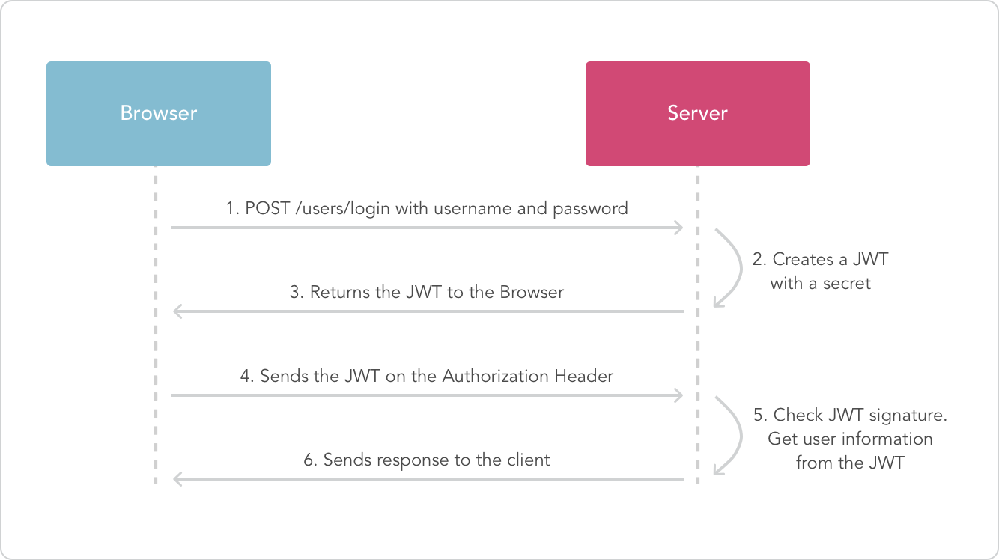

# [返回主页](https://github.com/yisainan/web-interview/blob/master/README.md)

<b><details><summary>1. Http 状态码，Http2 是什么</summary></b>

参考答案：

200 欢迎回来，主人 （正常；请求已完成。）

301 人家搬家了 （已移动 — 请求的数据具有新的位置且更改是永久的。）

307 不是这里，换个地方啦 （重新请求的 URL，客户端自动重新请求新的地址）

400 不要把奇怪的东西给人家嘛 （错误请求 — 请求中有语法问题，或不能满足请求。）

403 这里不可以啦！（禁止 — 即使有授权也不需要访问。）

404 这里什么都没有 --- 人家是平的啦。 （找不到 — 服务器找不到给定的资源；文档不存在。）

405 打开方式不对 （资源被禁止）

414 这... 太长了啦 （请求 - URI 太长）

500 服务姬坏掉了啦 （内部错误 — 因为意外情况，服务器不能完成请求。）

503 不要... 人家还没准备好啦 （无法获得服务 — 由于临时过载或维护，服务器无法处理请求。）

101 服务姬傲娇中 （服务器将遵从客户的请求转换到另外一种协议）

100 人家... 还要... （初始的请求已经接受，客户应当继续发送请求的其余部分。）

HTTP/2（超文本传输协议第 2 版，最初命名为 HTTP 2.0），是 HTTP 协议的的第二个主要版本，使用于万维网。HTTP/2 是 HTTP 协议自 1999 年 HTTP 1.1 发布后的首个更新，主要基于 SPDY 协议（是 Google 开发的基于 TCP 的应用层协议，用以最小化网络延迟，提升网络速度，优化用户的网络使用体验）。

与 HTTP 1.1 相比，主要区别包括

* HTTP/2 采用二进制格式而非文本格式
* HTTP/2 是完全多路复用的，而非有序并阻塞的——只需一个连接即可实现并行
* 使用报头压缩，HTTP/2 降低了开销
* HTTP/2 让服务器可以将响应主动“推送”到客户端缓存中

解析：

| 状态码 | 类别                             | 描述                   |
| ------ | -------------------------------- | ---------------------- |
| 1xx    | Informational（信息状态码）      | 接受请求正在处理       |
| 2xx    | Success（成功状态码）            | 请求正常处理完毕       |
| 3xx    | Redirection（重定向状态码）      | 需要附加操作已完成请求 |
| 4xx    | Client Error（客户端错误状态码） | 服务器无法处理请求     |
| 5xx    | Server Error（服务器错误状态码） | 服务器处理请求出错     |

[参与互动](https://github.com/yisainan/web-interview/issues/938)

</details>

<b><details><summary>2. http1.1 时如何复用 tcp 连接（网易）</summary></b>

参考答案：在发送 http 的请求头中设置 Connection: keep-alive

[参与互动](https://github.com/yisainan/web-interview/issues/939)

</details>

<b><details><summary>3. Http 请求的整个过程</summary></b>

参考答案：

简洁版： 1. 域名解析 --> 2. 发起 TCP 的 3 次握手 --> 3. 建立 TCP 连接后发起 http 请求 --> 4. 服务器响应 http 请求，浏览器得到 html 代码 --> 5. 浏览器解析 html 代码，并请求 html 代码中的资源（如 js、css、图片等） --> 6. 浏览器对页面进行渲染呈现给用户

[参与互动](https://github.com/yisainan/web-interview/issues/940)

</details>

<b><details><summary>4. http 缓存配置怎么设置</summary></b>

参考答案：

前端设置 http 缓存, 前端设置 html 页面缓存方法：静态的 html 页面想要设置使用缓存需要通过 HTTP 的 META 设置 expires 和 cache-control

设置如下网页元信息:

```html
<meta http-equiv="Cache-Control" content="max-age=7200" />
<meta http-equiv="Expires" content="Mon, 20 Jul 2013 23:00:00 GMT" />
```

解答:
cache-control：||no-cache||no-store||max-age

1.no-cache：

表面意为“数据内容不被缓存”，而实际数据是被缓存到本地的，只是每次请求时候直接绕过缓存这一环节直接向服务器请求最新资源，由于浏览器解释不一样，

例如 ie 中我们设置了 no-cache 之后，请求虽然不会直接使用缓存，但是还会用缓存数据与服务器数据进行一致性检测(也就是说还是有几率会用到缓存的), 

firefox 中则完全无视 no-cache 存在，详细解释见 no-store; 

2.no-store：

指示缓存不存储此次请求的响应部分。与 no-cache 比较来说，一个是不用缓存，一个是不存储缓存; 按理来说这个设置更加粗暴直接禁用缓存，

但是具体实现起来 浏览器之间差异却特别大，一般不会直接用该字段进行设置，不过 no-store 是为了防止缓存被恶意修改存储路径导致信息被泄露而设置的，

毕竟有它的用处，在 firefox 中实现缓存是通过文件另存为将缓存副本保存到本地，直接利用 no-cache 对其是无效的，如果加上 no-store 设置的话 则可以起到与 no-cache 一样的效果; 

即：cache-control:no-cache, no-store; 可以确保在支持 http1.1 版本中各大浏览器回车后退刷新无缓存；

再加上 Pragma: no-cache 设置兼容版本 1.0 即可(不过为了防止一致性检测时候的万一我们还是最好加上一致性检测的内容，如下所示几种方式)；

3.max-age：

例如 Cache-control: max-age=3；表示此次请求成功后 3 秒之内发送同样请求不会去服务器重新请求，而是使用本地缓存；同样我们如果设置 max-age=0 表示立即抛弃缓存直接发送请求到服务器

以下内容来自:http://www.runoob.com/tags/att-meta-http-equiv.html

HTML <meta> http-equiv 属性
HTML meta 标签参考手册 HTML <meta> 标签

实例
每隔 30 秒刷新一次文档：

```html
<head>
    <meta http-equiv="refresh" content="30" />
</head>
```

扩展：

与缓存有关的 header
我们来看看每个 header 的具体含义。

* Request

Cache-Control: max-age=0 以秒为单位
If-Modified-Since: Mon, 19 Nov 2012 08:38:01 GMT 缓存文件的最后修改时间。
If-None-Match: "0693f67a67cc1:0" 缓存文件的 Etag 值
Cache-Control: no-cache 不使用缓存
Pragma: no-cache 不使用缓存

* Response

Cache-Control: public 响应被缓存，并且在多用户间共享，  （公有缓存和私有缓存的区别，请看另一节）
Cache-Control: private 响应只能作为私有缓存，不能在用户之间共享
Cache-Control:no-cache 提醒浏览器要从服务器提取文档进行验证
Cache-Control:no-store 绝对禁止缓存（用于机密，敏感文件）
Cache-Control: max-age=60 60 秒之后缓存过期（相对时间）
Date: Mon, 19 Nov 2012 08:39:00 GMT 当前 response 发送的时间
Expires: Mon, 19 Nov 2012 08:40:01 GMT 缓存过期的时间（绝对时间）
Last-Modified: Mon, 19 Nov 2012 08:38:01 GMT 服务器端文件的最后修改时间
ETag: "20b1add7ec1cd1:0" 服务器端文件的 Etag 值

[参与互动](https://github.com/yisainan/web-interview/issues/941)

</details>

<b><details><summary>5. 常见的浏览器端的存储技术有哪些， 以及它们的优缺点和使用场景？</summary></b>

参考答案：

#### 1. cookie

h5 之前，存储主要用 cookies，缺点是在请求头上带着数据，导致流量增加。大小限制 4k

操作方式：

```html
document.cookie = "username=John Doe; expires=Thu, 18 Dec 2013 12:00:00
GMT;path=/" // 设置 cookie document.cookie = "username=; expires=Thu, 01 Jan
1970 00:00:00 GMT" // 删除 cookie
```

设置 cookie 的方法比较简单，其中有几个参数可以添加

expires
过期时间，当过了到期日期时，浏览器会自动删除该 cookie，如果想删除一个 cookie，只需要把它过期时间设置成过去的时间即可
比如希望设置过期时间一年：new Date().getTime() + 365 _ 24 _ 60 _ 60 _ 1000

如果不设置过期时间，则表示这个 cookie 生命周期为浏览器会话期间，只要关闭浏览器窗口，cookie 就消失了。

path
路径，值可以是一个目录，或者是一个路径。

如果 cc.com/test/index.html 建立了一个 cookie，那么在 cc.com/test/目录里的所有页面，以及该目录下面任何子目录里的页面都可以访问这个 cookie。因此在 cc.com/test/test2/test3 里的任何页面都可以访问 cc.com/test/index.html 建立的 cookie。若 cc.com/test/ 若想访问 cc.com/test/index.html 设置的 cookes，需要把 cookies 的 path 属性设置成“/”。
在指定路径的时候，凡是来自同一服务器，URL 里有相同路径的所有 WEB 页面都可以共享 cookies。

domain
主机名，是指同一个域下的不同主机，例如：www.baidu.com 和 map.baidu.com 就是两个不同的主机名。默认情况下，一个主机中创建的 cookie 在另一个主机下是不能被访问的，但可以通过 domain 参数来实现对其的控制：document.cookie = "name=value; domain=.baidu.com"
这样，所有\*.baidu.com 的主机都可以访问该 cookie。

#### 2. localStorage

以键值对(Key-Value)的方式存储，永久存储，永不失效，除非手动删除。IE8+支持，每个域名限制 5M

打开同域的新页面也能访问得到

操作方式：

window.localStorage.username = 'hehe' // 设置
window.localStorage.setItem('username', 'hehe') // 设置
window.localStorage.getItem('username') // 读取
window.localStorage.removeItem('username') // 删除
window.localStorage.key(1) // 读取索引为 1 的值
window.localStorage.clear() // 清除所有
可以存储数组、数字、对象等可以被序列化为字符串的内容

#### 3. sessionStorage

sessionStorage 操作的方法与 localStroage 是一样的，区别在于 sessionStorage 在关闭页面后即被清空，而 localStorage 则会一直保存。很多时候数据只需要在用户浏览一组页面期间使用，关闭窗口后数据就可以丢弃了，这种情况使用 sessionStorage 就比较方便。

注意，刷新页面 sessionStorage 不会清除，但是打开同域新页面访问不到

#### 4. cookie、localStorage、sessionStorage 之间的区别

他们都是保存在浏览器端的存储方式，他们之间的区别：

cookie 数据始终在同源的 http 请求中携带（即使不需要），即 cookie 在浏览器和服务器间来回传递。而 sessionStorage 和 localStorage 不会自动把数据发给服务器，仅在本地保存。cookie 数据还有路径（path）的概念，可以限制 cookie 只属于某个路径下。
存储大小限制不同，cookie 数据不能超过 4k，同时因为每次 http 请求都会携带 cookie，所以 cookie 只适合保存很小的数据，如会话标识。sessionStorage 和 localStorage 虽然也有存储大小的限制，但比 cookie 大得多，可以达到 5M 或更大。
数据有效期不同，sessionStorage：仅在当前浏览器窗口关闭前有效，自然也就不可能持久保持；localStorage：始终有效，窗口或浏览器关闭也一直保存，因此用作持久数据；cookie 只在设置的 cookie 过期时间之前一直有效，即使窗口或浏览器关闭。
作用域不同，sessionStorage 不在不同的浏览器页面中共享，即使是同一个页面；localStorage 在所有同源窗口中都是共享的；cookie 也是在所有同源窗口中都是共享的。
Web Storage 支持事件通知机制，可以将数据更新的通知发送给监听者。
Web Storage 的 api 接口使用更方便，cookie 的原生接口不友好，需要自己封装。

#### 5. 安全性

需要注意的是，不是什么数据都适合放在 Cookie、localStorage 和 sessionStorage 中的，因为它们保存在本地容易被篡改，使用它们的时候，需要时刻注意是否有代码存在 XSS 注入的风险。所以千万不要用它们存储你系统中的敏感数据。

#### 6. 在浏览器多个 tab 页中，cookie、localStorage 可以共享数据，sessionStorage 仅保存在当前 tab 页中不能共享

[参与互动](https://github.com/yisainan/web-interview/issues/942)

</details>

<b><details><summary>6. 在 HTTP 响应 Header 中，set-cookie 选项有哪些，分别代表什么含义？</summary></b>

参考答案：

Set-Cookie: `<cookie-name>=<cookie-value>`

* Expires=`<date>`
* Max-Age=`<non-zero-digit>`
* Domain=`<domain-value>`
* Path=`<path-value>`
* Secure
* HttpOnly
* SameSite=Strict
* SameSite=Lax

```js
name = name; // 需要设置cookie的值(name不能使用";"和","号),有多个name值时用";"分隔例如：name1=name1;name2=name2;name3=name3

expires; //cookie的有效期限,格式为:expires="Wdy,DD-Mon-YYYY HH:MM:SS"

path; //设置cookie支持的路径,如果path是一个路径，则cookie对这个目录下的所有文件及子目录生效，例如：path="/cgi-bin/"，如果path是一个文件，则cookie指对这个文件生效，例如：path="/cgi-bin/cookie.cgi"

domain; //对cookie生效的域名，例如：domain="gzdzw.51.net"

secure; //如果给出此标志，表示cookie只能通过SSL协议的https服务器来传递,cookie的接收是通过设置环境变量HTTP_COOKIE来实现的，CGI程序可以通过检索该变量获取cookie信息
```

解析：Cookie 相关的 Http 头

有两个 Http 头部和 Cookie 有关：Set-Cookie 和 Cookie

* Set-Cookie 由服务器发送，它包含在响应请求的头部中。它用于在客户端创建一个 Cookie
* Cookie 头由客户端发送，包含在 HTTP 请求的头部中。注意，只有 cookie 的 domain 和 path 与请求的 URL 匹配才会发送这个 cookie。

[参考](https://developer.mozilla.org/zh-CN/docs/Web/HTTP/Headers/Set-Cookie)

[参与互动](https://github.com/yisainan/web-interview/issues/943)

</details>

<b><details><summary>7. 何为跨域？ 跨域请求数据有几种方式？图片/脚本 等资源有什么跨域问题。如何解决？跨域请求时如何携带 cookie</summary></b>

参考答案：

#### 1. 何为跨域？

* 由于浏览器同源策略，凡是发送请求 url 的协议、域名、端口三者之间任意一与当前页面地址不同即为跨域。
* 同源策略限制了一个源(origin)中加载文本或脚本与来自其它源(origin)中资源的交互方式。同源指的是协议、域名、端口相同，同源策略是一种安全协议。

#### 2. 跨域请求数据有几种方式？

（1）JSONP 动态创建 script 标签

但缺点是只支持 get 请求，并且很难判断请求是否失败（一般通过判断请求是否超时）。

（2）Proxy 代理

这种方式首先将请求发送给后台服务器，通过服务器来发送请求，然后将请求的结果传递给前端。

（3）CORS 跨域

是现代浏览器提供的一种跨域请求资源的方法，需要客户端和服务器端的同时支持。整个 CORS 通信过程，都是浏览器自动完成，不需要用户参与。对于开发者来说，CORS 通信与同源的 AJAX 通信没有差别，代码完全一样。浏览器一旦发现 AJAX 请求跨源，就会自动添加一些附加的头信息，有时还会多出一次附加的请求，但用户不会有感觉。因此，实现 CORS 通信的关键是服务器。只要服务器实现了 CORS 接口，就可以跨源通信。

#### 3. 图片/脚本 等资源有什么跨域问题。如何解决？

#### 4. 跨域请求时如何携带 cookie

[参与互动](https://github.com/yisainan/web-interview/issues/944)

</details>

<b><details><summary>8. 简要描述 HTTPS 的安全机制，以及在 web 服务工程实践中需要注意的问题。描述 http2 和 https 的关系</summary></b>

参考答案：

* HTTP 协议通常承载于 TCP 协议之上，在 HTTP 和 TCP 之间添加一个安全协议层（SSL 或 TSL），这个时候，就成了我们常说的 HTTPS。
* 默认 HTTP 的端口号为 80，HTTPS 的端口号为 443。

[参与互动](https://github.com/yisainan/web-interview/issues/945)

</details>

<b><details><summary>9. 什么是点击劫持？如何防范？</summary></b>

参考答案：

```
什么点击劫持？最常见的是恶意网站使用 <iframe> 标签把我方的一些含有重要信息类如交易的网页嵌入进去，然后把 iframe 设置透明，用定位的手段的把一些引诱用户在恶意网页上点击。这样用户不知不觉中就进行了某些不安全的操作。
```

有两种方式可以防范：

1. 使用 JS 防范：
   if (top.location.hostname !== self.location.hostname) {
   alert("您正在访问不安全的页面，即将跳转到安全页面！"); 
   top.location.href = self.location.href; 
   }

2. 使用 HTTP 头防范：
   通过配置 nginx 发送 X-Frame-Options 响应头，这样浏览器就会阻止嵌入网页的渲染。更详细的可以查阅 MDN 上关于 X-Frame-Options 响应头的内容。
   add_header X-Frame-Options SAMEORIGIN; 

[参与互动](https://github.com/yisainan/web-interview/issues/946)

</details>

<b><details><summary>10. 什么是 CSRF, 怎么造成的，有什么防御方法？</summary></b>

参考答案：

CSRF 概念：CSRF 跨站点请求伪造(Cross—Site Request Forgery)，跟 XSS 攻击一样，存在巨大的危害性，你可以这样来理解：
攻击者盗用了你的身份，以你的名义发送恶意请求，对服务器来说这个请求是完全合法的，但是却完成了攻击者所期望的一个操作，比如以你的名义发送邮件、发消息，盗取你的账号，添加系统管理员，甚至于购买商品、虚拟货币转账等。 如下：其中 Web A 为存在 CSRF 漏洞的网站，Web B 为攻击者构建的恶意网站，User C 为 Web A 网站的合法用户。

CSRF 攻击攻击原理及过程如下：

       1. 用户C打开浏览器，访问受信任网站A，输入用户名和密码请求登录网站A；

       2.在用户信息通过验证后，网站A产生Cookie信息并返回给浏览器，此时用户登录网站A成功，可以正常发送请求到网站A；

       3. 用户未退出网站A之前，在同一浏览器中，打开一个TAB页访问网站B；

       4. 网站B接收到用户请求后，返回一些攻击性代码，并发出一个请求要求访问第三方站点A；

       5. 浏览器在接收到这些攻击性代码后，根据网站B的请求，在用户不知情的情况下携带Cookie信息，向网站A发出请求。网站A并不知道该请求其实是由B发起的，所以会根据用户C的Cookie信息以C的权限处理该请求，导致来自网站B的恶意代码被执行。

防御 CSRF 攻击：

       目前防御 CSRF 攻击主要有三种策略：验证 HTTP Referer 字段；在请求地址中添加 token 并验证；在 HTTP 头中自定义属性并验证。

解析：

CSRF（Cross-site request forgery）跨站请求伪造，也被称为“One Click Attack”或者 Session Riding，通常缩写为 CSRF 或者 XSRF，是一种对网站的恶意利用。尽管听起来像跨站脚本（XSS），但它与 XSS 非常不同，XSS 利用站点内的信任用户，而 CSRF 则通过伪装来自受信任用户的请求来利用受信任的网站。与 XSS 攻击相比，CSRF 攻击往往不大流行（因此对其进行防范的资源也相当稀少）和难以防范，所以被认为比 XSS 更具危险性。

### 特点

* 依靠用户标识危害网站
* 利用网站对用户标识的信任
* 欺骗用户的浏览器发送 HTTP 请求给目标站点
* 另外可以通过 IMG 标签会触发一个 GET 请求，可以利用它来实现 CSRF 攻击。

### 防御

* 通过 referer、token 或者验证码来检测用户提交。
* 尽量不要在页面的链接中暴露用户隐私信息。
* 对于用户修改删除等操作最好都使用 post 操作 。
* 避免全站通用的 cookie，严格设置 cookie 的域。

[参与互动](https://github.com/yisainan/web-interview/issues/947)

</details>

<b><details><summary>11. 请简述如何在 HTML 中开启和关闭 DNS 预读取?</summary></b>

参考答案：

### DNS 预读取

#### 概念：

浏览器主动去执行域名解析功能。

当浏览网页时，浏览器会对网页中的域名进行解析缓存，这样当单击当前网页中的连接时就无需进行 DNS 解析，减少用户等待时间，提高用户体验。

#### 范围：

图片、CSS、JS 或 html 上的 link 等 URL。

#### 开关和使用：

```html
<meta http-equiv="x-dns-prefetch-control" content="off" />

<link rel="dns-prefetch" href="//www.spreadfirefox.com" />
```

#### 前端优化：

减少 DNS 请求次数；

进行 DNS 预获取；

[参与互动](https://github.com/yisainan/web-interview/issues/948)

</details>

<b><details><summary>12. 什么是回源？域名回源的含义是什么？</summary></b>

参考答案：在搜索引擎中所谓的域名回源就是搜索引擎的蜘蛛在爬行的过程中直接抓取源地址上的内容而不是存在各个节点（CDN）上的缓存内容。

解析：

CDN 回源率计算方法

#### 如何计算回源比？

回源比分为回源请求数比例及回源流量比例两种

**回源请求数比**：统计数据来自所有边缘节点上的请求记录，其中，对于没有缓存或缓存过期（可缓存）的请求以及不可缓存的请求，均计入回源请求中，其他直接命中缓存的，则为命中请求。

**回源流量比**：回源流量是回源请求文件大小产生的流量和请求本身产生的流量 回源流量比=回源流量/回源流量+用户请求访问的流量

源站内容有更新的时候，源站主动把内容推送到 CDN 节点。
常规的 CDN 都是回源的。即：当有用户访问某一个 URL 的时候，如果被解析到的那个 CDN 节点没有缓存响应的内容，或者是缓存已经到期，就会回源站去获取。如果没有人访问，那么 CDN 节点不会主动去源站拿的。

回源域名一般是 cdn 领域的专业术语，通常情况下，是直接用 ip 进行回源的，但是如果客户源站有多个 ip，并且 ip 地址会经常变化，对于 cdn 厂商来说，为了避免经常更改配置（回源 ip），会采用回源域名方式进行回源，这样即使源站的 ip 变化了，也不影响原有的配置。

CDN 本来是给我们的网站加速的，但是有时会因为不合适的回源策略给服务器带来负担，只有选择正确的策略才能给自己的网站带来更高的访问效率。

[参与互动](https://github.com/yisainan/web-interview/issues/949)

</details>

<b><details><summary>13. https 实现原理</summary></b>

参考答案：

HTTPS 在通讯过程中的原理，总共分为 8 步
STEP 1: 客户端发起 HTTPS 请求
STEP 2: 服务端的配置
STEP 3: 传送证书
STEP 4: 客户端解析证书
STEP 5: 传送加密信息
STEP 6: 服务端解密信息
STEP 7: 传输加密后的信息
STEP 8: 客户端解密信息

[参与互动](https://github.com/yisainan/web-interview/issues/950)

</details>

<b><details><summary>14. HTML5 的离线储存怎么使用，工作原理能不能解释一下</summary></b>

参考答案：

如何使用：只要在在页面头部加入 mainfest 的属性就行了。

```html
<!DOCTYPE html>
<html manifest="cache.manifest">

</html>
```

工作原理：HTML5 的离线存储是基于一个新建的.appcache 文件的缓存机制（不是存储技术），通过这个文件上的解析清单离线存储资源，这些资源就像 cookie 一样被存储下来。当无网时，浏览器会通过被离线存储的数据进行展示

[参与互动](https://github.com/yisainan/web-interview/issues/951)

</details>

<b><details><summary>15. XSS</summary></b>

参考答案：

### XSS 是什么

XSS 是一种经常出现在 web 应用中的计算机安全漏洞，它允许恶意 web 用户将代码植入到提供给其它用户使用的页面中。<br>
比如这些代码包括 HTML 代码和客户端脚本。攻击者利用 XSS 漏洞旁路掉访问控制——例如同源策略(same origin policy)。<br>
这种类型的漏洞由于被黑客用来编写危害性更大的网络钓鱼(Phishing)攻击而变得广为人知。<br>
对于跨站脚本攻击，黑客界共识是：跨站脚本攻击是新型的“缓冲区溢出攻击“，而 JavaScript 是新型的“ShellCode”。

```
示例：
<script>alert(document.cookie)</script>
```

### 特点

能注入恶意的 HTML/JavaScript 代码到用户浏览的网页上，从而达到 Cookie 资料窃取、会话劫持、钓鱼欺骗等攻击。
<攻击代码不一定（非要）在 <script></script> 中>

### 原因

* Web 浏览器本身的设计不安全。浏览器能解析和执行 JS 等代码，但是不会判断该数据和程序代码是否恶意。
* 输入和输出是 Web 应用程序最基本的交互，而且网站的交互功能越来越丰富。如果在这过程中没有做好安全防护，很容易会出现 XSS 漏洞。
* 程序员水平参差不齐，而且大都没有过正规的安全培训，没有相关的安全意识。
* XSS 攻击手段灵活多变。

### 危害

* 盗取各类用户帐号，如机器登录帐号、用户网银帐号、各类管理员帐号
* 控制企业数据，包括读取、篡改、添加、删除企业敏感数据的能力
* 盗窃企业重要的具有商业价值的资料
* 非法转账
* 强制发送电子邮件
* 网站挂马
* 控制受害者机器向其它网站发起攻击

### 如何防范

* 将重要的 cookie 标记为 http only, 这样的话 Javascript 中的 document.cookie 语句就不能获取到 cookie 了.
* 表单数据规定值的类型，例如：年龄应为只能为 int、name 只能为字母数字组合。。。。
* 对数据进行 Html Encode 处理
* 过滤或移除特殊的 Html 标签， 例如: `<script>, <iframe> , &lt; for <, &gt; for >, &quot for`
* 过滤 JavaScript 事件的标签。例如 "onclick=", "onfocus" 等等。

解析：参考资料：<br>
https://www.cnblogs.com/phpstudy2015-6/p/6767032.html<br>
https://www.cnblogs.com/443855539-wind/p/6055816.html<br>
https://baike.baidu.com/item/XSS%E6%94%BB%E5%87%BB/954065?fr=aladdin

[参与互动](https://github.com/yisainan/web-interview/issues/952)

</details>

<b><details><summary>16. CSRF cookie 问题？</summary></b>

参考答案：

[参与互动](https://github.com/yisainan/web-interview/issues/953)

</details>

<b><details><summary>17. CDN 原理</summary></b>

参考答案：

[参与互动](https://github.com/yisainan/web-interview/issues/954)

</details>

<b><details><summary>18. 如何启动浏览器硬件加速，小 Hack</summary></b>

参考答案：

[参与互动](https://github.com/yisainan/web-interview/issues/955)

</details>

<b><details><summary>19. 什么是 Cookie 隔离？（或者说：请求资源的时候不要让它带 cookie 怎么做）</summary></b>

参考答案：

[参与互动](https://github.com/yisainan/web-interview/issues/956)

</details>

<b><details><summary>20. 三次握手</summary></b>

参考答案：

TCP 协议是面向连接的通信协议，即在传输数据前先在发送端和接收端建立逻辑连接，然后再传输数据，它提供了两台计算机之间可靠无差错的数据传输。

在 TCP 连接中必须要明确客户端与服务器端，由客户端向服务端发出连接请求，每次连接的创建都需要经过“三次握手”

第一次握手，客户端向服务器端发送一个带 SYN 标志的数据包，等待服务器确认

第二次握手，服务器端向客户端回传一个带有 SYN/ACK 标志的数据包，通知客户端收到了连接请求

第三次握手，客户端再次向服务器端回传一个带 ACK 标志的数据包，确认连接，“握手”结束。

[参与互动](https://github.com/yisainan/web-interview/issues/957)

</details>

<b><details><summary>21. 四次挥手</summary></b>

参考答案：

1、客户端向服务器发送一个断开连接的请求（不早了，我该走了）；

2、服务器接到请求后发送确认收到请求的信号（知道了）；

3、服务器向客户端发送断开通知（我也该走了）；

4、客户端接到断开通知后断开连接并反馈一个确认信号（嗯，好的），服务器收到确认信号后断开连接；

解析：

第一次挥手：主动关闭方发送一个 FIN，用来关闭主动方到被动关闭方的数据传送，也就是主动关闭方告诉被动关闭方：我已经不会再给你发数据了(当然，在 fin 包之前发送出去的数据，如果没有收到对应的 ack 确认报文，主动关闭方依然会重发这些数据)，但是，此时主动关闭方还可 以接受数据。

第二次挥手：被动关闭方收到 FIN 包后，发送一个 ACK 给对方，确认序号为收到序号+1（与 SYN 相同，一个 FIN 占用一个序号）。

第三次挥手：被动关闭方发送一个 FIN，用来关闭被动关闭方到主动关闭方的数据传送，也就是告诉主动关闭方，我的数据也发送完了，不会再给你发数据了。

第四次挥手：主动关闭方收到 FIN 后，发送一个 ACK 给被动关闭方，确认序号为收到序号+1，至此，完成四次挥手。

[参与互动](https://github.com/yisainan/web-interview/issues/958)

</details>

<b><details><summary>22. 线程与进程的区别</summary></b>

参考答案：

a. 一个程序至少有一个进程，一个进程至少有一个线程

b. 线程的划分尺度小于进程，使得多线程程序的并发性高

c. 进程在执行过程中拥有独立的内存单元，而多个线程共享内存，从而极大地提高了程序的运行效率

d. 每个独立的线程有一个程序运行的入口、顺序执行序列和程序的出口。但是线程不能够独立执行，必须依存在应用程序中，由应用程序提供多个线程执行控制

e. 多线程的意义在于一个应用程序中，有多个执行部分可以同时执行。但操作系统并没有将多个线程看做多个独立的应用，来实现进程的调度和管理以及资源分配

[参与互动](https://github.com/yisainan/web-interview/issues/959)

</details>

<b><details><summary>23. WEB 应用从服务器主动推送 Data 到客户端有那些方式？</summary></b>

参考答案：

a. html5 websoket

b. WebSocket 通过 Flash

c. XHR 长时间连接

d. XHR Multipart Streaming

e. 不可见的 Iframe

f. 标签的长时间连接(可跨域)

[参与互动](https://github.com/yisainan/web-interview/issues/960)

</details>

<b><details><summary>24. HTTP 的几种请求方法用途</summary></b>

参考答案：

[参与互动](https://github.com/yisainan/web-interview/issues/961)

</details>

<b><details><summary>25. 常见 web 安全及防护原理</summary></b>

参考答案：

[参与互动](https://github.com/yisainan/web-interview/issues/962)

</details>

<b><details><summary>26. 为什么要有同源限制？</summary></b>

参考答案：

[参与互动](https://github.com/yisainan/web-interview/issues/963)

</details>

<b><details><summary>27. 域名发散和域名收敛是什么？</summary></b>

参考答案：

PC 时代为了突破浏览器的域名并发限制。有了域名发散。
浏览器有并发限制，是为了防止DDOS攻击。
* 域名收敛：就是将静态资源放在一个域名下。减少DNS解析的开销。
* 域名发散：是将静态资源放在多个子域名下，就可以多线程下载，提高并行度，使客户端加载静态资源更加迅速。

域名发散是pc端为了利用浏览器的多线程并行下载能力。而域名收敛多用与移动端，提高性能，因为dns解析是是从后向前迭代解析，如果域名过多性能会下降，增加DNS的解析开销。

[参与互动](https://github.com/yisainan/web-interview/issues/964)

</details>

<b><details><summary>28. 什么是 HTTPS，做什么用的呢？如何开启 HTTPS？</summary></b>

参考答案：

[参与互动](https://github.com/yisainan/web-interview/issues/965)

</details>

<b><details><summary>29. TCP 和 UDP 的区别</summary></b>

参考答案：

TCP（Transmission Control Protocol，传输控制协议）是基于连接的协议，也就是说，在正式收发数据前，必须和对方建立可靠的连接。一个 TCP 连接必须要经过三次“对话”才能建立起来

UDP（User Data Protocol，用户数据报协议）是与 TCP 相对应的协议。它是面向非连接的协议，它不与对方建立连接，而是直接就把数据包发送过去！
UDP 适用于一次只传送少量数据、对可靠性要求不高的应用环境。

什么时候用TCP，什么时候用UDP呢？

对某些实时性要求比较高的时候，选择udp，比如游戏，媒体通信和实时视频流，即出现传输错误也可以容忍。其他大部分情况，HTTP都是用TCP，因为要求传输内容可靠，不出现丢失。

[参与互动](https://github.com/yisainan/web-interview/issues/966)

</details>

<b><details><summary>30. Web Worker 和 webSocket</summary></b>

参考答案：

worker 主线程:

    1.通过 worker = new Worker( url ) 加载一个JS文件来创建一个worker，同时返回一个worker实例。

    2.通过worker.postMessage( data ) 方法来向worker发送数据。

    3.绑定worker.onmessage方法来接收worker发送过来的数据。

    4.可以使用 worker.terminate() 来终止一个worker的执行。

WebSocket 是 Web 应用程序的传输协议，它提供了双向的，按序到达的数据流。他是一个 Html5 协议，WebSocket 的连接是持久的，他通过在客户端和服务器之间保持双工连接，服务器的更新可以被及时推送给客户端，而不需要客户端以一定时间间隔去轮询。

[参与互动](https://github.com/yisainan/web-interview/issues/967)

</details>

<b><details><summary>31. 为什么 HTTPS 安全</summary></b>

参考答案：因为网络请求需要中间有很多的服务器路由器的转发。中间的节点都可能篡改信息，而如果使用 HTTPS，密钥在你和终点站才有。https 之所以比 http 安全，是因为他利用 ssl/tls 协议传输。它包含证书，卸载，流量转发，负载均衡，页面适配，浏览器适配，refer 传递等。保障了传输过程的安全性

[参与互动](https://github.com/yisainan/web-interview/issues/968)

</details>

<b><details><summary>32.sql 注入原理</summary></b>

参考答案：就是通过把 SQL 命令插入到 Web 表单递交或输入域名或页面请求的查询字符串，最终达到欺骗服务器执行恶意的 SQL 命令。

总的来说有以下几点：

1. 永远不要信任用户的输入，要对用户的输入进行校验，可以通过正则表达式，或限制长度，对单引号和双"-"进行转换等。

2. 永远不要使用动态拼装 SQL，可以使用参数化的 SQL 或者直接使用存储过程进行数据查询存取。

3. 永远不要使用管理员权限的数据库连接，为每个应用使用单独的权限有限的数据库连接。

4. 不要把机密信息明文存放，请加密或者 hash 掉密码和敏感的信息。

[参与互动](https://github.com/yisainan/web-interview/issues/969)

</details>

<b><details><summary>33. XSS 原理及防范</summary></b>

参考答案：

Xss(cross-site scripting)攻击指的是攻击者往 Web 页面里插入恶意 html 标签或者 javascript 代码。比如：攻击者在论坛中放一个看似安全的链接，骗取用户点击后，窃取 cookie 中的用户私密信息；或者攻击者在论坛中加一个恶意表单，当用户提交表单的时候，却把信息传送到攻击者的服务器中，而不是用户原本以为的信任站点。

[参与互动](https://github.com/yisainan/web-interview/issues/970)

</details>

<b><details><summary>34. XSS 防范方法</summary></b>

参考答案：

首先代码里对用户输入的地方和变量都需要仔细检查长度和对”<”, ”>”, ”; ”, ”’”等字符做过滤；其次任何内容写到页面之前都必须加以 encode，避免不小心把 html tag 弄出来。这一个层面做好，至少可以堵住超过一半的 XSS 攻击。

首先，避免直接在 cookie 中泄露用户隐私，例如 email、密码等等。

其次，通过使 cookie 和系统 ip 绑定来降低 cookie 泄露后的危险。这样攻击者得到的 cookie 没有实际价值，不可能拿来重放。

如果网站不需要再浏览器端对 cookie 进行操作，可以在 Set-Cookie 末尾加上 HttpOnly 来防止 javascript 代码直接获取 cookie 。

尽量采用 POST 而非 GET 提交表单

[参与互动](https://github.com/yisainan/web-interview/issues/971)

</details>

<b><details><summary>35. XSS 与 CSRF 有什么区别吗？</summary></b>

参考答案：

XSS 是获取信息，不需要提前知道其他用户页面的代码和数据包。CSRF 是代替用户完成指定的动作，需要知道其他用户页面的代码和数据包。

要完成一次 CSRF 攻击，受害者必须依次完成两个步骤：

* 登录受信任网站 A，并在本地生成 Cookie。
* 在不登出 A 的情况下，访问危险网站 B。

[参与互动](https://github.com/yisainan/web-interview/issues/972)

</details>

<b><details><summary>36. CSRF 的防御</summary></b>

参考答案：

* 服务端的 CSRF 方式方法很多样，但总的思想都是一致的，就是在客户端页面增加伪随机数。
* 通过验证码的方法

[参与互动](https://github.com/yisainan/web-interview/issues/973)

</details>

<b><details><summary>37. 请你谈谈 Cookie 的弊端？</summary></b>

参考答案：

1. `Cookie`数量和长度的限制。每个 domain 最多只能有 20 条 cookie，每个 cookie 长度不能超过 4KB，否则会被截掉。
2. 安全性问题。如果 cookie 被人拦截了，那人就可以取得所有的 session 信息。即使加密也与事无补，因为拦截者并不需要知道 cookie 的意义，他只要原样转发 cookie 就可以达到目的了。
3. 有些状态不可能保存在客户端。例如，为了防止重复提交表单，我们需要在服务器端保存一个计数器。如果我们把这个计数器保存在客户端，那么它起不到任何作用。

[参与互动](https://github.com/yisainan/web-interview/issues/974)

</details>

<b><details><summary>38. HTTP 协议中，header 信息里面，怎么控制页面失效时间（last-modified, cache-control, Expires 分别代表什么）</summary></b>

参考答案：

[参与互动](https://github.com/yisainan/web-interview/issues/975)

</details>

<b><details><summary>39. 本地存储（Local Storage ）和 cookies（储存在用户本地终端上的数据）之间的区别是什么？</summary></b>

参考答案：

Cookies: 服务器和客户端都可以访问；大小只有 4KB 左右；有有效期，过期后将会删除；

本地存储：只有本地浏览器端可访问数据，服务器不能访问本地存储直到故意通过 POST 或者 GET 的通道发送到服务器；每个域 5MB；没有过期数据，它将保留知道用户从浏览器清除或者使用 Javascript 代码移除

[参与互动](https://github.com/yisainan/web-interview/issues/976)

</details>

<b><details><summary>40. Accept 和 Content-Type</summary></b>

参考答案：

Accept 请求头用来告知客户端可以处理的内容类型，这种内容类型用 MIME 类型来表示。
服务器使用 Content-Type 应答头通知客户端它的选择。

```
Accept: text/html
Accept: image/*
Accept: text/html, application/xhtml+xml, application/xml;q=0.9, */*;q=0.8
```

1. Accept 属于请求头， Content-Type 属于实体头。 <br>
Http 报头分为通用报头，请求报头，响应报头和实体报头。 <br>
请求方的 http 报头结构：通用报头|请求报头|实体报头 <br>
响应方的 http 报头结构：通用报头|响应报头|实体报头<br>

2. Accept 代表发送端（客户端）希望接受的数据类型。 <br>
比如：Accept：text/xml; <br>
代表客户端希望接受的数据类型是 xml 类型<br>

Content-Type 代表发送端（客户端|服务器）发送的实体数据的数据类型。 <br>
比如：Content-Type：text/html; <br>
代表发送端发送的数据格式是 html。<br>

二者合起来， <br>
Accept:text/xml； <br>
Content-Type:text/html <br>
即代表希望接受的数据类型是 xml 格式，本次请求发送的数据的数据格式是 html。<br>

[参与互动](https://github.com/yisainan/web-interview/issues/977)

</details>

<b><details><summary>41.http 协议缓存机制</summary></b>

参考答案：[参考](https://segmentfault.com/a/1190000010690320)

[参与互动](https://github.com/yisainan/web-interview/issues/978)

</details>

<b><details><summary>42. 如何处理不让别人盗用你的图片，访问你的服务器资源</summary></b>

参考答案：

* http header, 对 refer 做判断看来源是不是自己的网站，如果不是就拒绝
* 通过 session 校验，如果不通过特定服务生成 cookie 和 session 就不能请求得到资源

[参与互动](https://github.com/yisainan/web-interview/issues/979)

</details>

<b><details><summary>43. Http 与 Https 的区别</summary></b>

参考答案：

* HTTP 的 URL 以 http:// 开头，而 HTTPS 的 URL 以 https:// 开头
* HTTP 是不安全的，而 HTTPS 是安全的
* HTTP 标准端口是 80 ，而 HTTPS 的标准端口是 443
* 在 OSI 网络模型中，HTTP 工作于应用层，而 HTTPS 的安全传输机制工作在传输层
* HTTP 无法加密，而 HTTPS 对传输的数据进行加密
* HTTP 无需证书，而 HTTPS 需要 CA 机构 wosign 的颁发的 SSL 证书

解析：[参考](https://zhuanlan.zhihu.com/p/33778904)

[参与互动](https://github.com/yisainan/web-interview/issues/980)

</details>

<b><details><summary>44. 什么是 Http 协议无状态协议? 怎么解决 Http 协议无状态协议?</summary></b>

参考答案：

无状态协议对于事务处理没有记忆能力。缺少状态意味着如果后续处理需要前面的信息也就是说，<br>
当客户端一次 HTTP 请求完成以后，客户端再发送一次 HTTP 请求，HTTP 并不知道当前客户端是一个”老用户“。<br>

可以使用 Cookie 来解决无状态的问题，Cookie 就相当于一个通行证，第一次访问的时候给客户端发送一个 Cookie，<br>
当客户端再次来的时候，拿着 Cookie(通行证)，那么服务器就知道这个是”老用户“。<br>

解析：[参考](https://zhuanlan.zhihu.com/p/33778904)

[参与互动](https://github.com/yisainan/web-interview/issues/981)

</details>

<b><details><summary>45. 常用的 HTTP 方法有哪些</summary></b>

参考答案：

* GET：用于请求访问已经被 URL（统一资源标识符）识别的资源，可以通过 URL 传参给服务器。
* POST：用于传输信息给服务器，主要功能与 Get 方法类似，但一般推荐 POST 方式。
* PUT：传输文件，报文主体包含文件内容，保存到对应 URL 位置。
* HEAD：获取报文首部，与 GET 方法类似，只是不返回报文主体，一般用于验证 URL 是否有效。
* DELET：删除文件，与 PUT 方法相反，删除对应 URL 位置的文件。OPTIONS：查询相应 URL 支持的 HTTP 方法。

[参与互动](https://github.com/yisainan/web-interview/issues/982)

</details>

<b><details><summary>46. 一次完整的 HTTP 请求所经历的 7 个步骤</summary></b>

参考答案：

HTTP 通信机制是在一次完整的 HTTP 通信过程中，Web 浏览器与 Web 服务器之间将完成下列 7 个步骤：

* 建立 TCP 连接

在 HTTP 工作开始之前，Web 浏览器首先要通过网络与 Web 服务器建立连接，该连接是通过 TCP 来完成的，该协议与 IP 协议共同构建 Internet，即著名的 TCP/IP 协议族，因此 Internet 又被称作是 TCP/IP 网络。HTTP 是比 TCP 更高层次的应用层协议，根据规则， 只有低层协议建立之后才能，才能进行更层协议的连接，因此，首先要建立 TCP 连接，一般 TCP 连接的端口号是 80。

* Web 浏览器向 Web 服务器发送请求行

一旦建立了 TCP 连接，Web 浏览器就会向 Web 服务器发送请求命令。例如：GET /sample/hello.jsp HTTP/1.1。

* Web 浏览器发送请求头

浏览器发送其请求命令之后，还要以头信息的形式向 Web 服务器发送一些别的信息，之后浏览器发送了一空白行来通知服务器，它已经结束了该头信息的发送。

* Web 服务器应答

客户机向服务器发出请求后，服务器会客户机回送应答， HTTP/1.1 200 OK ，应答的第一部分是协议的版本号和应答状态码。

* Web 服务器发送应答头

正如客户端会随同请求发送关于自身的信息一样，服务器也会随同应答向用户发送关于它自己的数据及被请求的文档。

* Web 服务器向浏览器发送数据

Web 服务器向浏览器发送头信息后，它会发送一个空白行来表示头信息的发送到此为结束，接着，它就以 Content-Type 应答头信息所描述的格式发送用户所请求的实际数据。

* Web 服务器关闭 TCP 连接

一般情况下，一旦 Web 服务器向浏览器发送了请求数据，它就要关闭 TCP 连接，然后如果浏览器或者服务器在其头信息加入了这行代码：

```
Connection:keep-alive
```

TCP 连接在发送后将仍然保持打开状态，于是，浏览器可以继续通过相同的连接发送请求。保持连接节省了为每个请求建立新连接所需的时间，还节约了网络带宽。

建立 TCP 连接->发送请求行->发送请求头->（到达服务器）发送状态行->发送响应头->发送响应数据->断 TCP 连接

解析：[参考](https://juejin.im/post/5a8102e0f265da4e710f5910)

[参与互动](https://github.com/yisainan/web-interview/issues/983)

</details>

<b><details><summary>47. webSocket 如何兼容低版本浏览器？</summary></b>

参考答案：对于低端不支持 websocket 的浏览器，一般有几个解决方案

1. 使用轮询或长连接的方式实现伪 websocket 的通信

2. 使用 flash 或其他方法实现一个 websocket 客户端 ：

[参考](https://segmentfault.com/q/1010000005000671/a-1020000005003936)
[参考](https://blog.csdn.net/u011925826/article/details/17532465)

[参与互动](https://github.com/yisainan/web-interview/issues/984)

</details>

<b><details><summary>48. 介绍 SSL 和 TLS（寺库）</summary></b>

参考答案：

[参与互动](https://github.com/yisainan/web-interview/issues/985)

</details>

<b><details><summary>49. 说说网络的五层模型（寺库）</summary></b>

参考答案：

[参与互动](https://github.com/yisainan/web-interview/issues/986)

</details>

<b><details><summary>50. cookie 和 token 都存放在 header 中，为什么不会劫持 token？</summary></b>

参考答案：

token不是为了防止XSS的，而是为了防止CSRF的；

CSRF攻击的原因是浏览器会自动带上cookie，而不会带上token；

cookie：登陆后后端生成一个 sessionid 放在 cookie 中返回给客户端，并且服务端一直记录着这个 sessionid，客户端以后每次请求都会带上这个 sessionid，服务端通过这个 sessionid 来验证身份之类的操作。所以别人拿到了 cookie 拿到了 sessionid 后，就可以完全替代你。

token：登陆后后端不返回一个 token 给客户端，客户端将这个 token 存储起来，然后每次客户端请求都需要开发者手动将 token 放在 header 中带过去，服务端每次只需要对这个 token 进行验证就能使用 token 中的信息来进行下一步操作了。

xss：用户通过各种方式将恶意代码注入到其他用户的页面中。就可以通过脚本获取信息，发起请求，之类的操作。

csrf：跨站请求攻击，简单地说，是攻击者通过一些技术手段欺骗用户的浏览器去访问一个自己曾经认证过的网站并运行一些操作（如发邮件，发消息，甚至财产操作如转账和购买商品）。由于浏览器曾经认证过，所以被访问的网站会认为是真正的用户操作而去运行。这利用了 web 中用户身份验证的一个漏洞：简单的身份验证只能保证请求发自某个用户的浏览器，却不能保证请求本身是用户自愿发出的。csrf 并不能够拿到用户的任何信息，它只是欺骗用户浏览器，让其以用户的名义进行操作。

上面的两种攻击方式，如果被 xss 攻击了，不管是 token 还是 cookie，都能被拿到，所以对于 xss 攻击来说，cookie 和 token 没有什么区别。但是对于 csrf 来说就有区别了。

以上面的 csrf 攻击为例：

cookie：用户点击了链接，cookie 未失效，导致发起请求后后端以为是用户正常操作，于是进行扣款操作。

token：用户点击链接，由于浏览器不会自动带上 token，所以即使发了请求，后端的 token 验证不会通过，所以不会进行扣款操作。

[参与互动](https://github.com/yisainan/web-interview/issues/987)

</details>

<b><details><summary>51.v8 有了解过吗？讲讲了解过 v8 的那几个模块和部分，比如解释一下 v8 的 hidden class</summary></b>

参考答案：

[参与互动](https://github.com/yisainan/web-interview/issues/988)

</details>

<b><details><summary>52. 前端如何实现即时通讯？</summary></b>

参考答案：

[参与互动](https://github.com/yisainan/web-interview/issues/989)

</details>

<b><details><summary>53. Http 状态码 301 和 302 的应用场景分别是什么</summary></b>

参考答案：

[参与互动](https://github.com/yisainan/web-interview/issues/990)

</details>

<b><details><summary>54. 接口如何防刷</summary></b>

参考答案：

[参与互动](https://github.com/yisainan/web-interview/issues/991)

</details>

<b><details><summary>55. 为什么 HTTP1.1 不能实现多路复用</summary></b>

参考答案：

[参与互动](https://github.com/yisainan/web-interview/issues/992)

</details>

<b><details><summary>56. HTTPS 握手过程中，客户端如何验证证书的合法性</summary></b>

参考答案：

[参与互动](https://github.com/yisainan/web-interview/issues/993)

</details>

<b><details><summary>57. 介绍 HTTPS 握手过程</summary></b>

参考答案：

[参与互动](https://github.com/yisainan/web-interview/issues/994)

</details>

<b><details><summary>58. 简单讲解一下 http2 的多路复用</summary></b>

参考答案：

[参与互动](https://github.com/yisainan/web-interview/issues/995)

</details>

<b><details><summary>59. HTTP2.0 的多路复用和 HTTP1. X 中的长连接复用区别</summary></b>

参考答案：

[参与互动](https://github.com/yisainan/web-interview/issues/996)

</details>

<b><details><summary>60. 单工、半双工和全双工的区别</summary></b>

参考答案：

根据通信双方的分工和信号传输方向可将通信分为三种方式：单工、半双工与全双工。在计算机网络中主要采用双工方式，其中：局域网采用半双工方式，城域网和广域网采用全双年方式。 

1. 单工(Simplex)方式：通信双方设备中发送器与接收器分工明确，只能在由发送器向接收器的单一固定方向上传送数据。采用单工通信的典型发送设备如早期计算机的读卡器，典型的接收设备如打印机。 
2. 半双工(Half Duplex)方式：通信双方设备既是发送器，也是接收器，两台设备可以相互传送数据，但某一时刻则只能向一个方向传送数据。例如，步话机是半双工设备，因为在一个时刻只能有一方说话。 
3. 全双工(Full Duplex)方式：通信双方设备既是发送器，也是接收器，两台设备可以同时在两个方向上传送数据。例如，电话是全双工设备，因为双方可同时说话。

[参与互动](https://github.com/yisainan/web-interview/issues/996)

</details>

<b><details><summary>61. 长连接与短连接</summary></b>

参考答案：

所谓长连接，指在一个TCP连接上可以连续发送多个数据包，在TCP连接保持期间，如果没有数据包发送，需要双方发检测包以维持此连接，一般需要自己做在线维持。 
短连接是指通信双方有数据交互时，就建立一个TCP连接，数据发送完成后，则断开此TCP连接，一般银行都使用短连接。 
比如http的，只是连接、请求、关闭，过程时间较短, 服务器若是一段时间内没有收到请求即可关闭连接。 
其实长连接是相对于通常的短连接而说的，也就是长时间保持客户端与服务端的连接状态。 
 
长连接与短连接的操作过程 
通常的短连接操作步骤是： 
连接→数据传输→关闭连接； 

而长连接通常就是： 
连接→数据传输→保持连接(心跳)→数据传输→保持连接(心跳)→……→关闭连接； 
这就要求长连接在没有数据通信时，定时发送数据包(心跳)，以维持连接状态，短连接在没有数据传输时直接关闭就行了 

什么时候用长连接，短连接？ 
长连接多用于操作频繁，点对点的通讯，而且连接数不能太多情况，。每个TCP连接都需要三步握手，这需要时间，如果每个操作都是先连接，再操作的话那么处理速度会降低很多，所以每个操作完后都不断开，次处理时直接发送数据包就OK了，不用建立TCP连接。例如：数据库的连接用长连接， 如果用短连接频繁的通信会造成socket错误，而且频繁的socket 创建也是对资源的浪费。 

而像WEB网站的http服务一般都用短链接，因为长连接对于服务端来说会耗费一定的资源，而像WEB网站这么频繁的成千上万甚至上亿客户端的连接用短连接会更省一些资源，如果用长连接，而且同时有成千上万的用户，如果每个用户都占用一个连接的话，那可想而知吧。所以并发量大，但每个用户无需频繁操作情况下需用短连好。 

总之，长连接和短连接的选择要视情况而定。 

发送接收方式 
1.1、异步 
报文发送和接收是分开的，相互独立的，互不影响。这种方式又分两种情况： 
(1)异步双工：接收和发送在同一个程序中，由两个不同的子进程分别负责发送和接收 
(2)异步单工：接收和发送是用两个不同的程序来完成。 
1.2、同步 
报文发送和接收是同步进行，既报文发送后等待接收返回报文。 同步方式一般需要考虑超时问题，即报文发出去后不能无限等待，需要设定超时时间，超过该时间发送方不再等待读返回报文，直接通知超时返回。 

在长连接中一般是没有条件能够判断读写什么时候结束，所以必须要加长度报文头。读函数先是读取报文头的长度，再根据这个长度去读相应长度的报文。 

[参与互动](https://github.com/yisainan/web-interview/issues/996)

</details>

<b><details><summary>62.应用层--HTTP 协议</summary></b>

应用层协议定义了应用进程间的交互和通信规则，不同主机的应用进程间如何相互传递报文，比如传递的报文的类型、格式、
有哪些字段等等。

#### 概况

HTTP 是超文本传输协议，它定义了客户端和服务器之间交换报文的格式和方式，默认使用 80 端口。它使用 TCP 作为传
输层协议，保证了数据传输的可靠性。

HTTP 是一个无状态的协议，HTTP 服务器不会保存关于客户的任何信息。

HTTP 有两种连接模式，一种是持续连接，一种非持续连接。非持续连接指的是服务器必须为每一个请求的对象建立和维护
一个全新的连接。持续连接下，TCP 连接默认不关闭，可以被多个请求复用。采用持续连接的好处是可以避免每次建立 TCP
连接三次握手时所花费的时间。在 HTTP1.0 以前使用的非持续的连接，但是可以在请求时，加上 Connection: keep-a
live 来要求服务器不要关闭 TCP 连接。HTTP1.1 以后默认采用的是持续的连接。目前对于同一个域，大多数浏览器支持
同时建立 6 个持久连接。

#### HTTP 请求报文

HTTP 报文有两种，一种是请求报文，一种是响应报文。

HTTP 请求报文的格式如下：

```http

GET / HTTP/1.1
User-Agent: Mozilla/5.0 (Macintosh; Intel Mac OS X 10_10_5)
Accept: */*

```

HTTP 请求报文的第一行叫做请求行，后面的行叫做首部行，首部行后还可以跟一个实体主体。请求首部之后有一个空行，这
个空行不能省略，它用来划分首部与实体。

请求行包含三个字段：方法字段、URL 字段和 HTTP 版本字段。

方法字段可以取几种不同的值，一般有 GET、POST、HEAD、PUT 和 DELETE。一般 GET 方法只被用于向服务器获取数据。
POST 方法用于将实体提交到指定的资源，通常会造成服务器资源的修改。HEAD 方法与 GET 方法类似，但是在返回的响应
中，不包含请求对象。PUT 方法用于上传文件到服务器，DELETE 方法用于删除服务器上的对象。虽然请求的方法很多，但
更多表达的是一种语义上的区别，并不是说 POST 能做的事情，GET 就不能做了，主要看我们如何选择。更多的方法可以参
看[文档](https://developer.mozilla.org/zh-CN/docs/Web/HTTP/Methods)。

#### HTTP 响应报文

HTTP 报文有两种，一种是请求报文，一种是响应报文。

HTTP 响应报文的格式如下：

```
HTTP/1.0 200 OK
Content-Type: text/plain
Content-Length: 137582
Expires: Thu, 05 Dec 1997 16:00:00 GMT
Last-Modified: Wed, 5 August 1996 15:55:28 GMT
Server: Apache 0.84

<html>
  <body>Hello World</body>
</html>
```

HTTP 响应报文的第一行叫做状态行，后面的行是首部行，最后是实体主体。

状态行包含了三个字段：协议版本字段、状态码和相应的状态信息。

实体部分是报文的主要部分，它包含了所请求的对象。

常见的状态有

200-请求成功、202-服务器端已经收到请求消息，但是尚未进行处理
301-永久移动、302-临时移动、304-所请求的资源未修改、
400-客户端请求的语法错误、404-请求的资源不存在
500-服务器内部错误。

一般 1XX 代表服务器接收到请求、2XX 代表成功、3XX 代表重定向、4XX 代表客户端错误、5XX 代表服务器端错误。

更多关于状态码的可以查看：

[《HTTP 状态码》](http://www.runoob.com/http/http-status-codes.html)

#### 首部行

首部可以分为四种首部，请求首部、响应首部、通用首部和实体首部。通用首部和实体首部在请求报文和响应报文中都可以设
置，区别在于请求首部和响应首部。

常见的请求首部有 Accept 可接收媒体资源的类型、Accept-Charset 可接收的字符集、Host 请求的主机名。

常见的响应首部有 ETag 资源的匹配信息，Location 客户端重定向的 URI。

常见的通用首部有 Cache-Control 控制缓存策略、Connection 管理持久连接。

常见的实体首部有 Content-Length 实体主体的大小、Expires 实体主体的过期时间、Last-Modified 资源的最后修
改时间。

更多关于首部的资料可以查看：

[《HTTP 首部字段详细介绍》](https://www.cnblogs.com/jycboy/p/http_head.html)

[《图解 HTTP》](https://blog.csdn.net/qq_34289537/article/details/52971516)

#### HTTP/1.1 协议缺点

HTTP/1.1 默认使用了持久连接，多个请求可以复用同一个 TCP 连接，但是在同一个 TCP 连接里面，数据请求的通信次序
是固定的。服务器只有处理完一个请求的响应后，才会进行下一个请求的处理，如果前面请求的响应特别慢的话，就会造成许
多请求排队等待的情况，这种情况被称为“队头堵塞”。队头阻塞会导致持久连接在达到最大数量时，剩余的资源需要等待其他
资源请求完成后才能发起请求。

为了避免这个问题，一个是减少请求数，一个是同时打开多个持久连接。这就是我们对网站优化时，使用雪碧图、合并脚本的
原因。

</details>

<b><details><summary>63.应用层--HTTP/2 协议</summary></b>

### HTTP/2 协议

2009 年，谷歌公开了自行研发的 SPDY 协议，主要解决 HTTP/1.1 效率不高的问题。这个协议在 Chrome 浏览器上证明
可行以后，就被当作 HTTP/2 的基础，主要特性都在 HTTP/2 之中得到继承。2015 年，HTTP/2 发布。

HTTP/2 主要有以下新的特性：

#### 二进制协议

HTTP/2 是一个二进制协议。在 HTTP/1.1 版中，报文的头信息必须是文本（ASCII 编码），数据体可以是文本，也可以是
二进制。HTTP/2 则是一个彻底的二进制协议，头信息和数据体都是二进制，并且统称为"帧"，可以分为头信息帧和数据帧。
帧的概念是它实现多路复用的基础。

#### 多路复用

HTTP/2 实现了多路复用，HTTP/2 仍然复用 TCP 连接，但是在一个连接里，客户端和服务器都可以同时发送多个请求或回
应，而且不用按照顺序一一发送，这样就避免了"队头堵塞"的问题。

#### 数据流

HTTP/2 使用了数据流的概念，因为 HTTP/2 的数据包是不按顺序发送的，同一个连接里面连续的数据包，可能属于不同的
请求。因此，必须要对数据包做标记，指出它属于哪个请求。HTTP/2 将每个请求或回应的所有数据包，称为一个数据流。每
个数据流都有一个独一无二的编号。数据包发送的时候，都必须标记数据流 ID ，用来区分它属于哪个数据流。

#### 头信息压缩

HTTP/2 实现了头信息压缩，由于 HTTP 1.1 协议不带有状态，每次请求都必须附上所有信息。所以，请求的很多字段都是
重复的，比如 Cookie 和 User Agent ，一模一样的内容，每次请求都必须附带，这会浪费很多带宽，也影响速度。

HTTP/2 对这一点做了优化，引入了头信息压缩机制。一方面，头信息使用 gzip 或 compress 压缩后再发送；另一方面，
客户端和服务器同时维护一张头信息表，所有字段都会存入这个表，生成一个索引号，以后就不发送同样字段了，只发送索引
号，这样就能提高速度了。

#### 服务器推送

HTTP/2 允许服务器未经请求，主动向客户端发送资源，这叫做服务器推送。使用服务器推送，提前给客户端推送必要的资源
，这样就可以相对减少一些延迟时间。这里需要注意的是 http2 下服务器主动推送的是静态资源，和 WebSocket 以及使用
SSE 等方式向客户端发送即时数据的推送是不同的。

详细的资料可以参考：
[《HTTP 协议入门》](http://www.ruanyifeng.com/blog/2016/08/http.html)
[《HTTP/2 服务器推送（Server Push）教程》](http://www.ruanyifeng.com/blog/2018/03/http2_server_push.html)

#### HTTP/2 协议缺点

因为 HTTP/2 使用了多路复用，一般来说同一域名下只需要使用一个 TCP 连接。由于多个数据流使用同一个 TCP 连接，遵
守同一个流量状态控制和拥塞控制。只要一个数据流遭遇到拥塞，剩下的数据流就没法发出去，这样就导致了后面的所有数据都
会被阻塞。HTTP/2 出现的这个问题是由于其使用 TCP 协议的问题，与它本身的实现其实并没有多大关系。

#### HTTP/3 协议

由于 TCP 本身存在的一些限制，Google 就开发了一个基于 UDP 协议的 QUIC 协议，并且使用在了 HTTP/3 上。 QUIC
协议在 UDP 协议上实现了多路复用、有序交付、重传等等功能

详细资料可以参考：
[《如何看待 HTTP/3 ？》](https://www.zhihu.com/question/302412059)

</details>

<b><details><summary>64.应用层--HTTPS 协议</summary></b>

#### HTTP 存在的问题

1. HTTP 报文使用明文方式发送，可能被第三方窃听。

2. HTTP 报文可能被第三方截取后修改通信内容，接收方没有办法发现报文内容的修改。

3. HTTP 还存在认证的问题，第三方可以冒充他人参与通信。

#### HTTPS 简介

HTTPS 指的是超文本传输安全协议，HTTPS 是基于 HTTP 协议的，不过它会使用 TLS/SSL 来对数据加密。使用 TLS/
SSL 协议，所有的信息都是加密的，第三方没有办法窃听。并且它提供了一种校验机制，信息一旦被篡改，通信的双方会立
刻发现。它还配备了身份证书，防止身份被冒充的情况出现。


#### TLS 握手过程

1. 第一步，客户端向服务器发起请求，请求中包含使用的协议版本号、生成的一个随机数、以及客户端支持的加密方法。

2. 第二步，服务器端接收到请求后，确认双方使用的加密方法、并给出服务器的证书、以及一个服务器生成的随机数。

3. 第三步，客户端确认服务器证书有效后，生成一个新的随机数，并使用数字证书中的公钥，加密这个随机数，然后发给服
   务器。并且还会提供一个前面所有内容的 hash 的值，用来供服务器检验。

4. 第四步，服务器使用自己的私钥，来解密客户端发送过来的随机数。并提供前面所有内容的 hash 值来供客户端检验。

5. 第五步，客户端和服务器端根据约定的加密方法使用前面的三个随机数，生成对话秘钥，以后的对话过程都使用这个秘钥
   来加密信息。

#### 实现原理

TLS 的握手过程主要用到了三个方法来保证传输的安全。

首先是对称加密的方法，对称加密的方法是，双方使用同一个秘钥对数据进行加密和解密。但是对称加密的存在一个问题，就
是如何保证秘钥传输的安全性，因为秘钥还是会通过网络传输的，一旦秘钥被其他人获取到，那么整个加密过程就毫无作用了。
这就要用到非对称加密的方法。

非对称加密的方法是，我们拥有两个秘钥，一个是公钥，一个是私钥。公钥是公开的，私钥是保密的。用私钥加密的数据，只
有对应的公钥才能解密，用公钥加密的数据，只有对应的私钥才能解密。我们可以将公钥公布出去，任何想和我们通信的客户，
都可以使用我们提供的公钥对数据进行加密，这样我们就可以使用私钥进行解密，这样就能保证数据的安全了。但是非对称加
密有一个缺点就是加密的过程很慢，因此如果每次通信都使用非对称加密的方式的话，反而会造成等待时间过长的问题。

因此我们可以使用对称加密和非对称加密结合的方式，因为对称加密的方式的缺点是无法保证秘钥的安全传输，因此我们可以
非对称加密的方式来对对称加密的秘钥进行传输，然后以后的通信使用对称加密的方式来加密，这样就解决了两个方法各自存
在的问题。

但是现在的方法也不一定是安全的，因为我们没有办法确定我们得到的公钥就一定是安全的公钥。可能存在一个中间人，截取
了对方发给我们的公钥，然后将他自己的公钥发送给我们，当我们使用他的公钥加密后发送的信息，就可以被他用自己的私钥
解密。然后他伪装成我们以同样的方法向对方发送信息，这样我们的信息就被窃取了，然而我们自己还不知道。

为了解决这样的问题，我们可以使用数字证书的方式，首先我们使用一种 Hash 算法来对我们的公钥和其他信息进行加密生成
一个信息摘要，然后让有公信力的认证中心（简称 CA ）用它的私钥对消息摘要加密，形成签名。最后将原始的信息和签名合
在一起，称为数字证书。当接收方收到数字证书的时候，先根据原始信息使用同样的 Hash 算法生成一个摘要，然后使用公证
处的公钥来对数字证书中的摘要进行解密，最后将解密的摘要和我们生成的摘要进行对比，就能发现我们得到的信息是否被更改
了。这个方法最要的是认证中心的可靠性，一般浏览器里会内置一些顶层的认证中心的证书，相当于我们自动信任了他们，只有
这样我们才能保证数据的安全。

详细资料可以参考：
[《一个故事讲完 https》](https://mp.weixin.qq.com/s/StqqafHePlBkWAPQZg3NrA)
[《SSL/TLS 协议运行机制的概述》](http://ruanyifeng.com/blog/2014/02/ssl_tls.html)
[《图解 SSL/TLS 协议》](http://www.ruanyifeng.com/blog/2014/09/illustration-ssl.html)
[《RSA 算法原理（一）》](http://www.ruanyifeng.com/blog/2013/06/rsa_algorithm_part_one.html)
[《RSA 算法原理（二）》](http://www.ruanyifeng.com/blog/2013/07/rsa_algorithm_part_two.html)
[《分分钟让你理解 HTTPS》](https://juejin.im/post/5ad6ad575188255c272273c4)

</details>

<b><details><summary>65.应用层--DNS 协议</summary></b>

#### 概况

DNS 协议提供的是一种主机名到 IP 地址的转换服务，就是我们常说的域名系统。它是一个由分层的 DNS 服务器组成的分
布式数据库，是定义了主机如何查询这个分布式数据库的方式的应用层协议。DNS 协议运行在 UDP 协议之上，使用 53 号
端口。

#### 域名的层级结构

域名的层级结构可以如下

```
主机名.次级域名.顶级域名.根域名

# 即

host.sld.tld.root
```

根据域名的层级结构，管理不同层级域名的服务器，可以分为根域名服务器、顶级域名服务器和权威域名服务器。

#### 查询过程

DNS 的查询过程一般为，我们首先将 DNS 请求发送到本地 DNS 服务器，由本地 DNS 服务器来代为请求。

1. 从"根域名服务器"查到"顶级域名服务器"的 NS 记录和 A 记录（ IP 地址）。
2. 从"顶级域名服务器"查到"次级域名服务器"的 NS 记录和 A 记录（ IP 地址）。
3. 从"次级域名服务器"查出"主机名"的 IP 地址。

比如我们如果想要查询 www.baidu.com 的 IP 地址，我们首先会将请求发送到本地的 DNS 服务器中，本地 DNS 服务
器会判断是否存在该域名的缓存，如果不存在，则向根域名服务器发送一个请求，根域名服务器返回负责 .com 的顶级域名
服务器的 IP 地址的列表。然后本地 DNS 服务器再向其中一个负责 .com 的顶级域名服务器发送一个请求，负责 .com
的顶级域名服务器返回负责 .baidu 的权威域名服务器的 IP 地址列表。然后本地 DNS 服务器再向其中一个权威域名服
务器发送一个请求，最后权威域名服务器返回一个对应的主机名的 IP 地址列表。

#### DNS 记录和报文

DNS 服务器中以资源记录的形式存储信息，每一个 DNS 响应报文一般包含多条资源记录。一条资源记录的具体的格式为

（Name，Value，Type，TTL）

其中 TTL 是资源记录的生存时间，它定义了资源记录能够被其他的 DNS 服务器缓存多长时间。

常用的一共有四种 Type 的值，分别是 A、NS、CNAME 和 MX ，不同 Type 的值，对应资源记录代表的意义不同。

1. 如果 Type = A，则 Name 是主机名，Value 是主机名对应的 IP 地址。因此一条记录为 A 的资源记录，提供了标
   准的主机名到 IP 地址的映射。

2. 如果 Type = NS，则 Name 是个域名，Value 是负责该域名的 DNS 服务器的主机名。这个记录主要用于 DNS 链式
   查询时，返回下一级需要查询的 DNS 服务器的信息。

3. 如果 Type = CNAME，则 Name 为别名，Value 为该主机的规范主机名。该条记录用于向查询的主机返回一个主机名
   对应的规范主机名，从而告诉查询主机去查询这个主机名的 IP 地址。主机别名主要是为了通过给一些复杂的主机名提供
   一个便于记忆的简单的别名。

4. 如果 Type = MX，则 Name 为一个邮件服务器的别名，Value 为邮件服务器的规范主机名。它的作用和 CNAME 是一
   样的，都是为了解决规范主机名不利于记忆的缺点。

#### 递归查询和迭代查询

递归查询指的是查询请求发出后，域名服务器代为向下一级域名服务器发出请求，最后向用户返回查询的最终结果。使用递归
查询，用户只需要发出一次查询请求。

迭代查询指的是查询请求后，域名服务器返回单次查询的结果。下一级的查询由用户自己请求。使用迭代查询，用户需要发出
多次的查询请求。

一般我们向本地 DNS 服务器发送请求的方式就是递归查询，因为我们只需要发出一次请求，然后本地 DNS 服务器返回给我
们最终的请求结果。而本地 DNS 服务器向其他域名服务器请求的过程是迭代查询的过程，因为每一次域名服务器只返回单次
查询的结果，下一级的查询由本地 DNS 服务器自己进行。

#### DNS 缓存

DNS 缓存的原理非常简单，在一个请求链中，当某个 DNS 服务器接收到一个 DNS 回答后，它能够将回答中的信息缓存在本
地存储器中。返回的资源记录中的 TTL 代表了该条记录的缓存的时间。

#### DNS 实现负载平衡

DNS 可以用于在冗余的服务器上实现负载平衡。因为现在一般的大型网站使用多台服务器提供服务，因此一个域名可能会对应
多个服务器地址。当用户发起网站域名的 DNS 请求的时候，DNS 服务器返回这个域名所对应的服务器 IP 地址的集合，但在
每个回答中，会循环这些 IP 地址的顺序，用户一般会选择排在前面的地址发送请求。以此将用户的请求均衡的分配到各个不
同的服务器上，这样来实现负载均衡。

详细资料可以参考：
[《DNS 原理入门》](http://www.ruanyifeng.com/blog/2016/06/dns.html)
[《根域名的知识》](http://www.ruanyifeng.com/blog/2018/05/root-domain.html)

</details>

<b><details><summary>66.传输层--多路复用与多路分解</summary></b>

传输层协议主要是为不同主机上的不同进程间提供了逻辑通信的功能。传输层只工作在端系统中。

### 多路复用与多路分解

将传输层报文段中的数据交付到正确的套接字的工作被称为多路分解。

在源主机上从不同的套接字中收集数据，封装头信息生成报文段后，将报文段传递到网络层，这个过程被称为多路复用。

无连接的多路复用和多路分解指的是 UDP 套接字的分配过程，一个 UDP 套接字由一个二元组来标识，这个二元组包含了一
个目的地址和一个目的端口号。因此不同源地址和端口号的 UDP 报文段到达主机后，如果它们拥有相同的目的地址和目的端
口号，那么不同的报文段将会转交到同一个 UDP 套接字中。

面向连接的多路复用和多路分解指的是 TCP 套接字的分配过程，一个 TCP 套接字由一个四元组来标识，这个四元组包含了
源 IP 地址、源端口号、目的地址和目的端口号。因此，一个 TCP 报文段从网络中到达一台主机上时，该主机使用全部 4 个
值来将报文段定向到相应的套接字。

</details>

<b><details><summary>67.传输层--UDP 协议</summary></b>

参考答案：

UDP 是一种无连接的，不可靠的传输层协议。它只提供了传输层需要实现的最低限度的功能，除了复用/分解功能和少量的差
错检测外，它几乎没有对 IP 增加其他的东西。UDP 协议适用于对实时性要求高的应用场景。

特点：

1. 使用 UDP 时，在发送报文段之前，通信双方没有握手的过程，因此 UDP 被称为是无连接的传输层协议。因为没有握手
   过程，相对于 TCP 来说，没有建立连接的时延。因为没有连接，所以不需要在端系统中保存连接的状态。

2. UDP 提供尽力而为的交付服务，也就是说 UDP 协议不保证数据的可靠交付。

3. UDP 没有拥塞控制和流量控制的机制，所以 UDP 报文段的发送速率没有限制。

4. 因为一个 UDP 套接字只使用目的地址和目的端口来标识，所以 UDP 可以支持一对一、一对多、多对一和多对多的交互
   通信。

5. UDP 首部小，只有 8 个字节。

#### UDP 报文段结构

UDP 报文段由首部和应用数据组成。报文段首部包含四个字段，分别是源端口号、目的端口号、长度和检验和，每个字段的长
度为两个字节。长度字段指的是整个报文段的长度，包含了首部和应用数据的大小。校验和是 UDP 提供的一种差错校验机制。
虽然提供了差错校验的机制，但是 UDP 对于差错的恢复无能为力。


</details>

<b><details><summary>68.传输层--TCP 协议</summary></b>

参考答案：

TCP 协议是面向连接的，提供可靠数据传输服务的传输层协议。

特点：

1. TCP 协议是面向连接的，在通信双方进行通信前，需要通过三次握手建立连接。它需要在端系统中维护双方连接的状态信息。

2. TCP 协议通过序号、确认号、定时重传、检验和等机制，来提供可靠的数据传输服务。

3. TCP 协议提供的是点对点的服务，即它是在单个发送方和单个接收方之间的连接。

4. TCP 协议提供的是全双工的服务，也就是说连接的双方的能够向对方发送和接收数据。

5. TCP 提供了拥塞控制机制，在网络拥塞的时候会控制发送数据的速率，有助于减少数据包的丢失和减轻网络中的拥塞程度。

6. TCP 提供了流量控制机制，保证了通信双方的发送和接收速率相同。如果接收方可接收的缓存很小时，发送方会降低发送
   速率，避免因为缓存填满而造成的数据包的丢失。

#### TCP 报文段结构

TCP 报文段由首部和数据组成，它的首部一般为 20 个字节。

源端口和目的端口号用于报文段的多路复用和分解。

32 比特的序号和 32 比特的确认号，用与实现可靠数据运输服务。

16 比特的接收窗口字段用于实现流量控制，该字段表示接收方愿意接收的字节的数量。

4 比特的首部长度字段，该字段指示了以 32 比特的字为单位的 TCP 首部的长度。

6 比特的标志字段，ACK 字段用于指示确认序号的值是有效的，RST、SYN 和 FIN 比特用于连接建立和拆除。设置 PSH 字
段指示接收方应该立即将数据交给上层，URG 字段用来指示报文段里存在紧急的数据。

校验和提供了对数据的差错检测。


#### TCP 三次握手的过程

第一次握手，客户端向服务器发送一个 SYN 连接请求报文段，报文段的首部中 SYN 标志位置为 1，序号字段是一个任选的
随机数。它代表的是客户端数据的初始序号。

第二次握手，服务器端接收到客户端发送的 SYN 连接请求报文段后，服务器首先会为该连接分配 TCP 缓存和变量，然后向
客户端发送 SYN ACK 报文段，报文段的首部中 SYN 和 ACK 标志位都被置为 1，代表这是一个对 SYN 连接请求的确认，
同时序号字段是服务器端产生的一个任选的随机数，它代表的是服务器端数据的初始序号。确认号字段为客户端发送的序号加
一。

第三次握手，客户端接收到服务器的肯定应答后，它也会为这次 TCP 连接分配缓存和变量，同时向服务器端发送一个对服务
器端的报文段的确认。第三次握手可以在报文段中携带数据。

在我看来，TCP 三次握手的建立连接的过程就是相互确认初始序号的过程，告诉对方，什么样序号的报文段能够被正确接收。
第三次握手的作用是客户端对服务器端的初始序号的确认。如果只使用两次握手，那么服务器就没有办法知道自己的序号是否
已被确认。同时这样也是为了防止失效的请求报文段被服务器接收，而出现错误的情况。

详细资料可以参考：
[《TCP 为什么是三次握手，而不是两次或四次？》](https://www.zhihu.com/question/24853633)
[《TCP 的三次握手与四次挥手》](https://blog.csdn.net/qzcsu/article/details/72861891)

#### TCP 四次挥手的过程

因为 TCP 连接是全双工的，也就是说通信的双方都可以向对方发送和接收消息，所以断开连接需要双方的确认。

第一次挥手，客户端认为没有数据要再发送给服务器端，它就向服务器发送一个 FIN 报文段，申请断开客户端到服务器端的
连接。发送后客户端进入 FIN_WAIT_1 状态。

第二次挥手，服务器端接收到客户端释放连接的请求后，向客户端发送一个确认报文段，表示已经接收到了客户端释放连接的
请求，以后不再接收客户端发送过来的数据。但是因为连接是全双工的，所以此时，服务器端还可以向客户端发送数据。服务
器端进入 CLOSE_WAIT 状态。客户端收到确认后，进入 FIN_WAIT_2 状态。

第三次挥手，服务器端发送完所有数据后，向客户端发送 FIN 报文段，申请断开服务器端到客户端的连接。发送后进入 LAS
T_ACK 状态。

第四次挥手，客户端接收到 FIN 请求后，向服务器端发送一个确认应答，并进入 TIME_WAIT 阶段。该阶段会持续一段时间，
这个时间为报文段在网络中的最大生存时间，如果该时间内服务端没有重发请求的话，客户端进入 CLOSED 的状态。如果收到
服务器的重发请求就重新发送确认报文段。服务器端收到客户端的确认报文段后就进入 CLOSED 状态，这样全双工的连接就被
释放了。

TCP 使用四次挥手的原因是因为 TCP 的连接是全双工的，所以需要双方分别释放到对方的连接，单独一方的连接释放，只代
表不能再向对方发送数据，连接处于的是半释放的状态。

最后一次挥手中，客户端会等待一段时间再关闭的原因，是为了防止发送给服务器的确认报文段丢失或者出错，从而导致服务器
端不能正常关闭。

详细资料可以参考：

[《前端面试之道》](https://juejin.im/book/5bdc715fe51d454e755f75ef/section/5c447392e51d45524b02eaf5)

#### 状态转化图


#### ARQ 协议

ARQ 协议指的是自动重传请求，它通过超时和重传来保证数据的可靠交付，它是 TCP 协议实现可靠数据传输的一个很重要的
机制。

它分为停止等待 ARQ 协议和连续 ARQ 协议。

一、停止等待 ARQ 协议

停止等待 ARQ 协议的基本原理是，对于发送方来说发送方每发送一个分组，就为这个分组设置一个定时器。当发送分组的确认
回答返回了，则清除定时器，发送下一个分组。如果在规定的时间内没有收到已发送分组的肯定回答，则重新发送上一个分组。

对于接受方来说，每次接受到一个分组，就返回对这个分组的肯定应答，当收到冗余的分组时，就直接丢弃，并返回一个对冗余
分组的确认。当收到分组损坏的情况的时候，直接丢弃。

使用停止等待 ARQ 协议的缺点是每次发送分组必须等到分组确认后才能发送下一个分组，这样会造成信道的利用率过低。

二、连续 ARQ 协议

连续 ARQ 协议是为了解决停止等待 ARQ 协议对于信道的利用率过低的问题。它通过连续发送一组分组，然后再等待对分组的
确认回答，对于如何处理分组中可能出现的差错恢复情况，一般可以使用滑动窗口协议和选择重传协议来实现。

1. 滑动窗口协议

使用滑动窗口协议，在发送方维持了一个发送窗口，发送窗口以前的分组是已经发送并确认了的分组，发送窗口中包含了已经发
送但未确认的分组和允许发送但还未发送的分组，发送窗口以后的分组是缓存中还不允许发送的分组。当发送方向接收方发送分
组时，会依次发送窗口内的所有分组，并且设置一个定时器，这个定时器可以理解为是最早发送但未收到确认的分组。如果在定
时器的时间内收到某一个分组的确认回答，则滑动窗口，将窗口的首部移动到确认分组的后一个位置，此时如果还有已发送但没
有确认的分组，则重新设置定时器，如果没有了则关闭定时器。如果定时器超时，则重新发送所有已经发送但还未收到确认的分
组。

接收方使用的是累计确认的机制，对于所有按序到达的分组，接收方返回一个分组的肯定回答。如果收到了一个乱序的分组，那
么接方会直接丢弃，并返回一个最近的按序到达的分组的肯定回答。使用累计确认保证了确认号以前的分组都已经按序到达了，
所以发送窗口可以移动到已确认分组的后面。

滑动窗口协议的缺点是因为使用了累计确认的机制，如果出现了只是窗口中的第一个分组丢失，而后面的分组都按序到达的情况
的话，那么滑动窗口协议会重新发送所有的分组，这样就造成了大量不必要分组的丢弃和重传。

2. 选择重传协议

因为滑动窗口使用累计确认的方式，所以会造成很多不必要分组的重传。使用选择重传协议可以解决这个问题。

选择重传协议在发送方维护了一个发送窗口。发送窗口的以前是已经发送并确认的分组，窗口内包含了已发送但未被确认的分组，
已确认的乱序分组，和允许发送但还未发送的分组，发送窗口以后的是缓存中还不允许发送的分组。选择重传协议与滑动窗口协
议最大的不同是，发送方发送分组时，为一个分组都创建了一个定时器。当发送方接受到一个分组的确认应答后，取消该分组的
定时器，并判断接受该分组后，是否存在由窗口首部为首的连续的确认分组，如果有则向后移动窗口的位置，如果没有则将该分
组标识为已接收的乱序分组。当某一个分组定时器到时后，则重新传递这个分组。

在接收方，它会确认每一个正确接收的分组，不管这个分组是按序的还是乱序的，乱序的分组将被缓存下来，直到所有的乱序分
组都到达形成一个有序序列后，再将这一段分组交付给上层。对于不能被正确接收的分组，接收方直接忽略该分组。

详细资料可以参考：
[《TCP 连续 ARQ 协议和滑动窗口协议》](https://blog.csdn.net/guoweimelon/article/details/50879588)

#### TCP 的可靠运输机制

TCP 的可靠运输机制是基于连续 ARQ 协议和滑动窗口协议的。

TCP 协议在发送方维持了一个发送窗口，发送窗口以前的报文段是已经发送并确认了的报文段，发送窗口中包含了已经发送但
未确认的报文段和允许发送但还未发送的报文段，发送窗口以后的报文段是缓存中还不允许发送的报文段。当发送方向接收方发
送报文时，会依次发送窗口内的所有报文段，并且设置一个定时器，这个定时器可以理解为是最早发送但未收到确认的报文段。
如果在定时器的时间内收到某一个报文段的确认回答，则滑动窗口，将窗口的首部向后滑动到确认报文段的后一个位置，此时如
果还有已发送但没有确认的报文段，则重新设置定时器，如果没有了则关闭定时器。如果定时器超时，则重新发送所有已经发送
但还未收到确认的报文段，并将超时的间隔设置为以前的两倍。当发送方收到接收方的三个冗余的确认应答后，这是一种指示，
说明该报文段以后的报文段很有可能发生丢失了，那么发送方会启用快速重传的机制，就是当前定时器结束前，发送所有的已发
送但确认的报文段。

接收方使用的是累计确认的机制，对于所有按序到达的报文段，接收方返回一个报文段的肯定回答。如果收到了一个乱序的报文
段，那么接方会直接丢弃，并返回一个最近的按序到达的报文段的肯定回答。使用累计确认保证了返回的确认号之前的报文段都
已经按序到达了，所以发送窗口可以移动到已确认报文段的后面。

发送窗口的大小是变化的，它是由接收窗口剩余大小和网络中拥塞程度来决定的，TCP 就是通过控制发送窗口的长度来控制报文
段的发送速率。

但是 TCP 协议并不完全和滑动窗口协议相同，因为许多的 TCP 实现会将失序的报文段给缓存起来，并且发生重传时，只会重
传一个报文段，因此 TCP 协议的可靠传输机制更像是窗口滑动协议和选择重传协议的一个混合体。

#### TCP 的流量控制机制

TCP 提供了流量控制的服务，这个服务的主要目的是控制发送方的发送速率，保证接收方来得及接收。因为一旦发送的速率大
于接收方所能接收的速率，就会造成报文段的丢失。接收方主要是通过接收窗口来告诉发送方自己所能接收的大小，发送方根据
接收方的接收窗口的大小来调整发送窗口的大小，以此来达到控制发送速率的目的。

#### TCP 的拥塞控制机制

TCP 的拥塞控制主要是根据网络中的拥塞情况来控制发送方数据的发送速率，如果网络处于拥塞的状态，发送方就减小发送的
速率，这样一方面是为了避免继续增加网络中的拥塞程度，另一方面也是为了避免网络拥塞可能造成的报文段丢失。

TCP 的拥塞控制主要使用了四个机制，分别是慢启动、拥塞避免、快速重传和快速恢复。

慢启动的基本思想是，因为在发送方刚开始发送数据的时候，并不知道网络中的拥塞程度，所以先以较低的速率发送，进行试探
，每次收到一个确认报文，就将发动窗口的长度加一，这样每个 RTT 时间后，发送窗口的长度就会加倍。当发送窗口的大小达
到一个阈值的时候就进入拥塞避免算法。

拥塞避免算法是为了避免可能发生的拥塞，将发送窗口的大小由每过一个 RTT 增长一倍，变为每过一个 RTT ，长度只加一。
这样将窗口的增长速率由指数增长，变为加法线性增长。

快速重传指的是，当发送方收到三个冗余的确认应答时，因为 TCP 使用的是累计确认的机制，所以很有可能是发生了报文段的
丢失，因此采用立即重传的机制，在定时器结束前发送所有已发送但还未接收到确认应答的报文段。

快速恢复是对快速重传的后续处理，因为网络中可能已经出现了拥塞情况，所以会将慢启动的阀值减小为原来的一半，然后将拥
塞窗口的值置为减半后的阀值，然后开始执行拥塞避免算法，使得拥塞窗口缓慢地加性增大。简单来理解就是，乘性减，加性增。

TCP 认为网络拥塞的主要依据是报文段的重传次数，它会根据网络中的拥塞程度，通过调整慢启动的阀值，然后交替使用上面四
种机制来达到拥塞控制的目的。

详细资料可以参考：
[《TCP 的拥塞控制机制》](https://www.jianshu.com/p/7d59f9292b03)
[《网络基本功：TCP 拥塞控制机制》](http://www.voidcn.com/article/p-vrdkquop-ms.html)

</details>

<b><details><summary>69.网络层</summary></b>

参考答案：

网络层协议主要实现了不同主机间的逻辑通信功能。网络层协议一共包含两个主要的组件，一个 IP 网际协议，一个是路由选
择协议。

IP 网际协议规定了网络层的编址和转发方式，比如说我们接入网络的主机都会被分配一个 IP 地址，常用的比如 IPV4 使用
32 位来分配地址，还有 IPv6 使用 128 位来分配地址。

路由选择协议决定了数据报从源到目的地所流经的路径，常见的比如距离向量路由选择算法等。

</details>

<b><details><summary>70.数据链路层</summary></b>

参考答案：

数据链路层提供的服务是如何将数据报通过单一通信链路从一个结点移动到相邻节点。每一台主机都有一个唯一的 MAC 地址，
这是由网络适配器决定的，在全世界都是独一无二的。

</details>

<b><details><summary>71.物理层</summary></b>

参考答案：

物理层提供的服务是尽可能的屏蔽掉组成网络的物理设备和传输介质间的差异，使数据链路层不需要考虑网络的具体传输介质
是什么。

详细资料可以参考：
[《搞定计算机网络面试，看这篇就够了（补充版）》](https://juejin.im/post/5b7be0b2e51d4538db34a51e#heading-1)
[《互联网协议入门（一）》](http://www.ruanyifeng.com/blog/2012/05/internet_protocol_suite_part_i.html)
[《互联网协议入门（二）》](http://www.ruanyifeng.com/blog/2012/06/internet_protocol_suite_part_ii.html)

</details>


<b><details><summary>72. TLS/SSL 中什么一定要用三个随机数，来生成"会话密钥"？</summary></b>

参考答案：

```
客户端和服务器都需要生成随机数，以此来保证每次生成的秘钥都不相同。使用三个随机数，是因为 SSL 的协议默认不信任每个主
机都能产生完全随机的数，如果只使用一个伪随机的数来生成秘钥，就很容易被破解。通过使用三个随机数的方式，增加了自由度，
一个伪随机可能被破解，但是三个伪随机就很接近于随机了，因此可以使用这种方法来保持生成秘钥的随机性和安全性。
```

</details>

<b><details><summary>73. SSL 连接断开后如何恢复？</summary></b>

参考答案：

```
一共有两种方法来恢复断开的 SSL 连接，一种是使用 session ID，一种是 session ticket。

使用 session ID 的方式，每一次的会话都有一个编号，当对话中断后，下一次重新连接时，只要客户端给出这个编号，服务器
如果有这个编号的记录，那么双方就可以继续使用以前的秘钥，而不用重新生成一把。目前所有的浏览器都支持这一种方法。但是
这种方法有一个缺点是，session ID 只能够存在一台服务器上，如果我们的请求通过负载平衡被转移到了其他的服务器上，那
么就无法恢复对话。

另一种方式是 session ticket 的方式，session ticket 是服务器在上一次对话中发送给客户的，这个 ticket 是加密的
，只有服务器能够解密，里面包含了本次会话的信息，比如对话秘钥和加密方法等。这样不管我们的请求是否转移到其他的服务器
上，当服务器将 ticket 解密以后，就能够获取上次对话的信息，就不用重新生成对话秘钥了。
```

</details>

<b><details><summary>74. RSA 算法的安全性保障？</summary></b>

参考答案：

```
对极大整数做因数分解的难度决定了 RSA 算法的可靠性。换言之，对一极大整数做因数分解愈困难，RSA 算法愈可靠。现在102
4位的 RSA 密钥基本安全，2048位的密钥极其安全。
```

</details>

<b><details><summary>75. DNS 为什么使用 UDP 协议作为传输层协议？</summary></b>

参考答案：

```
DNS 使用 UDP 协议作为传输层协议的主要原因是为了避免使用 TCP 协议时造成的连接时延。因为为了得到一个域名的 IP 地
址，往往会向多个域名服务器查询，如果使用 TCP 协议，那么每次请求都会存在连接时延，这样使 DNS 服务变得很慢，因为大
多数的地址查询请求，都是浏览器请求页面时发出的，这样会造成网页的等待时间过长。

使用 UDP 协议作为 DNS 协议会有一个问题，由于历史原因，物理链路的最小MTU = 576，所以为了限制报文长度不超过576，
UDP 的报文段的长度被限制在 512 个字节以内，这样一旦 DNS 的查询或者应答报文，超过了 512 字节，那么基于 UDP 的
DNS 协议就会被截断为 512 字节，那么有可能用户得到的 DNS 应答就是不完整的。这里 DNS 报文的长度一旦超过限制，并不
会像 TCP 协议那样被拆分成多个报文段传输，因为 UDP 协议不会维护连接状态，所以我们没有办法确定那几个报文段属于同一
个数据，UDP 只会将多余的数据给截取掉。为了解决这个问题，我们可以使用 TCP 协议去请求报文。

DNS 还存在的一个问题是安全问题，就是我们没有办法确定我们得到的应答，一定是一个安全的应答，因为应答可以被他人伪造，
所以现在有了 DNS over HTTPS 来解决这个问题。
```

详细资料可以参考：
[《为什么 DNS 使用 UDP 而不是 TCP？》](https://www.zhihu.com/question/310145373)

</details>

<b><details><summary>76. 当你在浏览器中输入 Google.com 并且按下回车之后发生了什么？</summary></b>

参考答案：

```
（1）首先会对 URL 进行解析，分析所需要使用的传输协议和请求的资源的路径。如果输入的 URL 中的协议或者主机名不合法，
将会把地址栏中输入的内容传递给搜索引擎。如果没有问题，浏览器会检查 URL 中是否出现了非法字符，如果存在非法字
符，则对非法字符进行转义后再进行下一过程。

（2）浏览器会判断所请求的资源是否在缓存里，如果请求的资源在缓存里并且没有失效，那么就直接使用，否则向服务器发起新
的请求。

（3）下一步我们首先需要获取的是输入的 URL 中的域名的 IP 地址，首先会判断本地是否有该域名的 IP 地址的缓存，如果
有则使用，如果没有则向本地 DNS 服务器发起请求。本地 DNS 服务器也会先检查是否存在缓存，如果没有就会先向根域
名服务器发起请求，获得负责的顶级域名服务器的地址后，再向顶级域名服务器请求，然后获得负责的权威域名服务器的地
址后，再向权威域名服务器发起请求，最终获得域名的 IP 地址后，本地 DNS 服务器再将这个 IP 地址返回给请求的用
户。用户向本地 DNS 服务器发起请求属于递归请求，本地 DNS 服务器向各级域名服务器发起请求属于迭代请求。

（4）当浏览器得到 IP 地址后，数据传输还需要知道目的主机 MAC 地址，因为应用层下发数据给传输层，TCP 协议会指定源
端口号和目的端口号，然后下发给网络层。网络层会将本机地址作为源地址，获取的 IP 地址作为目的地址。然后将下发给
数据链路层，数据链路层的发送需要加入通信双方的 MAC 地址，我们本机的 MAC 地址作为源 MAC 地址，目的 MAC 地
址需要分情况处理，通过将 IP 地址与我们本机的子网掩码相与，我们可以判断我们是否与请求主机在同一个子网里，如果
在同一个子网里，我们可以使用 APR 协议获取到目的主机的 MAC 地址，如果我们不在一个子网里，那么我们的请求应该
转发给我们的网关，由它代为转发，此时同样可以通过 ARP 协议来获取网关的 MAC 地址，此时目的主机的 MAC 地址应
该为网关的地址。

（5）下面是 TCP 建立连接的三次握手的过程，首先客户端向服务器发送一个 SYN 连接请求报文段和一个随机序号，服务端接
收到请求后向服务器端发送一个 SYN ACK报文段，确认连接请求，并且也向客户端发送一个随机序号。客户端接收服务器的
确认应答后，进入连接建立的状态，同时向服务器也发送一个 ACK 确认报文段，服务器端接收到确认后，也进入连接建立
状态，此时双方的连接就建立起来了。

（6）如果使用的是 HTTPS 协议，在通信前还存在 TLS 的一个四次握手的过程。首先由客户端向服务器端发送使用的协议的版
本号、一个随机数和可以使用的加密方法。服务器端收到后，确认加密的方法，也向客户端发送一个随机数和自己的数字证
书。客户端收到后，首先检查数字证书是否有效，如果有效，则再生成一个随机数，并使用证书中的公钥对随机数加密，然后
发送给服务器端，并且还会提供一个前面所有内容的 hash 值供服务器端检验。服务器端接收后，使用自己的私钥对数据解
密，同时向客户端发送一个前面所有内容的 hash 值供客户端检验。这个时候双方都有了三个随机数，按照之前所约定的加
密方法，使用这三个随机数生成一把秘钥，以后双方通信前，就使用这个秘钥对数据进行加密后再传输。

（7）当页面请求发送到服务器端后，服务器端会返回一个 html 文件作为响应，浏览器接收到响应后，开始对 html 文件进行
解析，开始页面的渲染过程。

（8）浏览器首先会根据 html 文件构建 DOM 树，根据解析到的 css 文件构建 CSSOM 树，如果遇到 script 标签，则判端
是否含有 defer 或者 async 属性，要不然 script 的加载和执行会造成页面的渲染的阻塞。当 DOM 树和 CSSOM 树建
立好后，根据它们来构建渲染树。渲染树构建好后，会根据渲染树来进行布局。布局完成后，最后使用浏览器的 UI 接口对页
面进行绘制。这个时候整个页面就显示出来了。

（9）最后一步是 TCP 断开连接的四次挥手过程。
```

详细资料可以参考：
[《当你在浏览器中输入 Google.com 并且按下回车之后发生了什么？》](http://blog.jobbole.com/84870/)

</details>

<b><details><summary>77. 谈谈 CDN 服务？</summary></b>

参考答案：

```
CDN 是一个内容分发网络，通过对源网站资源的缓存，利用本身多台位于不同地域、不同运营商的服务器，向用户提供资就近访问的
功能。也就是说，用户的请求并不是直接发送给源网站，而是发送给 CDN 服务器，由 CND 服务器将请求定位到最近的含有该资源
的服务器上去请求。这样有利于提高网站的访问速度，同时通过这种方式也减轻了源服务器的访问压力。
```

详细资料可以参考：
[《CDN 是什么？使用 CDN 有什么优势？》](https://www.zhihu.com/question/36514327?rf=37353035)

</details>

<b><details><summary>78. 什么是正向代理和反向代理？</summary></b>

参考答案：

```
我们常说的代理也就是指正向代理，正向代理的过程，它隐藏了真实的请求客户端，服务端不知道真实的客户端是谁，客户端请求的
服务都被代理服务器代替来请求。

反向代理隐藏了真实的服务端，当我们请求一个网站的时候，背后可能有成千上万台服务器为我们服务，但具体是哪一台，我们不知
道，也不需要知道，我们只需要知道反向代理服务器是谁就好了，反向代理服务器会帮我们把请求转发到真实的服务器那里去。反向
代理器一般用来实现负载平衡。
```

详细资料可以参考：
[《正向代理与反向代理有什么区别》](https://mp.weixin.qq.com/s/ikrI3rmSYs83wdSWqq2QIg?)
[《webpack 配置 proxy 反向代理的原理是什么？》](https://segmentfault.com/q/1010000017502539/a-1020000017532348)

</details>

<b><details><summary>79. 负载平衡的两种实现方式？</summary></b>

参考答案：

```
一种是使用反向代理的方式，用户的请求都发送到反向代理服务上，然后由反向代理服务器来转发请求到真实的服务器上，以此来实
现集群的负载平衡。

另一种是 DNS 的方式，DNS 可以用于在冗余的服务器上实现负载平衡。因为现在一般的大型网站使用多台服务器提供服务，因此一
个域名可能会对应多个服务器地址。当用户向网站域名请求的时候，DNS 服务器返回这个域名所对应的服务器 IP 地址的集合，但在
每个回答中，会循环这些 IP 地址的顺序，用户一般会选择排在前面的地址发送请求。以此将用户的请求均衡的分配到各个不同的服
务器上，这样来实现负载均衡。这种方式有一个缺点就是，由于 DNS 服务器中存在缓存，所以有可能一个服务器出现故障后，域名解
析仍然返回的是那个 IP 地址，就会造成访问的问题。
```

详细资料可以参考：
[《负载均衡的原理》](https://mp.weixin.qq.com/s?__biz=MzA5Njc2OTg4NQ==&mid=2247483870&idx=1&sn=bab36544ec62c394c104df699cf85154&chksm=90aa43eca7ddcafa01634cefee12fd8a332250d3f49d8b6647f536c215ac297e4b6a53af8253#rd)

</details>

<b><details><summary>80. http 请求方法 options 方法有什么用？</summary></b>

参考答案：

```
 OPTIONS 请求与 HEAD 类似，一般也是用于客户端查看服务器的性能。这个方法会请求服务器返回该资源所支持的所有 HTTP 请
 求方法，该方法会用'*'来代替资源名称，向服务器发送 OPTIONS 请求，可以测试服务器功能是否正常。JS 的 XMLHttpRequest
 对象进行 CORS 跨域资源共享时，对于复杂请求，就是使用 OPTIONS 方法发送嗅探请求，以判断是否有对指定资源的访问权限。
```

相关资料可以参考：
[《HTTP 请求方法》](https://itbilu.com/other/relate/EkwKysXIl.html)

</details>

<b><details><summary>81. http1.1 和 http1.0 之间有哪些区别？</summary></b>

参考答案：

```
http1.1 相对于 http1.0 有这样几个区别：
（1）连接方面的区别，http1.1 默认使用持久连接，而 http1.0 默认使用非持久连接。http1.1 通过使用持久连接来使多个 http 请求复用同一个 TCP 连接，以此来避免使用非持久连接时每次需要建立连接的时延。
（2）资源请求方面的区别，在 http1.0 中，存在一些浪费带宽的现象，例如客户端只是需要某个对象的一部分，而服务器却将整个对象送过来了，并且不支持断点续传功能，http1.1 则在请求头引入了 range 头域，它允许只请求资源的某个部分，即返回码是 206（Partial Content），这样就方便了开发者自由的选择以便于充分利用带宽和连接。

（3）缓存方面的区别，在 http1.0 中主要使用 header 里的 If-Modified-Since,Expires 来做为缓存判断的标准，http1.1 则引入了更多的缓存控制策略例如 Etag、If-Unmodified-Since、If-Match、If-None-Match 等更多可供选择的缓存头来控制缓存策略。

（4）http1.1 中还新增了 host 字段，用来指定服务器的域名。http1.0 中认为每台服务器都绑定一个唯一的 IP 地址，因此，请求消息中的 URL 并没有传递主机名（hostname）。但随着虚拟主机技术的发展，在一台物理服务器上可以存在多个虚拟主机，并且它们共享一个IP地址。因此有了 host 字段，就可以将请求发往同一台服务器上的不同网站。

（5）http1.1 相对于 http1.0 还新增了很多方法，如 PUT、HEAD、OPTIONS 等。
```

详细资料可以参考：
[《HTTP1.0、HTTP1.1 和 HTTP2.0 的区别》](https://juejin.im/entry/5981c5df518825359a2b9476)
[《HTTP 协议入门》](http://www.ruanyifeng.com/blog/2016/08/http.html)
[《网络---一篇文章详解请求头 Host 的概念》](https://blog.csdn.net/netdxy/article/details/51195560)

</details>

<b><details><summary>82. 网站域名加 www 与不加 www 的区别？</summary></b>

参考答案：

详细资料可以参考：
[《为什么域名前要加 www 前缀 www 是什么意思？》](https://www.f9seo.com/post-816.html)
[《为什么越来越多的网站域名不加「www」前缀？》](https://www.zhihu.com/question/20414602)
[《域名有 www 与没有 www 有什么区别？》](https://blog.csdn.net/andybruse/article/details/7982278)

</details>

<b><details><summary>83. 即时通讯的实现，短轮询、长轮询、SSE 和 WebSocket 间的区别？</summary></b>

参考答案：

```
短轮询和长轮询的目的都是用于实现客户端和服务器端的一个即时通讯。

短轮询的基本思路就是浏览器每隔一段时间向浏览器发送 http 请求，服务器端在收到请求后，不论是否有数据更新，都直接进行
响应。这种方式实现的即时通信，本质上还是浏览器发送请求，服务器接受请求的一个过程，通过让客户端不断的进行请求，使得客
户端能够模拟实时地收到服务器端的数据的变化。这种方式的优点是比较简单，易于理解。缺点是这种方式由于需要不断的建立 ht
tp 连接，严重浪费了服务器端和客户端的资源。当用户增加时，服务器端的压力就会变大，这是很不合理的。

长轮询的基本思路是，首先由客户端向服务器发起请求，当服务器收到客户端发来的请求后，服务器端不会直接进行响应，而是先将
这个请求挂起，然后判断服务器端数据是否有更新。如果有更新，则进行响应，如果一直没有数据，则到达一定的时间限制才返回。
客户端 JavaScript 响应处理函数会在处理完服务器返回的信息后，再次发出请求，重新建立连接。长轮询和短轮询比起来，它的
优点是明显减少了很多不必要的 http 请求次数，相比之下节约了资源。长轮询的缺点在于，连接挂起也会导致资源的浪费。

SSE 的基本思想是，服务器使用流信息向服务器推送信息。严格地说，http 协议无法做到服务器主动推送信息。但是，有一种变通
方法，就是服务器向客户端声明，接下来要发送的是流信息。也就是说，发送的不是一次性的数据包，而是一个数据流，会连续不断
地发送过来。这时，客户端不会关闭连接，会一直等着服务器发过来的新的数据流，视频播放就是这样的例子。SSE 就是利用这种机
制，使用流信息向浏览器推送信息。它基于 http 协议，目前除了 IE/Edge，其他浏览器都支持。它相对于前面两种方式来说，不
需要建立过多的 http 请求，相比之下节约了资源。

上面三种方式本质上都是基于 http 协议的，我们还可以使用 WebSocket 协议来实现。WebSocket 是 Html5 定义的一个新协
议，与传统的 http 协议不同，该协议允许由服务器主动的向客户端推送信息。使用 WebSocket 协议的缺点是在服务器端的配置
比较复杂。WebSocket 是一个全双工的协议，也就是通信双方是平等的，可以相互发送消息，而 SSE 的方式是单向通信的，只能
由服务器端向客户端推送信息，如果客户端需要发送信息就是属于下一个 http 请求了。
```

详细资料可以参考：
[《轮询、长轮询、长连接、websocket》](https://cloud.tencent.com/developer/article/1076547)
[《Server-Sent Events 教程》](http://www.ruanyifeng.com/blog/2017/05/server-sent_events.html)
[《WebSocket 教程》](http://www.ruanyifeng.com/blog/2017/05/websocket.html)

</details>

<b><details><summary>84. 怎么实现多个网站之间共享登录状态</summary></b>

参考答案：

```
在多个网站之间共享登录状态指的就是单点登录。多个应用系统中，用户只需要登录一次就可以访问所有相互信任的应用系统。

我认为单点登录可以这样来实现，首先将用户信息的验证中心独立出来，作为一个单独的认证中心，该认证中心的作用是判断客户端发
送的账号密码的正确性，然后向客户端返回对应的用户信息，并且返回一个由服务器端秘钥加密的登录信息的 token 给客户端，该
token 具有一定的有效时限。当一个应用系统跳转到另一个应用系统时，通过 url 参数的方式来传递 token，然后转移到的应用站
点发送给认证中心，认证中心对 token 进行解密后验证，如果用户信息没有失效，则向客户端返回对应的用户信息，如果失效了则将
页面重定向会单点登录页面。
```

详细资料可以参考：
[《HTTP 是个无状态协议，怎么保持登录状态？》](https://www.zhihu.com/question/35906139)

</details>

<b><details><summary>85. token相对cookie的优势</summary></b>

参考答案：

* 无状态
基于token的验证是无状态的，这也许是它相对cookie来说最大的优点。后端服务不需要记录token。每个令牌都是独立的，包括检查其有效性所需的所有数据，并通过声明传达用户信息。

服务器唯一的工作就是在成功的登陆请求上签署token，并验证传入的token是否有效。

* 防跨站请求伪造（CSRF）
举个CSRF攻击的例子，在网页中有这样的一个链接
，假设你已经通过银行的验证并且cookie中存在验证信息，同时银行网站没有CSRF保护。一旦用户点了这个图片，就很有可能从银行向tom这个人转1000块钱。

但是如果银行网站使用了token作为验证手段，攻击者将无法通过上面的链接转走你的钱。（因为攻击者无法获取正确的token）

* 多站点使用
cookie绑定到单个域。foo.com域产生的cookie无法被bar.com域读取。使用token就没有这样的问题。这对于需要向多个服务获取授权的单页面应用程序尤其有用。

使用token，使得用从myapp.com获取的授权向myservice1.com和myservice2.com获取服务成为可能。

* 支持移动平台
好的API可以同时支持浏览器，iOS和Android等移动平台。然而，在移动平台上，cookie是不被支持的。

* 性能
一次网络往返时间（通过数据库查询session信息）总比做一次HMACSHA256计算的Token验证和解析要费时得多。

详细资料可以参考：
[Cookie和Token](https://www.jianshu.com/p/ce9802589143)

</details>

<b><details><summary>86.JWT是什么</summary></b>

参考答案：

JWT是JSON Web Token的缩写。它定义了一种紧凑且独立的方式，用于将各方之间的信息安全地传输为JSON对象。这是一个开放的标准，见RFC 7519。

基于JWT的信息可以通过数字签名进行校验。校验的方法即可以使用消息摘要（HMAC），或者非对称加密（RSA）。

JWT具有两个特点：

紧凑。由于其较小的尺寸，JWT可以通过URL，POST参数或者HTTP头发送。较小的尺寸会带来传输速度的优势；
自包含：token中包含了用户的所有必须信息，避免了多次查询数据库的需要。

#### 应用场景

以下是JWT有用的一些场景

验证：这是JWT最常用的场景。一旦用户登陆成功，每个后续的请求将包括JWT，服务器在对JWT进行验证后，允许用户访问服务和资源。单点登陆是一个广泛使用JWT的场景，因为它的开销相对较小，并且能够在不同的域中轻松使用。
信息交换：JWT是在可以安全地传输信息。因为JWT可以被签名，收信人可以确认发信人的身份，同时也能够验证内容是否被篡改。

格式
JWT包括三个部分：头部、载荷和签名，这三个部分通过.连接起来。

因此，一个典型的JWT长这样xxxxx.yyyyy.zzzzz。

头部
头部通常包括两部分：token类型（JWT），和使用到的算法，如HMAC、SHA256或RSA，下面是一个例子，说明这是一个JWT，使用的签名算法是HS256。

{
  "alg": "HS256",
  "typ": "JWT"
}
头部会通过Base64Url编码形成JWT的第一部分

载荷
第二部分是载荷，要传递出去的声明，其中包含了实体（通常是用户）和附加元数据。有三种类型的声明：

保留声明：这是一组预定义的声明，非强制性，用来帮助接收方（服务器）更好地理解这个JWT。其中包括：iss（issuer，该JWT的签发者），exp（expiration time，过期时间），sub（subject，该JWT所面向的用户），aud（audience，JWT的接收者），和另外一些声明
公共声明：这些可以用使用JWT的人随意定义。但是为了避免冲突，应在在IANA JSON WEB令牌注册表中定义它们，或者将其定义为包含防冲突命名空间的URI。
私有声明：这些是为了在同意使用它们的各方之间共享信息而创建的自定义声明。
下面是一个例子

{
  "sub": "1234567890",
  "name": "John Doe",
  "admin": true
}
载荷会通过Base64Url编码形成JWT的第二部分

签名
将上面两部分编码后，使用.连接在一起，形成了xxxxx.yyyyyy。

最后，采用头部指定的算法，和私钥对上面的字符串进行签名。

加入采用的是HMAC SHA256 算法，签名将通过下面的方式生成

HMACSHA256(base64UrlEncode(header) + "." +base64UrlEncode(payload),secret)
该签名用户验证JWT发送者的身份，并确保该消息没有被篡改。

#### JWT工作流程

在身份验证过程中，一旦用户使用其凭据成功登陆，服务器将返回JWT，该JWT必须在客户端本地保存。这和服务器创建会话并返回cookie的传统方法不同。

每次用户要请求受保护的资源时，必须在请求中带上JWT。通常在Authorization头Bearer中，如下：

Authorization: Bearer <token>
这是一种无状态的认证机制，因为用户状态永远不会保存在服务器内存中。服务器的受保护路由将在授权头中检查有效的JWT，如果存在，则允许用户访问受保护的资源。由于JWT是自说明的，包含了所有必要的信息，这就减少了多次查询数据库的需要。

这样可以完全依赖无状态的数据API，甚至可以向下游服务发出请求。API的作用域并不重要，因此跨源资源共享（CORS）不会是一个问题，因为它不使用Cookie。

整个流程如下图：



#### 使用JWT的理由

现在来谈谈JWT与简单网页令牌（SWT）和安全断言标记语言令牌（SAML）相比的优势。

由于JSON比XML更短小，编码时其大小也较小，使得JWT比SAML更紧凑。这使得JWT成为在HTML和HTTP环境中能更快地传递。

从安全角度来说，SWT只能通过使用HMAC算法的共享密钥进行对称签名。但是，JWT和SAML令牌可以以X.509证书的形式使用公钥/私钥对进行签名。与简单的JSON签名相比，使用XML数字签名签名XML而不引入模糊的安全漏洞是非常困难的。

JSON解析器在大多数编程语言中很常见，因为它们直接映射到对象。相反，XML没有自然的文档对对象映射。这使得使用JWT比SAML断言更容易。

从使用平台来说，JWT在Internet规模上使用。这突出了客户端处理多个平台上特别是移动平台上的JSON Web令牌的便利性。

参考链接：https://www.jianshu.com/p/ce9802589143

</details>

<b><details><summary>87. Cookie、Session、Token、JWT对比与总结</summary></b>

参考答案：

#### 什么是认证（Authentication）

通俗地讲就是验证当前用户的身份，证明“你是你自己”（比如：你每天上下班打卡，都需要通过指纹打卡，当你的指纹和系统里录入的指纹相匹配时，就打卡成功）

互联网中的认证：

用户名密码登录

邮箱发送登录链接

手机号接收验证码

只要你能收到邮箱/验证码，就默认你是账号的主人

#### 什么是授权（Authorization）

用户授予第三方应用访问该用户某些资源的权限

你在安装手机应用的时候，APP 会询问是否允许授予权限（访问相册、地理位置等权限）

你在访问微信小程序时，当登录时，小程序会询问是否允许授予权限（获取昵称、头像、地区、性别等个人信息）

实现授权的方式有：cookie、session、token、OAuth

#### 什么是凭证（Credentials）

实现认证和授权的前提是需要一种媒介（证书） 来标记访问者的身份

在战国时期，商鞅变法，发明了照身帖。照身帖由官府发放，是一块打磨光滑细密的竹板，上面刻有持有人的头像和籍贯信息。国人必须持有，如若没有就被认为是黑户，或者间谍之类的。

在现实生活中，每个人都会有一张专属的居民身份证，是用于证明持有人身份的一种法定证件。通过身份证，我们可以办理手机卡/银行卡/个人贷款/交通出行等等，这就是认证的凭证。

在互联网应用中，一般网站（如掘金）会有两种模式，游客模式和登录模式。游客模式下，可以正常浏览网站上面的文章，一旦想要点赞/收藏/分享文章，就需要登录或者注册账号。当用户登录成功后，服务器会给该用户使用的浏览器颁发一个令牌（token），这个令牌用来表明你的身份，每次浏览器发送请求时会带上这个令牌，就可以使用游客模式下无法使用的功能。

#### 什么是 Cookie

HTTP 是无状态的协议（对于事务处理没有记忆能力，每次客户端和服务端会话完成时，服务端不会保存任何会话信息）：每个请求都是完全独立的，服务端无法确认当前访问者的身份信息，无法分辨上一次的请求发送者和这一次的发送者是不是同一个人。所以服务器与浏览器为了进行会话跟踪（知道是谁在访问我），就必须主动的去维护一个状态，这个状态用于告知服务端前后两个请求是否来自同一浏览器。而这个状态需要通过 cookie 或者 session 去实现。

cookie 存储在客户端： cookie 是服务器发送到用户浏览器并保存在本地的一小块数据，它会在浏览器下次向同一服务器再发起请求时被携带并发送到服务器上。

cookie 是不可跨域的： 每个 cookie 都会绑定单一的域名，无法在别的域名下获取使用，一级域名和二级域名之间是允许共享使用的（靠的是 domain）。

#### 什么是 Session

session 是另一种记录服务器和客户端会话状态的机制

session 是基于 cookie 实现的，session 存储在服务器端，sessionId 会被存储到客户端的cookie 中

#### Cookie 和 Session 的区别

安全性： Session 比 Cookie 安全，Session 是存储在服务器端的，Cookie 是存储在客户端的。

存取值的类型不同：Cookie 只支持存字符串数据，想要设置其他类型的数据，需要将其转换成字符串，Session 可以存任意数据类型。

有效期不同： Cookie 可设置为长时间保持，比如我们经常使用的默认登录功能，Session 一般失效时间较短，客户端关闭（默认情况下）或者 Session 超时都会失效。

存储大小不同： 单个 Cookie 保存的数据不能超过 4K，Session 可存储数据远高于 Cookie，但是当访问量过多，会占用过多的服务器资源。

#### 什么是 Token（令牌）

Acesss Token
访问资源接口（API）时所需要的资源凭证

简单 token 的组成： uid(用户唯一的身份标识)、time(当前时间的时间戳)、sign（签名，token 的前几位以哈希算法压缩成的一定长度的十六进制字符串）

特点：

服务端无状态化、可扩展性好

支持移动端设备

安全

支持跨程序调用

#### Token 和 Session 的区别

Session 是一种记录服务器和客户端会话状态的机制，使服务端有状态化，可以记录会话信息。而 Token 是令牌，访问资源接口（API）时所需要的资源凭证。Token 使服务端无状态化，不会存储会话信息。

Session 和 Token 并不矛盾，作为身份认证 Token 安全性比 Session 好，因为每一个请求都有签名还能防止监听以及重放攻击，而 Session 就必须依赖链路层来保障通讯安全了。如果你需要实现有状态的会话，仍然可以增加 Session 来在服务器端保存一些状态。

所谓 Session 认证只是简单的把 User 信息存储到 Session 里，因为 SessionID 的不可预测性，暂且认为是安全的。而 Token ，如果指的是 OAuth Token 或类似的机制的话，提供的是 认证 和 授权 ，认证是针对用户，授权是针对 App 。其目的是让某 App 有权利访问某用户的信息。这里的 Token 是唯一的。不可以转移到其它 App上，也不可以转到其它用户上。Session 只提供一种简单的认证，即只要有此 SessionID ，即认为有此 User 的全部权利。是需要严格保密的，这个数据应该只保存在站方，不应该共享给其它网站或者第三方 App。所以简单来说：如果你的用户数据可能需要和第三方共享，或者允许第三方调用 API 接口，用 Token 。如果永远只是自己的网站，自己的 App，用什么就无所谓了。

#### 什么是 JWT

JSON Web Token（简称 JWT）是目前最流行的跨域认证解决方案。

是一种认证授权机制。

JWT 是为了在网络应用环境间传递声明而执行的一种基于 JSON 的开放标准（RFC 7519）。JWT 的声明一般被用来在身份提供者和服务提供者间传递被认证的用户身份信息，以便于从资源服务器获取资源。比如用在用户登录上。

可以使用 HMAC 算法或者是 RSA 的公/私秘钥对 JWT 进行签名。因为数字签名的存在，这些传递的信息是可信的。

参考地址：https://blog.csdn.net/wangzhipeng47/article/details/107867617

</details>